Lecture 10: Counts & Confounds
================
Yurun (Ellen) Ying
2022-06-15

## Confounds in the gender discrimination example

It is very likely that there are unobserved variables confounding the
model we fit to the gender discrimination data. One possibility is
applicants’ qualifications, which can influence both the department they
apply to and the acceptance rate. Here is a dag showing this
relationship.

``` r
# a DAG including U
dag1 <- dagitty("dag{ 
                U[unobserved]
                G -> D; D -> A <- G; U -> D; U -> A}")
coordinates(dag1) <- list(x = c(G = 0, D = 0.5, A = 1, U = 0.9),
                          y = c(G = 1, D = 0, A = 1, U = 0.2))
drawdag(dag1)
```

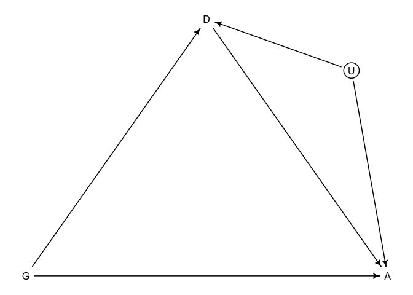<!-- -->

Let’s do a simulation of this scientific model

``` r
set.seed(17)
N <- 2000 # number of applicants

# even gender distribution
G <- sample(1:2, size = N, replace = TRUE)

# sample ability, binary - high(1) to average (0)
u <- rbern(N, 0.1)

# gender 1 tend to apply to department 1, 2 to 2
# and G = 1 with greater ability tend to apply to 2 as well
D <- rbern(N, ifelse(G == 1, u*0.5, 0.8)) + 1

# matrix of acceptance rates [dept, gender], separate by u
# dept 2 is the discriminatory department
accept_rate_u0 <- matrix(c(0.1, 0.1, 0.1, 0.3), nrow = 2)
accept_rate_u1 <- matrix(c(0.2, 0.3, 0.2, 0.5), nrow = 2)

# simulate acceptance
p <- sapply(1:N, function(i) ifelse(u[i] == 0, 
                                    accept_rate_u0[D[i], G[i]],
                                    accept_rate_u1[D[i], G[i]])
            )
A <- rbern(N, p)
```

Fit a statistical models to this data

``` r
# clean dataset
dat_sim <- list(A = A, D = D, G = G)

# total effect of gender
m1 <- ulam(
  alist(
    A ~ bernoulli(p),
    logit(p) <- a[G],
    a[G] ~ normal(0, 1)
  ), data = dat_sim, chains = 4, cores = 4
)
```

    ## Running MCMC with 4 parallel chains, with 1 thread(s) per chain...
    ## 
    ## Chain 1 Iteration:   1 / 1000 [  0%]  (Warmup) 
    ## Chain 1 Iteration: 100 / 1000 [ 10%]  (Warmup) 
    ## Chain 2 Iteration:   1 / 1000 [  0%]  (Warmup) 
    ## Chain 2 Iteration: 100 / 1000 [ 10%]  (Warmup) 
    ## Chain 3 Iteration:   1 / 1000 [  0%]  (Warmup) 
    ## Chain 3 Iteration: 100 / 1000 [ 10%]  (Warmup) 
    ## Chain 4 Iteration:   1 / 1000 [  0%]  (Warmup) 
    ## Chain 4 Iteration: 100 / 1000 [ 10%]  (Warmup) 
    ## Chain 1 Iteration: 200 / 1000 [ 20%]  (Warmup) 
    ## Chain 2 Iteration: 200 / 1000 [ 20%]  (Warmup) 
    ## Chain 3 Iteration: 200 / 1000 [ 20%]  (Warmup) 
    ## Chain 4 Iteration: 200 / 1000 [ 20%]  (Warmup) 
    ## Chain 1 Iteration: 300 / 1000 [ 30%]  (Warmup) 
    ## Chain 2 Iteration: 300 / 1000 [ 30%]  (Warmup) 
    ## Chain 3 Iteration: 300 / 1000 [ 30%]  (Warmup) 
    ## Chain 4 Iteration: 300 / 1000 [ 30%]  (Warmup) 
    ## Chain 1 Iteration: 400 / 1000 [ 40%]  (Warmup) 
    ## Chain 2 Iteration: 400 / 1000 [ 40%]  (Warmup) 
    ## Chain 3 Iteration: 400 / 1000 [ 40%]  (Warmup) 
    ## Chain 4 Iteration: 400 / 1000 [ 40%]  (Warmup) 
    ## Chain 1 Iteration: 500 / 1000 [ 50%]  (Warmup) 
    ## Chain 1 Iteration: 501 / 1000 [ 50%]  (Sampling) 
    ## Chain 3 Iteration: 500 / 1000 [ 50%]  (Warmup) 
    ## Chain 1 Iteration: 600 / 1000 [ 60%]  (Sampling) 
    ## Chain 2 Iteration: 500 / 1000 [ 50%]  (Warmup) 
    ## Chain 2 Iteration: 501 / 1000 [ 50%]  (Sampling) 
    ## Chain 3 Iteration: 501 / 1000 [ 50%]  (Sampling) 
    ## Chain 3 Iteration: 600 / 1000 [ 60%]  (Sampling) 
    ## Chain 4 Iteration: 500 / 1000 [ 50%]  (Warmup) 
    ## Chain 4 Iteration: 501 / 1000 [ 50%]  (Sampling) 
    ## Chain 1 Iteration: 700 / 1000 [ 70%]  (Sampling) 
    ## Chain 2 Iteration: 600 / 1000 [ 60%]  (Sampling) 
    ## Chain 3 Iteration: 700 / 1000 [ 70%]  (Sampling) 
    ## Chain 4 Iteration: 600 / 1000 [ 60%]  (Sampling) 
    ## Chain 1 Iteration: 800 / 1000 [ 80%]  (Sampling) 
    ## Chain 2 Iteration: 700 / 1000 [ 70%]  (Sampling) 
    ## Chain 3 Iteration: 800 / 1000 [ 80%]  (Sampling) 
    ## Chain 4 Iteration: 700 / 1000 [ 70%]  (Sampling) 
    ## Chain 1 Iteration: 900 / 1000 [ 90%]  (Sampling) 
    ## Chain 2 Iteration: 800 / 1000 [ 80%]  (Sampling) 
    ## Chain 3 Iteration: 900 / 1000 [ 90%]  (Sampling) 
    ## Chain 4 Iteration: 800 / 1000 [ 80%]  (Sampling) 
    ## Chain 1 Iteration: 1000 / 1000 [100%]  (Sampling) 
    ## Chain 2 Iteration: 900 / 1000 [ 90%]  (Sampling) 
    ## Chain 2 Iteration: 1000 / 1000 [100%]  (Sampling) 
    ## Chain 3 Iteration: 1000 / 1000 [100%]  (Sampling) 
    ## Chain 4 Iteration: 900 / 1000 [ 90%]  (Sampling) 
    ## Chain 1 finished in 1.2 seconds.
    ## Chain 2 finished in 1.2 seconds.
    ## Chain 3 finished in 1.1 seconds.
    ## Chain 4 Iteration: 1000 / 1000 [100%]  (Sampling) 
    ## Chain 4 finished in 1.2 seconds.
    ## 
    ## All 4 chains finished successfully.
    ## Mean chain execution time: 1.2 seconds.
    ## Total execution time: 1.4 seconds.

``` r
# direct effect - now confounded
m2 <- ulam(
  alist(
    A ~ bernoulli(p),
    logit(p) <- a[G, D],
    matrix[G,D]:a ~ normal(0, 1)
  ), data = dat_sim, chains = 4, cores = 4
)
```

    ## Running MCMC with 4 parallel chains, with 1 thread(s) per chain...
    ## 
    ## Chain 1 Iteration:   1 / 1000 [  0%]  (Warmup) 
    ## Chain 2 Iteration:   1 / 1000 [  0%]  (Warmup) 
    ## Chain 3 Iteration:   1 / 1000 [  0%]  (Warmup) 
    ## Chain 4 Iteration:   1 / 1000 [  0%]  (Warmup) 
    ## Chain 1 Iteration: 100 / 1000 [ 10%]  (Warmup) 
    ## Chain 2 Iteration: 100 / 1000 [ 10%]  (Warmup) 
    ## Chain 3 Iteration: 100 / 1000 [ 10%]  (Warmup) 
    ## Chain 4 Iteration: 100 / 1000 [ 10%]  (Warmup) 
    ## Chain 1 Iteration: 200 / 1000 [ 20%]  (Warmup) 
    ## Chain 3 Iteration: 200 / 1000 [ 20%]  (Warmup) 
    ## Chain 4 Iteration: 200 / 1000 [ 20%]  (Warmup) 
    ## Chain 1 Iteration: 300 / 1000 [ 30%]  (Warmup) 
    ## Chain 2 Iteration: 200 / 1000 [ 20%]  (Warmup) 
    ## Chain 3 Iteration: 300 / 1000 [ 30%]  (Warmup) 
    ## Chain 4 Iteration: 300 / 1000 [ 30%]  (Warmup) 
    ## Chain 1 Iteration: 400 / 1000 [ 40%]  (Warmup) 
    ## Chain 2 Iteration: 300 / 1000 [ 30%]  (Warmup) 
    ## Chain 2 Iteration: 400 / 1000 [ 40%]  (Warmup) 
    ## Chain 3 Iteration: 400 / 1000 [ 40%]  (Warmup) 
    ## Chain 4 Iteration: 400 / 1000 [ 40%]  (Warmup) 
    ## Chain 1 Iteration: 500 / 1000 [ 50%]  (Warmup) 
    ## Chain 1 Iteration: 501 / 1000 [ 50%]  (Sampling) 
    ## Chain 3 Iteration: 500 / 1000 [ 50%]  (Warmup) 
    ## Chain 3 Iteration: 501 / 1000 [ 50%]  (Sampling) 
    ## Chain 4 Iteration: 500 / 1000 [ 50%]  (Warmup) 
    ## Chain 4 Iteration: 501 / 1000 [ 50%]  (Sampling) 
    ## Chain 1 Iteration: 600 / 1000 [ 60%]  (Sampling) 
    ## Chain 2 Iteration: 500 / 1000 [ 50%]  (Warmup) 
    ## Chain 2 Iteration: 501 / 1000 [ 50%]  (Sampling) 
    ## Chain 1 Iteration: 700 / 1000 [ 70%]  (Sampling) 
    ## Chain 2 Iteration: 600 / 1000 [ 60%]  (Sampling) 
    ## Chain 3 Iteration: 600 / 1000 [ 60%]  (Sampling) 
    ## Chain 4 Iteration: 600 / 1000 [ 60%]  (Sampling) 
    ## Chain 3 Iteration: 700 / 1000 [ 70%]  (Sampling) 
    ## Chain 4 Iteration: 700 / 1000 [ 70%]  (Sampling) 
    ## Chain 1 Iteration: 800 / 1000 [ 80%]  (Sampling) 
    ## Chain 2 Iteration: 700 / 1000 [ 70%]  (Sampling) 
    ## Chain 3 Iteration: 800 / 1000 [ 80%]  (Sampling) 
    ## Chain 4 Iteration: 800 / 1000 [ 80%]  (Sampling) 
    ## Chain 1 Iteration: 900 / 1000 [ 90%]  (Sampling) 
    ## Chain 2 Iteration: 800 / 1000 [ 80%]  (Sampling) 
    ## Chain 1 Iteration: 1000 / 1000 [100%]  (Sampling) 
    ## Chain 2 Iteration: 900 / 1000 [ 90%]  (Sampling) 
    ## Chain 3 Iteration: 900 / 1000 [ 90%]  (Sampling) 
    ## Chain 4 Iteration: 900 / 1000 [ 90%]  (Sampling) 
    ## Chain 1 finished in 1.5 seconds.
    ## Chain 2 Iteration: 1000 / 1000 [100%]  (Sampling) 
    ## Chain 3 Iteration: 1000 / 1000 [100%]  (Sampling) 
    ## Chain 4 Iteration: 1000 / 1000 [100%]  (Sampling) 
    ## Chain 2 finished in 1.6 seconds.
    ## Chain 3 finished in 1.5 seconds.
    ## Chain 4 finished in 1.5 seconds.
    ## 
    ## All 4 chains finished successfully.
    ## Mean chain execution time: 1.5 seconds.
    ## Total execution time: 1.6 seconds.

To see how the confounder affects the results, let’s do some posterior
contrasts

``` r
post2 <- extract.samples(m2)

# contrasts on a log odds scale
post2$fm_contrast_D1 <- post2$a[,1,1] - post2$a[,2,1]
post2$fm_contrast_D2 <- post2$a[,1,2] - post2$a[,2,2]
dens(post2$fm_contrast_D1, lwd = 2, col = 2)
dens(post2$fm_contrast_D2, lwd = 2, col = 4, add = TRUE)
abline(v = 0, lty = 2)
```

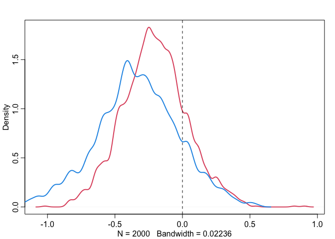<!-- -->

In both departments, gender 1 has a slight disadvantage. But from the
simulation we know only department 2 is discriminatory. This can be
understood in this way: high ability women apply to department anyway,
and they are still able to be admitted. So, stratifying by department
hides the evidence for gender discrimination.

If we are able to measure u:

``` r
# direct effect - unconfounded
dat_sim$u <- u
m3 <- ulam(
  alist(
    A ~ bernoulli(p),
    logit(p) <- a[G, D] + buA*u,
    matrix[G,D]:a ~ normal(0, 1),
    buA ~ normal(0, 1)
  ), data = dat_sim, chains = 4, cores = 4
)
```

    ## Running MCMC with 4 parallel chains, with 1 thread(s) per chain...
    ## 
    ## Chain 1 Iteration:   1 / 1000 [  0%]  (Warmup) 
    ## Chain 2 Iteration:   1 / 1000 [  0%]  (Warmup) 
    ## Chain 3 Iteration:   1 / 1000 [  0%]  (Warmup) 
    ## Chain 4 Iteration:   1 / 1000 [  0%]  (Warmup) 
    ## Chain 1 Iteration: 100 / 1000 [ 10%]  (Warmup) 
    ## Chain 2 Iteration: 100 / 1000 [ 10%]  (Warmup) 
    ## Chain 3 Iteration: 100 / 1000 [ 10%]  (Warmup) 
    ## Chain 4 Iteration: 100 / 1000 [ 10%]  (Warmup) 
    ## Chain 1 Iteration: 200 / 1000 [ 20%]  (Warmup) 
    ## Chain 2 Iteration: 200 / 1000 [ 20%]  (Warmup) 
    ## Chain 4 Iteration: 200 / 1000 [ 20%]  (Warmup) 
    ## Chain 3 Iteration: 200 / 1000 [ 20%]  (Warmup) 
    ## Chain 1 Iteration: 300 / 1000 [ 30%]  (Warmup) 
    ## Chain 4 Iteration: 300 / 1000 [ 30%]  (Warmup) 
    ## Chain 2 Iteration: 300 / 1000 [ 30%]  (Warmup) 
    ## Chain 3 Iteration: 300 / 1000 [ 30%]  (Warmup) 
    ## Chain 1 Iteration: 400 / 1000 [ 40%]  (Warmup) 
    ## Chain 2 Iteration: 400 / 1000 [ 40%]  (Warmup) 
    ## Chain 3 Iteration: 400 / 1000 [ 40%]  (Warmup) 
    ## Chain 4 Iteration: 400 / 1000 [ 40%]  (Warmup) 
    ## Chain 1 Iteration: 500 / 1000 [ 50%]  (Warmup) 
    ## Chain 1 Iteration: 501 / 1000 [ 50%]  (Sampling) 
    ## Chain 2 Iteration: 500 / 1000 [ 50%]  (Warmup) 
    ## Chain 2 Iteration: 501 / 1000 [ 50%]  (Sampling) 
    ## Chain 3 Iteration: 500 / 1000 [ 50%]  (Warmup) 
    ## Chain 3 Iteration: 501 / 1000 [ 50%]  (Sampling) 
    ## Chain 4 Iteration: 500 / 1000 [ 50%]  (Warmup) 
    ## Chain 4 Iteration: 501 / 1000 [ 50%]  (Sampling) 
    ## Chain 1 Iteration: 600 / 1000 [ 60%]  (Sampling) 
    ## Chain 2 Iteration: 600 / 1000 [ 60%]  (Sampling) 
    ## Chain 3 Iteration: 600 / 1000 [ 60%]  (Sampling) 
    ## Chain 4 Iteration: 600 / 1000 [ 60%]  (Sampling) 
    ## Chain 1 Iteration: 700 / 1000 [ 70%]  (Sampling) 
    ## Chain 4 Iteration: 700 / 1000 [ 70%]  (Sampling) 
    ## Chain 1 Iteration: 800 / 1000 [ 80%]  (Sampling) 
    ## Chain 2 Iteration: 700 / 1000 [ 70%]  (Sampling) 
    ## Chain 3 Iteration: 700 / 1000 [ 70%]  (Sampling) 
    ## Chain 2 Iteration: 800 / 1000 [ 80%]  (Sampling) 
    ## Chain 3 Iteration: 800 / 1000 [ 80%]  (Sampling) 
    ## Chain 4 Iteration: 800 / 1000 [ 80%]  (Sampling) 
    ## Chain 1 Iteration: 900 / 1000 [ 90%]  (Sampling) 
    ## Chain 2 Iteration: 900 / 1000 [ 90%]  (Sampling) 
    ## Chain 3 Iteration: 900 / 1000 [ 90%]  (Sampling) 
    ## Chain 4 Iteration: 900 / 1000 [ 90%]  (Sampling) 
    ## Chain 1 Iteration: 1000 / 1000 [100%]  (Sampling) 
    ## Chain 1 finished in 2.7 seconds.
    ## Chain 2 Iteration: 1000 / 1000 [100%]  (Sampling) 
    ## Chain 3 Iteration: 1000 / 1000 [100%]  (Sampling) 
    ## Chain 4 Iteration: 1000 / 1000 [100%]  (Sampling) 
    ## Chain 2 finished in 2.8 seconds.
    ## Chain 3 finished in 2.8 seconds.
    ## Chain 4 finished in 2.8 seconds.
    ## 
    ## All 4 chains finished successfully.
    ## Mean chain execution time: 2.8 seconds.
    ## Total execution time: 2.9 seconds.

``` r
# posterior mean, against the results from m2
post3 <- extract.samples(m3)

# contrasts on a log odds scale
post3$fm_contrast_D1 <- post3$a[,1,1] - post3$a[,2,1]
post3$fm_contrast_D2 <- post3$a[,1,2] - post3$a[,2,2]
plot(NULL, xlim = c(-2,1), ylim = c(0,2),
     xlab = "F=M contrast in each department", ylab = "Density")
dens(post2$fm_contrast_D1, lwd = 1, col = 2, add = TRUE)
dens(post2$fm_contrast_D2, lwd = 1, col = 4, add = TRUE)
dens(post3$fm_contrast_D1, lwd = 3, col = 2, add = TRUE)
dens(post3$fm_contrast_D2, lwd = 3, col = 4, add = TRUE)
abline(v = 0, lty = 2)
```

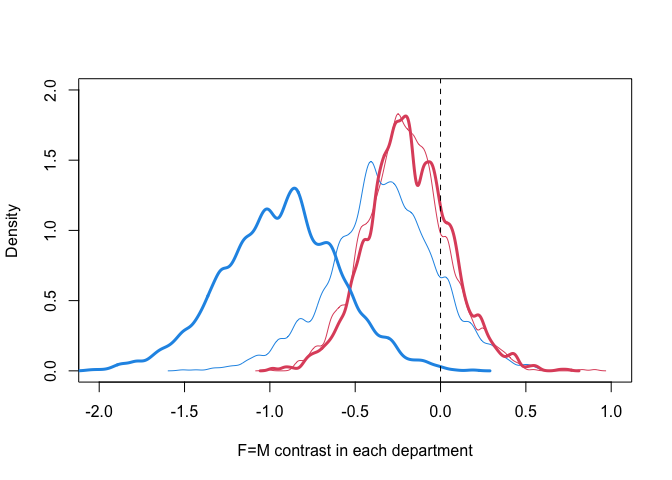<!-- -->

When the confounder is included, the estimates in department 2 becomes
accurate.

## De-confounding

We can’t always measure unobserved variables. There are some strategies
to deal with confounders:

-   Experiments
-   Sensitivity analysis
-   Measure proxies of confound

### Sensitivity analysis

What’s the implication of what we don’t know? How strong must the
confound be to substantially change our conclusion?

Practically, we assume confounders exist, and we add them to the model
and examine the consequences of different strengths/types. In the
example above, we model this:

")

![\mathrm{logit}(p_i) = \alpha\[G_i,D_i\] + \beta\_{G\[i\]} u_i](https://latex.codecogs.com/png.image?%5Cdpi%7B110%7D&space;%5Cbg_white&space;%5Cmathrm%7Blogit%7D%28p_i%29%20%3D%20%5Calpha%5BG_i%2CD_i%5D%20%2B%20%5Cbeta_%7BG%5Bi%5D%7D%20u_i "\mathrm{logit}(p_i) = \alpha[G_i,D_i] + \beta_{G[i]} u_i")

Simultaneously, we also need to model the effect of u on D

 \sim \mathrm{Bernoulli}(q_i)")

![\mathrm{logit}(q_i) = \delta\[G_i\] + \gamma\_{G\[i\]} u_i](https://latex.codecogs.com/png.image?%5Cdpi%7B110%7D&space;%5Cbg_white&space;%5Cmathrm%7Blogit%7D%28q_i%29%20%3D%20%5Cdelta%5BG_i%5D%20%2B%20%5Cgamma_%7BG%5Bi%5D%7D%20u_i "\mathrm{logit}(q_i) = \delta[G_i] + \gamma_{G[i]} u_i")

``` r
# this code converts UCBadmit to long format (logistic format)
data("UCBadmit")
d <- UCBadmit
dat_long1 <- uncount( d , admit )
dat_long1$Y <- 1
dat_long1$reject <- NULL
dat_long0 <- uncount( d , reject )
dat_long0$Y <- 0
dat_long0$admit <- NULL
dat_long01 <- rbind( dat_long1 , dat_long0 )
dat_long01$applications <- NULL
dat_long01$admit <- dat_long01$Y
dat_long01$Y <- NULL

# a clean dataset
datl <- list(
    A = dat_long01$admit,
    G = ifelse(dat_long01$applicant.gender=="female",1,2),
    D = as.integer(dat_long01$dept)
)

datl$D1 <- ifelse(datl$D==1,1,0)
datl$N <- length(datl$D)
# we assign values to these parameters (since we can't estimate them)
datl$b <- c(1,1)
datl$g <- c(1,0)

# fit a model
mGDu <- ulam(
  alist(
    # A model
    A ~ bernoulli(p),
    logit(p) <- a[G, D] + b[G]*u[i],
    matrix[G,D]:a ~ normal(0, 1),
    
    # D model
    D1 ~ bernoulli(q),
    logit(q) <- delta[G] + g[G]*u[i],
    delta[G] ~ normal(0, 1),
    
    # declare unobserved u
    # one u value for each observation
    # u is parameter in this model
    vector[N]:u ~ normal(0, 1)
  ), data = datl, chains = 4, cores = 4
)
```

    ## Running MCMC with 4 parallel chains, with 1 thread(s) per chain...
    ## 
    ## Chain 1 Iteration:   1 / 1000 [  0%]  (Warmup) 
    ## Chain 2 Iteration:   1 / 1000 [  0%]  (Warmup) 
    ## Chain 3 Iteration:   1 / 1000 [  0%]  (Warmup) 
    ## Chain 4 Iteration:   1 / 1000 [  0%]  (Warmup) 
    ## Chain 2 Iteration: 100 / 1000 [ 10%]  (Warmup) 
    ## Chain 1 Iteration: 100 / 1000 [ 10%]  (Warmup) 
    ## Chain 4 Iteration: 100 / 1000 [ 10%]  (Warmup) 
    ## Chain 3 Iteration: 100 / 1000 [ 10%]  (Warmup) 
    ## Chain 2 Iteration: 200 / 1000 [ 20%]  (Warmup) 
    ## Chain 1 Iteration: 200 / 1000 [ 20%]  (Warmup) 
    ## Chain 4 Iteration: 200 / 1000 [ 20%]  (Warmup) 
    ## Chain 3 Iteration: 200 / 1000 [ 20%]  (Warmup) 
    ## Chain 2 Iteration: 300 / 1000 [ 30%]  (Warmup) 
    ## Chain 1 Iteration: 300 / 1000 [ 30%]  (Warmup) 
    ## Chain 3 Iteration: 300 / 1000 [ 30%]  (Warmup) 
    ## Chain 4 Iteration: 300 / 1000 [ 30%]  (Warmup) 
    ## Chain 2 Iteration: 400 / 1000 [ 40%]  (Warmup) 
    ## Chain 3 Iteration: 400 / 1000 [ 40%]  (Warmup) 
    ## Chain 1 Iteration: 400 / 1000 [ 40%]  (Warmup) 
    ## Chain 4 Iteration: 400 / 1000 [ 40%]  (Warmup) 
    ## Chain 2 Iteration: 500 / 1000 [ 50%]  (Warmup) 
    ## Chain 2 Iteration: 501 / 1000 [ 50%]  (Sampling) 
    ## Chain 3 Iteration: 500 / 1000 [ 50%]  (Warmup) 
    ## Chain 3 Iteration: 501 / 1000 [ 50%]  (Sampling) 
    ## Chain 1 Iteration: 500 / 1000 [ 50%]  (Warmup) 
    ## Chain 4 Iteration: 500 / 1000 [ 50%]  (Warmup) 
    ## Chain 1 Iteration: 501 / 1000 [ 50%]  (Sampling) 
    ## Chain 4 Iteration: 501 / 1000 [ 50%]  (Sampling) 
    ## Chain 2 Iteration: 600 / 1000 [ 60%]  (Sampling) 
    ## Chain 3 Iteration: 600 / 1000 [ 60%]  (Sampling) 
    ## Chain 1 Iteration: 600 / 1000 [ 60%]  (Sampling) 
    ## Chain 4 Iteration: 600 / 1000 [ 60%]  (Sampling) 
    ## Chain 2 Iteration: 700 / 1000 [ 70%]  (Sampling) 
    ## Chain 3 Iteration: 700 / 1000 [ 70%]  (Sampling) 
    ## Chain 1 Iteration: 700 / 1000 [ 70%]  (Sampling) 
    ## Chain 4 Iteration: 700 / 1000 [ 70%]  (Sampling) 
    ## Chain 2 Iteration: 800 / 1000 [ 80%]  (Sampling) 
    ## Chain 3 Iteration: 800 / 1000 [ 80%]  (Sampling) 
    ## Chain 1 Iteration: 800 / 1000 [ 80%]  (Sampling) 
    ## Chain 4 Iteration: 800 / 1000 [ 80%]  (Sampling) 
    ## Chain 2 Iteration: 900 / 1000 [ 90%]  (Sampling) 
    ## Chain 3 Iteration: 900 / 1000 [ 90%]  (Sampling) 
    ## Chain 1 Iteration: 900 / 1000 [ 90%]  (Sampling) 
    ## Chain 4 Iteration: 900 / 1000 [ 90%]  (Sampling) 
    ## Chain 2 Iteration: 1000 / 1000 [100%]  (Sampling) 
    ## Chain 2 finished in 108.2 seconds.
    ## Chain 3 Iteration: 1000 / 1000 [100%]  (Sampling) 
    ## Chain 3 finished in 110.1 seconds.
    ## Chain 1 Iteration: 1000 / 1000 [100%]  (Sampling) 
    ## Chain 4 Iteration: 1000 / 1000 [100%]  (Sampling) 
    ## Chain 1 finished in 111.9 seconds.
    ## Chain 4 finished in 111.8 seconds.
    ## 
    ## All 4 chains finished successfully.
    ## Mean chain execution time: 110.5 seconds.
    ## Total execution time: 112.0 seconds.

Let’s choose department A and plot the posterior mean of F-M contrast.

``` r
# original model contrast
postGD <- extract.samples(mGD)
fm_contrast_A <- postGD$a[,1,1] - postGD$a[,2,1]

# estimating the impact of u
postGDu <- extract.samples(mGDu)
fm_contrast_Au <- postGDu$a[,1,1] - postGDu$a[,2,1]
plot(NULL, xlim = c(-1,2), ylim = c(0,2),
     xlab = "F-M contrast in department A", ylab = "Density")
dens(fm_contrast_A, add = TRUE)
dens(fm_contrast_Au, lwd = 3, col = "tomato", add = TRUE)
abline(v = 0, lty = 2)
```

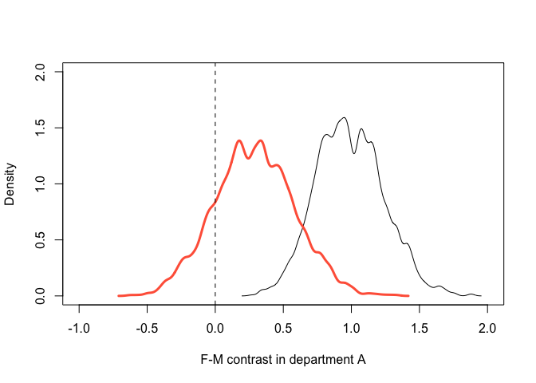<!-- -->

When unobserved variable ability is included, the difference between men
and women in department A decreases. We can tune the strength of the
parameter assigned to simulate the unobserved variable to push the
effect entirely negative.

### Measure proxies

We can measure decendents of the unobserved variables to infer them
(with error). In our example, they can be test scores measuring ability.

``` r
dag2 <- dagitty("dag{ 
                U[unobserved]
                G -> D; D -> A <- G; U -> D; U -> A;
                U -> T1; U -> T2}")
coordinates(dag2) <- list(x = c(G = 0, D = 0.5, A = 1, U = 0.8, T1 = 0.8, T2 = 0.95),
                          y = c(G = 1, D = 0, A = 1, U = 0.3, T1 = 0.1, T2 = 0.3))
drawdag(dag2)
```

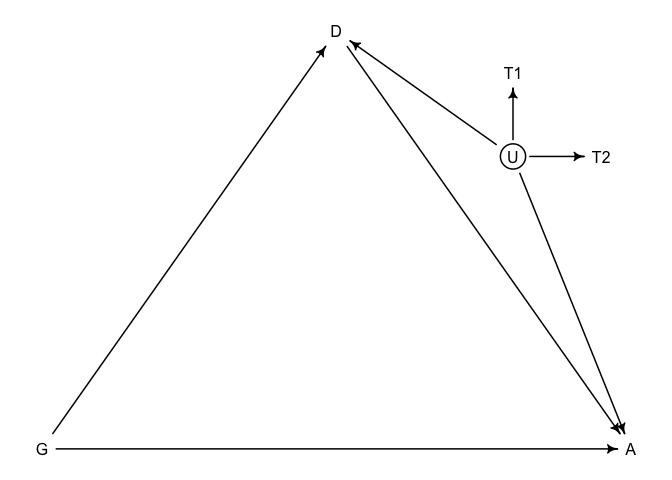<!-- -->

We can model test scores together with other predictors:

")

![\mathrm{logit}(p_i) = \alpha\[G_i,D_i\] + \beta\_{G\[i\]} u_i](https://latex.codecogs.com/png.image?%5Cdpi%7B110%7D&space;%5Cbg_white&space;%5Cmathrm%7Blogit%7D%28p_i%29%20%3D%20%5Calpha%5BG_i%2CD_i%5D%20%2B%20%5Cbeta_%7BG%5Bi%5D%7D%20u_i "\mathrm{logit}(p_i) = \alpha[G_i,D_i] + \beta_{G[i]} u_i")

Simultaneously, we also need to model u and T:

")

")

``` r
dat_sim$T1 <- rnorm(N, u, 0.1)
dat_sim$T2 <- rnorm(N, u, 0.5)
dat_sim$T3 <- rnorm(N, u, 0.25)

m4 <- ulam(
  alist(
    # A model
    A ~ bernoulli(p),
    logit(p) <- a[G, D] + b*u[i],
    matrix[G,D]:a ~ normal(0, 1),
    b ~ normal(0,1),
    
    # u and T model
    vector[N]:u ~ normal(0,1),
    T1 ~ normal(u, tau[1]),
    T2 ~ normal(u, tau[2]),
    T3 ~ normal(u, tau[3]),
    vector[3]:tau ~ exponential(1)
  ), data = dat_sim, chains = 4, cores = 4,
  constraints = list(b = "lower=0")
)
```

    ## Running MCMC with 4 parallel chains, with 1 thread(s) per chain...
    ## 
    ## Chain 1 Iteration:   1 / 1000 [  0%]  (Warmup) 
    ## Chain 2 Iteration:   1 / 1000 [  0%]  (Warmup) 
    ## Chain 3 Iteration:   1 / 1000 [  0%]  (Warmup) 
    ## Chain 4 Iteration:   1 / 1000 [  0%]  (Warmup) 
    ## Chain 1 Iteration: 100 / 1000 [ 10%]  (Warmup) 
    ## Chain 4 Iteration: 100 / 1000 [ 10%]  (Warmup) 
    ## Chain 1 Iteration: 200 / 1000 [ 20%]  (Warmup) 
    ## Chain 2 Iteration: 100 / 1000 [ 10%]  (Warmup) 
    ## Chain 3 Iteration: 100 / 1000 [ 10%]  (Warmup) 
    ## Chain 1 Iteration: 300 / 1000 [ 30%]  (Warmup) 
    ## Chain 4 Iteration: 200 / 1000 [ 20%]  (Warmup) 
    ## Chain 3 Iteration: 200 / 1000 [ 20%]  (Warmup) 
    ## Chain 2 Iteration: 200 / 1000 [ 20%]  (Warmup) 
    ## Chain 4 Iteration: 300 / 1000 [ 30%]  (Warmup) 
    ## Chain 1 Iteration: 400 / 1000 [ 40%]  (Warmup) 
    ## Chain 3 Iteration: 300 / 1000 [ 30%]  (Warmup) 
    ## Chain 1 Iteration: 500 / 1000 [ 50%]  (Warmup) 
    ## Chain 1 Iteration: 501 / 1000 [ 50%]  (Sampling) 
    ## Chain 4 Iteration: 400 / 1000 [ 40%]  (Warmup) 
    ## Chain 3 Iteration: 400 / 1000 [ 40%]  (Warmup) 
    ## Chain 2 Iteration: 300 / 1000 [ 30%]  (Warmup) 
    ## Chain 1 Iteration: 600 / 1000 [ 60%]  (Sampling) 
    ## Chain 3 Iteration: 500 / 1000 [ 50%]  (Warmup) 
    ## Chain 3 Iteration: 501 / 1000 [ 50%]  (Sampling) 
    ## Chain 4 Iteration: 500 / 1000 [ 50%]  (Warmup) 
    ## Chain 4 Iteration: 501 / 1000 [ 50%]  (Sampling) 
    ## Chain 2 Iteration: 400 / 1000 [ 40%]  (Warmup) 
    ## Chain 3 Iteration: 600 / 1000 [ 60%]  (Sampling) 
    ## Chain 1 Iteration: 700 / 1000 [ 70%]  (Sampling) 
    ## Chain 4 Iteration: 600 / 1000 [ 60%]  (Sampling) 
    ## Chain 3 Iteration: 700 / 1000 [ 70%]  (Sampling) 
    ## Chain 1 Iteration: 800 / 1000 [ 80%]  (Sampling) 
    ## Chain 2 Iteration: 500 / 1000 [ 50%]  (Warmup) 
    ## Chain 2 Iteration: 501 / 1000 [ 50%]  (Sampling) 
    ## Chain 3 Iteration: 800 / 1000 [ 80%]  (Sampling) 
    ## Chain 4 Iteration: 700 / 1000 [ 70%]  (Sampling) 
    ## Chain 1 Iteration: 900 / 1000 [ 90%]  (Sampling) 
    ## Chain 3 Iteration: 900 / 1000 [ 90%]  (Sampling) 
    ## Chain 2 Iteration: 600 / 1000 [ 60%]  (Sampling) 
    ## Chain 4 Iteration: 800 / 1000 [ 80%]  (Sampling) 
    ## Chain 3 Iteration: 1000 / 1000 [100%]  (Sampling) 
    ## Chain 3 finished in 5.8 seconds.
    ## Chain 1 Iteration: 1000 / 1000 [100%]  (Sampling) 
    ## Chain 1 finished in 5.9 seconds.
    ## Chain 2 Iteration: 700 / 1000 [ 70%]  (Sampling) 
    ## Chain 4 Iteration: 900 / 1000 [ 90%]  (Sampling) 
    ## Chain 2 Iteration: 800 / 1000 [ 80%]  (Sampling) 
    ## Chain 4 Iteration: 1000 / 1000 [100%]  (Sampling) 
    ## Chain 4 finished in 6.2 seconds.
    ## Chain 2 Iteration: 900 / 1000 [ 90%]  (Sampling) 
    ## Chain 2 Iteration: 1000 / 1000 [100%]  (Sampling) 
    ## Chain 2 finished in 6.6 seconds.
    ## 
    ## All 4 chains finished successfully.
    ## Mean chain execution time: 6.1 seconds.
    ## Total execution time: 6.7 seconds.

``` r
# posterior mean, against the results from m2
post4 <- extract.samples(m4)

# contrasts on a log odds scale
post4$fm_contrast_D1 <- post4$a[,1,1] - post4$a[,2,1]
post4$fm_contrast_D2 <- post4$a[,1,2] - post4$a[,2,2]
plot(NULL, xlim = c(-2,1), ylim = c(0,2),
     xlab = "F=M contrast in each department", ylab = "Density")
dens(post2$fm_contrast_D1, lwd = 1, col = 2, add = TRUE)
dens(post2$fm_contrast_D2, lwd = 1, col = 4, add = TRUE)
dens(post4$fm_contrast_D1, lwd = 3, col = 2, add = TRUE)
dens(post4$fm_contrast_D2, lwd = 3, col = 4, add = TRUE)
abline(v = 0, lty = 2)
```

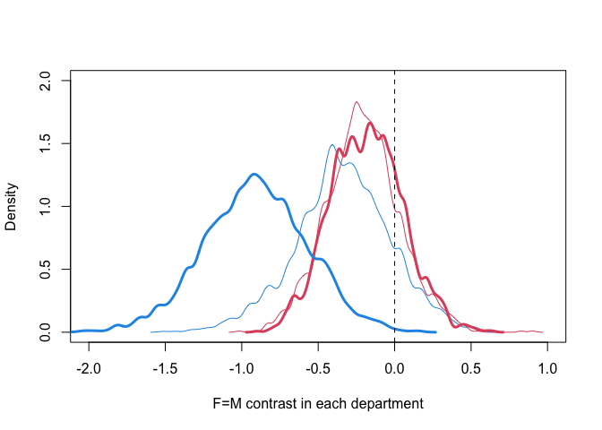<!-- -->

When we add proxies to the model, it gives a better estimate on gender
differences in each department, which is close to the true difference.

## Poisson regression

Poisson regression models the outcome variable using Poisson
distribution:

")


is both the expectation and variance of this distribution.

We will use Poisson regression to fit the Oceanic tool complexity data.
We will look for three things using a Poisson GLM:

1.  The number of tools increases with population size
2.  The number of tools increases with contact rates among islands
3.  The impact of population on tool counts is moderated by contact.

``` r
data("Kline")
d <- Kline
d
```

    ##       culture population contact total_tools mean_TU
    ## 1    Malekula       1100     low          13     3.2
    ## 2     Tikopia       1500     low          22     4.7
    ## 3  Santa Cruz       3600     low          24     4.0
    ## 4         Yap       4791    high          43     5.0
    ## 5    Lau Fiji       7400    high          33     5.0
    ## 6   Trobriand       8000    high          19     4.0
    ## 7       Chuuk       9200    high          40     3.8
    ## 8       Manus      13000     low          28     6.6
    ## 9       Tonga      17500    high          55     5.4
    ## 10     Hawaii     275000     low          71     6.6

``` r
# standardize variables
d$P <- scale(log(d$population))
d$contact_id <- ifelse(d$contact == "high", 2, 1)
```

In math form, our model looks like this:

")

![\log \lambda_i = \alpha\_{CID\[i\]} + \beta\_{CID\[i\]} \log P_i](https://latex.codecogs.com/png.image?%5Cdpi%7B110%7D&space;%5Cbg_white&space;%5Clog%20%5Clambda_i%20%3D%20%5Calpha_%7BCID%5Bi%5D%7D%20%2B%20%5Cbeta_%7BCID%5Bi%5D%7D%20%5Clog%20P_i "\log \lambda_i = \alpha_{CID[i]} + \beta_{CID[i]} \log P_i")

We need to choose priors for alpha and beta.

``` r
# when the model only contains alpha: log(lambda) = a
plot(NULL, xlab = "mean number of tools", ylab = "Density",
     xlim = c(0,100), ylim = c(0,0.08))
# a flat prior: a ~ normal(0, 10)
curve(dlnorm(x, 0, 10), from = 0, to = 100, 
      n = 200, lwd = 2, add = TRUE)
# a weakly regularizing prior
curve(dlnorm(x, 3, 0.5), from = 0, to = 100, 
      n = 200, lwd = 2, col = "tomato", add = TRUE)
```

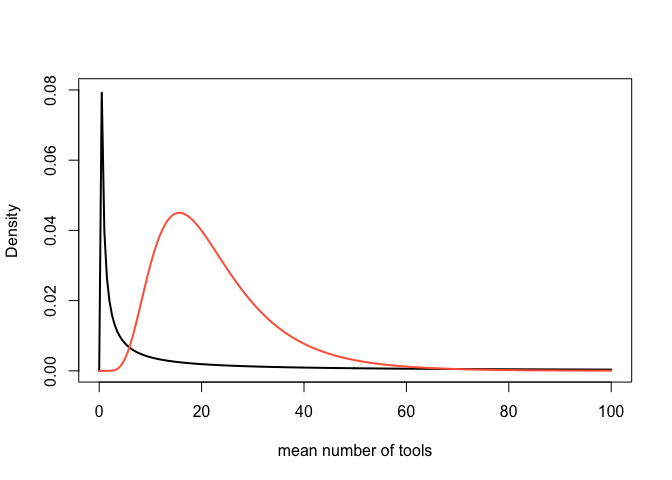<!-- -->

The flat prior has a peak around 0 and a very long tail. This makes it
has a mode of small value but a very large mean. And it is important to
note that negative values from a normal distribution is mapped onto the
interval from 0 to 1 on a log normal distribution. Be careful in
choosing priors with a log normal distribution.

Let’s choose priors for beta

``` r
# model: log(lambda) = a + b*log(P)
N <- 100
a <- rnorm(N, 3, 0.5)
b <- rnorm(N, 0, 10) # a flat prior
plot(NULL, xlim = c(-2, 2), ylim = c(0, 100),
     xlab = "log population size (std)", ylab = "mean tool numbers")
for (i in 1:N) curve(exp(a[i] + b[i]*x), from = -2, to = 2, 
                       col = col.alpha("black", 0.3), add = TRUE)
```

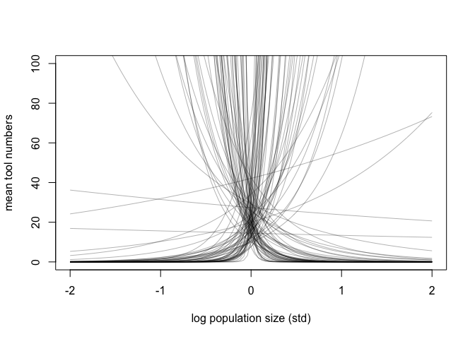<!-- -->

``` r
# a weakly regularizing prior
b <- rnorm(N, 0, 0.2) 
plot(NULL, xlim = c(-2, 2), ylim = c(0, 100),
     xlab = "log population size (std)", ylab = "mean tool numbers")
for (i in 1:N) curve(exp(a[i] + b[i]*x), from = -2, to = 2, 
                       col = col.alpha("black", 0.3), add = TRUE)
```

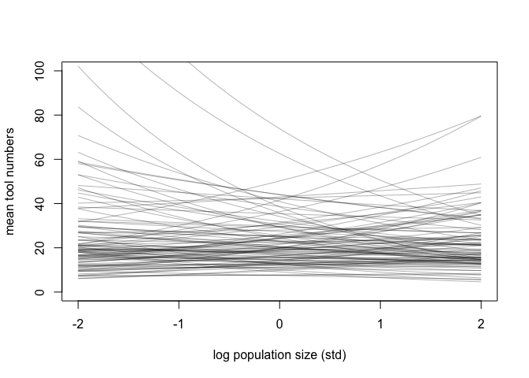<!-- -->

The flat prior can create explosive growth or decay in the outcome
variable, which doesn’t make sense - the change in log pop size won’t
create a massive increase or decrease in the number of tools. So we
choose to use a more regularized one.

Fit official models

``` r
dat <- list(
  T = d$total_tools,
  P = d$P,
  cid = d$contact_id
)

# intercept only
m11.9 <- ulam(
  alist(
    T ~ dpois(lambda),
    log(lambda) <- a,
    a ~ dnorm(3, 0.5)
  ), 
  data = dat, chains = 4, cores = 4, log_lik = TRUE
)
```

    ## Running MCMC with 4 parallel chains, with 1 thread(s) per chain...
    ## 
    ## Chain 1 Iteration:   1 / 1000 [  0%]  (Warmup) 
    ## Chain 1 Iteration: 100 / 1000 [ 10%]  (Warmup) 
    ## Chain 1 Iteration: 200 / 1000 [ 20%]  (Warmup) 
    ## Chain 1 Iteration: 300 / 1000 [ 30%]  (Warmup) 
    ## Chain 1 Iteration: 400 / 1000 [ 40%]  (Warmup) 
    ## Chain 1 Iteration: 500 / 1000 [ 50%]  (Warmup) 
    ## Chain 1 Iteration: 501 / 1000 [ 50%]  (Sampling) 
    ## Chain 1 Iteration: 600 / 1000 [ 60%]  (Sampling) 
    ## Chain 1 Iteration: 700 / 1000 [ 70%]  (Sampling) 
    ## Chain 1 Iteration: 800 / 1000 [ 80%]  (Sampling) 
    ## Chain 1 Iteration: 900 / 1000 [ 90%]  (Sampling) 
    ## Chain 1 Iteration: 1000 / 1000 [100%]  (Sampling) 
    ## Chain 2 Iteration:   1 / 1000 [  0%]  (Warmup) 
    ## Chain 2 Iteration: 100 / 1000 [ 10%]  (Warmup) 
    ## Chain 2 Iteration: 200 / 1000 [ 20%]  (Warmup) 
    ## Chain 2 Iteration: 300 / 1000 [ 30%]  (Warmup) 
    ## Chain 2 Iteration: 400 / 1000 [ 40%]  (Warmup) 
    ## Chain 2 Iteration: 500 / 1000 [ 50%]  (Warmup) 
    ## Chain 2 Iteration: 501 / 1000 [ 50%]  (Sampling) 
    ## Chain 2 Iteration: 600 / 1000 [ 60%]  (Sampling) 
    ## Chain 2 Iteration: 700 / 1000 [ 70%]  (Sampling) 
    ## Chain 2 Iteration: 800 / 1000 [ 80%]  (Sampling) 
    ## Chain 2 Iteration: 900 / 1000 [ 90%]  (Sampling) 
    ## Chain 2 Iteration: 1000 / 1000 [100%]  (Sampling) 
    ## Chain 3 Iteration:   1 / 1000 [  0%]  (Warmup) 
    ## Chain 3 Iteration: 100 / 1000 [ 10%]  (Warmup) 
    ## Chain 3 Iteration: 200 / 1000 [ 20%]  (Warmup) 
    ## Chain 3 Iteration: 300 / 1000 [ 30%]  (Warmup) 
    ## Chain 3 Iteration: 400 / 1000 [ 40%]  (Warmup) 
    ## Chain 3 Iteration: 500 / 1000 [ 50%]  (Warmup) 
    ## Chain 3 Iteration: 501 / 1000 [ 50%]  (Sampling) 
    ## Chain 3 Iteration: 600 / 1000 [ 60%]  (Sampling) 
    ## Chain 3 Iteration: 700 / 1000 [ 70%]  (Sampling) 
    ## Chain 3 Iteration: 800 / 1000 [ 80%]  (Sampling) 
    ## Chain 3 Iteration: 900 / 1000 [ 90%]  (Sampling) 
    ## Chain 3 Iteration: 1000 / 1000 [100%]  (Sampling) 
    ## Chain 4 Iteration:   1 / 1000 [  0%]  (Warmup) 
    ## Chain 4 Iteration: 100 / 1000 [ 10%]  (Warmup) 
    ## Chain 4 Iteration: 200 / 1000 [ 20%]  (Warmup) 
    ## Chain 4 Iteration: 300 / 1000 [ 30%]  (Warmup) 
    ## Chain 4 Iteration: 400 / 1000 [ 40%]  (Warmup) 
    ## Chain 4 Iteration: 500 / 1000 [ 50%]  (Warmup) 
    ## Chain 4 Iteration: 501 / 1000 [ 50%]  (Sampling) 
    ## Chain 4 Iteration: 600 / 1000 [ 60%]  (Sampling) 
    ## Chain 4 Iteration: 700 / 1000 [ 70%]  (Sampling) 
    ## Chain 4 Iteration: 800 / 1000 [ 80%]  (Sampling) 
    ## Chain 4 Iteration: 900 / 1000 [ 90%]  (Sampling) 
    ## Chain 4 Iteration: 1000 / 1000 [100%]  (Sampling) 
    ## Chain 1 finished in 0.0 seconds.
    ## Chain 2 finished in 0.0 seconds.
    ## Chain 3 finished in 0.0 seconds.
    ## Chain 4 finished in 0.0 seconds.
    ## 
    ## All 4 chains finished successfully.
    ## Mean chain execution time: 0.0 seconds.
    ## Total execution time: 0.2 seconds.

``` r
# interaction model
m11.10 <- ulam(
  alist(
    T ~ dpois(lambda),
    log(lambda) <- a[cid] + b[cid]*P,
    a[cid] ~ dnorm(3, 0.5),
    b[cid] ~ dnorm(0, 0.2)
  ), 
  data = dat, chains = 4, cores = 4, log_lik = TRUE
)
```

    ## Running MCMC with 4 parallel chains, with 1 thread(s) per chain...
    ## 
    ## Chain 1 Iteration:   1 / 1000 [  0%]  (Warmup) 
    ## Chain 1 Iteration: 100 / 1000 [ 10%]  (Warmup) 
    ## Chain 1 Iteration: 200 / 1000 [ 20%]  (Warmup) 
    ## Chain 1 Iteration: 300 / 1000 [ 30%]  (Warmup) 
    ## Chain 1 Iteration: 400 / 1000 [ 40%]  (Warmup) 
    ## Chain 1 Iteration: 500 / 1000 [ 50%]  (Warmup) 
    ## Chain 1 Iteration: 501 / 1000 [ 50%]  (Sampling) 
    ## Chain 1 Iteration: 600 / 1000 [ 60%]  (Sampling) 
    ## Chain 1 Iteration: 700 / 1000 [ 70%]  (Sampling) 
    ## Chain 1 Iteration: 800 / 1000 [ 80%]  (Sampling) 
    ## Chain 1 Iteration: 900 / 1000 [ 90%]  (Sampling) 
    ## Chain 1 Iteration: 1000 / 1000 [100%]  (Sampling) 
    ## Chain 2 Iteration:   1 / 1000 [  0%]  (Warmup) 
    ## Chain 2 Iteration: 100 / 1000 [ 10%]  (Warmup) 
    ## Chain 2 Iteration: 200 / 1000 [ 20%]  (Warmup) 
    ## Chain 2 Iteration: 300 / 1000 [ 30%]  (Warmup) 
    ## Chain 2 Iteration: 400 / 1000 [ 40%]  (Warmup) 
    ## Chain 2 Iteration: 500 / 1000 [ 50%]  (Warmup) 
    ## Chain 2 Iteration: 501 / 1000 [ 50%]  (Sampling) 
    ## Chain 2 Iteration: 600 / 1000 [ 60%]  (Sampling) 
    ## Chain 2 Iteration: 700 / 1000 [ 70%]  (Sampling) 
    ## Chain 2 Iteration: 800 / 1000 [ 80%]  (Sampling) 
    ## Chain 2 Iteration: 900 / 1000 [ 90%]  (Sampling) 
    ## Chain 2 Iteration: 1000 / 1000 [100%]  (Sampling) 
    ## Chain 3 Iteration:   1 / 1000 [  0%]  (Warmup) 
    ## Chain 3 Iteration: 100 / 1000 [ 10%]  (Warmup) 
    ## Chain 3 Iteration: 200 / 1000 [ 20%]  (Warmup) 
    ## Chain 3 Iteration: 300 / 1000 [ 30%]  (Warmup) 
    ## Chain 3 Iteration: 400 / 1000 [ 40%]  (Warmup) 
    ## Chain 3 Iteration: 500 / 1000 [ 50%]  (Warmup) 
    ## Chain 3 Iteration: 501 / 1000 [ 50%]  (Sampling) 
    ## Chain 3 Iteration: 600 / 1000 [ 60%]  (Sampling) 
    ## Chain 3 Iteration: 700 / 1000 [ 70%]  (Sampling) 
    ## Chain 3 Iteration: 800 / 1000 [ 80%]  (Sampling) 
    ## Chain 3 Iteration: 900 / 1000 [ 90%]  (Sampling) 
    ## Chain 3 Iteration: 1000 / 1000 [100%]  (Sampling) 
    ## Chain 4 Iteration:   1 / 1000 [  0%]  (Warmup) 
    ## Chain 4 Iteration: 100 / 1000 [ 10%]  (Warmup) 
    ## Chain 4 Iteration: 200 / 1000 [ 20%]  (Warmup) 
    ## Chain 4 Iteration: 300 / 1000 [ 30%]  (Warmup) 
    ## Chain 4 Iteration: 400 / 1000 [ 40%]  (Warmup) 
    ## Chain 4 Iteration: 500 / 1000 [ 50%]  (Warmup) 
    ## Chain 4 Iteration: 501 / 1000 [ 50%]  (Sampling) 
    ## Chain 4 Iteration: 600 / 1000 [ 60%]  (Sampling) 
    ## Chain 4 Iteration: 700 / 1000 [ 70%]  (Sampling) 
    ## Chain 4 Iteration: 800 / 1000 [ 80%]  (Sampling) 
    ## Chain 1 finished in 0.1 seconds.
    ## Chain 2 finished in 0.1 seconds.
    ## Chain 3 finished in 0.1 seconds.
    ## Chain 4 Iteration: 900 / 1000 [ 90%]  (Sampling) 
    ## Chain 4 Iteration: 1000 / 1000 [100%]  (Sampling) 
    ## Chain 4 finished in 0.1 seconds.
    ## 
    ## All 4 chains finished successfully.
    ## Mean chain execution time: 0.1 seconds.
    ## Total execution time: 0.3 seconds.

``` r
compare(m11.9, m11.10, func = PSIS)
```

    ##             PSIS       SE    dPSIS      dSE    pPSIS       weight
    ## m11.10  85.19691 13.17584  0.00000       NA 6.941846 1.000000e+00
    ## m11.9  141.77751 33.56958 56.58059 33.08395 8.434082 5.172257e-13

Some interesting observations:

-   There are influential cases. Maybe a source of risk of overfitting
-   The effective number of parameters is higher for m11.9, which has a
    lower number of actual parameters. This is because a clear
    relaitonship between the number of parameter and the penalty only
    applies in linear models.

We want to plot the posterior prediction agianst the raw data. We will
highlight influential cases with their Pareto k values.

``` r
k <- PSIS(m11.10, pointwise = TRUE)$k
plot(dat$P, dat$T, xlab = "log population (std)", ylab = "total tools",
     ylim = c(0, 75), cex = 1+normalize(k), lwd = 1+4*normalize(k),
     col = ifelse(dat$cid == "1", 2, 4))

# posterior predictions
p_seq <- seq(-5, 3, length.out = 100)
# prediction for cid == 1
lambda1 <- link(m11.10, data = data.frame(P = p_seq, cid = 1))
l1_mean <- apply(lambda1, 2, mean)
l1_PI <- apply(lambda1, 2, PI)
lines(p_seq, l1_mean, col = 2)
shade(l1_PI, p_seq, col = col.alpha(2, 0.2))
# prediction for cid == 2
lambda2 <- link(m11.10, data = data.frame(P = p_seq, cid = 2))
l2_mean <- apply(lambda2, 2, mean)
l2_PI <- apply(lambda2, 2, PI)
lines(p_seq, l2_mean, col = 4)
shade(l2_PI, p_seq, col = col.alpha(4, 0.2))
```

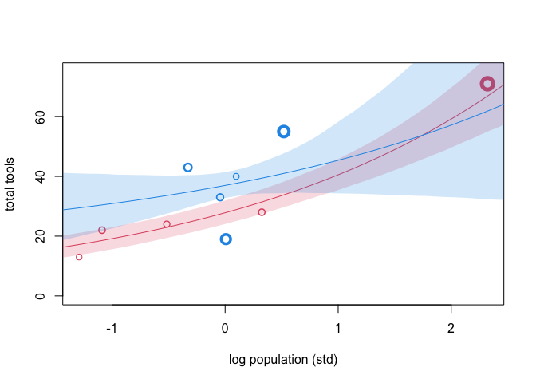<!-- -->

Here’s the plot on a natural population scale:

Weird things happen:

-   when population size is large, high contact societies have lower
    number of tools than low contact societies
-   the intercepts are not zero, which doesn’t make sense, since we
    can’t have any tools when there are no people

These are the weakness of GLMs. We will try to tackle these using a more
theory-informed model.

### A theory-driven model

We model the cultural evolution of tools as a dynamic process.
Innovation increases the number of tools, loss decreases it. We assume
the innovation is proportional to population size, but with diminishing
returns (each additional person creates an increase less than the last
person). The loss is proportional to the number of tools. In math form,
these verbal arguments means:


The equilibrium number of tools is:


The model we will fit to the data becomes (note that the link function
is gone):

")


``` r
dat2 <- list(
  T = d$total_tools,
  P = d$population,
  cid = d$contact_id
)

# interaction model
m11.11 <- ulam(
  alist(
    T ~ dpois(lambda),
    lambda <- a[cid] * P^b[cid] / g,
    a[cid] ~ dnorm(1, 1),
    b[cid] ~ dexp(1),
    g ~ dexp(1)
  ), 
  data = dat2, chains = 4, cores = 4
)
```

    ## Running MCMC with 4 parallel chains, with 1 thread(s) per chain...
    ## 
    ## Chain 1 Iteration:   1 / 1000 [  0%]  (Warmup) 
    ## Chain 1 Iteration: 100 / 1000 [ 10%]  (Warmup) 
    ## Chain 2 Iteration:   1 / 1000 [  0%]  (Warmup) 
    ## Chain 2 Iteration: 100 / 1000 [ 10%]  (Warmup) 
    ## Chain 2 Iteration: 200 / 1000 [ 20%]  (Warmup) 
    ## Chain 3 Iteration:   1 / 1000 [  0%]  (Warmup) 
    ## Chain 3 Iteration: 100 / 1000 [ 10%]  (Warmup) 
    ## Chain 3 Iteration: 200 / 1000 [ 20%]  (Warmup) 
    ## Chain 4 Iteration:   1 / 1000 [  0%]  (Warmup) 
    ## Chain 4 Iteration: 100 / 1000 [ 10%]  (Warmup) 
    ## Chain 4 Iteration: 200 / 1000 [ 20%]  (Warmup) 
    ## Chain 1 Iteration: 200 / 1000 [ 20%]  (Warmup) 
    ## Chain 2 Iteration: 300 / 1000 [ 30%]  (Warmup) 
    ## Chain 3 Iteration: 300 / 1000 [ 30%]  (Warmup) 
    ## Chain 4 Iteration: 300 / 1000 [ 30%]  (Warmup) 
    ## Chain 2 Iteration: 400 / 1000 [ 40%]  (Warmup) 
    ## Chain 4 Iteration: 400 / 1000 [ 40%]  (Warmup) 
    ## Chain 1 Iteration: 300 / 1000 [ 30%]  (Warmup) 
    ## Chain 1 Iteration: 400 / 1000 [ 40%]  (Warmup) 
    ## Chain 2 Iteration: 500 / 1000 [ 50%]  (Warmup) 
    ## Chain 2 Iteration: 501 / 1000 [ 50%]  (Sampling) 
    ## Chain 3 Iteration: 400 / 1000 [ 40%]  (Warmup) 
    ## Chain 3 Iteration: 500 / 1000 [ 50%]  (Warmup) 
    ## Chain 3 Iteration: 501 / 1000 [ 50%]  (Sampling) 
    ## Chain 4 Iteration: 500 / 1000 [ 50%]  (Warmup) 
    ## Chain 4 Iteration: 501 / 1000 [ 50%]  (Sampling) 
    ## Chain 1 Iteration: 500 / 1000 [ 50%]  (Warmup) 
    ## Chain 1 Iteration: 501 / 1000 [ 50%]  (Sampling) 
    ## Chain 1 Iteration: 600 / 1000 [ 60%]  (Sampling) 
    ## Chain 2 Iteration: 600 / 1000 [ 60%]  (Sampling) 
    ## Chain 2 Iteration: 700 / 1000 [ 70%]  (Sampling) 
    ## Chain 3 Iteration: 600 / 1000 [ 60%]  (Sampling) 
    ## Chain 3 Iteration: 700 / 1000 [ 70%]  (Sampling) 
    ## Chain 4 Iteration: 600 / 1000 [ 60%]  (Sampling) 
    ## Chain 4 Iteration: 700 / 1000 [ 70%]  (Sampling) 
    ## Chain 1 Iteration: 700 / 1000 [ 70%]  (Sampling) 
    ## Chain 1 Iteration: 800 / 1000 [ 80%]  (Sampling) 
    ## Chain 2 Iteration: 800 / 1000 [ 80%]  (Sampling) 
    ## Chain 2 Iteration: 900 / 1000 [ 90%]  (Sampling) 
    ## Chain 3 Iteration: 800 / 1000 [ 80%]  (Sampling) 
    ## Chain 3 Iteration: 900 / 1000 [ 90%]  (Sampling) 
    ## Chain 4 Iteration: 800 / 1000 [ 80%]  (Sampling) 
    ## Chain 4 Iteration: 900 / 1000 [ 90%]  (Sampling) 
    ## Chain 1 Iteration: 900 / 1000 [ 90%]  (Sampling) 
    ## Chain 1 Iteration: 1000 / 1000 [100%]  (Sampling) 
    ## Chain 2 Iteration: 1000 / 1000 [100%]  (Sampling) 
    ## Chain 3 Iteration: 1000 / 1000 [100%]  (Sampling) 
    ## Chain 4 Iteration: 1000 / 1000 [100%]  (Sampling) 
    ## Chain 1 finished in 0.8 seconds.
    ## Chain 2 finished in 0.8 seconds.
    ## Chain 3 finished in 0.8 seconds.
    ## Chain 4 finished in 0.7 seconds.
    ## 
    ## All 4 chains finished successfully.
    ## Mean chain execution time: 0.8 seconds.
    ## Total execution time: 0.9 seconds.

``` r
# posterior prediction
plot(d$population, d$total_tools, 
     xlab = "population size", ylab = "total tools",
     ylim = c(0, 75), cex = 1+normalize(k), lwd = 1+4*normalize(k),
     col = ifelse(dat$cid == "1", 2, 4))

# pop seq
p_seq <- seq(-5, 3, length.out = 100)
pop_seq <- exp(p_seq*sd(log(d$population)) + mean(log(d$population)))
# prediction for cid == 1
lambda1 <- link(m11.11, data = data.frame(P = pop_seq, cid = 1))
l1_mean <- apply(lambda1, 2, mean)
l1_PI <- apply(lambda1, 2, PI)
lines(pop_seq, l1_mean, col = 2)
shade(l1_PI, pop_seq, col = col.alpha(2, 0.2))
# prediction for cid == 2
lambda2 <- link(m11.11, data = data.frame(P = pop_seq, cid = 2))
l2_mean <- apply(lambda2, 2, mean)
l2_PI <- apply(lambda2, 2, PI)
lines(pop_seq, l2_mean, col = 4)
shade(l2_PI, pop_seq, col = col.alpha(4, 0.2))
```

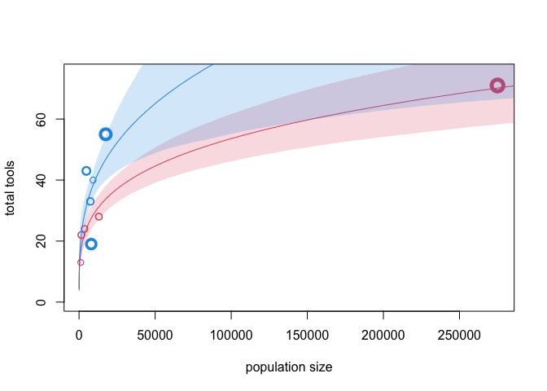<!-- -->

### Heterogeneous exposure

Sometimes outcomes are measured using different exposure. For example,
one can measure the number of finished manuscripts from a monastery
daily, but they can also measure it weekly. There are some tricks when
dealing when a dataset including both exposure.

Implicitly,

is equal th expected number of events

over a unit time or distance,
:


Therefore we can model varying exposure using the following model:

")


We will use a simulated data to illustrate this

``` r
# measured per day
num_day <- 30
y <- rpois(num_day, 1.5)
# measured per week
num_week <- 4
y_new <- rpois(num_week, 0.5*7)
# forge a dataset
y_all <- c(y, y_new)
exposure <- c(rep(1, 30), rep(7, 4))
monastery <- c(rep(1, 30), rep(2, 4))
d <- data.frame(y = y_all, days = exposure, monastery = monastery)
```

``` r
# compute the offset
d$log_days <- log(d$days)

# fit the model
m11.12 <- quap(
  alist(
    y ~ dpois(mu),
    log(mu) <-  log_days + a[monastery],
    a[monastery] ~ dnorm(0, 1)
  ), data = d
)

# posterior prediction
post <- extract.samples( m11.12 )
lambda_old <- exp( post$a[,1] )
lambda_new <- exp( post$a[,2] )
precis( data.frame( lambda_old , lambda_new ) )
```

    ##                 mean        sd      5.5%     94.5%      histogram
    ## lambda_old 1.6044836 0.2331766 1.2639965 2.0028407     ▁▁▃▇▇▂▁▁▁▁
    ## lambda_new 0.4703372 0.1306985 0.2930934 0.6980629 ▁▁▇▇▅▂▁▁▁▁▁▁▁▁

## Multinomial/categorial models

Binomial regression can only handle events with two categories, but
sometimes we have outcomes with more than two categories. We need to use
multinomial distribution to model this type of events. Multinomial
distribution is the maximum entropy distribution when more than two
types of outcomes are possible, and the possibility of each type is
constant across trials. Models using this distribution is called
categorical regression or multinomial logistic regression.

The link function is multinomial logit function, also called softmax
function:

 = \frac{\mathrm{exp}(s_k)}{\sum_{i=1}^{K}\mathrm{exp}(s_i)}")

### Predictors matched to outcomes

Predictors are some characteristics of the outcomes. For example, we
want to model individuals’ career choices, and the predictor we want to
include is each career choice’s expected income.

``` r
# simulate the data among 500 individuals
N <- 500 # number of individuals
income <- c(1, 2, 5) # expected income of each career
score <- 0.5*income # scores for each career, based on income
# converts scores to probabilities
p <- softmax(score[1], score[2], score[3])

# simulate choices
career <- rep(NA, N) # an empty vector of choices for each individual
# sample chosen career for each individual
set.seed(34302)
for (i in 1:N) career[i] <- sample(1:3, size = 1, prob = p)
```

We will directly write Stan codes for these examples

``` r
# write the stan code
code_m11.13 <- "
data{
  int N; // number of individuals
  int K; // number of possible careers
  int career[N]; // outcomes
  vector[K] career_income;
}
parameters{
  vector[K-1] a; // intercepts
  real<lower=0> b; // association of income with choice
}
model{
  vector[K] p;
  vector[K] s;
  a ~ normal(0, 1);
  b ~ normal(0, 0.5);
  s[1] = a[1] + b*career_income[1];
  s[2] = a[2] + b*career_income[2];
  s[3] = 0; // pivot
  p = softmax(s); 
  career ~ categorical(p);
}
"

# clean data
dat_list <- list(N = N, K = 3, career = career, career_income = income)
# model
m11.13 <- stan(model_code = code_m11.13, data = dat_list, chains = 4)
```

    ## Running MCMC with 4 sequential chains...
    ## 
    ## Chain 1 Iteration:   1 / 1000 [  0%]  (Warmup) 
    ## Chain 1 Iteration: 100 / 1000 [ 10%]  (Warmup) 
    ## Chain 1 Iteration: 200 / 1000 [ 20%]  (Warmup) 
    ## Chain 1 Iteration: 300 / 1000 [ 30%]  (Warmup) 
    ## Chain 1 Iteration: 400 / 1000 [ 40%]  (Warmup) 
    ## Chain 1 Iteration: 500 / 1000 [ 50%]  (Warmup) 
    ## Chain 1 Iteration: 501 / 1000 [ 50%]  (Sampling) 
    ## Chain 1 Iteration: 600 / 1000 [ 60%]  (Sampling) 
    ## Chain 1 Iteration: 700 / 1000 [ 70%]  (Sampling) 
    ## Chain 1 Iteration: 800 / 1000 [ 80%]  (Sampling) 
    ## Chain 1 Iteration: 900 / 1000 [ 90%]  (Sampling) 
    ## Chain 1 Iteration: 1000 / 1000 [100%]  (Sampling) 
    ## Chain 1 finished in 0.1 seconds.
    ## Chain 2 Iteration:   1 / 1000 [  0%]  (Warmup) 
    ## Chain 2 Iteration: 100 / 1000 [ 10%]  (Warmup) 
    ## Chain 2 Iteration: 200 / 1000 [ 20%]  (Warmup) 
    ## Chain 2 Iteration: 300 / 1000 [ 30%]  (Warmup) 
    ## Chain 2 Iteration: 400 / 1000 [ 40%]  (Warmup) 
    ## Chain 2 Iteration: 500 / 1000 [ 50%]  (Warmup) 
    ## Chain 2 Iteration: 501 / 1000 [ 50%]  (Sampling) 
    ## Chain 2 Iteration: 600 / 1000 [ 60%]  (Sampling) 
    ## Chain 2 Iteration: 700 / 1000 [ 70%]  (Sampling) 
    ## Chain 2 Iteration: 800 / 1000 [ 80%]  (Sampling) 
    ## Chain 2 Iteration: 900 / 1000 [ 90%]  (Sampling) 
    ## Chain 2 Iteration: 1000 / 1000 [100%]  (Sampling) 
    ## Chain 2 finished in 0.1 seconds.
    ## Chain 3 Iteration:   1 / 1000 [  0%]  (Warmup) 
    ## Chain 3 Iteration: 100 / 1000 [ 10%]  (Warmup) 
    ## Chain 3 Iteration: 200 / 1000 [ 20%]  (Warmup) 
    ## Chain 3 Iteration: 300 / 1000 [ 30%]  (Warmup) 
    ## Chain 3 Iteration: 400 / 1000 [ 40%]  (Warmup) 
    ## Chain 3 Iteration: 500 / 1000 [ 50%]  (Warmup) 
    ## Chain 3 Iteration: 501 / 1000 [ 50%]  (Sampling) 
    ## Chain 3 Iteration: 600 / 1000 [ 60%]  (Sampling) 
    ## Chain 3 Iteration: 700 / 1000 [ 70%]  (Sampling) 
    ## Chain 3 Iteration: 800 / 1000 [ 80%]  (Sampling) 
    ## Chain 3 Iteration: 900 / 1000 [ 90%]  (Sampling) 
    ## Chain 3 Iteration: 1000 / 1000 [100%]  (Sampling) 
    ## Chain 3 finished in 0.2 seconds.
    ## Chain 4 Iteration:   1 / 1000 [  0%]  (Warmup) 
    ## Chain 4 Iteration: 100 / 1000 [ 10%]  (Warmup) 
    ## Chain 4 Iteration: 200 / 1000 [ 20%]  (Warmup) 
    ## Chain 4 Iteration: 300 / 1000 [ 30%]  (Warmup) 
    ## Chain 4 Iteration: 400 / 1000 [ 40%]  (Warmup) 
    ## Chain 4 Iteration: 500 / 1000 [ 50%]  (Warmup) 
    ## Chain 4 Iteration: 501 / 1000 [ 50%]  (Sampling) 
    ## Chain 4 Iteration: 600 / 1000 [ 60%]  (Sampling) 
    ## Chain 4 Iteration: 700 / 1000 [ 70%]  (Sampling) 
    ## Chain 4 Iteration: 800 / 1000 [ 80%]  (Sampling) 
    ## Chain 4 Iteration: 900 / 1000 [ 90%]  (Sampling) 
    ## Chain 4 Iteration: 1000 / 1000 [100%]  (Sampling) 
    ## Chain 4 finished in 0.3 seconds.
    ## 
    ## All 4 chains finished successfully.
    ## Mean chain execution time: 0.2 seconds.
    ## Total execution time: 1.3 seconds.

``` r
precis(m11.13, 2)
```

    ##            mean        sd        5.5%      94.5%    n_eff    Rhat4
    ## a[1] -2.1332456 0.1825633 -2.43837450 -1.8531780 367.0759 1.009643
    ## a[2] -1.7777883 0.2502790 -2.24003730 -1.4523705 380.1130 1.012002
    ## b     0.1275093 0.1118922  0.00786944  0.3383633 381.6249 1.013466

It’s hard to directly eyeball the coefficients. So let’s do some
posterior predictive simulation. Let’s imagine doubling the income of
career choice 2.

``` r
post <- extract.samples(m11.13)

# set up logit scores
s1 <- with(post, a[,1] + b*income[1])
s2_orig <- with(post, a[,2] + b*income[2])
s2_new <- with(post, a[,2] + b*income[2]*2)

# compute probabilities for original and counterfactual
p_orig <- sapply(1:length(post$b),
                 function(i) softmax(c(s1[i], s2_orig[i], 0)))
p_new <- sapply(1:length(post$b),
                 function(i) softmax(c(s1[i], s2_new[i], 0)))

# summarize
p_diff <- p_new[2,] - p_orig[2,]
precis(p_diff)
```

    ##              mean         sd        5.5%    94.5% histogram
    ## p_diff 0.03994014 0.03922715 0.002173353 0.113491    ▇▂▁▁▁▁

Doubling the income of career 2 would result in a 4% of increase in the
probability of choosing this career.

### Preditors matched to observations

Predictors can also be some characters of each observation. For example,
we are still modeling career choice, but this time we want to use each
individuals’ family income to predict career choice.

``` r
# simulate the data among 500 individuals
N <- 500 # number of individuals
# simulate family income
family_income <- runif(N)
# assign a coefficient for each type of outcome
b <- c(-2, 0, 2)

# simulate choices
career <- rep(NA, N) # an empty vector of choices for each individual
# sample chosen career for each individual
set.seed(34302)
for (i in 1:N) {
  score <- 0.5*(1:3) + b*family_income[i]
  p <- softmax(score[1], score[2], score[3])
  career[i] <- sample(1:3, size = 1, prob = p)
}
```

``` r
# write the stan code
code_m11.14 <- "
data{
  int N; // number of individuals
  int K; // number of possible careers
  int career[N]; // outcomes
  real family_income[N];
}
parameters{
  vector[K-1] a; // intercepts
  vector[K-1] b; // association of family with choice
}
model{
  vector[K] p;
  vector[K] s;
  a ~ normal(0, 1.5);
  b ~ normal(0, 1);
  for (i in 1:N){
    for (j in 1:(K-1)) s[j] = a[j] + b[j] * family_income[i];
    s[K] = 0; // the pivot
    p = softmax(s);
    career[i] ~ categorical(p);
  }
}
"

# clean data
dat_list <- list(N = N, K = 3, career = career, family_income = family_income)
# model
m11.14 <- stan(model_code = code_m11.14, data = dat_list, chains = 4)
```

    ## Running MCMC with 4 sequential chains...
    ## 
    ## Chain 1 Iteration:   1 / 1000 [  0%]  (Warmup) 
    ## Chain 1 Iteration: 100 / 1000 [ 10%]  (Warmup) 
    ## Chain 1 Iteration: 200 / 1000 [ 20%]  (Warmup) 
    ## Chain 1 Iteration: 300 / 1000 [ 30%]  (Warmup) 
    ## Chain 1 Iteration: 400 / 1000 [ 40%]  (Warmup) 
    ## Chain 1 Iteration: 500 / 1000 [ 50%]  (Warmup) 
    ## Chain 1 Iteration: 501 / 1000 [ 50%]  (Sampling) 
    ## Chain 1 Iteration: 600 / 1000 [ 60%]  (Sampling) 
    ## Chain 1 Iteration: 700 / 1000 [ 70%]  (Sampling) 
    ## Chain 1 Iteration: 800 / 1000 [ 80%]  (Sampling) 
    ## Chain 1 Iteration: 900 / 1000 [ 90%]  (Sampling) 
    ## Chain 1 Iteration: 1000 / 1000 [100%]  (Sampling) 
    ## Chain 1 finished in 7.3 seconds.
    ## Chain 2 Iteration:   1 / 1000 [  0%]  (Warmup) 
    ## Chain 2 Iteration: 100 / 1000 [ 10%]  (Warmup) 
    ## Chain 2 Iteration: 200 / 1000 [ 20%]  (Warmup) 
    ## Chain 2 Iteration: 300 / 1000 [ 30%]  (Warmup) 
    ## Chain 2 Iteration: 400 / 1000 [ 40%]  (Warmup) 
    ## Chain 2 Iteration: 500 / 1000 [ 50%]  (Warmup) 
    ## Chain 2 Iteration: 501 / 1000 [ 50%]  (Sampling) 
    ## Chain 2 Iteration: 600 / 1000 [ 60%]  (Sampling) 
    ## Chain 2 Iteration: 700 / 1000 [ 70%]  (Sampling) 
    ## Chain 2 Iteration: 800 / 1000 [ 80%]  (Sampling) 
    ## Chain 2 Iteration: 900 / 1000 [ 90%]  (Sampling) 
    ## Chain 2 Iteration: 1000 / 1000 [100%]  (Sampling) 
    ## Chain 2 finished in 4.5 seconds.
    ## Chain 3 Iteration:   1 / 1000 [  0%]  (Warmup) 
    ## Chain 3 Iteration: 100 / 1000 [ 10%]  (Warmup) 
    ## Chain 3 Iteration: 200 / 1000 [ 20%]  (Warmup) 
    ## Chain 3 Iteration: 300 / 1000 [ 30%]  (Warmup) 
    ## Chain 3 Iteration: 400 / 1000 [ 40%]  (Warmup) 
    ## Chain 3 Iteration: 500 / 1000 [ 50%]  (Warmup) 
    ## Chain 3 Iteration: 501 / 1000 [ 50%]  (Sampling) 
    ## Chain 3 Iteration: 600 / 1000 [ 60%]  (Sampling) 
    ## Chain 3 Iteration: 700 / 1000 [ 70%]  (Sampling) 
    ## Chain 3 Iteration: 800 / 1000 [ 80%]  (Sampling) 
    ## Chain 3 Iteration: 900 / 1000 [ 90%]  (Sampling) 
    ## Chain 3 Iteration: 1000 / 1000 [100%]  (Sampling) 
    ## Chain 3 finished in 6.0 seconds.
    ## Chain 4 Iteration:   1 / 1000 [  0%]  (Warmup) 
    ## Chain 4 Iteration: 100 / 1000 [ 10%]  (Warmup) 
    ## Chain 4 Iteration: 200 / 1000 [ 20%]  (Warmup) 
    ## Chain 4 Iteration: 300 / 1000 [ 30%]  (Warmup) 
    ## Chain 4 Iteration: 400 / 1000 [ 40%]  (Warmup) 
    ## Chain 4 Iteration: 500 / 1000 [ 50%]  (Warmup) 
    ## Chain 4 Iteration: 501 / 1000 [ 50%]  (Sampling) 
    ## Chain 4 Iteration: 600 / 1000 [ 60%]  (Sampling) 
    ## Chain 4 Iteration: 700 / 1000 [ 70%]  (Sampling) 
    ## Chain 4 Iteration: 800 / 1000 [ 80%]  (Sampling) 
    ## Chain 4 Iteration: 900 / 1000 [ 90%]  (Sampling) 
    ## Chain 4 Iteration: 1000 / 1000 [100%]  (Sampling) 
    ## Chain 4 finished in 5.4 seconds.
    ## 
    ## All 4 chains finished successfully.
    ## Mean chain execution time: 5.8 seconds.
    ## Total execution time: 23.6 seconds.

``` r
precis(m11.14, 2)
```

    ##            mean        sd       5.5%      94.5%    n_eff    Rhat4
    ## a[1] -1.7637471 0.3149627 -2.2736973 -1.2752588 652.0051 1.005114
    ## a[2] -0.5578952 0.2055961 -0.8979846 -0.2283328 868.0403 1.002107
    ## b[1] -2.2643420 0.6151974 -3.2704839 -1.3193549 763.1059 1.005948
    ## b[2] -1.7582478 0.3860936 -2.3879501 -1.1435346 875.9961 1.002445

### Multinomial problems modeled as Poisson regression

We can also refactor a multinomial model into several Poisson models. We
will use the UCB admission to illustrate this, but this can be
generalized to any number of event types.

``` r
data(UCBadmit)
d <- UCBadmit

# binomial model of overall admission probability
m_binom <- quap(
  alist(
    admit ~ dbinom(applications, p),
    logit(p) ~ a,
    a ~ dnorm(0, 1.5)
  ), data = d
)

# Poisson model of overall admission rate and reject rate
dat <- list(admit = d$admit, rej = d$reject)
m_pois <- ulam(
  alist(
    admit ~ dpois(lambda1),
    rej ~ dpois(lambda2),
    log(lambda1) <- a1,
    log(lambda2) <- a2,
    c(a1,a2) ~ dnorm(0, 1.5)
  ), data = dat
)
```

    ## Running MCMC with 1 chain, with 1 thread(s) per chain...
    ## 
    ## Chain 1 Iteration:   1 / 1000 [  0%]  (Warmup) 
    ## Chain 1 Iteration: 100 / 1000 [ 10%]  (Warmup) 
    ## Chain 1 Iteration: 200 / 1000 [ 20%]  (Warmup) 
    ## Chain 1 Iteration: 300 / 1000 [ 30%]  (Warmup) 
    ## Chain 1 Iteration: 400 / 1000 [ 40%]  (Warmup) 
    ## Chain 1 Iteration: 500 / 1000 [ 50%]  (Warmup) 
    ## Chain 1 Iteration: 501 / 1000 [ 50%]  (Sampling) 
    ## Chain 1 Iteration: 600 / 1000 [ 60%]  (Sampling) 
    ## Chain 1 Iteration: 700 / 1000 [ 70%]  (Sampling) 
    ## Chain 1 Iteration: 800 / 1000 [ 80%]  (Sampling) 
    ## Chain 1 Iteration: 900 / 1000 [ 90%]  (Sampling) 
    ## Chain 1 Iteration: 1000 / 1000 [100%]  (Sampling) 
    ## Chain 1 finished in 0.0 seconds.

``` r
# check the results
# binomial model
inv_logit(coef(m_binom))
```

    ##         a 
    ## 0.3878044

``` r
# Poisson model
k <- coef(m_pois)
a1 <- k['a1']; a2 <- k['a2']
exp(a1)/(exp(a1) + exp(a2))
```

    ##        a1 
    ## 0.3875931
