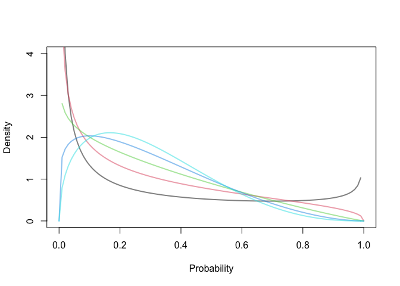
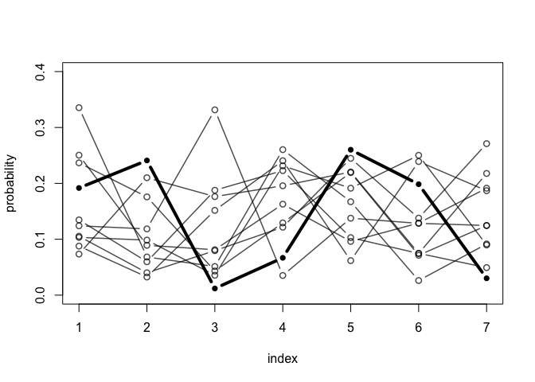

Lecture 11: Ordered Categories
================
Yurun (Ellen) Ying
2022-06-20

## Over-dispersed count data

### Beta-binomial model

A beta-binomial model is a mixture of binomial distributions. We model
the distribution of probabilities of success instead of a single
probability. This distribution is a beta distribution and is controlled
by two parameters

(the central tendency) and

(dispersion).

``` r
# varying pbar
pbar <- seq(0, 1, length.out = 11)
theta <- 5
plot(NULL, xlim = c(0,1), ylim = c(0,4),
     xlab = "Probability", ylab = "Density")
for (pbar in pbar) curve(dbeta2(x, pbar, theta), from = 0, to = 1, 
                         col = col.alpha(pbar*10+1, 0.5), lwd = 2, add = TRUE)
```

<!-- -->

``` r
# varying theta
pbar <- 0.3
theta <- c(1, 2, 3, 4, 5)
plot(NULL, xlim = c(0,1), ylim = c(0,4),
     xlab = "Probability", ylab = "Density")
for (theta in theta) curve(dbeta2(x, pbar, theta), from = 0, to = 1, 
                         col = col.alpha(theta, 0.5), lwd = 2, add = TRUE)
```

<!-- -->

When
,
the distribution is so dispersed that extreme values near 0/1 are very
likely. When
,
the distribution is concentrated.

We fit the beta-binomial to the gender discrimination data. What it will
do is to assign a probability of success to each row in the data. The
model looks like this (we model the

so that it is always bigger than 2):

")

![\mathrm{logit}(p_i) = \alpha\_{GID\[i\]}](https://latex.codecogs.com/png.image?%5Cdpi%7B110%7D&space;%5Cbg_white&space;%5Cmathrm%7Blogit%7D%28p_i%29%20%3D%20%5Calpha_%7BGID%5Bi%5D%7D "\mathrm{logit}(p_i) = \alpha_{GID[i]}")

")


")

``` r
m12.1 <- ulam(
  alist(
    A ~ dbetabinom(N, pbar, theta),
    logit(pbar) <- a[gid],
    a[gid] ~ dnorm(0, 1.5),
    transpars> theta <<- phi + 2.0, # so that Stan return theta in the sample
    phi ~ dexp(1)
  ), data = dat, chains = 4
)
```

    ## Running MCMC with 4 sequential chains, with 1 thread(s) per chain...
    ## 
    ## Chain 1 Iteration:   1 / 1000 [  0%]  (Warmup) 
    ## Chain 1 Iteration: 100 / 1000 [ 10%]  (Warmup) 
    ## Chain 1 Iteration: 200 / 1000 [ 20%]  (Warmup) 
    ## Chain 1 Iteration: 300 / 1000 [ 30%]  (Warmup) 
    ## Chain 1 Iteration: 400 / 1000 [ 40%]  (Warmup) 
    ## Chain 1 Iteration: 500 / 1000 [ 50%]  (Warmup) 
    ## Chain 1 Iteration: 501 / 1000 [ 50%]  (Sampling) 
    ## Chain 1 Iteration: 600 / 1000 [ 60%]  (Sampling) 
    ## Chain 1 Iteration: 700 / 1000 [ 70%]  (Sampling) 
    ## Chain 1 Iteration: 800 / 1000 [ 80%]  (Sampling) 
    ## Chain 1 Iteration: 900 / 1000 [ 90%]  (Sampling) 
    ## Chain 1 Iteration: 1000 / 1000 [100%]  (Sampling) 
    ## Chain 1 finished in 0.1 seconds.
    ## Chain 2 Iteration:   1 / 1000 [  0%]  (Warmup) 
    ## Chain 2 Iteration: 100 / 1000 [ 10%]  (Warmup) 
    ## Chain 2 Iteration: 200 / 1000 [ 20%]  (Warmup) 
    ## Chain 2 Iteration: 300 / 1000 [ 30%]  (Warmup) 
    ## Chain 2 Iteration: 400 / 1000 [ 40%]  (Warmup) 
    ## Chain 2 Iteration: 500 / 1000 [ 50%]  (Warmup) 
    ## Chain 2 Iteration: 501 / 1000 [ 50%]  (Sampling) 
    ## Chain 2 Iteration: 600 / 1000 [ 60%]  (Sampling) 
    ## Chain 2 Iteration: 700 / 1000 [ 70%]  (Sampling) 
    ## Chain 2 Iteration: 800 / 1000 [ 80%]  (Sampling) 
    ## Chain 2 Iteration: 900 / 1000 [ 90%]  (Sampling) 
    ## Chain 2 Iteration: 1000 / 1000 [100%]  (Sampling) 
    ## Chain 2 finished in 0.1 seconds.
    ## Chain 3 Iteration:   1 / 1000 [  0%]  (Warmup) 
    ## Chain 3 Iteration: 100 / 1000 [ 10%]  (Warmup) 
    ## Chain 3 Iteration: 200 / 1000 [ 20%]  (Warmup) 
    ## Chain 3 Iteration: 300 / 1000 [ 30%]  (Warmup) 
    ## Chain 3 Iteration: 400 / 1000 [ 40%]  (Warmup) 
    ## Chain 3 Iteration: 500 / 1000 [ 50%]  (Warmup) 
    ## Chain 3 Iteration: 501 / 1000 [ 50%]  (Sampling) 
    ## Chain 3 Iteration: 600 / 1000 [ 60%]  (Sampling) 
    ## Chain 3 Iteration: 700 / 1000 [ 70%]  (Sampling) 
    ## Chain 3 Iteration: 800 / 1000 [ 80%]  (Sampling) 
    ## Chain 3 Iteration: 900 / 1000 [ 90%]  (Sampling) 
    ## Chain 3 Iteration: 1000 / 1000 [100%]  (Sampling) 
    ## Chain 3 finished in 0.1 seconds.
    ## Chain 4 Iteration:   1 / 1000 [  0%]  (Warmup) 
    ## Chain 4 Iteration: 100 / 1000 [ 10%]  (Warmup) 
    ## Chain 4 Iteration: 200 / 1000 [ 20%]  (Warmup) 
    ## Chain 4 Iteration: 300 / 1000 [ 30%]  (Warmup) 
    ## Chain 4 Iteration: 400 / 1000 [ 40%]  (Warmup) 
    ## Chain 4 Iteration: 500 / 1000 [ 50%]  (Warmup) 
    ## Chain 4 Iteration: 501 / 1000 [ 50%]  (Sampling) 
    ## Chain 4 Iteration: 600 / 1000 [ 60%]  (Sampling) 
    ## Chain 4 Iteration: 700 / 1000 [ 70%]  (Sampling) 
    ## Chain 4 Iteration: 800 / 1000 [ 80%]  (Sampling) 
    ## Chain 4 Iteration: 900 / 1000 [ 90%]  (Sampling) 
    ## Chain 4 Iteration: 1000 / 1000 [100%]  (Sampling) 
    ## Chain 4 finished in 0.1 seconds.
    ## 
    ## All 4 chains finished successfully.
    ## Mean chain execution time: 0.1 seconds.
    ## Total execution time: 0.7 seconds.

``` r
post <- extract.samples(m12.1)
post$da <- post$a[,1] - post$a[,2]
precis(post, depth = 2)
```

    ##              mean        sd        5.5%     94.5%   histogram
    ## a[1]  -0.43294585 0.4079672 -1.07849430 0.2225598     ▁▁▁▅▇▂▁
    ## a[2]  -0.33600940 0.4261753 -1.01055965 0.3161074     ▁▁▅▇▃▁▁
    ## phi    1.01915004 0.7693181  0.09728332 2.4054327 ▇▇▅▂▂▁▁▁▁▁▁
    ## theta  3.01915009 0.7693180  2.09728490 4.4054328 ▇▇▅▂▂▁▁▁▁▁▁
    ## da    -0.09693645 0.5935406 -1.00480565 0.8581364  ▁▁▁▃▇▇▂▁▁▁

There is little evidence for the admission rate to differ for men and
women.

We can check how the beta distribution looks like by drawing samples of

and
.

``` r
gid <- 2
# draw 50 samples
plot(NULL, xlab = "Probability", ylab = "Density", xlim = c(0, 1), ylim = c(0, 3))
for (i in 1:50){
  curve(dbeta2(x, 
             logistic(post$a[i,gid]),
             post$theta[i]),
        from = 0, to = 1, col = col.alpha("black", 0.3), add = TRUE)
}

# draw posterior mean beta distribution
curve(dbeta2(x, 
             mean(logistic(post$a[,gid])),
             mean(post$theta)),
      from = 0, to = 1, lwd = 3, col = "tomato", add = TRUE)
mtext("Distribution of female admission rates")
```

<!-- -->

``` r
# posterior check agianst the empirical observations
postcheck(m12.1)
```

<!-- -->

The plots show that there is quite a lot of variation among departments
and dispersion within departments. These variation accomodates the
heterogeneity in the sample among department base rates.

### Gamma-Poisson (negative-binomial) models

Very similar to the beta-binomial model. Each row in the data has its
own rate
,
and distribution of these rates is modeled by the a gamma distribution.
It is controlled by two parameters

(mean) and

(rate). The variance of a gamma-Poisson distribution is
.

We will fit a model to the Oceanic tool example using the gamma-Poisson
distribution:

")


``` r
m12.2 <- ulam(
  alist(
    T ~ dgampois(lambda, phi),
    lambda <- a[cid] * P^b[cid] / g,
    a[cid] ~ dnorm(1, 1),
    b[cid] ~ dexp(1),
    g ~ dexp(1),
    phi ~ dexp(1)
  ), 
  data = dat2, chains = 4, cores = 4, log_lik = TRUE
)
```

    ## Running MCMC with 4 parallel chains, with 1 thread(s) per chain...
    ## 
    ## Chain 1 Iteration:   1 / 1000 [  0%]  (Warmup) 
    ## Chain 1 Iteration: 100 / 1000 [ 10%]  (Warmup) 
    ## Chain 2 Iteration:   1 / 1000 [  0%]  (Warmup) 
    ## Chain 2 Iteration: 100 / 1000 [ 10%]  (Warmup) 
    ## Chain 3 Iteration:   1 / 1000 [  0%]  (Warmup) 
    ## Chain 3 Iteration: 100 / 1000 [ 10%]  (Warmup) 
    ## Chain 4 Iteration:   1 / 1000 [  0%]  (Warmup) 
    ## Chain 4 Iteration: 100 / 1000 [ 10%]  (Warmup) 
    ## Chain 1 Iteration: 200 / 1000 [ 20%]  (Warmup) 
    ## Chain 1 Iteration: 300 / 1000 [ 30%]  (Warmup) 
    ## Chain 2 Iteration: 200 / 1000 [ 20%]  (Warmup) 
    ## Chain 2 Iteration: 300 / 1000 [ 30%]  (Warmup) 
    ## Chain 3 Iteration: 200 / 1000 [ 20%]  (Warmup) 
    ## Chain 3 Iteration: 300 / 1000 [ 30%]  (Warmup) 
    ## Chain 4 Iteration: 200 / 1000 [ 20%]  (Warmup) 
    ## Chain 4 Iteration: 300 / 1000 [ 30%]  (Warmup) 
    ## Chain 1 Iteration: 400 / 1000 [ 40%]  (Warmup) 
    ## Chain 1 Iteration: 500 / 1000 [ 50%]  (Warmup) 
    ## Chain 1 Iteration: 501 / 1000 [ 50%]  (Sampling) 
    ## Chain 2 Iteration: 400 / 1000 [ 40%]  (Warmup) 
    ## Chain 3 Iteration: 400 / 1000 [ 40%]  (Warmup) 
    ## Chain 4 Iteration: 400 / 1000 [ 40%]  (Warmup) 
    ## Chain 1 Iteration: 600 / 1000 [ 60%]  (Sampling) 
    ## Chain 2 Iteration: 500 / 1000 [ 50%]  (Warmup) 
    ## Chain 2 Iteration: 501 / 1000 [ 50%]  (Sampling) 
    ## Chain 3 Iteration: 500 / 1000 [ 50%]  (Warmup) 
    ## Chain 3 Iteration: 501 / 1000 [ 50%]  (Sampling) 
    ## Chain 3 Iteration: 600 / 1000 [ 60%]  (Sampling) 
    ## Chain 4 Iteration: 500 / 1000 [ 50%]  (Warmup) 
    ## Chain 4 Iteration: 501 / 1000 [ 50%]  (Sampling) 
    ## Chain 1 Iteration: 700 / 1000 [ 70%]  (Sampling) 
    ## Chain 2 Iteration: 600 / 1000 [ 60%]  (Sampling) 
    ## Chain 2 Iteration: 700 / 1000 [ 70%]  (Sampling) 
    ## Chain 4 Iteration: 600 / 1000 [ 60%]  (Sampling) 
    ## Chain 1 Iteration: 800 / 1000 [ 80%]  (Sampling) 
    ## Chain 1 Iteration: 900 / 1000 [ 90%]  (Sampling) 
    ## Chain 2 Iteration: 800 / 1000 [ 80%]  (Sampling) 
    ## Chain 3 Iteration: 700 / 1000 [ 70%]  (Sampling) 
    ## Chain 4 Iteration: 700 / 1000 [ 70%]  (Sampling) 
    ## Chain 2 Iteration: 900 / 1000 [ 90%]  (Sampling) 
    ## Chain 3 Iteration: 800 / 1000 [ 80%]  (Sampling) 
    ## Chain 4 Iteration: 800 / 1000 [ 80%]  (Sampling) 
    ## Chain 1 Iteration: 1000 / 1000 [100%]  (Sampling) 
    ## Chain 3 Iteration: 900 / 1000 [ 90%]  (Sampling) 
    ## Chain 4 Iteration: 900 / 1000 [ 90%]  (Sampling) 
    ## Chain 4 Iteration: 1000 / 1000 [100%]  (Sampling) 
    ## Chain 1 finished in 1.0 seconds.
    ## Chain 4 finished in 1.0 seconds.
    ## Chain 2 Iteration: 1000 / 1000 [100%]  (Sampling) 
    ## Chain 3 Iteration: 1000 / 1000 [100%]  (Sampling) 
    ## Chain 2 finished in 1.1 seconds.
    ## Chain 3 finished in 1.1 seconds.
    ## 
    ## All 4 chains finished successfully.
    ## Mean chain execution time: 1.0 seconds.
    ## Total execution time: 1.2 seconds.

``` r
# posterior prediction
k <- PSIS(m12.2, pointwise = TRUE)$k
plot(d$population, d$total_tools, 
     xlab = "population size", ylab = "total tools",
     ylim = c(0, 75), cex = 1+normalize(k), lwd = 1+3*normalize(k),
     col = ifelse(dat2$cid == "1", 2, 4))

# pop seq
p_seq <- seq(-5, 3, length.out = 100)
pop_seq <- exp(p_seq*sd(log(d$population)) + mean(log(d$population)))
# prediction for cid == 1
lambda1 <- link(m12.2, data = data.frame(P = pop_seq, cid = 1))
l1_mean <- apply(lambda1, 2, mean)
l1_PI <- apply(lambda1, 2, PI)
lines(pop_seq, l1_mean, col = 2)
shade(l1_PI, pop_seq, col = col.alpha(2, 0.2))
# prediction for cid == 2
lambda2 <- link(m12.2, data = data.frame(P = pop_seq, cid = 2))
l2_mean <- apply(lambda2, 2, mean)
l2_PI <- apply(lambda2, 2, PI)
lines(pop_seq, l2_mean, col = 4)
shade(l2_PI, pop_seq, col = col.alpha(4, 0.2))
```

<!-- -->

The curve for low contact islands bends less towards the influential
case - Hawaii.

## Zero-inflated/zero-augmented models

Zero-inflated models are used when there are multiple ways that a zero
value can arise in the dataset. We will look at the monastery example in
Ch11. There may be two ways that a monk produce 0 manuscript on a
particular day: 1) he drinks (with a probability of
),
and 2) he works
()
but fails to produce anything
(")).
In mathematical form, the probability of producing zero manuscript can
be expressed as:

 &= \mathrm{Pr}(\mathrm{drink} \mid p) + \mathrm{Pr}(\mathrm{work} \mid p) \mathrm{Pr}(0 \mid \lambda) \\
&= p + (1-p) e^{-\lambda}
\end{aligned}")

Simulate some data for this idea.

``` r
# define parameters
prob_drink <- 0.2 # 20% of days
rate_work <- 1 # average 1 manuscript per day

# sample one year of production 
N <- 365

# simulate days monks drink 
set.seed(365)
drink <- rbinom(N , 1, prob_drink)

# simulate manuscripts completed
y <- (1-drink)*rpois(N ,rate_work)
```

Our model is:

")

 = \alpha_p + \beta_p x_i")

 = \alpha_{\lambda} + \beta_{\lambda}x_i")

``` r
# fit the model
m12.3 <- ulam( 
  alist(
  y ~ dzipois( p , lambda ), 
  logit(p) <- ap, 
  log(lambda) <- al,
  ap ~ dnorm(-1.5, 1), 
  al ~ dnorm(1, 0.5)
), data = list(y = y), chains = 4) 
```

    ## Running MCMC with 4 sequential chains, with 1 thread(s) per chain...
    ## 
    ## Chain 1 Iteration:   1 / 1000 [  0%]  (Warmup) 
    ## Chain 1 Iteration: 100 / 1000 [ 10%]  (Warmup) 
    ## Chain 1 Iteration: 200 / 1000 [ 20%]  (Warmup) 
    ## Chain 1 Iteration: 300 / 1000 [ 30%]  (Warmup) 
    ## Chain 1 Iteration: 400 / 1000 [ 40%]  (Warmup) 
    ## Chain 1 Iteration: 500 / 1000 [ 50%]  (Warmup) 
    ## Chain 1 Iteration: 501 / 1000 [ 50%]  (Sampling) 
    ## Chain 1 Iteration: 600 / 1000 [ 60%]  (Sampling) 
    ## Chain 1 Iteration: 700 / 1000 [ 70%]  (Sampling) 
    ## Chain 1 Iteration: 800 / 1000 [ 80%]  (Sampling) 
    ## Chain 1 Iteration: 900 / 1000 [ 90%]  (Sampling) 
    ## Chain 1 Iteration: 1000 / 1000 [100%]  (Sampling) 
    ## Chain 1 finished in 0.5 seconds.
    ## Chain 2 Iteration:   1 / 1000 [  0%]  (Warmup) 
    ## Chain 2 Iteration: 100 / 1000 [ 10%]  (Warmup) 
    ## Chain 2 Iteration: 200 / 1000 [ 20%]  (Warmup) 
    ## Chain 2 Iteration: 300 / 1000 [ 30%]  (Warmup) 
    ## Chain 2 Iteration: 400 / 1000 [ 40%]  (Warmup) 
    ## Chain 2 Iteration: 500 / 1000 [ 50%]  (Warmup) 
    ## Chain 2 Iteration: 501 / 1000 [ 50%]  (Sampling) 
    ## Chain 2 Iteration: 600 / 1000 [ 60%]  (Sampling) 
    ## Chain 2 Iteration: 700 / 1000 [ 70%]  (Sampling) 
    ## Chain 2 Iteration: 800 / 1000 [ 80%]  (Sampling) 
    ## Chain 2 Iteration: 900 / 1000 [ 90%]  (Sampling) 
    ## Chain 2 Iteration: 1000 / 1000 [100%]  (Sampling) 
    ## Chain 2 finished in 0.5 seconds.
    ## Chain 3 Iteration:   1 / 1000 [  0%]  (Warmup) 
    ## Chain 3 Iteration: 100 / 1000 [ 10%]  (Warmup) 
    ## Chain 3 Iteration: 200 / 1000 [ 20%]  (Warmup) 
    ## Chain 3 Iteration: 300 / 1000 [ 30%]  (Warmup) 
    ## Chain 3 Iteration: 400 / 1000 [ 40%]  (Warmup) 
    ## Chain 3 Iteration: 500 / 1000 [ 50%]  (Warmup) 
    ## Chain 3 Iteration: 501 / 1000 [ 50%]  (Sampling) 
    ## Chain 3 Iteration: 600 / 1000 [ 60%]  (Sampling) 
    ## Chain 3 Iteration: 700 / 1000 [ 70%]  (Sampling) 
    ## Chain 3 Iteration: 800 / 1000 [ 80%]  (Sampling) 
    ## Chain 3 Iteration: 900 / 1000 [ 90%]  (Sampling) 
    ## Chain 3 Iteration: 1000 / 1000 [100%]  (Sampling) 
    ## Chain 3 finished in 0.5 seconds.
    ## Chain 4 Iteration:   1 / 1000 [  0%]  (Warmup) 
    ## Chain 4 Iteration: 100 / 1000 [ 10%]  (Warmup) 
    ## Chain 4 Iteration: 200 / 1000 [ 20%]  (Warmup) 
    ## Chain 4 Iteration: 300 / 1000 [ 30%]  (Warmup) 
    ## Chain 4 Iteration: 400 / 1000 [ 40%]  (Warmup) 
    ## Chain 4 Iteration: 500 / 1000 [ 50%]  (Warmup) 
    ## Chain 4 Iteration: 501 / 1000 [ 50%]  (Sampling) 
    ## Chain 4 Iteration: 600 / 1000 [ 60%]  (Sampling) 
    ## Chain 4 Iteration: 700 / 1000 [ 70%]  (Sampling) 
    ## Chain 4 Iteration: 800 / 1000 [ 80%]  (Sampling) 
    ## Chain 4 Iteration: 900 / 1000 [ 90%]  (Sampling) 
    ## Chain 4 Iteration: 1000 / 1000 [100%]  (Sampling) 
    ## Chain 4 finished in 0.5 seconds.
    ## 
    ## All 4 chains finished successfully.
    ## Mean chain execution time: 0.5 seconds.
    ## Total execution time: 2.2 seconds.

``` r
precis(m12.3)
```

    ##            mean         sd      5.5%      94.5%    n_eff    Rhat4
    ## ap -1.282180625 0.35894072 -1.900947 -0.8129807 635.4734 1.012076
    ## al  0.009036054 0.09106555 -0.141378  0.1496733 699.0801 1.007611

``` r
# posterior prediction
post <- extract.samples(m12.3)
mean(inv_logit(post$ap)) # probability drink
```

    ## [1] 0.2231458

``` r
mean(exp(post$al)) # rate finish manuscripts, when not drinking
```

    ## [1] 1.013247

## Ordered categorical models

### Ordered categorical outcomes

Categorical variables with an order, the distance between categories may
not be constant. Psychological measures are an example.

``` r
data("Trolley")
d <- Trolley

# histogram
simplehist(d$response, xlim = c(1, 7), xlab = "response")
```

<!-- -->

``` r
# cumulative proportion
pr_k <- table(d$response) / nrow(d)
cum_pr_k <- cumsum(pr_k)
plot(1:7, cum_pr_k, type = "b", ylim = c(0, 1),
     xlab = "response", ylab = "cumulative proportion")
```

<!-- -->

``` r
# transform into log-cumulative-odds
logit <- function(x) log(x/(1-x))
l_cum_odd <- logit(cum_pr_k)
plot(1:7, l_cum_odd, type = "b", ylim = c(-2, 2),
     xlab = "response", ylab = "log cumulative odds")
```

<!-- -->

In the model, we model 6 cut-off points and link them
(log-cumulative-odds) to linear combination of predictors. These points
are transformed into probabilities for each event type through the
expression:

 = \mathrm{Pr}(y_i \le k) - \mathrm{Pr}(y_i \le k-1)")

The model in a simple format:

-")


")

In essence, this means:

")


For


")

``` r
# a model of intercept only
# m12.4 <- ulam(
#   alist(
#     R ~ dordlogit(0, cutpoints),
#     cutpoints ~ dnorm(0, 1.5)
#   ), data = list(R = d$response), chains = 4, cores = 4
# )

# comment out to save time in knitting
```

We will model the responses with three conditions - whether each of the
three types of outcomes is present. We will also include interaction
terms of A\*I and C\*I:


``` r
dat <- list(
  R = d$response,
  A = d$action,
  I = d$intention,
  C = d$contact
)

m12.5 <- ulam(
  alist(
    R ~ dordlogit(phi, cutpoints),
    phi <- bA*A + bC*C + BI*I,
    BI <- bI + bIA*A + bIC*C,
    c(bA,bC,bI,bIA,bIC) ~ dnorm(0, 0.5),
    cutpoints ~ dnorm(0, 1.5)
  ), data = dat, chains = 4, cores = 4
)
```

    ## Running MCMC with 4 parallel chains, with 1 thread(s) per chain...
    ## 
    ## Chain 1 Iteration:   1 / 1000 [  0%]  (Warmup) 
    ## Chain 2 Iteration:   1 / 1000 [  0%]  (Warmup) 
    ## Chain 3 Iteration:   1 / 1000 [  0%]  (Warmup) 
    ## Chain 4 Iteration:   1 / 1000 [  0%]  (Warmup) 
    ## Chain 2 Iteration: 100 / 1000 [ 10%]  (Warmup) 
    ## Chain 3 Iteration: 100 / 1000 [ 10%]  (Warmup) 
    ## Chain 4 Iteration: 100 / 1000 [ 10%]  (Warmup) 
    ## Chain 1 Iteration: 100 / 1000 [ 10%]  (Warmup) 
    ## Chain 3 Iteration: 200 / 1000 [ 20%]  (Warmup) 
    ## Chain 2 Iteration: 200 / 1000 [ 20%]  (Warmup) 
    ## Chain 4 Iteration: 200 / 1000 [ 20%]  (Warmup) 
    ## Chain 1 Iteration: 200 / 1000 [ 20%]  (Warmup) 
    ## Chain 3 Iteration: 300 / 1000 [ 30%]  (Warmup) 
    ## Chain 2 Iteration: 300 / 1000 [ 30%]  (Warmup) 
    ## Chain 4 Iteration: 300 / 1000 [ 30%]  (Warmup) 
    ## Chain 1 Iteration: 300 / 1000 [ 30%]  (Warmup) 
    ## Chain 3 Iteration: 400 / 1000 [ 40%]  (Warmup) 
    ## Chain 2 Iteration: 400 / 1000 [ 40%]  (Warmup) 
    ## Chain 4 Iteration: 400 / 1000 [ 40%]  (Warmup) 
    ## Chain 1 Iteration: 400 / 1000 [ 40%]  (Warmup) 
    ## Chain 2 Iteration: 500 / 1000 [ 50%]  (Warmup) 
    ## Chain 2 Iteration: 501 / 1000 [ 50%]  (Sampling) 
    ## Chain 3 Iteration: 500 / 1000 [ 50%]  (Warmup) 
    ## Chain 3 Iteration: 501 / 1000 [ 50%]  (Sampling) 
    ## Chain 4 Iteration: 500 / 1000 [ 50%]  (Warmup) 
    ## Chain 4 Iteration: 501 / 1000 [ 50%]  (Sampling) 
    ## Chain 1 Iteration: 500 / 1000 [ 50%]  (Warmup) 
    ## Chain 1 Iteration: 501 / 1000 [ 50%]  (Sampling) 
    ## Chain 3 Iteration: 600 / 1000 [ 60%]  (Sampling) 
    ## Chain 2 Iteration: 600 / 1000 [ 60%]  (Sampling) 
    ## Chain 4 Iteration: 600 / 1000 [ 60%]  (Sampling) 
    ## Chain 3 Iteration: 700 / 1000 [ 70%]  (Sampling) 
    ## Chain 1 Iteration: 600 / 1000 [ 60%]  (Sampling) 
    ## Chain 2 Iteration: 700 / 1000 [ 70%]  (Sampling) 
    ## Chain 3 Iteration: 800 / 1000 [ 80%]  (Sampling) 
    ## Chain 4 Iteration: 700 / 1000 [ 70%]  (Sampling) 
    ## Chain 1 Iteration: 700 / 1000 [ 70%]  (Sampling) 
    ## Chain 3 Iteration: 900 / 1000 [ 90%]  (Sampling) 
    ## Chain 2 Iteration: 800 / 1000 [ 80%]  (Sampling) 
    ## Chain 1 Iteration: 800 / 1000 [ 80%]  (Sampling) 
    ## Chain 4 Iteration: 800 / 1000 [ 80%]  (Sampling) 
    ## Chain 3 Iteration: 1000 / 1000 [100%]  (Sampling) 
    ## Chain 3 finished in 445.2 seconds.
    ## Chain 2 Iteration: 900 / 1000 [ 90%]  (Sampling) 
    ## Chain 1 Iteration: 900 / 1000 [ 90%]  (Sampling) 
    ## Chain 4 Iteration: 900 / 1000 [ 90%]  (Sampling) 
    ## Chain 2 Iteration: 1000 / 1000 [100%]  (Sampling) 
    ## Chain 2 finished in 505.9 seconds.
    ## Chain 1 Iteration: 1000 / 1000 [100%]  (Sampling) 
    ## Chain 1 finished in 510.7 seconds.
    ## Chain 4 Iteration: 1000 / 1000 [100%]  (Sampling) 
    ## Chain 4 finished in 514.8 seconds.
    ## 
    ## All 4 chains finished successfully.
    ## Mean chain execution time: 494.2 seconds.
    ## Total execution time: 515.2 seconds.

``` r
precis(m12.5)
```

    ##           mean         sd       5.5%      94.5%    n_eff     Rhat4
    ## bIC -1.2337634 0.09434322 -1.3813279 -1.0849475 1287.464 0.9996151
    ## bIA -0.4345304 0.07543975 -0.5592104 -0.3158048 1285.252 1.0004723
    ## bI  -0.2924774 0.05459907 -0.3785164 -0.2003915 1197.665 1.0008072
    ## bC  -0.3438231 0.06759529 -0.4490082 -0.2349586 1176.918 1.0000082
    ## bA  -0.4728051 0.05314715 -0.5565564 -0.3856016 1255.272 1.0001627

``` r
# posterior distribution of parameters
plot(precis(m12.5), xlim = c(-1.4, 0))
```

<!-- -->

The simultaneous presence of contact and intention has the strongest
effect on the ratings. It increases the probability on the scores on the
lower end.

Plot by conditions action = 0 and contact = 0 against the raw data.

``` r
# similar plots can be drawned for other combinations
plot(NULL, type = "n", xlab = "intention", ylab = "probability",
     xlim = c(0,1), ylim = c(0,1), xaxp = c(0,1,1), yaxp = c(0,1,2))

kA <- 0 # value for action
kC <- 0 # value for contact
kI <- 0:1 # values for intention to calculate over
pdat <- data.frame(A=kA, C=kC, I=kI)
phi <- link(m12.5, dat = pdat)$phi

# plot the prediction
post <- extract.samples(m12.5)
for (s in 1:50){
  pk <- pordlogit(1:6, phi[s,], post$cutpoints[s,])
  for (i in 1:6) lines(kI, pk[,i], col = grau(0.1))
}

#plot the raw data
A0C0 <- d[which(d$action==0 & d$contact==0),]
A0C0_freq <- table(A0C0$response, A0C0$intention)
cum0 <- cumsum(A0C0_freq[,1]); pro0 <- cum0/cum0[7]
cum1 <- cumsum(A0C0_freq[,2]); pro1 <- cum1/cum1[7]
points(rep(0,6), pro0[1:6], col = rangi2, pch = 16)
points(rep(1,6), pro1[1:6], col = rangi2, pch = 16)

mtext("action=0, contact=0")
```

<!-- -->

Plot the posterior predictive simulation of responses when intention = 0
(black) and intention = 1 (purple)

``` r
s <- sim(m12.5, data=pdat)
s_0 <- table(s[,1])
s_1 <- table(s[,2])

plot(NULL, type = "n", xlab = "response", ylab = "Density",
     xlim = c(1,7), ylim = c(0,250), xaxp = c(1,7,6))
for (i in 1:7) {
  lines(c(i,i), c(0,s_0[i]), lwd = 3)
  lines(c(i+0.1,i+0.1), c(0,s_1[i]), lwd = 3, col = rangi2)
}
```

<!-- -->

### Order categorical predictors

Now let’s think of the causal structure of the `Trolley` data. Here’s a
DAG. S=story, E=education, Y=age, G=gender, P=participation.

``` r
dag1 <- dagitty("dag{
                P[unobserved]
                X -> R <- S;
                E -> R; Y -> R; G -> R;
                Y -> E; G -> E
                P <- E; P <- Y; P <- G}")
coordinates(dag1) <- list(x = c(X = 0.35, R = 0.5, S = 0.65, 
                                E = 0.5, Y = 0.6, G = 0.4,
                                P = 0.5),
                          y =c(X = 0, R = 0, S = 0, 
                                E = 0.5, Y = 0.5, G = 0.5,
                                P = 1))
drawdag(dag1)
```

<!-- -->

In addition to the treatment, there are also demographic variables
influencing responses. These variables also influence whether people
voluntarily participate in the study. Since our data is conditioned on
participation, we are conditioning on a collider. If we want to estimate
th effect of demographics on responses, we need to stratify by all of
them.

The education level in the `Trolley` data is also an order categorical
variable. To model this variable, we need additional tricks.

``` r
# coding the educational levels
edu_levels <- c(6, 1, 8, 4, 7, 2, 5, 3) 
d$edu_new <- edu_levels[d$edu]
```

Our model looks like this:

-")


In this expression,

is the maximum effect of education,

is the proportion of the maximum effect brought by each increment in the
educational level.

is the educational level of each individual, and the sum represents
adding the increments to this educational level, which is the effect of
education up to this level after multiplied by the maximum effect.


is a vector of increments, which should add to one. To model this
simplex, we need to use the Dirichlet distribution. This is a
multivariate version of the beta distribution.

``` r
set.seed(1805)
# take in a vector of parameters of the same length as the simplex we want to model
delta <- rdirichlet(10, alpha = rep(2, 7)) 

# plot the distribution
h <- 3
plot(NULL, xlim = c(1,7), ylim = c(0,0.4), 
     xlab = "index", ylab = "probability")
for (i in 1:nrow(delta)) 
  lines(1:7, delta[i,], type = "b",
        pch = ifelse(i == h, 16, 1), lwd = ifelse(i == h, 4, 1.5),
        col = ifelse(i == h, "black", col.alpha("black", 0.7)))
```

<!-- -->

Fit the model to the data

``` r
dat$E = as.integer(d$edu_new) # edu_new as index
dat$alpha <- rep(2, 7) # delta prior

m12.6 <- ulam(
  alist(
    R ~ dordlogit(phi, kappa),
    phi <- bE*sum(delta_j[1:E]) + bA*A + bI*I + bC*C,
    kappa ~ normal(0, 1.5),
    c(bA,bI,bC,bE) ~ normal(0, 1),
    vector[8]: delta_j <<- append_row(0, delta),
    simplex[7]: delta ~ dirichlet(alpha)
  ),
  data = dat, chains = 4, cores = 4
)
```

    ## Running MCMC with 4 parallel chains, with 1 thread(s) per chain...
    ## 
    ## Chain 1 Iteration:   1 / 1000 [  0%]  (Warmup) 
    ## Chain 2 Iteration:   1 / 1000 [  0%]  (Warmup) 
    ## Chain 3 Iteration:   1 / 1000 [  0%]  (Warmup) 
    ## Chain 4 Iteration:   1 / 1000 [  0%]  (Warmup) 
    ## Chain 3 Iteration: 100 / 1000 [ 10%]  (Warmup) 
    ## Chain 1 Iteration: 100 / 1000 [ 10%]  (Warmup) 
    ## Chain 4 Iteration: 100 / 1000 [ 10%]  (Warmup) 
    ## Chain 2 Iteration: 100 / 1000 [ 10%]  (Warmup) 
    ## Chain 3 Iteration: 200 / 1000 [ 20%]  (Warmup) 
    ## Chain 1 Iteration: 200 / 1000 [ 20%]  (Warmup) 
    ## Chain 3 Iteration: 300 / 1000 [ 30%]  (Warmup) 
    ## Chain 2 Iteration: 200 / 1000 [ 20%]  (Warmup) 
    ## Chain 1 Iteration: 300 / 1000 [ 30%]  (Warmup) 
    ## Chain 4 Iteration: 200 / 1000 [ 20%]  (Warmup) 
    ## Chain 3 Iteration: 400 / 1000 [ 40%]  (Warmup) 
    ## Chain 2 Iteration: 300 / 1000 [ 30%]  (Warmup) 
    ## Chain 1 Iteration: 400 / 1000 [ 40%]  (Warmup) 
    ## Chain 3 Iteration: 500 / 1000 [ 50%]  (Warmup) 
    ## Chain 3 Iteration: 501 / 1000 [ 50%]  (Sampling) 
    ## Chain 4 Iteration: 300 / 1000 [ 30%]  (Warmup) 
    ## Chain 2 Iteration: 400 / 1000 [ 40%]  (Warmup) 
    ## Chain 4 Iteration: 400 / 1000 [ 40%]  (Warmup) 
    ## Chain 3 Iteration: 600 / 1000 [ 60%]  (Sampling) 
    ## Chain 1 Iteration: 500 / 1000 [ 50%]  (Warmup) 
    ## Chain 1 Iteration: 501 / 1000 [ 50%]  (Sampling) 
    ## Chain 2 Iteration: 500 / 1000 [ 50%]  (Warmup) 
    ## Chain 2 Iteration: 501 / 1000 [ 50%]  (Sampling) 
    ## Chain 3 Iteration: 700 / 1000 [ 70%]  (Sampling) 
    ## Chain 1 Iteration: 600 / 1000 [ 60%]  (Sampling) 
    ## Chain 4 Iteration: 500 / 1000 [ 50%]  (Warmup) 
    ## Chain 4 Iteration: 501 / 1000 [ 50%]  (Sampling) 
    ## Chain 2 Iteration: 600 / 1000 [ 60%]  (Sampling) 
    ## Chain 3 Iteration: 800 / 1000 [ 80%]  (Sampling) 
    ## Chain 4 Iteration: 600 / 1000 [ 60%]  (Sampling) 
    ## Chain 1 Iteration: 700 / 1000 [ 70%]  (Sampling) 
    ## Chain 2 Iteration: 700 / 1000 [ 70%]  (Sampling) 
    ## Chain 3 Iteration: 900 / 1000 [ 90%]  (Sampling) 
    ## Chain 4 Iteration: 700 / 1000 [ 70%]  (Sampling) 
    ## Chain 2 Iteration: 800 / 1000 [ 80%]  (Sampling) 
    ## Chain 1 Iteration: 800 / 1000 [ 80%]  (Sampling) 
    ## Chain 3 Iteration: 1000 / 1000 [100%]  (Sampling) 
    ## Chain 3 finished in 1661.7 seconds.
    ## Chain 4 Iteration: 800 / 1000 [ 80%]  (Sampling) 
    ## Chain 2 Iteration: 900 / 1000 [ 90%]  (Sampling) 
    ## Chain 1 Iteration: 900 / 1000 [ 90%]  (Sampling) 
    ## Chain 4 Iteration: 900 / 1000 [ 90%]  (Sampling) 
    ## Chain 2 Iteration: 1000 / 1000 [100%]  (Sampling) 
    ## Chain 2 finished in 1768.7 seconds.
    ## Chain 1 Iteration: 1000 / 1000 [100%]  (Sampling) 
    ## Chain 1 finished in 1790.1 seconds.
    ## Chain 4 Iteration: 1000 / 1000 [100%]  (Sampling) 
    ## Chain 4 finished in 1822.6 seconds.
    ## 
    ## All 4 chains finished successfully.
    ## Mean chain execution time: 1760.8 seconds.
    ## Total execution time: 1823.0 seconds.

``` r
precis(m12.6, depth = 2, omit = "kappa")
```

    ##                 mean         sd        5.5%       94.5%     n_eff     Rhat4
    ## bE       -0.31220351 0.16351554 -0.59277671 -0.07249197  838.8584 1.0032873
    ## bC       -0.95607493 0.04792756 -1.03671815 -0.88224191 2300.6266 0.9995056
    ## bI       -0.71722367 0.03659181 -0.77559726 -0.65794072 2554.2858 0.9990261
    ## bA       -0.70407299 0.04089087 -0.76925077 -0.63931773 2320.0623 0.9988805
    ## delta[1]  0.22460853 0.13737051  0.04577412  0.47515775 1538.7640 1.0009501
    ## delta[2]  0.14238648 0.08810719  0.03027552  0.30676886 2495.5496 1.0021320
    ## delta[3]  0.19352432 0.10716702  0.04626259  0.39326789 2709.6565 0.9990241
    ## delta[4]  0.17249926 0.09661757  0.04208963  0.34140313 2121.2613 1.0001915
    ## delta[5]  0.04160732 0.04563730  0.00597834  0.11165901  541.0683 1.0062412
    ## delta[6]  0.09982615 0.06657226  0.02118069  0.22258151 2125.1647 0.9994044
    ## delta[7]  0.12554795 0.07534855  0.02710569  0.27025489 2049.6291 1.0003110

The coefficient of education is negative, suggesting that the effect of
education is to reduce people’s approval of everything.

Note that this estimate might be biased, assuming our causal model is
true. A model including all demographic variables can tell us the direct
effect of them, but since they are confounded by participation, an
estimation of total effect is not possible using our data.

``` r
# dat$gid <- d$male
# dat$Y <- d$age
# 
# m12.7 <- ulam(
#   alist(
#     R ~ dordlogit(phi, kappa),
#     phi <- bE[gid]*sum(delta_j[1:E]) + bY[gid]*Y + bA[gid]*A + bI[gid]*I + bC[gid]*C,
#     kappa ~ normal(0, 1.5),
#     c(bA[gid],bI[gid],bC[gid],bE[gid],bY[gid]) ~ normal(0, 1),
#     vector[8]: delta_j <<- append_row(0, delta),
#     simplex[7]: delta ~ dirichlet(alpha)
#   ),
#   data = dat, chains = 4, cores = 4
# )
```
