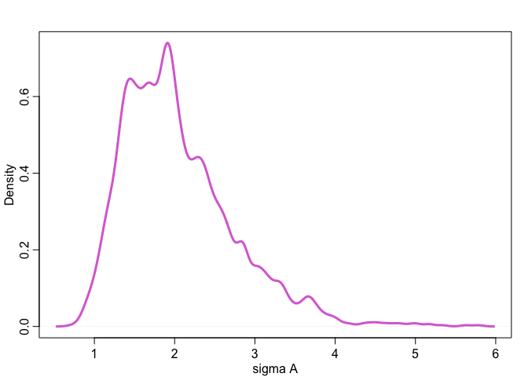
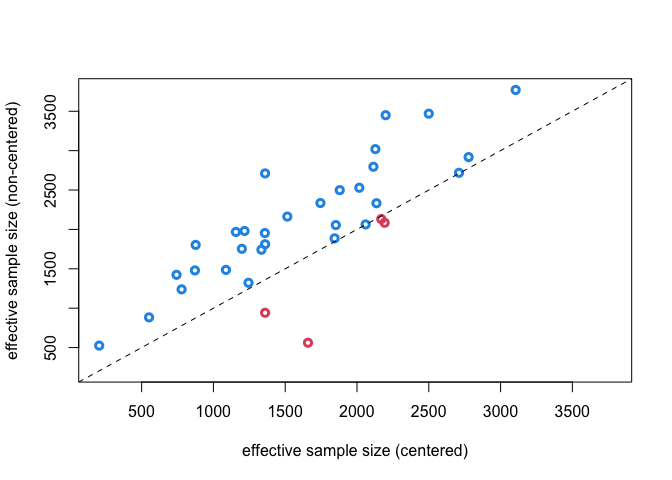

Lecture 13: Multi-Multilevel Model
================
Yurun (Ellen) Ying
2022-06-25

## Multiple clusters

We will revisit the chimpanzee data. This time we want to consider both
how treatment and block (experiment days) affect the outcome (pulling
left lever). We will use a full interaction model:

")

![\mathrm{logit}(p_i) = \alpha\_{A\[i\]} + \beta\_{T\[i\], B\[i\]}](https://latex.codecogs.com/png.image?%5Cdpi%7B110%7D&space;%5Cbg_white&space;%5Cmathrm%7Blogit%7D%28p_i%29%20%3D%20%5Calpha_%7BA%5Bi%5D%7D%20%2B%20%5Cbeta_%7BT%5Bi%5D%2C%20B%5Bi%5D%7D "\mathrm{logit}(p_i) = \alpha_{A[i]} + \beta_{T[i], B[i]}")

")

")

")

")

``` r
# clean data
dat <- list(
  P = d$pulled_left,
  A = d$actor,
  B = d$block,
  T = d$treatment
)

m13.4 <- ulam(
  alist(
    P ~ bernoulli(p),
    logit(p) <- a[A] + b[T,B],
    # adaptive priors
    a[A] ~ dnorm(a_bar, sigma_a),
    matrix[T,B]:b ~ dnorm(0, sigma_b),
    # hyperpriors
    a_bar ~ dnorm(0, 1.5),
    c(sigma_a, sigma_b) ~ dexp(1)
  ), data = dat, chains = 4, cores = 4
)
```

    ## Running MCMC with 4 parallel chains, with 1 thread(s) per chain...
    ## 
    ## Chain 1 Iteration:   1 / 1000 [  0%]  (Warmup) 
    ## Chain 1 Iteration: 100 / 1000 [ 10%]  (Warmup) 
    ## Chain 2 Iteration:   1 / 1000 [  0%]  (Warmup) 
    ## Chain 3 Iteration:   1 / 1000 [  0%]  (Warmup) 
    ## Chain 4 Iteration:   1 / 1000 [  0%]  (Warmup) 
    ## Chain 4 Iteration: 100 / 1000 [ 10%]  (Warmup) 
    ## Chain 1 Iteration: 200 / 1000 [ 20%]  (Warmup) 
    ## Chain 2 Iteration: 100 / 1000 [ 10%]  (Warmup) 
    ## Chain 3 Iteration: 100 / 1000 [ 10%]  (Warmup) 
    ## Chain 2 Iteration: 200 / 1000 [ 20%]  (Warmup) 
    ## Chain 4 Iteration: 200 / 1000 [ 20%]  (Warmup) 
    ## Chain 1 Iteration: 300 / 1000 [ 30%]  (Warmup) 
    ## Chain 2 Iteration: 300 / 1000 [ 30%]  (Warmup) 
    ## Chain 3 Iteration: 200 / 1000 [ 20%]  (Warmup) 
    ## Chain 1 Iteration: 400 / 1000 [ 40%]  (Warmup) 
    ## Chain 2 Iteration: 400 / 1000 [ 40%]  (Warmup) 
    ## Chain 4 Iteration: 300 / 1000 [ 30%]  (Warmup) 
    ## Chain 4 Iteration: 400 / 1000 [ 40%]  (Warmup) 
    ## Chain 1 Iteration: 500 / 1000 [ 50%]  (Warmup) 
    ## Chain 1 Iteration: 501 / 1000 [ 50%]  (Sampling) 
    ## Chain 2 Iteration: 500 / 1000 [ 50%]  (Warmup) 
    ## Chain 2 Iteration: 501 / 1000 [ 50%]  (Sampling) 
    ## Chain 4 Iteration: 500 / 1000 [ 50%]  (Warmup) 
    ## Chain 4 Iteration: 501 / 1000 [ 50%]  (Sampling) 
    ## Chain 1 Iteration: 600 / 1000 [ 60%]  (Sampling) 
    ## Chain 2 Iteration: 600 / 1000 [ 60%]  (Sampling) 
    ## Chain 4 Iteration: 600 / 1000 [ 60%]  (Sampling) 
    ## Chain 2 Iteration: 700 / 1000 [ 70%]  (Sampling) 
    ## Chain 4 Iteration: 700 / 1000 [ 70%]  (Sampling) 
    ## Chain 1 Iteration: 700 / 1000 [ 70%]  (Sampling) 
    ## Chain 2 Iteration: 800 / 1000 [ 80%]  (Sampling) 
    ## Chain 3 Iteration: 300 / 1000 [ 30%]  (Warmup) 
    ## Chain 1 Iteration: 800 / 1000 [ 80%]  (Sampling) 
    ## Chain 2 Iteration: 900 / 1000 [ 90%]  (Sampling) 
    ## Chain 4 Iteration: 800 / 1000 [ 80%]  (Sampling) 
    ## Chain 1 Iteration: 900 / 1000 [ 90%]  (Sampling) 
    ## Chain 4 Iteration: 900 / 1000 [ 90%]  (Sampling) 
    ## Chain 1 Iteration: 1000 / 1000 [100%]  (Sampling) 
    ## Chain 2 Iteration: 1000 / 1000 [100%]  (Sampling) 
    ## Chain 3 Iteration: 400 / 1000 [ 40%]  (Warmup) 
    ## Chain 4 Iteration: 1000 / 1000 [100%]  (Sampling) 
    ## Chain 1 finished in 1.5 seconds.
    ## Chain 2 finished in 1.4 seconds.
    ## Chain 4 finished in 1.4 seconds.
    ## Chain 3 Iteration: 500 / 1000 [ 50%]  (Warmup) 
    ## Chain 3 Iteration: 501 / 1000 [ 50%]  (Sampling) 
    ## Chain 3 Iteration: 600 / 1000 [ 60%]  (Sampling) 
    ## Chain 3 Iteration: 700 / 1000 [ 70%]  (Sampling) 
    ## Chain 3 Iteration: 800 / 1000 [ 80%]  (Sampling) 
    ## Chain 3 Iteration: 900 / 1000 [ 90%]  (Sampling) 
    ## Chain 3 Iteration: 1000 / 1000 [100%]  (Sampling) 
    ## Chain 3 finished in 2.6 seconds.
    ## 
    ## All 4 chains finished successfully.
    ## Mean chain execution time: 1.7 seconds.
    ## Total execution time: 2.9 seconds.

``` r
precis(m13.4, 3, pars = c("a_bar", "sigma_a", "sigma_b"))
```

    ##              mean        sd       5.5%     94.5%    n_eff     Rhat4
    ## a_bar   0.6350704 0.6978457 -0.4532400 1.6927810 1445.183 1.0008812
    ## sigma_a 2.0081785 0.6334940  1.1995886 3.1365795 1303.669 0.9984418
    ## sigma_b 0.4405074 0.1798614  0.1553144 0.7404116  164.323 1.0058383

Plot the posterior distribution

``` r
post <- extract.samples(m13.4)

# actor (handedness) effect
mean_a <- apply(inv_logit(post$a), 2, mean)
PI_a <- apply(inv_logit(post$a), 2, PI)
plot(NULL, xlab = "actor", ylab = "probability pull left",
     xlim = c(1, 7), ylim = c(0,1))
abline(h = 0.5, lty = 2)
points(1:7, mean_a, lwd = 4, cex = 1, col = "orchid")
for(i in 1:length(mean_a)) lines(c(i,i), c(PI_a[1,i], PI_a[2,i]), lwd = 7, col = col.alpha("orchid", 0.5))
```

<!-- -->

``` r
# variation
dens(post$sigma_a, lwd = 3, col = "orchid", xlab = "sigma A")
```

<!-- -->

Four actors appeared to be right-handed, and three actors appeared to be
left-handed.

``` r
# treatment effects
mean_b <- apply(post$b, c(2,3), mean)
plot(NULL, xlab = "treatment", ylab = "log-odds",
     xlim = c(0.5, 4.5), ylim = c(-2,2), xaxt = "n")
axis(1, at = c(1, 2, 3, 4), labels = c("R/N", "L/N", "R/P", "L/P"))
abline(h = 0, lty = 2)
for(i in 1:4) {
  for (j in 1:6) points(i+runif(1, -.15,.15), mean_b[i,j], cex = 1, lwd = 3, col = "seagreen")
}
```

<!-- -->

``` r
# variation
dens(post$sigma_b, lwd = 3, col = "seagreen", xlab = "sigma B")
```

<!-- -->

Treatment/block has little effects and less variation than the actor
effect.

## Posterior prediciton of mutilevel models

When doing posterior predictions for multilevel models, we need to
carefully consider how to incorporate the varying effects into the
simulation, especially when using a hypothetical new population. We
don’t want to use the structure in the original data; rather we will
simulate the varying effects from a distribution of the population.

We use the reedfrog example. We will try to explore the causal effect of
changing size distribution: Target population high density 35, 50%
groups have predation. 25% large. Intervention makes 75% large. wWat is
change in survival?

``` r
mSPG <- ulam(
  alist(
      S ~ binomial(D ,p),
      logit(p) <- a[T] + b[P,G],
      a[T] ~ normal(0, sigma),
      matrix[P,G]:b ~ normal(0, 1),
      sigma ~ exponential(1)
  ), data=dat, chains=4, cores=4)
```

    ## Running MCMC with 4 parallel chains, with 1 thread(s) per chain...
    ## 
    ## Chain 1 Iteration:   1 / 1000 [  0%]  (Warmup) 
    ## Chain 1 Iteration: 100 / 1000 [ 10%]  (Warmup) 
    ## Chain 1 Iteration: 200 / 1000 [ 20%]  (Warmup) 
    ## Chain 2 Iteration:   1 / 1000 [  0%]  (Warmup) 
    ## Chain 2 Iteration: 100 / 1000 [ 10%]  (Warmup) 
    ## Chain 2 Iteration: 200 / 1000 [ 20%]  (Warmup) 
    ## Chain 3 Iteration:   1 / 1000 [  0%]  (Warmup) 
    ## Chain 3 Iteration: 100 / 1000 [ 10%]  (Warmup) 
    ## Chain 3 Iteration: 200 / 1000 [ 20%]  (Warmup) 
    ## Chain 4 Iteration:   1 / 1000 [  0%]  (Warmup) 
    ## Chain 4 Iteration: 100 / 1000 [ 10%]  (Warmup) 
    ## Chain 1 Iteration: 300 / 1000 [ 30%]  (Warmup) 
    ## Chain 1 Iteration: 400 / 1000 [ 40%]  (Warmup) 
    ## Chain 1 Iteration: 500 / 1000 [ 50%]  (Warmup) 
    ## Chain 1 Iteration: 501 / 1000 [ 50%]  (Sampling) 
    ## Chain 1 Iteration: 600 / 1000 [ 60%]  (Sampling) 
    ## Chain 2 Iteration: 300 / 1000 [ 30%]  (Warmup) 
    ## Chain 2 Iteration: 400 / 1000 [ 40%]  (Warmup) 
    ## Chain 2 Iteration: 500 / 1000 [ 50%]  (Warmup) 
    ## Chain 2 Iteration: 501 / 1000 [ 50%]  (Sampling) 
    ## Chain 3 Iteration: 300 / 1000 [ 30%]  (Warmup) 
    ## Chain 3 Iteration: 400 / 1000 [ 40%]  (Warmup) 
    ## Chain 3 Iteration: 500 / 1000 [ 50%]  (Warmup) 
    ## Chain 3 Iteration: 501 / 1000 [ 50%]  (Sampling) 
    ## Chain 4 Iteration: 200 / 1000 [ 20%]  (Warmup) 
    ## Chain 4 Iteration: 300 / 1000 [ 30%]  (Warmup) 
    ## Chain 4 Iteration: 400 / 1000 [ 40%]  (Warmup) 
    ## Chain 1 Iteration: 700 / 1000 [ 70%]  (Sampling) 
    ## Chain 1 Iteration: 800 / 1000 [ 80%]  (Sampling) 
    ## Chain 1 Iteration: 900 / 1000 [ 90%]  (Sampling) 
    ## Chain 2 Iteration: 600 / 1000 [ 60%]  (Sampling) 
    ## Chain 2 Iteration: 700 / 1000 [ 70%]  (Sampling) 
    ## Chain 2 Iteration: 800 / 1000 [ 80%]  (Sampling) 
    ## Chain 2 Iteration: 900 / 1000 [ 90%]  (Sampling) 
    ## Chain 3 Iteration: 600 / 1000 [ 60%]  (Sampling) 
    ## Chain 3 Iteration: 700 / 1000 [ 70%]  (Sampling) 
    ## Chain 3 Iteration: 800 / 1000 [ 80%]  (Sampling) 
    ## Chain 4 Iteration: 500 / 1000 [ 50%]  (Warmup) 
    ## Chain 4 Iteration: 501 / 1000 [ 50%]  (Sampling) 
    ## Chain 4 Iteration: 600 / 1000 [ 60%]  (Sampling) 
    ## Chain 4 Iteration: 700 / 1000 [ 70%]  (Sampling) 
    ## Chain 1 Iteration: 1000 / 1000 [100%]  (Sampling) 
    ## Chain 2 Iteration: 1000 / 1000 [100%]  (Sampling) 
    ## Chain 3 Iteration: 900 / 1000 [ 90%]  (Sampling) 
    ## Chain 3 Iteration: 1000 / 1000 [100%]  (Sampling) 
    ## Chain 4 Iteration: 800 / 1000 [ 80%]  (Sampling) 
    ## Chain 4 Iteration: 900 / 1000 [ 90%]  (Sampling) 
    ## Chain 4 Iteration: 1000 / 1000 [100%]  (Sampling) 
    ## Chain 1 finished in 0.4 seconds.
    ## Chain 2 finished in 0.4 seconds.
    ## Chain 3 finished in 0.4 seconds.
    ## Chain 4 finished in 0.4 seconds.
    ## 
    ## All 4 chains finished successfully.
    ## Mean chain execution time: 0.4 seconds.
    ## Total execution time: 0.5 seconds.

``` r
post <- extract.samples(mSPG)

# sim first under status quo
n_groups <- 1000
n_samples <- 2000
S1 <- matrix(0, nrow = n_samples, ncol = n_groups)
for ( s in 1:n_groups ) {
    # sim a tank from posterior population
    aT <- rnorm(n_samples,0,post$sigma)
    # sample P and G for this group
    P <- sample(1:2, size=1, prob = c(0.5, 0.5)) # 50% pred
    G <- sample(1:2, size=1, prob = c(0.75, 0.25)) # 25% large
    # sim survival
    p <- inv_logit(aT + post$b[,P,G])
    S1[,s] <- rbinom(n_samples, 35, p)
}

# intervention - 50% large
S2 <- matrix(0, nrow = n_samples, ncol = n_groups)
for ( s in 1:n_groups ) {
    # sim a tank from posterior population
    aT <- rnorm(n_samples, 0, post$sigma)
    # sample P and G for this group
    P <- sample(1:2 ,size=1, prob=c(0.5,0.5)) # 50% pred
    G <- sample(1:2 ,size=1, prob=c(0.25,0.75)) # 75% large
    # sim survival
    p <- inv_logit(aT + post$b[,P,G])
    S2[,s] <- rbinom(n_samples, 35, p)
}

simplehist(as.numeric(S1), lwd=4, col=2, xlab="number surviving")
```

<!-- -->

``` r
simplehist(as.numeric(S2), lwd=4, col=2, xlab="number surviving")
```

<!-- -->

``` r
x <- table(as.numeric(S2 - S1))
x <- x/sum(x)

plot(NULL, xlim = c(-35,35), ylim = c(0,max(x)), 
     xlab = "change in survival", ylab = "proportion of simulation")
for (i in 1:length(x)) {
    xvals <- as.numeric(names(x))
    lines(rep(xvals[i], 2), c(0, x[i]), lwd = 4, col = ifelse(xvals[i]<0, 2, 4))
}

abline(v = mean(as.numeric(S2 - S1)), lty = 3, lwd = 3)
```

<!-- -->

## Sampling issues in multilevel models

Multilevel models often have joint distributions with steep surfaces,
which can make HMC sample inefficiently. The solution is to use
non-centered parameters instead of centered parameters.

Centered parameters:

")

)")

Non-centered parameters:

")

")

")

The two are equivalent. The non-centered parameters essentially ask HMC
to sample from a joint distribution of two Gaussian distributions and
construct the variable afterwards. This makes sampling more efficient.

In the context of the chimp model, we will write this:

")

![\begin{aligned}
\mathrm{logit}(p_i) &= \bar{\alpha} + z\_{\alpha, A\[i\]}\sigma\_{\alpha} \\\\
&+ z\_{\beta, T\[i\], B\[i\]}\sigma\_{\beta}
\end{aligned}](https://latex.codecogs.com/png.image?%5Cdpi%7B110%7D&space;%5Cbg_white&space;%5Cbegin%7Baligned%7D%0A%5Cmathrm%7Blogit%7D%28p_i%29%20%26%3D%20%5Cbar%7B%5Calpha%7D%20%2B%20z_%7B%5Calpha%2C%20A%5Bi%5D%7D%5Csigma_%7B%5Calpha%7D%20%5C%5C%0A%26%2B%20z_%7B%5Cbeta%2C%20T%5Bi%5D%2C%20B%5Bi%5D%7D%5Csigma_%7B%5Cbeta%7D%0A%5Cend%7Baligned%7D "\begin{aligned}
\mathrm{logit}(p_i) &= \bar{\alpha} + z_{\alpha, A[i]}\sigma_{\alpha} \\
&+ z_{\beta, T[i], B[i]}\sigma_{\beta}
\end{aligned}")

")

")

")

")

``` r
m13.4nc <- ulam(
  alist(
    P ~ bernoulli(p),
    logit(p) <- a_bar + z_a[A]*sigma_a + z_b[T,B]*sigma_b,
    # adaptive priors
    z_a[A] ~ dnorm(0, 1),
    matrix[T,B]:z_b ~ dnorm(0, 1),
    # hyperpriors
    a_bar ~ dnorm(0, 1.5),
    c(sigma_a, sigma_b) ~ dexp(1),
    # generated quantities
    gq> vector[A]:a <<- a_bar + z_a*sigma_a,
    gq> matrix[T,B]:b <<- z_b*sigma_b
  ), data = dat, chains = 4, cores = 4
)
```

    ## Running MCMC with 4 parallel chains, with 1 thread(s) per chain...
    ## 
    ## Chain 1 Iteration:   1 / 1000 [  0%]  (Warmup) 
    ## Chain 2 Iteration:   1 / 1000 [  0%]  (Warmup) 
    ## Chain 3 Iteration:   1 / 1000 [  0%]  (Warmup) 
    ## Chain 4 Iteration:   1 / 1000 [  0%]  (Warmup) 
    ## Chain 2 Iteration: 100 / 1000 [ 10%]  (Warmup) 
    ## Chain 3 Iteration: 100 / 1000 [ 10%]  (Warmup) 
    ## Chain 4 Iteration: 100 / 1000 [ 10%]  (Warmup) 
    ## Chain 1 Iteration: 100 / 1000 [ 10%]  (Warmup) 
    ## Chain 3 Iteration: 200 / 1000 [ 20%]  (Warmup) 
    ## Chain 1 Iteration: 200 / 1000 [ 20%]  (Warmup) 
    ## Chain 2 Iteration: 200 / 1000 [ 20%]  (Warmup) 
    ## Chain 4 Iteration: 200 / 1000 [ 20%]  (Warmup) 
    ## Chain 3 Iteration: 300 / 1000 [ 30%]  (Warmup) 
    ## Chain 1 Iteration: 300 / 1000 [ 30%]  (Warmup) 
    ## Chain 2 Iteration: 300 / 1000 [ 30%]  (Warmup) 
    ## Chain 4 Iteration: 300 / 1000 [ 30%]  (Warmup) 
    ## Chain 3 Iteration: 400 / 1000 [ 40%]  (Warmup) 
    ## Chain 2 Iteration: 400 / 1000 [ 40%]  (Warmup) 
    ## Chain 1 Iteration: 400 / 1000 [ 40%]  (Warmup) 
    ## Chain 4 Iteration: 400 / 1000 [ 40%]  (Warmup) 
    ## Chain 2 Iteration: 500 / 1000 [ 50%]  (Warmup) 
    ## Chain 2 Iteration: 501 / 1000 [ 50%]  (Sampling) 
    ## Chain 3 Iteration: 500 / 1000 [ 50%]  (Warmup) 
    ## Chain 3 Iteration: 501 / 1000 [ 50%]  (Sampling) 
    ## Chain 1 Iteration: 500 / 1000 [ 50%]  (Warmup) 
    ## Chain 1 Iteration: 501 / 1000 [ 50%]  (Sampling) 
    ## Chain 4 Iteration: 500 / 1000 [ 50%]  (Warmup) 
    ## Chain 4 Iteration: 501 / 1000 [ 50%]  (Sampling) 
    ## Chain 3 Iteration: 600 / 1000 [ 60%]  (Sampling) 
    ## Chain 1 Iteration: 600 / 1000 [ 60%]  (Sampling) 
    ## Chain 4 Iteration: 600 / 1000 [ 60%]  (Sampling) 
    ## Chain 2 Iteration: 600 / 1000 [ 60%]  (Sampling) 
    ## Chain 3 Iteration: 700 / 1000 [ 70%]  (Sampling) 
    ## Chain 1 Iteration: 700 / 1000 [ 70%]  (Sampling) 
    ## Chain 4 Iteration: 700 / 1000 [ 70%]  (Sampling) 
    ## Chain 3 Iteration: 800 / 1000 [ 80%]  (Sampling) 
    ## Chain 2 Iteration: 700 / 1000 [ 70%]  (Sampling) 
    ## Chain 4 Iteration: 800 / 1000 [ 80%]  (Sampling) 
    ## Chain 1 Iteration: 800 / 1000 [ 80%]  (Sampling) 
    ## Chain 3 Iteration: 900 / 1000 [ 90%]  (Sampling) 
    ## Chain 2 Iteration: 800 / 1000 [ 80%]  (Sampling) 
    ## Chain 3 Iteration: 1000 / 1000 [100%]  (Sampling) 
    ## Chain 4 Iteration: 900 / 1000 [ 90%]  (Sampling) 
    ## Chain 3 finished in 5.3 seconds.
    ## Chain 1 Iteration: 900 / 1000 [ 90%]  (Sampling) 
    ## Chain 1 Iteration: 1000 / 1000 [100%]  (Sampling) 
    ## Chain 2 Iteration: 900 / 1000 [ 90%]  (Sampling) 
    ## Chain 4 Iteration: 1000 / 1000 [100%]  (Sampling) 
    ## Chain 1 finished in 5.7 seconds.
    ## Chain 4 finished in 5.6 seconds.
    ## Chain 2 Iteration: 1000 / 1000 [100%]  (Sampling) 
    ## Chain 2 finished in 6.1 seconds.
    ## 
    ## All 4 chains finished successfully.
    ## Mean chain execution time: 5.7 seconds.
    ## Total execution time: 6.2 seconds.

Plot the effective sample size against the centered model.

``` r
the_pars <- c("a_bar", "sigma_a", "sigma_b", "b", "a")
precis_c <- precis(m13.4, depth = 3, pars = the_pars)
precis_nc <- precis(m13.4nc, depth =3 , pars = the_pars)
neff_table <- cbind(precis_c[,"n_eff"], precis_nc[,"n_eff"])
cols <- ifelse(neff_table[,1] > neff_table[,2], 2, 4)
plot(neff_table, xlim = range(neff_table), ylim = range(neff_table),
    xlab = "effective sample size (centered)", ylab = "effective sample size (non-centered)",
    lwd = 3, col = cols)
abline(a = 0, b = 1, lty = 2)
```

<!-- -->
