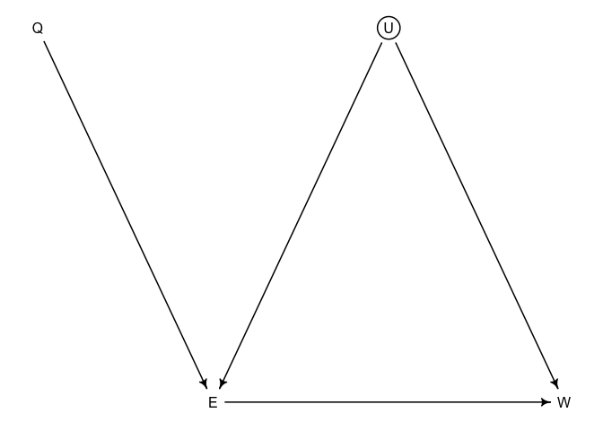

Lecture 14.5: Instrumental Variables
================
Yurun (Ellen) Ying
2022-07-04

## Instrumental variables

Correlated varying effects can also be implemented in constructing
instrumental variables for causal inferences.

Instrumental variables have to satisfy the following three criteria:

-   Independent of confounder U
-   Not independent of exposure X
-   Cannot influence outcome Y except through X

An example is th effect of education on wages. There are many
confounders, and we choose the season of birth as the instrumental
variable.

``` r
dag1 <- dagitty("dag{U[unobserved]; Q -> E -> W; E <- U-> W}")
coordinates(dag1) <- list(x = c(Q = 0.3, U = 0.5, E = 0.4, W = 0.6),
                          y = c(Q = 0.25, U = 0.25, E = 0.75, W = 0.75))
drawdag(dag1)
```

<!-- -->

A generative model of the data

``` r
set.seed(73)
N <- 500
U <- rnorm(N)
Q <- sample(1:4, size = N, replace = TRUE)
E <- rnorm(N, U + Q)
W <- rnorm(N, U) # education doesn't affect wages
dat_sim <- list(W = standardize(W),
                E = standardize(E),
                Q = standardize(Q))
```

The way to model this is just to write a statistical version of
generative model. To capture the effect of the unobserved confounders,
we will model E and W as from the same multivariate normal distribution:

 \\
\mu_{W,i} &= \alpha_W + \beta_{EW} E_i \\
\mu_{E,i} &= \alpha_E + \beta_{QE}Q_i
\end{aligned}")

``` r
m <- ulam(
  alist(
    c(W,E) ~ multi_normal(c(muW,muE), Rho, Sigma),
    muW <- aW + bEW*E,
    muE <- aE + bQE*Q,
    c(aW,aE) ~ normal(0, 0.2),
    c(bEW,bQE) ~ normal(0, 0.5),
    Rho ~ lkj_corr(2),
    Sigma ~ exponential(1)
  ), data = dat_sim, chains = 4, cores = 4
)

precis(m, depth = 3)
```

The influence of E on W is around zero, which reflects the true causal
influence. The correlation between E and W is reliably positive,
reflecting the common cause U.
