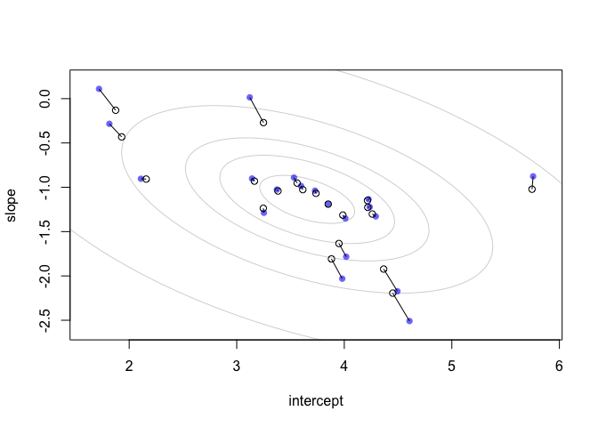
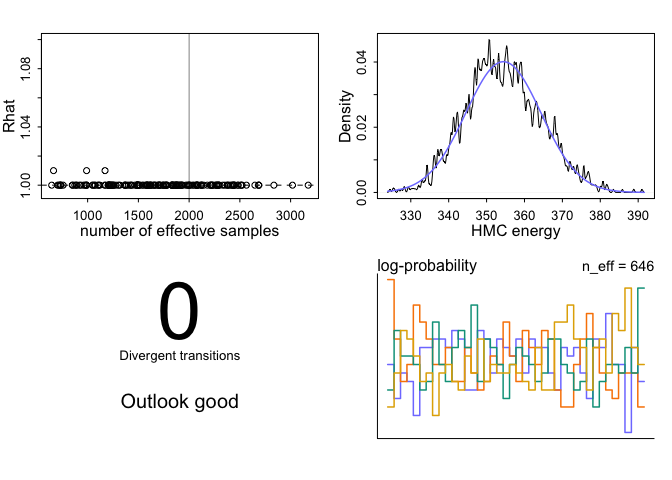

Lecture 14: Correlated Varying Effects
================
Yurun (Ellen) Ying
2022-06-27

## Multiple features in one clusters

Previously we’ve only looked at examples where we pool information on
one feature (predictor) across clusters. These are varying intercepts.
Now we want to model more than one features. This will be slopes in the
model. Our model will pool information about both the intercepts and the
slopes. Moreover, they will also capture the correlation between
intercepts and the slopes.

We will use the example of cafe visiting example. Imagine a robot visits
cafes in the morning and in the afternoon. The waiting time in each cafe
in the morning can be captured by a varying intercept, and a difference
between morning and afternoon waiting time will be expressed by a
varying slope. Since the difference is probably larger in popular cafes,
intercepts and slopes are correlated.

We will simualte the data to see the modeling strategy:

``` r
a <- 3.5 # average morning wait time
b <- -1 # average difference afternoon wait time
Mu <- c(a, b) # vector of mu
sigma_a <- 1 # sd in the intercepts
sigma_b <- 0.5 # sd in slopes
rho <- -0.7 # correlation between intercepts and slopes
```

To generate random variables from multivariate normal distributions, we
need a matrix of covariance.


``` r
# construct a covariance matrix
sigmas <- c(sigma_a, sigma_b)
Rho <- matrix(c(1,rho,rho,1), nrow = 2) # correlation matrix
# matrix multiplication to get the covariance matrix
Sigma <- diag(sigmas) %*% Rho %*% diag(sigmas)
```

Simulate the intercepts and slopes

``` r
N_cafes <- 20

set.seed(5)
vary_effects <- mvrnorm(N_cafes, Mu, Sigma)
# get the slopes and the intercepts
a_cafe <- vary_effects[,1]
b_cafe <- vary_effects[,2]

# visualize
plot(a_cafe, b_cafe, col = rangi2, pch = 16,
     xlab = "intercepts (a_cafe)", ylab = "slopes (b_cafe)")
for (l in c(0.1, 0.3, 0.5, 0.8, 0.99))
  lines(ellipse(Sigma, centre = Mu, level = l), col = col.alpha("black", 0.2))
```

<!-- -->

Simulate the data. Each cafe is visited 10 times, 5 times in the morning
and 5 times in the afternoon

``` r
set.seed(22)
N_visits <- 10
afternoon <- rep(0:1, N_cafes*N_visits/2)
cafe_id <- rep(1:N_cafes, each = N_visits)
mu <- a_cafe[cafe_id] + b_cafe[cafe_id] * afternoon
sigma <- 0.5 # sd within cafes
wait <- rnorm(N_visits*N_cafes, mu, sigma)
d <- data.frame(cafe = cafe_id, afternoon = afternoon, wait = wait)
```

Fit a varying slope model to this data. We will first write out the
model in a mathematical form:

")

![\mu_i = \alpha\_{CAFE\[i\]} + \beta\_{CAFE\[i\]}A_i](https://latex.codecogs.com/png.image?%5Cdpi%7B110%7D&space;%5Cbg_white&space;%5Cmu_i%20%3D%20%5Calpha_%7BCAFE%5Bi%5D%7D%20%2B%20%5Cbeta_%7BCAFE%5Bi%5D%7DA_i "\mu_i = \alpha_{CAFE[i]} + \beta_{CAFE[i]}A_i")

Varying effects as a multivariate normal distribution

![\begin{bmatrix}
\alpha\_{CAFE\[i\]} \\\\ 
\beta\_{CAFE\[i\]}
\end{bmatrix} 
\sim \mathrm{MVNormal}(
\begin{bmatrix}
\alpha \\\\ 
\beta
\end{bmatrix}, 
\mathrm{\mathbf{S}}
)](https://latex.codecogs.com/png.image?%5Cdpi%7B110%7D&space;%5Cbg_white&space;%5Cbegin%7Bbmatrix%7D%0A%5Calpha_%7BCAFE%5Bi%5D%7D%20%5C%5C%20%0A%5Cbeta_%7BCAFE%5Bi%5D%7D%0A%5Cend%7Bbmatrix%7D%20%0A%5Csim%20%5Cmathrm%7BMVNormal%7D%28%0A%5Cbegin%7Bbmatrix%7D%0A%5Calpha%20%5C%5C%20%0A%5Cbeta%0A%5Cend%7Bbmatrix%7D%2C%20%0A%5Cmathrm%7B%5Cmathbf%7BS%7D%7D%0A%29 "\begin{bmatrix}
\alpha_{CAFE[i]} \\ 
\beta_{CAFE[i]}
\end{bmatrix} 
\sim \mathrm{MVNormal}(
\begin{bmatrix}
\alpha \\ 
\beta
\end{bmatrix}, 
\mathrm{\mathbf{S}}
)")


Hyper-priors:

")

")

")

")

The last line is a distribution for a correlation matrix.

``` r
# fit the model
m14.1 <- ulam(
  alist(
    wait ~ normal(mu, sigma),
    mu <- a_cafe[cafe] + b_cafe[cafe]*afternoon,
    # varying effects
    c(a_cafe,b_cafe)[cafe] ~ multi_normal(c(a,b), Rho, sigma_cafe),
    # hyper-priors
    a ~ normal(5,2),
    b ~ normal(-1, 0.5),
    c(sigma_cafe, sigma) ~ exponential(1),
    Rho ~ lkj_corr(2)
  ), data = d, chains = 4, cores = 4
)
```

    ## Running MCMC with 4 parallel chains, with 1 thread(s) per chain...
    ## 
    ## Chain 1 Iteration:   1 / 1000 [  0%]  (Warmup) 
    ## Chain 2 Iteration:   1 / 1000 [  0%]  (Warmup) 
    ## Chain 3 Iteration:   1 / 1000 [  0%]  (Warmup) 
    ## Chain 4 Iteration:   1 / 1000 [  0%]  (Warmup) 
    ## Chain 1 Iteration: 100 / 1000 [ 10%]  (Warmup) 
    ## Chain 1 Iteration: 200 / 1000 [ 20%]  (Warmup) 
    ## Chain 2 Iteration: 100 / 1000 [ 10%]  (Warmup) 
    ## Chain 3 Iteration: 100 / 1000 [ 10%]  (Warmup) 
    ## Chain 4 Iteration: 100 / 1000 [ 10%]  (Warmup) 
    ## Chain 1 Iteration: 300 / 1000 [ 30%]  (Warmup) 
    ## Chain 2 Iteration: 200 / 1000 [ 20%]  (Warmup) 
    ## Chain 3 Iteration: 200 / 1000 [ 20%]  (Warmup) 
    ## Chain 4 Iteration: 200 / 1000 [ 20%]  (Warmup) 
    ## Chain 1 Iteration: 400 / 1000 [ 40%]  (Warmup) 
    ## Chain 2 Iteration: 300 / 1000 [ 30%]  (Warmup) 
    ## Chain 3 Iteration: 300 / 1000 [ 30%]  (Warmup) 
    ## Chain 4 Iteration: 300 / 1000 [ 30%]  (Warmup) 
    ## Chain 1 Iteration: 500 / 1000 [ 50%]  (Warmup) 
    ## Chain 1 Iteration: 501 / 1000 [ 50%]  (Sampling) 
    ## Chain 3 Iteration: 400 / 1000 [ 40%]  (Warmup) 
    ## Chain 4 Iteration: 400 / 1000 [ 40%]  (Warmup) 
    ## Chain 2 Iteration: 400 / 1000 [ 40%]  (Warmup) 
    ## Chain 4 Iteration: 500 / 1000 [ 50%]  (Warmup) 
    ## Chain 1 Iteration: 600 / 1000 [ 60%]  (Sampling) 
    ## Chain 2 Iteration: 500 / 1000 [ 50%]  (Warmup) 
    ## Chain 2 Iteration: 501 / 1000 [ 50%]  (Sampling) 
    ## Chain 3 Iteration: 500 / 1000 [ 50%]  (Warmup) 
    ## Chain 3 Iteration: 501 / 1000 [ 50%]  (Sampling) 
    ## Chain 4 Iteration: 501 / 1000 [ 50%]  (Sampling) 
    ## Chain 1 Iteration: 700 / 1000 [ 70%]  (Sampling) 
    ## Chain 4 Iteration: 600 / 1000 [ 60%]  (Sampling) 
    ## Chain 2 Iteration: 600 / 1000 [ 60%]  (Sampling) 
    ## Chain 3 Iteration: 600 / 1000 [ 60%]  (Sampling) 
    ## Chain 1 Iteration: 800 / 1000 [ 80%]  (Sampling) 
    ## Chain 4 Iteration: 700 / 1000 [ 70%]  (Sampling) 
    ## Chain 1 Iteration: 900 / 1000 [ 90%]  (Sampling) 
    ## Chain 2 Iteration: 700 / 1000 [ 70%]  (Sampling) 
    ## Chain 3 Iteration: 700 / 1000 [ 70%]  (Sampling) 
    ## Chain 4 Iteration: 800 / 1000 [ 80%]  (Sampling) 
    ## Chain 2 Iteration: 800 / 1000 [ 80%]  (Sampling) 
    ## Chain 1 Iteration: 1000 / 1000 [100%]  (Sampling) 
    ## Chain 3 Iteration: 800 / 1000 [ 80%]  (Sampling) 
    ## Chain 4 Iteration: 900 / 1000 [ 90%]  (Sampling) 
    ## Chain 1 finished in 1.8 seconds.
    ## Chain 2 Iteration: 900 / 1000 [ 90%]  (Sampling) 
    ## Chain 2 Iteration: 1000 / 1000 [100%]  (Sampling) 
    ## Chain 3 Iteration: 900 / 1000 [ 90%]  (Sampling) 
    ## Chain 4 Iteration: 1000 / 1000 [100%]  (Sampling) 
    ## Chain 2 finished in 1.9 seconds.
    ## Chain 4 finished in 1.8 seconds.
    ## Chain 3 Iteration: 1000 / 1000 [100%]  (Sampling) 
    ## Chain 3 finished in 2.0 seconds.
    ## 
    ## All 4 chains finished successfully.
    ## Mean chain execution time: 1.9 seconds.
    ## Total execution time: 2.2 seconds.

Now let’s plot the posterior distribution of mean varying effects
against the raw, unpooled estimates.

``` r
# unpooled estimates directly from the data
a1 <- sapply(1:N_cafes, function(i) mean(wait[cafe_id == i & afternoon == 0]))
b1 <- sapply(1:N_cafes, function(i) mean(wait[cafe_id == i & afternoon == 1])) - a1

# extract posterior means of partially pooled estimates
post <- extract.samples(m14.1)
a2 <- apply(post$a_cafe, 2, mean)
b2 <- apply(post$b_cafe, 2, mean)

# compute posterior mean bivariate Gaussian
Mu_est <- c(mean(post$a), mean(post$b))
rho_est <- mean(post$Rho[,1,2])
sa_est <- mean(post$sigma_cafe[,1])
sb_est <- mean(post$sigma_cafe[,2])
cov_ab <- sa_est * sb_est * rho_est
Sigma_est <- matrix(c(sa_est^2, cov_ab, cov_ab, sb_est^2), ncol = 2)

# plot both and connect with line
plot(a1, b1, xlab = "intercept", ylab = "slope", pch = 16, col = rangi2, 
     xlim = c(min(a1) - 0.1, max(a1) + 0.1), ylim = c(min(b1) - 0.1, max(b1) + 0.1))

# draw contours
for (l in c(0.1, 0.3, 0.5, 0.8, 0.99))
  lines(ellipse(Sigma_est, centre = Mu_est, level = l), col = col.alpha("black", 0.2))

# draw points
points(a2, b2, pch = 1)
for (i in 1:N_cafes) lines(c(a1[i], a2[i]), c(b1[i], b2[i]))
```

<!-- -->

The estimates shrink from the unpooled raw data to the center of the
contours, Points that are far away from the center shrink more. This is
a pattern also existing in the varying intercept model we saw in last
chpater.

Let’s now plot the posterior distributions on the outcome scale.

``` r
# convert varying effects to waiting times
wait_morning_1 <- a1
wait_afternoon_1 <- a1 + b1
wait_morning_2 <- a2
wait_afternoon_2 <- a2 + b2

# bivariate Gaussian distribution by simulation
v <- mvrnorm(1e4, Mu_est, Sigma_est)
v[,2] <- v[,1] + v[,2] # afternoon time
Sigma_est2 <- cov(v)
Mu_est2 <- Mu_est
Mu_est2[2] <- Mu_est[1] + Mu_est[2]

# plot points
# plot both and connect with line
plot(wait_morning_1, wait_afternoon_1, pch = 16, col = rangi2, 
     xlab = "morning wait", ylab = "afternoon wait", 
     xlim = c(min(wait_morning_1) - 0.1, max(wait_morning_1) + 0.1), 
     ylim = c(min(wait_afternoon_1) - 0.1, max(wait_afternoon_1) + 0.1))

# draw contours
for (l in c(0.1, 0.3, 0.5, 0.8, 0.99))
  lines(ellipse(Sigma_est2, centre = Mu_est2, level = l), col = col.alpha("black", 0.2))

# a line indicating equal waiting time
abline(a = 0, b = 1, lty = 2)

# draw points
points(wait_morning_2, wait_afternoon_2, pch = 1)
for (i in 1:N_cafes) lines(c(wait_morning_1[i], wait_morning_2[i]), 
                           c(wait_afternoon_1[i], wait_afternoon_2[i]))
```

<!-- -->

## More clusters and more slopes

We will go back to the chimpanzee example to illustrate a more complex
varying effect model. Previously, we only consider varying intercepts
for each actor. Now we would like to model the four treatments within
each actor. We want to model their correlations because the treatments
are not completely independent of one another. The effect of one can
inform the effect of another. We would also like to consider another
cluster - block, and model the correlations of the treatments within
each block. Our model looks like this:

")

![\mathrm{logit}(p_i) = \bar{\alpha}\_{A\[i\]} + \alpha\_{A\[i\], T\[i\]} + \bar{\beta}\_{B\[i\]} + \beta\_{B\[i\], T\[i\]}](https://latex.codecogs.com/png.image?%5Cdpi%7B110%7D&space;%5Cbg_white&space;%5Cmathrm%7Blogit%7D%28p_i%29%20%3D%20%5Cbar%7B%5Calpha%7D_%7BA%5Bi%5D%7D%20%2B%20%5Calpha_%7BA%5Bi%5D%2C%20T%5Bi%5D%7D%20%2B%20%5Cbar%7B%5Cbeta%7D_%7BB%5Bi%5D%7D%20%2B%20%5Cbeta_%7BB%5Bi%5D%2C%20T%5Bi%5D%7D "\mathrm{logit}(p_i) = \bar{\alpha}_{A[i]} + \alpha_{A[i], T[i]} + \bar{\beta}_{B[i]} + \beta_{B[i], T[i]}")

We allow varying intercepts for actors and blocks (two types of
clusters). And we also allow treatment effects to affect different
actors and block differently. This is the varying slopes we are
considering in our model.

The following lines specify the adaptive priors and hyper-priors:

![\alpha_j \sim \mathrm{MVNormal}(\[0,0,0,0\], \mathrm{\mathbf{R}}\_A, \mathrm{\mathbf{S}}\_A) \space \mathrm{for} \space j \in 1 \dots 7](https://latex.codecogs.com/png.image?%5Cdpi%7B110%7D&space;%5Cbg_white&space;%5Calpha_j%20%5Csim%20%5Cmathrm%7BMVNormal%7D%28%5B0%2C0%2C0%2C0%5D%2C%20%5Cmathrm%7B%5Cmathbf%7BR%7D%7D_A%2C%20%5Cmathrm%7B%5Cmathbf%7BS%7D%7D_A%29%20%5Cspace%20%5Cmathrm%7Bfor%7D%20%5Cspace%20j%20%5Cin%201%20%5Cdots%207 "\alpha_j \sim \mathrm{MVNormal}([0,0,0,0], \mathrm{\mathbf{R}}_A, \mathrm{\mathbf{S}}_A) \space \mathrm{for} \space j \in 1 \dots 7")

![\beta_k \sim \mathrm{MVNormal}(\[0,0,0,0\], \mathrm{\mathbf{R}}\_B, \mathrm{\mathbf{S}}\_B) \space \mathrm{for} \space k \in 1 \dots 6](https://latex.codecogs.com/png.image?%5Cdpi%7B110%7D&space;%5Cbg_white&space;%5Cbeta_k%20%5Csim%20%5Cmathrm%7BMVNormal%7D%28%5B0%2C0%2C0%2C0%5D%2C%20%5Cmathrm%7B%5Cmathbf%7BR%7D%7D_B%2C%20%5Cmathrm%7B%5Cmathbf%7BS%7D%7D_B%29%20%5Cspace%20%5Cmathrm%7Bfor%7D%20%5Cspace%20k%20%5Cin%201%20%5Cdots%206 "\beta_k \sim \mathrm{MVNormal}([0,0,0,0], \mathrm{\mathbf{R}}_B, \mathrm{\mathbf{S}}_B) \space \mathrm{for} \space k \in 1 \dots 6")

")

")

 \space \mathrm{for} \space j,k \in 1 \dots 4")

")

Now translate the model into code:

``` r
# comment out to sav knitting time
# m14.2 <- ulam(
#   alist(
#     P ~ bernoulli(p),
#     logit(p) <- abar[A] + a[A,T] + bbar[B] + b[B,T],
#     
#     # adaptive priors
#     vector[4]:a[A] ~ multi_normal(0, Rho_A, sigma_A),
#     vector[4]:b[B] ~ multi_normal(0, Rho_B, sigma_B),
#     abar[A] ~ normal(0, tau_A),
#     bbar[B] ~ normal(0, tau_B),
#     
#     # hyper-priors
#     c(sigma_A,sigma_B,tau_A,tau_B) ~ exponential(1),
#     c(Rho_A,Rho_B) ~ dlkjcorr(4)
#   ), data = dat, chains = 4, cores = 4
# )
```

This model has many divergent transitions. So, as in the previous
lecture, we need to use non-centered parameters to make the sampling
more efficient. But this time it is to pull the hyper-priors out of a
multivariate normal distribution:

 \mathbf{L}_A \mathbf{Z}_{T,A})^T")

where

is the Cholesky factor of correlation matrix across treatments.

The adaptive priors and hyper-priors in the model become:

 \mathbf{L}_A \mathbf{Z}_{T,A})^T")

 \mathbf{L}_B \mathbf{Z}_{T,B})^T")

")


")

 \space \mathrm{for} \space j,k \in 1 \dots 4")

")

Translate into code:

``` r
m14.3 <- ulam(
  alist(
    P ~ bernoulli(p),
    logit(p) <- abar[A] + a[A,T] + bbar[B] + b[B,T],
    
    # adaptive priors - non-centered
    transpars> matrix[A,4]:a <<- compose_noncentered(sigma_A, L_Rho_A, z_A),
    transpars> matrix[B,4]:b <<- compose_noncentered(sigma_B, L_Rho_B, z_B),
    matrix[4,A]:z_A ~ normal(0,1),
    matrix[4,B]:z_B ~ normal(0,1),
    z_Abar[A] ~ normal(0,1),
    z_Bbar[B] ~ normal(0,1),
    transpars> vector[A]:abar <<- z_Abar * tau_A,
    transpars> vector[B]:bbar <<- z_Bbar * tau_B,
    
    # hyper-priors
    c(tau_A,tau_B) ~ exponential(1),
    vector[4]:sigma_A ~ exponential(1),
    cholesky_factor_corr[4]:L_Rho_A ~ lkj_corr_cholesky(4),
    vector[4]:sigma_B ~ exponential(1),
    cholesky_factor_corr[4]:L_Rho_B ~ lkj_corr_cholesky(4),
    
    # compute ordinary correlation matrixes
    gq> matrix[4,4]:Rho_A <<- Chol_to_Corr(L_Rho_A),
    gq> matrix[4,4]:Rho_B <<- Chol_to_Corr(L_Rho_B)
  ), data = dat, chains = 4, cores = 4
)
```

    ## Running MCMC with 4 parallel chains, with 1 thread(s) per chain...
    ## 
    ## Chain 1 Iteration:   1 / 1000 [  0%]  (Warmup) 
    ## Chain 2 Iteration:   1 / 1000 [  0%]  (Warmup) 
    ## Chain 3 Iteration:   1 / 1000 [  0%]  (Warmup) 
    ## Chain 4 Iteration:   1 / 1000 [  0%]  (Warmup) 
    ## Chain 3 Iteration: 100 / 1000 [ 10%]  (Warmup) 
    ## Chain 4 Iteration: 100 / 1000 [ 10%]  (Warmup) 
    ## Chain 1 Iteration: 100 / 1000 [ 10%]  (Warmup) 
    ## Chain 2 Iteration: 100 / 1000 [ 10%]  (Warmup) 
    ## Chain 2 Iteration: 200 / 1000 [ 20%]  (Warmup) 
    ## Chain 3 Iteration: 200 / 1000 [ 20%]  (Warmup) 
    ## Chain 1 Iteration: 200 / 1000 [ 20%]  (Warmup) 
    ## Chain 4 Iteration: 200 / 1000 [ 20%]  (Warmup) 
    ## Chain 2 Iteration: 300 / 1000 [ 30%]  (Warmup) 
    ## Chain 3 Iteration: 300 / 1000 [ 30%]  (Warmup) 
    ## Chain 1 Iteration: 300 / 1000 [ 30%]  (Warmup) 
    ## Chain 2 Iteration: 400 / 1000 [ 40%]  (Warmup) 
    ## Chain 3 Iteration: 400 / 1000 [ 40%]  (Warmup) 
    ## Chain 4 Iteration: 300 / 1000 [ 30%]  (Warmup) 
    ## Chain 1 Iteration: 400 / 1000 [ 40%]  (Warmup) 
    ## Chain 2 Iteration: 500 / 1000 [ 50%]  (Warmup) 
    ## Chain 2 Iteration: 501 / 1000 [ 50%]  (Sampling) 
    ## Chain 3 Iteration: 500 / 1000 [ 50%]  (Warmup) 
    ## Chain 3 Iteration: 501 / 1000 [ 50%]  (Sampling) 
    ## Chain 4 Iteration: 400 / 1000 [ 40%]  (Warmup) 
    ## Chain 1 Iteration: 500 / 1000 [ 50%]  (Warmup) 
    ## Chain 1 Iteration: 501 / 1000 [ 50%]  (Sampling) 
    ## Chain 2 Iteration: 600 / 1000 [ 60%]  (Sampling) 
    ## Chain 3 Iteration: 600 / 1000 [ 60%]  (Sampling) 
    ## Chain 4 Iteration: 500 / 1000 [ 50%]  (Warmup) 
    ## Chain 4 Iteration: 501 / 1000 [ 50%]  (Sampling) 
    ## Chain 1 Iteration: 600 / 1000 [ 60%]  (Sampling) 
    ## Chain 2 Iteration: 700 / 1000 [ 70%]  (Sampling) 
    ## Chain 3 Iteration: 700 / 1000 [ 70%]  (Sampling) 
    ## Chain 3 Iteration: 800 / 1000 [ 80%]  (Sampling) 
    ## Chain 1 Iteration: 700 / 1000 [ 70%]  (Sampling) 
    ## Chain 2 Iteration: 800 / 1000 [ 80%]  (Sampling) 
    ## Chain 4 Iteration: 600 / 1000 [ 60%]  (Sampling) 
    ## Chain 3 Iteration: 900 / 1000 [ 90%]  (Sampling) 
    ## Chain 1 Iteration: 800 / 1000 [ 80%]  (Sampling) 
    ## Chain 2 Iteration: 900 / 1000 [ 90%]  (Sampling) 
    ## Chain 4 Iteration: 700 / 1000 [ 70%]  (Sampling) 
    ## Chain 2 Iteration: 1000 / 1000 [100%]  (Sampling) 
    ## Chain 3 Iteration: 1000 / 1000 [100%]  (Sampling) 
    ## Chain 3 finished in 5.5 seconds.
    ## Chain 1 Iteration: 900 / 1000 [ 90%]  (Sampling) 
    ## Chain 2 finished in 5.6 seconds.
    ## Chain 4 Iteration: 800 / 1000 [ 80%]  (Sampling) 
    ## Chain 1 Iteration: 1000 / 1000 [100%]  (Sampling) 
    ## Chain 1 finished in 5.9 seconds.
    ## Chain 4 Iteration: 900 / 1000 [ 90%]  (Sampling) 
    ## Chain 4 Iteration: 1000 / 1000 [100%]  (Sampling) 
    ## Chain 4 finished in 6.3 seconds.
    ## 
    ## All 4 chains finished successfully.
    ## Mean chain execution time: 5.9 seconds.
    ## Total execution time: 6.5 seconds.

No divergent transition in this model. An effective number of samples
looks good as well.

``` r
dashboard(m14.3)
```

<!-- -->

Plot the posterior distribution

``` r
post <- extract.samples(m14.3)

# by actor-treatment
post_a <- lapply(1:4, function(i) post$a[,,i] + post$abar)
mean_a <- lapply(1:4, function(i) apply(inv_logit(post_a[[i]]), 2, mean))
PI_a <- lapply(1:4, function(i) apply(inv_logit(post_a[[i]]), 2, PI))

plot(NULL, xlab = "actor", ylab = "probability pull left",
     xlim = c(1-0.5, 7+0.5), ylim = c(0,1))
abline(h = 0.5, lty = 2)
for (i in 1:4) {
  for (j in 1:7) {
    lines(rep(j + (i-2.5)/5, 2), c(PI_a[[i]][1,j], PI_a[[i]][2,j]),
          lwd = 7, col = col.alpha("orchid", 0.5))
    points(j + (i-2.5)/5, mean_a[[i]][j], cex = 1, lwd = 3, col = "orchid")
  }
}
```

<!-- -->

``` r
# variance among actors
dens(post$tau_A, lwd = 3, col = "orchid", xlab = "sd among actors", 
     xlim = c(0, 5.5), ylim = c(0, 2))
for (i in 1:4) dens(post$sigma_A[,i], lwd = 2, col = col.alpha("steelblue", 0.5), add = TRUE)
text(3,0.5, "actor means", col = "orchid")
text(1,1, "by treatment", col = "steelblue")
```

<!-- -->

``` r
# by block-treatment
post_b <- lapply(1:4, function(i) post$b[,,i] + post$bbar)
mean_b <- lapply(1:4, function(i) apply(inv_logit(post_b[[i]]), 2, mean))
PI_b <- lapply(1:4, function(i) apply(inv_logit(post_b[[i]]), 2, PI))

plot(NULL, xlab = "block", ylab = "probability pull left",
     xlim = c(1-0.5, 6+0.5), ylim = c(0,1))
abline(h = 0.5, lty = 2)
for (i in 1:4) {
  for (j in 1:6) {
    lines(rep(j + (i-2.5)/6, 2), c(PI_b[[i]][1,j], PI_b[[i]][2,j]),
          lwd = 7, col = col.alpha("seagreen", 0.5))
    points(j + (i-2.5)/6, mean_b[[i]][j], cex = 1, lwd = 3, col = "seagreen")
  }
}
```

<!-- -->

``` r
# variance among actors
dens(post$tau_B, lwd = 3, col = "seagreen", xlab = "sd among blocks", 
     xlim = c(0, 4), ylim = c(0, 4))
for (i in 1:4) dens(post$sigma_B[,i], lwd = 2, col = col.alpha("steelblue", 0.5), add = TRUE)
text(0.5,3, "block means", col = "seagreen")
text(1,1.2, "by treatment", col = "steelblue")
```

<!-- -->
