Lecture 15: Social Networks
================
Yurun (Ellen) Ying
2022-06-29

## Modeling Social Networks

The data we are gonna look at is a food sharing data in Arang Dak. The
estimand is to what extent sharing is explained by reciprocity, aka, to
what extent sharing is balanced within dyads. And how much sharing is
explained by generalized sharing?

``` r
data("KosterLeckie")
```

A DAG for this data (and perhaps for a lot of social network problems as
well). Giving is motivated by the social ties in both directions as well
as by general characteristics of the two households. The social ties are
also influenced by general characteristics of the two households. These
characteristics include things like wealth, hobbies, locations, etc.

``` r
dag1 <- dagitty("dag{H_A -> G_AB <- H_B; T_AB -> G_AB <- T_BA;
                H_A -> T_AB <- H_B; H_A -> T_BA <- H_B}")
coordinates(dag1) <- list(x = c(H_A = 0.4, H_B = 0.6, G_AB = 0.5, T_AB = 0.5, T_BA = 0.5),
                          y = c(H_A = 0.5, H_B = 0.5, G_AB = 0.5, T_AB = 0.3, T_BA = 0.7))
drawdag(dag1)
```

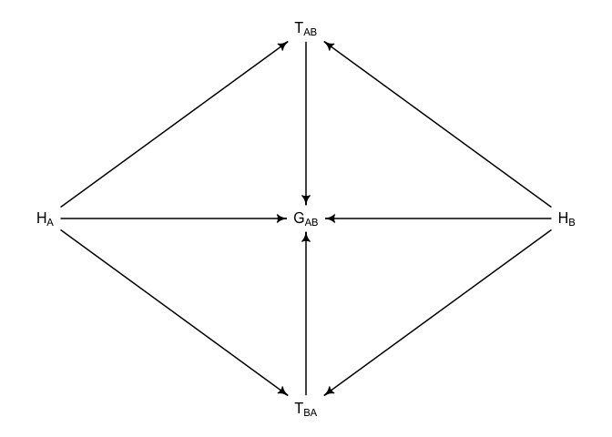<!-- -->

### A generative model of social networks

We will now try to simulate social network data, build statistical
models, and test them against the simulated data before we apply them on
the real data. This process will be iterated many times in the workflow
of real projects.

``` r
# N households
N <- 25
dyads <- t(combn(N,2)) # all possible combinations of households
n_dyads <- nrow(dyads)

# simulate friendships in which ties are reciprocal
f <- rbern(n_dyads, 0.1) # 10% of dyads are friends

# simulate directed ties that are not reciprocal
alpha <- -3 # base rate of ties: -3 = 0.05
y <- matrix(NA, N, N) # matrix of ties for all individual households

# simulate ties
for (i in 1:N) for (j in 1:N) {
  
  if (i != j) {
  
    # directed tie from i to j
    ids <- sort(c(i,j))
    the_dyad <- which(dyads[,1] == ids[1] & dyads[,2] == ids[2])
    # either friend, or not friend but have a tie at a prob of 5%
    p_tie <- f[the_dyad] + (1 - f[the_dyad])*inv_logit(alpha) 
    y[i,j] <- rbern(1, p_tie)
  }
  
}

# simulate gifts
giftsAB <- rep(0, n_dyads)
giftsBA <- rep(0, n_dyads)
lambda <- log(c(0.5,2)) # rates of giving for y=0, y=1
for (i in 1:n_dyads){
  A <- dyads[i,1]
  B <- dyads[i,2]
  giftsAB[i] <- rpois(1, exp(lambda[1 + y[A,B]]))
  giftsBA[i] <- rpois(1, exp(lambda[1 + y[B,A]]))
}

# draw network
sng <- graph_from_adjacency_matrix(y)
lx <- layout_nicely(sng)
vcol <- "#DE536B"
plot(sng, layout = lx, vertex.size = 8, vertex.color = vcol,
     edge.arrow.size = 0.75, edge.width = 2, edge.curved = 0.35, edge.color = grau(),
     asp = 0.9, margin = -0.05, vertex.label = NA)
```

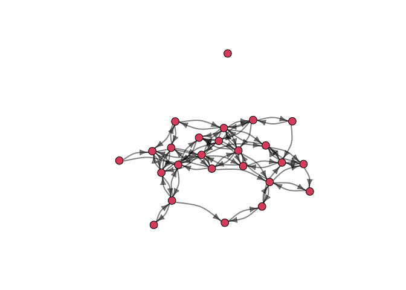<!-- -->

Now let’s build a statistical model for this synthetic data. This time
the model will not fully reflect what we have in the data. We will have
to GLMs for gifts from A to B and those from B to A separately:

![\begin{aligned}
G\_{AB} &\sim \mathrm{Poisson}(\lambda\_{AB}) \\\\
\mathrm{log}(\lambda\_{AB}) &= \alpha + T\_{AB} \\\\
G\_{BA} &\sim \mathrm{Poisson}(\lambda\_{BA}) \\\\
\mathrm{log}(\lambda\_{BA}) &= \alpha + T\_{BA} \\\\
\begin{pmatrix}
\lambda\_{AB} \\\\
\lambda\_{BA}
\end{pmatrix} &\sim \mathrm{MVNormal}(
\begin{bmatrix}
0 \\\\
0
\end{bmatrix},
\begin{bmatrix}
\sigma^2 & \rho \sigma^2 \\\\
\rho \sigma^2 & \sigma^2
\end{bmatrix}
)\\\\
\alpha &\sim \mathrm{Normal}(0,1) \\\\
\sigma &\sim \mathrm{Exponential}(1)\\\\
\rho &\sim \mathrm{LKJCorr(2)} \\\\
\end{aligned}](https://latex.codecogs.com/png.image?%5Cdpi%7B110%7D&space;%5Cbg_white&space;%5Cbegin%7Baligned%7D%0AG_%7BAB%7D%20%26%5Csim%20%5Cmathrm%7BPoisson%7D%28%5Clambda_%7BAB%7D%29%20%5C%5C%0A%5Cmathrm%7Blog%7D%28%5Clambda_%7BAB%7D%29%20%26%3D%20%5Calpha%20%2B%20T_%7BAB%7D%20%5C%5C%0AG_%7BBA%7D%20%26%5Csim%20%5Cmathrm%7BPoisson%7D%28%5Clambda_%7BBA%7D%29%20%5C%5C%0A%5Cmathrm%7Blog%7D%28%5Clambda_%7BBA%7D%29%20%26%3D%20%5Calpha%20%2B%20T_%7BBA%7D%20%5C%5C%0A%5Cbegin%7Bpmatrix%7D%0A%5Clambda_%7BAB%7D%20%5C%5C%0A%5Clambda_%7BBA%7D%0A%5Cend%7Bpmatrix%7D%20%26%5Csim%20%5Cmathrm%7BMVNormal%7D%28%0A%5Cbegin%7Bbmatrix%7D%0A0%20%5C%5C%0A0%0A%5Cend%7Bbmatrix%7D%2C%0A%5Cbegin%7Bbmatrix%7D%0A%5Csigma%5E2%20%26%20%5Crho%20%5Csigma%5E2%20%5C%5C%0A%5Crho%20%5Csigma%5E2%20%26%20%5Csigma%5E2%0A%5Cend%7Bbmatrix%7D%0A%29%5C%5C%0A%5Calpha%20%26%5Csim%20%5Cmathrm%7BNormal%7D%280%2C1%29%20%5C%5C%0A%5Csigma%20%26%5Csim%20%5Cmathrm%7BExponential%7D%281%29%5C%5C%0A%5Crho%20%26%5Csim%20%5Cmathrm%7BLKJCorr%282%29%7D%20%5C%5C%0A%5Cend%7Baligned%7D "\begin{aligned}
G_{AB} &\sim \mathrm{Poisson}(\lambda_{AB}) \\
\mathrm{log}(\lambda_{AB}) &= \alpha + T_{AB} \\
G_{BA} &\sim \mathrm{Poisson}(\lambda_{BA}) \\
\mathrm{log}(\lambda_{BA}) &= \alpha + T_{BA} \\
\begin{pmatrix}
\lambda_{AB} \\
\lambda_{BA}
\end{pmatrix} &\sim \mathrm{MVNormal}(
\begin{bmatrix}
0 \\
0
\end{bmatrix},
\begin{bmatrix}
\sigma^2 & \rho \sigma^2 \\
\rho \sigma^2 & \sigma^2
\end{bmatrix}
)\\
\alpha &\sim \mathrm{Normal}(0,1) \\
\sigma &\sim \mathrm{Exponential}(1)\\
\rho &\sim \mathrm{LKJCorr(2)} \\
\end{aligned}")

What we would like to know, really, is how much

and

are correlated.

``` r
# dyad model
f_dyad <- alist(
  GAB ~ poisson(lambdaAB),
  GBA ~ poisson(lambdaBA),
  log(lambdaAB) <- a + T[D,1],
  log(lambdaBA) <- a + T[D,2],
  a ~ normal(0,1),
  
  # dyad effects
  transpars> matrix[n_dyads,2]:T <- compose_noncentered(rep_vector(sigma_T,2), L_Rho_T, Z),
  matrix[2,n_dyads]:Z ~ normal(0,1),
  cholesky_factor_corr[2]:L_Rho_T ~ lkj_corr_cholesky(2),
  sigma_T ~ exponential(1),
  # compute correlation matrix for dyads
  gq> matrix[2,2]:Rho_T <<- Chol_to_Corr(L_Rho_T)
)

# synthetic data
sim_data <- list(
    n_dyads = n_dyads,
    n_households = N,
    D = 1:n_dyads,
    HA = dyads[,1],
    HB = dyads[,2],
    GAB = giftsAB,
    GBA = giftsBA )

# run the model with ulam
mGD <- ulam(f_dyad, data = sim_data, chains = 4, cores = 4, iter = 2000)
```

    ## Running MCMC with 4 parallel chains, with 1 thread(s) per chain...
    ## 
    ## Chain 1 Iteration:    1 / 2000 [  0%]  (Warmup) 
    ## Chain 2 Iteration:    1 / 2000 [  0%]  (Warmup) 
    ## Chain 3 Iteration:    1 / 2000 [  0%]  (Warmup) 
    ## Chain 4 Iteration:    1 / 2000 [  0%]  (Warmup) 
    ## Chain 1 Iteration:  100 / 2000 [  5%]  (Warmup) 
    ## Chain 3 Iteration:  100 / 2000 [  5%]  (Warmup) 
    ## Chain 1 Iteration:  200 / 2000 [ 10%]  (Warmup) 
    ## Chain 3 Iteration:  200 / 2000 [ 10%]  (Warmup) 
    ## Chain 1 Iteration:  300 / 2000 [ 15%]  (Warmup) 
    ## Chain 3 Iteration:  300 / 2000 [ 15%]  (Warmup) 
    ## Chain 4 Iteration:  100 / 2000 [  5%]  (Warmup) 
    ## Chain 1 Iteration:  400 / 2000 [ 20%]  (Warmup) 
    ## Chain 2 Iteration:  100 / 2000 [  5%]  (Warmup) 
    ## Chain 3 Iteration:  400 / 2000 [ 20%]  (Warmup) 
    ## Chain 4 Iteration:  200 / 2000 [ 10%]  (Warmup) 
    ## Chain 1 Iteration:  500 / 2000 [ 25%]  (Warmup) 
    ## Chain 2 Iteration:  200 / 2000 [ 10%]  (Warmup) 
    ## Chain 3 Iteration:  500 / 2000 [ 25%]  (Warmup) 
    ## Chain 1 Iteration:  600 / 2000 [ 30%]  (Warmup) 
    ## Chain 4 Iteration:  300 / 2000 [ 15%]  (Warmup) 
    ## Chain 2 Iteration:  300 / 2000 [ 15%]  (Warmup) 
    ## Chain 3 Iteration:  600 / 2000 [ 30%]  (Warmup) 
    ## Chain 1 Iteration:  700 / 2000 [ 35%]  (Warmup) 
    ## Chain 4 Iteration:  400 / 2000 [ 20%]  (Warmup) 
    ## Chain 2 Iteration:  400 / 2000 [ 20%]  (Warmup) 
    ## Chain 3 Iteration:  700 / 2000 [ 35%]  (Warmup) 
    ## Chain 1 Iteration:  800 / 2000 [ 40%]  (Warmup) 
    ## Chain 4 Iteration:  500 / 2000 [ 25%]  (Warmup) 
    ## Chain 3 Iteration:  800 / 2000 [ 40%]  (Warmup) 
    ## Chain 2 Iteration:  500 / 2000 [ 25%]  (Warmup) 
    ## Chain 1 Iteration:  900 / 2000 [ 45%]  (Warmup) 
    ## Chain 4 Iteration:  600 / 2000 [ 30%]  (Warmup) 
    ## Chain 3 Iteration:  900 / 2000 [ 45%]  (Warmup) 
    ## Chain 2 Iteration:  600 / 2000 [ 30%]  (Warmup) 
    ## Chain 1 Iteration: 1000 / 2000 [ 50%]  (Warmup) 
    ## Chain 1 Iteration: 1001 / 2000 [ 50%]  (Sampling) 
    ## Chain 4 Iteration:  700 / 2000 [ 35%]  (Warmup) 
    ## Chain 3 Iteration: 1000 / 2000 [ 50%]  (Warmup) 
    ## Chain 2 Iteration:  700 / 2000 [ 35%]  (Warmup) 
    ## Chain 3 Iteration: 1001 / 2000 [ 50%]  (Sampling) 
    ## Chain 1 Iteration: 1100 / 2000 [ 55%]  (Sampling) 
    ## Chain 4 Iteration:  800 / 2000 [ 40%]  (Warmup) 
    ## Chain 2 Iteration:  800 / 2000 [ 40%]  (Warmup) 
    ## Chain 3 Iteration: 1100 / 2000 [ 55%]  (Sampling) 
    ## Chain 1 Iteration: 1200 / 2000 [ 60%]  (Sampling) 
    ## Chain 4 Iteration:  900 / 2000 [ 45%]  (Warmup) 
    ## Chain 3 Iteration: 1200 / 2000 [ 60%]  (Sampling) 
    ## Chain 2 Iteration:  900 / 2000 [ 45%]  (Warmup) 
    ## Chain 1 Iteration: 1300 / 2000 [ 65%]  (Sampling) 
    ## Chain 4 Iteration: 1000 / 2000 [ 50%]  (Warmup) 
    ## Chain 4 Iteration: 1001 / 2000 [ 50%]  (Sampling) 
    ## Chain 3 Iteration: 1300 / 2000 [ 65%]  (Sampling) 
    ## Chain 2 Iteration: 1000 / 2000 [ 50%]  (Warmup) 
    ## Chain 2 Iteration: 1001 / 2000 [ 50%]  (Sampling) 
    ## Chain 1 Iteration: 1400 / 2000 [ 70%]  (Sampling) 
    ## Chain 4 Iteration: 1100 / 2000 [ 55%]  (Sampling) 
    ## Chain 3 Iteration: 1400 / 2000 [ 70%]  (Sampling) 
    ## Chain 2 Iteration: 1100 / 2000 [ 55%]  (Sampling) 
    ## Chain 1 Iteration: 1500 / 2000 [ 75%]  (Sampling) 
    ## Chain 4 Iteration: 1200 / 2000 [ 60%]  (Sampling) 
    ## Chain 2 Iteration: 1200 / 2000 [ 60%]  (Sampling) 
    ## Chain 3 Iteration: 1500 / 2000 [ 75%]  (Sampling) 
    ## Chain 1 Iteration: 1600 / 2000 [ 80%]  (Sampling) 
    ## Chain 4 Iteration: 1300 / 2000 [ 65%]  (Sampling) 
    ## Chain 3 Iteration: 1600 / 2000 [ 80%]  (Sampling) 
    ## Chain 2 Iteration: 1300 / 2000 [ 65%]  (Sampling) 
    ## Chain 1 Iteration: 1700 / 2000 [ 85%]  (Sampling) 
    ## Chain 4 Iteration: 1400 / 2000 [ 70%]  (Sampling) 
    ## Chain 3 Iteration: 1700 / 2000 [ 85%]  (Sampling) 
    ## Chain 2 Iteration: 1400 / 2000 [ 70%]  (Sampling) 
    ## Chain 1 Iteration: 1800 / 2000 [ 90%]  (Sampling) 
    ## Chain 4 Iteration: 1500 / 2000 [ 75%]  (Sampling) 
    ## Chain 3 Iteration: 1800 / 2000 [ 90%]  (Sampling) 
    ## Chain 2 Iteration: 1500 / 2000 [ 75%]  (Sampling) 
    ## Chain 1 Iteration: 1900 / 2000 [ 95%]  (Sampling) 
    ## Chain 4 Iteration: 1600 / 2000 [ 80%]  (Sampling) 
    ## Chain 3 Iteration: 1900 / 2000 [ 95%]  (Sampling) 
    ## Chain 2 Iteration: 1600 / 2000 [ 80%]  (Sampling) 
    ## Chain 1 Iteration: 2000 / 2000 [100%]  (Sampling) 
    ## Chain 1 finished in 24.9 seconds.
    ## Chain 4 Iteration: 1700 / 2000 [ 85%]  (Sampling) 
    ## Chain 3 Iteration: 2000 / 2000 [100%]  (Sampling) 
    ## Chain 3 finished in 25.6 seconds.
    ## Chain 2 Iteration: 1700 / 2000 [ 85%]  (Sampling) 
    ## Chain 4 Iteration: 1800 / 2000 [ 90%]  (Sampling) 
    ## Chain 2 Iteration: 1800 / 2000 [ 90%]  (Sampling) 
    ## Chain 4 Iteration: 1900 / 2000 [ 95%]  (Sampling) 
    ## Chain 2 Iteration: 1900 / 2000 [ 95%]  (Sampling) 
    ## Chain 4 Iteration: 2000 / 2000 [100%]  (Sampling) 
    ## Chain 4 finished in 28.5 seconds.
    ## Chain 2 Iteration: 2000 / 2000 [100%]  (Sampling) 
    ## Chain 2 finished in 28.9 seconds.
    ## 
    ## All 4 chains finished successfully.
    ## Mean chain execution time: 27.0 seconds.
    ## Total execution time: 29.1 seconds.

Let’s do some plotting:

``` r
post <- extract.samples(mGD)
# get the ties from A to B
tie_AB <- c()
tie_BA <- c()
for (i in 1:N-1) {
  tie_AB <- c(tie_AB, y[i,(i+1):25])
  tie_BA <- c(tie_BA, y[(i+1):25,i])
}
# posterior mean T
T_tie_mu <- apply(
  cbind(post$T[,which(tie_AB == 1),1], post$T[,which(tie_BA == 1),2]),
  2, mean)
T_notie_mu <- apply(
  cbind(post$T[,which(tie_AB == 0),1], post$T[,which(tie_BA == 0),2]),
  2, mean)

dens(T_tie_mu, col = "tomato", lwd = 3, ylim = c(0,5))
dens(T_notie_mu, col = "steelblue", lwd = 3, add = TRUE)
text(0.2, 2, "no tie", col = "steelblue")
text(0.6, 1, "tie", col = "tomato")
```

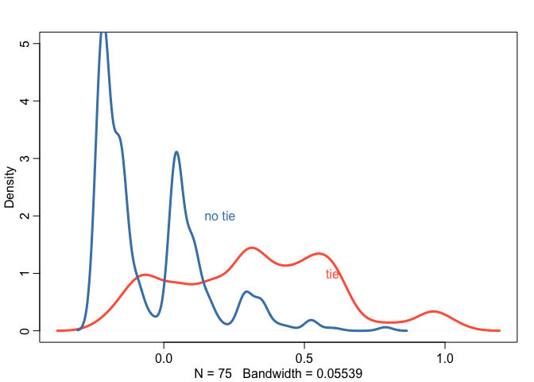<!-- -->

The posterior mean T for dyads without a tie is not different from 0,
while the posterior mean T for dyads with a tie has most of its
probability mass above 0.

``` r
dens(post$Rho_T[,1,2], col = "olivedrab", lwd = 3, 
     xlim = c(-1,1), xlab = "correlation within dyads")
abline(v = 0, lty = 2)
```

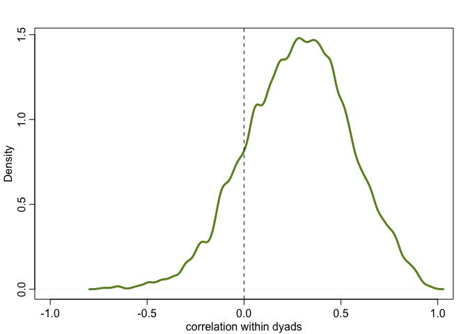<!-- -->

The posterior distribution of the correlation within dyads has most of
its probability mass above 0, indicating strong reciprocity of giving
within dyads.

``` r
# posterior mean T for AB and BA separately
TAB_mu <- apply(post$T[,,1], 2, mean)
TBA_mu <- apply(post$T[,,2], 2, mean)
plot(NULL, 
     xlim = range(TAB_mu)+c(-0.2,0.2), ylim = range(TBA_mu)+c(-0.2,0.2),
     xlab = "TAB", ylab = "TBA")
# color points if a tie is reciprocal
for (i in 1:length(TAB_mu))
  points(TAB_mu[i], TBA_mu[i], cex = 0.7, lwd = 2,
         col = ifelse(i %in% which(tie_AB==1 & tie_BA==1),
         "tomato", "steelblue"))
```

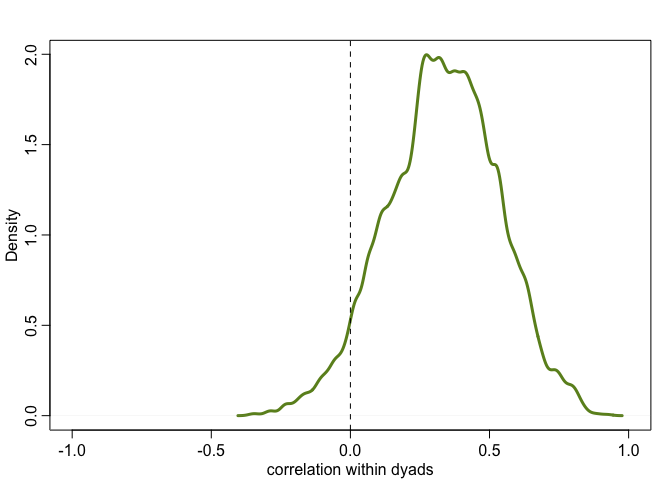<!-- -->

Plotting TAB and TBA helps us to see the positive association between
the two. When a social tie is reciprocal, both households tend to give
more.

### Apply to the sample

``` r
# analyze sample
kl_data <- list(
    n_dyads = nrow(kl_dyads),
    n_households = max(kl_dyads$hidB),
    D = 1:nrow(kl_dyads),
    HA = kl_dyads$hidA,
    HB = kl_dyads$hidB,
    GAB = kl_dyads$giftsAB,
    GBA = kl_dyads$giftsBA )

mGDkl <- ulam(f_dyad, data = kl_data, chains = 4, cores = 4, iter = 4000)
```

    ## Running MCMC with 4 parallel chains, with 1 thread(s) per chain...
    ## 
    ## Chain 1 Iteration:    1 / 4000 [  0%]  (Warmup) 
    ## Chain 2 Iteration:    1 / 4000 [  0%]  (Warmup) 
    ## Chain 3 Iteration:    1 / 4000 [  0%]  (Warmup) 
    ## Chain 4 Iteration:    1 / 4000 [  0%]  (Warmup) 
    ## Chain 1 Iteration:  100 / 4000 [  2%]  (Warmup) 
    ## Chain 3 Iteration:  100 / 4000 [  2%]  (Warmup) 
    ## Chain 4 Iteration:  100 / 4000 [  2%]  (Warmup) 
    ## Chain 2 Iteration:  100 / 4000 [  2%]  (Warmup) 
    ## Chain 1 Iteration:  200 / 4000 [  5%]  (Warmup) 
    ## Chain 3 Iteration:  200 / 4000 [  5%]  (Warmup) 
    ## Chain 4 Iteration:  200 / 4000 [  5%]  (Warmup) 
    ## Chain 2 Iteration:  200 / 4000 [  5%]  (Warmup) 
    ## Chain 1 Iteration:  300 / 4000 [  7%]  (Warmup) 
    ## Chain 3 Iteration:  300 / 4000 [  7%]  (Warmup) 
    ## Chain 4 Iteration:  300 / 4000 [  7%]  (Warmup) 
    ## Chain 2 Iteration:  300 / 4000 [  7%]  (Warmup) 
    ## Chain 4 Iteration:  400 / 4000 [ 10%]  (Warmup) 
    ## Chain 1 Iteration:  400 / 4000 [ 10%]  (Warmup) 
    ## Chain 3 Iteration:  400 / 4000 [ 10%]  (Warmup) 
    ## Chain 2 Iteration:  400 / 4000 [ 10%]  (Warmup) 
    ## Chain 1 Iteration:  500 / 4000 [ 12%]  (Warmup) 
    ## Chain 3 Iteration:  500 / 4000 [ 12%]  (Warmup) 
    ## Chain 4 Iteration:  500 / 4000 [ 12%]  (Warmup) 
    ## Chain 1 Iteration:  600 / 4000 [ 15%]  (Warmup) 
    ## Chain 2 Iteration:  500 / 4000 [ 12%]  (Warmup) 
    ## Chain 3 Iteration:  600 / 4000 [ 15%]  (Warmup) 
    ## Chain 4 Iteration:  600 / 4000 [ 15%]  (Warmup) 
    ## Chain 2 Iteration:  600 / 4000 [ 15%]  (Warmup) 
    ## Chain 1 Iteration:  700 / 4000 [ 17%]  (Warmup) 
    ## Chain 3 Iteration:  700 / 4000 [ 17%]  (Warmup) 
    ## Chain 4 Iteration:  700 / 4000 [ 17%]  (Warmup) 
    ## Chain 2 Iteration:  700 / 4000 [ 17%]  (Warmup) 
    ## Chain 4 Iteration:  800 / 4000 [ 20%]  (Warmup) 
    ## Chain 1 Iteration:  800 / 4000 [ 20%]  (Warmup) 
    ## Chain 3 Iteration:  800 / 4000 [ 20%]  (Warmup) 
    ## Chain 2 Iteration:  800 / 4000 [ 20%]  (Warmup) 
    ## Chain 3 Iteration:  900 / 4000 [ 22%]  (Warmup) 
    ## Chain 4 Iteration:  900 / 4000 [ 22%]  (Warmup) 
    ## Chain 1 Iteration:  900 / 4000 [ 22%]  (Warmup) 
    ## Chain 3 Iteration: 1000 / 4000 [ 25%]  (Warmup) 
    ## Chain 4 Iteration: 1000 / 4000 [ 25%]  (Warmup) 
    ## Chain 1 Iteration: 1000 / 4000 [ 25%]  (Warmup) 
    ## Chain 2 Iteration:  900 / 4000 [ 22%]  (Warmup) 
    ## Chain 3 Iteration: 1100 / 4000 [ 27%]  (Warmup) 
    ## Chain 4 Iteration: 1100 / 4000 [ 27%]  (Warmup) 
    ## Chain 1 Iteration: 1100 / 4000 [ 27%]  (Warmup) 
    ## Chain 2 Iteration: 1000 / 4000 [ 25%]  (Warmup) 
    ## Chain 3 Iteration: 1200 / 4000 [ 30%]  (Warmup) 
    ## Chain 1 Iteration: 1200 / 4000 [ 30%]  (Warmup) 
    ## Chain 4 Iteration: 1200 / 4000 [ 30%]  (Warmup) 
    ## Chain 2 Iteration: 1100 / 4000 [ 27%]  (Warmup) 
    ## Chain 1 Iteration: 1300 / 4000 [ 32%]  (Warmup) 
    ## Chain 3 Iteration: 1300 / 4000 [ 32%]  (Warmup) 
    ## Chain 4 Iteration: 1300 / 4000 [ 32%]  (Warmup) 
    ## Chain 2 Iteration: 1200 / 4000 [ 30%]  (Warmup) 
    ## Chain 3 Iteration: 1400 / 4000 [ 35%]  (Warmup) 
    ## Chain 1 Iteration: 1400 / 4000 [ 35%]  (Warmup) 
    ## Chain 4 Iteration: 1400 / 4000 [ 35%]  (Warmup) 
    ## Chain 2 Iteration: 1300 / 4000 [ 32%]  (Warmup) 
    ## Chain 1 Iteration: 1500 / 4000 [ 37%]  (Warmup) 
    ## Chain 3 Iteration: 1500 / 4000 [ 37%]  (Warmup) 
    ## Chain 4 Iteration: 1500 / 4000 [ 37%]  (Warmup) 
    ## Chain 2 Iteration: 1400 / 4000 [ 35%]  (Warmup) 
    ## Chain 1 Iteration: 1600 / 4000 [ 40%]  (Warmup) 
    ## Chain 3 Iteration: 1600 / 4000 [ 40%]  (Warmup) 
    ## Chain 4 Iteration: 1600 / 4000 [ 40%]  (Warmup) 
    ## Chain 2 Iteration: 1500 / 4000 [ 37%]  (Warmup) 
    ## Chain 3 Iteration: 1700 / 4000 [ 42%]  (Warmup) 
    ## Chain 1 Iteration: 1700 / 4000 [ 42%]  (Warmup) 
    ## Chain 4 Iteration: 1700 / 4000 [ 42%]  (Warmup) 
    ## Chain 2 Iteration: 1600 / 4000 [ 40%]  (Warmup) 
    ## Chain 3 Iteration: 1800 / 4000 [ 45%]  (Warmup) 
    ## Chain 1 Iteration: 1800 / 4000 [ 45%]  (Warmup) 
    ## Chain 2 Iteration: 1700 / 4000 [ 42%]  (Warmup) 
    ## Chain 4 Iteration: 1800 / 4000 [ 45%]  (Warmup) 
    ## Chain 2 Iteration: 1800 / 4000 [ 45%]  (Warmup) 
    ## Chain 3 Iteration: 1900 / 4000 [ 47%]  (Warmup) 
    ## Chain 1 Iteration: 1900 / 4000 [ 47%]  (Warmup) 
    ## Chain 4 Iteration: 1900 / 4000 [ 47%]  (Warmup) 
    ## Chain 2 Iteration: 1900 / 4000 [ 47%]  (Warmup) 
    ## Chain 3 Iteration: 2000 / 4000 [ 50%]  (Warmup) 
    ## Chain 3 Iteration: 2001 / 4000 [ 50%]  (Sampling) 
    ## Chain 1 Iteration: 2000 / 4000 [ 50%]  (Warmup) 
    ## Chain 1 Iteration: 2001 / 4000 [ 50%]  (Sampling) 
    ## Chain 4 Iteration: 2000 / 4000 [ 50%]  (Warmup) 
    ## Chain 4 Iteration: 2001 / 4000 [ 50%]  (Sampling) 
    ## Chain 2 Iteration: 2000 / 4000 [ 50%]  (Warmup) 
    ## Chain 2 Iteration: 2001 / 4000 [ 50%]  (Sampling) 
    ## Chain 3 Iteration: 2100 / 4000 [ 52%]  (Sampling) 
    ## Chain 1 Iteration: 2100 / 4000 [ 52%]  (Sampling) 
    ## Chain 2 Iteration: 2100 / 4000 [ 52%]  (Sampling) 
    ## Chain 4 Iteration: 2100 / 4000 [ 52%]  (Sampling) 
    ## Chain 3 Iteration: 2200 / 4000 [ 55%]  (Sampling) 
    ## Chain 2 Iteration: 2200 / 4000 [ 55%]  (Sampling) 
    ## Chain 1 Iteration: 2200 / 4000 [ 55%]  (Sampling) 
    ## Chain 2 Iteration: 2300 / 4000 [ 57%]  (Sampling) 
    ## Chain 4 Iteration: 2200 / 4000 [ 55%]  (Sampling) 
    ## Chain 3 Iteration: 2300 / 4000 [ 57%]  (Sampling) 
    ## Chain 2 Iteration: 2400 / 4000 [ 60%]  (Sampling) 
    ## Chain 1 Iteration: 2300 / 4000 [ 57%]  (Sampling) 
    ## Chain 4 Iteration: 2300 / 4000 [ 57%]  (Sampling) 
    ## Chain 3 Iteration: 2400 / 4000 [ 60%]  (Sampling) 
    ## Chain 2 Iteration: 2500 / 4000 [ 62%]  (Sampling) 
    ## Chain 2 Iteration: 2600 / 4000 [ 65%]  (Sampling) 
    ## Chain 1 Iteration: 2400 / 4000 [ 60%]  (Sampling) 
    ## Chain 3 Iteration: 2500 / 4000 [ 62%]  (Sampling) 
    ## Chain 4 Iteration: 2400 / 4000 [ 60%]  (Sampling) 
    ## Chain 2 Iteration: 2700 / 4000 [ 67%]  (Sampling) 
    ## Chain 2 Iteration: 2800 / 4000 [ 70%]  (Sampling) 
    ## Chain 3 Iteration: 2600 / 4000 [ 65%]  (Sampling) 
    ## Chain 1 Iteration: 2500 / 4000 [ 62%]  (Sampling) 
    ## Chain 4 Iteration: 2500 / 4000 [ 62%]  (Sampling) 
    ## Chain 2 Iteration: 2900 / 4000 [ 72%]  (Sampling) 
    ## Chain 3 Iteration: 2700 / 4000 [ 67%]  (Sampling) 
    ## Chain 1 Iteration: 2600 / 4000 [ 65%]  (Sampling) 
    ## Chain 2 Iteration: 3000 / 4000 [ 75%]  (Sampling) 
    ## Chain 4 Iteration: 2600 / 4000 [ 65%]  (Sampling) 
    ## Chain 2 Iteration: 3100 / 4000 [ 77%]  (Sampling) 
    ## Chain 3 Iteration: 2800 / 4000 [ 70%]  (Sampling) 
    ## Chain 1 Iteration: 2700 / 4000 [ 67%]  (Sampling) 
    ## Chain 4 Iteration: 2700 / 4000 [ 67%]  (Sampling) 
    ## Chain 2 Iteration: 3200 / 4000 [ 80%]  (Sampling) 
    ## Chain 3 Iteration: 2900 / 4000 [ 72%]  (Sampling) 
    ## Chain 2 Iteration: 3300 / 4000 [ 82%]  (Sampling) 
    ## Chain 1 Iteration: 2800 / 4000 [ 70%]  (Sampling) 
    ## Chain 4 Iteration: 2800 / 4000 [ 70%]  (Sampling) 
    ## Chain 2 Iteration: 3400 / 4000 [ 85%]  (Sampling) 
    ## Chain 3 Iteration: 3000 / 4000 [ 75%]  (Sampling) 
    ## Chain 2 Iteration: 3500 / 4000 [ 87%]  (Sampling) 
    ## Chain 1 Iteration: 2900 / 4000 [ 72%]  (Sampling) 
    ## Chain 4 Iteration: 2900 / 4000 [ 72%]  (Sampling) 
    ## Chain 2 Iteration: 3600 / 4000 [ 90%]  (Sampling) 
    ## Chain 3 Iteration: 3100 / 4000 [ 77%]  (Sampling) 
    ## Chain 1 Iteration: 3000 / 4000 [ 75%]  (Sampling) 
    ## Chain 2 Iteration: 3700 / 4000 [ 92%]  (Sampling) 
    ## Chain 4 Iteration: 3000 / 4000 [ 75%]  (Sampling) 
    ## Chain 3 Iteration: 3200 / 4000 [ 80%]  (Sampling) 
    ## Chain 2 Iteration: 3800 / 4000 [ 95%]  (Sampling) 
    ## Chain 1 Iteration: 3100 / 4000 [ 77%]  (Sampling) 
    ## Chain 4 Iteration: 3100 / 4000 [ 77%]  (Sampling) 
    ## Chain 2 Iteration: 3900 / 4000 [ 97%]  (Sampling) 
    ## Chain 3 Iteration: 3300 / 4000 [ 82%]  (Sampling) 
    ## Chain 2 Iteration: 4000 / 4000 [100%]  (Sampling) 
    ## Chain 2 finished in 44.9 seconds.
    ## Chain 1 Iteration: 3200 / 4000 [ 80%]  (Sampling) 
    ## Chain 3 Iteration: 3400 / 4000 [ 85%]  (Sampling) 
    ## Chain 4 Iteration: 3200 / 4000 [ 80%]  (Sampling) 
    ## Chain 1 Iteration: 3300 / 4000 [ 82%]  (Sampling) 
    ## Chain 3 Iteration: 3500 / 4000 [ 87%]  (Sampling) 
    ## Chain 4 Iteration: 3300 / 4000 [ 82%]  (Sampling) 
    ## Chain 3 Iteration: 3600 / 4000 [ 90%]  (Sampling) 
    ## Chain 1 Iteration: 3400 / 4000 [ 85%]  (Sampling) 
    ## Chain 4 Iteration: 3400 / 4000 [ 85%]  (Sampling) 
    ## Chain 3 Iteration: 3700 / 4000 [ 92%]  (Sampling) 
    ## Chain 1 Iteration: 3500 / 4000 [ 87%]  (Sampling) 
    ## Chain 4 Iteration: 3500 / 4000 [ 87%]  (Sampling) 
    ## Chain 3 Iteration: 3800 / 4000 [ 95%]  (Sampling) 
    ## Chain 1 Iteration: 3600 / 4000 [ 90%]  (Sampling) 
    ## Chain 4 Iteration: 3600 / 4000 [ 90%]  (Sampling) 
    ## Chain 3 Iteration: 3900 / 4000 [ 97%]  (Sampling) 
    ## Chain 1 Iteration: 3700 / 4000 [ 92%]  (Sampling) 
    ## Chain 4 Iteration: 3700 / 4000 [ 92%]  (Sampling) 
    ## Chain 3 Iteration: 4000 / 4000 [100%]  (Sampling) 
    ## Chain 3 finished in 54.1 seconds.
    ## Chain 1 Iteration: 3800 / 4000 [ 95%]  (Sampling) 
    ## Chain 4 Iteration: 3800 / 4000 [ 95%]  (Sampling) 
    ## Chain 1 Iteration: 3900 / 4000 [ 97%]  (Sampling) 
    ## Chain 4 Iteration: 3900 / 4000 [ 97%]  (Sampling) 
    ## Chain 1 Iteration: 4000 / 4000 [100%]  (Sampling) 
    ## Chain 4 Iteration: 4000 / 4000 [100%]  (Sampling) 
    ## Chain 1 finished in 58.4 seconds.
    ## Chain 4 finished in 58.4 seconds.
    ## 
    ## All 4 chains finished successfully.
    ## Mean chain execution time: 53.9 seconds.
    ## Total execution time: 58.5 seconds.

``` r
precis(mGDkl, depth = 3, pars = c("a", "Rho_T", "sigma_T"))
```

    ##                 mean         sd      5.5%     94.5%    n_eff    Rhat4
    ## a          0.5506412 0.08073327 0.4194055 0.6767513 2066.341 1.001859
    ## Rho_T[1,1] 1.0000000 0.00000000 1.0000000 1.0000000      NaN      NaN
    ## Rho_T[1,2] 0.3484573 0.06640515 0.2401379 0.4528899 1197.979 1.004761
    ## Rho_T[2,1] 0.3484573 0.06640515 0.2401379 0.4528899 1197.979 1.004761
    ## Rho_T[2,2] 1.0000000 0.00000000 1.0000000 1.0000000      NaN      NaN
    ## sigma_T    1.4469400 0.06588519 1.3444789 1.5560311 1211.990 1.001676

We can see there is also a positive association within dyads in the real
data.

### A generative model with general giving

What we have done so far, from the perspective of our DAG, is to model
the effect of social network ties on giving. We haven’t inspected the
general giving in our data yet, which are the confounds. These come from
the general features of households, such as wealth. As the previous
section, we will do it first through a generative simulation.

``` r
# simulate wealth
set.seed(238)
W <- rnorm(N) # standardized relative wealth in the community
bWG <- 0.5 # effect of wealth on giving - rich give more
bWR <- -1 # effect of wealth on receiving - rich receive less and poor get more

# simulate gifts
giftsAB <- rep(0, n_dyads)
giftsBA <- rep(0, n_dyads)
lambda <- log(c(0.5,2)) # rates of giving for y=0, y=1
for (i in 1:n_dyads){
  A <- dyads[i,1]
  B <- dyads[i,2]
  giftsAB[i] <- rpois(1, exp(lambda[1 + y[A,B]] + bWG*W[A] + bWR*W[B]))
  giftsBA[i] <- rpois(1, exp(lambda[1 + y[B,A]] + bWG*W[B] + bWR*W[A]))
}
```

We will also need to modify our model:

![\begin{aligned}
G\_{AB} &\sim \mathrm{Poisson}(\lambda\_{AB}) \\\\
\mathrm{log}(\lambda\_{AB}) &= \alpha + T\_{AB} + G_A + R_B\\\\
G\_{BA} &\sim \mathrm{Poisson}(\lambda\_{BA}) \\\\
\mathrm{log}(\lambda\_{BA}) &= \alpha + T\_{BA} + G_B + R_A\\\\
\begin{pmatrix}
\lambda\_{AB} \\\\
\lambda\_{BA}
\end{pmatrix} &\sim \mathrm{MVNormal}(
\begin{bmatrix}
0 \\\\
0
\end{bmatrix},
\begin{bmatrix}
\sigma^2 & \rho \sigma^2 \\\\
\rho \sigma^2 & \sigma^2
\end{bmatrix}
)\\\\
\alpha &\sim \mathrm{Normal}(0,1) \\\\
\sigma &\sim \mathrm{Exponential}(1)\\\\
\rho &\sim \mathrm{LKJCorr(2)} \\\\
\begin{pmatrix}
G_A \\\\
R_A
\end{pmatrix} &\sim \mathrm{MVNormal}(
\begin{bmatrix}
0 \\\\
0
\end{bmatrix},
\begin{bmatrix}
\sigma_G^2 & r \sigma_G \sigma_R \\\\
r \sigma_G \sigma_R & \sigma_R^2
\end{bmatrix}
)\\\\
\sigma_G,\sigma_R &\sim \mathrm{Exponential}(1)\\\\
r &\sim \mathrm{LKJCorr(2)} \\\\
\end{aligned}](https://latex.codecogs.com/png.image?%5Cdpi%7B110%7D&space;%5Cbg_white&space;%5Cbegin%7Baligned%7D%0AG_%7BAB%7D%20%26%5Csim%20%5Cmathrm%7BPoisson%7D%28%5Clambda_%7BAB%7D%29%20%5C%5C%0A%5Cmathrm%7Blog%7D%28%5Clambda_%7BAB%7D%29%20%26%3D%20%5Calpha%20%2B%20T_%7BAB%7D%20%2B%20G_A%20%2B%20R_B%5C%5C%0AG_%7BBA%7D%20%26%5Csim%20%5Cmathrm%7BPoisson%7D%28%5Clambda_%7BBA%7D%29%20%5C%5C%0A%5Cmathrm%7Blog%7D%28%5Clambda_%7BBA%7D%29%20%26%3D%20%5Calpha%20%2B%20T_%7BBA%7D%20%2B%20G_B%20%2B%20R_A%5C%5C%0A%5Cbegin%7Bpmatrix%7D%0A%5Clambda_%7BAB%7D%20%5C%5C%0A%5Clambda_%7BBA%7D%0A%5Cend%7Bpmatrix%7D%20%26%5Csim%20%5Cmathrm%7BMVNormal%7D%28%0A%5Cbegin%7Bbmatrix%7D%0A0%20%5C%5C%0A0%0A%5Cend%7Bbmatrix%7D%2C%0A%5Cbegin%7Bbmatrix%7D%0A%5Csigma%5E2%20%26%20%5Crho%20%5Csigma%5E2%20%5C%5C%0A%5Crho%20%5Csigma%5E2%20%26%20%5Csigma%5E2%0A%5Cend%7Bbmatrix%7D%0A%29%5C%5C%0A%5Calpha%20%26%5Csim%20%5Cmathrm%7BNormal%7D%280%2C1%29%20%5C%5C%0A%5Csigma%20%26%5Csim%20%5Cmathrm%7BExponential%7D%281%29%5C%5C%0A%5Crho%20%26%5Csim%20%5Cmathrm%7BLKJCorr%282%29%7D%20%5C%5C%0A%5Cbegin%7Bpmatrix%7D%0AG_A%20%5C%5C%0AR_A%0A%5Cend%7Bpmatrix%7D%20%26%5Csim%20%5Cmathrm%7BMVNormal%7D%28%0A%5Cbegin%7Bbmatrix%7D%0A0%20%5C%5C%0A0%0A%5Cend%7Bbmatrix%7D%2C%0A%5Cbegin%7Bbmatrix%7D%0A%5Csigma_G%5E2%20%26%20r%20%5Csigma_G%20%5Csigma_R%20%5C%5C%0Ar%20%5Csigma_G%20%5Csigma_R%20%26%20%5Csigma_R%5E2%0A%5Cend%7Bbmatrix%7D%0A%29%5C%5C%0A%5Csigma_G%2C%5Csigma_R%20%26%5Csim%20%5Cmathrm%7BExponential%7D%281%29%5C%5C%0Ar%20%26%5Csim%20%5Cmathrm%7BLKJCorr%282%29%7D%20%5C%5C%0A%5Cend%7Baligned%7D "\begin{aligned}
G_{AB} &\sim \mathrm{Poisson}(\lambda_{AB}) \\
\mathrm{log}(\lambda_{AB}) &= \alpha + T_{AB} + G_A + R_B\\
G_{BA} &\sim \mathrm{Poisson}(\lambda_{BA}) \\
\mathrm{log}(\lambda_{BA}) &= \alpha + T_{BA} + G_B + R_A\\
\begin{pmatrix}
\lambda_{AB} \\
\lambda_{BA}
\end{pmatrix} &\sim \mathrm{MVNormal}(
\begin{bmatrix}
0 \\
0
\end{bmatrix},
\begin{bmatrix}
\sigma^2 & \rho \sigma^2 \\
\rho \sigma^2 & \sigma^2
\end{bmatrix}
)\\
\alpha &\sim \mathrm{Normal}(0,1) \\
\sigma &\sim \mathrm{Exponential}(1)\\
\rho &\sim \mathrm{LKJCorr(2)} \\
\begin{pmatrix}
G_A \\
R_A
\end{pmatrix} &\sim \mathrm{MVNormal}(
\begin{bmatrix}
0 \\
0
\end{bmatrix},
\begin{bmatrix}
\sigma_G^2 & r \sigma_G \sigma_R \\
r \sigma_G \sigma_R & \sigma_R^2
\end{bmatrix}
)\\
\sigma_G,\sigma_R &\sim \mathrm{Exponential}(1)\\
r &\sim \mathrm{LKJCorr(2)} \\
\end{aligned}")

``` r
# general model
f_general <- alist(
  GAB ~ poisson(lambdaAB),
  GBA ~ poisson(lambdaBA),
  log(lambdaAB) <- a + T[D,1] + gr[HA,1] + gr[HB,2],
  log(lambdaBA) <- a + T[D,2] + gr[HB,1] + gr[HA,2],
  a ~ normal(0,1),
  
  # dyad effects
  transpars> matrix[n_dyads,2]:T <- compose_noncentered(rep_vector(sigma_T,2), L_Rho_T, Z),
  matrix[2,n_dyads]:Z ~ normal(0,1),
  cholesky_factor_corr[2]:L_Rho_T ~ lkj_corr_cholesky(2),
  sigma_T ~ exponential(1),
  
  # general effects
  transpars> matrix[n_households,2]:gr <- compose_noncentered(sigma_gr, L_Rho_gr, Zgr),
  matrix[2,n_households]:Zgr ~ normal(0,1),
  cholesky_factor_corr[2]:L_Rho_gr ~ lkj_corr_cholesky(2),
  vector[2]:sigma_gr ~ exponential(1),
  
  # compute correlation matrix for dyads
  gq> matrix[2,2]:Rho_T <<- Chol_to_Corr(L_Rho_T),
  gq> matrix[2,2]:Rho_gr <<- Chol_to_Corr(L_Rho_gr)
)

# synthetic data
sim_data <- list(
    n_dyads = n_dyads,
    n_households = N,
    D = 1:n_dyads,
    HA = dyads[,1],
    HB = dyads[,2],
    GAB = giftsAB,
    GBA = giftsBA )

# run the model with ulam
mGDR <- ulam(f_general, data = sim_data, chains = 4, cores = 4, iter = 2000)
```

    ## Running MCMC with 4 parallel chains, with 1 thread(s) per chain...
    ## 
    ## Chain 1 Iteration:    1 / 2000 [  0%]  (Warmup) 
    ## Chain 2 Iteration:    1 / 2000 [  0%]  (Warmup) 
    ## Chain 3 Iteration:    1 / 2000 [  0%]  (Warmup) 
    ## Chain 4 Iteration:    1 / 2000 [  0%]  (Warmup) 
    ## Chain 2 Iteration:  100 / 2000 [  5%]  (Warmup) 
    ## Chain 3 Iteration:  100 / 2000 [  5%]  (Warmup) 
    ## Chain 4 Iteration:  100 / 2000 [  5%]  (Warmup) 
    ## Chain 1 Iteration:  100 / 2000 [  5%]  (Warmup) 
    ## Chain 3 Iteration:  200 / 2000 [ 10%]  (Warmup) 
    ## Chain 2 Iteration:  200 / 2000 [ 10%]  (Warmup) 
    ## Chain 4 Iteration:  200 / 2000 [ 10%]  (Warmup) 
    ## Chain 1 Iteration:  200 / 2000 [ 10%]  (Warmup) 
    ## Chain 3 Iteration:  300 / 2000 [ 15%]  (Warmup) 
    ## Chain 2 Iteration:  300 / 2000 [ 15%]  (Warmup) 
    ## Chain 4 Iteration:  300 / 2000 [ 15%]  (Warmup) 
    ## Chain 3 Iteration:  400 / 2000 [ 20%]  (Warmup) 
    ## Chain 2 Iteration:  400 / 2000 [ 20%]  (Warmup) 
    ## Chain 4 Iteration:  400 / 2000 [ 20%]  (Warmup) 
    ## Chain 1 Iteration:  300 / 2000 [ 15%]  (Warmup) 
    ## Chain 3 Iteration:  500 / 2000 [ 25%]  (Warmup) 
    ## Chain 2 Iteration:  500 / 2000 [ 25%]  (Warmup) 
    ## Chain 1 Iteration:  400 / 2000 [ 20%]  (Warmup) 
    ## Chain 4 Iteration:  500 / 2000 [ 25%]  (Warmup) 
    ## Chain 3 Iteration:  600 / 2000 [ 30%]  (Warmup) 
    ## Chain 2 Iteration:  600 / 2000 [ 30%]  (Warmup) 
    ## Chain 1 Iteration:  500 / 2000 [ 25%]  (Warmup) 
    ## Chain 4 Iteration:  600 / 2000 [ 30%]  (Warmup) 
    ## Chain 3 Iteration:  700 / 2000 [ 35%]  (Warmup) 
    ## Chain 2 Iteration:  700 / 2000 [ 35%]  (Warmup) 
    ## Chain 1 Iteration:  600 / 2000 [ 30%]  (Warmup) 
    ## Chain 4 Iteration:  700 / 2000 [ 35%]  (Warmup) 
    ## Chain 3 Iteration:  800 / 2000 [ 40%]  (Warmup) 
    ## Chain 2 Iteration:  800 / 2000 [ 40%]  (Warmup) 
    ## Chain 4 Iteration:  800 / 2000 [ 40%]  (Warmup) 
    ## Chain 1 Iteration:  700 / 2000 [ 35%]  (Warmup) 
    ## Chain 3 Iteration:  900 / 2000 [ 45%]  (Warmup) 
    ## Chain 2 Iteration:  900 / 2000 [ 45%]  (Warmup) 
    ## Chain 4 Iteration:  900 / 2000 [ 45%]  (Warmup) 
    ## Chain 1 Iteration:  800 / 2000 [ 40%]  (Warmup) 
    ## Chain 3 Iteration: 1000 / 2000 [ 50%]  (Warmup) 
    ## Chain 3 Iteration: 1001 / 2000 [ 50%]  (Sampling) 
    ## Chain 2 Iteration: 1000 / 2000 [ 50%]  (Warmup) 
    ## Chain 4 Iteration: 1000 / 2000 [ 50%]  (Warmup) 
    ## Chain 2 Iteration: 1001 / 2000 [ 50%]  (Sampling) 
    ## Chain 4 Iteration: 1001 / 2000 [ 50%]  (Sampling) 
    ## Chain 1 Iteration:  900 / 2000 [ 45%]  (Warmup) 
    ## Chain 3 Iteration: 1100 / 2000 [ 55%]  (Sampling) 
    ## Chain 4 Iteration: 1100 / 2000 [ 55%]  (Sampling) 
    ## Chain 2 Iteration: 1100 / 2000 [ 55%]  (Sampling) 
    ## Chain 1 Iteration: 1000 / 2000 [ 50%]  (Warmup) 
    ## Chain 1 Iteration: 1001 / 2000 [ 50%]  (Sampling) 
    ## Chain 3 Iteration: 1200 / 2000 [ 60%]  (Sampling) 
    ## Chain 2 Iteration: 1200 / 2000 [ 60%]  (Sampling) 
    ## Chain 4 Iteration: 1200 / 2000 [ 60%]  (Sampling) 
    ## Chain 1 Iteration: 1100 / 2000 [ 55%]  (Sampling) 
    ## Chain 3 Iteration: 1300 / 2000 [ 65%]  (Sampling) 
    ## Chain 2 Iteration: 1300 / 2000 [ 65%]  (Sampling) 
    ## Chain 4 Iteration: 1300 / 2000 [ 65%]  (Sampling) 
    ## Chain 1 Iteration: 1200 / 2000 [ 60%]  (Sampling) 
    ## Chain 3 Iteration: 1400 / 2000 [ 70%]  (Sampling) 
    ## Chain 2 Iteration: 1400 / 2000 [ 70%]  (Sampling) 
    ## Chain 4 Iteration: 1400 / 2000 [ 70%]  (Sampling) 
    ## Chain 1 Iteration: 1300 / 2000 [ 65%]  (Sampling) 
    ## Chain 3 Iteration: 1500 / 2000 [ 75%]  (Sampling) 
    ## Chain 2 Iteration: 1500 / 2000 [ 75%]  (Sampling) 
    ## Chain 4 Iteration: 1500 / 2000 [ 75%]  (Sampling) 
    ## Chain 1 Iteration: 1400 / 2000 [ 70%]  (Sampling) 
    ## Chain 3 Iteration: 1600 / 2000 [ 80%]  (Sampling) 
    ## Chain 2 Iteration: 1600 / 2000 [ 80%]  (Sampling) 
    ## Chain 4 Iteration: 1600 / 2000 [ 80%]  (Sampling) 
    ## Chain 1 Iteration: 1500 / 2000 [ 75%]  (Sampling) 
    ## Chain 3 Iteration: 1700 / 2000 [ 85%]  (Sampling) 
    ## Chain 2 Iteration: 1700 / 2000 [ 85%]  (Sampling) 
    ## Chain 4 Iteration: 1700 / 2000 [ 85%]  (Sampling) 
    ## Chain 1 Iteration: 1600 / 2000 [ 80%]  (Sampling) 
    ## Chain 3 Iteration: 1800 / 2000 [ 90%]  (Sampling) 
    ## Chain 2 Iteration: 1800 / 2000 [ 90%]  (Sampling) 
    ## Chain 4 Iteration: 1800 / 2000 [ 90%]  (Sampling) 
    ## Chain 1 Iteration: 1700 / 2000 [ 85%]  (Sampling) 
    ## Chain 3 Iteration: 1900 / 2000 [ 95%]  (Sampling) 
    ## Chain 2 Iteration: 1900 / 2000 [ 95%]  (Sampling) 
    ## Chain 4 Iteration: 1900 / 2000 [ 95%]  (Sampling) 
    ## Chain 1 Iteration: 1800 / 2000 [ 90%]  (Sampling) 
    ## Chain 3 Iteration: 2000 / 2000 [100%]  (Sampling) 
    ## Chain 3 finished in 31.7 seconds.
    ## Chain 2 Iteration: 2000 / 2000 [100%]  (Sampling) 
    ## Chain 4 Iteration: 2000 / 2000 [100%]  (Sampling) 
    ## Chain 2 finished in 32.0 seconds.
    ## Chain 4 finished in 32.0 seconds.
    ## Chain 1 Iteration: 1900 / 2000 [ 95%]  (Sampling) 
    ## Chain 1 Iteration: 2000 / 2000 [100%]  (Sampling) 
    ## Chain 1 finished in 33.0 seconds.
    ## 
    ## All 4 chains finished successfully.
    ## Mean chain execution time: 32.2 seconds.
    ## Total execution time: 33.1 seconds.

``` r
precis(mGDR, depth = 3, pars = c("a", "Rho_T", "sigma_T", "Rho_gr", "sigma_gr"))
```

    ##                   mean         sd       5.5%      94.5%     n_eff     Rhat4
    ## a           -0.5291830 0.12976230 -0.7370129 -0.3220390 2138.6449 1.0013495
    ## Rho_T[1,1]   1.0000000 0.00000000  1.0000000  1.0000000       NaN       NaN
    ## Rho_T[1,2]   0.6326307 0.20259902  0.2724033  0.9168468  458.1304 1.0095161
    ## Rho_T[2,1]   0.6326307 0.20259902  0.2724033  0.9168468  458.1304 1.0095161
    ## Rho_T[2,2]   1.0000000 0.00000000  1.0000000  1.0000000       NaN       NaN
    ## sigma_T      0.6046818 0.05908397  0.5121476  0.6999164 2058.3775 1.0007503
    ## Rho_gr[1,1]  1.0000000 0.00000000  1.0000000  1.0000000       NaN       NaN
    ## Rho_gr[1,2] -0.8833033 0.08606918 -0.9774458 -0.7270711 1582.8922 1.0007077
    ## Rho_gr[2,1] -0.8833033 0.08606918 -0.9774458 -0.7270711 1582.8922 1.0007077
    ## Rho_gr[2,2]  1.0000000 0.00000000  1.0000000  1.0000000       NaN       NaN
    ## sigma_gr[1]  0.4936552 0.09451335  0.3573942  0.6558202 2092.6179 0.9995942
    ## sigma_gr[2]  0.9219794 0.14591428  0.7142917  1.1674177 2005.7269 1.0013159

Do some plotting to see the results

``` r
# generalized giving against receiving
postGDR <- extract.samples(mGDR)
post_gg <- sapply(1:N, function(i) exp(postGDR$a + postGDR$gr[,i,1]))
gg_mu <- apply(post_gg, 2, mean)
post_gr <- sapply(1:N, function(i) exp(postGDR$a + postGDR$gr[,i,2]))
gr_mu <- apply(post_gr, 2, mean)

xymax <- max(gg_mu,gr_mu) + 0.5
plot(NULL, xlim = c(0,xymax), ylim = c(0,xymax),
     xlab = "generalized giving", ylab = "generalized receiving")
abline(a = 0, b = 1, lty = 2)
points(gg_mu, gr_mu, lwd = 3, cex = 0.8, col = "dodgerblue")
for (i in 1:N) {
  sigma <- cov(cbind(post_gg[,i], post_gr[,i]))
  mu <- c(gg_mu[i], gr_mu[i])
  lines(
    ellipse(sigma, centre = mu, level = 0.5), 
    col = col.alpha("black", 0.2))
}
```

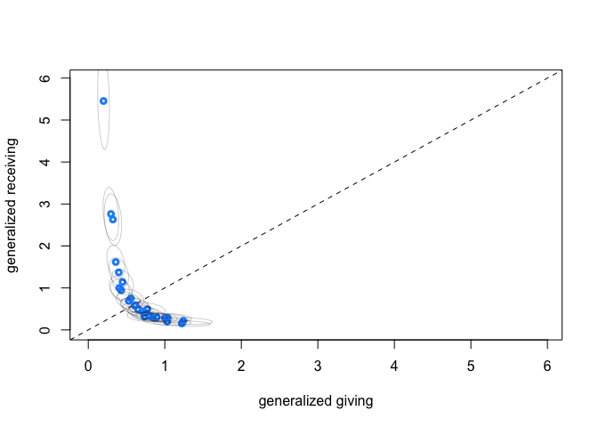<!-- -->

``` r
# correlation between giving and receiving
dens(postGDR$Rho_gr[,1,2], xlim = c(-1,1), xlab = "correlation giving-receiving",
     lwd = 3, col = "cornflowerblue")
```

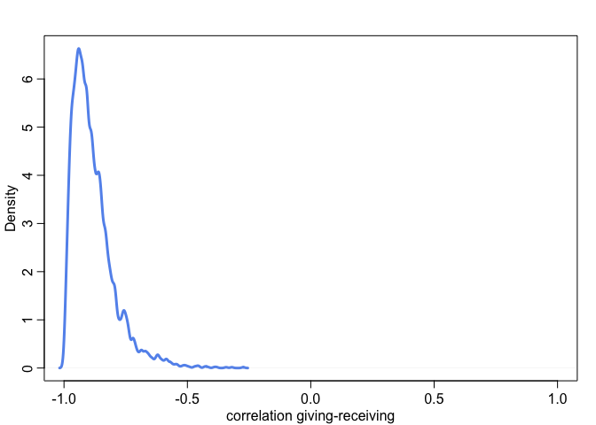<!-- -->

These two plots show that generalized giving and generalized receiving
are negatively correlated. Those who give more tend to receive less.

``` r
# correlation social tie
dens(postGDR$Rho_T[,1,2], xlim = c(-1,1), xlab = "correlation within dyads",
     lwd = 3, col = "olivedrab")
```

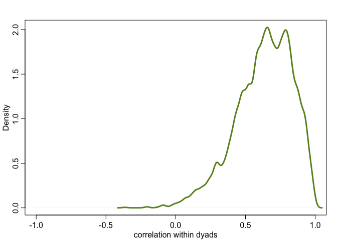<!-- -->

The correlation within dyads is even stronger in this model, being
pushed all the way near 1.

### The real data with generalized giving and receiving

``` r
mGDRkl <- ulam(f_general, data = kl_data, chains = 4, cores = 4, iter = 4000)
```

    ## Running MCMC with 4 parallel chains, with 1 thread(s) per chain...
    ## 
    ## Chain 1 Iteration:    1 / 4000 [  0%]  (Warmup) 
    ## Chain 2 Iteration:    1 / 4000 [  0%]  (Warmup) 
    ## Chain 3 Iteration:    1 / 4000 [  0%]  (Warmup) 
    ## Chain 4 Iteration:    1 / 4000 [  0%]  (Warmup) 
    ## Chain 1 Iteration:  100 / 4000 [  2%]  (Warmup) 
    ## Chain 2 Iteration:  100 / 4000 [  2%]  (Warmup) 
    ## Chain 4 Iteration:  100 / 4000 [  2%]  (Warmup) 
    ## Chain 1 Iteration:  200 / 4000 [  5%]  (Warmup) 
    ## Chain 3 Iteration:  100 / 4000 [  2%]  (Warmup) 
    ## Chain 2 Iteration:  200 / 4000 [  5%]  (Warmup) 
    ## Chain 4 Iteration:  200 / 4000 [  5%]  (Warmup) 
    ## Chain 1 Iteration:  300 / 4000 [  7%]  (Warmup) 
    ## Chain 1 Iteration:  400 / 4000 [ 10%]  (Warmup) 
    ## Chain 3 Iteration:  200 / 4000 [  5%]  (Warmup) 
    ## Chain 2 Iteration:  300 / 4000 [  7%]  (Warmup) 
    ## Chain 4 Iteration:  300 / 4000 [  7%]  (Warmup) 
    ## Chain 1 Iteration:  500 / 4000 [ 12%]  (Warmup) 
    ## Chain 3 Iteration:  300 / 4000 [  7%]  (Warmup) 
    ## Chain 2 Iteration:  400 / 4000 [ 10%]  (Warmup) 
    ## Chain 4 Iteration:  400 / 4000 [ 10%]  (Warmup) 
    ## Chain 1 Iteration:  600 / 4000 [ 15%]  (Warmup) 
    ## Chain 2 Iteration:  500 / 4000 [ 12%]  (Warmup) 
    ## Chain 3 Iteration:  400 / 4000 [ 10%]  (Warmup) 
    ## Chain 4 Iteration:  500 / 4000 [ 12%]  (Warmup) 
    ## Chain 1 Iteration:  700 / 4000 [ 17%]  (Warmup) 
    ## Chain 2 Iteration:  600 / 4000 [ 15%]  (Warmup) 
    ## Chain 3 Iteration:  500 / 4000 [ 12%]  (Warmup) 
    ## Chain 4 Iteration:  600 / 4000 [ 15%]  (Warmup) 
    ## Chain 2 Iteration:  700 / 4000 [ 17%]  (Warmup) 
    ## Chain 1 Iteration:  800 / 4000 [ 20%]  (Warmup) 
    ## Chain 4 Iteration:  700 / 4000 [ 17%]  (Warmup) 
    ## Chain 3 Iteration:  600 / 4000 [ 15%]  (Warmup) 
    ## Chain 2 Iteration:  800 / 4000 [ 20%]  (Warmup) 
    ## Chain 4 Iteration:  800 / 4000 [ 20%]  (Warmup) 
    ## Chain 3 Iteration:  700 / 4000 [ 17%]  (Warmup) 
    ## Chain 1 Iteration:  900 / 4000 [ 22%]  (Warmup) 
    ## Chain 4 Iteration:  900 / 4000 [ 22%]  (Warmup) 
    ## Chain 2 Iteration:  900 / 4000 [ 22%]  (Warmup) 
    ## Chain 3 Iteration:  800 / 4000 [ 20%]  (Warmup) 
    ## Chain 1 Iteration: 1000 / 4000 [ 25%]  (Warmup) 
    ## Chain 4 Iteration: 1000 / 4000 [ 25%]  (Warmup) 
    ## Chain 2 Iteration: 1000 / 4000 [ 25%]  (Warmup) 
    ## Chain 1 Iteration: 1100 / 4000 [ 27%]  (Warmup) 
    ## Chain 3 Iteration:  900 / 4000 [ 22%]  (Warmup) 
    ## Chain 2 Iteration: 1100 / 4000 [ 27%]  (Warmup) 
    ## Chain 4 Iteration: 1100 / 4000 [ 27%]  (Warmup) 
    ## Chain 1 Iteration: 1200 / 4000 [ 30%]  (Warmup) 
    ## Chain 3 Iteration: 1000 / 4000 [ 25%]  (Warmup) 
    ## Chain 2 Iteration: 1200 / 4000 [ 30%]  (Warmup) 
    ## Chain 4 Iteration: 1200 / 4000 [ 30%]  (Warmup) 
    ## Chain 1 Iteration: 1300 / 4000 [ 32%]  (Warmup) 
    ## Chain 3 Iteration: 1100 / 4000 [ 27%]  (Warmup) 
    ## Chain 2 Iteration: 1300 / 4000 [ 32%]  (Warmup) 
    ## Chain 1 Iteration: 1400 / 4000 [ 35%]  (Warmup) 
    ## Chain 4 Iteration: 1300 / 4000 [ 32%]  (Warmup) 
    ## Chain 3 Iteration: 1200 / 4000 [ 30%]  (Warmup) 
    ## Chain 2 Iteration: 1400 / 4000 [ 35%]  (Warmup) 
    ## Chain 1 Iteration: 1500 / 4000 [ 37%]  (Warmup) 
    ## Chain 4 Iteration: 1400 / 4000 [ 35%]  (Warmup) 
    ## Chain 3 Iteration: 1300 / 4000 [ 32%]  (Warmup) 
    ## Chain 2 Iteration: 1500 / 4000 [ 37%]  (Warmup) 
    ## Chain 4 Iteration: 1500 / 4000 [ 37%]  (Warmup) 
    ## Chain 1 Iteration: 1600 / 4000 [ 40%]  (Warmup) 
    ## Chain 3 Iteration: 1400 / 4000 [ 35%]  (Warmup) 
    ## Chain 2 Iteration: 1600 / 4000 [ 40%]  (Warmup) 
    ## Chain 4 Iteration: 1600 / 4000 [ 40%]  (Warmup) 
    ## Chain 1 Iteration: 1700 / 4000 [ 42%]  (Warmup) 
    ## Chain 3 Iteration: 1500 / 4000 [ 37%]  (Warmup) 
    ## Chain 2 Iteration: 1700 / 4000 [ 42%]  (Warmup) 
    ## Chain 4 Iteration: 1700 / 4000 [ 42%]  (Warmup) 
    ## Chain 1 Iteration: 1800 / 4000 [ 45%]  (Warmup) 
    ## Chain 3 Iteration: 1600 / 4000 [ 40%]  (Warmup) 
    ## Chain 4 Iteration: 1800 / 4000 [ 45%]  (Warmup) 
    ## Chain 1 Iteration: 1900 / 4000 [ 47%]  (Warmup) 
    ## Chain 2 Iteration: 1800 / 4000 [ 45%]  (Warmup) 
    ## Chain 3 Iteration: 1700 / 4000 [ 42%]  (Warmup) 
    ## Chain 4 Iteration: 1900 / 4000 [ 47%]  (Warmup) 
    ## Chain 2 Iteration: 1900 / 4000 [ 47%]  (Warmup) 
    ## Chain 1 Iteration: 2000 / 4000 [ 50%]  (Warmup) 
    ## Chain 3 Iteration: 1800 / 4000 [ 45%]  (Warmup) 
    ## Chain 1 Iteration: 2001 / 4000 [ 50%]  (Sampling) 
    ## Chain 4 Iteration: 2000 / 4000 [ 50%]  (Warmup) 
    ## Chain 4 Iteration: 2001 / 4000 [ 50%]  (Sampling) 
    ## Chain 2 Iteration: 2000 / 4000 [ 50%]  (Warmup) 
    ## Chain 2 Iteration: 2001 / 4000 [ 50%]  (Sampling) 
    ## Chain 1 Iteration: 2100 / 4000 [ 52%]  (Sampling) 
    ## Chain 3 Iteration: 1900 / 4000 [ 47%]  (Warmup) 
    ## Chain 4 Iteration: 2100 / 4000 [ 52%]  (Sampling) 
    ## Chain 2 Iteration: 2100 / 4000 [ 52%]  (Sampling) 
    ## Chain 1 Iteration: 2200 / 4000 [ 55%]  (Sampling) 
    ## Chain 3 Iteration: 2000 / 4000 [ 50%]  (Warmup) 
    ## Chain 3 Iteration: 2001 / 4000 [ 50%]  (Sampling) 
    ## Chain 4 Iteration: 2200 / 4000 [ 55%]  (Sampling) 
    ## Chain 2 Iteration: 2200 / 4000 [ 55%]  (Sampling) 
    ## Chain 1 Iteration: 2300 / 4000 [ 57%]  (Sampling) 
    ## Chain 3 Iteration: 2100 / 4000 [ 52%]  (Sampling) 
    ## Chain 4 Iteration: 2300 / 4000 [ 57%]  (Sampling) 
    ## Chain 2 Iteration: 2300 / 4000 [ 57%]  (Sampling) 
    ## Chain 1 Iteration: 2400 / 4000 [ 60%]  (Sampling) 
    ## Chain 3 Iteration: 2200 / 4000 [ 55%]  (Sampling) 
    ## Chain 4 Iteration: 2400 / 4000 [ 60%]  (Sampling) 
    ## Chain 2 Iteration: 2400 / 4000 [ 60%]  (Sampling) 
    ## Chain 1 Iteration: 2500 / 4000 [ 62%]  (Sampling) 
    ## Chain 3 Iteration: 2300 / 4000 [ 57%]  (Sampling) 
    ## Chain 4 Iteration: 2500 / 4000 [ 62%]  (Sampling) 
    ## Chain 2 Iteration: 2500 / 4000 [ 62%]  (Sampling) 
    ## Chain 1 Iteration: 2600 / 4000 [ 65%]  (Sampling) 
    ## Chain 3 Iteration: 2400 / 4000 [ 60%]  (Sampling) 
    ## Chain 4 Iteration: 2600 / 4000 [ 65%]  (Sampling) 
    ## Chain 2 Iteration: 2600 / 4000 [ 65%]  (Sampling) 
    ## Chain 1 Iteration: 2700 / 4000 [ 67%]  (Sampling) 
    ## Chain 3 Iteration: 2500 / 4000 [ 62%]  (Sampling) 
    ## Chain 4 Iteration: 2700 / 4000 [ 67%]  (Sampling) 
    ## Chain 2 Iteration: 2700 / 4000 [ 67%]  (Sampling) 
    ## Chain 1 Iteration: 2800 / 4000 [ 70%]  (Sampling) 
    ## Chain 3 Iteration: 2600 / 4000 [ 65%]  (Sampling) 
    ## Chain 4 Iteration: 2800 / 4000 [ 70%]  (Sampling) 
    ## Chain 2 Iteration: 2800 / 4000 [ 70%]  (Sampling) 
    ## Chain 1 Iteration: 2900 / 4000 [ 72%]  (Sampling) 
    ## Chain 3 Iteration: 2700 / 4000 [ 67%]  (Sampling) 
    ## Chain 4 Iteration: 2900 / 4000 [ 72%]  (Sampling) 
    ## Chain 2 Iteration: 2900 / 4000 [ 72%]  (Sampling) 
    ## Chain 1 Iteration: 3000 / 4000 [ 75%]  (Sampling) 
    ## Chain 3 Iteration: 2800 / 4000 [ 70%]  (Sampling) 
    ## Chain 4 Iteration: 3000 / 4000 [ 75%]  (Sampling) 
    ## Chain 2 Iteration: 3000 / 4000 [ 75%]  (Sampling) 
    ## Chain 1 Iteration: 3100 / 4000 [ 77%]  (Sampling) 
    ## Chain 3 Iteration: 2900 / 4000 [ 72%]  (Sampling) 
    ## Chain 4 Iteration: 3100 / 4000 [ 77%]  (Sampling) 
    ## Chain 2 Iteration: 3100 / 4000 [ 77%]  (Sampling) 
    ## Chain 1 Iteration: 3200 / 4000 [ 80%]  (Sampling) 
    ## Chain 3 Iteration: 3000 / 4000 [ 75%]  (Sampling) 
    ## Chain 4 Iteration: 3200 / 4000 [ 80%]  (Sampling) 
    ## Chain 2 Iteration: 3200 / 4000 [ 80%]  (Sampling) 
    ## Chain 1 Iteration: 3300 / 4000 [ 82%]  (Sampling) 
    ## Chain 3 Iteration: 3100 / 4000 [ 77%]  (Sampling) 
    ## Chain 4 Iteration: 3300 / 4000 [ 82%]  (Sampling) 
    ## Chain 2 Iteration: 3300 / 4000 [ 82%]  (Sampling) 
    ## Chain 1 Iteration: 3400 / 4000 [ 85%]  (Sampling) 
    ## Chain 3 Iteration: 3200 / 4000 [ 80%]  (Sampling) 
    ## Chain 4 Iteration: 3400 / 4000 [ 85%]  (Sampling) 
    ## Chain 2 Iteration: 3400 / 4000 [ 85%]  (Sampling) 
    ## Chain 1 Iteration: 3500 / 4000 [ 87%]  (Sampling) 
    ## Chain 3 Iteration: 3300 / 4000 [ 82%]  (Sampling) 
    ## Chain 4 Iteration: 3500 / 4000 [ 87%]  (Sampling) 
    ## Chain 2 Iteration: 3500 / 4000 [ 87%]  (Sampling) 
    ## Chain 1 Iteration: 3600 / 4000 [ 90%]  (Sampling) 
    ## Chain 3 Iteration: 3400 / 4000 [ 85%]  (Sampling) 
    ## Chain 4 Iteration: 3600 / 4000 [ 90%]  (Sampling) 
    ## Chain 2 Iteration: 3600 / 4000 [ 90%]  (Sampling) 
    ## Chain 1 Iteration: 3700 / 4000 [ 92%]  (Sampling) 
    ## Chain 3 Iteration: 3500 / 4000 [ 87%]  (Sampling) 
    ## Chain 4 Iteration: 3700 / 4000 [ 92%]  (Sampling) 
    ## Chain 2 Iteration: 3700 / 4000 [ 92%]  (Sampling) 
    ## Chain 1 Iteration: 3800 / 4000 [ 95%]  (Sampling) 
    ## Chain 3 Iteration: 3600 / 4000 [ 90%]  (Sampling) 
    ## Chain 4 Iteration: 3800 / 4000 [ 95%]  (Sampling) 
    ## Chain 2 Iteration: 3800 / 4000 [ 95%]  (Sampling) 
    ## Chain 1 Iteration: 3900 / 4000 [ 97%]  (Sampling) 
    ## Chain 3 Iteration: 3700 / 4000 [ 92%]  (Sampling) 
    ## Chain 4 Iteration: 3900 / 4000 [ 97%]  (Sampling) 
    ## Chain 2 Iteration: 3900 / 4000 [ 97%]  (Sampling) 
    ## Chain 1 Iteration: 4000 / 4000 [100%]  (Sampling) 
    ## Chain 1 finished in 67.6 seconds.
    ## Chain 3 Iteration: 3800 / 4000 [ 95%]  (Sampling) 
    ## Chain 4 Iteration: 4000 / 4000 [100%]  (Sampling) 
    ## Chain 4 finished in 67.9 seconds.
    ## Chain 2 Iteration: 4000 / 4000 [100%]  (Sampling) 
    ## Chain 2 finished in 68.1 seconds.
    ## Chain 3 Iteration: 3900 / 4000 [ 97%]  (Sampling) 
    ## Chain 3 Iteration: 4000 / 4000 [100%]  (Sampling) 
    ## Chain 3 finished in 69.4 seconds.
    ## 
    ## All 4 chains finished successfully.
    ## Mean chain execution time: 68.3 seconds.
    ## Total execution time: 69.5 seconds.

``` r
# generalized giving against receiving
postGDRkl <- extract.samples(mGDRkl)
post_gg <- sapply(1:N, function(i) exp(postGDRkl$a + postGDRkl$gr[,i,1]))
gg_mu <- apply(post_gg, 2, mean)
post_gr <- sapply(1:N, function(i) exp(postGDRkl$a + postGDRkl$gr[,i,2]))
gr_mu <- apply(post_gr, 2, mean)

xymax <- max(gg_mu,gr_mu) + 0.5
plot(NULL, xlim = c(0,xymax), ylim = c(0,xymax),
     xlab = "generalized giving", ylab = "generalized receiving")
abline(a = 0, b = 1, lty = 2)
points(gg_mu, gr_mu, lwd = 3, cex = 0.8, col = "dodgerblue")
for (i in 1:N) {
  sigma <- cov(cbind(post_gg[,i], post_gr[,i]))
  mu <- c(gg_mu[i], gr_mu[i])
  lines(
    ellipse(sigma, centre = mu, level = 0.5), 
    col = col.alpha("black", 0.2))
}
```

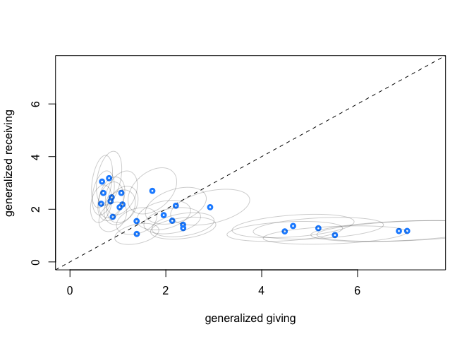<!-- -->

``` r
# correlation between giving and receiving
dens(postGDRkl$Rho_gr[,1,2], xlim = c(-1,1), xlab = "correlation giving-receiving",
     lwd = 3, col = "cornflowerblue")
```

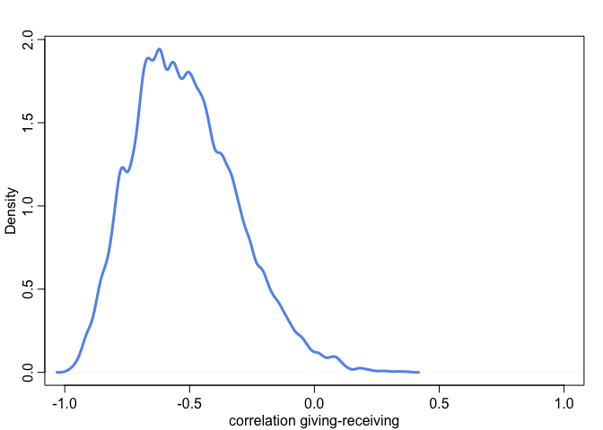<!-- -->

``` r
# correlation social tie
dens(postGDRkl$Rho_T[,1,2], xlim = c(-1,1), xlab = "correlation within dyads",
     lwd = 3, col = "olivedrab")
```

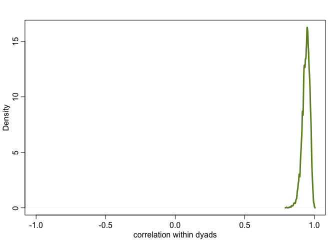<!-- -->

Same pattern here: generalized giving and receiving are negative
correlated, and correlation within dyads is strong.

### Adding linear model for social tie, giving, and receiving

The previous models treat the social ties, generalized giving and
receiving as single varying effects. They are really just placeholders
for other causes, so we can also model them as linear functions of the
causes we are interested in. In our case, this is the strength of social
ties and wealth for giving and receiving.

Let’s turn our mmodel into some fancy stuff:

![\begin{aligned}
G\_{AB} &\sim \mathrm{Poisson}(\lambda\_{AB}) \\\\
\mathrm{log}(\lambda\_{AB}) &= \alpha + \mathcal{T}\_{AB} + \mathcal{G}\_A + \mathcal{R}\_B\\\\
\mathcal{T}\_{AB} &= T_AB + \beta\_{A} A\_{AB}\\\\
\mathcal{G}\_A &= G_A + \beta\_{W,G} W\_{A}\\\\
\mathcal{R}\_B &= R_B + \beta\_{W,R} W\_{B}\\\\
G\_{BA} &\sim \mathrm{Poisson}(\lambda\_{BA}) \\\\
\mathrm{log}(\lambda\_{BA}) &= \alpha + \mathcal{T}\_{BA} + \mathcal{G}\_B + \mathcal{R}\_A\\\\
\mathcal{T}\_{BA} &= T_BA + \beta\_{A} A\_{BA}\\\\
\mathcal{G}\_B &= G_B + \beta\_{W,G} W\_{B}\\\\
\mathcal{R}\_A &= R_A + \beta\_{W,R} W\_{A}\\\\
\end{aligned}](https://latex.codecogs.com/png.image?%5Cdpi%7B110%7D&space;%5Cbg_white&space;%5Cbegin%7Baligned%7D%0AG_%7BAB%7D%20%26%5Csim%20%5Cmathrm%7BPoisson%7D%28%5Clambda_%7BAB%7D%29%20%5C%5C%0A%5Cmathrm%7Blog%7D%28%5Clambda_%7BAB%7D%29%20%26%3D%20%5Calpha%20%2B%20%5Cmathcal%7BT%7D_%7BAB%7D%20%2B%20%5Cmathcal%7BG%7D_A%20%2B%20%5Cmathcal%7BR%7D_B%5C%5C%0A%5Cmathcal%7BT%7D_%7BAB%7D%20%26%3D%20T_AB%20%2B%20%5Cbeta_%7BA%7D%20A_%7BAB%7D%5C%5C%0A%5Cmathcal%7BG%7D_A%20%26%3D%20G_A%20%2B%20%5Cbeta_%7BW%2CG%7D%20W_%7BA%7D%5C%5C%0A%5Cmathcal%7BR%7D_B%20%26%3D%20R_B%20%2B%20%5Cbeta_%7BW%2CR%7D%20W_%7BB%7D%5C%5C%0AG_%7BBA%7D%20%26%5Csim%20%5Cmathrm%7BPoisson%7D%28%5Clambda_%7BBA%7D%29%20%5C%5C%0A%5Cmathrm%7Blog%7D%28%5Clambda_%7BBA%7D%29%20%26%3D%20%5Calpha%20%2B%20%5Cmathcal%7BT%7D_%7BBA%7D%20%2B%20%5Cmathcal%7BG%7D_B%20%2B%20%5Cmathcal%7BR%7D_A%5C%5C%0A%5Cmathcal%7BT%7D_%7BBA%7D%20%26%3D%20T_BA%20%2B%20%5Cbeta_%7BA%7D%20A_%7BBA%7D%5C%5C%0A%5Cmathcal%7BG%7D_B%20%26%3D%20G_B%20%2B%20%5Cbeta_%7BW%2CG%7D%20W_%7BB%7D%5C%5C%0A%5Cmathcal%7BR%7D_A%20%26%3D%20R_A%20%2B%20%5Cbeta_%7BW%2CR%7D%20W_%7BA%7D%5C%5C%0A%5Cend%7Baligned%7D "\begin{aligned}
G_{AB} &\sim \mathrm{Poisson}(\lambda_{AB}) \\
\mathrm{log}(\lambda_{AB}) &= \alpha + \mathcal{T}_{AB} + \mathcal{G}_A + \mathcal{R}_B\\
\mathcal{T}_{AB} &= T_AB + \beta_{A} A_{AB}\\
\mathcal{G}_A &= G_A + \beta_{W,G} W_{A}\\
\mathcal{R}_B &= R_B + \beta_{W,R} W_{B}\\
G_{BA} &\sim \mathrm{Poisson}(\lambda_{BA}) \\
\mathrm{log}(\lambda_{BA}) &= \alpha + \mathcal{T}_{BA} + \mathcal{G}_B + \mathcal{R}_A\\
\mathcal{T}_{BA} &= T_BA + \beta_{A} A_{BA}\\
\mathcal{G}_B &= G_B + \beta_{W,G} W_{B}\\
\mathcal{R}_A &= R_A + \beta_{W,R} W_{A}\\
\end{aligned}")

``` r
# model with household features
f_house <- alist(
  # A toB
  GAB ~ poisson(lambdaAB),
  log(lambdaAB) <- a + TAB + GA + RB,
  TAB <- T[D,1] + bA*A,
  GA <- gr[HA,1] + bW[1]*W[HA],
  RB <- gr[HB,2] + bW[2]*W[HB],
  
  GBA ~ poisson(lambdaBA),
  log(lambdaBA) <- a + TBA + GB + RA,
  TBA <- T[D,2] + bA*A,
  GB <- gr[HB,1] + bW[1]*W[HB],
  RA <- gr[HA,2] + bW[2]*W[HA],
  
  # priors
  a ~ normal(0, 1),
  bA ~ normal(0, 1),
  vector[2]:bW ~ normal(0,1),
  
  # dyad effects
  transpars> matrix[n_dyads,2]:T <- compose_noncentered(rep_vector(sigma_T,2), L_Rho_T, Z),
  matrix[2,n_dyads]:Z ~ normal(0,1),
  cholesky_factor_corr[2]:L_Rho_T ~ lkj_corr_cholesky(2),
  sigma_T ~ exponential(1),
  
  # general effects
  transpars> matrix[n_households,2]:gr <- compose_noncentered(sigma_gr, L_Rho_gr, Zgr),
  matrix[2,n_households]:Zgr ~ normal(0,1),
  cholesky_factor_corr[2]:L_Rho_gr ~ lkj_corr_cholesky(2),
  vector[2]:sigma_gr ~ exponential(1),
  
  # compute correlation matrix for dyads
  gq> matrix[2,2]:Rho_T <<- Chol_to_Corr(L_Rho_T),
  gq> matrix[2,2]:Rho_gr <<- Chol_to_Corr(L_Rho_gr)
)


# compose data
kl_data <- list(
    n_dyads = nrow(kl_dyads),
    n_households = max(kl_dyads$hidB),
    D = 1:nrow(kl_dyads),
    HA = kl_dyads$hidA,
    HB = kl_dyads$hidB,
    GAB = kl_dyads$giftsAB,
    GBA = kl_dyads$giftsBA,
    W = standardize(kl_households$hwealth), # wealth
    A = standardize(kl_dyads$dass) ) # association index - time spent together

# fit the model
mGDRAkl <- ulam(f_house, data = kl_data, chains = 4, cores = 4, iter = 4000)
```

    ## Running MCMC with 4 parallel chains, with 1 thread(s) per chain...
    ## 
    ## Chain 1 Iteration:    1 / 4000 [  0%]  (Warmup) 
    ## Chain 2 Iteration:    1 / 4000 [  0%]  (Warmup) 
    ## Chain 3 Iteration:    1 / 4000 [  0%]  (Warmup) 
    ## Chain 4 Iteration:    1 / 4000 [  0%]  (Warmup) 
    ## Chain 2 Iteration:  100 / 4000 [  2%]  (Warmup) 
    ## Chain 4 Iteration:  100 / 4000 [  2%]  (Warmup) 
    ## Chain 1 Iteration:  100 / 4000 [  2%]  (Warmup) 
    ## Chain 2 Iteration:  200 / 4000 [  5%]  (Warmup) 
    ## Chain 4 Iteration:  200 / 4000 [  5%]  (Warmup) 
    ## Chain 3 Iteration:  100 / 4000 [  2%]  (Warmup) 
    ## Chain 4 Iteration:  300 / 4000 [  7%]  (Warmup) 
    ## Chain 2 Iteration:  300 / 4000 [  7%]  (Warmup) 
    ## Chain 1 Iteration:  200 / 4000 [  5%]  (Warmup) 
    ## Chain 3 Iteration:  200 / 4000 [  5%]  (Warmup) 
    ## Chain 4 Iteration:  400 / 4000 [ 10%]  (Warmup) 
    ## Chain 2 Iteration:  400 / 4000 [ 10%]  (Warmup) 
    ## Chain 1 Iteration:  300 / 4000 [  7%]  (Warmup) 
    ## Chain 3 Iteration:  300 / 4000 [  7%]  (Warmup) 
    ## Chain 4 Iteration:  500 / 4000 [ 12%]  (Warmup) 
    ## Chain 2 Iteration:  500 / 4000 [ 12%]  (Warmup) 
    ## Chain 1 Iteration:  400 / 4000 [ 10%]  (Warmup) 
    ## Chain 3 Iteration:  400 / 4000 [ 10%]  (Warmup) 
    ## Chain 4 Iteration:  600 / 4000 [ 15%]  (Warmup) 
    ## Chain 2 Iteration:  600 / 4000 [ 15%]  (Warmup) 
    ## Chain 1 Iteration:  500 / 4000 [ 12%]  (Warmup) 
    ## Chain 4 Iteration:  700 / 4000 [ 17%]  (Warmup) 
    ## Chain 3 Iteration:  500 / 4000 [ 12%]  (Warmup) 
    ## Chain 2 Iteration:  700 / 4000 [ 17%]  (Warmup) 
    ## Chain 4 Iteration:  800 / 4000 [ 20%]  (Warmup) 
    ## Chain 1 Iteration:  600 / 4000 [ 15%]  (Warmup) 
    ## Chain 3 Iteration:  600 / 4000 [ 15%]  (Warmup) 
    ## Chain 2 Iteration:  800 / 4000 [ 20%]  (Warmup) 
    ## Chain 1 Iteration:  700 / 4000 [ 17%]  (Warmup) 
    ## Chain 3 Iteration:  700 / 4000 [ 17%]  (Warmup) 
    ## Chain 4 Iteration:  900 / 4000 [ 22%]  (Warmup) 
    ## Chain 2 Iteration:  900 / 4000 [ 22%]  (Warmup) 
    ## Chain 1 Iteration:  800 / 4000 [ 20%]  (Warmup) 
    ## Chain 3 Iteration:  800 / 4000 [ 20%]  (Warmup) 
    ## Chain 4 Iteration: 1000 / 4000 [ 25%]  (Warmup) 
    ## Chain 2 Iteration: 1000 / 4000 [ 25%]  (Warmup) 
    ## Chain 3 Iteration:  900 / 4000 [ 22%]  (Warmup) 
    ## Chain 1 Iteration:  900 / 4000 [ 22%]  (Warmup) 
    ## Chain 4 Iteration: 1100 / 4000 [ 27%]  (Warmup) 
    ## Chain 2 Iteration: 1100 / 4000 [ 27%]  (Warmup) 
    ## Chain 1 Iteration: 1000 / 4000 [ 25%]  (Warmup) 
    ## Chain 3 Iteration: 1000 / 4000 [ 25%]  (Warmup) 
    ## Chain 4 Iteration: 1200 / 4000 [ 30%]  (Warmup) 
    ## Chain 2 Iteration: 1200 / 4000 [ 30%]  (Warmup) 
    ## Chain 3 Iteration: 1100 / 4000 [ 27%]  (Warmup) 
    ## Chain 1 Iteration: 1100 / 4000 [ 27%]  (Warmup) 
    ## Chain 4 Iteration: 1300 / 4000 [ 32%]  (Warmup) 
    ## Chain 2 Iteration: 1300 / 4000 [ 32%]  (Warmup) 
    ## Chain 3 Iteration: 1200 / 4000 [ 30%]  (Warmup) 
    ## Chain 1 Iteration: 1200 / 4000 [ 30%]  (Warmup) 
    ## Chain 4 Iteration: 1400 / 4000 [ 35%]  (Warmup) 
    ## Chain 2 Iteration: 1400 / 4000 [ 35%]  (Warmup) 
    ## Chain 3 Iteration: 1300 / 4000 [ 32%]  (Warmup) 
    ## Chain 1 Iteration: 1300 / 4000 [ 32%]  (Warmup) 
    ## Chain 4 Iteration: 1500 / 4000 [ 37%]  (Warmup) 
    ## Chain 2 Iteration: 1500 / 4000 [ 37%]  (Warmup) 
    ## Chain 3 Iteration: 1400 / 4000 [ 35%]  (Warmup) 
    ## Chain 1 Iteration: 1400 / 4000 [ 35%]  (Warmup) 
    ## Chain 4 Iteration: 1600 / 4000 [ 40%]  (Warmup) 
    ## Chain 2 Iteration: 1600 / 4000 [ 40%]  (Warmup) 
    ## Chain 3 Iteration: 1500 / 4000 [ 37%]  (Warmup) 
    ## Chain 1 Iteration: 1500 / 4000 [ 37%]  (Warmup) 
    ## Chain 4 Iteration: 1700 / 4000 [ 42%]  (Warmup) 
    ## Chain 3 Iteration: 1600 / 4000 [ 40%]  (Warmup) 
    ## Chain 2 Iteration: 1700 / 4000 [ 42%]  (Warmup) 
    ## Chain 1 Iteration: 1600 / 4000 [ 40%]  (Warmup) 
    ## Chain 4 Iteration: 1800 / 4000 [ 45%]  (Warmup) 
    ## Chain 2 Iteration: 1800 / 4000 [ 45%]  (Warmup) 
    ## Chain 3 Iteration: 1700 / 4000 [ 42%]  (Warmup) 
    ## Chain 1 Iteration: 1700 / 4000 [ 42%]  (Warmup) 
    ## Chain 2 Iteration: 1900 / 4000 [ 47%]  (Warmup) 
    ## Chain 4 Iteration: 1900 / 4000 [ 47%]  (Warmup) 
    ## Chain 1 Iteration: 1800 / 4000 [ 45%]  (Warmup) 
    ## Chain 3 Iteration: 1800 / 4000 [ 45%]  (Warmup) 
    ## Chain 4 Iteration: 2000 / 4000 [ 50%]  (Warmup) 
    ## Chain 4 Iteration: 2001 / 4000 [ 50%]  (Sampling) 
    ## Chain 1 Iteration: 1900 / 4000 [ 47%]  (Warmup) 
    ## Chain 2 Iteration: 2000 / 4000 [ 50%]  (Warmup) 
    ## Chain 2 Iteration: 2001 / 4000 [ 50%]  (Sampling) 
    ## Chain 3 Iteration: 1900 / 4000 [ 47%]  (Warmup) 
    ## Chain 4 Iteration: 2100 / 4000 [ 52%]  (Sampling) 
    ## Chain 1 Iteration: 2000 / 4000 [ 50%]  (Warmup) 
    ## Chain 1 Iteration: 2001 / 4000 [ 50%]  (Sampling) 
    ## Chain 3 Iteration: 2000 / 4000 [ 50%]  (Warmup) 
    ## Chain 3 Iteration: 2001 / 4000 [ 50%]  (Sampling) 
    ## Chain 4 Iteration: 2200 / 4000 [ 55%]  (Sampling) 
    ## Chain 2 Iteration: 2100 / 4000 [ 52%]  (Sampling) 
    ## Chain 1 Iteration: 2100 / 4000 [ 52%]  (Sampling) 
    ## Chain 4 Iteration: 2300 / 4000 [ 57%]  (Sampling) 
    ## Chain 3 Iteration: 2100 / 4000 [ 52%]  (Sampling) 
    ## Chain 1 Iteration: 2200 / 4000 [ 55%]  (Sampling) 
    ## Chain 4 Iteration: 2400 / 4000 [ 60%]  (Sampling) 
    ## Chain 2 Iteration: 2200 / 4000 [ 55%]  (Sampling) 
    ## Chain 1 Iteration: 2300 / 4000 [ 57%]  (Sampling) 
    ## Chain 4 Iteration: 2500 / 4000 [ 62%]  (Sampling) 
    ## Chain 3 Iteration: 2200 / 4000 [ 55%]  (Sampling) 
    ## Chain 1 Iteration: 2400 / 4000 [ 60%]  (Sampling) 
    ## Chain 4 Iteration: 2600 / 4000 [ 65%]  (Sampling) 
    ## Chain 2 Iteration: 2300 / 4000 [ 57%]  (Sampling) 
    ## Chain 1 Iteration: 2500 / 4000 [ 62%]  (Sampling) 
    ## Chain 3 Iteration: 2300 / 4000 [ 57%]  (Sampling) 
    ## Chain 4 Iteration: 2700 / 4000 [ 67%]  (Sampling) 
    ## Chain 1 Iteration: 2600 / 4000 [ 65%]  (Sampling) 
    ## Chain 4 Iteration: 2800 / 4000 [ 70%]  (Sampling) 
    ## Chain 2 Iteration: 2400 / 4000 [ 60%]  (Sampling) 
    ## Chain 1 Iteration: 2700 / 4000 [ 67%]  (Sampling) 
    ## Chain 3 Iteration: 2400 / 4000 [ 60%]  (Sampling) 
    ## Chain 4 Iteration: 2900 / 4000 [ 72%]  (Sampling) 
    ## Chain 1 Iteration: 2800 / 4000 [ 70%]  (Sampling) 
    ## Chain 4 Iteration: 3000 / 4000 [ 75%]  (Sampling) 
    ## Chain 2 Iteration: 2500 / 4000 [ 62%]  (Sampling) 
    ## Chain 3 Iteration: 2500 / 4000 [ 62%]  (Sampling) 
    ## Chain 1 Iteration: 2900 / 4000 [ 72%]  (Sampling) 
    ## Chain 4 Iteration: 3100 / 4000 [ 77%]  (Sampling) 
    ## Chain 1 Iteration: 3000 / 4000 [ 75%]  (Sampling) 
    ## Chain 3 Iteration: 2600 / 4000 [ 65%]  (Sampling) 
    ## Chain 4 Iteration: 3200 / 4000 [ 80%]  (Sampling) 
    ## Chain 2 Iteration: 2600 / 4000 [ 65%]  (Sampling) 
    ## Chain 1 Iteration: 3100 / 4000 [ 77%]  (Sampling) 
    ## Chain 4 Iteration: 3300 / 4000 [ 82%]  (Sampling) 
    ## Chain 3 Iteration: 2700 / 4000 [ 67%]  (Sampling) 
    ## Chain 1 Iteration: 3200 / 4000 [ 80%]  (Sampling) 
    ## Chain 2 Iteration: 2700 / 4000 [ 67%]  (Sampling) 
    ## Chain 4 Iteration: 3400 / 4000 [ 85%]  (Sampling) 
    ## Chain 1 Iteration: 3300 / 4000 [ 82%]  (Sampling) 
    ## Chain 4 Iteration: 3500 / 4000 [ 87%]  (Sampling) 
    ## Chain 3 Iteration: 2800 / 4000 [ 70%]  (Sampling) 
    ## Chain 1 Iteration: 3400 / 4000 [ 85%]  (Sampling) 
    ## Chain 2 Iteration: 2800 / 4000 [ 70%]  (Sampling) 
    ## Chain 4 Iteration: 3600 / 4000 [ 90%]  (Sampling) 
    ## Chain 1 Iteration: 3500 / 4000 [ 87%]  (Sampling) 
    ## Chain 3 Iteration: 2900 / 4000 [ 72%]  (Sampling) 
    ## Chain 4 Iteration: 3700 / 4000 [ 92%]  (Sampling) 
    ## Chain 1 Iteration: 3600 / 4000 [ 90%]  (Sampling) 
    ## Chain 2 Iteration: 2900 / 4000 [ 72%]  (Sampling) 
    ## Chain 4 Iteration: 3800 / 4000 [ 95%]  (Sampling) 
    ## Chain 3 Iteration: 3000 / 4000 [ 75%]  (Sampling) 
    ## Chain 1 Iteration: 3700 / 4000 [ 92%]  (Sampling) 
    ## Chain 4 Iteration: 3900 / 4000 [ 97%]  (Sampling) 
    ## Chain 1 Iteration: 3800 / 4000 [ 95%]  (Sampling) 
    ## Chain 2 Iteration: 3000 / 4000 [ 75%]  (Sampling) 
    ## Chain 4 Iteration: 4000 / 4000 [100%]  (Sampling) 
    ## Chain 4 finished in 112.0 seconds.
    ## Chain 3 Iteration: 3100 / 4000 [ 77%]  (Sampling) 
    ## Chain 1 Iteration: 3900 / 4000 [ 97%]  (Sampling) 
    ## Chain 1 Iteration: 4000 / 4000 [100%]  (Sampling) 
    ## Chain 1 finished in 114.8 seconds.
    ## Chain 2 Iteration: 3100 / 4000 [ 77%]  (Sampling) 
    ## Chain 3 Iteration: 3200 / 4000 [ 80%]  (Sampling) 
    ## Chain 3 Iteration: 3300 / 4000 [ 82%]  (Sampling) 
    ## Chain 2 Iteration: 3200 / 4000 [ 80%]  (Sampling) 
    ## Chain 3 Iteration: 3400 / 4000 [ 85%]  (Sampling) 
    ## Chain 2 Iteration: 3300 / 4000 [ 82%]  (Sampling) 
    ## Chain 3 Iteration: 3500 / 4000 [ 87%]  (Sampling) 
    ## Chain 2 Iteration: 3400 / 4000 [ 85%]  (Sampling) 
    ## Chain 3 Iteration: 3600 / 4000 [ 90%]  (Sampling) 
    ## Chain 2 Iteration: 3500 / 4000 [ 87%]  (Sampling) 
    ## Chain 3 Iteration: 3700 / 4000 [ 92%]  (Sampling) 
    ## Chain 2 Iteration: 3600 / 4000 [ 90%]  (Sampling) 
    ## Chain 3 Iteration: 3800 / 4000 [ 95%]  (Sampling) 
    ## Chain 3 Iteration: 3900 / 4000 [ 97%]  (Sampling) 
    ## Chain 2 Iteration: 3700 / 4000 [ 92%]  (Sampling) 
    ## Chain 3 Iteration: 4000 / 4000 [100%]  (Sampling) 
    ## Chain 3 finished in 131.0 seconds.
    ## Chain 2 Iteration: 3800 / 4000 [ 95%]  (Sampling) 
    ## Chain 2 Iteration: 3900 / 4000 [ 97%]  (Sampling) 
    ## Chain 2 Iteration: 4000 / 4000 [100%]  (Sampling) 
    ## Chain 2 finished in 136.0 seconds.
    ## 
    ## All 4 chains finished successfully.
    ## Mean chain execution time: 123.4 seconds.
    ## Total execution time: 136.2 seconds.

``` r
postGDRAkl <- extract.samples(mGDRAkl)
# the effect of wealth
plot(NULL, xlim = c(-0.5, 0.8), ylim = c(0,4.5), xlab = "Effect of wealth")
dens(postGDRAkl$bW[,1], lwd = 3, col = "dodgerblue", add = TRUE)
dens(postGDRAkl$bW[,2], lwd = 3, col = "tomato", add = TRUE)
abline(v = 0, lty = 2)
text(0.5, 1, "giving", col = "dodgerblue")
text(-0.4, 3, "receiving", col = "tomato")
```

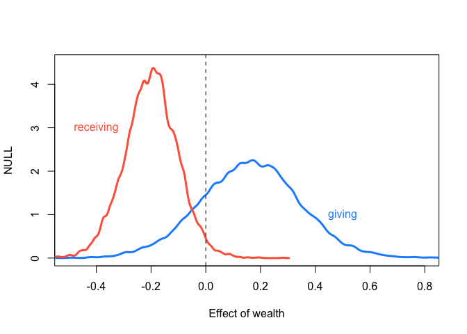<!-- -->

Th effect of wealth on giving is larger positive, while its effect on
receiving is negative. The rich gives more and receive less.
