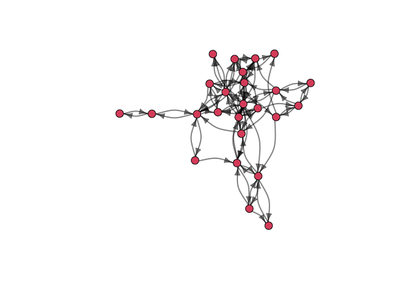
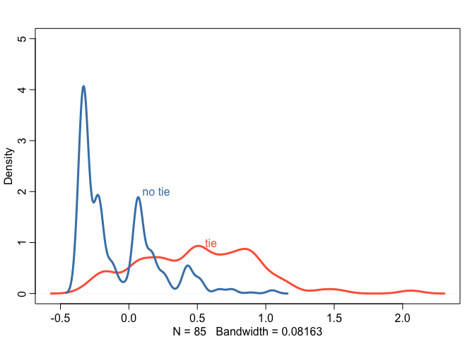
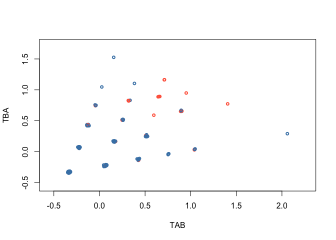
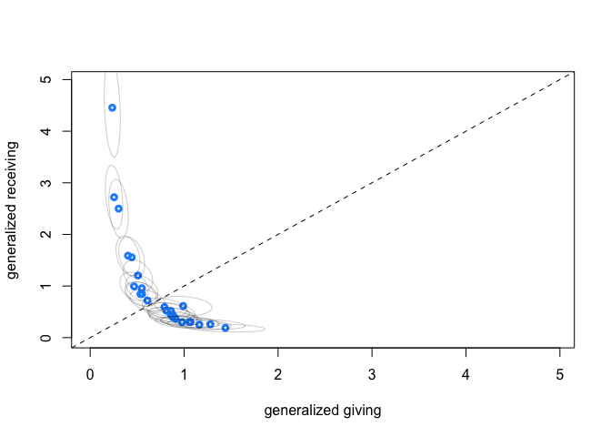
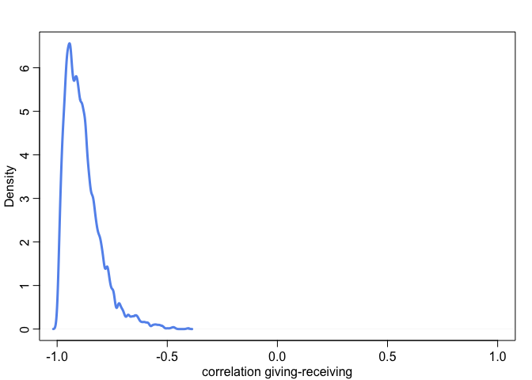
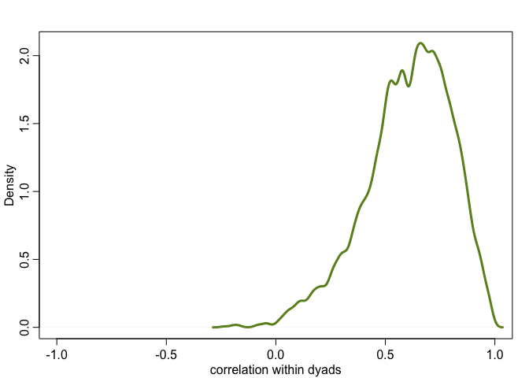

Lecture 15: Social Networks
================
Yurun (Ellen) Ying
2022-06-29

## Modeling Social Networks

The data we are gonna look at is a food sharing data in Arang Dak. The
estimand is to what extent sharing is explained by reciprocity, aka, to
what extent sharing is balanced within dyads. And how much sharing is
explained by generalized sharing?

``` r
data("KosterLeckie")
```

A DAG for this data (and perhaps for a lot of social network problems as
well). Giving is motivated by the social ties in both directions as well
as by general characteristics of the two households. The social ties are
also influenced by general characteristics of the two households. These
characteristics include things like wealth, hobbies, locations, etc.

``` r
dag1 <- dagitty("dag{H_A -> G_AB <- H_B; T_AB -> G_AB <- T_BA;
                H_A -> T_AB <- H_B; H_A -> T_BA <- H_B}")
coordinates(dag1) <- list(x = c(H_A = 0.4, H_B = 0.6, G_AB = 0.5, T_AB = 0.5, T_BA = 0.5),
                          y = c(H_A = 0.5, H_B = 0.5, G_AB = 0.5, T_AB = 0.3, T_BA = 0.7))
drawdag(dag1)
```

<!-- -->

### A generative model of social networks

We will now try to simulate social network data, build statistical
models, and test them against the simulated data before we apply them on
the real data. This process will be iterated many times in the workflow
of real projects.

``` r
# N households
N <- 25
dyads <- t(combn(N,2)) # all possible combinations of households
n_dyads <- nrow(dyads)

# simulate friendships in which ties are reciprocal
f <- rbern(n_dyads, 0.1) # 10% of dyads are friends

# simulate directed ties that are not reciprocal
alpha <- -3 # base rate of ties: -3 = 0.05
y <- matrix(NA, N, N) # matrix of ties for all individual households

# simulate ties
for (i in 1:N) for (j in 1:N) {
  
  if (i != j) {
  
    # directed tie from i to j
    ids <- sort(c(i,j))
    the_dyad <- which(dyads[,1] == ids[1] & dyads[,2] == ids[2])
    # either friend, or not friend but have a tie at a prob of 5%
    p_tie <- f[the_dyad] + (1 - f[the_dyad])*inv_logit(alpha) 
    y[i,j] <- rbern(1, p_tie)
  }
  
}

# simulate gifts
giftsAB <- rep(0, n_dyads)
giftsBA <- rep(0, n_dyads)
lambda <- log(c(0.5,2)) # rates of giving for y=0, y=1
for (i in 1:n_dyads){
  A <- dyads[i,1]
  B <- dyads[i,2]
  giftsAB[i] <- rpois(1, exp(lambda[1 + y[A,B]]))
  giftsBA[i] <- rpois(1, exp(lambda[1 + y[B,A]]))
}

# draw network
sng <- graph_from_adjacency_matrix(y)
lx <- layout_nicely(sng)
vcol <- "#DE536B"
plot(sng, layout = lx, vertex.size = 8, vertex.color = vcol,
     edge.arrow.size = 0.75, edge.width = 2, edge.curved = 0.35, edge.color = grau(),
     asp = 0.9, margin = -0.05, vertex.label = NA)
```

<!-- -->

Now let’s build a statistical model for this synthetic data. This time
the model will not fully reflect what we have in the data. We will have
to GLMs for gifts from A to B and those from B to A separately:

![\begin{aligned}
G\_{AB} &\sim \mathrm{Poisson}(\lambda\_{AB}) \\\\
\mathrm{log}(\lambda\_{AB}) &= \alpha + T\_{AB} \\\\
G\_{BA} &\sim \mathrm{Poisson}(\lambda\_{BA}) \\\\
\mathrm{log}(\lambda\_{BA}) &= \alpha + T\_{BA} \\\\
\begin{pmatrix}
T\_{AB} \\\\
T\_{BA}
\end{pmatrix} &\sim \mathrm{MVNormal}(
\begin{bmatrix}
0 \\\\
0
\end{bmatrix},
\begin{bmatrix}
\sigma^2 & \rho \sigma^2 \\\\
\rho \sigma^2 & \sigma^2
\end{bmatrix}
)\\\\
\alpha &\sim \mathrm{Normal}(0,1) \\\\
\sigma &\sim \mathrm{Exponential}(1)\\\\
\rho &\sim \mathrm{LKJCorr(2)} \\\\
\end{aligned}](https://latex.codecogs.com/png.image?%5Cdpi%7B110%7D&space;%5Cbg_white&space;%5Cbegin%7Baligned%7D%0AG_%7BAB%7D%20%26%5Csim%20%5Cmathrm%7BPoisson%7D%28%5Clambda_%7BAB%7D%29%20%5C%5C%0A%5Cmathrm%7Blog%7D%28%5Clambda_%7BAB%7D%29%20%26%3D%20%5Calpha%20%2B%20T_%7BAB%7D%20%5C%5C%0AG_%7BBA%7D%20%26%5Csim%20%5Cmathrm%7BPoisson%7D%28%5Clambda_%7BBA%7D%29%20%5C%5C%0A%5Cmathrm%7Blog%7D%28%5Clambda_%7BBA%7D%29%20%26%3D%20%5Calpha%20%2B%20T_%7BBA%7D%20%5C%5C%0A%5Cbegin%7Bpmatrix%7D%0AT_%7BAB%7D%20%5C%5C%0AT_%7BBA%7D%0A%5Cend%7Bpmatrix%7D%20%26%5Csim%20%5Cmathrm%7BMVNormal%7D%28%0A%5Cbegin%7Bbmatrix%7D%0A0%20%5C%5C%0A0%0A%5Cend%7Bbmatrix%7D%2C%0A%5Cbegin%7Bbmatrix%7D%0A%5Csigma%5E2%20%26%20%5Crho%20%5Csigma%5E2%20%5C%5C%0A%5Crho%20%5Csigma%5E2%20%26%20%5Csigma%5E2%0A%5Cend%7Bbmatrix%7D%0A%29%5C%5C%0A%5Calpha%20%26%5Csim%20%5Cmathrm%7BNormal%7D%280%2C1%29%20%5C%5C%0A%5Csigma%20%26%5Csim%20%5Cmathrm%7BExponential%7D%281%29%5C%5C%0A%5Crho%20%26%5Csim%20%5Cmathrm%7BLKJCorr%282%29%7D%20%5C%5C%0A%5Cend%7Baligned%7D "\begin{aligned}
G_{AB} &\sim \mathrm{Poisson}(\lambda_{AB}) \\
\mathrm{log}(\lambda_{AB}) &= \alpha + T_{AB} \\
G_{BA} &\sim \mathrm{Poisson}(\lambda_{BA}) \\
\mathrm{log}(\lambda_{BA}) &= \alpha + T_{BA} \\
\begin{pmatrix}
T_{AB} \\
T_{BA}
\end{pmatrix} &\sim \mathrm{MVNormal}(
\begin{bmatrix}
0 \\
0
\end{bmatrix},
\begin{bmatrix}
\sigma^2 & \rho \sigma^2 \\
\rho \sigma^2 & \sigma^2
\end{bmatrix}
)\\
\alpha &\sim \mathrm{Normal}(0,1) \\
\sigma &\sim \mathrm{Exponential}(1)\\
\rho &\sim \mathrm{LKJCorr(2)} \\
\end{aligned}")

What we would like to know, really, is how much

and

are correlated.

``` r
# dyad model
f_dyad <- alist(
  GAB ~ poisson(lambdaAB),
  GBA ~ poisson(lambdaBA),
  log(lambdaAB) <- a + T[D,1],
  log(lambdaBA) <- a + T[D,2],
  a ~ normal(0,1),
  
  # dyad effects
  transpars> matrix[n_dyads,2]:T <- compose_noncentered(rep_vector(sigma_T,2), L_Rho_T, Z),
  matrix[2,n_dyads]:Z ~ normal(0,1),
  cholesky_factor_corr[2]:L_Rho_T ~ lkj_corr_cholesky(2),
  sigma_T ~ exponential(1),
  # compute correlation matrix for dyads
  gq> matrix[2,2]:Rho_T <<- Chol_to_Corr(L_Rho_T)
)

# synthetic data
sim_data <- list(
    n_dyads = n_dyads,
    n_households = N,
    D = 1:n_dyads,
    HA = dyads[,1],
    HB = dyads[,2],
    GAB = giftsAB,
    GBA = giftsBA )
```

``` r
# run the model with ulam
mGD <- ulam(f_dyad, data = sim_data, chains = 4, cores = 4, iter = 2000)
```

Let’s do some plotting:

``` r
post <- extract.samples(mGD)
# get the ties from A to B
tie_AB <- c()
tie_BA <- c()
for (i in 1:N-1) {
  tie_AB <- c(tie_AB, y[i,(i+1):25])
  tie_BA <- c(tie_BA, y[(i+1):25,i])
}
# posterior mean T
T_tie_mu <- apply(
  cbind(post$T[,which(tie_AB == 1),1], post$T[,which(tie_BA == 1),2]),
  2, mean)
T_notie_mu <- apply(
  cbind(post$T[,which(tie_AB == 0),1], post$T[,which(tie_BA == 0),2]),
  2, mean)

dens(T_tie_mu, col = "tomato", lwd = 3, ylim = c(0,5))
dens(T_notie_mu, col = "steelblue", lwd = 3, add = TRUE)
text(0.2, 2, "no tie", col = "steelblue")
text(0.6, 1, "tie", col = "tomato")
```

<!-- -->

The posterior mean T for dyads without a tie is not different from 0,
while the posterior mean T for dyads with a tie has most of its
probability mass above 0.

``` r
dens(post$Rho_T[,1,2], col = "olivedrab", lwd = 3, 
     xlim = c(-1,1), xlab = "correlation within dyads")
abline(v = 0, lty = 2)
```

<!-- -->

The posterior distribution of the correlation within dyads has most of
its probability mass above 0, indicating strong reciprocity of giving
within dyads.

``` r
# posterior mean T for AB and BA separately
TAB_mu <- apply(post$T[,,1], 2, mean)
TBA_mu <- apply(post$T[,,2], 2, mean)
plot(NULL, 
     xlim = range(TAB_mu)+c(-0.2,0.2), ylim = range(TBA_mu)+c(-0.2,0.2),
     xlab = "TAB", ylab = "TBA")
# color points if a tie is reciprocal
for (i in 1:length(TAB_mu))
  points(TAB_mu[i], TBA_mu[i], cex = 0.7, lwd = 2,
         col = ifelse(i %in% which(tie_AB==1 & tie_BA==1),
         "tomato", "steelblue"))
```

<!-- -->

Plotting TAB and TBA helps us to see the positive association between
the two. When a social tie is reciprocal, both households tend to give
more.

### Apply to the sample

``` r
# analyze sample
kl_data <- list(
    n_dyads = nrow(kl_dyads),
    n_households = max(kl_dyads$hidB),
    D = 1:nrow(kl_dyads),
    HA = kl_dyads$hidA,
    HB = kl_dyads$hidB,
    GAB = kl_dyads$giftsAB,
    GBA = kl_dyads$giftsBA )
```

``` r
mGDkl <- ulam(f_dyad, data = kl_data, chains = 4, cores = 4, iter = 4000)
```

``` r
precis(mGDkl, depth = 3, pars = c("a", "Rho_T", "sigma_T"))
```

    ##                 mean         sd      5.5%     94.5%     n_eff    Rhat4
    ## a          0.5521816 0.08346267 0.4149814 0.6859355 1091.6268 1.001540
    ## Rho_T[1,1] 1.0000000 0.00000000 1.0000000 1.0000000       NaN      NaN
    ## Rho_T[1,2] 0.3482343 0.06976823 0.2348098 0.4583893  620.6624 1.011935
    ## Rho_T[2,1] 0.3482343 0.06976823 0.2348098 0.4583893  620.6624 1.011935
    ## Rho_T[2,2] 1.0000000 0.00000000 1.0000000 1.0000000       NaN      NaN
    ## sigma_T    1.4489506 0.06438543 1.3476278 1.5562205  759.7940 1.003987

We can see there is also a positive association within dyads in the real
data.

### A generative model with general giving

What we have done so far, from the perspective of our DAG, is to model
the effect of social network ties on giving. We haven’t inspected the
general giving in our data yet, which are the confounds. These come from
the general features of households, such as wealth. As the previous
section, we will do it first through a generative simulation.

``` r
# simulate wealth
set.seed(238)
W <- rnorm(N) # standardized relative wealth in the community
bWG <- 0.5 # effect of wealth on giving - rich give more
bWR <- -1 # effect of wealth on receiving - rich receive less and poor get more

# simulate gifts
giftsAB <- rep(0, n_dyads)
giftsBA <- rep(0, n_dyads)
lambda <- log(c(0.5,2)) # rates of giving for y=0, y=1
for (i in 1:n_dyads){
  A <- dyads[i,1]
  B <- dyads[i,2]
  giftsAB[i] <- rpois(1, exp(lambda[1 + y[A,B]] + bWG*W[A] + bWR*W[B]))
  giftsBA[i] <- rpois(1, exp(lambda[1 + y[B,A]] + bWG*W[B] + bWR*W[A]))
}
```

We will also need to modify our model:

![\begin{aligned}
G\_{AB} &\sim \mathrm{Poisson}(\lambda\_{AB}) \\\\
\mathrm{log}(\lambda\_{AB}) &= \alpha + T\_{AB} + G_A + R_B\\\\
G\_{BA} &\sim \mathrm{Poisson}(\lambda\_{BA}) \\\\
\mathrm{log}(\lambda\_{BA}) &= \alpha + T\_{BA} + G_B + R_A\\\\
\begin{pmatrix}
T\_{AB} \\\\
T\_{BA}
\end{pmatrix} &\sim \mathrm{MVNormal}(
\begin{bmatrix}
0 \\\\
0
\end{bmatrix},
\begin{bmatrix}
\sigma^2 & \rho \sigma^2 \\\\
\rho \sigma^2 & \sigma^2
\end{bmatrix}
)\\\\
\alpha &\sim \mathrm{Normal}(0,1) \\\\
\sigma &\sim \mathrm{Exponential}(1)\\\\
\rho &\sim \mathrm{LKJCorr(2)} \\\\
\begin{pmatrix}
G_A \\\\
R_A
\end{pmatrix} &\sim \mathrm{MVNormal}(
\begin{bmatrix}
0 \\\\
0
\end{bmatrix},
\begin{bmatrix}
\sigma_G^2 & r \sigma_G \sigma_R \\\\
r \sigma_G \sigma_R & \sigma_R^2
\end{bmatrix}
)\\\\
\sigma_G,\sigma_R &\sim \mathrm{Exponential}(1)\\\\
r &\sim \mathrm{LKJCorr(2)} \\\\
\end{aligned}](https://latex.codecogs.com/png.image?%5Cdpi%7B110%7D&space;%5Cbg_white&space;%5Cbegin%7Baligned%7D%0AG_%7BAB%7D%20%26%5Csim%20%5Cmathrm%7BPoisson%7D%28%5Clambda_%7BAB%7D%29%20%5C%5C%0A%5Cmathrm%7Blog%7D%28%5Clambda_%7BAB%7D%29%20%26%3D%20%5Calpha%20%2B%20T_%7BAB%7D%20%2B%20G_A%20%2B%20R_B%5C%5C%0AG_%7BBA%7D%20%26%5Csim%20%5Cmathrm%7BPoisson%7D%28%5Clambda_%7BBA%7D%29%20%5C%5C%0A%5Cmathrm%7Blog%7D%28%5Clambda_%7BBA%7D%29%20%26%3D%20%5Calpha%20%2B%20T_%7BBA%7D%20%2B%20G_B%20%2B%20R_A%5C%5C%0A%5Cbegin%7Bpmatrix%7D%0AT_%7BAB%7D%20%5C%5C%0AT_%7BBA%7D%0A%5Cend%7Bpmatrix%7D%20%26%5Csim%20%5Cmathrm%7BMVNormal%7D%28%0A%5Cbegin%7Bbmatrix%7D%0A0%20%5C%5C%0A0%0A%5Cend%7Bbmatrix%7D%2C%0A%5Cbegin%7Bbmatrix%7D%0A%5Csigma%5E2%20%26%20%5Crho%20%5Csigma%5E2%20%5C%5C%0A%5Crho%20%5Csigma%5E2%20%26%20%5Csigma%5E2%0A%5Cend%7Bbmatrix%7D%0A%29%5C%5C%0A%5Calpha%20%26%5Csim%20%5Cmathrm%7BNormal%7D%280%2C1%29%20%5C%5C%0A%5Csigma%20%26%5Csim%20%5Cmathrm%7BExponential%7D%281%29%5C%5C%0A%5Crho%20%26%5Csim%20%5Cmathrm%7BLKJCorr%282%29%7D%20%5C%5C%0A%5Cbegin%7Bpmatrix%7D%0AG_A%20%5C%5C%0AR_A%0A%5Cend%7Bpmatrix%7D%20%26%5Csim%20%5Cmathrm%7BMVNormal%7D%28%0A%5Cbegin%7Bbmatrix%7D%0A0%20%5C%5C%0A0%0A%5Cend%7Bbmatrix%7D%2C%0A%5Cbegin%7Bbmatrix%7D%0A%5Csigma_G%5E2%20%26%20r%20%5Csigma_G%20%5Csigma_R%20%5C%5C%0Ar%20%5Csigma_G%20%5Csigma_R%20%26%20%5Csigma_R%5E2%0A%5Cend%7Bbmatrix%7D%0A%29%5C%5C%0A%5Csigma_G%2C%5Csigma_R%20%26%5Csim%20%5Cmathrm%7BExponential%7D%281%29%5C%5C%0Ar%20%26%5Csim%20%5Cmathrm%7BLKJCorr%282%29%7D%20%5C%5C%0A%5Cend%7Baligned%7D "\begin{aligned}
G_{AB} &\sim \mathrm{Poisson}(\lambda_{AB}) \\
\mathrm{log}(\lambda_{AB}) &= \alpha + T_{AB} + G_A + R_B\\
G_{BA} &\sim \mathrm{Poisson}(\lambda_{BA}) \\
\mathrm{log}(\lambda_{BA}) &= \alpha + T_{BA} + G_B + R_A\\
\begin{pmatrix}
T_{AB} \\
T_{BA}
\end{pmatrix} &\sim \mathrm{MVNormal}(
\begin{bmatrix}
0 \\
0
\end{bmatrix},
\begin{bmatrix}
\sigma^2 & \rho \sigma^2 \\
\rho \sigma^2 & \sigma^2
\end{bmatrix}
)\\
\alpha &\sim \mathrm{Normal}(0,1) \\
\sigma &\sim \mathrm{Exponential}(1)\\
\rho &\sim \mathrm{LKJCorr(2)} \\
\begin{pmatrix}
G_A \\
R_A
\end{pmatrix} &\sim \mathrm{MVNormal}(
\begin{bmatrix}
0 \\
0
\end{bmatrix},
\begin{bmatrix}
\sigma_G^2 & r \sigma_G \sigma_R \\
r \sigma_G \sigma_R & \sigma_R^2
\end{bmatrix}
)\\
\sigma_G,\sigma_R &\sim \mathrm{Exponential}(1)\\
r &\sim \mathrm{LKJCorr(2)} \\
\end{aligned}")

``` r
# general model
f_general <- alist(
  GAB ~ poisson(lambdaAB),
  GBA ~ poisson(lambdaBA),
  log(lambdaAB) <- a + T[D,1] + gr[HA,1] + gr[HB,2],
  log(lambdaBA) <- a + T[D,2] + gr[HB,1] + gr[HA,2],
  a ~ normal(0,1),
  
  # dyad effects
  transpars> matrix[n_dyads,2]:T <- compose_noncentered(rep_vector(sigma_T,2), L_Rho_T, Z),
  matrix[2,n_dyads]:Z ~ normal(0,1),
  cholesky_factor_corr[2]:L_Rho_T ~ lkj_corr_cholesky(2),
  sigma_T ~ exponential(1),
  
  # general effects
  transpars> matrix[n_households,2]:gr <- compose_noncentered(sigma_gr, L_Rho_gr, Zgr),
  matrix[2,n_households]:Zgr ~ normal(0,1),
  cholesky_factor_corr[2]:L_Rho_gr ~ lkj_corr_cholesky(2),
  vector[2]:sigma_gr ~ exponential(1),
  
  # compute correlation matrix for dyads
  gq> matrix[2,2]:Rho_T <<- Chol_to_Corr(L_Rho_T),
  gq> matrix[2,2]:Rho_gr <<- Chol_to_Corr(L_Rho_gr)
)

# synthetic data
sim_data <- list(
    n_dyads = n_dyads,
    n_households = N,
    D = 1:n_dyads,
    HA = dyads[,1],
    HB = dyads[,2],
    GAB = giftsAB,
    GBA = giftsBA )
```

``` r
# run the model with ulam
mGDR <- ulam(f_general, data = sim_data, chains = 4, cores = 4, iter = 2000)
```

``` r
precis(mGDR, depth = 3, pars = c("a", "Rho_T", "sigma_T", "Rho_gr", "sigma_gr"))
```

    ##                   mean         sd       5.5%      94.5%     n_eff    Rhat4
    ## a           -0.4281273 0.11641582 -0.6173491 -0.2419819 2653.4555 1.000846
    ## Rho_T[1,1]   1.0000000 0.00000000  1.0000000  1.0000000       NaN      NaN
    ## Rho_T[1,2]   0.6048312 0.19642345  0.2546374  0.8805609  652.9376 1.005536
    ## Rho_T[2,1]   0.6048312 0.19642345  0.2546374  0.8805609  652.9376 1.005536
    ## Rho_T[2,2]   1.0000000 0.00000000  1.0000000  1.0000000       NaN      NaN
    ## sigma_T      0.5698531 0.06090312  0.4726440  0.6695593 2074.6985 1.005910
    ## Rho_gr[1,1]  1.0000000 0.00000000  1.0000000  1.0000000       NaN      NaN
    ## Rho_gr[1,2] -0.8835387 0.08167964 -0.9767125 -0.7374193 1610.4016 1.001586
    ## Rho_gr[2,1] -0.8835387 0.08167964 -0.9767125 -0.7374193 1610.4016 1.001586
    ## Rho_gr[2,2]  1.0000000 0.00000000  1.0000000  1.0000000       NaN      NaN
    ## sigma_gr[1]  0.5189178 0.09689281  0.3800331  0.6859233 1601.5088 1.001632
    ## sigma_gr[2]  0.8414506 0.13296385  0.6561553  1.0763069 1781.3685 1.000255

Do some plotting to see the results

``` r
# generalized giving against receiving
postGDR <- extract.samples(mGDR)
post_gg <- sapply(1:N, function(i) exp(postGDR$a + postGDR$gr[,i,1]))
gg_mu <- apply(post_gg, 2, mean)
post_gr <- sapply(1:N, function(i) exp(postGDR$a + postGDR$gr[,i,2]))
gr_mu <- apply(post_gr, 2, mean)

xymax <- max(gg_mu,gr_mu) + 0.5
plot(NULL, xlim = c(0,xymax), ylim = c(0,xymax),
     xlab = "generalized giving", ylab = "generalized receiving")
abline(a = 0, b = 1, lty = 2)
points(gg_mu, gr_mu, lwd = 3, cex = 0.8, col = "dodgerblue")
for (i in 1:N) {
  sigma <- cov(cbind(post_gg[,i], post_gr[,i]))
  mu <- c(gg_mu[i], gr_mu[i])
  lines(
    ellipse(sigma, centre = mu, level = 0.5), 
    col = col.alpha("black", 0.2))
}
```

<!-- -->

``` r
# correlation between giving and receiving
dens(postGDR$Rho_gr[,1,2], xlim = c(-1,1), xlab = "correlation giving-receiving",
     lwd = 3, col = "cornflowerblue")
```

<!-- -->

These two plots show that generalized giving and generalized receiving
are negatively correlated. Those who give more tend to receive less.

``` r
# correlation social tie
dens(postGDR$Rho_T[,1,2], xlim = c(-1,1), xlab = "correlation within dyads",
     lwd = 3, col = "olivedrab")
```

<!-- -->

The correlation within dyads is even stronger in this model, being
pushed all the way near 1.

### The real data with generalized giving and receiving

``` r
mGDRkl <- ulam(f_general, data = kl_data, chains = 4, cores = 4, iter = 4000)
```

``` r
# generalized giving against receiving
postGDRkl <- extract.samples(mGDRkl)
post_gg <- sapply(1:N, function(i) exp(postGDRkl$a + postGDRkl$gr[,i,1]))
gg_mu <- apply(post_gg, 2, mean)
post_gr <- sapply(1:N, function(i) exp(postGDRkl$a + postGDRkl$gr[,i,2]))
gr_mu <- apply(post_gr, 2, mean)

xymax <- max(gg_mu,gr_mu) + 0.5
plot(NULL, xlim = c(0,xymax), ylim = c(0,xymax),
     xlab = "generalized giving", ylab = "generalized receiving")
abline(a = 0, b = 1, lty = 2)
points(gg_mu, gr_mu, lwd = 3, cex = 0.8, col = "dodgerblue")
for (i in 1:N) {
  sigma <- cov(cbind(post_gg[,i], post_gr[,i]))
  mu <- c(gg_mu[i], gr_mu[i])
  lines(
    ellipse(sigma, centre = mu, level = 0.5), 
    col = col.alpha("black", 0.2))
}
```

<!-- -->

``` r
# correlation between giving and receiving
dens(postGDRkl$Rho_gr[,1,2], xlim = c(-1,1), xlab = "correlation giving-receiving",
     lwd = 3, col = "cornflowerblue")
```

<!-- -->

``` r
# correlation social tie
dens(postGDRkl$Rho_T[,1,2], xlim = c(-1,1), xlab = "correlation within dyads",
     lwd = 3, col = "olivedrab")
```

<!-- -->

Same pattern here: generalized giving and receiving are negative
correlated, and correlation within dyads is strong.

### Adding linear model for social tie, giving, and receiving

The previous models treat the social ties, generalized giving and
receiving as single varying effects. They are really just placeholders
for other causes, so we can also model them as linear functions of the
causes we are interested in. In our case, this is the strength of social
ties and wealth for giving and receiving.

Let’s turn our mmodel into some fancy stuff:

![\begin{aligned}
G\_{AB} &\sim \mathrm{Poisson}(\lambda\_{AB}) \\\\
\mathrm{log}(\lambda\_{AB}) &= \alpha + \mathcal{T}\_{AB} + \mathcal{G}\_A + \mathcal{R}\_B\\\\
\mathcal{T}\_{AB} &= T_AB + \beta\_{A} A\_{AB}\\\\
\mathcal{G}\_A &= G_A + \beta\_{W,G} W\_{A}\\\\
\mathcal{R}\_B &= R_B + \beta\_{W,R} W\_{B}\\\\
G\_{BA} &\sim \mathrm{Poisson}(\lambda\_{BA}) \\\\
\mathrm{log}(\lambda\_{BA}) &= \alpha + \mathcal{T}\_{BA} + \mathcal{G}\_B + \mathcal{R}\_A\\\\
\mathcal{T}\_{BA} &= T_BA + \beta\_{A} A\_{BA}\\\\
\mathcal{G}\_B &= G_B + \beta\_{W,G} W\_{B}\\\\
\mathcal{R}\_A &= R_A + \beta\_{W,R} W\_{A}\\\\
\end{aligned}](https://latex.codecogs.com/png.image?%5Cdpi%7B110%7D&space;%5Cbg_white&space;%5Cbegin%7Baligned%7D%0AG_%7BAB%7D%20%26%5Csim%20%5Cmathrm%7BPoisson%7D%28%5Clambda_%7BAB%7D%29%20%5C%5C%0A%5Cmathrm%7Blog%7D%28%5Clambda_%7BAB%7D%29%20%26%3D%20%5Calpha%20%2B%20%5Cmathcal%7BT%7D_%7BAB%7D%20%2B%20%5Cmathcal%7BG%7D_A%20%2B%20%5Cmathcal%7BR%7D_B%5C%5C%0A%5Cmathcal%7BT%7D_%7BAB%7D%20%26%3D%20T_AB%20%2B%20%5Cbeta_%7BA%7D%20A_%7BAB%7D%5C%5C%0A%5Cmathcal%7BG%7D_A%20%26%3D%20G_A%20%2B%20%5Cbeta_%7BW%2CG%7D%20W_%7BA%7D%5C%5C%0A%5Cmathcal%7BR%7D_B%20%26%3D%20R_B%20%2B%20%5Cbeta_%7BW%2CR%7D%20W_%7BB%7D%5C%5C%0AG_%7BBA%7D%20%26%5Csim%20%5Cmathrm%7BPoisson%7D%28%5Clambda_%7BBA%7D%29%20%5C%5C%0A%5Cmathrm%7Blog%7D%28%5Clambda_%7BBA%7D%29%20%26%3D%20%5Calpha%20%2B%20%5Cmathcal%7BT%7D_%7BBA%7D%20%2B%20%5Cmathcal%7BG%7D_B%20%2B%20%5Cmathcal%7BR%7D_A%5C%5C%0A%5Cmathcal%7BT%7D_%7BBA%7D%20%26%3D%20T_BA%20%2B%20%5Cbeta_%7BA%7D%20A_%7BBA%7D%5C%5C%0A%5Cmathcal%7BG%7D_B%20%26%3D%20G_B%20%2B%20%5Cbeta_%7BW%2CG%7D%20W_%7BB%7D%5C%5C%0A%5Cmathcal%7BR%7D_A%20%26%3D%20R_A%20%2B%20%5Cbeta_%7BW%2CR%7D%20W_%7BA%7D%5C%5C%0A%5Cend%7Baligned%7D "\begin{aligned}
G_{AB} &\sim \mathrm{Poisson}(\lambda_{AB}) \\
\mathrm{log}(\lambda_{AB}) &= \alpha + \mathcal{T}_{AB} + \mathcal{G}_A + \mathcal{R}_B\\
\mathcal{T}_{AB} &= T_AB + \beta_{A} A_{AB}\\
\mathcal{G}_A &= G_A + \beta_{W,G} W_{A}\\
\mathcal{R}_B &= R_B + \beta_{W,R} W_{B}\\
G_{BA} &\sim \mathrm{Poisson}(\lambda_{BA}) \\
\mathrm{log}(\lambda_{BA}) &= \alpha + \mathcal{T}_{BA} + \mathcal{G}_B + \mathcal{R}_A\\
\mathcal{T}_{BA} &= T_BA + \beta_{A} A_{BA}\\
\mathcal{G}_B &= G_B + \beta_{W,G} W_{B}\\
\mathcal{R}_A &= R_A + \beta_{W,R} W_{A}\\
\end{aligned}")

``` r
# model with household features
f_house <- alist(
  # A toB
  GAB ~ poisson(lambdaAB),
  log(lambdaAB) <- a + TAB + GA + RB,
  TAB <- T[D,1] + bA*A,
  GA <- gr[HA,1] + bW[1]*W[HA],
  RB <- gr[HB,2] + bW[2]*W[HB],
  
  GBA ~ poisson(lambdaBA),
  log(lambdaBA) <- a + TBA + GB + RA,
  TBA <- T[D,2] + bA*A,
  GB <- gr[HB,1] + bW[1]*W[HB],
  RA <- gr[HA,2] + bW[2]*W[HA],
  
  # priors
  a ~ normal(0, 1),
  bA ~ normal(0, 1),
  vector[2]:bW ~ normal(0,1),
  
  # dyad effects
  transpars> matrix[n_dyads,2]:T <- compose_noncentered(rep_vector(sigma_T,2), L_Rho_T, Z),
  matrix[2,n_dyads]:Z ~ normal(0,1),
  cholesky_factor_corr[2]:L_Rho_T ~ lkj_corr_cholesky(2),
  sigma_T ~ exponential(1),
  
  # general effects
  transpars> matrix[n_households,2]:gr <- compose_noncentered(sigma_gr, L_Rho_gr, Zgr),
  matrix[2,n_households]:Zgr ~ normal(0,1),
  cholesky_factor_corr[2]:L_Rho_gr ~ lkj_corr_cholesky(2),
  vector[2]:sigma_gr ~ exponential(1),
  
  # compute correlation matrix for dyads
  gq> matrix[2,2]:Rho_T <<- Chol_to_Corr(L_Rho_T),
  gq> matrix[2,2]:Rho_gr <<- Chol_to_Corr(L_Rho_gr)
)


# compose data
kl_data <- list(
    n_dyads = nrow(kl_dyads),
    n_households = max(kl_dyads$hidB),
    D = 1:nrow(kl_dyads),
    HA = kl_dyads$hidA,
    HB = kl_dyads$hidB,
    GAB = kl_dyads$giftsAB,
    GBA = kl_dyads$giftsBA,
    W = standardize(kl_households$hwealth), # wealth
    A = standardize(kl_dyads$dass) ) # association index - time spent together
```

``` r
# fit the model
mGDRAkl <- ulam(f_house, data = kl_data, chains = 4, cores = 4, iter = 4000)
```

``` r
postGDRAkl <- extract.samples(mGDRAkl)
# the effect of wealth
plot(NULL, xlim = c(-0.5, 0.8), ylim = c(0,4.5), xlab = "Effect of wealth")
dens(postGDRAkl$bW[,1], lwd = 3, col = "dodgerblue", add = TRUE)
dens(postGDRAkl$bW[,2], lwd = 3, col = "tomato", add = TRUE)
abline(v = 0, lty = 2)
text(0.5, 1, "giving", col = "dodgerblue")
text(-0.4, 3, "receiving", col = "tomato")
```

<!-- -->

Th effect of wealth on giving is larger positive, while its effect on
receiving is negative. The rich gives more and receive less.
