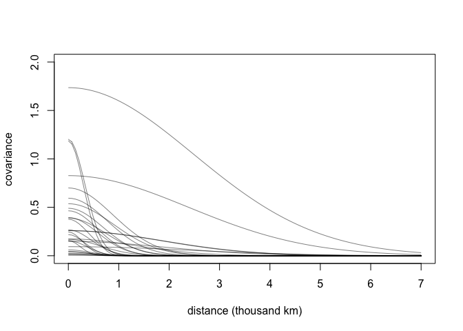
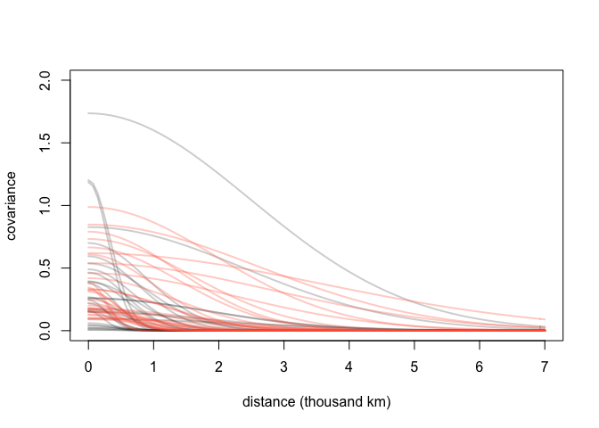
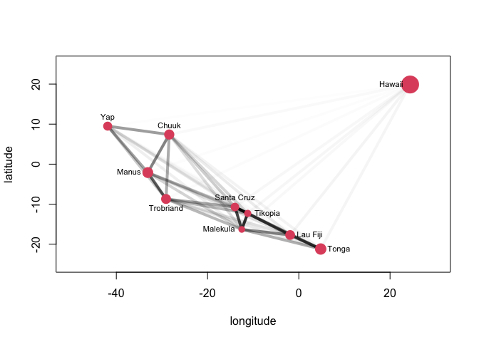
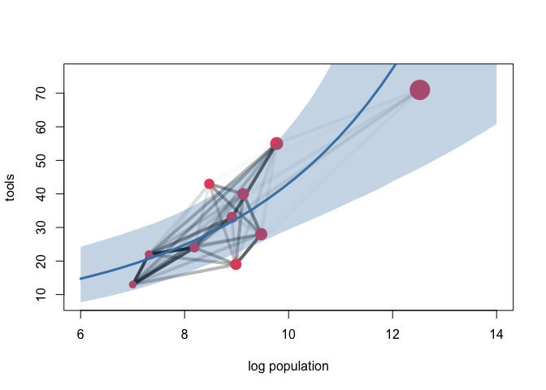
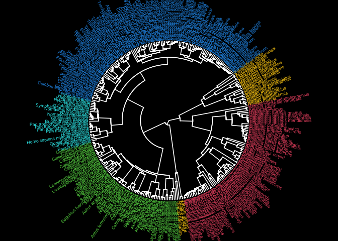
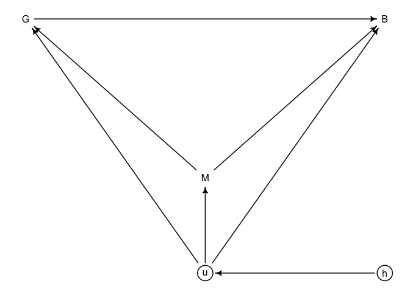
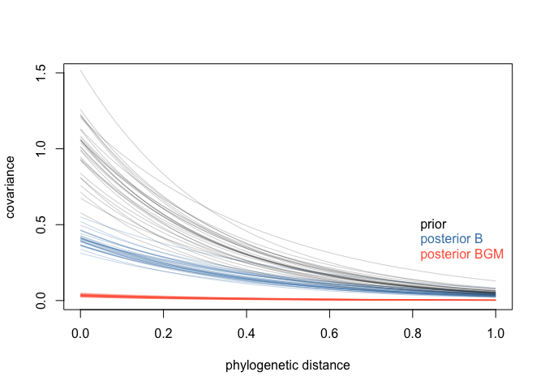
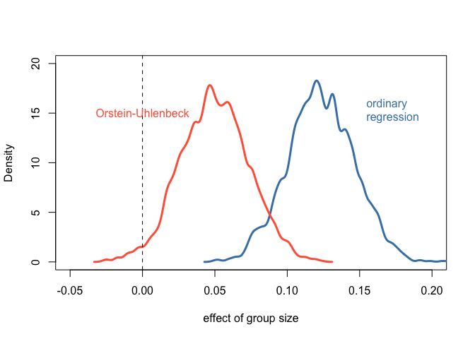

Lecture 16: Gussian Processes
================
Yurun (Ellen) Ying
2022-07-02

## Spatial covariance

Another application of varying effects is to model continuous clusters.
For example, we are worried about how spatially patterned confounders
can influence our inference about the Oceanic tool example, then we can
use multilevel model to model it. However, since spatial distance is a
continuous variable, to easily model it, we need to use Gaussian
processes.

Gaussian process is an infinite dimensional generalization of
multivariate normal distribution. Essentially it is to use a kernel
function to map the distance between two points to their covariance.

Our model looks like this:

![\begin{aligned}
T_i &\sim \mathrm{Poisson}(\lambda_i) \\\\
\mathrm{log}(\lambda_i) &= \bar{\alpha} + \alpha\_{S\[i\]} \\\\
\begin{bmatrix}
\alpha_1 \\\\
\alpha_2 \\\\
\vdots \\\\
\alpha\_{10}
\end{bmatrix} &\sim \mathrm{MVNormal}
\begin{pmatrix}
\begin{bmatrix}
0 \\\\
0 \\\\
\vdots \\\\
0
\end{bmatrix},
\mathbf{K}
\end{pmatrix} \\\\
k\_{i,j} &= \eta^2 \mathrm{exp}(-\rho^2 d\_{i,j}^2) \\\\
\bar{\alpha} &\sim \mathrm{Normal}(3,0.5) \\\\
\eta^2 &\sim \mathrm{Exponential}(2) \\\\
\rho^2 &\sim \mathrm{Exponential}(0.5)
\end{aligned}](https://latex.codecogs.com/png.image?%5Cdpi%7B110%7D&space;%5Cbg_white&space;%5Cbegin%7Baligned%7D%0AT_i%20%26%5Csim%20%5Cmathrm%7BPoisson%7D%28%5Clambda_i%29%20%5C%5C%0A%5Cmathrm%7Blog%7D%28%5Clambda_i%29%20%26%3D%20%5Cbar%7B%5Calpha%7D%20%2B%20%5Calpha_%7BS%5Bi%5D%7D%20%5C%5C%0A%5Cbegin%7Bbmatrix%7D%0A%5Calpha_1%20%5C%5C%0A%5Calpha_2%20%5C%5C%0A%5Cvdots%20%5C%5C%0A%5Calpha_%7B10%7D%0A%5Cend%7Bbmatrix%7D%20%26%5Csim%20%5Cmathrm%7BMVNormal%7D%0A%5Cbegin%7Bpmatrix%7D%0A%5Cbegin%7Bbmatrix%7D%0A0%20%5C%5C%0A0%20%5C%5C%0A%5Cvdots%20%5C%5C%0A0%0A%5Cend%7Bbmatrix%7D%2C%0A%5Cmathbf%7BK%7D%0A%5Cend%7Bpmatrix%7D%20%5C%5C%0Ak_%7Bi%2Cj%7D%20%26%3D%20%5Ceta%5E2%20%5Cmathrm%7Bexp%7D%28-%5Crho%5E2%20d_%7Bi%2Cj%7D%5E2%29%20%5C%5C%0A%5Cbar%7B%5Calpha%7D%20%26%5Csim%20%5Cmathrm%7BNormal%7D%283%2C0.5%29%20%5C%5C%0A%5Ceta%5E2%20%26%5Csim%20%5Cmathrm%7BExponential%7D%282%29%20%5C%5C%0A%5Crho%5E2%20%26%5Csim%20%5Cmathrm%7BExponential%7D%280.5%29%0A%5Cend%7Baligned%7D "\begin{aligned}
T_i &\sim \mathrm{Poisson}(\lambda_i) \\
\mathrm{log}(\lambda_i) &= \bar{\alpha} + \alpha_{S[i]} \\
\begin{bmatrix}
\alpha_1 \\
\alpha_2 \\
\vdots \\
\alpha_{10}
\end{bmatrix} &\sim \mathrm{MVNormal}
\begin{pmatrix}
\begin{bmatrix}
0 \\
0 \\
\vdots \\
0
\end{bmatrix},
\mathbf{K}
\end{pmatrix} \\
k_{i,j} &= \eta^2 \mathrm{exp}(-\rho^2 d_{i,j}^2) \\
\bar{\alpha} &\sim \mathrm{Normal}(3,0.5) \\
\eta^2 &\sim \mathrm{Exponential}(2) \\
\rho^2 &\sim \mathrm{Exponential}(0.5)
\end{aligned}")

Let’s first do some prior distribution to understand what the kernel
function and its supporting priors imply

``` r
set.seed(437)
n <- 30
eta2 <- rexp(n, 2)
rho2 <- rexp(n, 0.5)

plot(NULL, xlim = c(0,7), ylim = c(0,2),
     xlab = "distance (thousand km)", ylab = "covariance")
for (i in 1:n) curve(from = 0, to = 7, eta2[i]*exp(-rho2[i]*x^2), 
                      col = col.alpha("black", 0.5), add = TRUE)
```

<!-- -->

Mostly allow large covariance within small distances and the covariance
declines rapidly.

Let’s fit the data now

``` r
data("Kline2")
d <- Kline2
data("islandsDistMatrix")

dat_list <- list(
  T = d$total_tools,
  S = 1:10,
  D = islandsDistMatrix
)

mTdist <- ulam(
  alist(
    T ~ poisson(lambda),
    log(lambda) <- abar + a[S],
    vector[10]:a ~ multi_normal(0, K),
    transpars> matrix[10,10]:K <- cov_GPL2(D, etasq, rhosq, 0.01),
    abar ~ normal(3, 0.5),
    etasq ~ exponential(2),
    rhosq ~ exponential(0.5)
  ), data = dat_list, chains = 4, cores = 4, iter = 4000
)
```

``` r
# plot the posterior against the prior
set.seed(437)
post <- extract.samples(mTdist)

plot(NULL, xlim = c(0,7), ylim = c(0,2),
     xlab = "distance (thousand km)", ylab = "covariance")
for (i in 1:n) curve(from = 0, to = 7, eta2[i]*exp(-rho2[i]*x^2), 
                      col = col.alpha("black", 0.2), lwd = 2, add = TRUE)
for (i in 1:n) curve(from = 0, to = 7, post$etasq[i]*exp(-post$rhosq[i]*x^2), 
                      col = col.alpha("tomato", 0.3), lwd = 2, add = TRUE)
```

<!-- -->

With the data, the model believes that the covariance among islands is
smaller than we assumed with the priors.

Now plot the spatial association

``` r
K <- post$K

# scale point size to logpop
psize <- d$logpop / max(d$logpop)
psize <- exp(psize*1.5) - 1

# plot raw data and labels
plot(NULL, xlab = "longitude", ylab = "latitude",
     xlim = c(-50, 30), ylim = c(-25, 25))
# overlay lines shaded by cov
Kmean <- apply(K, c(2,3), mean)
Kmean <- Kmean / max(Kmean)
for (i in 1:10) for (j in 1:10) {
  if (i < j) lines(c(d$lon2[i], d$lon2[j]), c(d$lat[i], d$lat[j]),
                   lwd = 4, col = col.alpha("black", Kmean[i,j]))
}
points(d$lon2, d$lat, col = 2, cex = psize, pch = 16)
labels <- as.character(d$culture)
text(d$lon2, d$lat, labels = labels, cex=0.7, pos=c(2,4,3,3,4,1,3,2,4,2))
```

<!-- -->

We can see islands close to each other have higher covariance in tool
numbers.

Now the full model including population as an explanatory variable. We
will change the linear model into this:

![\lambda_i = \frac{\bar{\alpha} P_i^{\beta}}{\gamma} \mathrm{exp}(\alpha\_{S\[i\]})](https://latex.codecogs.com/png.image?%5Cdpi%7B110%7D&space;%5Cbg_white&space;%5Clambda_i%20%3D%20%5Cfrac%7B%5Cbar%7B%5Calpha%7D%20P_i%5E%7B%5Cbeta%7D%7D%7B%5Cgamma%7D%20%5Cmathrm%7Bexp%7D%28%5Calpha_%7BS%5Bi%5D%7D%29 "\lambda_i = \frac{\bar{\alpha} P_i^{\beta}}{\gamma} \mathrm{exp}(\alpha_{S[i]})")

and the priors

")

``` r
dat_list <- list(
  T = d$total_tools,
  P = d$population,
  S = 1:10,
  D = islandsDistMatrix
)

mTDP <- ulam(
  alist(
    T ~ poisson(lambda),
    lambda <- (abar*P^b / g)*exp(a[S]),
    vector[10]:a ~ multi_normal(0, K),
    transpars> matrix[10,10]:K <- cov_GPL2(D, etasq, rhosq, 0.01),
    c(abar,b,g) ~ exponential(1),
    etasq ~ exponential(2),
    rhosq ~ exponential(0.5)
  ), data = dat_list, chains = 4, cores = 4, iter = 4000
)
```

Plot the tool number agianst log population, as well as the posterior
mean.

``` r
post <- extract.samples(mTDP)
x_seq <- seq(6,14,len = 30)
post_l <- sapply(x_seq, function(x) with(post, (abar*exp(x)^b / g)))
K <- post$K

plot(NULL, xlim = range(x_seq), ylim = range(d$total_tools)+c(-5,5),
     xlab = "log population", ylab = "tools")

Kmean <- apply(K, c(2,3), mean)
Kmean <- Kmean / max(Kmean)
for (i in 1:10) for (j in 1:10) {
  if (i < j) lines(c(d$logpop[i], d$logpop[j]), c(d$total_tools[i], d$total_tools[j]),
                   lwd = 4, col = col.alpha("black", Kmean[i,j]))
}

points(d$logpop, d$total_tools, col = 2, cex = psize, pch = 16)
lines(x_seq, apply(post_l, 2, mean), col = "steelblue", lwd = 3)
shade(apply(post_l, 2, PI, prob = 0.89), x_seq, col = col.alpha("steelblue", 0.3))
```

<!-- -->

## Phylogenetic regression

Gaussian processes can also be used to account for covariance due to
shared histories or ancestors. We will use the brain size in primates to
illustrate this.

``` r
data("Primates301")
d <- Primates301
data("Primates301_nex")

# use library ape to plot the phylogenetic tree
l <- ladderize(Primates301_nex)

cols <- rep(1,301)
cols[1:30] <- 4 # NWM
cols[31:106] <- 2 # lemurs
cols[107:173] <- 3
cols[174:198] <- 5 # apes
cols[199:208] <- 3
cols[209:286] <- 4
cols[287:301] <- 7
cols[164:173] <- 7

par(bg="black")
plot( l , type="fan" , font=1 , no.margin=TRUE ,
    label.offset=1 , cex=0.55 , edge.width=1.6 , edge.col="white" , tip.col=cols , rotate.tree=37 )
```

<!-- -->

This is super cool.

The causal model we will be using to analyze this data is the social
brain hypothesis.

``` r
dag1 <- dagitty("dag{u[unobserved]; h[unobserved]; G -> B; G <- M ->B; h -> u; u -> G; u -> M; u -> B}")
coordinates(dag1) <- list(x = c(G = 0.4, B = 0.6, M = 0.5, u = 0.5, h = 0.6),
                          y = c(G = 0, B = 0, M = 0.5, u = 0.8, h = 0.8))
drawdag(dag1)
```

<!-- -->

Let’s get into the analysis part. We will first prepare an empty model
without any predictors:

 \\
\mu_i &= \alpha \\
\mathbf{K} &= \eta^2 \mathrm{exp}(-\rho d_{i,j}) \\
\alpha &\sim \mathrm{Normal}(0,1)\\
\eta^2 &\sim \mathrm{HalfNormal}(1, 0.25) \\
\rho &\sim \mathrm{HalfNormal}(3, 0.25)
\end{aligned}")

The kernel used here is the Ornstein-Uhlenbeck kernel.

``` r
# complete case analysis
d$name <- as.character(d$name)
dstan <- d[complete.cases(d$group_size,d$body,d$brain),]
dat_list <- list(
    N_spp = nrow(dstan),
    M = standardize(log(dstan$body)),
    B = standardize(log(dstan$brain)),
    G = standardize(log(dstan$group_size)),
    Imat = diag(nrow(dstan))
    )

# scaled and reordered distance matrix
spp_obs <- dstan$name
tree_trimmed <- keep.tip(Primates301_nex, spp_obs)
Dmat <- cophenetic(tree_trimmed)
dat_list$Dmat <- Dmat[spp_obs, spp_obs]/max(Dmat)

# multivariate normal form
# essentially same as the classic regression form
mBMG <- ulam(
    alist(
        B ~ multi_normal(mu, K),
        mu <- a + bM*M + bG*G,
        matrix[N_spp,N_spp]: K <- Imat*(sigma^2),
        a ~ normal(0, 1),
        c(bM,bG) ~ normal(0, 0.5),
        sigma ~ exponential(1)
    ), data = dat_list, chains = 4, cores = 4)

# L1 Gaussian process
mB_OU <- ulam(
  alist(
    B ~ multi_normal(mu, K),
    mu <- a + 0*M,
    matrix[N_spp,N_spp]:K <- cov_GPL1(Dmat, etasq, rho, 0.01),
    a ~ normal(0, 1),
    etasq ~ half_normal(1, 0.25),
    rho ~ half_normal(3, 0.25)
  ), data = dat_list, chains = 4, cores = 4
)
```

A model including predictors will have a linear model and supporting
priors as follows:


\end{aligned}")

``` r
mBGM_OU <- ulam(
  alist(
    B ~ multi_normal(mu, K),
    mu <- a + bM*M + bG*G,
    matrix[N_spp,N_spp]:K <- cov_GPL1(Dmat, etasq, rho, 0.01),
    a ~ normal(0, 1),
    c(bG,bM) ~ normal(0, 0.5),
    etasq ~ half_normal(1, 0.25),
    rho ~ half_normal(3, 0.25)
  ), data = dat_list, chains = 4, cores = 4
)
```

Let’s plot the prior and posterior distributions of the kernal function
to compare the two models.

``` r
priorB <- extract.prior(mB_OU)
postB <- extract.samples(mB_OU)
postBGM_OU <- extract.samples(mBGM_OU)

plot(NULL, xlim = c(0,1), ylim = c(0,1.5),
     xlab = "phylogenetic distance", ylab = "covariance")
for (i in 1:30) {
  with(priorB, curve(from = 0, to = 1, etasq[i]*exp(-rho[i]*x), 
                     col = col.alpha("black", 0.2), add = TRUE))
  with(postB, curve(from = 0, to = 1, etasq[i]*exp(-rho[i]*x), 
                     col = col.alpha("steelblue", 0.3), add = TRUE))
  with(postBGM_OU, curve(from = 0, to = 1, etasq[i]*exp(-rho[i]*x), 
                     col = col.alpha("tomato", 0.3), add = TRUE))
}
text(0.8, 0.5, "prior", pos = 4)
text(0.8, 0.4, "posterior B", col = "steelblue", pos = 4)
text(0.8, 0.3, "posterior BGM", col = "tomato", pos = 4)
```

<!-- -->

Meaning that when predictors are included there are not a lot of
variance left to be explained by phylogenetic distances.

``` r
postBGM <- extract.samples(mBMG)

# target of inference G
plot(NULL, xlim = c(-0.05, 0.2), ylim = c(0, 20),
     xlab = "effect of group size", ylab = "Density")
dens(postBGM$bG, lwd = 3, col = "steelblue", add = TRUE)
dens(postBGM_OU$bG, lwd = 3, col = "tomato", add = TRUE)
abline(v = 0, lty = 2)
text(0.15, 15, "ordinary\nregression", col = "steelblue", pos = 4)
text(0, 15, "Orstein-Uhlenbeck", col = "tomato")
```

<!-- -->

When accounting for phylogenetic distances, the causal effect of group
size is reduced.
