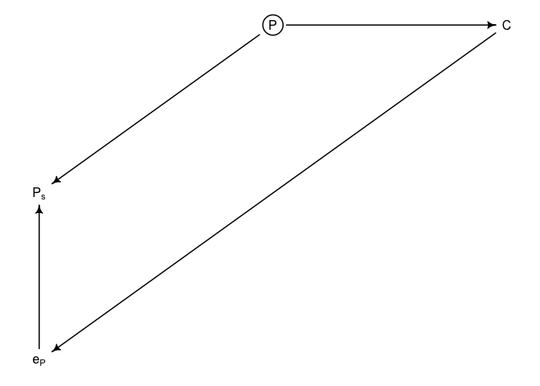
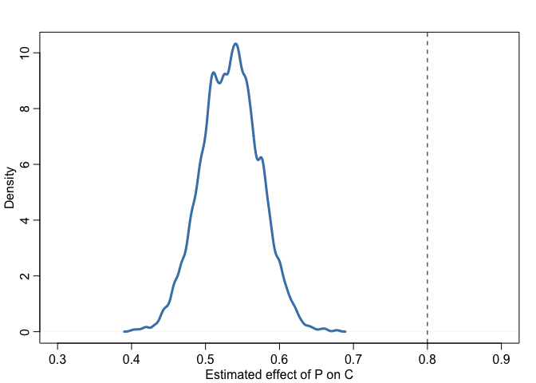
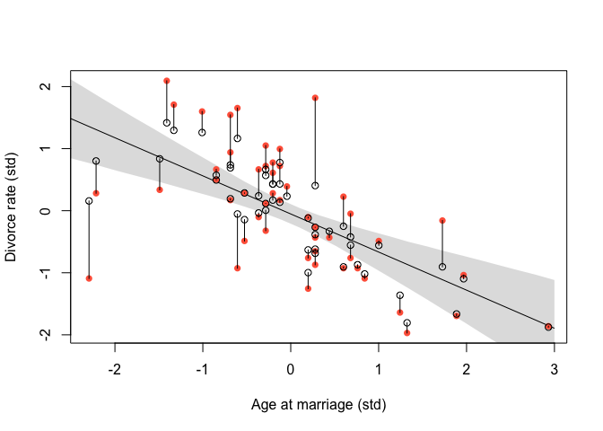
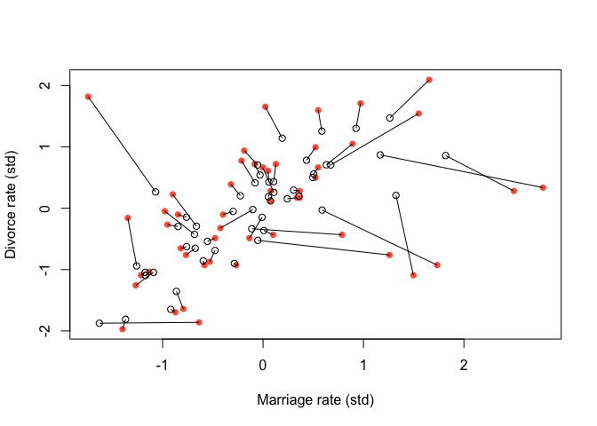
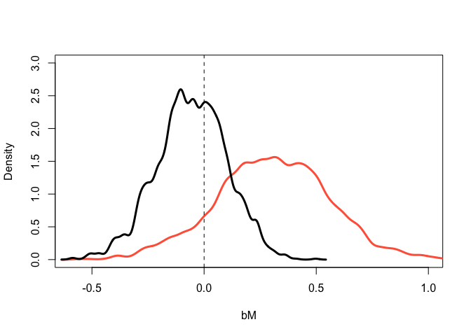
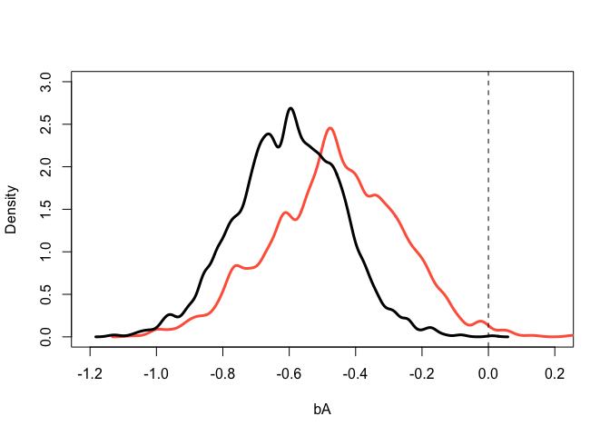

Lecture 17: Measurement Error
================
Yurun (Ellen) Ying
2022-07-05

## Generative model of measurement error

Recall the four elemental confounds. Measurements are an example of the
descendants.

The impact of measurement error is really unpredictable. To see this,
let’s use the simple example of parent-child income.

``` r
dag1 <- dagitty("dag{P[unobserved]; P_s <- P -> C -> e_P -> P_s}")
coordinates(dag1) <- list(x = c(P_s = 0.4, P = 0.5, C = 0.6, e_P = 0.4),
                          y = c(P_s = 0.2, P = 0, C = 0, e_P = 0.4))
drawdag(dag1)
```

<!-- -->

``` r
set.seed(378)
N <- 500
P <- rnorm(N)
# parent income doesn't impact children
C <- rnorm(N, 0*P) 
# recalled income is affected by both the true value and children's own income
P_s <- rnorm(N, 0.8*P + 0.2*C) 
dat_list <- list(P = P, C = C, P_s = P_s)

mCP <- ulam(
  alist(
    C ~ normal(mu, sigma),
    mu <- a + b*P_s,
    a ~ normal(0,1),
    b ~ normal(0,1),
    sigma ~ exponential(1)
  ), data = dat_list, chains = 4, cores = 4
)
```

``` r
postCP <- extract.samples(mCP)
dens(postCP$b, lwd = 3, col = "steelblue", 
     xlim = c(-0.1,0.3), xlab = "Estimated effect of P on C")
abline(v = 0, lty = 2)
```

<!-- -->

The estimation is biased upwards when the true effect is zero.

``` r
set.seed(378)
N <- 500
P <- rnorm(N)
# parent income doesn't impact children
C <- rnorm(N, 0.8*P) 
# recalled income is affected by both the true value and children's own income
P_s <- rnorm(N, 0.8*P + 0.2*C) 
dat_list <- list(P = P, C = C, P_s = P_s)

mCP <- ulam(
  alist(
    C ~ normal(mu, sigma),
    mu <- a + b*P_s,
    a ~ normal(0,1),
    b ~ normal(0,1),
    sigma ~ exponential(1)
  ), data = dat_list, chains = 4, cores = 4
)
```

``` r
postCP <- extract.samples(mCP)
dens(postCP$b, lwd = 3, col = "steelblue", 
     xlim = c(0.3,0.9), xlab = "Estimated effect of P on C")
abline(v = 0.8, lty = 2)
```

<!-- -->

The estimation is biased downwards when the true effect is high. The
point in this simulation is that the direction of measurement errors’
influence is really contingent on the size of the true effect. Can’t
just say definitively it lowers the estimation.

## Measurement error in continuous outcomes

We will go back to the divorce rate example and see how measurement
error can be modeled.

In this example, all the predictors and outcome are measured with
errors, which are related to population sizes of the states (more
popualted states can give more precise measurement than less populated
states in a given amount of time). We will have a DAG for this:

``` r
dag2 <- dagitty("dag{
                M[unobserved]; D[unobserved]; A[unobserved];
                e_M -> M_s <- M -> D -> D_s <- e_D; 
                M <- A -> D; A -> A_s <- e_A;
                P -> e_M; P -> e_D; P -> e_A}")
coordinates(dag2) <- list(x = c(A = 0.5, A_s = 0.55, e_A = 0.45,
                                M = 0.4, M_s = 0.3, e_M = 0.2, 
                                D = 0.6, D_s = 0.7, e_D = 0.8, P = 0.5),
                          y = c(A = 0.1, A_s = 0.2, e_A = 0.3,
                                M = 0, M_s = 0, e_M = 0.1, 
                                D = 0, D_s = 0, e_D = 0.1, P = 0.5))
drawdag(dag2)
```

<!-- -->

For simplicity, we first consider measurement error on D. Our model will
look like this in mathematical form:

 \\
\mu_i &= \alpha + \beta_M M_i + \beta_A A_i \\
D_i^* &\sim \mathrm{Normal}(D_i, S_i)
\end{aligned}")

The model for the measurement of D takes its true value as mean and the
error as standard deviation.

``` r
data(WaffleDivorce)
d <- WaffleDivorce

dat_list <- list(
  D_obs = standardize(d$Divorce),
  D_sd = d$Divorce.SE / sd(d$Divorce),
  M = standardize(d$Marriage),
  A = standardize(d$MedianAgeMarriage),
  N = nrow(d)
)

m15.1 <- ulam(
  alist(
    # model for D*
    D_obs ~ normal(D_true, D_sd),
    # model for D
    vector[N]:D_true ~ normal(mu, sigma),
    mu <- a + bA*A + bM*M,
    a ~ normal(0, 0.2),
    c(bA, bM) ~ normal(0, 0.5),
    sigma ~ exponential(1)
  ), data = dat_list, chains = 4, cores = 4
)
```

``` r
post <- extract.samples(m15.1)
D_t <- apply(post$D_true, 2, mean)
A_seq <- seq(-3, 3, len = 30)
D_sim <- link(m15.1, data = list(A = A_seq, M = rep(0,30)))
D_mu <- apply(D_sim, 2, mean)
D_PI <- apply(D_sim, 2, PI)

plot(NULL, xlim = range(dat_list$A), ylim = range(dat_list$D_obs),
     xlab = "Age at marriage (std)", ylab = "Divorce rate (std)")
lines(A_seq, D_mu)
shade(D_PI, A_seq)
points(dat_list$A, dat_list$D_obs, pch = 16, col = "tomato")
points(dat_list$A, D_t)
for (i in 1:length(D_t)) lines(rep(dat_list$A[i], 2), 
                                c(dat_list$D_obs[i], D_t[i]))
```

<!-- -->

The orange points are the observed values, and the hollow points are the
estimated true values. The estimated true values of D are pulled towards
the regression line due to partial pooling.

Now let’s also consider the measurement error on M.

 \\
\mu_i &= \alpha + \beta_M M_i + \beta_A A_i \\
D_i^* &\sim \mathrm{Normal}(D_i, S_i) \\
M_i &\sim \mathrm{Normal}(\nu_i, \tau_i) \\
\nu_i &= \alpha_M + \beta_{AM} A_i \\
M_i^* &\sim \mathrm{Normal}(M_i, T_i)
\end{aligned}")

``` r
dat_list2 <- list(
  D_obs = standardize(d$Divorce),
  D_sd = d$Divorce.SE / sd(d$Divorce),
  M_obs = standardize(d$Marriage),
  M_sd = d$Marriage.SE / sd(d$Marriage),
  A = standardize(d$MedianAgeMarriage),
  N = nrow(d)
)

m15.2 <- ulam(
  alist(
    # model for D*
    D_obs ~ normal(D_true, D_sd),
    # model for D
    vector[N]:D_true ~ normal(mu, sigma),
    mu <- a + bA*A + bM*M_true[i],
    # model for M*
    M_obs ~ normal(M_true, M_sd),
    # model for M
    vector[N]:M_true ~ normal(nu, tau),
    nu <- aM + bAM*A,
    # priors
    c(a,aM) ~ normal(0, 0.2),
    c(bA,bM,bAM) ~ normal(0, 0.5),
    c(sigma,tau) ~ exponential(1)
  ), data = dat_list2, chains = 4, cores = 4
)
```

``` r
post2 <- extract.samples(m15.2)
M_t <- apply(post2$M_true, 2, mean)
D_t <- apply(post2$D_true, 2, mean)

plot(NULL, xlim = range(dat_list2$M_obs), ylim = range(dat_list2$D_obs),
     xlab = "Marriage rate (std)", ylab = "Divorce rate (std)")
points(dat_list2$M_obs, dat_list2$D_obs, pch = 16, col = "tomato")
points(M_t, D_t)
for (i in 1:length(D_t)) lines(c(dat_list2$M_obs[i], M_t[i]), 
                              c(dat_list2$D_obs[i], D_t[i]))
```

<!-- -->

The orange points are the observed values, and the hollow points are the
estimated true values. The estimated true values of both M and D are
pulled towards the center due to partial pulling.

``` r
# fit a model ignoring errors
m15.2b <- ulam(
  alist(
    D_obs ~ normal(mu, sigma),
    mu <- a + bA*A + bM*M_obs,
    a ~ normal(0, 0.2),
    c(bA,bM) ~ normal(0, 0.5),
    sigma ~ exponential(1)
  ), data = dat_list2, chains = 4, cores = 4
)
```

``` r
post2b <- extract.samples(m15.2b)

# compare bM
plot(NULL, xlim = c(-0.6,1), ylim = c(0,3),
     xlab = "bM", ylab = "Density")
dens(post2$bM, lwd = 3, col = "tomato", add = TRUE)
dens(post2b$bM, lwd = 3, col = "black", add = TRUE)
abline(v = 0, lty = 2)
```

<!-- -->

``` r
# compare bA
plot(NULL, xlim = c(-1.2,0.2), ylim = c(0,3),
     xlab = "bA", ylab = "Density")
dens(post2$bA, lwd = 3, col = "tomato", add = TRUE)
dens(post2b$bA, lwd = 3, col = "black", add = TRUE)
abline(v = 0, lty = 2)
```

<!-- -->

Considering measurement errors increases the estimates of both bM and
bA. bM becomes largely positive, while bA is still negative but with a
higher estimated value.

## Measurement error in discrete outcomes

When there is measurement error in discrete outcomes it is called
misclassification. We will see an example of estimating the extradyadic
rate of birth with error in the genetic test we use to identify such
birth.

Our model looks like this:

![\begin{aligned}
X_i &\sim \mathrm{Bernoulli}(p_i) \\\\
\mathrm{logit}(p_i) &= \alpha + \mu\_{M\[i\]} + \delta\_{D\[i\]} \\\\
Pr(X^\* = 1 \mid p_i) &= p_i + (1 - p_i) f \\\\
Pr(X^\* = 0 \mid p_i) &= (1 - p_i)(1 - f) \\\\
\end{aligned}](https://latex.codecogs.com/png.image?%5Cdpi%7B110%7D&space;%5Cbg_white&space;%5Cbegin%7Baligned%7D%0AX_i%20%26%5Csim%20%5Cmathrm%7BBernoulli%7D%28p_i%29%20%5C%5C%0A%5Cmathrm%7Blogit%7D%28p_i%29%20%26%3D%20%5Calpha%20%2B%20%5Cmu_%7BM%5Bi%5D%7D%20%2B%20%5Cdelta_%7BD%5Bi%5D%7D%20%5C%5C%0APr%28X%5E%2A%20%3D%201%20%5Cmid%20p_i%29%20%26%3D%20p_i%20%2B%20%281%20-%20p_i%29%20f%20%5C%5C%0APr%28X%5E%2A%20%3D%200%20%5Cmid%20p_i%29%20%26%3D%20%281%20-%20p_i%29%281%20-%20f%29%20%5C%5C%0A%5Cend%7Baligned%7D "\begin{aligned}
X_i &\sim \mathrm{Bernoulli}(p_i) \\
\mathrm{logit}(p_i) &= \alpha + \mu_{M[i]} + \delta_{D[i]} \\
Pr(X^* = 1 \mid p_i) &= p_i + (1 - p_i) f \\
Pr(X^* = 0 \mid p_i) &= (1 - p_i)(1 - f) \\
\end{aligned}")

``` r
# the model - since we don't have the data I will comment them out
# note how the prob is written in a numerically stable way
# mX2 <- ulam(
#     alist(
#         #X|X==1 ~ custom( log( p + (1-p)*f ) ),
#         X|X==1 ~ custom( log_sum_exp( log(p) , log1m(p)+log(f) ) ),
#         #X|X==0 ~ custom( log( (1-p)*(1-f) ) ),
#         X|X==0 ~ custom( log1m(p) + log1m(f) ),
#         logit(p) <- a + z[mom_id]*sigma + x[dyad_id]*tau,
#         a ~ normal(0,1.5),
#         z[mom_id] ~ normal(0,1),
#         sigma ~ normal(0,1),
#         x[dyad_id] ~ normal(0,1),
#         tau ~ normal(0,1)
#     ) , data=dat , chains=4 , cores=4 , iter=4000 ,
#     constraints=list(sigma="lower=0",tau="lower=0") )


# double the numeric stability
# mX3 <- ulam(
#     alist(
#         #X|X==1 ~ custom( log( p + (1-p)*f ) ),
#         X|X==1 ~ custom( log_sum_exp( log_p , log1m_exp(log_p)+log(f) ) ),
# 
#         #X|X==0 ~ custom( log( (1-p)*(1-f) ) ),
#         X|X==0 ~ custom( log1m_exp(log_p) + log1m(f) ),
#         
#         log_p <- log_inv_logit( a + z[mom_id]*sigma + x[dyad_id]*tau ),
#         a ~ normal(0,1.5),
#         z[mom_id] ~ normal(0,1),
#         sigma ~ normal(0,1),
#         x[dyad_id] ~ normal(0,1),
#         tau ~ normal(0,1)
#     ) , data=dat , chains=4 , cores=4 , iter=4000 ,
#     constraints=list(sigma="lower=0",tau="lower=0") )
```
