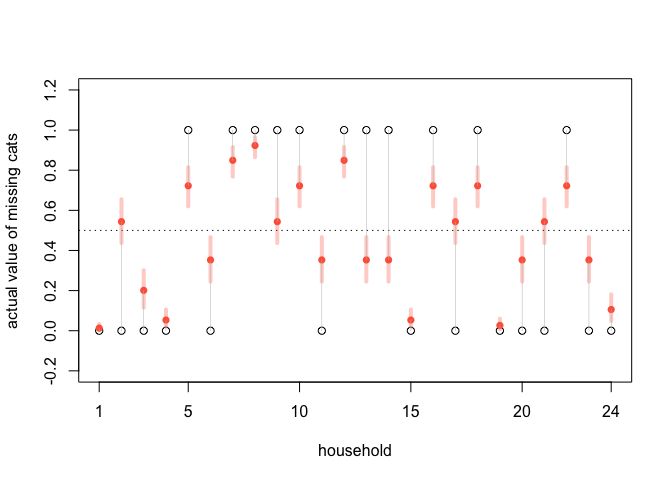

Lecture 18.5: Discrete Missing
================
Yurun (Ellen) Ying
2022-07-15

## Missing in discreate variables

Monte Carlo can’t sample from distribution of discrete variables. So we
need additional tricks to model discrete missing values using Bayesian
imputation.

Here is toy example. Suppose each house has a song bird and we have
collected information on how many notes the bird produce. Some houses
also have cats, and we would like to know whether the presence of cats
influence the number of notes. However, in 20% of household, we don’t
have the data of cat presence. Suppose the cats are missing at random.

Let’s build a generative model:

 \\
\mathrm{log}\lambda_i &\sim \alpha + \beta C_i \\
C_i &\sim \mathrm{Bernoulli}(k) \\
R_{C,i} &\sim \mathrm{Bernoulli}(r)
\end{aligned}")

``` r
# simulated the data
set.seed(9)
N <- 100L
alpha <- 5
beta <- -3
k <- 0.5 # prob of having cats
r <- 0.2 # prob of missing data
cat <- rbern(N, k)
notes <- rpois(N, alpha + beta*cat)
R_C <- rbern(N, r) # household missing cat data
cat_obs <- ifelse(R_C == 1, -9L, cat)
dat <- list(notes = notes, cat = cat_obs, RC = R_C, N = as.integer(N))
```

To model the presence of cats when the data is missing, we need to
calculate the probability of the number of notes averaged over the
probability distribution of cat presence:

 = \mathrm{P}(C_i = 1) \mathrm{P}(N_i \mid C_i = 1) + \mathrm{P}(C_i = 0) \mathrm{P}(N_i \mid C_i = 0)")

In code

``` r
m15.8 <- ulam(
  alist(
    # singing bird model
    ## cat known
    notes|RC==0 ~ poisson(lambda),
    log(lambda) <-  a + b*cat,
    ## cat missing
    notes|RC==1 ~ custom(
      log_sum_exp(log(k) + poisson_lpmf(notes | exp(a + b)),
                  log(1-k) + poisson_lpmf(notes | exp(a)))
      ),
      
    # priors
    a ~ normal(0, 1),
    b ~ normal(0, 0.5),
    
    # sneaking cat model
    cat|RC==0 ~ bernoulli(k),
    k ~ beta(2, 2),
    
    # imputed values
    gq> vector[N]:PrC1 <- exp(lpC1)/(exp(lpC1) + exp(lpC0)),
    gq> vector[N]:lpC1 <- log(k) + poisson_lpmf(notes[i] | exp(a + b)),
    gq> vector[N]:lpC0 <- log(1-k) + poisson_lpmf(notes[i] | exp(a))
    ) , data = dat, chains = 4, cores = 4
  )
```

``` r
precis(m15.8)
```

    ##         mean         sd       5.5%      94.5%    n_eff     Rhat4
    ## a  1.6051814 0.06405538  1.5013651  1.7051649 1220.424 0.9996137
    ## b -0.7990349 0.12047836 -0.9878528 -0.6000111 1299.631 1.0008158
    ## k  0.4599837 0.05457261  0.3726813  0.5451137 1496.457 1.0020430

We can check this against the original data

``` r
post <- extract.samples(m15.8)
c_imp_mu <- apply(post$PrC1, 2, mean)
c_imp_PI <- apply(post$PrC1, 2, PI)
c_imp_mu_miss <- c_imp_mu[R_C == 1]
c_imp_PI_miss <- c_imp_PI[,R_C == 1]


# empirical data
n_miss <- sum(R_C)
cat_miss <- cat[R_C == 1]
plot(1:n_miss, cat_miss, xlim = c(1,n_miss), ylim = c(-0.2, 1.2),
     xlab = "household", ylab = "actual value of missing cats", xaxt = "n")
abline(h = 0.5, lty = 3)
axis(1, at = c(1, 5, 10, 15, 20, 24), labels = c(1, 5, 10, 15, 20, 24))
points(1:n_miss, c_imp_mu_miss, pch = 16, col = "tomato")
for (i in 1:n_miss) {
  lines(c(i,i), c(c_imp_PI_miss[1,i], c_imp_PI_miss[2,i]), 
                          lwd = 4, col = col.alpha("tomato", 0.3))
  lines(c(i,i), c(c_imp_mu_miss[i], cat_miss[i]), lwd = .5, col = "gray")
}
```

<!-- -->

This method can also be used to model discrete distributions of more
than three events.
