Lecture 18: Missing Data
================
Yurun (Ellen) Ying
2022-07-08

## Types of missing data

There are different types of missing data. Data is missing due to
different causes. We will use an example of dogs eating homework to
illustrate this point.

### Dog eats homework at random

``` r
dag1 <- dagitty("dag{H[unobserved]; S -> H -> H_s <- D}")
coordinates(dag1) <- list(x = c(S = 0.4, H = 0.6, H_s = 0.6, D = 0.4),
                          y = c(S = 0.4, H = 0.4, H_s = 0.6, D = 0.6))
drawdag(dag1)
```

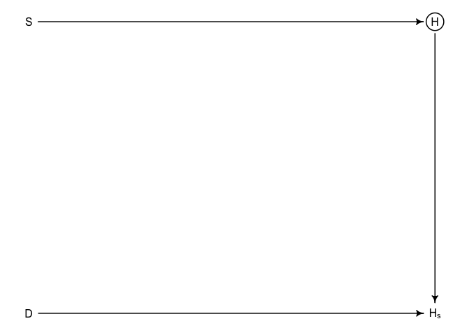<!-- -->

A generative model

``` r
# missing values are missing at random
set.seed(297)
N <- 500
S <- rnorm(N)
H <- rnorm(N, 0.5*S)
D <- rbern(N)
H_s <- ifelse(D == 1, NA, H)

g1_total <- quap(
  alist(
    H ~ dnorm(mu, sigma),
    mu <- a + b*S,
    c(a,b) ~ dnorm(0,1),
    sigma ~ dexp(1)
  ), data = list(H = H, S = S)
)
post_g1_total <- extract.samples(g1_total)

g1_missing <- quap(
  alist(
    H ~ dnorm(mu, sigma),
    mu <- a + b*S,
    c(a,b) ~ dnorm(0,1),
    sigma ~ dexp(1)
  ), data = data.frame(H = H_s, S = S)[complete.cases(H_s),]
)
post_g1_missing <- extract.samples(g1_missing)

plot(S, H, col = "steelblue", lwd = 2)
points(S, H_s, col = "tomato", lwd = 3)
abline(a = mean(post_g1_total$a), b = mean(post_g1_total$b), 
       col = "steelblue", lwd = 3)
abline(a = mean(post_g1_missing$a), b = mean(post_g1_missing$b), 
       col = "tomato", lwd = 3)
text(-3, 3.5, "total sample", col = "steelblue", pos = 1)
text(-3, 3, "incomplete sample", col = "tomato", pos = 1)
```

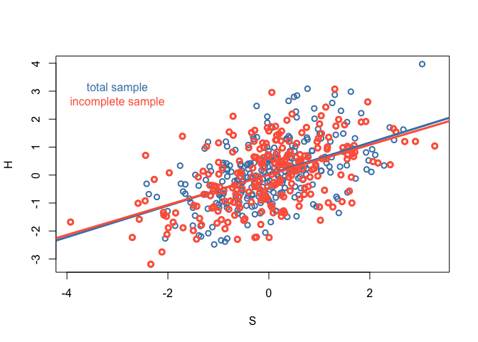<!-- -->

When missing is at random, it is justified to drop cases with missing
values because this will not influence the statistical inference,
although we may lose precision.

### Dog eats condiitonal on the cause of homework

This happens when the causes of interest also influence the missingness
of the data.

``` r
dag2 <- dagitty("dag{H[unobserved]; S -> H -> H_s <- D <- S}")
coordinates(dag2) <- list(x = c(S = 0.4, H = 0.6, H_s = 0.6, D = 0.4),
                          y = c(S = 0.4, H = 0.4, H_s = 0.6, D = 0.6))
drawdag(dag2)
```

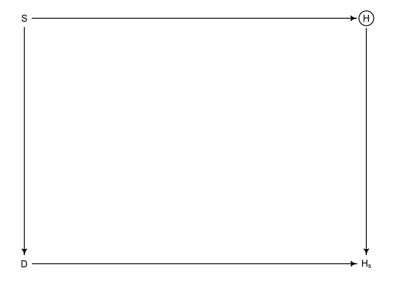<!-- -->

``` r
# missing data is caused by the cause of interest
set.seed(297)
N <- 500
S <- rnorm(N)
H <- rnorm(N, 0.5*S)
# dog eats homework 80% of time when S > 0
D <- rbern(N, ifelse(S > 0, 0.8, 0))
H_s <- ifelse(D == 1, NA, H)

g2.1_total <- quap(
  alist(
    H ~ dnorm(mu, sigma),
    mu <- a + b*S,
    c(a,b) ~ dnorm(0,1),
    sigma ~ dexp(1)
  ), data = list(H = H, S = S)
)
post_g2.1_total <- extract.samples(g2.1_total)

g2.1_missing <- quap(
  alist(
    H ~ dnorm(mu, sigma),
    mu <- a + b*S,
    c(a,b) ~ dnorm(0,1),
    sigma ~ dexp(1)
  ), data = data.frame(H = H_s, S = S)[complete.cases(H_s),]
)
post_g2.1_missing <- extract.samples(g2.1_missing)

plot(S, H, col = "steelblue", lwd = 2)
points(S, H_s, col = "tomato", lwd = 3)
abline(a = mean(post_g2.1_total$a), b = mean(post_g2.1_total$b), 
       col = "steelblue", lwd = 3)
abline(a = mean(post_g2.1_missing$a), b = mean(post_g2.1_missing$b), 
       col = "tomato", lwd = 3)
text(-3, 3.5, "total sample", col = "steelblue", pos = 1)
text(-3, 3, "incomplete sample", col = "tomato", pos = 1)
```

<!-- -->

This is no qualitative difference between using the total sample and the
incomplete sample. But this is only true when the relation between the
exposure and outcome is linear.

Here is an exmaple of non-linear relaitonship.

``` r
# missing data is caused by the cause of interest
# non-linear relation between S and H
set.seed(298)
N <- 500
S <- rnorm(N)
H <- rnorm(N, (1-exp(-0.7*S)))
# dog eats homework when S > 0
D <- rbern(N, ifelse(S > 0, 1, 0))
H_s <- ifelse(D == 1, NA, H)

g2.2_total <- quap(
  alist(
    H ~ dnorm(mu, sigma),
    mu <- a + b*S,
    c(a,b) ~ dnorm(0,1),
    sigma ~ dexp(1)
  ), data = list(H = H, S = S)
)
post_g2.2_total <- extract.samples(g2.2_total)

g2.2_missing <- quap(
  alist(
    H ~ dnorm(mu, sigma),
    mu <- a + b*S,
    c(a,b) ~ dnorm(0,1),
    sigma ~ dexp(1)
  ), data = data.frame(H = H_s, S = S)[complete.cases(H_s),]
)
post_g2.2_missing <- extract.samples(g2.2_missing)

plot(S, H, col = "steelblue", lwd = 2)
points(S, H_s, col = "tomato", lwd = 3)
abline(a = mean(post_g2.2_total$a), b = mean(post_g2.2_total$b), 
       col = "steelblue", lwd = 3)
abline(a = mean(post_g2.2_missing$a), b = mean(post_g2.2_missing$b), 
       col = "tomato", lwd = 3)
text(-2, 3.5, "total sample", col = "steelblue", pos = 1)
text(-2, 3, "incomplete sample", col = "tomato", pos = 1)
```

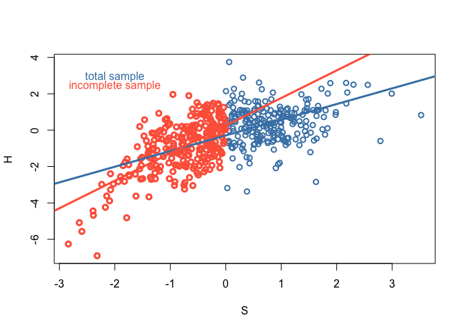<!-- -->

Now dropping cases with missing values will lead to wrong inference.

### Dog eats condiitonal on homework itself

Things are most disastrous when the outcome itself influences
missingness, as shown in this DAG

``` r
dag3 <- dagitty("dag{H[unobserved]; S -> H -> H_s <- D <- H}")
coordinates(dag3) <- list(x = c(S = 0.4, H = 0.6, H_s = 0.6, D = 0.4),
                          y = c(S = 0.4, H = 0.4, H_s = 0.6, D = 0.6))
drawdag(dag3)
```

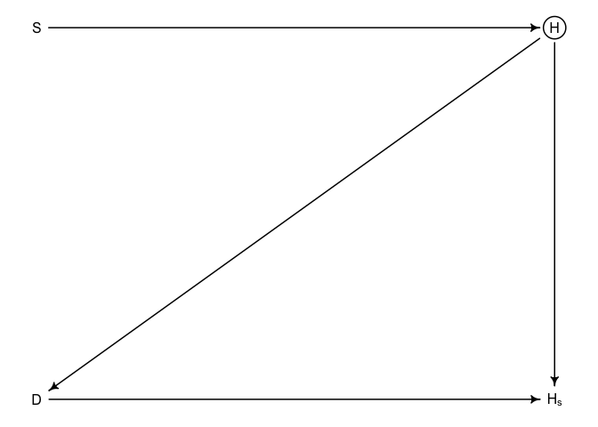<!-- -->

A generative model

``` r
# missing data is caused by the outcome
set.seed(297)
N <- 500
S <- rnorm(N)
H <- rnorm(N, 0.5*S)
# dog eats homework 90% of time when H < 0
D <- rbern(N, ifelse(H < 0, 0.9, 0))
H_s <- ifelse(D == 1, NA, H)

g3_total <- quap(
  alist(
    H ~ dnorm(mu, sigma),
    mu <- a + b*S,
    c(a,b) ~ dnorm(0,1),
    sigma ~ dexp(1)
  ), data = list(H = H, S = S)
)
post_g3_total <- extract.samples(g3_total)

g3_missing <- quap(
  alist(
    H ~ dnorm(mu, sigma),
    mu <- a + b*S,
    c(a,b) ~ dnorm(0,1),
    sigma ~ dexp(1)
  ), data = data.frame(H = H_s, S = S)[complete.cases(H_s),]
)
post_g3_missing <- extract.samples(g3_missing)

plot(S, H, col = "steelblue", lwd = 2)
points(S, H_s, col = "tomato", lwd = 3)
abline(a = mean(post_g3_total$a), b = mean(post_g3_total$b), 
       col = "steelblue", lwd = 3)
abline(a = mean(post_g3_missing$a), b = mean(post_g3_missing$b), 
       col = "tomato", lwd = 3)
text(-3, 3.5, "total sample", col = "steelblue", pos = 1)
text(-3, 3, "incomplete sample", col = "tomato", pos = 1)
```

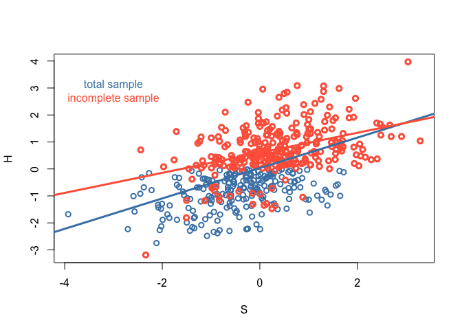<!-- -->

Now dropping cases can also cause problems.

## Deal with missing through imputation

We will working on the full samples of primate brain size example step
by step based on this DAG.

``` r
dag4 <- dagitty("dag{u[unobserved]; G[unobserved]; B[unobserved]; M[unobserved];
                G -> B; G <- M -> B; h -> u; u -> G; u -> M; u -> B;
                G -> G_s <- m_G;
                B -> B_s <- m_B;
                M -> M_s <- m_M}")
coordinates(dag4) <- list(x = c(G = 0.4, B = 0.6, M = 0.5, 
                                G_s = 0.3, B_s = 0.7, M_s = 0.6,
                                m_G = 0.3, m_B = 0.7, m_M = 0.6,
                                u = 0.5, h = 0.53),
                          y = c(G = 0.4, B = 0.4, M = 0.6, 
                                G_s = 0.4, B_s = 0.4, M_s = 0.6,
                                m_G = 0.5, m_B = 0.5, m_M = 0.5,
                                u = 0.5, h = 0.5))
drawdag(dag4)
```

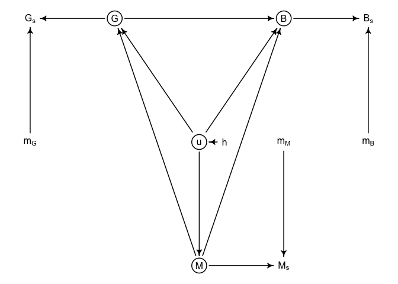<!-- -->

### Ignoring cases with missing B

``` r
data("Primates301")
d <- Primates301
d$name <- as.character(d$name)
data("Primates301_nex")

# complete case analysis
dstan <- d[complete.cases(d$group_size,d$body,d$brain),]
dat_cc <- list(
    N_spp = nrow(dstan),
    M = standardize(log(dstan$body)),
    B = standardize(log(dstan$brain)),
    G = standardize(log(dstan$group_size)),
    Imat = diag(nrow(dstan))
    )

# cases with brain observation
dd <- d[complete.cases(d$brain),]
dat_all <- list(
    N_spp = nrow(dd),
    M = standardize(log(dd$body)),
    B = standardize(log(dd$brain)),
    G = standardize(log(dd$group_size)), 
    Imat = diag(nrow(dd))
    )

# scaled and reordered distance matrix
spp_obs <- dd$name
tree_trimmed <- keep.tip(Primates301_nex, spp_obs)
Dmat <- cophenetic(tree_trimmed)
dat_all$Dmat <- Dmat[spp_obs, spp_obs]/max(Dmat)

spp_obs_cc <- dstan$name
tree_trimmed_cc <- keep.tip(Primates301_nex, spp_obs_cc)
Dmat_cc <- cophenetic(tree_trimmed_cc)
dat_cc$Dmat <- Dmat_cc[spp_obs_cc, spp_obs_cc]/max(Dmat_cc)
```

``` r
# complete cases
# mMBG_cc <- ulam(
#   alist(
#     B ~ multi_normal(mu, K),
#     mu <- a + bM*M + bG*G,
#     matrix[N_spp,N_spp]:K <- cov_GPL1(Dmat, etasq, rho, 0.01),
#     a ~ normal(0, 1),
#     c(bG,bM) ~ normal(0, 0.5),
#     etasq ~ half_normal(1, 0.25),
#     rho ~ half_normal(3, 0.25)
#   ), data = dat_cc, chains = 4, cores = 4
# )

load("lecture18_mMBG_cc.RData")
```

### Impute G and M ignoring their models

This is the model we use last time:

 \\
\mu_i &= \alpha + \beta_G G_i + \beta_M M_i\\
\mathbf{K} &= \eta^2 \mathrm{exp}(-\rho d_{i,j}) \\
\alpha &\sim \mathrm{Normal}(0,1)\\
\beta_G, \beta_M &\sim \mathrm{Normal}(0, 0.5) \\
\eta^2 &\sim \mathrm{HalfNormal}(1, 0.25) \\
\rho &\sim \mathrm{HalfNormal}(3, 0.25)
\end{aligned}")

We will impute G and M without specifying the model generating them:

\\
M_i &\sim \mathrm{Normal}(0,1)
\end{aligned}")

``` r
fMBG_OU <- alist(
  B ~ multi_normal(mu, K),
  mu <- a + bG*G + bM*M,
  matrix[N_spp,N_spp]:K <- cov_GPL1(Dmat, etasq, rho, 0.01),
  G ~ normal(0, 1),
  M ~ normal(0, 1),
  a ~ normal(0, 1),
  c(bG,bM) ~ normal(0, 0.5),
  etasq ~ half_normal(1, 0.25),
  rho ~ half_normal(3, 0.25)
)

#mMBG_OU <- ulam(fMBG_OU, data = dat_all, chains= 4, cores = 4)
load("lecture18_MBG_OU.RData")
```

``` r
postMGB <- extract.samples(mMBG_OU)
M_mu <- apply(postMGB$M_impute, 2, mean)
M_PI <- apply(postMGB$M_impute, 2, PI)
B_miss <- dat_all$B[which(is.na(dat_all$M))]

plot(dat_all$M, dat_all$B, lwd = 2, col = col.alpha("black", 0.3),
     xlab = "Body mass (std)", ylab = "Brain size (std)")
points(M_mu, B_miss, lwd = 3, col = "tomato")
for(i in 1:length(M_mu)) lines(c(M_PI[1,i], M_PI[2,i]), rep(B_miss[i], 2),
                             lwd = 5, col = col.alpha("tomato", 0.7))
```

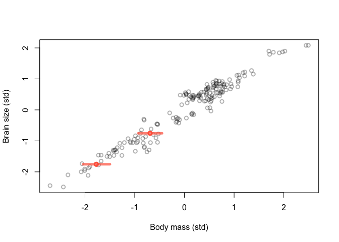<!-- -->

We can see there is a strong association between body mass and brain
size, and the imputed values of M follows these trends.

``` r
G_mu <- apply(postMGB$G_impute, 2, mean)
G_PI <- apply(postMGB$G_impute, 2, PI)
M_miss <- dat_all$M[which(is.na(dat_all$G))]

plot(dat_all$M, dat_all$G, lwd = 2, col = col.alpha("black", 0.5),
     xlab = "Body mass (std)", ylab = "Group size (std)")
points(M_miss, G_mu, lwd = 3, col = "tomato")
for(i in 1:length(G_mu)) lines(rep(M_miss[i], 2), c(G_PI[1,i], G_PI[2,i]), 
                             lwd = 5, col = col.alpha("tomato", 0.2))
```

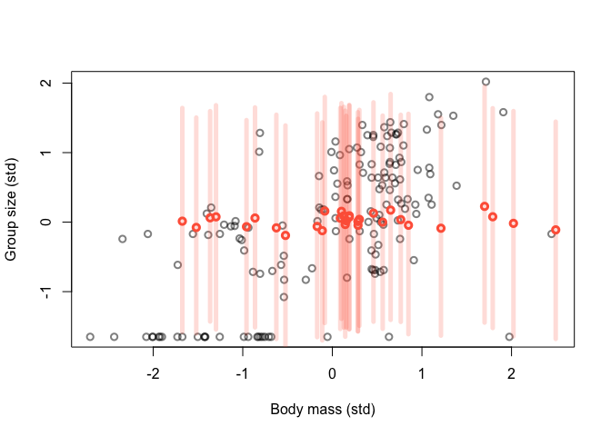<!-- -->

Body mass and group size has a strong association in the sample, but
since we did model it, the imputed values don’t follow the trend in the
sample. There is also a lot of uncertainty surrounding these imputed
values.

``` r
postMGB_cc <- extract.samples(mMBG_cc)

dens(postMGB_cc$bG, xlim = c(-0.05, 0.15), ylim = c(0, 25), 
     xlab = "Effct of G on B", lwd = 3, col = "steelblue")
dens(postMGB$bG, col = "tomato", lwd = 3, add = TRUE)
abline(v = 0, lty = 2)
text(0.09, 15, "complete cases", col = "steelblue")
text(-0.025, 15, "imputed M & G", col = "tomato")
```

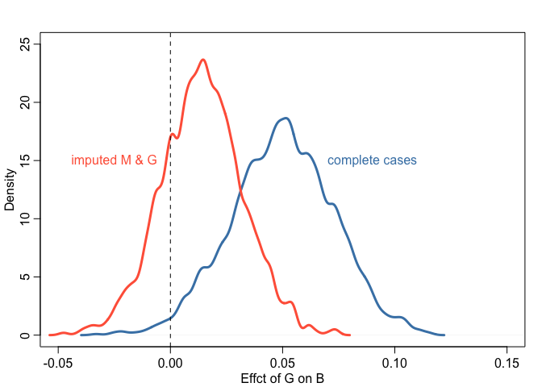<!-- -->

The estimated effect is shifted downwards. This is probably incorrect
since the impuated cases don’t seem to follow the trend in the data.

### Impute G using model

We will now impute G with its causal model:

 \\
\nu_i &= \alpha_G + \beta_{MG} M_i\\
\mathbf{K}_G &= \eta_G^2 \mathrm{exp}(-\rho_G d_{i,j}) \\
\alpha_G &\sim \mathrm{Normal}(0,1)\\
\beta_{MG} &\sim \mathrm{Normal}(0, 0.5) \\
\eta_G^2 &\sim \mathrm{HalfNormal}(1, 0.25) \\
\rho_G &\sim \mathrm{HalfNormal}(3, 0.25)
\end{aligned}")

We will do separately: first see how a linear-relation-only model will
imply about the imputed G, then how a phylogeny-only model will do.

``` r
# model M -> G only without phylogeny
# mMBG_OU_G <- ulam(
#   alist(
#     B ~ multi_normal(mu, K),
#     mu <- a + bG*G + bM*M,
#     matrix[N_spp,N_spp]:K <- cov_GPL1(Dmat, etasq, rho, 0.01),
#     G ~ normal(nu, sigma),
#     nu <- aG + bMG*M,
#     M ~ normal(0, 1),
#     c(a,aG) ~ normal(0, 1),
#     c(bG,bM,bMG) ~ normal(0, 0.5),
#     etasq ~ half_normal(1, 0.25),
#     rho ~ half_normal(3, 0.25),
#     sigma ~ exponential(1)
#   ), data = dat_all, chains = 4, cores = 4
# )

load("lecture18_mMBG_OU_G.RData")

# model phylogeny only without M -> G
# mMBG_OU2 <- ulam(
#   alist(
#     B ~ multi_normal(mu, K),
#     mu <- a + bG*G + bM*M,
#     matrix[N_spp,N_spp]:K <- cov_GPL1(Dmat, etasq, rho, 0.01),
#     G ~ multi_normal('rep_vector(0, N_spp)', KG),
#     matrix[N_spp,N_spp]:KG <- cov_GPL1(Dmat, etasqG, rhoG, 0.01),
#     M ~ normal(0, 1),
#     a ~ normal(0, 1),
#     c(bG,bM) ~ normal(0, 0.5),
#     c(etasq,etasqG) ~ half_normal(1, 0.25),
#     c(rho,rhoG) ~ half_normal(3, 0.25)
#   ), data = dat_all, chains = 4, cores = 4
# )

load("lecture18_mMBG_OU2.RData")
```

``` r
# M -> G
postMGB_G <- extract.samples(mMBG_OU_G)
GG_mu <- apply(postMGB_G$G_impute, 2, mean)
GG_PI <- apply(postMGB_G$G_impute, 2, PI)

# M -> G
postMGB2 <- extract.samples(mMBG_OU2)
G2_mu <- apply(postMGB2$G_impute, 2, mean)
G2_PI <- apply(postMGB2$G_impute, 2, PI)

plot(dat_all$M, dat_all$G, lwd = 2, col = col.alpha("black", 0.3),
     ylim = c(-2,3), xlab = "Body mass (std)", ylab = "Group size (std)")
points(M_miss, GG_mu, lwd = 3, col = "tomato")
# for(i in 1:length(G_mu)) lines(rep(M_miss[i], 2), c(GG_PI[1,i], GG_PI[2,i]), 
#                              lwd = 5, col = col.alpha("tomato", 0.2))
points(M_miss, G2_mu, lwd = 3, col = "seagreen")
for(i in 1:length(G_mu)) lines(rep(M_miss[i], 2), c(G2_PI[1,i], G2_PI[2,i]), 
                             lwd = 5, col = col.alpha("seagreen", 0.2))
```

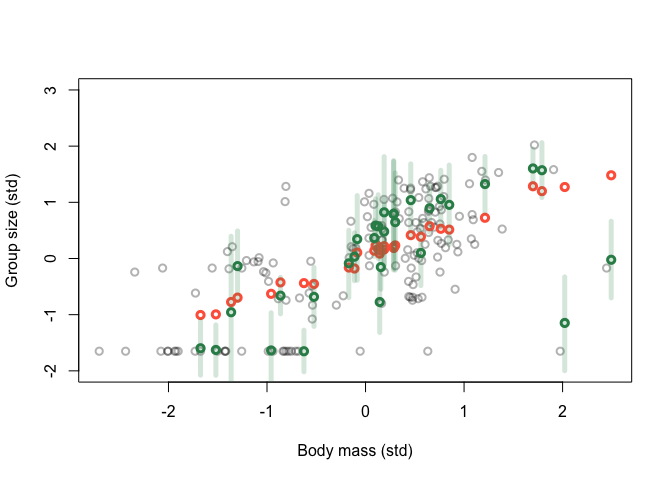<!-- -->

Both the linear and the phylogenetic models think body mass and group
size are related.

``` r
# include both linear and phylogenetic relations
# mMBG_OU_G2 <- ulam(
#   alist(
#     B ~ multi_normal(mu, K),
#     mu <- a + bG*G + bM*M,
#     matrix[N_spp,N_spp]:K <- cov_GPL1(Dmat, etasq, rho, 0.01),
#     G ~ multi_normal(nu, KG),
#     nu <- aG + bMG*M,
#     matrix[N_spp,N_spp]:KG <- cov_GPL1(Dmat, etasqG, rhoG, 0.01),
#     M ~ normal(0, 1),
#     c(a,aG) ~ normal(0, 1),
#     c(bG,bM,bMG) ~ normal(0, 0.5),
#     c(etasq,etasqG) ~ half_normal(1, 0.25),
#     c(rho,rhoG) ~ half_normal(3, 0.25)
#   ), data = dat_all, chains = 4, cores = 4
# )

load("lecture18_mMBG_OU_G2.RData")
```

``` r
# phylogeny + M -> G
postMGB_G2 <- extract.samples(mMBG_OU_G2)
GG2_mu <- apply(postMGB_G2$G_impute, 2, mean)
GG2_PI <- apply(postMGB_G2$G_impute, 2, PI)

plot(dat_all$M, dat_all$G, lwd = 2, col = col.alpha("black", 0.3),
     ylim = c(-2,3), xlab = "Body mass (std)", ylab = "Group size (std)")
points(M_miss, GG_mu, lwd = 3, col = "tomato")
points(M_miss, G2_mu, lwd = 3, col = "seagreen")
points(M_miss, GG2_mu, lwd = 3, col = "violet")
text(-2, 2.5, "M -> G", col = "tomato")
text(-2, 2.1, "pgylogeny -> G", col = "seagreen")
text(-2, 1.7, "pgylogeny + M -> G", col = "violet")
```

<!-- -->

The combined model gives imputed values closer to the phylogeny model.
This is because the phylogenetic relation is strong in the data.

``` r
# the effect of G on B
dens(postMGB_G$bG, xlim = c(-0.05, 0.15), ylim = c(0, 25), 
     xlab = "Effct of G on B", lwd = 3, col = "tomato")
dens(postMGB2$bG, col = "seagreen", lwd = 3, add = TRUE)
dens(postMGB_G2$bG, col = "violet", lwd = 3, add = TRUE)
abline(v = 0, lty = 2)
text(0.125, 23, "M -> G", col = "tomato")
text(0.125, 21.5, "pgylogeny -> G", col = "seagreen")
text(0.125, 20, "pgylogeny + M -> G", col = "violet")
```

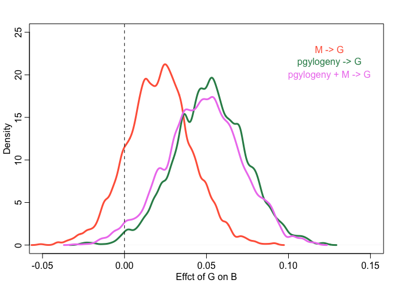<!-- -->

### Impuate G, M, and B using model

Now we will add the model of M and include cases with missing B as well.
Here is the model for M:

 \\
\mathbf{K}_M &= \eta_M^2 \mathrm{exp}(-\rho_M d_{i,j}) \\
\eta_M^2 &\sim \mathrm{HalfNormal}(1, 0.25) \\
\rho_M &\sim \mathrm{HalfNormal}(3, 0.25)
\end{aligned}")

``` r
fna <- function(x) ifelse( is.na(x) , -99 , x )
dat_voll <- list(
    N_spp = nrow(d),
    M = fna( standardize(log(d$body)) ),
    B = fna( standardize(log(d$brain)) ),
    G = fna( standardize(log(d$group_size)) ),
    N_B_miss = sum(is.na(d$brain)) ,
    N_G_miss = sum(is.na(d$group_size)) ,
    N_M_miss = sum(is.na(d$body)) ,
    B_missidx = which( is.na(d$brain) ),
    G_missidx = which( is.na(d$group_size) ),
    M_missidx = which( is.na(d$body) )
)

spp_all <- as.character(d$name)
tree_voll <- keep.tip( Primates301_nex, spp_all )
Dmat <- cophenetic( tree_voll )
dat_voll$Dmat <- Dmat[ spp_all , spp_all ] / max(Dmat)
```

We will write the model as stan code:

``` r
# comment out to save knitting time
# this model runs for over 100 minutes :)
# mvoll <- cstan(file = "lecture18_BMG_OU.stan", data = dat_voll, chains = 4, cores = 4)

# load the model
load("lecture18_BMG_OU.RData")
```

Let’s see how our full luxury model is doing

``` r
post_full <- extract.samples(mvoll)

# effect of G on B
dens(postMGB_cc$bG, lwd = 2, xlab = "effect of G on B")
dens(post_full$bG, lwd = 3, col = "tomato", add = TRUE)
abline(v = 0, lty = 2)
```

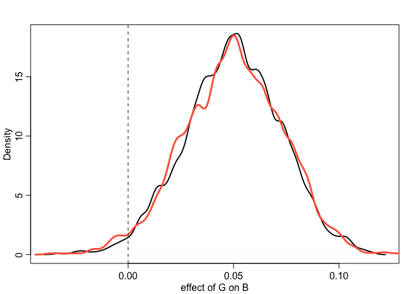<!-- -->

``` r
# effect of M on B
dens(postMGB_cc$bM, lwd = 2, xlab = "effect of M on B")
dens(post_full$bM, lwd = 3, col = "tomato", add = TRUE)
```

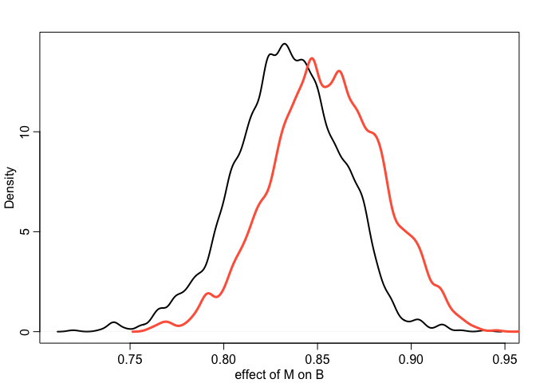<!-- -->
