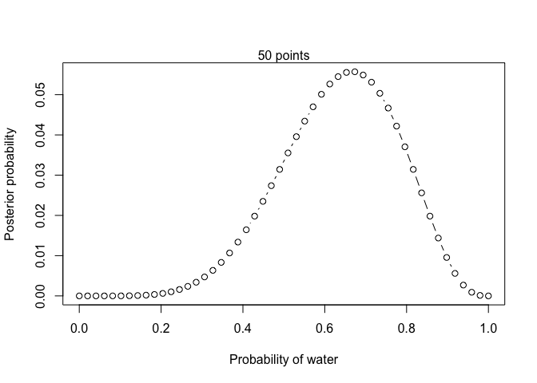
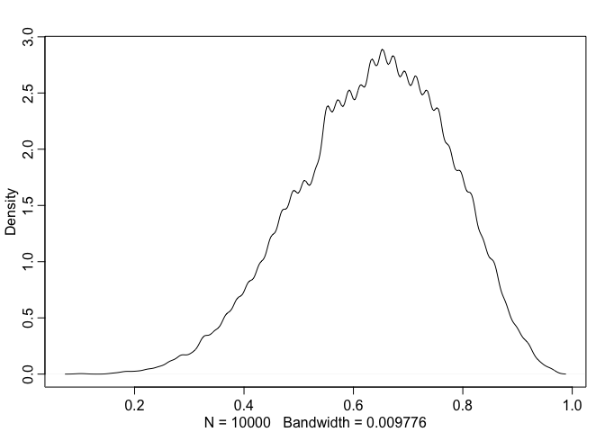
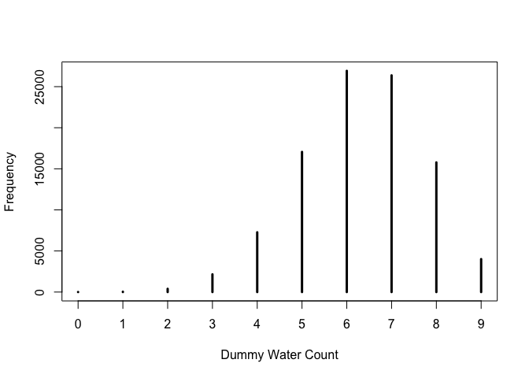
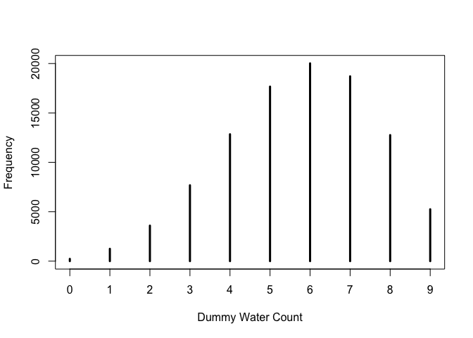

Lecture 2: Bayesian Inference
================

## Example of globe tossing

A very simple example to fit a statistical model into data.

``` r
# define grid
n_grid <- 50
p_grid <- seq(0, 1, length.out = n_grid)

# define prior
prior <- rep(1, n_grid)

# more options of prior
# prior <- ifelse(p_grid < 0.5, 0, 1)
# prior <- exp(-5 * abs(p_grid - 0.5))

# compute likelihood at each value in grid
likelihood <- dbinom(6, size = 9, prob = p_grid)

# updating: compute the product of prior and likelihood
unstd.posteior <- prior*likelihood

# standardize the likelihood, so it sums to 1
posterior <- unstd.posteior/sum(unstd.posteior)

# plot
plot(p_grid, posterior, type = "b", 
     xlab = "Probability of water", ylab = "Posterior probability")
mtext(paste(n_grid, "points"))
```

<!-- -->

## Posterior predictive simulation

We draw samples of parameter(s) from the posterior distribution.

``` r
# take a sample of a size of 10000 from the posterior distribution
sample_size <- 10^4
set.seed(19990331)
samples <- sample(p_grid, size = sample_size, replace = TRUE, prob = posterior)

# the density plot of the distribution of the sample
# note that this is not very different from the posterior distribution
library(rethinking)
dens(samples)
```

<!-- -->

### Use the sample to summarize

Summarize the posterior distribution with the samples.

``` r
# find the frequency of parameter below .5
sum(samples < 0.5) / sample_size
```

    ## [1] 0.1737

``` r
# the frequency of parameter between .5 and .75
sum(samples > 0.5 & samples < .75) / sample_size
```

    ## [1] 0.5967

``` r
# compatibility intervals
quantile(samples, prob = 0.8)
```

    ##      80% 
    ## 0.755102

``` r
quantile(samples, prob = c(0.1, 0.9))
```

    ##       10%       90% 
    ## 0.4489796 0.8163265

``` r
# percentile interval (PI)
PI(samples, prob = 0.5)
```

    ##       25%       75% 
    ## 0.5510204 0.7346939

``` r
# highest posterior density interval (HPDI)
HPDI(samples, prob = 0.5)
```

    ##      |0.5      0.5| 
    ## 0.5306122 0.7142857

``` r
# maximum a posteriori (mode)
chainmode(samples, adj = 0.1)
```

    ## [1] 0.6521866

``` r
# use the loss function to determine which point to report
# a simple loss function - loss is proportional to the distance from a point
# generate a vector of the expected loss at each grid point
loss <- sapply(p_grid, function(d) sum(posterior * abs(d - p_grid)))

# find the point with the least loss
p_grid[which.min(loss)]
```

    ## [1] 0.6530612

### Use the sample to simulate

In addition to having samples of parameter(s), we can also generate
simulated observations using samples of parameter(s).

``` r
# we can generate observations of globe tossing at the p value of 0.7
sample_size <- 10^5
dummy_w <- rbinom(sample_size, size = 9, prob = 0.7)
# a histogram
simplehist(dummy_w, xlab = "Dummy Water Count")
```

<!-- -->

``` r
# we add uncertainty from the parameter value and get 
# a posterior predictive distribution
w <- rbinom(sample_size, size = 9, prob = samples)
simplehist(w, xlab = "Dummy Water Count")
```

<!-- -->
