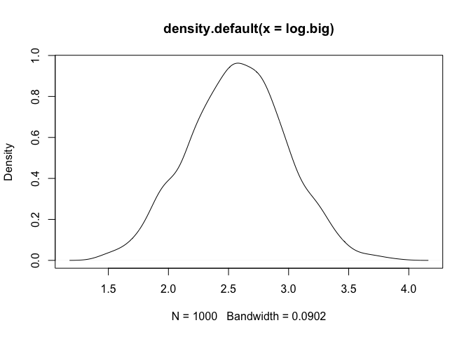
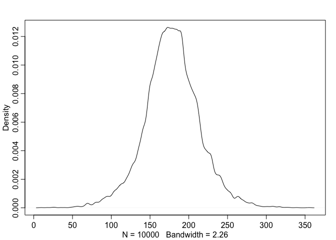
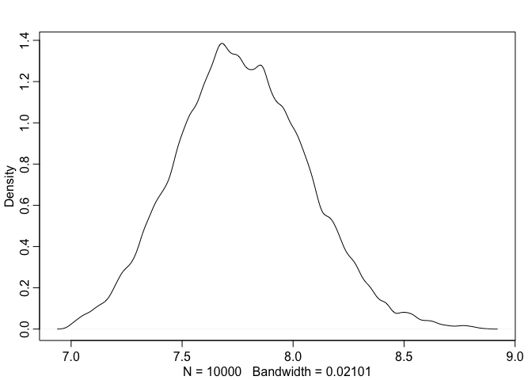
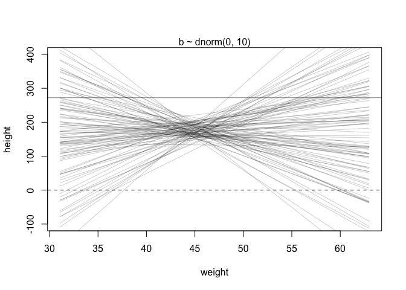

Lecture 3: Geocentric Models
================

## Examples of normal distribution

Normal by addition: any process that adds value from the same
distribution converges to a normal distribution,

``` r
pos <- replicate(1000, sum(runif(16, -1, 1)))
plot(density(pos))
```

<!-- -->

Normal by multiplication: multiplication of small values converges to
normal.

``` r
pos.small <- replicate(1000, prod(1 + runif(12, 0, 0.01)))
plot(density(pos.small))
```

<!-- -->

``` r
# doesn't work for big value
pos.big <- replicate(1000, prod(1 + runif(12, 0, 0.5)))
plot(density(pos.big))
```

<!-- -->

``` r
# but still works when we take the log of the product
# since it's the same as add them together
log.big <- replicate(1000, log(prod(1 + runif(12, 0, 0.5))))
plot(density(log.big))
```

<!-- -->

## Build a Gaussian model for height

Build a linear model of height, the following is our prior:

-   h \~ normal(mu, sigma)
-   mu \~ normal(178, 20)
-   sigma \~ uniform(0, 50)

``` r
# read in data
library(rethinking)
data("Howell1")
d <- Howell1
d2 <- d[d$age >= 18, ]
```

Use the model to do prior predicative simulation to see whether the
assumptions make sense.

``` r
n <- 1e4
sample_mu <- rnorm(n, mean = 178, sd = 20)
sample_sigma <- runif(n, min = 0, max = 50)
prior_h <- rnorm(n, mean = sample_mu, sd = sample_sigma)
dens(prior_h)
```

<!-- -->

Fit the model using grid approximation.

``` r
# set the grid and get a list of all combinations of the two parameters
mu.list <- seq(150, 160, length.out = 100)
sigma.list <- seq(7, 9, length.out = 100)
post <- expand.grid(mu = mu.list, sigma = sigma.list)

# a vector of log likelihood of each parameter combinations producing the data
# the prob of each height value are added together because
#   1. assuming each height is independent of each other
#   2. we are taking the log value of the probability
post$LL <- 
  sapply(
    1:nrow(post), 
    function(i) sum(dnorm(d2$height, post$mu[i], post$sigma[i], log = TRUE))
    )

# counting the uncertainty of the parameters
post$prod <- 
  post$LL + 
  dnorm(post$mu, 178, 20, log = TRUE) + 
  dunif(post$sigma, 0, 50, log = TRUE)

# exponentiate to get the probability
# note that this is not the exact probability but relative ones
# this step is necessary because R round small values to zero, and is not helpful when the values are rare
post$prob <- exp(post$prod - max(post$prod))

# plotting
contour_xyz(post$mu, post$sigma, post$prob)
```

<!-- -->

``` r
image_xyz(post$mu, post$sigma, post$prob)
```

<!-- -->

Use the posterior distribution to do posterior predicative simulation.

``` r
sample.rows <- sample(1:n, size = n, replace = TRUE, prob = post$prob)
sample.mu <- post$mu[sample.rows]
sample.sigma <- post$sigma[sample.rows]
plot(sample.mu, sample.sigma, cex = 0.5, pch = 16, col = col.alpha(rangi2, 0.2))
```

<!-- -->

Check the distribution of parameters independently.

``` r
dens(sample.mu)
```

<!-- -->

``` r
PI(sample.mu)
```

    ##       5%      94% 
    ## 153.9394 155.2525

``` r
dens(sample.sigma)
```

<!-- -->

``` r
PI(sample.sigma)
```

    ##       5%      94% 
    ## 7.323232 8.252525

## Use quadratic approximation to estimate the posterior distribution

The `rethinking` package provides a convenient function `quap` to do
quadratic approximation.

``` r
# we first construct a formula for the function
flist <- alist(
  height ~ dnorm(mu, sigma),
  mu ~ dnorm(178, 20),
  sigma ~ dunif(0, 50)
)

# and then approximate
m4.1 <- quap(flist, data = d2)
precis(m4.1)
```

    ##             mean        sd      5.5%      94.5%
    ## mu    154.606994 0.4119933 153.94855 155.265439
    ## sigma   7.731307 0.2913836   7.26562   8.196994

``` r
# get the variance-covariance matrix
# and parameter variance and correlation matrix
# the correlation between the two parameters is small
# because they are independent form each other
diag(vcov(m4.1)); cov2cor(vcov(m4.1))
```

    ##         mu      sigma 
    ## 0.16973846 0.08490439

    ##               mu      sigma
    ## mu    1.00000000 0.00181084
    ## sigma 0.00181084 1.00000000

``` r
# posterior predicative simulation
post.sample <- extract.samples(m4.1, n = n)
head(post.sample)
```

    ##         mu    sigma
    ## 1 154.9861 7.356424
    ## 2 154.9730 7.527130
    ## 3 154.6345 7.407639
    ## 4 154.8316 7.493281
    ## 5 155.0056 7.887289
    ## 6 153.9402 7.807144

``` r
precis(m4.1)
```

    ##             mean        sd      5.5%      94.5%
    ## mu    154.606994 0.4119933 153.94855 155.265439
    ## sigma   7.731307 0.2913836   7.26562   8.196994

### Inside the brain of extract.samples function

``` r
# the mechanism behind this function is the mvrnorm from the MASS package
library(MASS)
post <- mvrnorm(n = 1e4, mu = coef(m4.1), Sigma = vcov(m4.1))
head(post)
```

    ##            mu    sigma
    ## [1,] 155.1884 7.646060
    ## [2,] 154.3684 7.571836
    ## [3,] 155.2535 7.291583
    ## [4,] 154.0960 8.030577
    ## [5,] 154.6506 7.534371
    ## [6,] 154.1120 7.839052

## A linear prediction model of height by weight

This model does linear prediction of height from weight. We first pick
some priors and do prior predicative simulation.

``` r
# read data
data(Howell1); d <- Howell1; d2 <- d[d$age >= 18, ]
plot(d2$height ~ d2$weight)
```

<!-- -->

``` r
# prior predicative distribution
n <- 100
set.seed(2971)
a <- rnorm(n, 178, 20)
b <- rnorm(n, 0, 10)

# plotting
# note that this prior does not make much sense, so we need to change 
plot(NULL, xlim = range(d2$weight), ylim = c(-100, 400),
     xlab = "weight", ylab = "height")
abline(h = 0, lty = 2)
abline(h = 272, lty = 1, lwd = 0.5)
mtext("b ~ dnorm(0, 10)")
xbar <- mean(d2$weight)
for (i in 1:n) curve(a[i] + b[i]*(x - xbar),
        from = min(d2$weight), to = max(d2$weight),
        add = TRUE, col = col.alpha("black", 0.2))
```

<!-- -->

``` r
# use log normal distribution
# this is a more reasonable choice of priors
b <- rlnorm(n, 0, 1)
plot(NULL, xlim = range(d2$weight), ylim = c(-100, 400),
     xlab = "weight", ylab = "height")
abline(h = 0, lty = 2)
abline(h = 272, lty = 1, lwd = 0.5)
mtext("log(b) ~ dnorm(0, 10)")
xbar <- mean(d2$weight)
for (i in 1:n) curve(a[i] + b[i]*(x - xbar),
                     from = min(d2$weight), to = max(d2$weight),
                     add = TRUE, col = col.alpha("black", 0.2))
```

<!-- -->

Now let’s fit the model to the data.

``` r
m4.3 <- quap(
  alist(
    height ~ dnorm(mu, sigma),
    mu <-  a + b * (weight - xbar),
    a ~ dnorm(178, 20),
    b ~ dlnorm(0, 1),
    sigma ~ dunif(0, 50)
  ),
  data = d2
)

# see what the model is doing
# one additional unit of weight adds to the height by 0.9
# the mostly likely value of b lies in 0.84-0.97
precis(m4.3) 
```

    ##              mean         sd        5.5%       94.5%
    ## a     154.6016392 0.27031024 154.1696313 155.0336472
    ## b       0.9032844 0.04192403   0.8362817   0.9702871
    ## sigma   5.0719288 0.19115930   4.7664193   5.3774383

``` r
# have little covariance due to centering
round(vcov(m4.3), 3) 
```

    ##           a     b sigma
    ## a     0.073 0.000 0.000
    ## b     0.000 0.002 0.000
    ## sigma 0.000 0.000 0.037

``` r
# plot the posterior distribution against data
plot(height ~ weight, data = d2, 
     xlim = range(d2$weight), ylim = range(d2$height),
     col = rangi2)
mtext(paste("N = ", nrow(d2)))
post <- extract.samples(m4.3, n = 20)
for (i in 1:20) curve(
  post$a[i] + post$b[i] * (x - xbar), 
  add = TRUE, col = col.alpha("black", 0.2))
```

<!-- -->

### Plotting a regression interval/contour

We first plot the interval of the mean values of height.

``` r
# define values of weight to make compute predictions for
# these values will be one the horizontal axis
weight.seq <- seq(from = 25, to = 70, by = 1)

# use link to compute mu
# for each value in weight.seq
# for each sample from posterior distribution
mu <- link(m4.3, data = data.frame(weight = weight.seq))
str(mu)
```

    ##  num [1:1000, 1:46] 137 137 135 136 138 ...

``` r
# plot the points
plot(height ~ weight, d2, type = "n")
for (i in 1:1000) points(weight.seq, mu[i, ], 
                        pch = 16, col = col.alpha(rangi2, 0.1))
```

<!-- -->

We turn the points into a contour.

``` r
mu.mean <- apply(mu, 2, mean) # calculate the mean for each column
mu.PI <- apply(mu, 2, PI, prob = 0.89)

# plot the raw data
plot(height ~ weight, data = d2, col = col.alpha(rangi2, 0.5))
# a line for the mean values of mu
lines(weight.seq, mu.mean)
# add the contour
shade(mu.PI, weight.seq)
```

<!-- -->

The contour above depicts the uncertainty surrounding the mean values of
height. There is also uncertainty in actual height values and we need to
plot this as well.

``` r
# prediction interval for the actual height
# get a collection of simulated height at each value of weigh
sim.height <- sim(m4.3, data = data.frame(weight = weight.seq))
str(sim.height)
```

    ##  num [1:1000, 1:46] 119 136 137 129 142 ...

``` r
# summarize the compatibility interval
height.PI <- apply(sim.height, 2, PI, prob = 0.89)

# add the interval to the previous plot
plot(height ~ weight, data = d2, col = col.alpha(rangi2, 0.5))
lines(weight.seq, mu.mean)
shade(mu.PI, weight.seq)
shade(height.PI, weight.seq)
```

<!-- -->

#### Inside the brain of link and sim function

`link`: get samples from the posterior distribution and use them to
predict from a sequence of weight value

``` r
post <- extract.samples(m4.3, n = 1000)
mu.link <- function(weight) post$a + post$b * (weight - xbar)
weight.seq <- seq(from = 25, to = 70, by = 1)
mu <- sapply(weight.seq, mu.link)
```

`sim`: get samples from the posterior distribution and draw height value
from normal distributions defined by each parameter combination

``` r
post <- extract.samples(m4.3, n = 1000)
weight.seq <- seq(from = 25, to = 70, by = 1)
sim <- function(weight) rnorm(
  n = nrow(post),
  mean = post$a + post$b * (weight - xbar),
  sd = post$sigma
)
sim.height <- sapply(weight.seq, sim)
```
