Lecture 4.5: Spurious Associations
================
Yurun (Ellen) Ying
5/28/2022

There is really no such lecture but the book talks about it. It is so
important so I just create a separate document to take these notes.

## Drawing a DAG

A DAG may imply some variables are independent of others under some
circumstances (**conditional independencies**). This is the model’s
testable implications. This comes in two forms:

-   which variables should be associated (or not) in the data
-   which variables should be dis-associated when we condition on some
    set of variables

``` r
dag5.1 <- 
  dagitty("dag{ A -> D; A -> M; M -> D }")
coordinates(dag5.1) <- list( x=c(A=0,D=1,M=2) , y=c(A=0,D=1,M=0) )
drawdag(dag5.1)
```

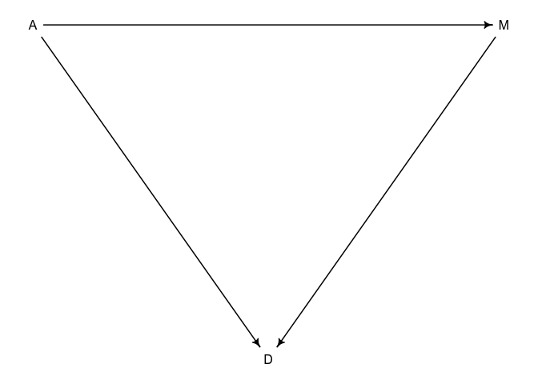<!-- -->

``` r
# There is no implied conditional independencies
impliedConditionalIndependencies(dag5.1)

# a model where M does not have any effect on D
# D is independent of M conditional on A
dag5.2 <- 
  dagitty("dag{ D <- A -> M }")
impliedConditionalIndependencies(dag5.2)
```

    ## D _||_ M | A

Both DAGs imply all pairs of the three variables should be associated.
The conditional independencies differ the two.

## Spurious associations in multiple regression models

### Modeling pairs of variables

We first build regression models of divorce rate on marriage rate and
age separately.

``` r
# load data 
data("WaffleDivorce")
d <- WaffleDivorce

# standardize
d2 <- data.frame(
  D = standardize(d$Divorce),
  M = standardize(d$Marriage),
  A = standardize(d$MedianAgeMarriage)
)

# a model of D on A
m5.1 <- quap(
  alist(
    D ~ dnorm(mu, sigma),
    mu <- a + bA * A,
    a ~ dnorm(0, 0.2),
    bA ~ dnorm(0, 0.5),
    sigma ~ dexp(1)
  ),
  data = d2
)

A_seq <- seq(-3, 3, length.out = 30)
mu <- link(m5.1, data = list(A = A_seq))
mu_mean <- apply(mu, 2, mean)
mu_PI <- apply(mu, 2, PI, prob = 0.89)
plot(D ~ A, data = d2, col = col.alpha(rangi2, 0.5), pch = 16,
     xlim = c(-3, 3), ylim = c(-2.5, 2.5),
     xlab = "Median age marriage", ylab = "Divorce rate")
lines(A_seq, mu_mean)
shade(mu_PI, A_seq)
```

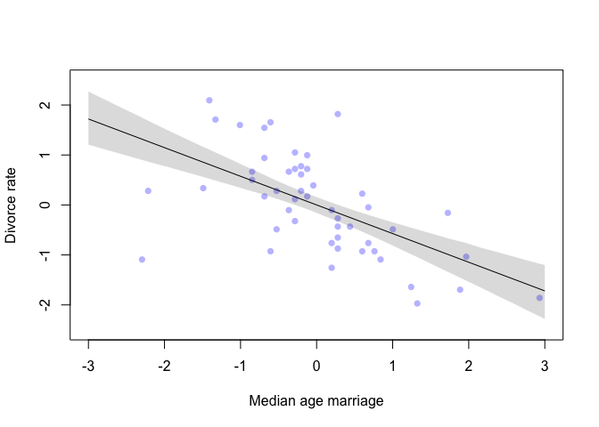<!-- -->

``` r
# a model of D on M
m5.2 <- quap(
  alist(
    D ~ dnorm(mu, sigma),
    mu <- a + bM * M,
    a ~ dnorm(0, 0.2),
    bM ~ dnorm(0, 0.5),
    sigma ~ dexp(1)
  ),
  data = d2
)

M_seq <- seq(-2, 3, length.out = 30)
mu <- link(m5.2, data = list(M = M_seq))
mu_mean <- apply(mu, 2, mean)
mu_PI <- apply(mu, 2, PI, prob = 0.89)
plot(D ~ M, data = d2, col = col.alpha(rangi2, 0.5), pch = 16,
     xlim = c(-3, 3), ylim = range(d2$D),
     xlab = "Marriage rate", ylab = "Divorce rate")
lines(A_seq, mu_mean)
shade(mu_PI, A_seq)
```

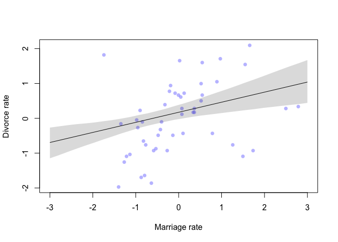<!-- -->

In the light of the DAGs, the data is consistent with both in the sense
that all pairs of associations exist. To discern the two, we need to ask
one question:

*Is there any additional value of knowing M, once I already know other
predictor variable A?*

We need a statistical model that conditions on A in modeling D on M.

### Multiple regression model

``` r
m5.3 <- quap(
  alist(
    D ~ dnorm(mu, sigma),
    mu <- a + bA * A + bM * M,
    a ~ dnorm(0, 0.2),
    bA ~ dnorm(0, 0.5),
    bM ~ dnorm(0, 0.5),
    sigma ~ dexp(1)
  ),
  data = d2
)

# plot the posterior distributions for all three models
plot(coeftab(m5.1, m5.2, m5.3), par = c("bA", "bM"))
```

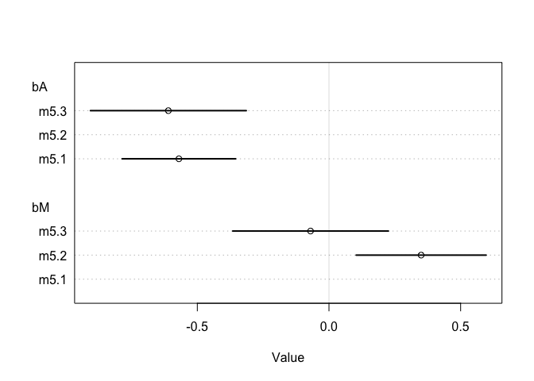<!-- -->

Interpretation:

-   bA doesn’t move, but only grow a bit uncertain
-   bM is associated with divorce only when age is missing from the
    model
-   this means that: *Once we know the median age at marriage of a
    State, there is little or no additional predictive power in also
    knowing the marriage rate in that State.*

### Plotting multivariate posteriors

#### Predictor residual plots

``` r
# we fit a model of M on A
m5.4 <- quap(
  alist(
    M ~ dnorm(mu, sigma),
    mu <- a + bAM * A,
    a ~ dnorm(0, 0.2),
    bAM ~ dnorm(0, 0.5),
    sigma ~ dexp(1)
  ),
  data = d2
)

# we need to subtract the predicted values from the observed values 
# to get the residuals of marriage rate
mu <- link(m5.4)
mu_mean <- apply(mu, 2, mean)
mu_resid <- d2$M - mu_mean

# plot the model against data
plot(M ~ A, data = d2, xlim = range(d2$A), ylim = range(d2$M),
     xlab = "Age at marriage (std)", ylab = "Marriage rate (std)",
     col = "darkblue")
lines(d2$A, mu_mean)
```

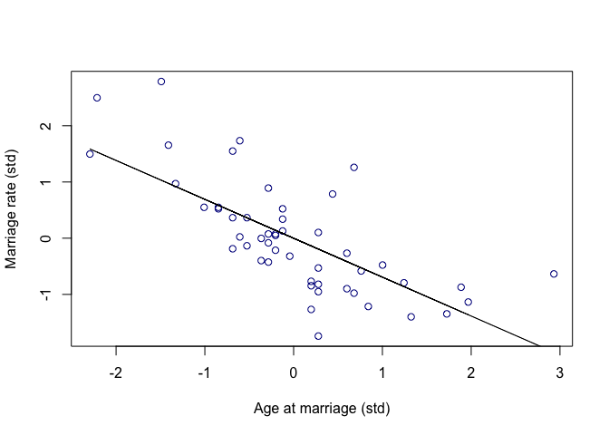<!-- -->

``` r
# Predictor residual plot
M_seq <- seq(-2,3, length.out = 50)
mu_D <- link(m5.3, data = list(A = rep(0, nrow(d2)), M = M_seq))
mu_D_mean <- apply(mu_D, 2, mean)
mu_D_PI <- apply(mu_D, 2, PI, prob = 0.89)
plot(d2$D ~ mu_resid, xlim = range(mu_resid), ylim = range(d2$D),
     xlab = "Marriage rate residuals", ylab = "Divorce rate (std)",
     col = "darkblue")
abline(v= 0, lty = 2)
lines(M_seq, mu_D_mean)
shade(mu_D_PI, M_seq)
```

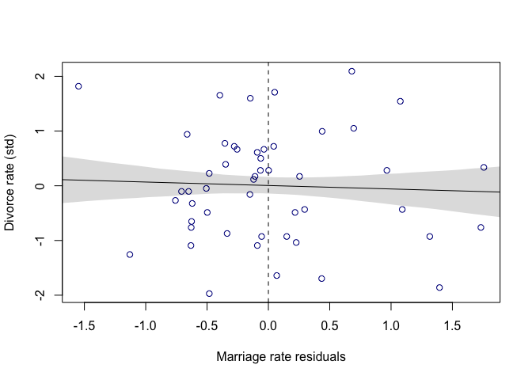<!-- -->

This can be interpreted as linear regression between marriage and
divorce rate, already being conditioned on median age at marriage. Right
to the dashed lines are states having higher divorced rate than
expected. To the left are those having lower divorce rate than expected.
Average divorce rate on both sides is the same, so there is little
association between marriage and divorce rate, once conditioned on
median age of marriage.

The same procedure can be repeated for the association between median
age and divorce rate.

#### Posterior prediction plots

Plot the implied predictions against actual values.

``` r
# call link without specifying data
# so it uses the original data
mu <- link(m5.3)
mu_mean <- apply(mu, 2, mean)
mu_PI <- apply(mu, 2, PI, prob = 0.89)

# simulate observations
D_sim <- sim(m5.3, n = 1e4)
D_mean <- apply(D_sim, 2, mean)
D_PI <- apply(D_sim, 2, PI, prob = 0.89)

# plot observed against predicted means
plot(mu_mean ~ d2$D, col = rangi2, ylim = range(mu_PI),
     xlab = "Observed divorce", ylab = "Predicted divorce")
abline(a = 0, b = 1, lty = 2)
for (i in 1:nrow(d2)) lines(rep(d2$D[i], 2), mu_PI[,i], col = rangi2)
```

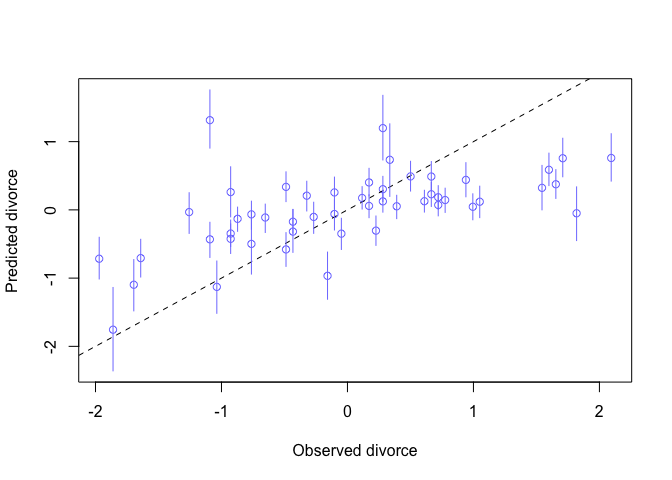<!-- -->

``` r
# plot observed against simulated values
plot(D_mean ~ d2$D, col = rangi2, ylim = range(D_PI),
     xlab = "Observed divorce", ylab = "Predicted divorce")
abline(a = 0, b = 1, lty = 2)
for (i in 1:nrow(d2)) lines(rep(d2$D[i], 2), D_PI[,i], col = rangi2)
```

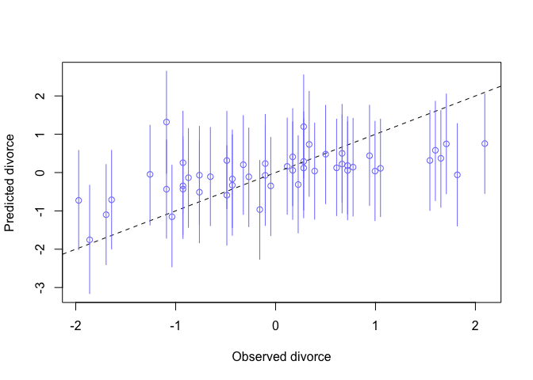<!-- -->

#### Counterfactual plots

We want to predict the consequence of manipulating A on D.

To do this, we first have to expand on m5.3 because it ignores the
relationship between A and M

``` r
m5.3_A <- quap(
  alist(
    # A -> D <- M
    D ~ dnorm(mu, sigma),
    mu <- a + bM * M + bA * A,
    a ~ dnorm(0, 0.2),
    bM ~ dnorm(0, 0.5),
    bA ~ dnorm(0, 0.5),
    sigma ~ dexp(1),
    
    # A -> M
    M ~ dnorm(mu_M, sigma_M),
    mu_M <- aM + bAM * A,
    aM ~ dnorm(0, 0.2),
    bAM ~ dnorm(0, 0.5),
    sigma_M ~ dexp(1)
  ),
  data = d2
)

precis(m5.3_A)
```

    ##                  mean         sd       5.5%      94.5%
    ## a        1.215586e-06 0.09708049 -0.1551522  0.1551546
    ## bM      -6.527486e-02 0.15078194 -0.3062535  0.1757038
    ## bA      -6.133947e-01 0.15099305 -0.8547108 -0.3720787
    ## sigma    7.851652e-01 0.07785515  0.6607376  0.9095927
    ## aM      -1.278533e-06 0.08685288 -0.1388090  0.1388064
    ## bAM     -6.947431e-01 0.09573348 -0.8477437 -0.5417425
    ## sigma_M  6.817856e-01 0.06759209  0.5737604  0.7898108

``` r
# simulate what will happen if we manipulate A
A_seq <- seq(-2, 2, length.out = 30)
# vars argument specifies what variables to simulate
# and in which order they are simulated
s <- sim(m5.3_A, data = list(A = A_seq), vars = c("M", "D"))
# plot
plot(A_seq, colMeans(s$D), ylim = c(-2,2), type = "l",
     xlab = "manipulated A", ylab = "counterfactual D")
shade(apply(s$D, 2, PI), A_seq)
mtext("Total counterfactual effect of A on D")
```

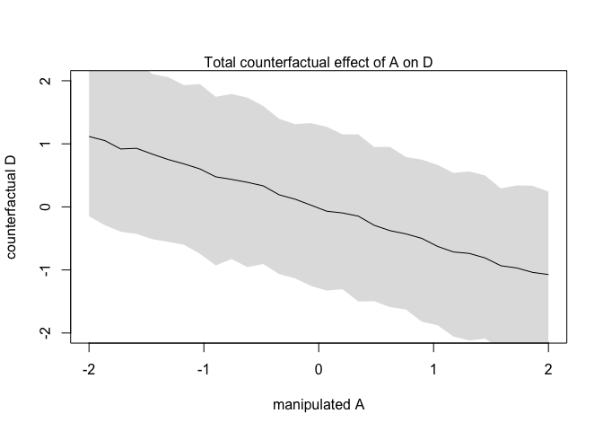<!-- -->

``` r
# simulate the counterfactual effect of M on D
M_seq <- seq(-2, 2, length.out = 30)
# vars only takes "D" right now because M doesn't affect A
s <- sim(m5.3_A, data = list(M = M_seq, A = 0), vars = "D")
# plot
plot(M_seq, colMeans(s), ylim = c(-2,2), type = "l",
     xlab = "manipulated M", ylab = "counterfactual D")
shade(apply(s, 2, PI), M_seq)
mtext("Total counterfactual effect of M on D")
```

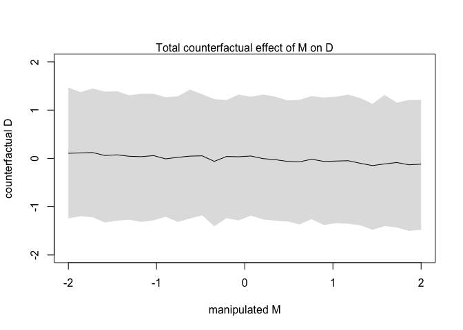<!-- -->

## Masked relationship

This happens when two predictors have opposite effects on the outcome,
while the predictors are themselves positively correlated.

``` r
data("milk")
d <- milk
# standardize
d$K <- standardize(d$kcal.per.g)
d$N <- standardize(d$neocortex.perc)
d$M <- standardize(log(d$mass))
# since th data contains missing values, we only select complete cases for analysis
dcc <- d[complete.cases(d$K, d$N, d$M), ]

# bivariate association between milk energy and neocortex percent
m5.5 <- quap(
  alist(
    K ~ dnorm(mu, sigma),
    mu <- a + bN*N,
    a ~ dnorm(0, 0.2),
    bN ~ dnorm(0, 0.5),
    sigma ~ dexp(1)
  ),
  data = dcc
)

precis(m5.5)
```

    ##             mean        sd       5.5%     94.5%
    ## a     0.03993986 0.1544908 -0.2069662 0.2868460
    ## bN    0.13323472 0.2237469 -0.2243561 0.4908255
    ## sigma 0.99982052 0.1647081  0.7365851 1.2630559

``` r
# plot posterior prediction
N_seq <- seq(min(dcc$N) - 0.15, max(dcc$N) + 0.15, length.out = 30)
mu <- link(m5.5, data = list(N = N_seq))
plot(K ~ N, data = dcc, xlim = range(N_seq), ylim = c(-1.5, 2.5),
     xlab = "neocortex percent (std)", ylab = "kilocal per g (std)",
     col = rangi2)
lines(N_seq, apply(mu, 2, mean))
shade(apply(mu, 2, PI, pro = 0.89), N_seq)
```

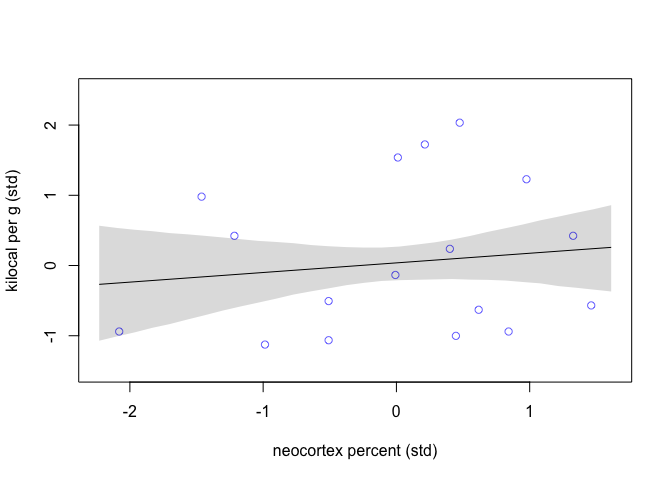<!-- -->

``` r
# association between milk energy and log-body mass
m5.6 <- quap(
  alist(
    K ~ dnorm(mu, sigma),
    mu <- a + bM*M,
    a ~ dnorm(0, 0.2),
    bM ~ dnorm(0, 0.5),
    sigma ~ dexp(1)
  ),
  data = dcc
)

precis(m5.6)
```

    ##              mean        sd       5.5%     94.5%
    ## a      0.04647047 0.1512825 -0.1953082 0.2882491
    ## bM    -0.28255771 0.1928860 -0.5908268 0.0257114
    ## sigma  0.94930652 0.1570721  0.6982750 1.2003380

``` r
# plot posterior prediction
M_seq <- seq(min(dcc$M) - 0.15, max(dcc$M) + 0.15, length.out = 30)
mu <- link(m5.6, data = list(M = M_seq))
plot(K ~ M, data = dcc, xlim = range(M_seq), ylim = c(-1.5, 2.5),
     xlab = "log body mass (std)", ylab = "kilocal per g (std)",
     col = rangi2)
lines(M_seq, apply(mu, 2, mean))
shade(apply(mu, 2, PI, pro = 0.89), M_seq)
```

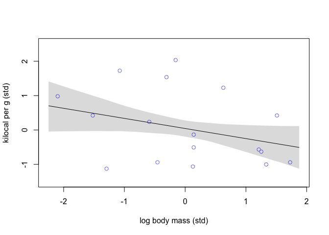<!-- -->

``` r
# fit a model including three variables
m5.7 <- quap(
  alist(
    K ~ dnorm(mu, sigma),
    mu <- a + bM*M + bN*N,
    a ~ dnorm(0, 0.2),
    bM ~ dnorm(0, 0.5),
    bN ~ dnorm(0, 0.5),
    sigma ~ dexp(1)
  ),
  data = dcc
)

# compare the three models
# both bM and bN seems to move away from 0
plot(coeftab(m5.5, m5.6, m5.7), par = c("bM", "bN"))
```

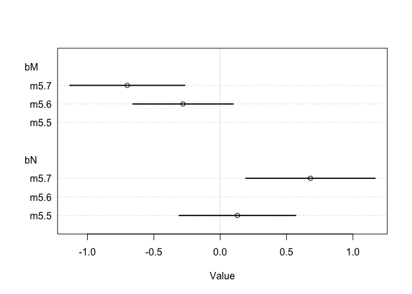<!-- -->

There are many DAGs that are compatible with this outcome. Let’s assume
there is some unobserved variable affecting both M and N, and M and N
both affect K. We try to manipulate M and N to see what are their
effects when blocking other variables.

``` r
# counterfactual holding M = 0
N_seq <- seq(min(dcc$N) - 0.15, max(dcc$N) + 0.15, length.out = 30)
mu <- link(m5.7, data = list(N = N_seq, M = 0))
plot(N_seq, apply(mu, 2, mean), xlim = range(N_seq), ylim = c(-1.5, 2.5),
     xlab = "neocortex percent (std)", ylab = "kilocal per g (std)",
     type = "l")
shade(apply(mu, 2, PI, pro = 0.89), N_seq)
mtext("Counterfactual holding M = 0")
```

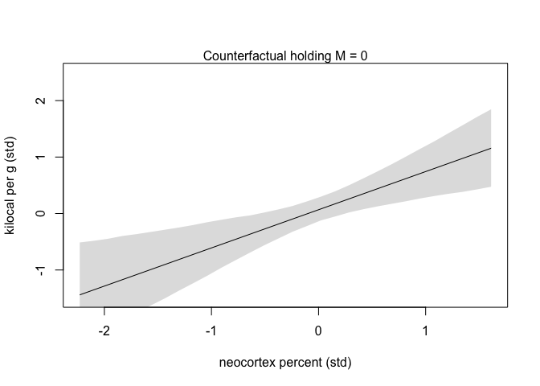<!-- -->

``` r
# counterfactual holding N = 0
M_seq <- seq(min(dcc$M) - 0.15, max(dcc$M) + 0.15, length.out = 30)
mu <- link(m5.7, data = list(M = M_seq, N = 0))
plot(M_seq, apply(mu, 2, mean), xlim = range(M_seq), ylim = c(-1.5, 2.5),
     xlab = "log body mass (std)", ylab = "kilocal per g (std)",
     type = "l")
shade(apply(mu, 2, PI, pro = 0.89), M_seq)
mtext("Counterfactual holding N = 0")
```

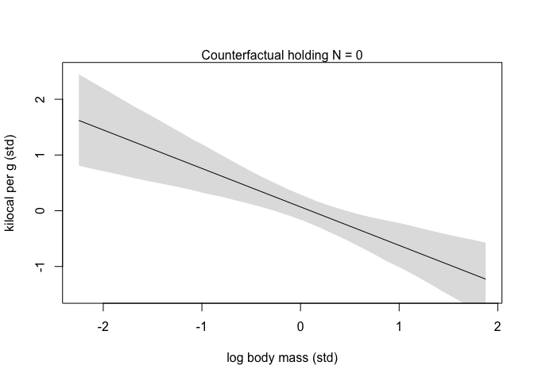<!-- -->

### Markov equivalence

Ask `dagitty` to generate Markov equivalence

``` r
dag5.7 <- dagitty( "dag{ M -> K <- N; M -> N }" )
coordinates(dag5.7) <- list( x=c(M=0,K=1,N=2) , y=c(M=0.5,K=1,N=0.5) ) 
# there are 6 DAGs giving the same conditional independencies
# scientific knowledge can help eliminate impossible ones
MElist <- equivalentDAGs(dag5.7)
drawdag(MElist)
```

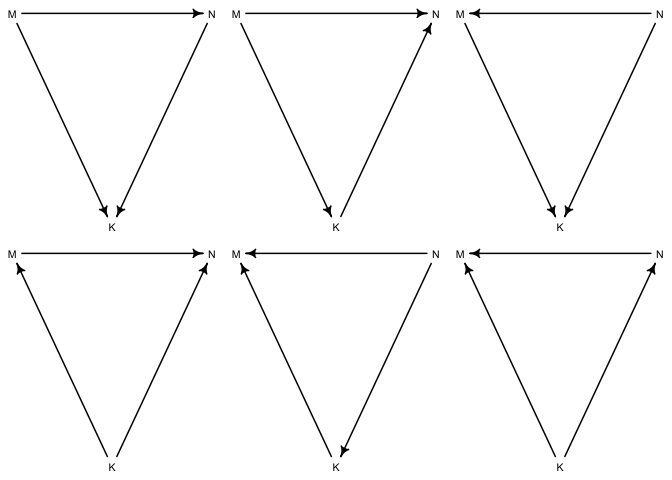<!-- -->

## Many categories in a categorical variable

``` r
d <- milk
# levels(dcc$clade)
# we want an index value for this variable
d$clade_id <- as.integer(d$clade)
d$K <- standardize(d$kcal.per.g)

# fit a model
m5.9 <- quap(
  alist(
    K ~ dnorm(mu, sigma),
    mu <- a[clade_id],
    a[clade_id] ~ dnorm(0, 0.5),
    sigma ~ dexp(1)
  ),
  data = d
)

labels <- paste("a[", 1:4, "]:", levels(d$clade), sep = "")
plot(precis(m5.9, depth = 2, pars = "a"), labels = labels, 
     xlab = "expected kcal (std)")
```

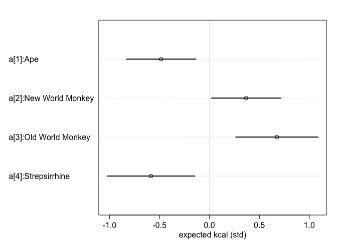<!-- -->

Can also put multiple categorical variables in one model

``` r
set.seed(63)
# make up some variable
d$house <- sample(rep(1:4, each = 8), size = nrow(d))

# fit a model
m5.10 <- quap(
  alist(
    K ~ dnorm(mu, sigma),
    mu <- a[clade_id] + h[house],
    a[clade_id] ~ dnorm(0, 0.5),
    h[house] ~ dnorm(0, 0.5),
    sigma ~ dexp(1)
  ),
  data = d
)

plot(precis(m5.10, depth = 2, pars = c("a", "h")), 
     xlab = "expected kcal (std)")
```

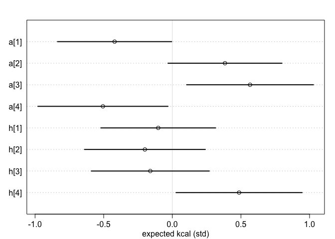<!-- -->
