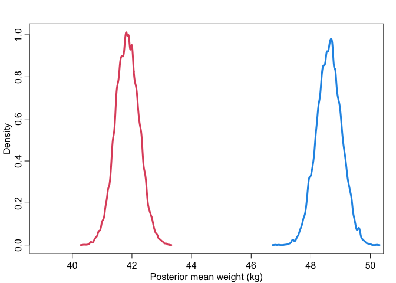
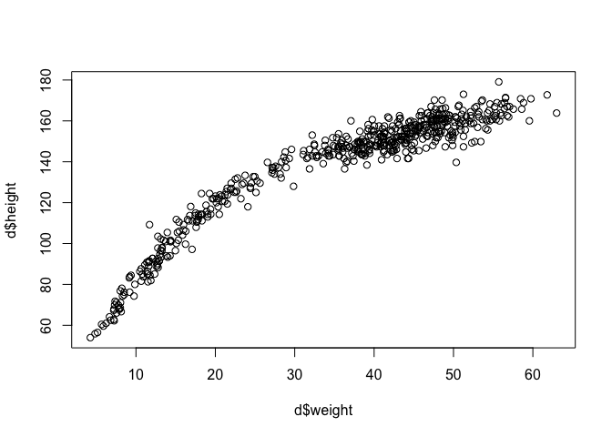
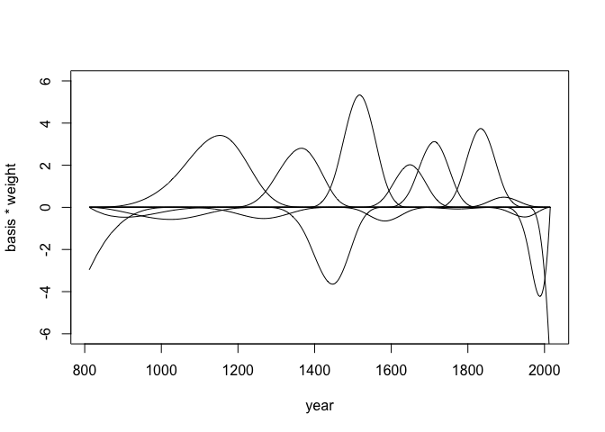

Lecture 4: Categories, Curves, and Splines
================

## Categorical variables and models of more than two variables

A model of weight as influenced by sex. This captures the effect of sex
on weight through both paths.

``` r
library(rethinking)
data("Howell1")
d <- Howell1
d <- d[d$age >= 18, ]
dat <- list(
  W = d$weight,
  S = d$male + 1 # 1 indicates female, 2 indicates male
)

m_SW <- quap(
  alist(
    W ~ dnorm(mu, sigma),
    mu <- a[S], # this uses index variable
    a[S] ~ dnorm(60, 10),
    sigma ~ dunif(0, 10)
  ),
  data = dat
)
```

Posterior mean W. Males and females have little overlap. But this is
just the mean values of weight, and we still need to count for the
uncertainty surrounding the actual values of weight.

``` r
post <- extract.samples(m_SW)
# mean weight of males
dens(post$a[,1], xlim = c(39, 50), lwd = 3, col = 2, 
     xlab = "Posterior mean weight (kg)", ylab = "Density")
# mean weight of females
dens(post$a[,2], lwd = 3, col = 4, add = TRUE)
```

<!-- -->

Posterior distribution of W. There is great overlap, but overlapping
doesn’t mean anything yet. We have to check the contrast between males
and females’ weight values.

``` r
Wf <- rnorm(1000, post$a[,1], post$sigma)
Wm <- rnorm(1000, post$a[,2], post$sigma)
# weight distribution of males
dens(Wf, xlim = c(20, 70), lwd = 3, col = 2, 
     xlab = "Posterior mean weight (kg)", ylab = "Density")
# weight distribution of females
dens(Wm, lwd = 3, col = 4, add = TRUE)
```

<!-- -->

#### Casual contrast of mean weight

The contrast will preserve the correlation between the two estimates.
Always do this as the last step when comparing between categoriecal
variables.

``` r
m_contrast <- post$a[,2] - post$a[,1]
dens(m_contrast, xlim = c(3, 10), lwd = 3, col = 1, 
     xlab = "Posterior mean weight contrast (kg)", ylab = "Density")
```

<!-- -->

``` r
# causal contrast of weight
w_contrast <- Wm - Wf
dens(w_contrast, xlim = c(-25, 35), lwd = 3, col = 1, 
     xlab = "Posterior weight contrast (kg)", ylab = "Density")
abline(v = 0, col = 2, lwd = 0.5)
```

<!-- -->

``` r
# proportion above and below zero
sum(w_contrast > 0)/1000
```

    ## [1] 0.801

``` r
sum(w_contrast < 0)/1000
```

    ## [1] 0.199

#### Add the effect of height to the model

``` r
d <- Howell1
d <- d[d$age >= 18, ]
dat <- list(
  W = d$weight,
  H = d$height,
  Hbar = mean(d$height),
  S = d$male + 1 # 1 indicates female, 2 indicates male
)

m_SHW <- quap(
  alist(
    W ~ dnorm(mu, sigma),
    mu <- a[S] + b[S] * (H - Hbar),
    a[S] ~ dnorm(60, 10),
    b[S] ~ dlnorm(0, 1),
    sigma ~ dunif(0, 10)
  ),
  data = dat
)
```

We would like to see at each height value, if there is any difference
between males and females. This is to isolate the direct effect of sex
on weight.

``` r
xseq <- seq(130, 190, len = 50)

muF <- link(
  m_SHW,
  data = data.frame(S = rep(1, 50), H = xseq, Hbar = mean(d$height))
)
muM <- link(
  m_SHW,
  data = data.frame(S = rep(2, 50), H = xseq, Hbar = mean(d$height))
)

m_contrast <- muF - muM
plot(NULL, xlim = range(xseq), ylim = c(-6, 8),
     xlab = "height (cm)", ylab = "mean weight contrast (F-M)")
for (p in c(0.5, 0.6, 0.7, 0.8, 0.9, 0.99))
  shade(apply(m_contrast, 2, PI, prob = p), xseq)
abline(h = 0, lty = 2)
```

<!-- -->

When height is small, male heavier than female. When height is big,
female heavier than male. But this effect is small (direct causal
effect), meaning that almost all of causal effect of sex on weight is
through height.

### Alternative: one statistical model and separate simulation

``` r
m_SHW_full <- quap(
  alist(
    # weight
    W ~ dnorm(mu, sigma),
    mu <- a[S] + b[S] * (H - Hbar),
    a[S] ~ dnorm(60, 10),
    b[S] ~ dlnorm(0, 1),
    sigma ~ dunif(0, 10),
    
    # weight
    H ~ dnorm(nu, tau),
    nu <- h[S],
    h[S] ~ dnorm(160, 10),
    tau ~ dunif(0, 10)
  ),
  data = dat
)
# inspect the results, everything is together
precis(m_SHW_full, depth = 2)
```

    ##              mean         sd        5.5%       94.5%
    ## a[1]   45.1669408 0.43698364  44.4685566  45.8653251
    ## a[2]   45.0945222 0.45576013  44.3661295  45.8229149
    ## b[1]    0.6567647 0.06083231   0.5595429   0.7539865
    ## b[2]    0.6096519 0.05480562   0.5220619   0.6972418
    ## sigma   4.2280343 0.15935756   3.9733501   4.4827184
    ## h[1]  149.5307223 0.40342855 148.8859656 150.1754791
    ## h[2]  160.3590259 0.42943369 159.6727080 161.0453439
    ## tau     5.5212690 0.20808791   5.1887043   5.8538336

``` r
# posterior predicative simulation
samples <- extract.samples(m_SHW_full)
n <- 1e4
Hbar <- dat$Hbar

# the with function do the things in brackets within a data environment
with(samples, {
  # simulate W for S1
  H_S1 <- rnorm(n, h[,1], tau)
  W_S1 <- rnorm(n,
                a[,1] + b[,1] * (H_S1 - Hbar),
                sigma)
  
  # simulate W for S2
  H_S2 <- rnorm(n, h[,2], tau)
  W_S2 <- rnorm(n,
                a[,2] + b[,2] * (H_S2 - Hbar),
                sigma)
  
  # compute contrast and create the variable
  W_do_S <<- W_S2 - W_S1
})

# an automated way to compute the contrast
HWsim <- sim(m_SHW_full,
             data = list(S = c(1,2)),
             vars = c("H", "W"))
W_do_S_auto <- HWsim$W[,2] - HWsim$W[,1]
```

## Fit polynomial regressions to the height data

We now include all data points in the Howell daaset. It is obvious that
the relaitonship is non-linear.

``` r
data("Howell1")
d <- Howell1
plot(d$height ~ d$weight)
```

<!-- -->

### Quadratic curve

To fit a parabolic curve, we use the following model:

-   h<sub>i</sub> \~ normal(mu<sub>i</sub>, sigma)
-   mu<sub>i</sub> = a + b<sub>1</sub>x<sub>i</sub> +
    b<sub>2</sub>x<sub>i</sub><sup>2</sup>
-   a \~ normal(178, 20)
-   b<sub>1</sub> \~ log-normal(0, 1)
-   b<sub>2</sub> \~ normal(0, 1)
-   sigma \~ uniform(0, 50)

Note here for b<sub>2</sub>, we use normal distribution instead of
log-normal because we don’t want positive constraints on it.

``` r
# standardize the weight
# this is especially helpful for polynomials
# because when predictors have very large values, there will be numericl glitches
d$weight_s <- (d$weight - mean(d$weight)) / sd(d$weight)
d$weight_s2 <- d$weight_s^2

# fit the model
m4.5 <- quap(
  alist(
    height ~ dnorm(mu, sigma),
    mu <- a + b1*weight_s + b2*weight_s2,
    a ~ dnorm(178, 20),
    b1 ~ dlnorm(0, 1),
    b2 ~ dnorm(0, 1),
    sigma ~ dunif(0, 50)
  ),
  data = d
)
precis(m4.5)
```

    ##             mean        sd       5.5%      94.5%
    ## a     146.057489 0.3689776 145.467792 146.647187
    ## b1     21.733029 0.2888908  21.271326  22.194733
    ## b2     -7.803408 0.2741846  -8.241607  -7.365208
    ## sigma   5.774513 0.1764680   5.492483   6.056543

To understand the model, we do posterior predicative simulation of the
mean and predictions, and then plot them.

``` r
weight.seq <- seq(-2.2, 2, length.out = 30)
pred_dat <- data.frame(weight_s = weight.seq, weight_s2 = weight.seq^2)
mu <- link(m4.5, data = pred_dat)
sim.height <- sim(m4.5, data = pred_dat)
mu.mean <- apply(mu, 2, mean)
mu.PI <- apply(mu, 2, PI, prob = .89)
height.PI <- apply(sim.height,2, PI, prob = .89)

# plot the data, curve, and intervals
plot(height ~ weight_s, data = d, col = col.alpha(rangi2, 0.5))
lines(weight.seq, mu.mean)
shade(mu.PI, weight.seq)
shade(height.PI, weight.seq)
```

<!-- -->

### Cubic curve

Let’s now fit a higher-order polynomial regression - a cubic regression.

``` r
d$weight_s3 <- d$weight_s^3

# fit the model
m4.6 <- quap(
  alist(
    height ~ dnorm(mu, sigma),
    mu <- a + b1*weight_s + b2*weight_s2 + b3*weight_s3,
    a ~ dnorm(178, 20),
    b1 ~ dlnorm(0, 1),
    b2 ~ dnorm(0, 1),
    b3 ~ dnorm(0, 1),
    sigma ~ dunif(0, 50)
  ),
  data = d
)

# posterior prediction
pred_dat <- data.frame(
  weight_s = weight.seq, 
  weight_s2 = weight.seq^2,
  weight_s3 = weight.seq^3
  )
mu <- link(m4.6, data = pred_dat)
sim.height <- sim(m4.6, data = pred_dat)
mu.mean <- apply(mu, 2, mean)
mu.PI <- apply(mu, 2, PI, prob = .89)
height.PI <- apply(sim.height, 2, PI, prob = .89)

# plot the data, curve, and intervals
plot(height ~ weight_s, data = d, col = col.alpha(rangi2, 0.5))
lines(weight.seq, mu.mean)
shade(mu.PI, weight.seq)
shade(height.PI, weight.seq)
```

<!-- -->

## Splines

We use B-splines to fit the data. B stands for basis function, which has
positive values only in a local region. Each basis function has a
synthetic variable, which are multiplied by a coefficient and addd
together.

``` r
data("cherry_blossoms")
d <- cherry_blossoms
precis(d)
```

    ##                   mean          sd      5.5%      94.5%       histogram
    ## year       1408.000000 350.8845964 867.77000 1948.23000   ▇▇▇▇▇▇▇▇▇▇▇▇▁
    ## doy         104.540508   6.4070362  94.43000  115.00000        ▁▂▅▇▇▃▁▁
    ## temp          6.141886   0.6636479   5.15000    7.29470        ▁▃▅▇▃▂▁▁
    ## temp_upper    7.185151   0.9929206   5.89765    8.90235 ▁▂▅▇▇▅▂▂▁▁▁▁▁▁▁
    ## temp_lower    5.098941   0.8503496   3.78765    6.37000 ▁▁▁▁▁▁▁▃▅▇▃▂▁▁▁

Fit a B-spline with 15 knots to this data and see the relationship of
year and the time when cherry blossoms.

We first constrcut the basis functions.

``` r
d2 <- d[complete.cases(d$doy),] # select complete cases on doy
num_knots <- 15
knot_list <- quantile(d2$year, probs = seq(0, 1, length.out = num_knots))

# create basis functions
library(splines)
# construct cubic splines
B <- bs(d2$year, 
        knots = knot_list[-c(1, num_knots)], # get rid of the first and the last knots
        degree = 3,
        intercept = TRUE
        )

# plot the basis functions
plot(NULL, xlim = range(d2$year), ylim = c(0, 1),
     xlab = "year", ylab = "basis")
for (i in 1:ncol(B)) lines(d2$year, B[,i])
```

<!-- -->

We then use the functions to fit the data. We use the following priors:

-   a \~ normal(100, 10)
-   w<sub>j</sub> \~ normal(0, 10)
-   sigma \~ exponential(1)

Sigma has a prior of a exponential distribution. The mean value of sigma
is 1.

``` r
m4.7 <- quap(
  alist(
    D ~ dnorm(mu, sigma),
    mu <-  a + B %*% w,
    a ~ dnorm(100, 10),
    w ~ dnorm(0, 10),
    sigma ~ dexp(1)
  ),
  data = data.frame(D = d2$doy, B = B),
  start = list(w = rep(0, ncol(B)))
)
precis(m4.7, depth = 2)
```

    ##              mean        sd         5.5%       94.5%
    ## w[1]   -3.0273572 3.8612338  -9.19835456   3.1436402
    ## w[2]   -0.8322423 3.8702148  -7.01759297   5.3531084
    ## w[3]   -1.0530147 3.5849897  -6.78252065   4.6764912
    ## w[4]    4.8442467 2.8771504   0.24600468   9.4424888
    ## w[5]   -0.8385127 2.8743603  -5.43229570   3.7552702
    ## w[6]    4.3278441 2.9148850  -0.33070509   8.9863933
    ## w[7]   -5.3216294 2.8002402  -9.79695417  -0.8463047
    ## w[8]    7.8476016 2.8020999   3.36930474  12.3258985
    ## w[9]   -1.0014268 2.8810697  -5.60593259   3.6030790
    ## w[10]   3.0344764 2.9101381  -1.61648638   7.6854391
    ## w[11]   4.6684607 2.8917422   0.04689809   9.2900232
    ## w[12]  -0.1498161 2.8694417  -4.73573807   4.4361059
    ## w[13]   5.5584400 2.8874517   0.94373456  10.1731455
    ## w[14]   0.7215816 2.9993502  -4.07195932   5.5151226
    ## w[15]  -0.8065377 3.2935396  -6.07025005   4.4571746
    ## w[16]  -6.9636699 3.3758066 -12.35886085  -1.5684790
    ## w[17]  -7.6635466 3.2227847 -12.81417907  -2.5129142
    ## a     103.3477387 2.3697454  99.56042790 107.1350496
    ## sigma   5.8766888 0.1437579   5.64693600   6.1064416

We need to plot the posterior predictions

``` r
# here are the weighted basis functions
post <- extract.samples(m4.7)
w <- apply(post$w, 2, mean)
plot(NULL, xlim = range(d2$year), ylim = c(-6,6),
     xlab = "year", ylab = "basis * weight")
for (i in 1:ncol(B)) lines(d2$year, w[i]*B[,i])
```

<!-- -->

``` r
# a curve for the mean and its interval
mu <- link(m4.7)
mu_mean <- apply(mu, 2, mean)
mu_PI <- apply(mu, 2, PI, prob = 0.89)
plot(doy ~ year, data = d2, col = col.alpha(rangi2, 0.3), pch = 16)
lines(d2$year, mu_mean)
shade(mu_PI, d2$year)
```

<!-- -->
