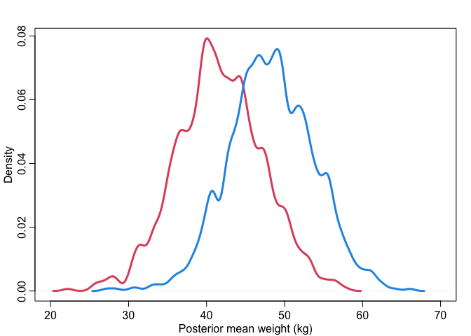
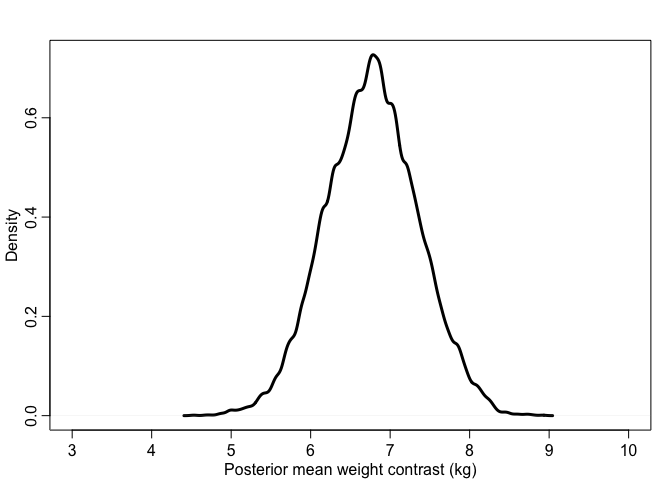
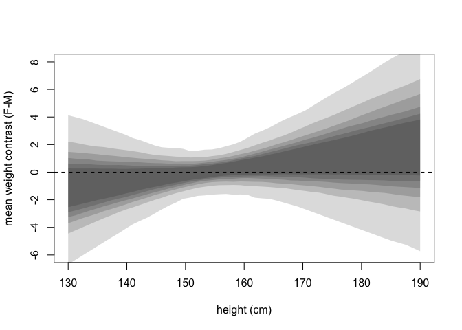

Lecture 4: Categories, Curves, and Splines
================

## Categorical variables and models of more than two variables

A model of weight as influenced by sex. This captures the effect of sex
on weight through both paths.

``` r
library(rethinking)
data("Howell1")
d <- Howell1
d <- d[d$age >= 18, ]
dat <- list(
  W = d$weight,
  S = d$male + 1 # 1 indicates female, 2 indicates male
)

m_SW <- quap(
  alist(
    W ~ dnorm(mu, sigma),
    mu <- a[S], # this uses index variable
    a[S] ~ dnorm(60, 10),
    sigma ~ dunif(0, 10)
  ),
  data = dat
)
```

Posterior mean W. Males and females have little overlap. But this is
just the mean values of weight, and we still need to count for the
uncertainty surrounding the actual values of weight.

``` r
post <- extract.samples(m_SW)
# mean weight of males
dens(post$a[,1], xlim = c(39, 50), lwd = 3, col = 2, 
     xlab = "Posterior mean weight (kg)", ylab = "Density")
# mean weight of females
dens(post$a[,2], lwd = 3, col = 4, add = TRUE)
```

<!-- -->

Posterior distribution of W. There is great overlap, but overlapping
doesn’t mean anything yet. We have to check the contrast between males
and females’ weight values.

``` r
Wf <- rnorm(1000, post$a[,1], post$sigma)
Wm <- rnorm(1000, post$a[,2], post$sigma)
# weight distribution of males
dens(Wf, xlim = c(20, 70), lwd = 3, col = 2, 
     xlab = "Posterior mean weight (kg)", ylab = "Density")
# weight distribution of females
dens(Wm, lwd = 3, col = 4, add = TRUE)
```

<!-- -->

#### Casual contrast of mean weight

The contrast will preserve the correlation between the two estimates.
Always do this as the last step when comparing between categoriecal
variables.

``` r
m_contrast <- post$a[,2] - post$a[,1]
dens(m_contrast, xlim = c(3, 10), lwd = 3, col = 1, 
     xlab = "Posterior mean weight contrast (kg)", ylab = "Density")
```

<!-- -->

``` r
# causal contrast of weight
w_contrast <- Wm - Wf
dens(w_contrast, xlim = c(-25, 35), lwd = 3, col = 1, 
     xlab = "Posterior weight contrast (kg)", ylab = "Density")
abline(v = 0, col = 2, lwd = 0.5)
```

<!-- -->

``` r
# proportion above and below zero
sum(w_contrast > 0)/1000
```

    ## [1] 0.804

``` r
sum(w_contrast < 0)/1000
```

    ## [1] 0.196

#### Add the effect of height to the model

``` r
d <- Howell1
d <- d[d$age >= 18, ]
dat <- list(
  W = d$weight,
  H = d$height,
  Hbar = mean(d$height),
  S = d$male + 1 # 1 indicates female, 2 indicates male
)

m_SHW <- quap(
  alist(
    W ~ dnorm(mu, sigma),
    mu <- a[S] + b[S] * (H - Hbar),
    a[S] ~ dnorm(60, 10),
    b[S] ~ dlnorm(0, 1),
    sigma ~ dunif(0, 10)
  ),
  data = dat
)
```

We would like to see at each height value, if there is any difference
between males and females. This is to isolate the direct effect of sex
on weight.

``` r
xseq <- seq(130, 190, len = 50)

muF <- link(
  m_SHW,
  data = data.frame(S = rep(1, 50), H = xseq, Hbar = mean(d$height))
)
muM <- link(
  m_SHW,
  data = data.frame(S = rep(2, 50), H = xseq, Hbar = mean(d$height))
)

m_contrast <- muF - muM
plot(NULL, xlim = range(xseq), ylim = c(-6, 8),
     xlab = "height (cm)", ylab = "mean weight contrast (F-M)")
for (p in c(0.5, 0.6, 0.7, 0.8, 0.9, 0.99))
  shade(apply(m_contrast, 2, PI, prob = p), xseq)
abline(h = 0, lty = 2)
```

<!-- -->

When height is small, male heavier than female. When height is big,
female heavier than male. But this effect is small (direct causal
effect), meaning that almost all of causal effect of sex on weight is
through height.

### Alternative: one statistical model and separate simulation

``` r
m_SHW_full <- quap(
  alist(
    # weight
    W ~ dnorm(mu, sigma),
    mu <- a[S] + b[S] * (H - Hbar),
    a[S] ~ dnorm(60, 10),
    b[S] ~ dlnorm(0, 1),
    sigma ~ dunif(0, 10),
    
    # weight
    H ~ dnorm(nu, tau),
    nu <- h[S],
    h[S] ~ dnorm(160, 10),
    tau ~ dunif(0, 10)
  ),
  data = dat
)
# inspect the results, everything is together
precis(m_SHW_full, depth = 2)
```

    ##              mean         sd        5.5%       94.5%
    ## a[1]   45.1671954 0.43697334  44.4688276  45.8655632
    ## a[2]   45.0933668 0.45574892  44.3649920  45.8217416
    ## b[1]    0.6567863 0.06083088   0.5595668   0.7540058
    ## b[2]    0.6097482 0.05480434   0.5221603   0.6973362
    ## sigma   4.2279334 0.15934800   3.9732645   4.4826023
    ## h[1]  149.5306648 0.40343290 148.8859011 150.1754285
    ## h[2]  160.3578169 0.42943834 159.6714915 161.0441423
    ## tau     5.5213288 0.20809355   5.1887551   5.8539025

``` r
# posterior predicative simulation
samples <- extract.samples(m_SHW_full)
n <- 1e4
Hbar <- dat$Hbar

# the with function do the things in brackets within a data environment
with(samples, {
  # simulate W for S1
  H_S1 <- rnorm(n, h[,1], tau)
  W_S1 <- rnorm(n,
                a[,1] + b[,1] * (H_S1 - Hbar),
                sigma)
  
  # simulate W for S2
  H_S2 <- rnorm(n, h[,2], tau)
  W_S2 <- rnorm(n,
                a[,2] + b[,2] * (H_S2 - Hbar),
                sigma)
  
  # compute contrast and create the variable
  W_do_S <<- W_S2 - W_S1
})

# an automated way to compute the contrast
HWsim <- sim(m_SHW_full,
             data = list(S = c(1,2)),
             vars = c("H", "W"))
W_do_S_auto <- HWsim$W[,2] - HWsim$W[,1]
```

## Fit polynomial regressions to the height data

We now include all data points in the Howell daaset. It is obvious that
the relaitonship is non-linear.

``` r
data("Howell1")
d <- Howell1
plot(d$height ~ d$weight)
```

<!-- -->

To fit a parabolic curve, we use the following model:

-   h<sub>i</sub> \~ normal(mu<sub>i</sub>, sigma)
-   mu<sub>i</sub> = a + b<sub>1</sub>x<sub>i</sub> +
    b<sub>2</sub>x<sub>i</sub><sup>2</sup>
-   a \~ normal(178, 20)
-   b<sub>1</sub> \~ log-normal(0, 1)
-   b<sub>2</sub> \~ normal(0, 1)
-   sigma \~ uniform(0, 50)

Note here for b<sub>2</sub>, we use normal distribution instead of
log-normal because we don’t want positive constraints on it.
