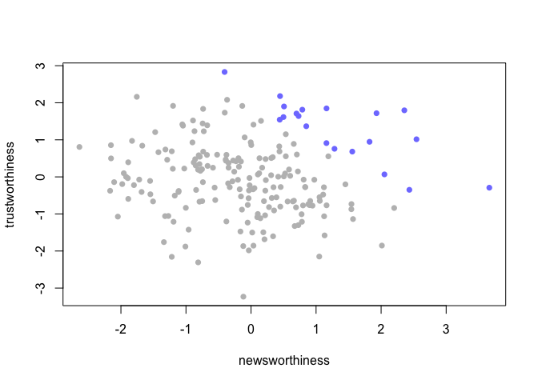
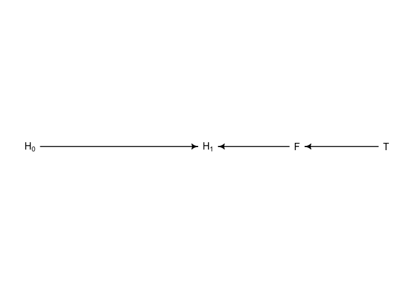
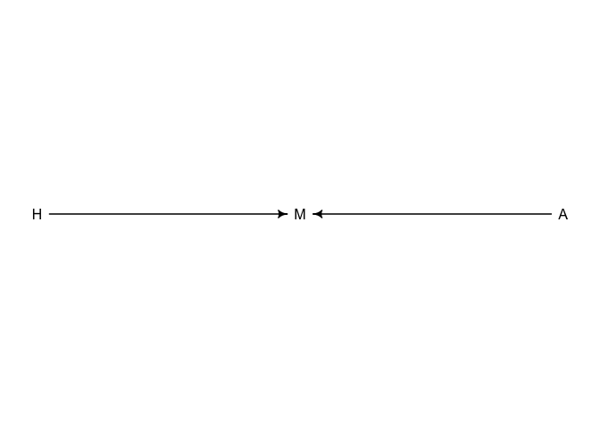
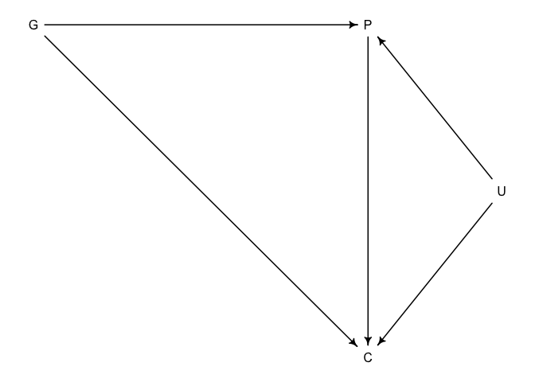

Lecture 5: Elemental Confounds
================
Yurun (Ellen) Ying
5/27/2022

## Elemental confounds - an example

Selection can create spurious correlation (selection-distortion effect).
For example, newsworthiness and trustworthiness seem to be negatively
associated since they go through the grant selection process. A
simulation will illustrate:

``` r
set.seed(1914)
N <- 200 # num grant proposals
p <- 0.1 # proportion to be selected
# uncorrelated newsworthiness and trustworthiness
nw <- rnorm(N)
tw <- rnorm(N)
# combined score and select top 10%
s <- nw + tw
q <- quantile(s, 1-p) # top 10% threshold
selected <- ifelse(s > q, TRUE, FALSE)
cor(nw[selected], tw[selected])
```

    ## [1] -0.7680083

``` r
# plot
plot(nw[selected], tw[selected], col = rangi2, pch = 16,
     xlim = range(nw), ylim = range(tw),
     xlab = "newsworthiness", ylab = "trustworthiness")
points(nw[!selected], tw[!selected], col = "gray", pch = 16)
```

<!-- -->

When this happens in statistical models, it’s called collider bias.

## Multicollinearity

Multicollinearity is very strong association between two or more
variables. Notice that association matters here, not pairwise
correlation. The consequence is that posterior distribution says none of
the variables are reliably associated with the outcomes, but in fact
they are

``` r
data("milk")
d <- milk
# standardize
d$K <- standardize(d$kcal.per.g)
d$F <- standardize(d$perc.fat) 
d$L <- standardize(d$perc.lactose)

# bivariate regression models
# kcal regressed on fat
m6.3 <- quap(
  alist(
    K ~ dnorm(mu, sigma),
    mu <- a + bF*F,
    a ~ dnorm(0, 0.2),
    bF ~ dnorm(0, 0.5),
    sigma ~ dexp(1)
  ),
  data = d
)
# kcal regressed on lactose
m6.4 <- quap(
  alist(
    K ~ dnorm(mu, sigma),
    mu <- a + bL*L,
    a ~ dnorm(0, 0.2),
    bL ~ dnorm(0, 0.5),
    sigma ~ dexp(1)
  ),
  data = d
)

precis(m6.3)
```

    ##                mean         sd       5.5%     94.5%
    ## a     -3.119893e-06 0.07725199 -0.1234667 0.1234605
    ## bF     8.618988e-01 0.08426090  0.7272336 0.9965640
    ## sigma  4.510182e-01 0.05870766  0.3571921 0.5448444

``` r
precis(m6.4)
```

    ##                mean         sd       5.5%     94.5%
    ## a     -6.170817e-07 0.06661625 -0.1064662  0.106465
    ## bL    -9.024555e-01 0.07132837 -1.0164520 -0.788459
    ## sigma  3.804647e-01 0.04958241  0.3012224  0.459707

We can see both predictors have very strong associations with kcal. Now
let’s see what will happen with they are in the same model.

``` r
m6.5 <- quap(
  alist(
    K ~ dnorm(mu, sigma),
    mu <- a + bF*F+ bL*L,
    a ~ dnorm(0, 0.2),
    bF ~ dnorm(0, 0.5),
    bL ~ dnorm(0, 0.5),
    sigma ~ dexp(1)
  ),
  data = d
)

precis(m6.5)
```

    ##                mean         sd        5.5%      94.5%
    ## a      1.244477e-06 0.06603686 -0.10553841  0.1055409
    ## bF     2.435796e-01 0.18358236 -0.04982045  0.5369797
    ## bL    -6.780035e-01 0.18378058 -0.97172033 -0.3842866
    ## sigma  3.767488e-01 0.04918620  0.29813973  0.4553578

Posterior means of the bF and bL are closer to mean and their sd gets
larger.

This is because regression model essentially asks the question: what is
the additional value you get from knowing one variable, given that you
already know other variable? If two variables contain the same/very
similar information, the parameter estimates will act weird (but the
prediction still works fine).

In the case of milk, the cause of fat and lactose are almost perfectly
correlated is because some third variable causing them both. Maybe a
good idea to measure this variable instead of using a regression model.

## Post-treatment bias

This happens when you put the variable which is a result of your
treatment in your model. More generally, this is a type of confounder
that is called “the pipe”.

We will simulate a dataset to see this bias.

``` r
set.seed(71)
# number of plants
n <- 100

# simulate the initial heights
h0 <- rnorm(n, 10, 2)

# assign treatment and simulate fungus and growth
treatment <- rep(0:1, each = n/2)
fungus <- rbinom(n, size = 1, prob = 0.5 - treatment*0.4)
h1 <- h0 + rnorm(n, 5-3*fungus)

# compose a clean data frame
d <- data.frame(h0 = h0, 
                h1 = h1, 
                treatment = treatment, 
                fungus = fungus) 
precis(d)
```

    ##               mean        sd      5.5%    94.5%    histogram
    ## h0         9.95978 2.1011623  6.570328 13.07874 ▁▂▂▂▇▃▂▃▁▁▁▁
    ## h1        14.39920 2.6880870 10.618002 17.93369     ▁▁▃▇▇▇▁▁
    ## treatment  0.50000 0.5025189  0.000000  1.00000   ▇▁▁▁▁▁▁▁▁▇
    ## fungus     0.23000 0.4229526  0.000000  1.00000   ▇▁▁▁▁▁▁▁▁▂

``` r
# A model of height variables
# p = h1/h0 which is always larger than 0
m6.6 <- quap(
  alist(
    h1 ~ dnorm(mu, sigma),
    mu <- h0 * p,
    p ~ dlnorm(0, 0.25),
    sigma ~ dexp(1)
  ),
  data = d
)

# this is a model of average growth rate of plants
precis(m6.6)
```

    ##           mean         sd     5.5%    94.5%
    ## p     1.426628 0.01759834 1.398503 1.454754
    ## sigma 1.792106 0.12496794 1.592383 1.991829

``` r
# now a linear model of p
m6.7 <- quap(
  alist(
    h1 ~ dnorm(mu, sigma),
    mu <- h0 * p,
    p <- a + bt * treatment + bf * fungus,
    a ~ dlnorm(0, 0.2),
    bt ~ dnorm(0, 0.5),
    bf ~ dnorm(0, 0.5),
    sigma ~ dexp(1)
  ),
  data = d
)

precis(m6.7)
```

    ##              mean         sd        5.5%       94.5%
    ## a      1.48139094 0.02451068  1.44221815  1.52056373
    ## bt     0.00241255 0.02986963 -0.04532488  0.05014998
    ## bf    -0.26671805 0.03654770 -0.32512833 -0.20830777
    ## sigma  1.40879638 0.09862052  1.25118174  1.56641102

In this model, treatment does not have an effect while fungus has
negative impact on plants’ growth. This is because all the effects of
treatment on plants go through fungus. Once fungus is include, treatment
will have little or not effect (which exactly means your treatment
works). This model makes ok predictions but does not make causal sense.

``` r
# a better model
m6.8 <- quap(
  alist(
    h1 ~ dnorm(mu, sigma),
    mu <- h0 * p,
    p <- a + bt * treatment,
    a ~ dlnorm(0, 0.2),
    bt ~ dnorm(0, 0.5),
    sigma ~ dexp(1)
  ),
  data = d
)

precis(m6.8)
```

    ##             mean         sd       5.5%     94.5%
    ## a     1.38035157 0.02517700 1.34011386 1.4205893
    ## bt    0.08499494 0.03429912 0.03017831 0.1398116
    ## sigma 1.74641704 0.12193300 1.55154456 1.9412895

Illustrate the causal relations through DAG

``` r
plant_dag <- 
  dagitty( "dag {H_0 -> H_1 
            F -> H_1
            T -> F
          }")

coordinates(plant_dag) <- 
  list( x=c(H_0=0, T=2, F=1.5, H_1=1),
        y=c(H_0=0, T=0, F=0, H_1=0) )

drawdag(plant_dag)
```

<!-- -->

``` r
# the conditional independencies also say 
# when conditioned on F, H1 and T are independent
impliedConditionalIndependencies(plant_dag)
```

    ## F _||_ H_0
    ## H_0 _||_ T
    ## H_1 _||_ T | F

## Collider bias

### A simple example

We will see an example where happiness and age both lead to higher
levels of marriage. Happiness and age are in fact independent of each
other, but when we include marriage in the statistical model, we will
see they are negative associated.

``` r
# a DAG
hma <- dagitty("dag { H -> M <- A }")
coordinates(hma) <- list(x = c(H = 0, M = 0.5, A = 1),
                         y = c(H = 0, M = 0, A = 0))
drawdag(hma)
```

<!-- -->

``` r
# do a fancy ABM to generate the data
d <- sim_happiness(seed=1977 , N_years=1000) 
precis(d)
```

    ##                    mean        sd      5.5%     94.5%     histogram
    ## age        3.300000e+01 18.768883  4.000000 62.000000 ▇▇▇▇▇▇▇▇▇▇▇▇▇
    ## married    3.007692e-01  0.458769  0.000000  1.000000    ▇▁▁▁▁▁▁▁▁▃
    ## happiness -1.000070e-16  1.214421 -1.789474  1.789474      ▇▅▇▅▅▇▅▇

``` r
d2 <- d[d$age > 17,] # select adults
d2$A <- (d2$age - 18)/(65 - 18) # standardize so that 18-65 is one unit
d2$mid <- d2$married + 1 # 1 = unmarried, 2 = married

# fit a model including marriage status
m6.9 <- quap(
  alist(
    happiness ~ dnorm(mu, sigma),
    mu <- a[mid] + bA*A,
    # happiness ranges from -2 to 2
    # this prior allows 95% to lie in this range
    a[mid] ~ dnorm(0, 1),
    # the maximum value of the slope is 4
    # this prior allows 95% of the slope to lie within a plausible range
    bA ~ dnorm(0, 2), 
    sigma ~ dexp(1)
  ),
  data = d2
)

precis(m6.9, depth = 2)
```

    ##             mean         sd       5.5%      94.5%
    ## a[1]  -0.2350877 0.06348986 -0.3365568 -0.1336186
    ## a[2]   1.2585517 0.08495989  1.1227694  1.3943340
    ## bA    -0.7490274 0.11320112 -0.9299447 -0.5681102
    ## sigma  0.9897080 0.02255800  0.9536559  1.0257600

This result causally implies that age has a negative impact on
happiness, but we know if fact there is no such causal effect. This is
because marriage status is collider and we don’t want it in out model.

``` r
# a better model
m6.10 <- quap(
  alist(
    happiness ~ dnorm(mu, sigma),
    mu <- a + bA*A,
    a ~ dnorm(0, 1), 
    bA ~ dnorm(0, 2), 
    sigma ~ dexp(1)
  ),
  data = d2
)

precis(m6.10)
```

    ##                mean         sd       5.5%     94.5%
    ## a      1.649248e-07 0.07675015 -0.1226614 0.1226617
    ## bA    -2.728620e-07 0.13225976 -0.2113769 0.2113764
    ## sigma  1.213188e+00 0.02766080  1.1689803 1.2573949

### When DAG is haunted

There are situations in which we need to control a variable, but there
are some unmeasured ones making it a collider. In these cases,
controling for this variable is dangerous.

``` r
# A DAG
gpc <- 
  dagitty("dag { G -> P -> C; G -> C;
          U -> P; U -> C}")
coordinates(gpc) <- list(x = c(G = 0, P = 0.5, C = 0.5, U = 0.7),
                         y = c(G = 0, P = 0, C = 0.5, U = 0.25))
drawdag(gpc)
```

<!-- -->

``` r
# simulate this causal DAG to get some data
N <- 200 # number of grandparent-parent-child triads 
b_GP <- 1 # direct effect of G on P
b_GC <- 0 # direct effect of G on C
b_PC <- 1 # direct effect of P on C
b_U <- 2 #direct effect of U on P and C

set.seed(1)
U <- 2*rbern(N, 0.5) - 1 # a binary variable for U
G <- rnorm(N)
P <- rnorm(N, b_GP*G + b_U*U)
C <- rnorm(N, b_GC*G + b_PC*P + b_U*U)
d <- data.frame( C=C , P=P , G=G , U=U )

# a model of C regressed on G and P
m6.11 <- quap(
  alist(
    C ~ dnorm(mu, sigma),
    mu <- a + b_GC*G + b_PC*P,
    a ~ dnorm(0, 1), 
    c(b_PC,b_GC) ~ dnorm(0, 1),
    sigma ~ dexp(1)
  ),
  data = d
)

precis(m6.11)
```

    ##             mean         sd       5.5%       94.5%
    ## a     -0.1174752 0.09919574 -0.2760091  0.04105877
    ## b_PC   1.7868915 0.04455355  1.7156863  1.85809664
    ## b_GC  -0.8389537 0.10614045 -1.0085867 -0.66932077
    ## sigma  1.4094891 0.07011139  1.2974375  1.52154063

This doesn’t seem very correct. The effect of parents’ edu on child’s
edu is twice as its true value, and the effect of grandparents’ edu is
negative, which should be zero. This is the consequence of including P
in the model, which is made a collider by the unobserved variable U.

``` r
# a better model is to measure U and include it
m6.12 <- quap(
  alist(
    C ~ dnorm(mu, sigma),
    mu <- a + b_GC*G + b_PC*P + b_U*U,
    a ~ dnorm(0, 1), 
    c(b_PC,b_GC,b_U) ~ dnorm(0, 1),
    sigma ~ dexp(1)
  ),
  data = d
)

# now these estimates are what we expect
precis(m6.12)
```

    ##              mean         sd       5.5%       94.5%
    ## a     -0.12198751 0.07192425 -0.2369364 -0.00703866
    ## b_PC   1.01137680 0.06597068  0.9059429  1.11681068
    ## b_GC  -0.04091886 0.09728513 -0.1963993  0.11456156
    ## b_U    1.99628955 0.14770183  1.7602335  2.23234559
    ## sigma  1.01957598 0.05079895  0.9383895  1.10076252
