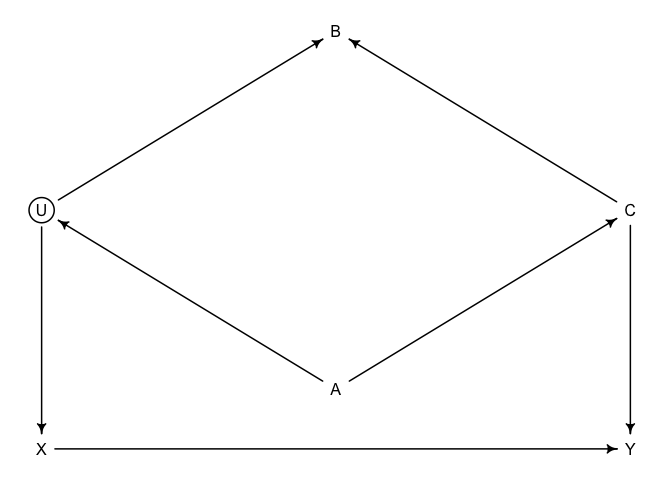
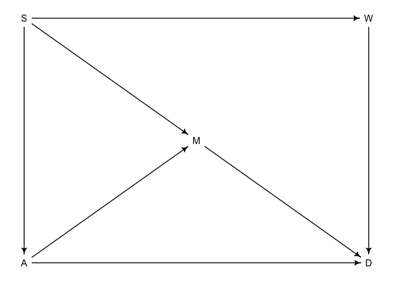
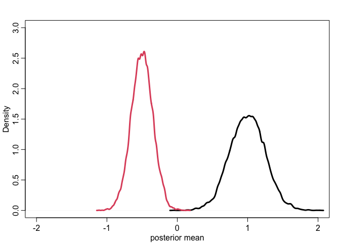
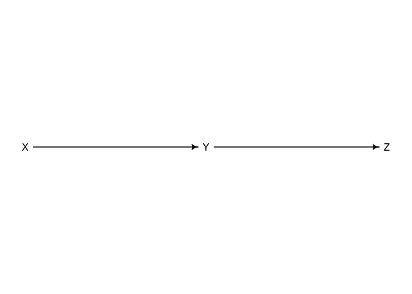
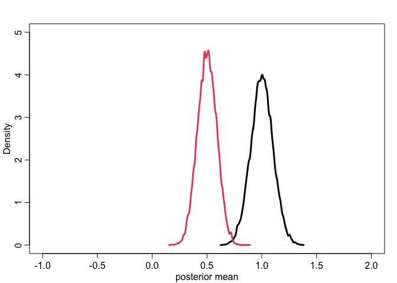
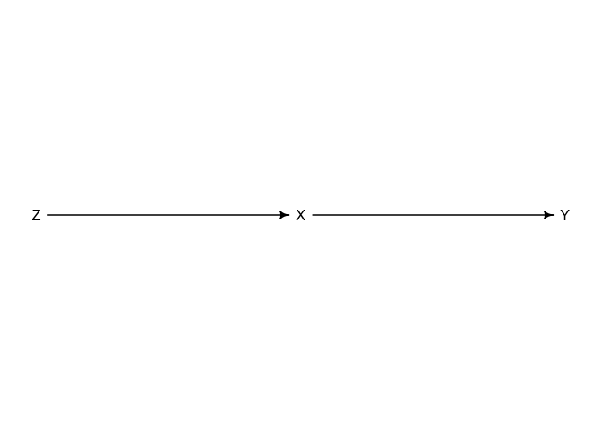
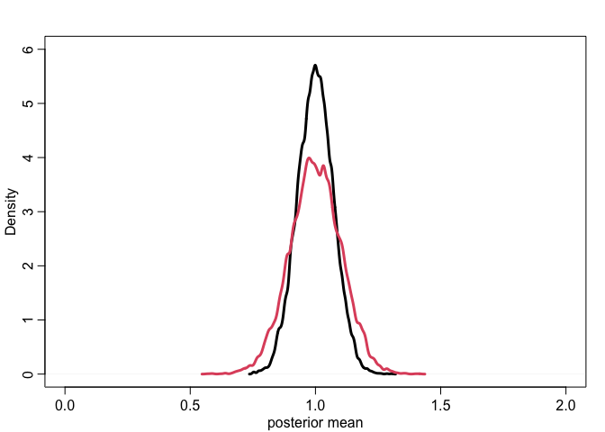
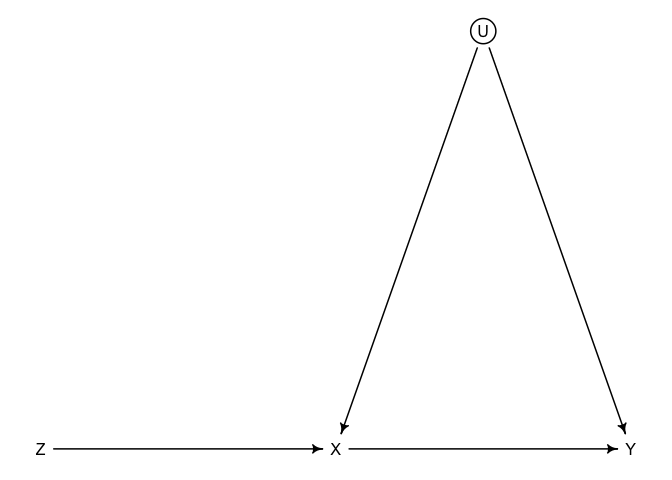
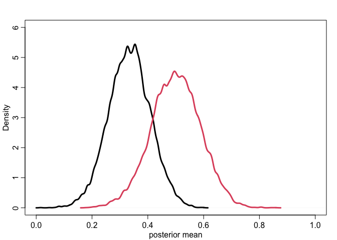

Lecture 6: Good & Bad Controls
================
Yurun (Ellen) Ying
5/31/2022

## Shutting the backdoor

The do-calculus can help us to block all the non-causal paths in a
statistical model and estimate the causal effect with some accuracy:

-   Identify all the paths connecting X and Y
-   Identify the open paths (paths with a collider are closed already)
-   Identify the non-causal paths among these open paths (with an arrow
    entering X)
-   Control variables to block these non-causal open paths (find
    adjustment set)

We can also use the `dagitty` package to help us identify,

``` r
dag6.1 <- dagitty("dag{
                  U [unobserved]
                  X [exposure] 
                  Y [outcome] 
                  X -> Y
                  X <- U <- A -> C -> Y 
                  U -> B <- C}")
coordinates(dag6.1) <- list(x = c(X=0, Y=1, U=0, A=0.5, B=0.5, C=1),
                            y = c(X=1, Y=1, U=0.6, A=0.9, B=0.3, C=0.6))
drawdag(dag6.1)
```

<!-- -->

``` r
# automatically find adjustment set
# it tells us either control C or A will work
adjustmentSets(dag6.1)
```

    ## { C }
    ## { A }

``` r
dag6.2 <- dagitty("dag{
                  A -> D
                  A -> M -> D
                  A <- S -> M
                  S -> W -> D}")
coordinates(dag6.2) <- list(x = c(A=0, D=1, M=0.5, S=0, W=1),
                            y = c(A=1, D=1, M=0.5, S=0, W=0))
drawdag(dag6.2)
```

<!-- -->

``` r
# adjustment set
# either control A and M, or S alone
adjustmentSets(dag6.2, exposure = "W", outcome = "D")
```

    ## { A, M }
    ## { S }

## Some bad controls

### The pipe

``` r
dag6.3 <- dagitty("dag{
                  U [unobserved]
                  X -> Z -> Y
                  Z <- U -> Y}")
coordinates(dag6.3) <- list(x = c(X = 0, Z = 0.5, U = 0.75, Y = 1),
                            y = c(X = 1, Z = 1, U = 0.7, Y = 1))
drawdag(dag6.3)
```

<!-- -->

``` r
# Two paths, no backdoor path -> no need to control anything
# let's see what happen if we do control for Z
f <- function(n = 100, bXZ = 1, bZY = 1) {
  X <- rnorm(n)
  U <- rnorm(n)
  Z <- rnorm(n, bXZ * X + U)
  Y <- rnorm(n, bZY * Z + U)
  bX <- coef(lm(Y ~ X))["X"]
  bXZ <- coef(lm(Y ~ X + Z))["X"]
  return(c(bX, bXZ))
}

sim <- mcreplicate(1e4, f(), mc.cores = 2)
```

``` r
# the results look very wrong when controlling for Z
# it's direction changes
dens(sim[1,], lwd = 3, xlab = "posterior mean", 
     xlim = c(-2, 2), ylim = c(0, 3))
dens(sim[2,], lwd = 3, col = 2, add = TRUE)
```

<!-- -->

### Case-control bias

``` r
dag6.4 <- dagitty("dag{X -> Y -> Z}")
coordinates(dag6.4) <- list(x = c(X = 0, Y = 0.5, Z = 1),
                            y = c(X = 1, Y = 1, Z = 1))
drawdag(dag6.4)
```

<!-- -->

``` r
# we are interested in the causal effect of X on Y
# there is no need to control for Z
# since once controlled, there is less variation in Y to be explained by X
f <- function(n = 100, bXY = 1, bYZ = 1) {
  X <- rnorm(n)
  Y <- rnorm(n, bXY * X)
  Z <- rnorm(n, bYZ * Y)
  bX <- coef(lm(Y ~ X))["X"]
  bXZ <- coef(lm(Y ~ X + Z))["X"]
  return(c(bX, bXZ))
}

sim <- mcreplicate(1e4, f(), mc.cores = 2)
```

``` r
# the estimate when controlling for Z is lower than the actual value
dens(sim[1,], lwd = 3, xlab = "posterior mean", 
     xlim = c(-1, 2), ylim = c(0, 5))
dens(sim[2,], lwd = 3, col = 2, add = TRUE)
```

<!-- -->

### Precision parasite

``` r
dag6.5 <- dagitty("dag{Z -> X -> Y}")
coordinates(dag6.5) <- list(x = c(X = 0.5, Y = 1, Z = 0),
                            y = c(X = 1, Y = 1, Z = 1))
drawdag(dag6.5)
```

<!-- -->

``` r
# we are interested in the causal effect of X on Y
# there is no need to control for Z
# since once controlled, there is less variation in X to explain Y
# although the estimate is correct, the precision decreases
f <- function(n = 100, bXY = 1, bZX = 1) {
  Z <- rnorm(n)
  X <- rnorm(n, bZX * Z)
  Y <- rnorm(n, bXY * X)
  bX <- coef(lm(Y ~ X))["X"]
  bXZ <- coef(lm(Y ~ X + Z))["X"]
  return(c(bX, bXZ))
}

sim <- mcreplicate(1e4, f(), mc.cores = 2)
```

``` r
# the estimate is acurrate yet less precise when controlling for Z
dens(sim[1,], lwd = 3, xlab = "posterior mean", 
     xlim = c(0, 2), ylim = c(0, 6))
dens(sim[2,], lwd = 3, col = 2, add = TRUE)
```

<!-- -->

### Bias amplication

``` r
dag6.6 <- dagitty("dag{U[unobserved] Z -> X -> Y X <- U -> Y}")
coordinates(dag6.6) <- list(x = c(X = 0.5, Y = 1, Z = 0, U = 0.75),
                            y = c(X = 1, Y = 1, Z = 1, U = 0.8))
drawdag(dag6.6)
```

<!-- -->

``` r
# we are interested in the causal effect of X on Y
# there is no need to control for Z
# there is already bias in the estimation (unless we measure U)
# there will be more bias after controlling for Z
f <- function(n = 100, bXY = 0, bZX = 1) {
  Z <- rnorm(n)
  U <- rnorm(n)
  X <- rnorm(n, bZX * Z + U)
  Y <- rnorm(n, bXY * X + U)
  bX <- coef(lm(Y ~ X))["X"]
  bXZ <- coef(lm(Y ~ X + Z))["X"]
  return(c(bX, bXZ))
}

sim <- mcreplicate(1e4, f(), mc.cores = 2)
```

``` r
# the estimate when not controlling for Z is already biased
# when controlling for Z is even more biased
dens(sim[1,], lwd = 3, xlab = "posterior mean", 
     xlim = c(0, 1), ylim = c(0, 6))
dens(sim[2,], lwd = 3, col = 2, add = TRUE)
```

<!-- -->

This is because stratifying by variables tend to remove variation, i.e.,
when stratifying by Z, there is less variation in X within each level of
Z. Therefore, within each level of Z, U becomes relative more important,
thus amplifying the bias it already creates on the estimation.
