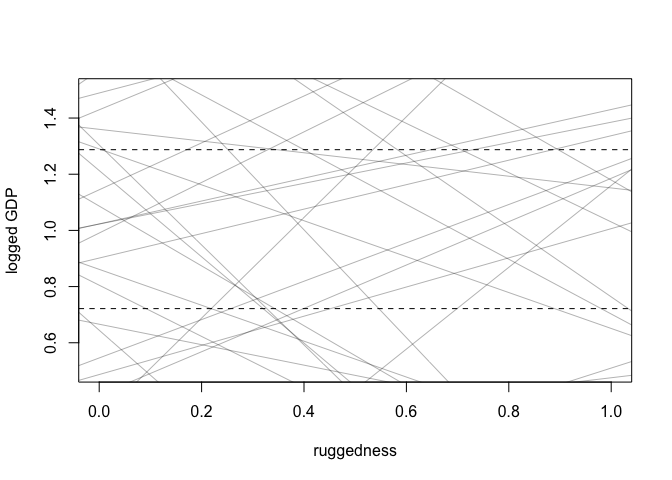
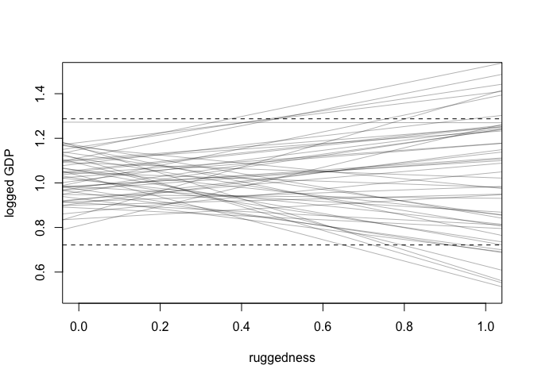
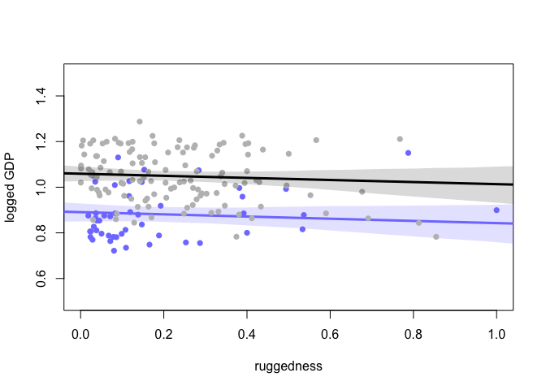
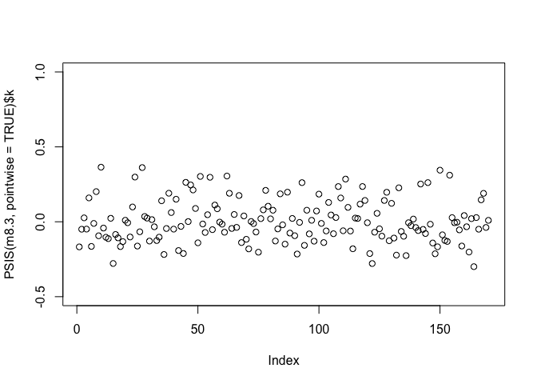
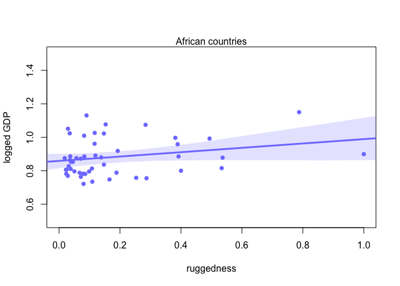
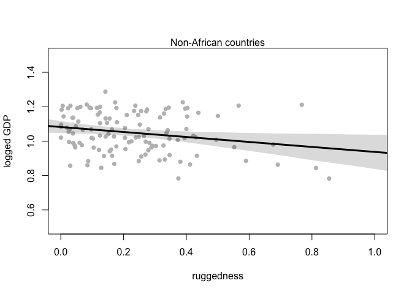
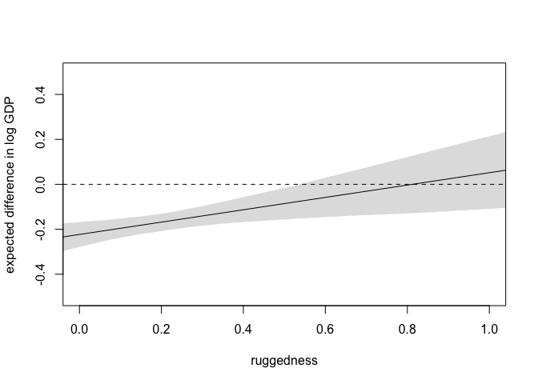
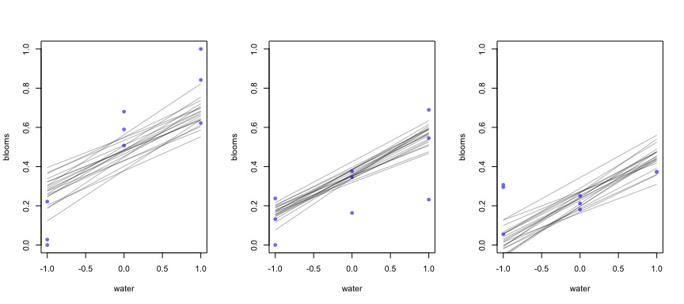
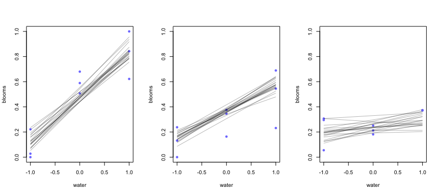

Lecture 7.5: Interaction
================
Yurun (Ellen) Ying
6/5/2022

## Interaction between a cateogorical and a continuous variable

Let’s investigate how ruggedness of a country is associated with its
GDP, and how this association depends on continents.

``` r
data(rugged)
d <- rugged

# make a log version of GDP
# GDP grows exponential - more wealth generates more wealth
# logged GDP is more likely to be linearly associated with other variables
d$log_gdp <- log(d$rgdppc_2000)

# extract countries with gdp datd
d2 <- d[complete.cases(d$rgdppc_2000),]

# standardize the variables
# gdp standardized so that 1 represents global average
d2$log_gdp_std <- d2$log_gdp / mean(d2$log_gdp)
# ruggedness standardized so that the scale is from 0 to 1
d2$rugged_std <- d2$rugged/max(d2$rugged)

m_rugged <- mean(d2$rugged_std)
```

### First model: a linear model of logged GDP regressed on ruggedness.

``` r
m8.1 <- quap(
  alist(
    log_gdp_std ~ dnorm(mu, sigma),
    mu <- a + b * (rugged_std - m_rugged),
    a ~ dnorm(1, 1),
    b ~ dnorm(0, 1),
    sigma ~ dexp(1)
  ),
  data = d2
)

# let's investigate the priors first
set.seed(7)
prior <- extract.prior(m8.1)

plot(NULL, xlim = c(0, 1), ylim = c(0.5, 1.5),
     xlab = "ruggedness", ylab = "logged GDP")
abline(h = min(d2$log_gdp_std), lty = 2)
abline(h = max(d2$log_gdp_std), lty = 2)

# draw 50 lines for the prior
r_seq <- seq(-0.1, 1.1, length.out = 30)
mu <- link(m8.1, post = prior, data = list(rugged_std = r_seq))
for(i in 1:50) lines(r_seq, mu[i,], col = col.alpha("black", 0.3))
```

<!-- -->

Note that this set of priors doesn’t make much sense since many prior
predictions lie outside of possible values. Let’s use more skeptcial
priors.

``` r
m8.1 <- quap(
  alist(
    log_gdp_std ~ dnorm(mu, sigma),
    mu <- a + b * (rugged_std - m_rugged),
    a ~ dnorm(1, 0.1),
    b ~ dnorm(0, 0.3),
    sigma ~ dexp(1)
  ),
  data = d2
)
```

And we can see these priors give lines that are not too extreme.

<!-- -->

``` r
precis(m8.1)
```

    ##              mean          sd        5.5%      94.5%
    ## a     0.999999438 0.010411973  0.98335909 1.01663978
    ## b     0.001990935 0.054793469 -0.08557961 0.08956148
    ## sigma 0.136497417 0.007396154  0.12467693 0.14831790

### Second model: Include being in Africa or not as a predictor

``` r
# make variable to index Africa (1) or not (2)
d2$cid <- ifelse(d2$cont_africa == 1, 1, 2)

m8.2 <- quap(
  alist(
    log_gdp_std ~ dnorm(mu, sigma),
    mu <- a[cid] + b * (rugged_std - m_rugged),
    a[cid] ~ dnorm(1, 0.1),
    b ~ dnorm(0, 0.3),
    sigma ~ dexp(1)
  ),
  data = d2
)

# compare models
# the model including Africa does get better in prediction
compare(m8.1, m8.2)
```

    ##           WAIC       SE    dWAIC      dSE    pWAIC       weight
    ## m8.2 -252.2687 15.30520  0.00000       NA 4.258525 1.000000e+00
    ## m8.1 -188.7551 13.28396 63.51358 15.15303 2.694012 1.615109e-14

A closer look at what’s happening in this model

``` r
precis(m8.2, depth = 2)
```

    ##              mean          sd       5.5%      94.5%
    ## a[1]   0.88041462 0.015936814  0.8549445 0.90588473
    ## a[2]   1.04916612 0.010185665  1.0328875 1.06544478
    ## b     -0.04651407 0.045686705 -0.1195303 0.02650211
    ## sigma  0.11238731 0.006091068  0.1026526 0.12212201

``` r
# contrast and its confidence interval
post <- extract.samples(m8.2)
diff_a1_a2 <- post$a[,1] - post$a[,2] 
mean(diff_a1_a2); PI(diff_a1_a2)
```

    ## [1] -0.1686596

    ##         5%        94% 
    ## -0.1990118 -0.1378490

This means that the difference in the mean GDP between African and
non-African countries is reliably below zero.

``` r
mu_Africa <- link(m8.2, data = data.frame(cid = 1, rugged_std = r_seq))
mu_Africa_mu <- apply(mu_Africa, 2, mean)
mu_Africa_PI <- apply(mu_Africa, 2, PI, prob = .97)
mu_nonAfrica <- link(m8.2, data = data.frame(cid = 2, rugged_std = r_seq))
mu_nonAfrica_mu <- apply(mu_nonAfrica, 2, mean)
mu_nonAfrica_PI <- apply(mu_nonAfrica, 2, PI, prob = .97)

# plot the predictions against data
plot(NULL, xlim = c(0, 1), ylim = c(0.5, 1.5),
     xlab = "ruggedness", ylab = "logged GDP")
points(d2$rugged_std[d2$cid == 1], d2$log_gdp_std[d2$cid == 1],
       col = rangi2, pch = 16)
lines(r_seq, mu_Africa_mu, col = rangi2, lwd = 3)
shade(mu_Africa_PI, r_seq, col = col.alpha(rangi2, 0.2))
points(d2$rugged_std[d2$cid == 2], d2$log_gdp_std[d2$cid == 2],
       col = "gray", pch = 16)
lines(r_seq, mu_nonAfrica_mu, lwd = 3)
shade(mu_nonAfrica_PI, r_seq)
```

<!-- -->

The mean GDP outside of Africa is higher than the mean GPD in Africa,
but the slopes are roughly the same. This means little.

### Third model: Slope also depends on being in Africa or not.

``` r
m8.3 <- quap(
  alist(
    log_gdp_std ~ dnorm(mu, sigma),
    mu <- a[cid] + b[cid] * (rugged_std - m_rugged),
    a[cid] ~ dnorm(1, 0.1),
    b[cid] ~ dnorm(0, 0.3),
    sigma ~ dexp(1)
  ),
  data = d2
)

# compare models
compare(m8.1, m8.2, m8.3, func = PSIS)
```

    ## Some Pareto k values are high (>0.5). Set pointwise=TRUE to inspect individual points.
    ## Some Pareto k values are high (>0.5). Set pointwise=TRUE to inspect individual points.

    ##           PSIS       SE    dPSIS       dSE    pPSIS       weight
    ## m8.3 -259.1326 15.21911  0.00000        NA 5.166186 9.716172e-01
    ## m8.2 -252.0662 15.40452  7.06636  6.670702 4.340930 2.838277e-02
    ## m8.1 -188.5880 13.37072 70.54462 15.467663 2.765885 4.665785e-16

m8.3 has a weight larger than 0.95 and this is a strong support for
choosing m8.3 if our goal is to make prediction. But the 0.03 weight
given to m8.2 suggests that there is a little overfit in m8.3. And the
difference between m8.2 and m8.3 is barely over 0. Maybe need to try
robust regression at this point.

``` r
# see the influential cases
plot(PSIS(m8.3, pointwise = TRUE)$k, ylim = c(-0.5, 1))
```

<!-- -->

Now plot the interaction into separate plots.

``` r
# African countries
mu_Africa <- link(m8.3, data = data.frame(cid = 1, rugged_std = r_seq))
mu_Africa_mu <- apply(mu_Africa, 2, mean)
mu_Africa_PI <- apply(mu_Africa, 2, PI, prob = .97)

plot(NULL, xlim = c(0, 1), ylim = c(0.5, 1.5),
     xlab = "ruggedness", ylab = "logged GDP")
points(d2$rugged_std[d2$cid == 1], d2$log_gdp_std[d2$cid == 1],
       col = rangi2, pch = 16)
lines(r_seq, mu_Africa_mu, col = rangi2, lwd = 3)
shade(mu_Africa_PI, r_seq, col = col.alpha(rangi2, 0.2))
mtext("African countries")
```

<!-- -->

``` r
# non-African countries
mu_nonAfrica <- link(m8.3, data = data.frame(cid = 2, rugged_std = r_seq))
mu_nonAfrica_mu <- apply(mu_nonAfrica, 2, mean)
mu_nonAfrica_PI <- apply(mu_nonAfrica, 2, PI, prob = .97)

plot(NULL, xlim = c(0, 1), ylim = c(0.5, 1.5),
     xlab = "ruggedness", ylab = "logged GDP")
points(d2$rugged_std[d2$cid == 2], d2$log_gdp_std[d2$cid == 2],
       col = "gray", pch = 16)
lines(r_seq, mu_nonAfrica_mu, lwd = 3)
shade(mu_nonAfrica_PI, r_seq)
mtext("Non-African countries")
```

<!-- -->

### Symmetry of interaction

There are two mathematically equivalent interpretations of one
interaction effect.

-   The association between ruggedness and GDP depends on whether the
    country is in Africa.
-   The association between being African countries and GDP depends upon
    ruggedness.

Let’s take a look at the second interpretation

``` r
delta <- mu_Africa - mu_nonAfrica
delta_mu <- apply(delta, 2, mean)
delta_PI <- apply(delta, 2, PI, prob = 0.97)

plot(NULL, xlim = c(0, 1), ylim = c(-0.5, 0.5),
     xlab = "ruggedness", ylab = "expected difference in log GDP")
abline(h = 0, lty = 2)
lines(r_seq, delta_mu)
shade(delta_PI, r_seq)
```

<!-- -->

African countries have lower GDP than non-African countries only when
ruggedness is low. When ruggedness is high, there is little difference
in the GDP of African and non-African countries.

## Continuous interactions

Interactions between continuous variables are harder to interpret. Let’s
see an example of tulip growth affected by water and shade.

``` r
data("tulips")
d <- tulips

# standardization
d$blooms_std <- d$blooms / max(d$blooms) # to preserve the meaningful 0 value
d$water_cent <- d$water - mean(d$water) # centering
d$shade_cent <- d$shade - mean(d$shade)
```

It is reasonable to think alpha has a mean value of 0.5 (which is the
mean of blossom). And the range of blossom is 0 to 1, so we can pick a
prior with a sd of 0.25, which gives a distribution with 95% of likely
values lying between 0 and 1. For the two slopes, we don’t assume any
directions so we choose a mean of 0. The range of water and shades is -1
to 1, which is 2 units. This means range of the slope will be -0.5 to
0.5, which implies a prior with a sd of 0.25.

``` r
# a model without interaction
m8.4 <- quap(
  alist(
    blooms_std ~ dnorm(mu, sigma),
    mu <- a + bw*water_cent + bs*shade_cent,
    a ~ dnorm(0.5, 0.25),
    bw ~ dnorm(0, 0.25),
    bs ~ dnorm(0, 0.25),
    sigma ~ dexp(1)
  ),
  data = d
)

# a model with interaction
# hard to give the interaction term a sensible prior
# let's just use the same as the main effect terms
m8.5 <- quap(
  alist(
    blooms_std ~ dnorm(mu, sigma),
    mu <- a + bw*water_cent + bs*shade_cent + bws*water_cent*shade_cent,
    a ~ dnorm(0.5, 0.25),
    bw ~ dnorm(0, 0.25),
    bs ~ dnorm(0, 0.25),
    bws ~ dnorm(0, 0.25),
    sigma ~ dexp(1)
  ),
  data = d
)
```

Interpret the results with triptych graphs

``` r
# without interaction
par(mfrow = c(1, 3))
for (s in -1:1) {
  idx <- which(d$shade_cent == s)
  plot(d$water_cent[idx], d$blooms_std[idx], xlim = c(-1, 1), ylim = c(0, 1),
       xlab = "water", ylab = "blooms", pch = 16, col = rangi2)
  mu <- link(m8.4, data = data.frame(shade_cent = s, water_cent = -1:1))
  for (i in 1:20) lines(-1:1, mu[i,], col = col.alpha("black", 0.3))
}
```

<!-- -->

The slopes don’t change with different values of shade, but the lines do
sink down, meaning that shade has negative influences on tulips bloom.

``` r
# with interaction
par(mfrow = c(1, 3))
for (s in -1:1) {
  idx <- which(d$shade_cent == s)
  plot(d$water_cent[idx], d$blooms_std[idx], xlim = c(-1, 1), ylim = c(0, 1),
       xlab = "water", ylab = "blooms", pch = 16, col = rangi2)
  mu <- link(m8.5, data = data.frame(shade_cent = s, water_cent = -1:1))
  for (i in 1:20) lines(-1:1, mu[i,], col = col.alpha("black", 0.3))
}
```

<!-- -->

The slopes change with different values of shade, meaning that when
light is weak, the effect of water on blooms also gets weak.
