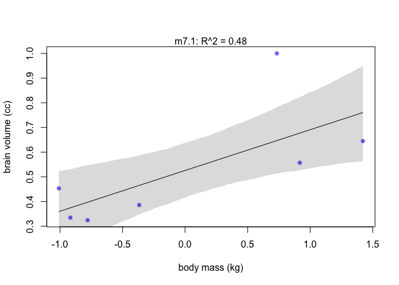
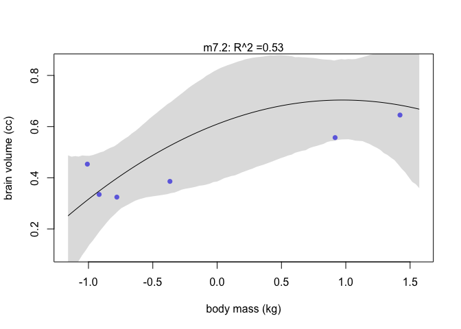
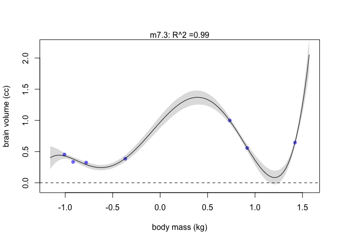
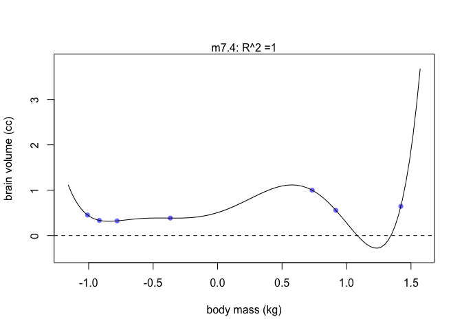
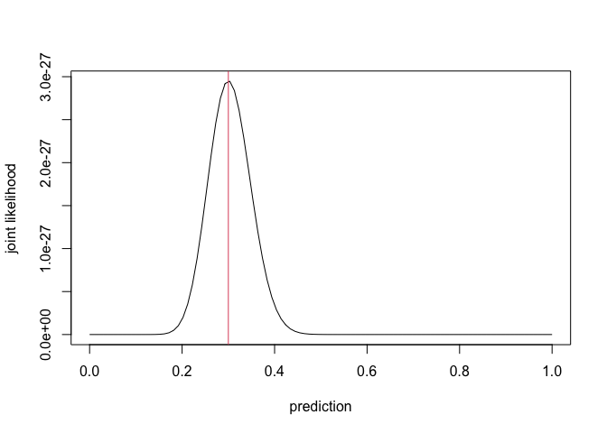
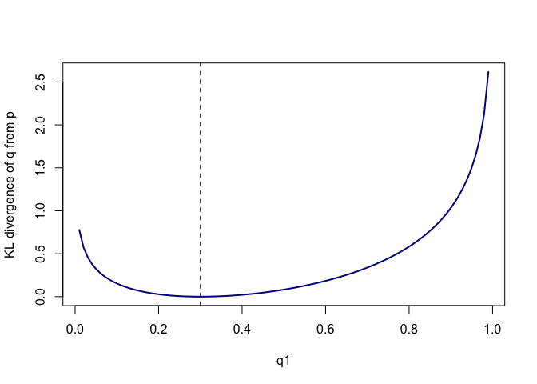
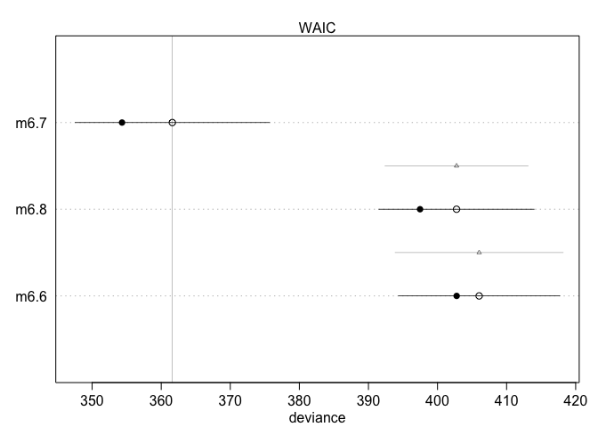

Lecture 7: Overfitting
================
Yurun (Ellen) Ying
6/3/2022

## Overfitting and flexibility of model

``` r
# construct a data frame
sppnames <- c("afarensis", "africanus", "habilis", "boisei",  "rudolfensis", "ergaster", "sapiens")
brainvolcc <- c(438, 452, 612, 521, 752, 871, 1350)
masskg <- c(37.0, 35.5, 34.5, 41.5, 55.5, 61.0, 53.5)
d <- data.frame(species = sppnames, brain = brainvolcc, mass = masskg)

# standardize the variables
d$mass_std <- (d$mass - mean(d$mass)) / sd(d$mass)
d$brain_std <- d$brain / max(d$brain)
```

``` r
# first try to fit a linear model
m7.1 <- quap(
  alist(
    brain_std ~ dnorm(mu, exp(log_sigma)),
    mu <- a + b * mass_std,
    a ~ dnorm(0.5, 1),
    b ~ dnorm(0, 10),
    log_sigma ~ dnorm(0, 1)
  ),
  data = d
)

# one measure of fit is R^2
set.seed(12)
s <- sim(m7.1)
r <- apply(s, 2, mean) - d$brain_std
resid_var <- var2(r)
outcome_var <- var2(d$brain_std)
1 - resid_var / outcome_var
```

    ## [1] 0.477459

``` r
# plot the model
mass_seq <- seq(min(d$mass_std), max(d$mass_std), length.out = 100)
mu <- link(m7.1, data = list(mass_std = mass_seq))
mu_mean <- apply(mu, 2, mean)
mu_ci <- apply(mu, 2, PI, prob = 0.89)
plot(brain_std ~ mass_std, data = d, col = rangi2, pch = 16,
     xlab = "body mass (kg)", ylab = "brain volume (cc)")
lines(mass_seq, mu_mean)
shade(mu_ci, mass_seq)
mtext(paste("m7.1:", "R^2 =", round(1 - resid_var / outcome_var, 2)))
```

<!-- -->

We can construct functions to do plotting and calculate R<sup>2</sup>
for us

``` r
# write a function to calculate R^2
R_is_bad <- function(quap_fit) {
  
  s <- sim(quap_fit, refresh = 0)
  r <- apply(s, 2, mean) - d$brain_std
  1 - var2(r) / var2(d$brain_std)
  
}

# function to plot the model
overfitting_is_bad <- function(quap_fit) {
  
  # plotting
  mass_seq <- seq(min(d$mass_std) - 0.15, max(d$mass_std) + 0.15, length.out = 100)
  mu <- link(quap_fit, data = list(mass_std = mass_seq))
  mu_mean <- apply(mu, 2, mean)
  mu_ci <- apply(mu, 2, PI, prob = 0.89)
  plot(brain_std ~ mass_std, data = d, col = rangi2, pch = 16,
       xlim = c(min(d$mass_std) - 0.15, max(d$mass_std) + 0.15),
       ylim = c(min(mu_mean) - 0.15, max(mu_mean) + 0.15),
       xlab = "body mass (kg)", ylab = "brain volume (cc)")
  lines(mass_seq, mu_mean)
  shade(mu_ci, mass_seq)
  abline(h = 0, lty = 2)
  
  # display the r2 value
  model_name <- deparse(substitute(quap_fit))
  r2 <- R_is_bad(quap_fit)
  mtext(paste0(model_name, ": ", "R^2 =", round(r2, 2)))
}
```

We can go ahead and add polynomial terms of higher order

``` r
# add a quadratic term
m7.2 <- quap(
  alist(
    brain_std ~ dnorm(mu, exp(log_sigma)),
    mu <- a + b[1] * mass_std + b[2] * mass_std^2,
    a ~ dnorm(0.5, 1),
    b ~ dnorm(0, 10),
    log_sigma ~ dnorm(0, 1)
  ),
  data = d, star = list(b = rep(0, 2))
)

overfitting_is_bad(m7.2)
```

<!-- -->

``` r
# directly skip to adding the 5th and 6th degree polynomials
m7.3 <- quap(
  alist(
    brain_std ~ dnorm(mu, exp(log_sigma)),
    mu <- a + b[1] * mass_std + b[2] * mass_std^2 +
      b[3] * mass_std^3 + b[4] * mass_std^4 +
      b[5] * mass_std^5,
    a ~ dnorm(0.5, 1),
    b ~ dnorm(0, 10),
    log_sigma ~ dnorm(0, 1)
  ),
  data = d, star = list(b = rep(0, 5))
)
overfitting_is_bad(m7.3)
```

<!-- -->

``` r
# here the sigma becomes 0.001
# this is because 6 terms will fit the data exactly 
# and the sigma will shrink to zero
m7.4 <- quap(
  alist(
    brain_std ~ dnorm(mu, 0.001),
    mu <- a + b[1] * mass_std + b[2] * mass_std^2 +
      b[3] * mass_std^3 + b[4] * mass_std^4 +
      b[5] * mass_std^5 + b[6] * mass_std^6,
    a ~ dnorm(0.5, 1),
    b ~ dnorm(0, 10),
    log_sigma ~ dnorm(0, 1)
  ),
  data = d, star = list(b = rep(0, 6))
)

# this is really bad because the predictions of brain volume goes under 0
# apparently a very silly thing
overfitting_is_bad(m7.4)
```

<!-- -->

A problem with R<sup>2</sup> in the context of Bayesian statistics is
that it only deals with the predictions of the means. This is bad
because this throws away information in the posterior distribution.

## The concept of information criteria

### Measuring accuracy

The first thing we need to know is how to measure the predictive
accuracy of some prediction methods. The logical way is to choose a
measurement that is maximized when we know the true data generating
model. This is the joint likelihood of a prediction being correct for a
sequence of data. Let’s try a simulation.

``` r
# there is a 30% likelihood of raining 
set.seed(1999)
days <- 100
# get a sequence of weather
weather <- c(rep(1, days*0.3), rep(0, days*0.7))
# the joint likelihood of being right when using different predictions
pred_rain <- seq(0, 1, length.out = days)
joint_l <- pred_rain^(sum(weather)) * (1 - pred_rain)^(days - sum(weather))
# we can see the joint likelihood is maximized when the prediction is the same as the true model
plot(pred_rain, joint_l, type = "l",
     xlab = "prediction", ylab = "joint likelihood")
abline(v = 0.3, col = 2)
```

<!-- -->

In statistics literature, people usually report the logarithm of the
joint probability. This is called **log scoring rule**.

### The distance from the target and uncertainty

The next thing we need to do is to know how far is our prediction from
our target - the true model. From the perspective of information theory,
this question become: how much is uncertainty reduced after learning an
outcome? So the question is turned into how to measure uncertainty. In
developing this measure, there are three assumptions:

1.  Uncertainty should be continuous
2.  Uncertainty increases when the number of possible events increases
3.  Uncertainty is additive

We use **information entropy** to measure uncertainty:

 = -E(\log{p_i}) = -\sum_{i = 1}^{n}p_i \log{p_i}")

In plain words: **The uncertainty contained in a probability
distribution is the average log-probability of an event**

``` r
# when there are 2 events
prob <- c(0.3, 0.7)
-sum(prob * log(prob))
```

    ## [1] 0.6108643

``` r
# when there are 3 events
prob <- c(0.1, 0.3, 0.6)
-sum(prob * log(prob))
```

    ## [1] 0.8979457

The uncertainty is higher when there are more events in a distribution

Going back to the problem of measuring the distance between our
prediction and the target. The question is now: what is the additional
uncertainty induced by using probability from one distribution to
describe another. This is called **KL-divergence**:

 &= H(p,q) - H(q) \\
&= (-\sum_i p_i \log(q_i)) -(-\sum_i p_i \log(p_i)) \\
&= \sum_i p_i (\log{p_i} - \log{q_i}) \\
\end{aligned}")

``` r
# real probabilities
prob <- c(0.3, 0.7)
# prediction
num <- 100
a <- seq(0, 1, length.out = num); a[1] <- .01; a[num] <- .99
b <- 1 - a
# calculate the KL divergence of each pair of prediction from the true value
kl <- sapply(1:num, 
             function(i) (-(prob[1]*log(a[i]) + prob[2]*log(b[i]))) - (-sum(prob*log(prob)))
             )
plot(a, kl, type = "l", col = "darkblue", lwd = 2,
     xlab = "q1", ylab = "KL divergence of q from p")
abline(v = prob[1], lty = 2)
```

<!-- -->

The divergence increases when the values of q gets far away from the
true value p. When they are the same, the divergence is zero.

### Applying entropy to evaluate predictive accuracy in statistical modelling

We can calculate the divergence when we know the true model, but in
statistical modeling, we will never know the true model. However, it
still helps to compare different models and see which one is the best.
We use the concept of information entropy to calculate the
**log-pointwise-predictive-density**:

 = \sum_i \log p(y_i) = \sum_i \log \frac{1}{S} \sum_S p(y_i|\Theta_S)")

where

is the number of parameter samples and

is the
th
set of sample of parameter. We calculate the expected uncertainty
without normalizing by dividing with the number of observations
(")).
In the Bayesian context, the probability of each observation given the
psterior distribution is calculated over the posterior distribution.

## Use log-pointwise predictive density to estimate model fit

``` r
set.seed(1)
logprob <- sim(m7.1, ll = TRUE, n = 1e4) # return log probability
n <- ncol(logprob)
ns <- nrow(logprob)
f <- function(i) log_sum_exp(logprob[,i]) - log(ns)
lppd <- sapply(1:n, f)

# an automatic function
lppd(m7.1, n = 1e4)
```

    ## [1]  0.6116813  0.6488241  0.5447986  0.6277991  0.4639025  0.4263197 -0.8522590

``` r
# calculate the total score for each model
sapply(list(m7.1, m7.2, m7.3, m7.4), function(x) sum(lppd(x)))
```

    ## [1]  2.487268  2.572391 14.123991 39.519193

We can see models with more polynomials have higher scores. Models with
additional predictors always improve deviance on training data, but
deviance on future data may or may not, depending upon the true data
generating process and how much data is available to estimate the
parameters.

## Predicting predictive accuracy

We can’t, by definition, get an out-of-sample score of deviance, so we
use alternative strategies to approximate it.

### Cross-validation

Actual cross-validation is sometimes computational expensive, especially
for leave-one-out cross-validation. We try to approximate instead:
Pareto-smoothed importance sampling cross-validation (PSIS). (Importance
sampling is to use the reversed probability of the ommitted case to
weight the probability of this case so that we can an approximation of
the probability of this case in the leave-one-out posterior
distribution.)

``` r
# the estimation is safe when k < 0.7
# the funciton gives warning when this value is too large
PSIS(m7.1)
```

    ## Some Pareto k values are very high (>1). Set pointwise=TRUE to inspect individual points.

    ##       PSIS      lppd  penalty  std_err
    ## 1 15.00957 -7.504785 10.00849 15.85571

### Information criteria

#### Akaike Information Criteria (AIC)

The deviance of out-of-sample prediction is lerger than that of
in-sample prediction by 2k, where k is the number of free parameters

Assumptions:

-   Flat priors
-   Posterior distribution being multivariate Gaussian
-   N \>\> k

#### Widely Applicable Information Criteria (WAIC)

An improvement on AIC. Doesn’t assuming the shape of the posterior. Gets
very close to the results from cross-validation in large samples.

The penalty term is called effective number of parameters (just
overfitting penalty, has nothing to do with the number of parameters in
fact)

``` r
WAIC(m7.1)
```

    ##       WAIC     lppd  penalty std_err
    ## 1 4.898273 2.477485 4.926622  8.7289

How to calculate WAIC

``` r
# use data "cars" to fit a simple model
data("cars")
d <- cars
set.seed(77)
m <- quap(
  alist(
    dist ~ dnorm(mu, sigma),
    mu <- a + b * speed,
    a ~ dnorm(0, 100),
    b ~ dnorm(0, 10),
    sigma ~ dexp(1)
  ),
  data = d
)
n_samples <- 1000
post <- extract.samples(m, n = n_samples)

# we need the log likelihood for each observation in the data
log_prob <- sapply(1:n_samples,
                   function(s) {
                     mu <- post$a[s] + post$b[s] * cars$speed
                     dnorm(cars$dist, mu, post$sigma[s], log = TRUE)
                   })

# calculate the lppd for each point
n_cases <- nrow(cars)
lppd <- sapply(1:n_cases, function(i) log_sum_exp(log_prob[i,]) - log(n_samples))

# the penalty term
pWAIC <- sapply(1:n_cases, function(i) var(log_prob[i,]))

# compute the WAIC
-2 * (sum(lppd) - sum(pWAIC))
```

    ## [1] 422.9191

``` r
# calculate the standard error
waic_vec <- -2*(lppd - pWAIC)
sqrt(n_cases*var(waic_vec))
```

    ## [1] 17.81003

## Model comparison

Never do model selection because this discards information associated
with the difference between models in their predictive accuracy.

### Comparing predictive accuracy vs. comparing model for causal inference

Using the fungus data from the last chapter, let’s see how measures of
out-of-sample predictive accuracy behaves in different models. Note m6.6
is a model of height, m6.7 is the model with both treatment and fungus
as predictors, and m6.8 only has treatment as a predictor.

``` r
set.seed(77)
compare(m6.6, m6.7, m6.8, func = WAIC)
```

    ##          WAIC       SE    dWAIC      dSE    pWAIC       weight
    ## m6.7 361.8901 14.26191  0.00000       NA 3.839493 1.000000e+00
    ## m6.8 402.7753 11.28120 40.88517 10.47814 2.645589 1.324032e-09
    ## m6.6 405.9174 11.66153 44.02729 12.23018 1.582861 2.751664e-10

WAIC and SE are the WAIC for each model and their standard errors. dWAIC
and dSE are the difference of WAIC from the best model (with the lowest
WAIC) and the standard error of the contrast. pWAIC is the penalty term.

This is how dSE is calculated:

``` r
set.seed(91)
waic_6.7 <- WAIC(m6.7, pointwise = TRUE)$WAIC
waic_6.8 <- WAIC(m6.8, pointwise = TRUE)$WAIC
diff_6.7_6.8 <- waic_6.8 - waic_6.7
sqrt(length(diff_6.7_6.8) * var(diff_6.7_6.8))
```

    ## [1] 10.35785

Visually showing the predictive accuracy:

``` r
plot(compare(m6.6, m6.7, m6.8, func = WAIC))
```

<!-- -->

The solid points are in-sample deviance values and the hollow points are
out-of-sample deviance. The triangles are contrasts. We can see m6.8 and
m6.7 are easily distinguished by out-of-sample predictive accuracy.

It is also notable that m6.6 and m6.8 don’t seem to differ a lot in
out-of-sample predictive accuracy. Let’s calculate the SE of contrast

``` r
set.seed(92)
waic_6.6 <- WAIC(m6.6, pointwise = TRUE)$WAIC
diff_6.6_6.8 <- waic_6.6 - waic_6.8
dse_6.6_6.8 <- sqrt(length(diff_6.6_6.8) * var(diff_6.6_6.8))
dse_6.6_6.8
```

    ## [1] 4.858914

``` r
# and the 99% confidence interval of the contrast is
sum(waic_6.6) - sum(waic_6.8) + c(-1, 1)*dse_6.6_6.8*2.6
```

    ## [1] -9.228259 16.038095

m6.6 and m6.8 are not easily distinguished by out-of-sample accuracy.
This is plausible even if m6.8 is a causally accurate model. It doesn’t
have better predictive accuracy probably because treatment contributes
little to the outcome and there are many other factors influencing the
plant height.

### Inspecting individual points in the model

We use the divorce data the its three models to see how deviance (PSIS)
can be used to detect outliers and how to cope with it. m5.1 is a model
of divorce rate regressed on median age at marriage, m5.2 is regressed
on marriage rate, m5.3 includes both predictors.

``` r
compare(m5.1, m5.2, m5.3, func = PSIS)
```

    ## Some Pareto k values are high (>0.5). Set pointwise=TRUE to inspect individual points.
    ## Some Pareto k values are high (>0.5). Set pointwise=TRUE to inspect individual points.
    ## Some Pareto k values are high (>0.5). Set pointwise=TRUE to inspect individual points.

    ##          PSIS       SE     dPSIS        dSE    pPSIS      weight
    ## m5.1 127.7848 15.11284  0.000000         NA 4.837889 0.758744154
    ## m5.3 130.0919 15.45087  2.307051  0.9875337 6.259637 0.239400791
    ## m5.2 139.8123 10.81476 12.027500 11.1995088 3.290536 0.001855055

We can see the warning messages given by function. Pareto k values
larger than 0.5 mean that the points are highly influential to the
model. We need to inspect the data point by point to see which points
they are.

``` r
set.seed(24071847)
PSIS_m5.3 <- PSIS(m5.3, pointwise = TRUE)
```

    ## Some Pareto k values are very high (>1). Set pointwise=TRUE to inspect individual points.

``` r
set.seed(24071847)
WAIC_m5.3 <- WAIC(m5.3, pointwise = TRUE)

# The point with the highest Pareto k is Idaho
d$Location[which.max(PSIS_m5.3$k)]
```

    ## [1] Idaho
    ## 50 Levels: Alabama Alaska Arizona Arkansas California Colorado ... Wyoming

``` r
# plot k value from PSIS against penalty of WAIC of individual point
plot(PSIS_m5.3$k, WAIC_m5.3$penalty,
     xlab = "PSIS Pareto k", ylab = "WAIC penalty",
     col = rangi2, lwd = 2)
abline(v = 0.5, lty = 2)
```

<!-- -->

Points with high Pareto k also has high penalty from WAIC. The function
to calculate PSIS warns us against them, but the function for WAIC
doesn’t. However, in actual calculation, both methods consider the
influentialness of each point.

To deal with influential cases, we use robust regression to fit the
data, which is less excited about uncommon cases. One common robust
regression is regression models using Student’s *t* distribution. It has
thicker tails than Gaussian distributions.

``` r
m5.3t <- quap( 
  alist(
    D ~ dstudent(2, mu, sigma), 
    mu <- a + bM*M + bA*A,
    a ~ dnorm(0, 0.2),
    bM ~ dnorm(0, 0.5),
    bA ~ dnorm(0 ,0.5),
    sigma ~ dexp(1) 
    ) , 
  data = d2)

# when we try to calculate PSIS, the function doesn't give warnings anymore
PSIS(m5.3t)
```

    ##       PSIS      lppd  penalty  std_err
    ## 1 133.7104 -66.85521 6.845203 11.94534

``` r
# the Pareto k values are less than 0.5
m5.3t_psis <- PSIS(m5.3t, pointwise = TRUE)
plot(m5.3t_psis$k)
```

<!-- -->
