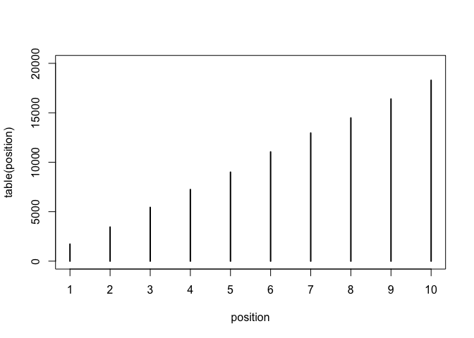
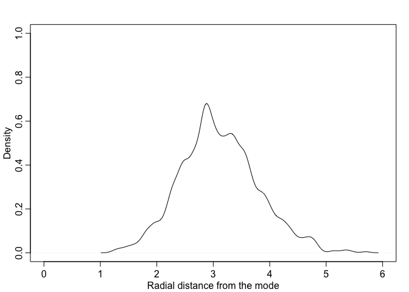
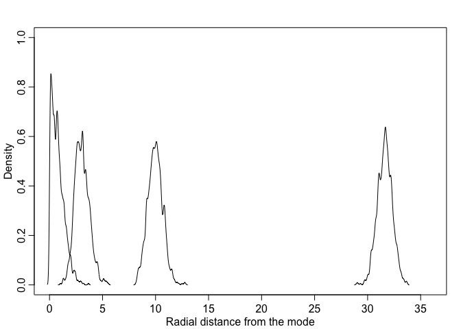
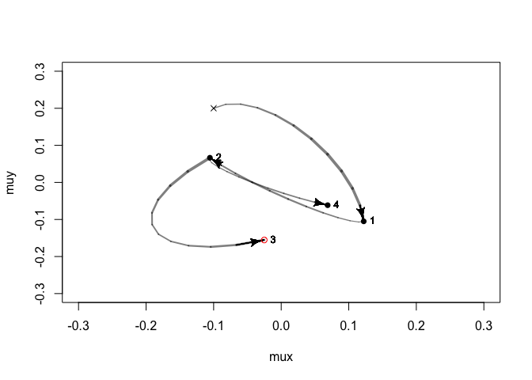
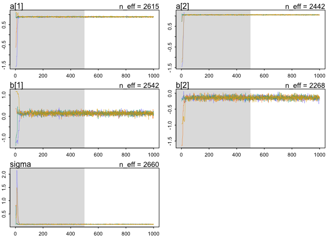
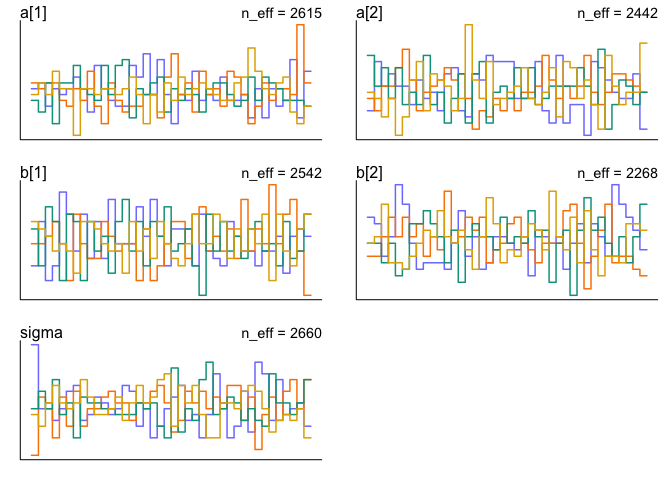
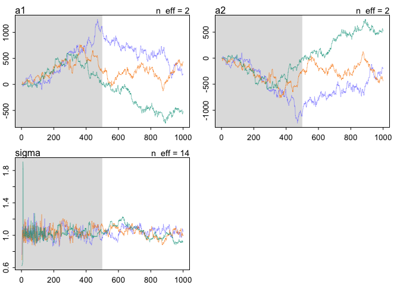
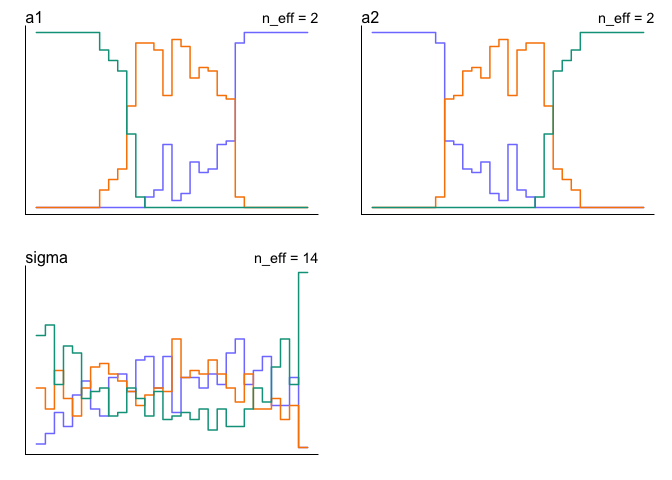
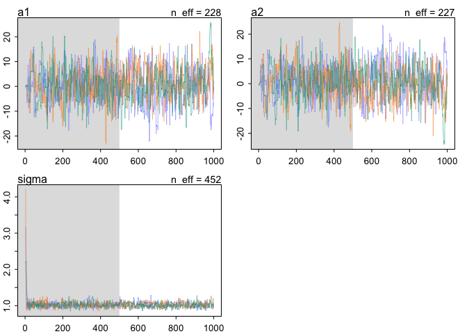
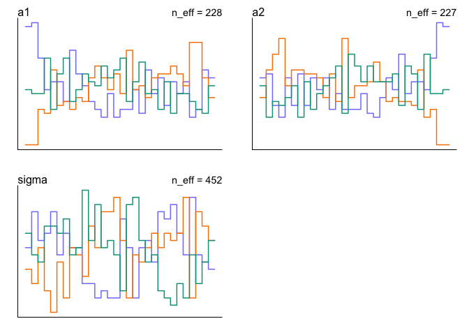

Lecture 8: MCMC
================
Yurun (Ellen) Ying
2022-06-07

## Good king Markov

A toy example to illustrate the idea behind MCMC. Making proposal of
moving to sample from points even we don’t know the entire distribution.

``` r
num_weeks <- 1e5
position <- rep(0, num_weeks)
current <- 10
for (i in 1:num_weeks) {
  
  # record current location
  position[i] <- current
  
  # flip a coin to decide which way to move
  proposal <- current + sample(c(-1,1), size = 1)
  
  # make sure the end values connect in a ring
  if (proposal > 10) proposal <- 1
  if (proposal < 1) proposal <- 10
  
  # move?
  prob_move <- proposal / current
  current <- ifelse(runif(1) < prob_move, proposal, current)
}

plot(table(position), ylim =  c(0, 2e4))
```

<!-- -->

The number of weeks king Markov has spent on each island turns out ot
proportional to each island’s population.

## MCMC algorithms

### Old-school algorithms

1.  Metropolis algorithm: This is the vanilla version of MCMC. Simple to
    code but inefficient.
2.  Metropolis-Hastings algorithm: Based on Metropolis but asymmetric.
    Probability of A to B is different from B to A.
3.  Gibbs sampling: more efficient as it adapts parameter proposals
    based on the current parameter.

All these approaches have some weakness:

-   Easily get stuck in a small region, especially when parameters are
    highly correlated with each other
-   In large models with high dimensions, the most of probability mass
    is far from the mode of the distribution. And this **concentration
    of measure** creates problem to these appraaches.

``` r
# an example of concentration of measure
dimension <- 10
n_sample <- 1e3
y <- rmvnorm(n_sample, mean = rep(0, dimension), diag(dimension))
rad_dist <- function(y) sqrt(sum(y^2))
rd <- sapply(1:n_sample, function(i) rad_dist(y[i,]))
dens(rd, xlim = c(0,6), ylim = c(0,1),
     xlab = "Radial distance from the mode")
```

<!-- -->

``` r
# plot higher dimensions
rad_dist_sim <- function(n_sample = 1e3, dimension = 1) {
  
  y <- rmvnorm(n_sample, mean = rep(0, dimension), diag(dimension))
  rad_dist <- function(y) sqrt(sum(y^2))
  rd <- sapply(1:n_sample, function(i) rad_dist(y[i,]))
  dens(rd, add = TRUE)
}

plot(NULL, xlim = c(0,36), ylim = c(0,1),
     xlab = "Radial distance from the mode", ylab = "Density")
for(i in c(1, 10, 100, 1000)) rad_dist_sim(dimension = i)
```

<!-- -->

When there are more parameters, their distribution moves away from the
distribution of each individual Gaussian distribution.

### Hamilton Monte Carlo

Suppose we have a data of 100

and 100
,
all sampled from Normal(0,1). Our statistical model is:

")

")

")

")

We need 5 things to use Hamilton Monte Carlo to sample from the
posterior distribution:

1.  a function U that returns the negative log-probability of the data
    at the current position (parameter values)

In math, this function is:

 + \sum_i \log p(x_i|\mu_x,1) + \log p(\mu_y|0,0.5) + \log p(\mu_x|0,0.5)")

``` r
# U needs to return neg-log-probability
U <- function(q, a = 0, b = 0.5, k = 0, d = 0.5) {
  muy <- q[1]
  mux <- q[2]
  U <- sum(dnorm(y, muy, 1, log = TRUE) + sum(dnorm(x, mux, 1, log = TRUE)) + dnorm(muy, a, b, log = TRUE) + dnorm(mux, k, d, log = TRUE))
  return(-U)
}
```

2.  a function grad_U that returns the gradient of the negative
    log-probability at the current position

This is two partial derivatives with regard to

and
.
In mathematical forms, they are:

}{\partial \mu_x} + \frac{\partial \log N(\mu_x|0,0.5)}{\partial \mu_x} = \sum_i \frac{x_i - \mu_x}{1^2} + \frac{0 - \mu_x}{0.5^2}")

}{\partial \mu_y} + \frac{\partial \log N(\mu_y|0,0.5)}{\partial \mu_y} = \sum_i \frac{y_i - \mu_y}{1^2} + \frac{0 - \mu_y}{0.5^2}")

``` r
# gradient function
U_grad <- function(q, a = 0, b = 0.5, k = 0, d = 0.5) {
  muy <- q[1]
  mux <- q[2]
  G1 <- sum(y - muy) + (a - muy)/b^2 # with respect to muy
  G2 <- sum(x - mux) + (k - mux)/d^2 # with respect to mux
  return(c(-G1, -G2))
}
```

3.  a step size
    
4.  a count of leapfrog steps L
5.  a starting position

All of them are knitted together to get a sample

``` r
HMC2 <- function(U, grad_U, epsilon, L, current_q){
  q <- current_q
  p <- rnorm(length(1), 0, 1) # random flick (momentum)
  current_p <- p
  
  # make a half step for momentum at the beginning
  p <- p - epsilon * grad_U(q) / 2
  
  # initialize bookkeeping - saves trajectory
  qtraj <- matrix(NA, nrow = L+1, ncol = length(q))
  ptraj <- qtraj
  qtraj[1,] <- current_q
  ptraj[1,] <- p
  
  # use gradient to compute the approximation of the log posterior surface of each point
  # walk by full steps for position and momentum
  for (i in 1:L) {
    
    q <- q + epsilon * p # full steps for the position
    # make full steps for the momentum, except at the end of the trajectory
    if (i != L) {
      p <- p - epsilon * grad_U(q)
      ptraj[i+1,] <- p
    }
    
    # record the position
    qtraj[i+1,] <- q
  }
  
  # make a half step for momentum at the end
  p <- p - epsilon * grad_U(q) / 2
  ptraj[L+1,] <- p
  
  # negate momentum at end of trajectory to make the proposal symmetric
  p <- -p
  
  # evaluate kinetic energies at start and end of trajectory
  current_U <- U(current_q)
  current_K <- sum(current_p^2)/2
  proposed_U <- U(q)
  proposed_K <- sum(p^2) / 2
  
  # reject or accept the end of the trajectory based on kinetic energy
  # return either the end of the trajectory or the current position
  accept <- 0
  if(runif(1) < exp(current_U - proposed_U + current_K - proposed_K)) {
    new_q <- q # accept
    accept <- 1
  } else new_q <- current_q # reject
  
  return(list(q = new_q, traj = qtraj, ptraj = ptraj, accept = accept))
}
```

Plot four chains

``` r
# simulate some data
set.seed(7)
y <- rnorm(50)
x <- rnorm(50)
y <- as.numeric(scale(y))
x <- as.numeric(scale(x))

library(shape)
Q <- list()
Q$q <- c(-0.1, 0.2) # current position
pr <- 0.3
step <- 0.03 # epsilon
L <- 11 # step size
path_col <- col.alpha("black", 0.5)
n_samples <- 4

plot(NULL, ylab = "muy", xlab = "mux",
     xlim = c(-pr, pr), ylim = c(-pr, pr))
points(Q$q[1], Q$q[2], pch = 4, col = "black")
for(i in 1:n_samples) {
  
  Q <- HMC2(U, U_grad, step, L, Q$q)
  
  if (n_samples < 10) {
    for (j in 1:L) {
      K0 <- sum(Q$ptraj[j,]^2)/2 # kinetic energy
      lines(Q$traj[j:(j+1),1], Q$traj[j:(j+1),2], col = path_col, lwd = 1+2*K0)
      points(Q$traj[1:L+1], pch = 16, col = "white", cex = 0.35)
      Arrows(Q$traj[L,1], Q$traj[L,2], Q$traj[L+1,1], Q$traj[L+1,2],
             arr.length = 0.35, arr.adj = 0.7)
      text(Q$traj[L+1,1], Q$traj[L+1,2], i, cex = 0.8, pos = 4, offset = 0.4)
    }
    
    points(Q$traj[L+1,1], Q$traj[L+1,2], 
           pch = ifelse(Q$accept == 1, 16, 1),
           col = ifelse(Q$accept == 1, "black", "red"))
  }
}
```

<!-- -->

## Use easy HMC to fit data

``` r
# read data
data(rugged)
d <- rugged
d$log_gdp <- log(d$rgdppc_2000)
dd <- d[complete.cases(d$rgdppc_2000), ]
dd$log_gdp_std <- dd$log_gdp / mean(dd$log_gdp)
dd$rugged_std <- dd$rugged / max(dd$rugged)
dd$cid <- ifelse(dd$cont_africa == 1, 1, 2)

# get a clean dataset with only the variables we need
dat_slim <- list(
  log_gdp_std = dd$log_gdp_std,
  rugged_std = dd$rugged_std,
  cid = as.integer(dd$cid)
)

# fit the model using the ulam function
m9.1 <- ulam(
  alist(
    log_gdp_std ~ dnorm(mu, sigma),
    mu <- a[cid] + b[cid]*(rugged_std - 0.215),
    a[cid] ~ dnorm(1, 0.1),
    b[cid] ~ dnorm(0, 0.3),
    sigma ~ dexp(1)
  ), 
  data = dat_slim, 
  chains = 4,
  cores = 4
)
```

    ## Running MCMC with 4 parallel chains, with 1 thread(s) per chain...
    ## 
    ## Chain 1 Iteration:   1 / 1000 [  0%]  (Warmup) 
    ## Chain 1 Iteration: 100 / 1000 [ 10%]  (Warmup) 
    ## Chain 1 Iteration: 200 / 1000 [ 20%]  (Warmup) 
    ## Chain 1 Iteration: 300 / 1000 [ 30%]  (Warmup) 
    ## Chain 1 Iteration: 400 / 1000 [ 40%]  (Warmup) 
    ## Chain 1 Iteration: 500 / 1000 [ 50%]  (Warmup) 
    ## Chain 1 Iteration: 501 / 1000 [ 50%]  (Sampling) 
    ## Chain 1 Iteration: 600 / 1000 [ 60%]  (Sampling) 
    ## Chain 1 Iteration: 700 / 1000 [ 70%]  (Sampling) 
    ## Chain 2 Iteration:   1 / 1000 [  0%]  (Warmup) 
    ## Chain 2 Iteration: 100 / 1000 [ 10%]  (Warmup) 
    ## Chain 2 Iteration: 200 / 1000 [ 20%]  (Warmup) 
    ## Chain 2 Iteration: 300 / 1000 [ 30%]  (Warmup) 
    ## Chain 2 Iteration: 400 / 1000 [ 40%]  (Warmup) 
    ## Chain 2 Iteration: 500 / 1000 [ 50%]  (Warmup) 
    ## Chain 2 Iteration: 501 / 1000 [ 50%]  (Sampling) 
    ## Chain 2 Iteration: 600 / 1000 [ 60%]  (Sampling) 
    ## Chain 2 Iteration: 700 / 1000 [ 70%]  (Sampling) 
    ## Chain 2 Iteration: 800 / 1000 [ 80%]  (Sampling) 
    ## Chain 3 Iteration:   1 / 1000 [  0%]  (Warmup) 
    ## Chain 3 Iteration: 100 / 1000 [ 10%]  (Warmup) 
    ## Chain 3 Iteration: 200 / 1000 [ 20%]  (Warmup) 
    ## Chain 3 Iteration: 300 / 1000 [ 30%]  (Warmup) 
    ## Chain 3 Iteration: 400 / 1000 [ 40%]  (Warmup) 
    ## Chain 3 Iteration: 500 / 1000 [ 50%]  (Warmup) 
    ## Chain 3 Iteration: 501 / 1000 [ 50%]  (Sampling) 
    ## Chain 3 Iteration: 600 / 1000 [ 60%]  (Sampling) 
    ## Chain 3 Iteration: 700 / 1000 [ 70%]  (Sampling) 
    ## Chain 3 Iteration: 800 / 1000 [ 80%]  (Sampling) 
    ## Chain 4 Iteration:   1 / 1000 [  0%]  (Warmup) 
    ## Chain 4 Iteration: 100 / 1000 [ 10%]  (Warmup) 
    ## Chain 4 Iteration: 200 / 1000 [ 20%]  (Warmup) 
    ## Chain 4 Iteration: 300 / 1000 [ 30%]  (Warmup) 
    ## Chain 4 Iteration: 400 / 1000 [ 40%]  (Warmup) 
    ## Chain 4 Iteration: 500 / 1000 [ 50%]  (Warmup) 
    ## Chain 4 Iteration: 501 / 1000 [ 50%]  (Sampling) 
    ## Chain 4 Iteration: 600 / 1000 [ 60%]  (Sampling) 
    ## Chain 4 Iteration: 700 / 1000 [ 70%]  (Sampling) 
    ## Chain 1 Iteration: 800 / 1000 [ 80%]  (Sampling) 
    ## Chain 1 Iteration: 900 / 1000 [ 90%]  (Sampling) 
    ## Chain 1 Iteration: 1000 / 1000 [100%]  (Sampling) 
    ## Chain 1 finished in 0.2 seconds.
    ## Chain 2 Iteration: 900 / 1000 [ 90%]  (Sampling) 
    ## Chain 2 Iteration: 1000 / 1000 [100%]  (Sampling) 
    ## Chain 2 finished in 0.2 seconds.
    ## Chain 3 Iteration: 900 / 1000 [ 90%]  (Sampling) 
    ## Chain 3 Iteration: 1000 / 1000 [100%]  (Sampling) 
    ## Chain 4 Iteration: 800 / 1000 [ 80%]  (Sampling) 
    ## Chain 4 Iteration: 900 / 1000 [ 90%]  (Sampling) 
    ## Chain 4 Iteration: 1000 / 1000 [100%]  (Sampling) 
    ## Chain 3 finished in 0.2 seconds.
    ## Chain 4 finished in 0.3 seconds.
    ## 
    ## All 4 chains finished successfully.
    ## Mean chain execution time: 0.2 seconds.
    ## Total execution time: 0.5 seconds.

``` r
precis(m9.1, depth = 2)
```

    ##             mean          sd         5.5%      94.5%    n_eff     Rhat4
    ## a[1]   0.8871787 0.016616550  0.860309890  0.9139260 2614.674 1.0006411
    ## a[2]   1.0505216 0.010039534  1.034388900  1.0663549 2441.522 0.9995882
    ## b[1]   0.1324739 0.077361391  0.009958443  0.2538371 2541.834 0.9981869
    ## b[2]  -0.1412859 0.054724644 -0.228765835 -0.0546824 2267.593 0.9993126
    ## sigma  0.1116734 0.006418509  0.101889890  0.1222560 2659.819 1.0007567

Use trace plots to do simple diagnostics

``` r
traceplot(m9.1, n_cols = 2)

# traceplot but use the rank
trankplot(m9.1, n_cols = 2)
```

<!-- --><!-- -->

We would like to see chains being stationary, well-mixed and converging
(like a flurry caterpillar). In trace rank plot, it should look like
chains mix up in this mosaic pattern.

In coparison, let’s see how a wild chain behaves.

``` r
y <- rnorm(100, mean = 1, sd = 1)
set.seed(11)
# a model where parameters are not individually identified but only their sum is identified
m9.2 <- ulam(
  alist(
    y ~ dnorm(mu, sigma),
    mu <- a1 + a2,
    a1 ~ dnorm(0, 1000), # a very bad flat prior
    a2 ~ dnorm(0, 1000),
    sigma ~ dexp(1)
  ),
  data = list(y = y),
  chains = 3, cores = 3
)
```

    ## Running MCMC with 3 parallel chains, with 1 thread(s) per chain...
    ## 
    ## Chain 1 Iteration:   1 / 1000 [  0%]  (Warmup) 
    ## Chain 2 Iteration:   1 / 1000 [  0%]  (Warmup) 
    ## Chain 3 Iteration:   1 / 1000 [  0%]  (Warmup) 
    ## Chain 1 Iteration: 100 / 1000 [ 10%]  (Warmup) 
    ## Chain 2 Iteration: 100 / 1000 [ 10%]  (Warmup) 
    ## Chain 3 Iteration: 100 / 1000 [ 10%]  (Warmup) 
    ## Chain 1 Iteration: 200 / 1000 [ 20%]  (Warmup) 
    ## Chain 2 Iteration: 200 / 1000 [ 20%]  (Warmup) 
    ## Chain 3 Iteration: 200 / 1000 [ 20%]  (Warmup) 
    ## Chain 1 Iteration: 300 / 1000 [ 30%]  (Warmup) 
    ## Chain 2 Iteration: 300 / 1000 [ 30%]  (Warmup) 
    ## Chain 3 Iteration: 300 / 1000 [ 30%]  (Warmup) 
    ## Chain 1 Iteration: 400 / 1000 [ 40%]  (Warmup) 
    ## Chain 3 Iteration: 400 / 1000 [ 40%]  (Warmup) 
    ## Chain 2 Iteration: 400 / 1000 [ 40%]  (Warmup) 
    ## Chain 3 Iteration: 500 / 1000 [ 50%]  (Warmup) 
    ## Chain 3 Iteration: 501 / 1000 [ 50%]  (Sampling) 
    ## Chain 1 Iteration: 500 / 1000 [ 50%]  (Warmup) 
    ## Chain 1 Iteration: 501 / 1000 [ 50%]  (Sampling) 
    ## Chain 2 Iteration: 500 / 1000 [ 50%]  (Warmup) 
    ## Chain 2 Iteration: 501 / 1000 [ 50%]  (Sampling) 
    ## Chain 1 Iteration: 600 / 1000 [ 60%]  (Sampling) 
    ## Chain 2 Iteration: 600 / 1000 [ 60%]  (Sampling) 
    ## Chain 3 Iteration: 600 / 1000 [ 60%]  (Sampling) 
    ## Chain 3 Iteration: 700 / 1000 [ 70%]  (Sampling) 
    ## Chain 1 Iteration: 700 / 1000 [ 70%]  (Sampling) 
    ## Chain 2 Iteration: 700 / 1000 [ 70%]  (Sampling) 
    ## Chain 3 Iteration: 800 / 1000 [ 80%]  (Sampling) 
    ## Chain 1 Iteration: 800 / 1000 [ 80%]  (Sampling) 
    ## Chain 2 Iteration: 800 / 1000 [ 80%]  (Sampling) 
    ## Chain 3 Iteration: 900 / 1000 [ 90%]  (Sampling) 
    ## Chain 2 Iteration: 900 / 1000 [ 90%]  (Sampling) 
    ## Chain 1 Iteration: 900 / 1000 [ 90%]  (Sampling) 
    ## Chain 3 Iteration: 1000 / 1000 [100%]  (Sampling) 
    ## Chain 3 finished in 2.2 seconds.
    ## Chain 1 Iteration: 1000 / 1000 [100%]  (Sampling) 
    ## Chain 2 Iteration: 1000 / 1000 [100%]  (Sampling) 
    ## Chain 1 finished in 2.3 seconds.
    ## Chain 2 finished in 2.3 seconds.
    ## 
    ## All 3 chains finished successfully.
    ## Mean chain execution time: 2.3 seconds.
    ## Total execution time: 2.4 seconds.

``` r
# the approximation doesn't look very good
precis(m9.2)
```

    ##              mean           sd         5.5%      94.5%     n_eff    Rhat4
    ## a1     155.930647 434.56032426 -548.3193300 799.951935  1.842958 3.702593
    ## a2    -154.715564 434.55706578 -798.6873200 549.588310  1.842935 3.702588
    ## sigma    1.040446   0.06537806    0.9287399   1.136475 13.842819 1.461432

``` r
# check the trace plots
# the chains are not stationary and don't converge
traceplot(m9.2, n_cols = 2)
trankplot(m9.2, n_cols = 2)
```

<!-- --><!-- -->

Easy fix is to use weakly informative priors

``` r
m9.3 <- ulam(
  alist(
    y ~ dnorm(mu, sigma),
    mu <- a1 + a2,
    a1 ~ dnorm(0, 10), # a very bad flat prior
    a2 ~ dnorm(0, 10),
    sigma ~ dexp(1)
  ),
  data = list(y = y),
  chains = 3, cores = 3
)
```

    ## Running MCMC with 3 parallel chains, with 1 thread(s) per chain...
    ## 
    ## Chain 1 Iteration:   1 / 1000 [  0%]  (Warmup) 
    ## Chain 1 Iteration: 100 / 1000 [ 10%]  (Warmup) 
    ## Chain 2 Iteration:   1 / 1000 [  0%]  (Warmup) 
    ## Chain 2 Iteration: 100 / 1000 [ 10%]  (Warmup) 
    ## Chain 3 Iteration:   1 / 1000 [  0%]  (Warmup) 
    ## Chain 3 Iteration: 100 / 1000 [ 10%]  (Warmup) 
    ## Chain 1 Iteration: 200 / 1000 [ 20%]  (Warmup) 
    ## Chain 2 Iteration: 200 / 1000 [ 20%]  (Warmup) 
    ## Chain 2 Iteration: 300 / 1000 [ 30%]  (Warmup) 
    ## Chain 3 Iteration: 200 / 1000 [ 20%]  (Warmup) 
    ## Chain 1 Iteration: 300 / 1000 [ 30%]  (Warmup) 
    ## Chain 2 Iteration: 400 / 1000 [ 40%]  (Warmup) 
    ## Chain 3 Iteration: 300 / 1000 [ 30%]  (Warmup) 
    ## Chain 1 Iteration: 400 / 1000 [ 40%]  (Warmup) 
    ## Chain 1 Iteration: 500 / 1000 [ 50%]  (Warmup) 
    ## Chain 1 Iteration: 501 / 1000 [ 50%]  (Sampling) 
    ## Chain 2 Iteration: 500 / 1000 [ 50%]  (Warmup) 
    ## Chain 2 Iteration: 501 / 1000 [ 50%]  (Sampling) 
    ## Chain 3 Iteration: 400 / 1000 [ 40%]  (Warmup) 
    ## Chain 1 Iteration: 600 / 1000 [ 60%]  (Sampling) 
    ## Chain 2 Iteration: 600 / 1000 [ 60%]  (Sampling) 
    ## Chain 3 Iteration: 500 / 1000 [ 50%]  (Warmup) 
    ## Chain 3 Iteration: 501 / 1000 [ 50%]  (Sampling) 
    ## Chain 3 Iteration: 600 / 1000 [ 60%]  (Sampling) 
    ## Chain 1 Iteration: 700 / 1000 [ 70%]  (Sampling) 
    ## Chain 2 Iteration: 700 / 1000 [ 70%]  (Sampling) 
    ## Chain 3 Iteration: 700 / 1000 [ 70%]  (Sampling) 
    ## Chain 1 Iteration: 800 / 1000 [ 80%]  (Sampling) 
    ## Chain 2 Iteration: 800 / 1000 [ 80%]  (Sampling) 
    ## Chain 3 Iteration: 800 / 1000 [ 80%]  (Sampling) 
    ## Chain 3 Iteration: 900 / 1000 [ 90%]  (Sampling) 
    ## Chain 1 Iteration: 900 / 1000 [ 90%]  (Sampling) 
    ## Chain 1 Iteration: 1000 / 1000 [100%]  (Sampling) 
    ## Chain 2 Iteration: 900 / 1000 [ 90%]  (Sampling) 
    ## Chain 3 Iteration: 1000 / 1000 [100%]  (Sampling) 
    ## Chain 1 finished in 1.0 seconds.
    ## Chain 3 finished in 0.9 seconds.
    ## Chain 2 Iteration: 1000 / 1000 [100%]  (Sampling) 
    ## Chain 2 finished in 1.0 seconds.
    ## 
    ## All 3 chains finished successfully.
    ## Mean chain execution time: 1.0 seconds.
    ## Total execution time: 1.1 seconds.

``` r
# this is much better
# even we only used a weakly inforamtive prior
precis(m9.3)
```

    ##            mean         sd        5.5%     94.5%    n_eff    Rhat4
    ## a1    0.9007481 7.35298424 -11.1816065 12.079802 228.1215 1.023999
    ## a2    0.3180529 7.35247240 -10.8374495 12.331206 227.4554 1.024170
    ## sigma 1.0237355 0.07516821   0.9093233  1.144236 452.4267 1.005398

``` r
# plots look better too
traceplot(m9.3, n_cols = 2)
trankplot(m9.3, n_cols = 2)
```

<!-- --><!-- -->
