Lecture 9: Modeling Events (Binomial)
================
Yurun (Ellen) Ying
2022-06-12

This note starts with the theoretical foundation of choosing likelihood
function and moves on to practical examples of fitting data with
binomial distribution.

## Maximum entropy

**The principle of maximum entropy**: a principle of choosing among
probability distributions under some constraints. It states:

> The distribution that can happen the most ways is also the
> distribution with the biggest information entropy. The distribution
> with the biggest entropy is the most conservative distribution that
> obeys its constraints.

Another interpretation is that it is the distribution closest to the
prior while obeying its constraints. This is equivalent to minimize the
cross-entropy. (Bayesian updating is also a process that maximizes
entropy, which means the posterior is the closest to the prior while
obeying the constraints from the data.)

### Gaussian distribution: has the maximum entropy among all continuous distribution with the same variance

Consider a family of generalized normal distribution:

 = \frac{\beta}{2\alpha \Gamma(1/\beta)} e^{-(\frac{|y - \mu|}{\alpha})^{\beta}}")

We will use distributions with

and
,
with different “shapes”
().
The parameter

is given by
}{\Gamma(3/\beta)}}")

``` r
x_seq <- seq(-4, 4, length.out = 51)
mu <- 0; sigma <- 1

# plot the PDFs
plot(NULL, xlim = range(x_seq), ylim = c(0, 0.7),
     xlab = "value", ylab = "Density")
for (beta in 1:4) {
  alpha <- sigma*sqrt(gamma(1/beta)/gamma(3/beta))
  p <- (beta / (2*alpha*gamma(1/beta)))*exp(-(abs(x_seq-mu)/alpha)^beta)
  lines(x_seq, p, 
        col = ifelse(beta == 2, "tomato1", "black"), 
        lwd = ifelse(beta == 2, 2, 1))
}
```

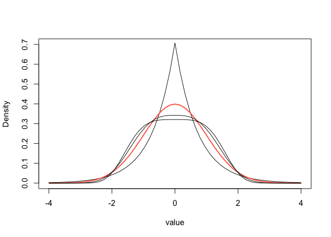<!-- -->

``` r
# plot the entropy of these distributions
beta_seq <- seq(1, 4, length.out = 50)
entropy <- c()
for (beta in beta_seq) {
  alpha <- sigma*sqrt(gamma(1/beta)/gamma(3/beta))
  p <- (beta / (2*alpha*gamma(1/beta)))*exp(-(abs(x_seq-mu)/alpha)^beta)
  p <- p/sum(p)
  ie <- -sum(p*log(p))
  entropy <- c(entropy, ie)
}
plot(beta_seq, entropy, type = "l", lwd = 2)
abline(v = 2, lty = 2)
```

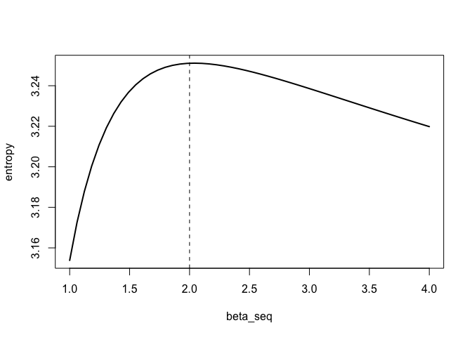<!-- -->

### Binomial distribution: has the maximum entropy among all continuous distribution with the same expected value

Let’s try an example: we have some marbles, some are blue and some are
white. We draw from these marbles twice and the expected number of blue
marbles is 1.4. Let’s see the entropy of different distributions that
can produce this result.

``` r
sim.p <- function(E = 1.4){
  x123 <- runif(3)
  # to calculate the fourth value based on the first three
  x4 <- ((E)*sum(x123)-x123[2]-x123[3])/(2-E)
  p <- c(x123, x4)
  p <- p / sum(p)
  return(list(H = -sum(p*log(p)), p = p))
}

H <- replicate(1e5, sim.p())
dens(as.numeric(H[1,]), adj = 0.1)
```

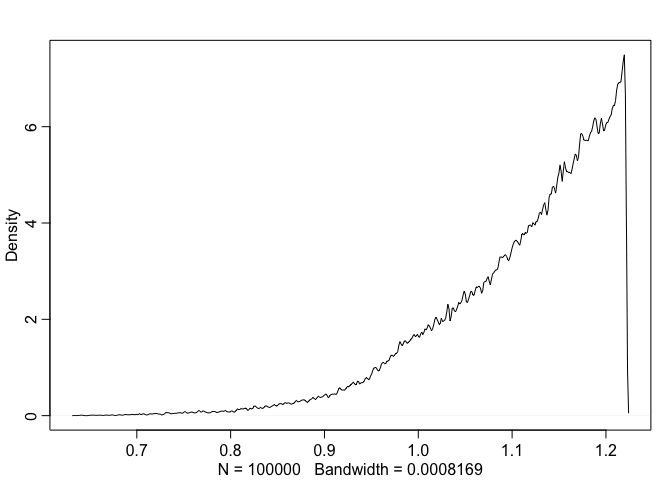<!-- -->

``` r
# check which distribution has the maximum entropy
entropies <- as.numeric(H[1,])
distribution <- H[2,]
distribution[which.max(entropies)]
```

    ## [[1]]
    ## [1] 0.09016826 0.20996070 0.20970279 0.49016826

The distribution given by binomial distribution is 0, 0.21, 0.21, 0.49,
which is almost the same as the empirical distribution that maximizes
entropy.

## Generalized linear model

Generalized linear models use different likelihood functions that are
not constrained to normal distributions. However, we need to apply some
functions to the parameters so that their intervals can be mapped on to
all real numbers.

-   Binomial GLM:

")

 = \alpha + \beta x_i")

where the logit function is defined as log-odds (the log ratio of an
event happening to an event not happening)

 = \log \frac{p_i}{1-p_i}")

This function maps the interval from 0 to 1 onto a linear model defined
over all real numbers.

-   Log link function:

")

 = \alpha + \beta x_i")

This function maps a parameter only defined over positive real numbers
onto a linear model.

## Binomial regression - Logistic regression

Will work on a dataset of chimpanzees’ prosocial tendency.

We would like to know whether chimpanzees are more prosocial in the
presence of a partner, or in other words, more likely to pull the left
handle in different conditions. The prosocial choice is on either the
left or right hand side (`prosoc_left`), and there is either a partner
or no partner (`condition`). There are four conditions:

1.  `prosoc_left = 0` and `condition = 0`, two food on the right and no
    partner
2.  `prosoc_left = 1` and `condition = 0`, two food on the left and no
    partner
3.  `prosoc_left = 0` and `condition = 1`, two food on the right and
    with a partner
4.  `prosoc_left = 1` and `condition = 1`, two food on the left and with
    a partner

``` r
data("chimpanzees")
d <- chimpanzees
# coding the four treatment conditions
d$treatment <- 1 + d$prosoc_left + 2*d$condition
```

We will use the following model to fit the data:

")

![{\sf logit}(p_i) = \alpha\_{ACTOR\[i\]} + \beta\_{TREATMENT\[i\]}](https://latex.codecogs.com/png.image?%5Cdpi%7B110%7D&space;%5Cbg_white&space;%7B%5Csf%20logit%7D%28p_i%29%20%3D%20%5Calpha_%7BACTOR%5Bi%5D%7D%20%2B%20%5Cbeta_%7BTREATMENT%5Bi%5D%7D "{\sf logit}(p_i) = \alpha_{ACTOR[i]} + \beta_{TREATMENT[i]}")

Before we fit the model, let’s choose priors for them. In binomial
regression, flat priors behave weirdly.

``` r
plot(NULL, xlim = c(0, 1),ylim = c(0, 20),
     xlab = "prior prob pull left", ylab = "Density")
# plot prior prediction for different omega values
for (omega in c(10, 1.5)) {
  m11.1 <- quap(
    alist(
      pulled_left ~ dbinom(1, p),
      logit(p) <- a,
      a ~ dnorm(0, omega)
    ),
    data = d
  )
  
  set.seed(1999)
  prior <- extract.prior(m11.1, n = 1e4)
  p <- inv_logit(prior$a)
  dens(p, adj = 0.1, add = TRUE, lwd = 2,
       col = ifelse(omega == 1.5, "violetred", 1))
}
```

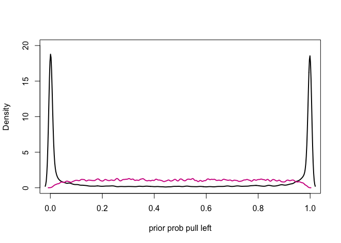<!-- -->

When the prior is not regularized, the model assumes that the
probability of pulling is either 0 or 1, which is not a reasonable
assumption. So we instead use a omega = 1.5.

Similarly, let’s check the prior for
.

``` r
plot(NULL, xlim = c(0, 1),ylim = c(0, 14),
     xlab = "prior prob pull left", ylab = "Density")
for (omega in c(10, 0.5)) {
  m11.2 <- quap(
    alist(
      pulled_left ~ dbinom(1, p),
      logit(p) <- a + b[treatment],
      a ~ dnorm(0, 1.5),
      b[treatment] ~ dnorm(0, omega)
    ),
    data = d
  )

  set.seed(1999)
  prior <- extract.prior(m11.2, n = 1e4)
  p <- sapply(1:4, function(k) inv_logit(prior$a + prior$b[,k]))
  dens(abs(p[,1] - p[,2]), 
       adj = 0.1, add = TRUE, lwd = 2,
       col = ifelse(omega == 0.5, "violetred", 1))
}
```

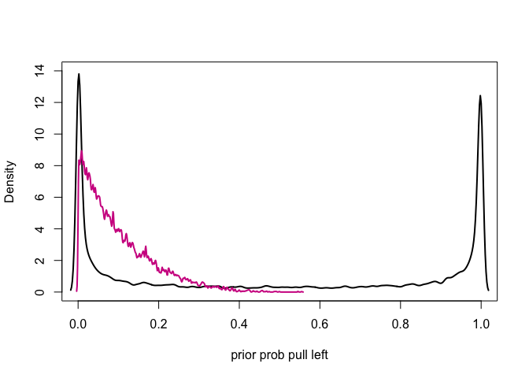<!-- -->

When the prior of

is flat, the prior distribution of contrast between treatment group 1
and 2 is either 0 or 1, which doesn’t make sense. The prior we choose
instead is skeptical of large differences between treatment groups.
However, if the data does turn out to shown big differences, they will
still be capture by this prior.

Officially fit the model.

``` r
# get a cleaned dataset
dat_list <- list(
  pulled_left = d$pulled_left,
  actor = d$actor,
  treatment = as.integer(d$treatment)
)

# fit the data using ulam function
m11.4 <- ulam(
  alist(
    pulled_left ~ dbinom(1, p),
    logit(p) <- a[actor] + b[treatment],
    a[actor] ~ dnorm(0, 1.5),
    b[treatment] ~ dnorm(0, 0.5)
  ),
  data = dat_list, chains = 4, log_lik = TRUE
)
```

    ## Running MCMC with 4 sequential chains, with 1 thread(s) per chain...
    ## 
    ## Chain 1 Iteration:   1 / 1000 [  0%]  (Warmup) 
    ## Chain 1 Iteration: 100 / 1000 [ 10%]  (Warmup) 
    ## Chain 1 Iteration: 200 / 1000 [ 20%]  (Warmup) 
    ## Chain 1 Iteration: 300 / 1000 [ 30%]  (Warmup) 
    ## Chain 1 Iteration: 400 / 1000 [ 40%]  (Warmup) 
    ## Chain 1 Iteration: 500 / 1000 [ 50%]  (Warmup) 
    ## Chain 1 Iteration: 501 / 1000 [ 50%]  (Sampling) 
    ## Chain 1 Iteration: 600 / 1000 [ 60%]  (Sampling) 
    ## Chain 1 Iteration: 700 / 1000 [ 70%]  (Sampling) 
    ## Chain 1 Iteration: 800 / 1000 [ 80%]  (Sampling) 
    ## Chain 1 Iteration: 900 / 1000 [ 90%]  (Sampling) 
    ## Chain 1 Iteration: 1000 / 1000 [100%]  (Sampling) 
    ## Chain 1 finished in 1.1 seconds.
    ## Chain 2 Iteration:   1 / 1000 [  0%]  (Warmup) 
    ## Chain 2 Iteration: 100 / 1000 [ 10%]  (Warmup) 
    ## Chain 2 Iteration: 200 / 1000 [ 20%]  (Warmup) 
    ## Chain 2 Iteration: 300 / 1000 [ 30%]  (Warmup) 
    ## Chain 2 Iteration: 400 / 1000 [ 40%]  (Warmup) 
    ## Chain 2 Iteration: 500 / 1000 [ 50%]  (Warmup) 
    ## Chain 2 Iteration: 501 / 1000 [ 50%]  (Sampling) 
    ## Chain 2 Iteration: 600 / 1000 [ 60%]  (Sampling) 
    ## Chain 2 Iteration: 700 / 1000 [ 70%]  (Sampling) 
    ## Chain 2 Iteration: 800 / 1000 [ 80%]  (Sampling) 
    ## Chain 2 Iteration: 900 / 1000 [ 90%]  (Sampling) 
    ## Chain 2 Iteration: 1000 / 1000 [100%]  (Sampling) 
    ## Chain 2 finished in 1.2 seconds.
    ## Chain 3 Iteration:   1 / 1000 [  0%]  (Warmup) 
    ## Chain 3 Iteration: 100 / 1000 [ 10%]  (Warmup) 
    ## Chain 3 Iteration: 200 / 1000 [ 20%]  (Warmup) 
    ## Chain 3 Iteration: 300 / 1000 [ 30%]  (Warmup) 
    ## Chain 3 Iteration: 400 / 1000 [ 40%]  (Warmup) 
    ## Chain 3 Iteration: 500 / 1000 [ 50%]  (Warmup) 
    ## Chain 3 Iteration: 501 / 1000 [ 50%]  (Sampling) 
    ## Chain 3 Iteration: 600 / 1000 [ 60%]  (Sampling) 
    ## Chain 3 Iteration: 700 / 1000 [ 70%]  (Sampling) 
    ## Chain 3 Iteration: 800 / 1000 [ 80%]  (Sampling) 
    ## Chain 3 Iteration: 900 / 1000 [ 90%]  (Sampling) 
    ## Chain 3 Iteration: 1000 / 1000 [100%]  (Sampling) 
    ## Chain 3 finished in 1.3 seconds.
    ## Chain 4 Iteration:   1 / 1000 [  0%]  (Warmup) 
    ## Chain 4 Iteration: 100 / 1000 [ 10%]  (Warmup) 
    ## Chain 4 Iteration: 200 / 1000 [ 20%]  (Warmup) 
    ## Chain 4 Iteration: 300 / 1000 [ 30%]  (Warmup) 
    ## Chain 4 Iteration: 400 / 1000 [ 40%]  (Warmup) 
    ## Chain 4 Iteration: 500 / 1000 [ 50%]  (Warmup) 
    ## Chain 4 Iteration: 501 / 1000 [ 50%]  (Sampling) 
    ## Chain 4 Iteration: 600 / 1000 [ 60%]  (Sampling) 
    ## Chain 4 Iteration: 700 / 1000 [ 70%]  (Sampling) 
    ## Chain 4 Iteration: 800 / 1000 [ 80%]  (Sampling) 
    ## Chain 4 Iteration: 900 / 1000 [ 90%]  (Sampling) 
    ## Chain 4 Iteration: 1000 / 1000 [100%]  (Sampling) 
    ## Chain 4 finished in 1.0 seconds.
    ## 
    ## All 4 chains finished successfully.
    ## Mean chain execution time: 1.2 seconds.
    ## Total execution time: 4.9 seconds.

``` r
precis(m11.4, depth = 2)
```

    ##             mean        sd         5.5%       94.5%     n_eff    Rhat4
    ## a[1] -0.45513806 0.3418049 -0.998136140  0.09150470  411.5762 1.009683
    ## a[2]  3.87752728 0.7374212  2.743103500  5.15113645 1359.2441 1.000294
    ## a[3] -0.75030125 0.3509781 -1.299126450 -0.17885754  542.0347 1.010664
    ## a[4] -0.74025429 0.3446195 -1.275791600 -0.19022447  542.8927 1.008629
    ## a[5] -0.44991975 0.3312817 -0.981774210  0.08970685  370.0126 1.010770
    ## a[6]  0.47581607 0.3461182 -0.082278053  1.02685320  446.5642 1.008589
    ## a[7]  1.95263556 0.4320162  1.262960650  2.62692635  570.9266 1.007647
    ## b[1] -0.03617772 0.2920267 -0.509238115  0.43454874  368.5396 1.012722
    ## b[2]  0.48279818 0.2991053  0.005803445  0.95470650  462.2205 1.009883
    ## b[3] -0.37700851 0.2997442 -0.846352875  0.10802799  361.7819 1.013580
    ## b[4]  0.36740302 0.2943056 -0.099789278  0.82346464  391.4033 1.008134


in this model is the intercept, and it is fit independently for each
chimpanzee. The 7 intercepts represent the baseline probability of each
chimp to pull the left lever.

``` r
post <- extract.samples(m11.4)
p_left <- inv_logit(post$a)
plot(precis(as.data.frame(p_left)), xlim = c(0,1))
abline(v = 0.5, lty = 2)
```

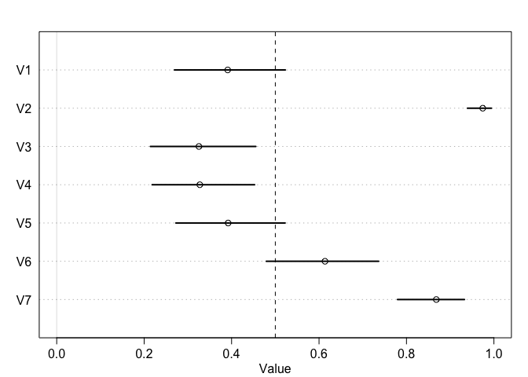<!-- -->

Left to the dashed line are those who tend to pull the right lever, and
rights to this line are those who tend to pull the left lever.
Individual 2 almost always pull the left lever.

Now check the

coefficient.

``` r
labs <- c("R/N", "L/N", "R/P", "L/P")
plot(precis(m11.4, depth = 2, pars = "b"), labels = labs)
```

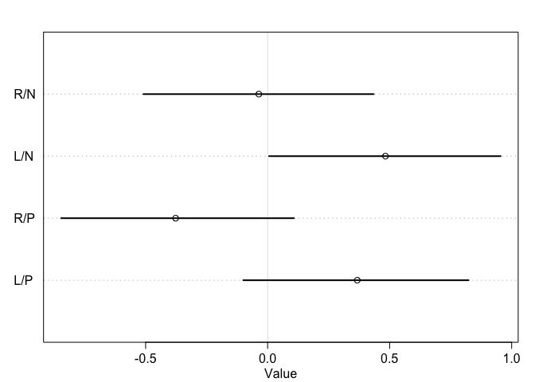<!-- -->

``` r
# compute the contrast 
diffs <- list(
  db13 = post$b[,1] - post$b[,3],
  db24 = post$b[,2] - post$b[,4]
)

plot(precis(diffs))
```

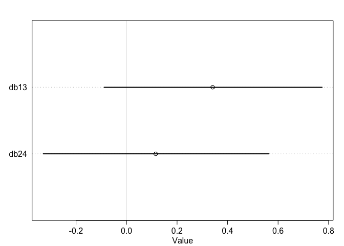<!-- -->

The contrasts are on the scale of log-odds (the difference is the log of
the ratio of two odds). There is in fact weak evidence that chimps pull
the lever more often when a partner is absent.

We also want to check the posterior prediction. We will plot the raw
data - the proportions of left pulls for each actor in each treatment -
against the posterior prediction.

``` r
# calculate the proportion in the data
# each row represents an actor
# each column represents a treatment condition
pl <- by(d$pulled_left, list(d$actor, d$treatment), mean)

# plot the data
# set up the panel
plot(NULL, xlim = c(1, 28), ylim = c(0, 1),
     xlab = "", ylab = "proportion left lever",
     xaxt = "n", yaxt = "n")
axis(2, at = c(0, 0.5, 1), labels = c(0, 0.5, 1))
abline(h = 0.5, lty = 2)
for (j in 1:7) abline(v = (j-1)*4 + 4.5, lwd = 0.5)
for (j in 1:7) text((j-1)*4 + 2.5, 1.1, concat("actor", j), xpd = TRUE)
# plot the line
for (j in (1:7)[-2]) {
  lines((j-1)*4+c(1,3), pl[j,c(1,3)], lwd = 2, col = rangi2)
  lines((j-1)*4+c(2,4), pl[j,c(2,4)], lwd = 2, col = rangi2)
}
# plot the points
points(1:28, t(pl), pch = 16, col = "white", cex = 1.7)
points(1:28, t(pl), pch = c(1, 1, 16, 16), col = rangi2, lwd = 2)
# label
yoff <- .01
text(1, pl[1,1]-yoff, "R/N", pos = 1, cex = 0.8)
text(2, pl[1,2]+yoff, "L/N", pos = 3, cex = 0.8)
text(3, pl[1,3]-yoff, "R/P", pos = 1, cex = 0.8)
text(4, pl[1,4]+yoff, "L/P", pos = 3, cex = 0.8)
mtext("observed proportions\n")
```

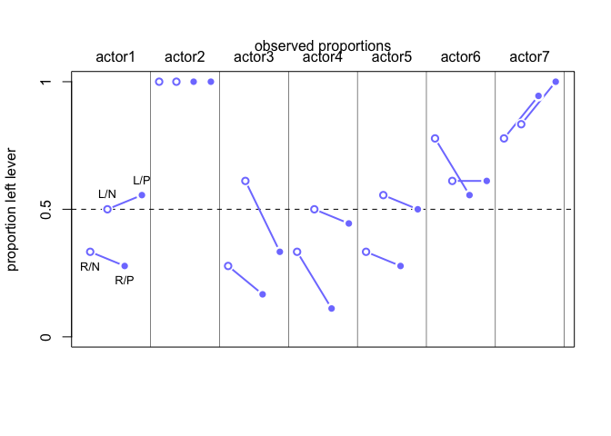<!-- -->

``` r
# posterior prediction
dat <- list(actor = rep(1:7, each = 4), treatment = rep(1:4, time = 7))
p_post <- link(m11.4, data = dat)
p_mu <- apply(p_post, 2, mean)
p_ci <- apply(p_post, 2, PI)

# plot the posterior prediction
plot(NULL, xlim = c(1, 28), ylim = c(0, 1),
     xlab = "", ylab = "proportion left lever",
     xaxt = "n", yaxt = "n")
axis(2, at = c(0, 0.5, 1), labels = c(0, 0.5, 1))
abline(h = 0.5, lty = 2)
for (j in 1:7) abline(v = (j-1)*4 + 4.5, lwd = 0.5)
for (j in 1:7) text((j-1)*4 + 2.5, 1.1, concat("actor", j), xpd = TRUE)
# plot the line
for (j in (1:7)[-2]) {
  lines((j-1)*4+c(1,3), p_mu[(j-1)*4+c(1,3)], lwd = 2)
  lines((j-1)*4+c(2,4), p_mu[(j-1)*4+c(2,4)], lwd = 2)
}
# plot the CI
for (j in 1:28) lines(c(j,j), p_ci[,j], lwd = 2)
# plot the points
points(1:28, p_mu, pch = 16, col = "white", cex = c(1, 1, 1.4, 1.4))
points(1:28, p_mu, pch = c(1, 1, 16, 16), col = "black", lwd = 1)
mtext("posterior prediction\n")
```

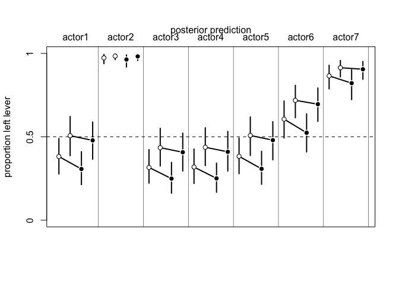<!-- -->

## Binomial regression - Aggregated binomial regression

We will examine the UCB admission data from 6 departments to see whether
there is gender discrimination process in the admission process.

### Scientific model

Before we do that, we will first examine the implication of the
scientific model using generative simulation.

``` r
# first draw a DAG to specify our scientific model
dag1 <- dagitty("dag{ G -> D D -> A <- G }")
coordinates(dag1) <- list(x = c(G = 0, D = 0.5, A = 1),
                          y = c(G = 1, D = 0, A = 1))
drawdag(dag1)
```

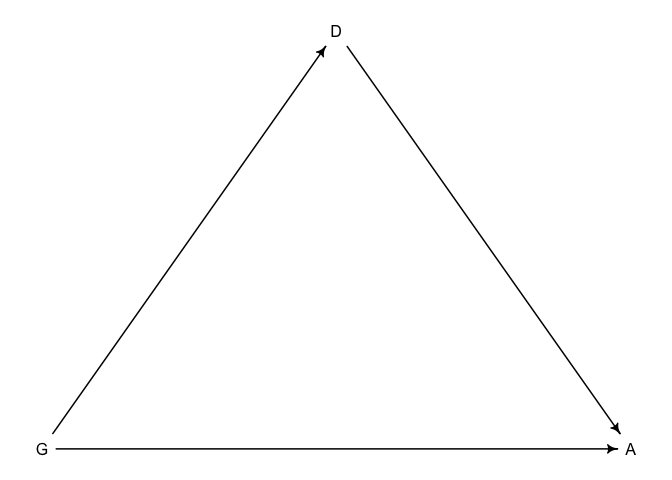<!-- -->

``` r
set.seed(1999)
# generative model of this mediator structure
N <- 1000 # number of applicants

# even gender distribution
G <- sample(1:2, size = N, replace = TRUE)

# gender 1 tends to apply to dept 1 and 2 tends to apply to 2
D <- rbern(N, prob = ifelse(G == 1, 0.3, 0.8)) + 1

# matrix of acceptance rate [D, G]
# no gender difference but department acceptance rates are different
accept_rate <- matrix(c(0.1, 0.3, 0.1, 0.3), nrow = 2)

# simulate acceptance
A <- rbern(N, accept_rate[D, G])

# simple crosstab to see the results
result_a <- table(G,A)
```

The acceptance rate for gender 1 is 17% and 27% for gender 2. Only
baseline acceptance rate in the two department is different, but there
still turns out to be gender discrimination.

Now let’s see what happen if there is also direct gender discrimination
in addition to the departmental baseline difference.

``` r
set.seed(0331)
# generative model of this mediator structure
N <- 1000 # number of applicants

# even gender distribution
G <- sample(1:2, size = N, replace = TRUE)

# gender 1 tends to apply to dept 1 and 2 tends to apply to 2
D <- rbern(N, prob = ifelse(G == 1, 0.3, 0.8)) + 1

# matrix of acceptance rate [D, G]
# gender difference + different department acceptance rates
accept_rate <- matrix(c(0.05, 0.2, 0.1, 0.3), nrow = 2)

# simulate acceptance
A <- rbern(N, accept_rate[D, G])

# simple crosstab to see the results
result_b <- table(G,A)
```

The acceptance rate for gender 1 is 17% and 23% for gender 2. The same
pattern still occurs.

### Statistical model

We will use the following model:

")

![{\sf logit}(p_i) = \alpha\_{GID\[i\]}](https://latex.codecogs.com/png.image?%5Cdpi%7B110%7D&space;%5Cbg_white&space;%7B%5Csf%20logit%7D%28p_i%29%20%3D%20%5Calpha_%7BGID%5Bi%5D%7D "{\sf logit}(p_i) = \alpha_{GID[i]}")

")

``` r
data("UCBadmit")
d <- UCBadmit

# a clean dataset
dat_list <- list(
  admit = d$admit,
  applications = d$applications,
  gid = ifelse(d$applicant.gender == "male", 1, 2)
)

m11.7 <- ulam(
  alist(
    admit ~ dbinom(applications, p),
    logit(p) <-  a[gid],
    a[gid] ~ dnorm(0, 1.5)
  ),
  data = dat_list, chains = 4
)
```

    ## Running MCMC with 4 sequential chains, with 1 thread(s) per chain...
    ## 
    ## Chain 1 Iteration:   1 / 1000 [  0%]  (Warmup) 
    ## Chain 1 Iteration: 100 / 1000 [ 10%]  (Warmup) 
    ## Chain 1 Iteration: 200 / 1000 [ 20%]  (Warmup) 
    ## Chain 1 Iteration: 300 / 1000 [ 30%]  (Warmup) 
    ## Chain 1 Iteration: 400 / 1000 [ 40%]  (Warmup) 
    ## Chain 1 Iteration: 500 / 1000 [ 50%]  (Warmup) 
    ## Chain 1 Iteration: 501 / 1000 [ 50%]  (Sampling) 
    ## Chain 1 Iteration: 600 / 1000 [ 60%]  (Sampling) 
    ## Chain 1 Iteration: 700 / 1000 [ 70%]  (Sampling) 
    ## Chain 1 Iteration: 800 / 1000 [ 80%]  (Sampling) 
    ## Chain 1 Iteration: 900 / 1000 [ 90%]  (Sampling) 
    ## Chain 1 Iteration: 1000 / 1000 [100%]  (Sampling) 
    ## Chain 1 finished in 0.0 seconds.
    ## Chain 2 Iteration:   1 / 1000 [  0%]  (Warmup) 
    ## Chain 2 Iteration: 100 / 1000 [ 10%]  (Warmup) 
    ## Chain 2 Iteration: 200 / 1000 [ 20%]  (Warmup) 
    ## Chain 2 Iteration: 300 / 1000 [ 30%]  (Warmup) 
    ## Chain 2 Iteration: 400 / 1000 [ 40%]  (Warmup) 
    ## Chain 2 Iteration: 500 / 1000 [ 50%]  (Warmup) 
    ## Chain 2 Iteration: 501 / 1000 [ 50%]  (Sampling) 
    ## Chain 2 Iteration: 600 / 1000 [ 60%]  (Sampling) 
    ## Chain 2 Iteration: 700 / 1000 [ 70%]  (Sampling) 
    ## Chain 2 Iteration: 800 / 1000 [ 80%]  (Sampling) 
    ## Chain 2 Iteration: 900 / 1000 [ 90%]  (Sampling) 
    ## Chain 2 Iteration: 1000 / 1000 [100%]  (Sampling) 
    ## Chain 2 finished in 0.0 seconds.
    ## Chain 3 Iteration:   1 / 1000 [  0%]  (Warmup) 
    ## Chain 3 Iteration: 100 / 1000 [ 10%]  (Warmup) 
    ## Chain 3 Iteration: 200 / 1000 [ 20%]  (Warmup) 
    ## Chain 3 Iteration: 300 / 1000 [ 30%]  (Warmup) 
    ## Chain 3 Iteration: 400 / 1000 [ 40%]  (Warmup) 
    ## Chain 3 Iteration: 500 / 1000 [ 50%]  (Warmup) 
    ## Chain 3 Iteration: 501 / 1000 [ 50%]  (Sampling) 
    ## Chain 3 Iteration: 600 / 1000 [ 60%]  (Sampling) 
    ## Chain 3 Iteration: 700 / 1000 [ 70%]  (Sampling) 
    ## Chain 3 Iteration: 800 / 1000 [ 80%]  (Sampling) 
    ## Chain 3 Iteration: 900 / 1000 [ 90%]  (Sampling) 
    ## Chain 3 Iteration: 1000 / 1000 [100%]  (Sampling) 
    ## Chain 3 finished in 0.0 seconds.
    ## Chain 4 Iteration:   1 / 1000 [  0%]  (Warmup) 
    ## Chain 4 Iteration: 100 / 1000 [ 10%]  (Warmup) 
    ## Chain 4 Iteration: 200 / 1000 [ 20%]  (Warmup) 
    ## Chain 4 Iteration: 300 / 1000 [ 30%]  (Warmup) 
    ## Chain 4 Iteration: 400 / 1000 [ 40%]  (Warmup) 
    ## Chain 4 Iteration: 500 / 1000 [ 50%]  (Warmup) 
    ## Chain 4 Iteration: 501 / 1000 [ 50%]  (Sampling) 
    ## Chain 4 Iteration: 600 / 1000 [ 60%]  (Sampling) 
    ## Chain 4 Iteration: 700 / 1000 [ 70%]  (Sampling) 
    ## Chain 4 Iteration: 800 / 1000 [ 80%]  (Sampling) 
    ## Chain 4 Iteration: 900 / 1000 [ 90%]  (Sampling) 
    ## Chain 4 Iteration: 1000 / 1000 [100%]  (Sampling) 
    ## Chain 4 finished in 0.0 seconds.
    ## 
    ## All 4 chains finished successfully.
    ## Mean chain execution time: 0.0 seconds.
    ## Total execution time: 0.5 seconds.

``` r
precis(m11.7, depth = 2)
```

    ##            mean         sd       5.5%      94.5%    n_eff    Rhat4
    ## a[1] -0.2208081 0.03884433 -0.2823066 -0.1612180 1223.226 1.000962
    ## a[2] -0.8288551 0.05009357 -0.9073645 -0.7484913 1137.899 1.002537

``` r
# check the contrast
post <- extract.samples(m11.7)
diff_r <- post$a[,1] - post$a[,2] # relative contrast on a log scale
diff_a <- inv_logit( post$a[,1]) - inv_logit( post$a[,2]) # absolute contrast of admission probability
precis(data.frame(diff_r = diff_r, diff_a = diff_a))
```

    ##             mean         sd      5.5%     94.5%    histogram
    ## diff_r 0.6080470 0.06303583 0.5105305 0.7063491  ▁▁▁▃▇▇▅▁▁▁▁
    ## diff_a 0.1410505 0.01419920 0.1188567 0.1631891 ▁▁▁▁▃▇▇▅▂▁▁▁

We can see across all departments, men have a higher average admission
probability than women by about 12% to 16%.

Let’s plot the posterior prediction against the data to see how it
performs.

The function `postcheck` serves as a convenient way to do it. The open
points are the posterior mean proportions, the vertical lines within
them are the 89% intervals of the expectation, and the crosses are the
89% of the simulated samples.

``` r
postcheck(m11.7)
# draw lines connecting points
for (i in 1:6) {
  x <- 1 + 2*(i-1)
  y1 <- d$admit[x]/d$application[x]
  y2 <- d$admit[x+1]/d$applications[x+1]
  lines(c(x, x+1), c(y1, y2), col = rangi2, lwd = 2)
  text(x + 0.5, (y1+y2)/2 + 0.05, d$dept[x], cex = 0.8, col = rangi2)
}
```

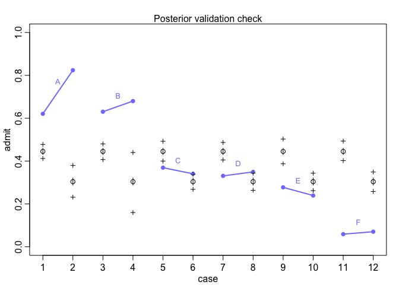<!-- -->

The model does poorly in predicting the rate for each department. So
let’s fit a model to compare the admission rate difference between men
and women in each department.

``` r
dat_list$dept_id <- rep(1:6, each = 2)
m11.8 <- ulam(
  alist(
    admit ~ dbinom(applications, p),
    logit(p) <-  a[gid] + delta[dept_id],
    a[gid] ~ dnorm(0, 1.5),
    delta[dept_id] ~ dnorm(0, 1.5)
  ),
  data = dat_list, chains = 4
)
```

    ## Running MCMC with 4 sequential chains, with 1 thread(s) per chain...
    ## 
    ## Chain 1 Iteration:   1 / 1000 [  0%]  (Warmup) 
    ## Chain 1 Iteration: 100 / 1000 [ 10%]  (Warmup) 
    ## Chain 1 Iteration: 200 / 1000 [ 20%]  (Warmup) 
    ## Chain 1 Iteration: 300 / 1000 [ 30%]  (Warmup) 
    ## Chain 1 Iteration: 400 / 1000 [ 40%]  (Warmup) 
    ## Chain 1 Iteration: 500 / 1000 [ 50%]  (Warmup) 
    ## Chain 1 Iteration: 501 / 1000 [ 50%]  (Sampling) 
    ## Chain 1 Iteration: 600 / 1000 [ 60%]  (Sampling) 
    ## Chain 1 Iteration: 700 / 1000 [ 70%]  (Sampling) 
    ## Chain 1 Iteration: 800 / 1000 [ 80%]  (Sampling) 
    ## Chain 1 Iteration: 900 / 1000 [ 90%]  (Sampling) 
    ## Chain 1 Iteration: 1000 / 1000 [100%]  (Sampling) 
    ## Chain 1 finished in 0.1 seconds.
    ## Chain 2 Iteration:   1 / 1000 [  0%]  (Warmup) 
    ## Chain 2 Iteration: 100 / 1000 [ 10%]  (Warmup) 
    ## Chain 2 Iteration: 200 / 1000 [ 20%]  (Warmup) 
    ## Chain 2 Iteration: 300 / 1000 [ 30%]  (Warmup) 
    ## Chain 2 Iteration: 400 / 1000 [ 40%]  (Warmup) 
    ## Chain 2 Iteration: 500 / 1000 [ 50%]  (Warmup) 
    ## Chain 2 Iteration: 501 / 1000 [ 50%]  (Sampling) 
    ## Chain 2 Iteration: 600 / 1000 [ 60%]  (Sampling) 
    ## Chain 2 Iteration: 700 / 1000 [ 70%]  (Sampling) 
    ## Chain 2 Iteration: 800 / 1000 [ 80%]  (Sampling) 
    ## Chain 2 Iteration: 900 / 1000 [ 90%]  (Sampling) 
    ## Chain 2 Iteration: 1000 / 1000 [100%]  (Sampling) 
    ## Chain 2 finished in 0.1 seconds.
    ## Chain 3 Iteration:   1 / 1000 [  0%]  (Warmup) 
    ## Chain 3 Iteration: 100 / 1000 [ 10%]  (Warmup) 
    ## Chain 3 Iteration: 200 / 1000 [ 20%]  (Warmup) 
    ## Chain 3 Iteration: 300 / 1000 [ 30%]  (Warmup) 
    ## Chain 3 Iteration: 400 / 1000 [ 40%]  (Warmup) 
    ## Chain 3 Iteration: 500 / 1000 [ 50%]  (Warmup) 
    ## Chain 3 Iteration: 501 / 1000 [ 50%]  (Sampling) 
    ## Chain 3 Iteration: 600 / 1000 [ 60%]  (Sampling) 
    ## Chain 3 Iteration: 700 / 1000 [ 70%]  (Sampling) 
    ## Chain 3 Iteration: 800 / 1000 [ 80%]  (Sampling) 
    ## Chain 3 Iteration: 900 / 1000 [ 90%]  (Sampling) 
    ## Chain 3 Iteration: 1000 / 1000 [100%]  (Sampling) 
    ## Chain 3 finished in 0.1 seconds.
    ## Chain 4 Iteration:   1 / 1000 [  0%]  (Warmup) 
    ## Chain 4 Iteration: 100 / 1000 [ 10%]  (Warmup) 
    ## Chain 4 Iteration: 200 / 1000 [ 20%]  (Warmup) 
    ## Chain 4 Iteration: 300 / 1000 [ 30%]  (Warmup) 
    ## Chain 4 Iteration: 400 / 1000 [ 40%]  (Warmup) 
    ## Chain 4 Iteration: 500 / 1000 [ 50%]  (Warmup) 
    ## Chain 4 Iteration: 501 / 1000 [ 50%]  (Sampling) 
    ## Chain 4 Iteration: 600 / 1000 [ 60%]  (Sampling) 
    ## Chain 4 Iteration: 700 / 1000 [ 70%]  (Sampling) 
    ## Chain 4 Iteration: 800 / 1000 [ 80%]  (Sampling) 
    ## Chain 4 Iteration: 900 / 1000 [ 90%]  (Sampling) 
    ## Chain 4 Iteration: 1000 / 1000 [100%]  (Sampling) 
    ## Chain 4 finished in 0.1 seconds.
    ## 
    ## All 4 chains finished successfully.
    ## Mean chain execution time: 0.1 seconds.
    ## Total execution time: 0.9 seconds.

``` r
precis(m11.8, depth = 2)
```

    ##                mean        sd       5.5%      94.5%    n_eff    Rhat4
    ## a[1]     -0.5527872 0.5669646 -1.5117156  0.2885595 168.3722 1.024698
    ## a[2]     -0.4570030 0.5680522 -1.4192373  0.3927438 169.8059 1.024601
    ## delta[1]  1.1352511 0.5710243  0.2852714  2.1092126 169.2449 1.024187
    ## delta[2]  1.0878472 0.5734374  0.2281588  2.0348004 172.8283 1.024785
    ## delta[3] -0.1248618 0.5675624 -0.9492330  0.8332635 169.8855 1.024316
    ## delta[4] -0.1570577 0.5695968 -0.9969241  0.8113964 170.6384 1.023813
    ## delta[5] -0.6041709 0.5698394 -1.4512695  0.3591786 169.1907 1.025006
    ## delta[6] -2.1603057 0.5785422 -3.0444219 -1.1878954 171.5971 1.022355

``` r
# check the posterior contrast
post <- extract.samples(m11.8)
diff_r <- post$a[,1] - post$a[,2] # relative contrast on a log scale
diff_a <- inv_logit( post$a[,1]) - inv_logit( post$a[,2]) # absolute contrast of admission probability
precis(data.frame(diff_r = diff_r, diff_a = diff_a))
```

    ##               mean         sd        5.5%       94.5%     histogram
    ## diff_r -0.09578425 0.08040661 -0.22450664 0.032999895  ▁▁▁▂▅▇▇▅▂▁▁▁
    ## diff_a -0.02121897 0.01835829 -0.05060625 0.007514445 ▁▁▁▁▃▅▇▇▅▂▁▁▁

Now we can there is little difference between men and women in admission
rate in each department.

``` r
# plot the posterior prediction
postcheck(m11.8)
# draw lines connecting points
for (i in 1:6) {
  x <- 1 + 2*(i-1)
  y1 <- d$admit[x]/d$application[x]
  y2 <- d$admit[x+1]/d$applications[x+1]
  lines(c(x, x+1), c(y1, y2), col = rangi2, lwd = 2)
  text(x + 0.5, (y1+y2)/2 + 0.05, d$dept[x], cex = 0.8, col = rangi2)
}
```

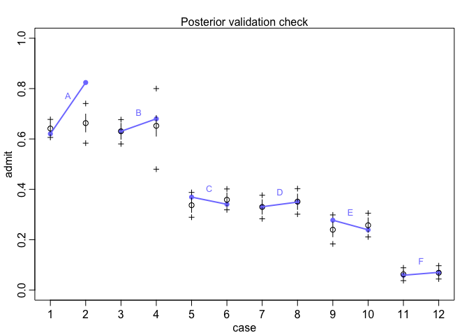<!-- -->

The model makes better predictions now.

In this case, department is a mediator between the gender and admission
rate. The direct effect of gender on admission is smal. However, since
women disproportionately apply to departments with low admission rates
more often, their admission rate is lower than men on average across
departments.

Let’s now examine the expected effect of hypothetically intervening on
applicants’ gender on admission rates. This is about the average direct
effects **across** departments (marginalize over departments). Easier to
do as a simulation.

``` r
# number of applications to simulate
# to determine the repetition times in the simulation
total_app <- sum(dat_list$applications)

# number of application per department
apps_per_dept <- sapply(1:6, function(i) sum(dat_list$applications[dat_list$dept_id == i]))

# simulate as if all apps are from men
p_G1 <- link(m11.8, 
             data = list(applications = rep(1, total_app),
                        gid = rep(1, total_app),
                        dept_id = rep(1:6, times = apps_per_dept)))

# simulate as if all apps are from women
p_G2 <- link(m11.8, 
             data = list(applications = rep(1, total_app),
                        gid = rep(2, total_app),
                        dept_id = rep(1:6, times = apps_per_dept)))

# summarize
dens(p_G2 - p_G1, lwd = 4, xlab = "effects of gender perception")
abline(v = 0, lty = 2)
```

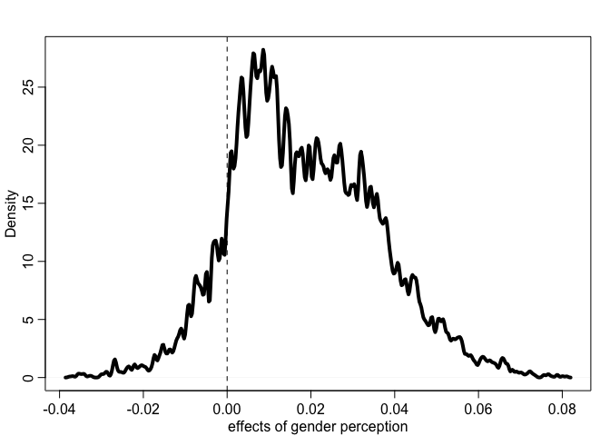<!-- -->

#### A full interaction model

We can also use an alternative way to include both gender and department
as predictors. This uses matrix for the index variables. Note that this
type of model does not work for the `quap` function. We will use our
simulated data as an example.

``` r
dat_sim <- list(D = D, A = A, G = G)

m1 <- ulam(
  alist(
    A ~ bernoulli(p),
    logit(p) <- a[G, D],
    matrix[G, D]:a ~ normal(0, 1)
  ), data = dat_sim, chains = 4, cores = 4
)
```

    ## Running MCMC with 4 parallel chains, with 1 thread(s) per chain...
    ## 
    ## Chain 1 Iteration:   1 / 1000 [  0%]  (Warmup) 
    ## Chain 1 Iteration: 100 / 1000 [ 10%]  (Warmup) 
    ## Chain 2 Iteration:   1 / 1000 [  0%]  (Warmup) 
    ## Chain 2 Iteration: 100 / 1000 [ 10%]  (Warmup) 
    ## Chain 3 Iteration:   1 / 1000 [  0%]  (Warmup) 
    ## Chain 3 Iteration: 100 / 1000 [ 10%]  (Warmup) 
    ## Chain 4 Iteration:   1 / 1000 [  0%]  (Warmup) 
    ## Chain 4 Iteration: 100 / 1000 [ 10%]  (Warmup) 
    ## Chain 1 Iteration: 200 / 1000 [ 20%]  (Warmup) 
    ## Chain 2 Iteration: 200 / 1000 [ 20%]  (Warmup) 
    ## Chain 3 Iteration: 200 / 1000 [ 20%]  (Warmup) 
    ## Chain 4 Iteration: 200 / 1000 [ 20%]  (Warmup) 
    ## Chain 1 Iteration: 300 / 1000 [ 30%]  (Warmup) 
    ## Chain 1 Iteration: 400 / 1000 [ 40%]  (Warmup) 
    ## Chain 2 Iteration: 300 / 1000 [ 30%]  (Warmup) 
    ## Chain 3 Iteration: 300 / 1000 [ 30%]  (Warmup) 
    ## Chain 4 Iteration: 300 / 1000 [ 30%]  (Warmup) 
    ## Chain 1 Iteration: 500 / 1000 [ 50%]  (Warmup) 
    ## Chain 1 Iteration: 501 / 1000 [ 50%]  (Sampling) 
    ## Chain 2 Iteration: 400 / 1000 [ 40%]  (Warmup) 
    ## Chain 2 Iteration: 500 / 1000 [ 50%]  (Warmup) 
    ## Chain 2 Iteration: 501 / 1000 [ 50%]  (Sampling) 
    ## Chain 3 Iteration: 400 / 1000 [ 40%]  (Warmup) 
    ## Chain 3 Iteration: 500 / 1000 [ 50%]  (Warmup) 
    ## Chain 3 Iteration: 501 / 1000 [ 50%]  (Sampling) 
    ## Chain 4 Iteration: 400 / 1000 [ 40%]  (Warmup) 
    ## Chain 1 Iteration: 600 / 1000 [ 60%]  (Sampling) 
    ## Chain 1 Iteration: 700 / 1000 [ 70%]  (Sampling) 
    ## Chain 2 Iteration: 600 / 1000 [ 60%]  (Sampling) 
    ## Chain 3 Iteration: 600 / 1000 [ 60%]  (Sampling) 
    ## Chain 4 Iteration: 500 / 1000 [ 50%]  (Warmup) 
    ## Chain 4 Iteration: 501 / 1000 [ 50%]  (Sampling) 
    ## Chain 1 Iteration: 800 / 1000 [ 80%]  (Sampling) 
    ## Chain 2 Iteration: 700 / 1000 [ 70%]  (Sampling) 
    ## Chain 2 Iteration: 800 / 1000 [ 80%]  (Sampling) 
    ## Chain 3 Iteration: 700 / 1000 [ 70%]  (Sampling) 
    ## Chain 3 Iteration: 800 / 1000 [ 80%]  (Sampling) 
    ## Chain 4 Iteration: 600 / 1000 [ 60%]  (Sampling) 
    ## Chain 4 Iteration: 700 / 1000 [ 70%]  (Sampling) 
    ## Chain 1 Iteration: 900 / 1000 [ 90%]  (Sampling) 
    ## Chain 1 Iteration: 1000 / 1000 [100%]  (Sampling) 
    ## Chain 2 Iteration: 900 / 1000 [ 90%]  (Sampling) 
    ## Chain 2 Iteration: 1000 / 1000 [100%]  (Sampling) 
    ## Chain 3 Iteration: 900 / 1000 [ 90%]  (Sampling) 
    ## Chain 4 Iteration: 800 / 1000 [ 80%]  (Sampling) 
    ## Chain 4 Iteration: 900 / 1000 [ 90%]  (Sampling) 
    ## Chain 1 finished in 0.8 seconds.
    ## Chain 2 finished in 0.8 seconds.
    ## Chain 3 Iteration: 1000 / 1000 [100%]  (Sampling) 
    ## Chain 4 Iteration: 1000 / 1000 [100%]  (Sampling) 
    ## Chain 3 finished in 0.8 seconds.
    ## Chain 4 finished in 0.8 seconds.
    ## 
    ## All 4 chains finished successfully.
    ## Mean chain execution time: 0.8 seconds.
    ## Total execution time: 0.9 seconds.

``` r
precis(m1, depth = 3)
```

    ##              mean        sd       5.5%      94.5%    n_eff     Rhat4
    ## a[1,1] -2.1667738 0.1698705 -2.4559151 -1.9053747 2079.768 0.9996057
    ## a[1,2] -0.6164556 0.1729326 -0.8971224 -0.3343967 2497.731 0.9991578
    ## a[2,1] -2.4620093 0.3469698 -3.0344836 -1.9230978 2469.220 0.9991297
    ## a[2,2] -0.9907051 0.1089253 -1.1615654 -0.8166361 2515.557 1.0010158

``` r
# or using the aggregated data
dat_sim2 <- aggregate(A ~ G + D, dat_sim, sum)
dat_sim2$N <- aggregate(A ~ G + D, dat_sim, length)$A

# # comment out to save knitting time
# m2 <- ulam(
#   alist(
#     A ~ binomial(N, p),
#     logit(p) <- a[G, D],
#     matrix[G, D]:a ~ normal(0, 1)
#   ), data = dat_sim2, chains = 4, cores = 4
# )
# 
# precis(m2, depth = 3)
```
