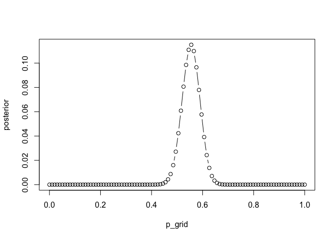
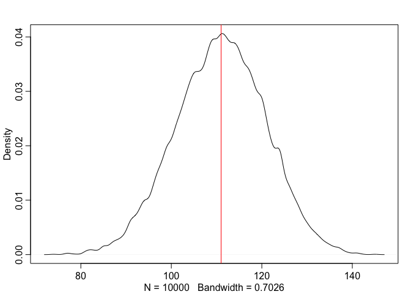
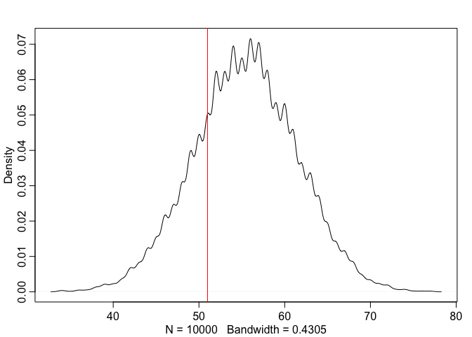
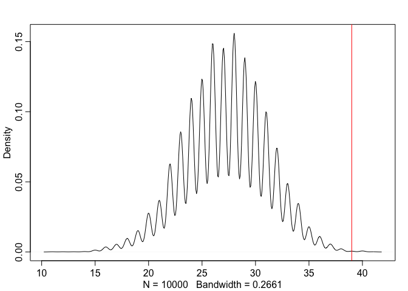
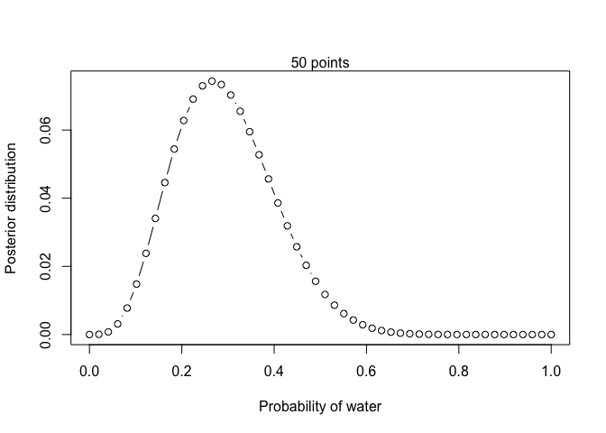
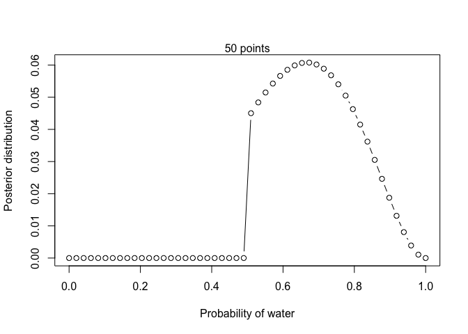
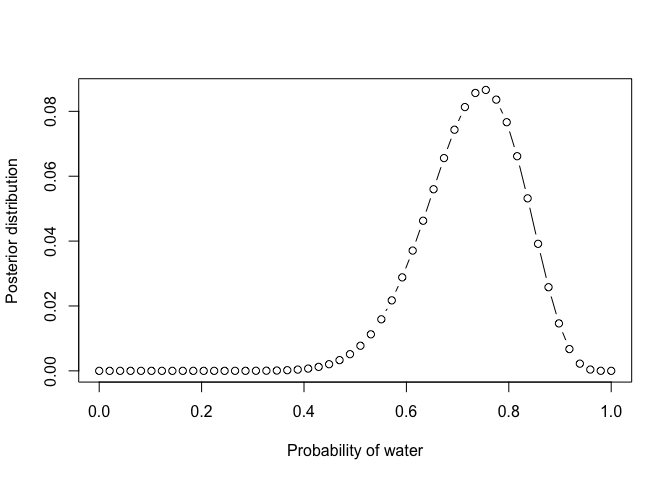
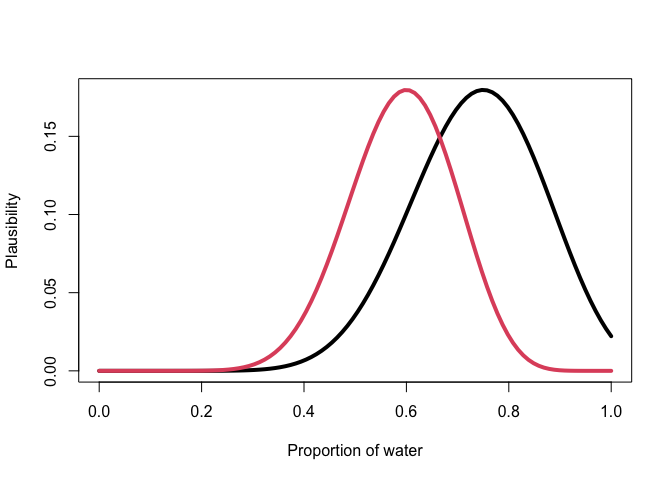

Week 1 Homework
================
Yurun (Ellen) Ying
5/24/2022

## Problems from the book

### 2M3

Two globes: one earth (70% water), one mars (100% land). One is tossed
(each has the same prob to be tossed). Show that Pr(Earth\|Land) = 0.23.

``` r
# prior distribution of earth and mars being tossed
prior <- c(1, 1)

# likelihood of the two generating a land 
likelihood <- c(0.3, 1)

# posteriors
unstd.posterior <- prior * likelihood
posterior <- unstd.posterior/sum(unstd.posterior)
posterior[1]
```

    ## [1] 0.2307692

### 2H1

Pandas: two species giving birth to twins at different rates. The first
birth is a twin, what’s the pribability that the next birth is also
twin?

``` r
# prior two species are equally likely
prior <- c(1, 1)

# two species giving birth to twins at different likelihood
likelihood <- c(0.1, 0.2)

# posterior
unstd.posterior <- prior * likelihood
posterior <- unstd.posterior/sum(unstd.posterior)

# the prob of the panda giving birth to twins
# the prob of having each species of panda * the prob of each giving bith to twins
sum(likelihood*posterior)
```

    ## [1] 0.1666667

### 2H2

Continue from the last problem, what’s the prob of having species A?

``` r
posterior[1]
```

    ## [1] 0.3333333

### 2H3

First birth is a twin and the sencond birth is a singleton. What’s the
prob of having species A?

``` r
# the next birth is singleton
likelihood <- c(0.9, 0.8)

# posterior
unstd.posterior <- posterior * likelihood
posterior <- unstd.posterior/sum(unstd.posterior)

# the prob of having species A
posterior[1]
```

    ## [1] 0.36

### 2H4

Genetic tests on panda

-   prob of correctly detecting A is 0.8
-   prob of correctly detecting B is 0.65

If this test tells you you have species A, what’s the prob that it is A?
What’s the prob after it gives birth to a twin? What if it then gives
birth to a singleton?

``` r
prior <- c(1, 1)

# now that the test result shows that this species is A
# the likelihood of species A giving this result is 0.8
# the likelihood of species B giving this result is 1 - 0.65
likelihood <- c(0.8, 1 - 0.65)

# posterior
unstd.posterior <- posterior * likelihood
posterior <- unstd.posterior/sum(unstd.posterior)
posterior[1]
```

    ## [1] 0.5625

``` r
# and then we have this species giving birth to twins
likelihood <- c(0.1, 0.2)

# posterior - second round!
unstd.posterior <- posterior * likelihood
posterior <- unstd.posterior/sum(unstd.posterior)
posterior[1]
```

    ## [1] 0.3913043

``` r
# and then we have this species giving birth to singleton
likelihood <- c(0.9, 0.8)

# posterior - third round!
unstd.posterior <- posterior * likelihood
posterior <- unstd.posterior/sum(unstd.posterior)
posterior[1]
```

    ## [1] 0.4196891

### 3H: Baby gender problem

#### 3H1

Posterior distribution of a birth being a boy after observing the 200
births

``` r
library(rethinking)
data(homeworkch3)

n_grid <- 100
p_grid <- seq(0, 1, length.out = n_grid)
prior <- rep(1, n_grid)
obs_boy <- sum(birth1 + birth2)
likelihood <- dbinom(obs_boy, size = 200, prob = p_grid)
unstd.posterior <- likelihood * prior
posterior <- unstd.posterior/sum(unstd.posterior)
plot(p_grid, posterior, type = "b")
```

<!-- -->

``` r
p_grid[which.max(posterior)] # p = 0.56 maximizes the posterior probability
```

    ## [1] 0.5555556

#### 3H2

Estimate highest posterior density interval using samples of parameter.

``` r
set.seed(19990331)
n_sample <- 1e4
samples <- sample(p_grid, size = n_sample, replace = TRUE, prob = posterior)
HPDI(samples, prob = 0.5) 
```

    ##      |0.5      0.5| 
    ## 0.5454545 0.5858586

``` r
HPDI(samples, prob = 0.89) 
```

    ##     |0.89     0.89| 
    ## 0.5050505 0.6060606

``` r
HPDI(samples, prob = 0.97) 
```

    ##     |0.97     0.97| 
    ## 0.4848485 0.6262626

#### 3H3

Posterior predictive distribution

``` r
# we can see the observation lies in the middle of the distribution
# and very close to the value that gives the highest probability
post.pred <- rbinom(n_sample, size = 200, prob = samples)
dens(post.pred)
abline(v = obs_boy, col = "red")
```

<!-- -->

#### 3H4

Simulate first borns

``` r
# simulate the number of boys among the first 100 births
post.first <- rbinom(n_sample, size = 100, prob = samples)
dens(post.first)

# plot the actual number of boys among the first 100 births
# the actual value lies a bit far away from the center
abline(v = sum(birth1), col = "red")
```

<!-- -->

#### 3H5

Check assumptions that two births are independent

``` r
# the number of girls in the first births
first.girl <- sum(birth1 == 0)

# the number of boys in the second births that go after a girl
boy_after_girl <- sum(birth2[birth1 == 0])

# simulate the number of boys that go after a girl
post.first.girl <- rbinom(n_sample, size = first.girl, prob = samples)
dens(post.first.girl)

# plot the actual number of boys that go after a girl
# the actual number of boys is way higher than the simulated number
# it is possible that after the birth of a girl, a boy becomes more likely
abline(v = boy_after_girl, col = "red")
```

<!-- -->

## Course homework

### Problem 1

Globe tossing problem but the data turn out to be 4 water and 11 land.
Use flat prior and grid approximation.

``` r
# define the grid
n_grid <- 50
p_grid <- seq(0, 1, length.out = n_grid)

# prior
prior <- rep(1, n_grid)

# likelihood of the observed data
likelihood <- dbinom(4, size = 4 + 11, prob = p_grid)

# calculate the posterior
unstd.posterior <- prior * likelihood
posterior <- unstd.posterior / sum(unstd.posterior)

# plot
plot(p_grid, posterior, type = "b",
     xlab = "Probability of water", ylab = "Posterior distribution")
mtext(paste(n_grid, "points"))
```

<!-- -->

### Problem 2

Data is 4 water and 2 land, prior is zero below 0.5 and a constant above
0.5. This means we know the majority of the surface is water.

``` r
n_grid <- 50
p_grid <- seq(0, 1, length.out = n_grid)

prior <- ifelse(p_grid > 0.5, 1, 0)

likelihood <- dbinom(4, size = 4 + 2, prob = p_grid)

unstd.posterior <- prior * likelihood
posterior <- unstd.posterior/sum(unstd.posterior)

# plot
plot(p_grid, posterior, type = "b",
     xlab = "Probability of water", ylab = "Posterior distribution")
mtext(paste(n_grid, "points"))
```

<!-- -->

### Problem 3

Calculate the 89% percentile and HPDI of the posterior distribution in
2.

``` r
set.seed(19990331)
sample_size <- 10^4
samples <- sample(p_grid, size = sample_size, prob = posterior, replace = TRUE)

# 89% PI
PI(samples, prob = .89)
```

    ##        5%       94% 
    ## 0.5306122 0.8775510

``` r
# HPDI
HPDI(samples, prob = .89)
```

    ##     |0.89     0.89| 
    ## 0.5102041 0.8367347

-   The percentile interval is wider and the HPDI should be narrower.
-   Note that these two aren’t really informative - nothing special
    happen at the boundary
-   I might have thought this distribution is symmetrical around the
    median value

### Problem 4

Biased sampling simulation, 1 in 5 of water sample recorded as land. Use
the biased sample to calculate unbiased posterior distribution

#### My answer

``` r
# generative simulation of the sampling process
# assuming the true proportion of water is 0.7
set.seed(19990331)
sample <- round(rbinom(1, size = 20, prob = 0.7) * 0.8)

# the proportion of water in this sample
sample / 20
```

    ## [1] 0.6

``` r
# use the biased sample to compute the unbiased posterior distribution
n_grid <- 50
p_grid <- seq(0, 1, length.out = n_grid)
prior <- rep(1, n_grid)
likelihood <- dbinom(round(sample/0.8), size = 20, p = p_grid)
unstd.posterior <- likelihood * prior
posterior <- unstd.posterior/sum(unstd.posterior)

# plot
plot(p_grid, posterior, type = "b",
     xlab = "Probability of water", ylab = "Posterior distribution")
```

<!-- -->

#### More legit solution

``` r
# generative simulation of the sampling process
# assuming the true proportion of water is 0.7
n <- 10^5
trueW <- rbinom(n, size = 20, prob = 0.7)
# among the true water, only 80% is recorded as water
obsW <- rbinom(n, size = trueW, prob = 0.8)
# the biased sample tend to have 56% of water
mean(trueW/20); mean(obsW/20) 
```

    ## [1] 0.700316

    ## [1] 0.560136

``` r
# construct posterior distribution
# simulate one observation
W <- rbinom(1, size = 20, 0.7*0.8)

n_grid <- 100
p_grid <- seq(0, 1, length.out = n_grid)
prior <- dbeta(p_grid, 1, 1)
# the probability is adjusted to the biased rate
likelihood <- dbinom(W, size = 20, p = p_grid*0.8)
posterior <- prior * likelihood

# if not adjusted
post_bad <- dbinom(W, size = 20, p = p_grid)

# plot
# the unadjusted distribution has a lower mean value
# this is a problem of binary classification with error
plot(p_grid, posterior, type = "l", lwd = 4,
     xlab = "Proportion of water", ylab = "Plausibility")
lines(p_grid, post_bad, lwd = 4, col = 2)
```

<!-- -->
