Week 2 Homework
================
Yurun (Ellen) Ying
5/24/2022

## Problems from the book

### 4M7

Refit the model `m4.3` without the `xbar`. Compare the covariance of
parameters and the posterior predictions.

``` r
library(rethinking)
data("Howell1")
d <- Howell1
d2 <- d[ d$age >= 18,]
xbar <- mean(d2$weight)

# the original model
m4.3 <- quap(
  alist(
    height ~ dnorm(mu, sigma),
    mu <-  a + b * (weight - xbar),
    a ~ dnorm(178, 20),
    b ~ dlnorm(0, 1),
    sigma ~ dunif(0, 50)
  ),
  data = d2
)

# checkout the model
precis(m4.3)
```

    ##              mean         sd        5.5%       94.5%
    ## a     154.6035842 0.27032531 154.1715522 155.0356163
    ## b       0.9032647 0.04192633   0.8362584   0.9702711
    ## sigma   5.0722074 0.19118559   4.7666559   5.3777589

``` r
# have little covariance due to centering
round(vcov(m4.3), 3) 
```

    ##           a     b sigma
    ## a     0.073 0.000 0.000
    ## b     0.000 0.002 0.000
    ## sigma 0.000 0.000 0.037

``` r
# posterior predictions
weight.seq <- seq(from = 25, to = 70, by = 1)
mu <- link(m4.3, data = data.frame(weight = weight.seq))
mu.mean <- apply(mu, 2, mean) # calculate the mean for each column
mu.PI <- apply(mu, 2, PI, prob = 0.89)
sim.height <- sim(m4.3, data = data.frame(weight = weight.seq))
height.PI <- apply(sim.height, 2, PI, prob = 0.89)

plot(height ~ weight, data = d2, col = col.alpha(rangi2, 0.5))
lines(weight.seq, mu.mean)
shade(mu.PI, weight.seq)
shade(height.PI, weight.seq)
```

<!-- -->

Fit a new model

``` r
# the original model
m4.3_n <- quap(
  alist(
    height ~ dnorm(mu, sigma),
    mu <-  a + b * weight,
    a ~ dnorm(178, 20),
    b ~ dlnorm(0, 1),
    sigma ~ dunif(0, 50)
  ),
  data = d2
)

# checkout the model
precis(m4.3_n)
```

    ##              mean         sd        5.5%       94.5%
    ## a     114.5340947 1.89749282 111.5015347 117.5666547
    ## b       0.8907389 0.04175238   0.8240106   0.9574673
    ## sigma   5.0720343 0.19118441   4.7664847   5.3775840

``` r
# have little covariance due to centering
round(vcov(m4.3_n), 3) 
```

    ##            a      b sigma
    ## a      3.600 -0.078 0.009
    ## b     -0.078  0.002 0.000
    ## sigma  0.009  0.000 0.037

``` r
# posterior predictions
mu <- link(m4.3_n, data = data.frame(weight = weight.seq))
mu.mean <- apply(mu, 2, mean) # calculate the mean for each column
mu.PI <- apply(mu, 2, PI, prob = 0.89)
sim.height <- sim(m4.3_n, data = data.frame(weight = weight.seq))
height.PI <- apply(sim.height, 2, PI, prob = 0.89)

plot(height ~ weight, data = d2, col = col.alpha(rangi2, 0.5))
lines(weight.seq, mu.mean)
shade(mu.PI, weight.seq)
shade(height.PI, weight.seq)
```

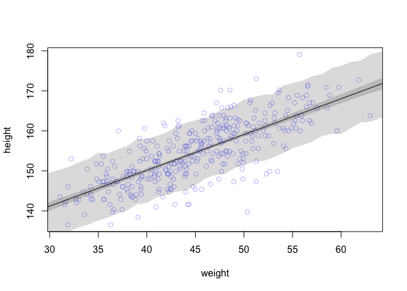<!-- -->

There is covariance among the parameters when the data is not centered,
but there doesn’t seem to be much difference between the posterior
predictions.

### 4H1

Predict some individuals’ height in the Howell data.

``` r
weight.seq <- c(46.95, 43.72, 64.78, 32.59, 54.63)
mu <- link(m4.3, data = list(weight = weight.seq))
mu.mean <- apply(mu, 2, mean)
height_sim <- sim(m4.3, data = list(weight = weight.seq))
height_PI <- apply(height_sim, 2, PI, 0.89)
data.frame(
  Individual = seq(1, 5, 1),
  weight = weight.seq,
  expected_height = round(mu.mean, 2),
  PI89_LL = round(height_PI[1, ], 2),
  PI89_UL = round(height_PI[2, ], 2)
)
```

    ##   Individual weight expected_height PI89_LL PI89_UL
    ## 1          1  46.95          156.37  148.78  164.54
    ## 2          2  43.72          153.45  145.28  161.69
    ## 3          3  64.78          172.50  164.45  180.44
    ## 4          4  32.59          143.38  135.33  151.52
    ## 5          5  54.63          163.32  155.04  171.56

### 4H2

Fit a linear model to the data below the age of 18 in the Howell data

``` r
d3 <- d[d$age < 18,]
xbar <- mean(d3$weight)

# plot the raw data
plot(height ~ weight, data = d3)
```

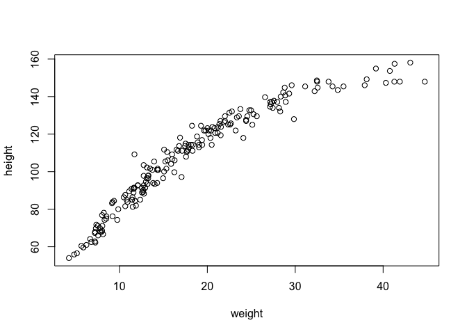<!-- -->

``` r
# fit a linear model
m_4h2 <- quap(
  alist(
    height ~ dnorm(mu, sigma),
    mu <- a + b*(weight - xbar),
    a ~ dnorm(140, 20),
    b ~ dlnorm(0, 1),
    sigma ~ dunif(0, 50)
  ),
  data = d3
)

# inspect the model
precis(m_4h2)
```

    ##             mean         sd       5.5%      94.5%
    ## a     108.348133 0.60862948 107.375426 109.320841
    ## b       2.716657 0.06831587   2.607475   2.825839
    ## sigma   8.437224 0.43057222   7.749086   9.125361

``` r
# posterior predictions
weight_seq <- seq(0, 50, length.out = 30)
mu <- link(m_4h2, data = data.frame(weight = weight_seq))
mu_mean <- apply(mu, 2, mean)
mu_PI <- apply(mu, 2, PI, prob = 0.89)
h_sim <- sim(m_4h2, data = data.frame(weight = weight_seq))
h_PI <- apply(h_sim, 2, PI, prob = 0.89)
plot(height ~ weight, data = d3, col = col.alpha(rangi2, 0.3),
     xlim = range(weight_seq), ylim = c(50, 160),
     xlab = "weight (kg)", ylab = "height (cm)")
lines(weight_seq, mu_mean)
shade(mu_PI, weight_seq)
shade(h_PI, weight_seq)
```

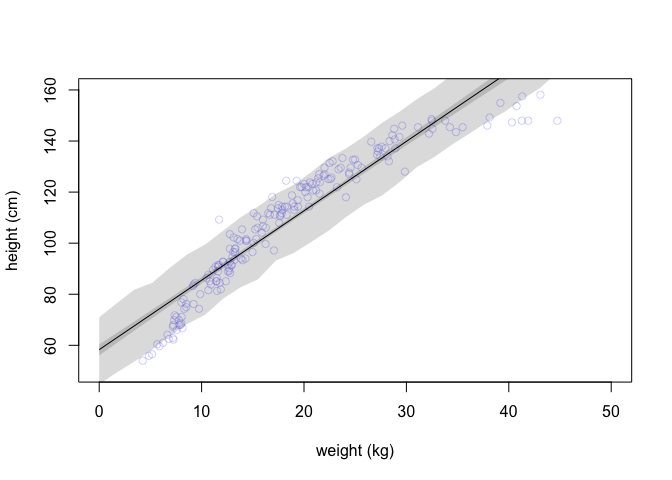<!-- -->

A non-linear model seems to fit better to the data. I would add
higher-order terms to the model to fit a curve.

### 4H3

Fit a model of height and logarithm of body weight in the entire Howell
data.

``` r
# compute the logarithmof weight
d$log_w <- log(d$weight)
xbar <- log(mean(d$weight))

# fit the model
m_4h3 <- quap(
  alist(
    height ~ dnorm(mu, sigma),
    mu <- a + b*(log_w - xbar),
    a ~ dnorm(140, 20),
    b ~ dlnorm(0, 1),
    sigma ~ dunif(0, 50)
  ),
  data = d
)

# inspect the model
# when weight is multiplied by exp(1), height increases by 47.07cm
precis(m_4h3)
```

    ##             mean        sd      5.5%      94.5%
    ## a     144.397070 0.2257136 144.03634 144.757804
    ## b      47.070989 0.3826351  46.45946  47.682514
    ## sigma   5.134778 0.1556741   4.88598   5.383575

``` r
# posterior prediction
weight_seq <- seq(0, 65, length.out = 30)
mu <- link(m_4h3, data = data.frame(log_w = log(weight_seq)))
mu_mean <- apply(mu, 2, mean)
mu_PI <- apply(mu, 2, PI, prob = 0.97)
h_sim <- sim(m_4h3, data = data.frame(log_w = log(weight_seq)))
h_PI <- apply(h_sim, 2, PI, prob = 0.97)
plot(height ~ weight, data = d, col = col.alpha(rangi2, 0.3),
     xlim = range(weight_seq), ylim = c(50, 180),
     xlab = "weight (kg)", ylab = "height (cm)")
lines(weight_seq, mu_mean)
shade(mu_PI, weight_seq)
shade(h_PI, weight_seq)
```

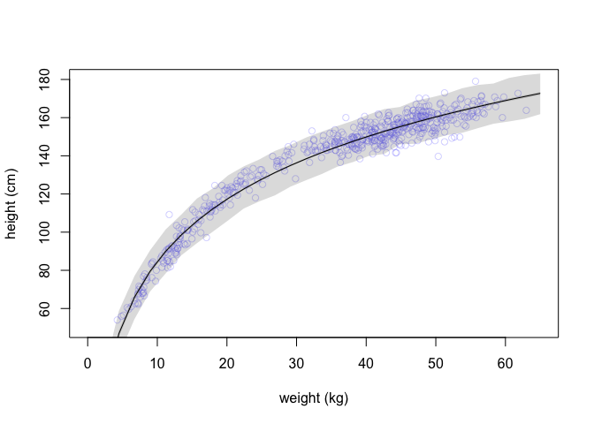<!-- -->

Looks like a very very legit model…

### 4H4

Prior predicative distribution of the parabolic polynomial regression
model.

-   h<sub>i</sub> \~ normal(mu<sub>i</sub>, sigma)
-   mu<sub>i</sub> = a + b<sub>1</sub>x<sub>i</sub> +
    b<sub>2</sub>x<sub>i</sub><sup>2</sup>
-   a \~ normal(178, 20)
-   b<sub>1</sub> \~ log-normal(0, 1)
-   b<sub>2</sub> \~ normal(0, 1)
-   sigma \~ uniform(0, 50)

``` r
d$weight_s <- (d$weight - mean(d$weight)) / sd(d$weight)
n <- 100
a <- rnorm(n = n, 178, 20)
b1 <- rlnorm(n = n, 0, 1)
b2 <- rnorm(n = n, 0, 1)
plot(NULL, xlim = range(d$weight_s), ylim = c(-100, 300),
     xlab = "weight (kg)", ylab = "height (cm)")
for (i in 1:n)
  curve(
    a[i] + b1[i]*x + b2[i]*x^2,
    from = min(d$weight_s), to = max(d$weight_s), 
    col = col.alpha("black", 0.3), add = TRUE)
abline(h = 0, lwd = 0.5, lty = 2)
abline(h = 272, lwd = 0.5, lty = 2)
```

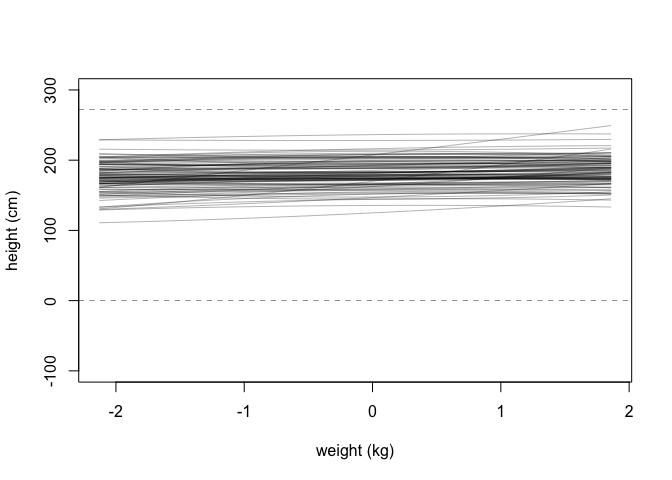<!-- -->

### 4H5

A linear model of blossom date and temperature.

``` r
data("cherry_blossoms")
d <- cherry_blossoms
d2 <- d[complete.cases(d$doy, d$temp),] # select complete cases on doy
xbar <- mean(d2$temp)

# plot the raw data
plot(doy ~ temp, data = d2)
```

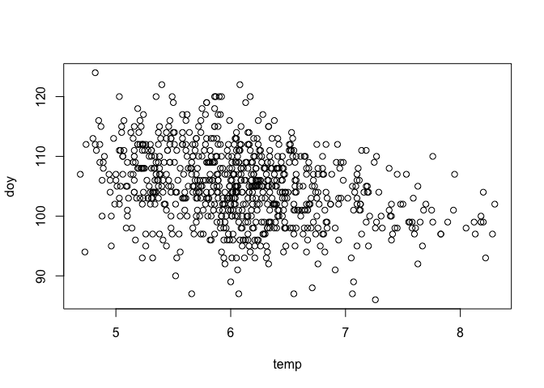<!-- -->

``` r
# pick priors
n <- 100
a <- rnorm(n, 105, 20)
b <- rnorm(n, 0, 1) 
plot(NULL, xlim = range(d2$temp), ylim = c(0, 200),
     xlab = "March temperature", ylab = "Blossom date")
for (i in 1:n)
  curve(a[i] + b[i]*x,
        from = min(d2$temp), to = max(d2$temp),
        add = TRUE, col = col.alpha("black", 0.3))
```

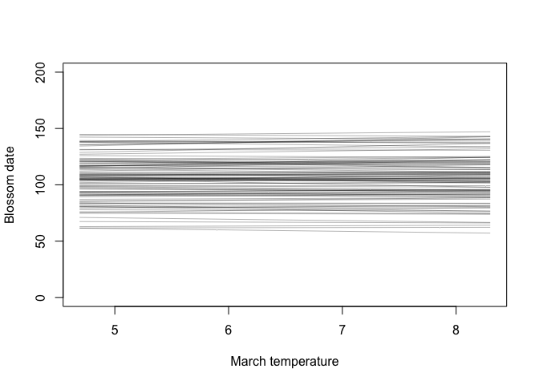<!-- -->

``` r
# fit the data
m_4h5 <- quap(
  alist(
    doy ~ dnorm(mu, sigma),
    mu <- a + b*(temp - xbar),
    a ~ dnorm(105, 20),
    b ~ dnorm(0, 1),
    sigma ~ dunif(0, 50)
  ),
  data = d2
)

precis(m_4h5)
```

    ##             mean        sd       5.5%      94.5%
    ## a     104.921230 0.2107521 104.584408 105.258053
    ## b      -2.733664 0.2951185  -3.205320  -2.262007
    ## sigma   5.912666 0.1491554   5.674287   6.151045

``` r
# posterior predicative simulation
temp_seq <- seq(4, 9, length.out = 30)
mu <- link(m_4h5, data = data.frame(temp = temp_seq))
mu_mean <- apply(mu, 2, mean)
mu_PI <- apply(mu, 2, PI, prob = 0.89)
day_sim <- sim(m_4h5, data = data.frame(temp = temp_seq))
day_PI <- apply(day_sim, 2, PI, prob = 0.89)

# plot
plot(doy ~ temp, data = d2, xlim = range(temp_seq), ylim = c(80, 130),
     xlab = "March temperature", ylab = "Blossom date",
     col = col.alpha(rangi2, 0.3))
lines(temp_seq, mu_mean)
shade(mu_PI, temp_seq)
shade(day_PI, temp_seq)
```

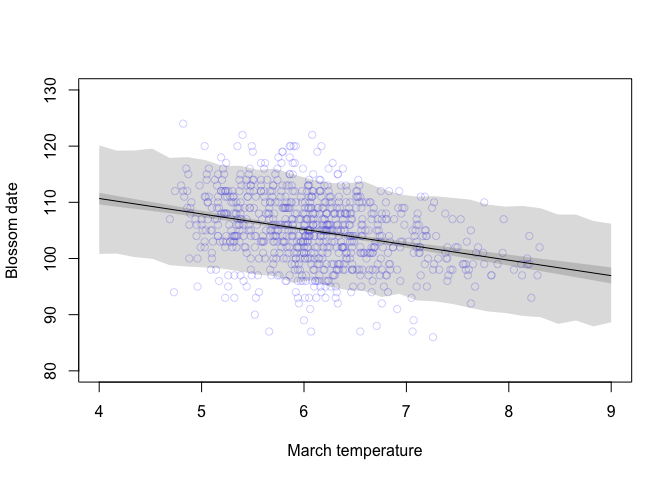<!-- -->

Higher temperature predicts earlier days of blossom. The linear model
doesn’t seem to fit the data very well. A parabolic curve may do the job
better.

### 4H6

Prior predicative distribution of the spline model on cherry blossom
data.

``` r
d <- cherry_blossoms
d2 <- d[complete.cases(d$doy),] # select complete cases on doy
num_knots <- 15
knot_list <- quantile(d2$year, probs = seq(0, 1, length.out = num_knots))

# create basis functions
library(splines)
# construct cubic splines
B <- bs(d2$year, 
        knots = knot_list[-c(1, num_knots)], # get rid of the first and the last knots
        degree = 3,
        intercept = TRUE
        )

# priors
n <- 100
a <-  rnorm(n, 100, 10)
w <- rnorm(n, 0, 30)

# plot the prior predicative distribution
plot(NULL, xlim = range(d2$year), ylim = c(-200, 300),
     xlab = "year", ylab = "blossom date")
for (i in 1:n) 
  lines(d2$year, a[i] + sapply(1:nrow(B), function(j) sum(B[j,] * w[i])),
         #from = min(d2$year), to = max(d2$year),
         col = col.alpha("black", 0.3))
```

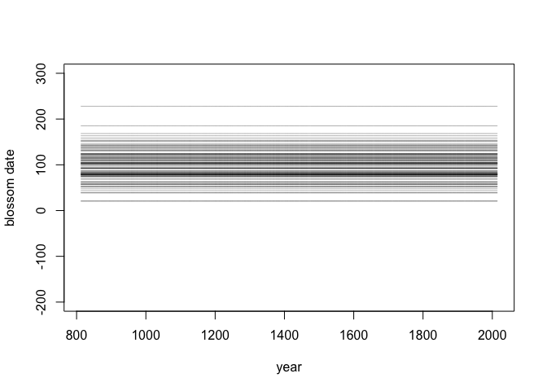<!-- -->

The prior on weights seem to be specifying the range of the predicted
variable.

### 4H8

Refit the cherry blossom data without the intercept

``` r
# construct cubic splines
B <- bs(d2$year, 
        knots = knot_list[-c(1, num_knots)], # get rid of the first and the last knots
        degree = 3,
        intercept = TRUE
        )

# plot the basis functions
plot(NULL, xlim = range(d2$year), ylim = c(0, 1),
     xlab = "year", ylab = "basis")
for (i in 1:ncol(B)) lines(d2$year, B[,i])
```

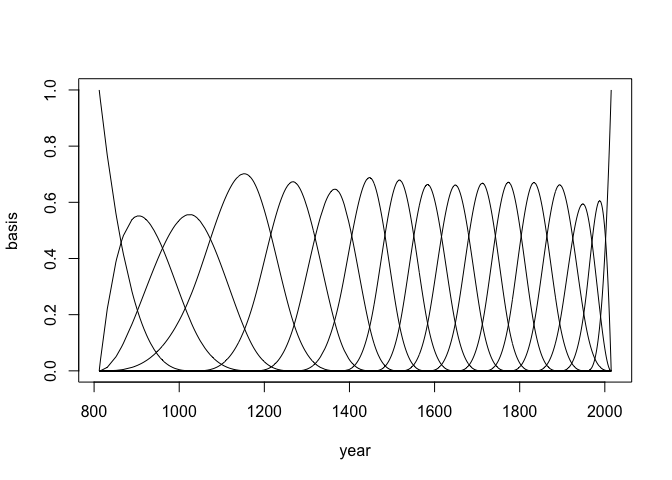<!-- -->

``` r
# fit the model
# get the first basis function
B0 <- B[,1]
B_rest <- B[,2:ncol(B)]

m_4h8 <- quap(
  alist(
    D ~ dnorm(mu, sigma),
    mu <-  B0 * w0 + B_rest %*% w,
    w0 ~ dnorm(100, 10),
    w ~ dnorm(0, 10),
    sigma ~ dexp(1)
  ),
  data = data.frame(D = d2$doy, B0 = B0, B_rest = B_rest),
  start = list(w = rep(0, ncol(B_rest)))
)

precis(m_4h8, depth = 2)
```

    ##             mean        sd       5.5%      94.5%
    ## w[1]   97.846650 3.0870945  92.912877 102.780423
    ## w[2]  102.848147 2.7485646  98.455410 107.240884
    ## w[3]  107.565153 1.6409734 104.942560 110.187745
    ## w[4]  101.985092 1.6723759  99.312312 104.657871
    ## w[5]  106.753989 1.7350754 103.981004 109.526975
    ## w[6]   97.653047 1.5226525  95.219554 100.086540
    ## w[7]  110.593310 1.5287582 108.150059 113.036561
    ## w[8]  101.703935 1.6754251  99.026282 104.381588
    ## w[9]  105.751211 1.7239768 102.995963 108.506459
    ## w[10] 107.374752 1.6933923 104.668384 110.081120
    ## w[11] 102.674284 1.6497279 100.037700 105.310868
    ## w[12] 108.146812 1.6895758 105.446543 110.847080
    ## w[13] 103.775201 1.8630086 100.797754 106.752649
    ## w[14] 101.311210 2.3363385  97.577290 105.045130
    ## w[15]  95.973640 2.4338504  92.083877  99.863403
    ## w[16]  92.144544 2.2930862  88.479749  95.809338
    ## w0    103.099371 3.2009534  97.983629 108.215112
    ## sigma   5.932627 0.1478322   5.696363   6.168892

``` r
# here are the weighted basis functions
post <- extract.samples(m_4h8)
w0 <- mean(post$w0)
w <- apply(post$w, 2, mean)
plot(NULL, xlim = range(d2$year), ylim = c(-100, 110),
     xlab = "year", ylab = "basis * weight")
for (i in 1:ncol(B_rest)) lines(d2$year, w0 * B0 + w[i]*B_rest[,i])
```

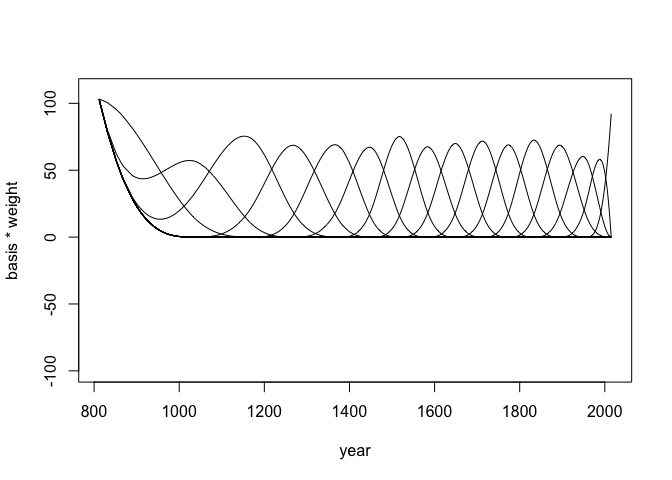<!-- -->

``` r
# a curve for the mean and its interval
mu <- link(m_4h8)
mu_mean <- apply(mu, 2, mean)
mu_PI <- apply(mu, 2, PI, prob = 0.89)
plot(doy ~ year, data = d2, col = col.alpha(rangi2, 0.3), pch = 16)
lines(d2$year, mu_mean)
shade(mu_PI, d2$year)
```

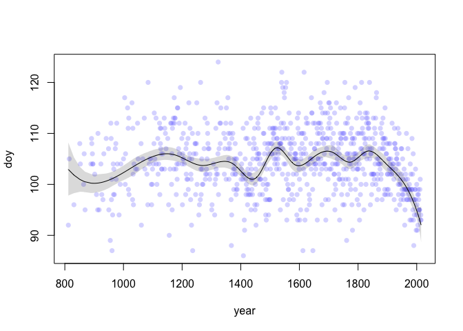<!-- -->

The model is generally identical to the one using an intercept, but
there is a small difference where the intercept of curve lies on the y
axis.

## Course homework
