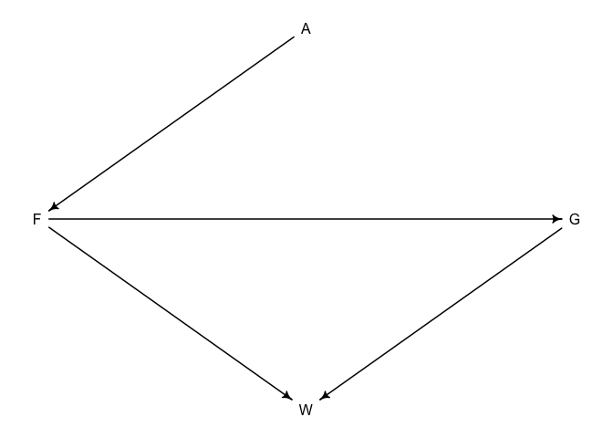
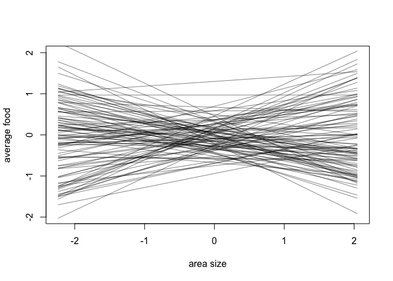
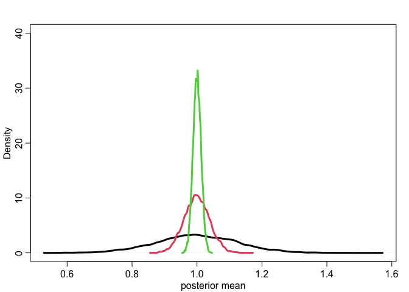
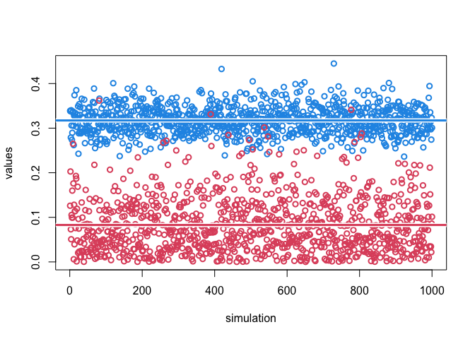
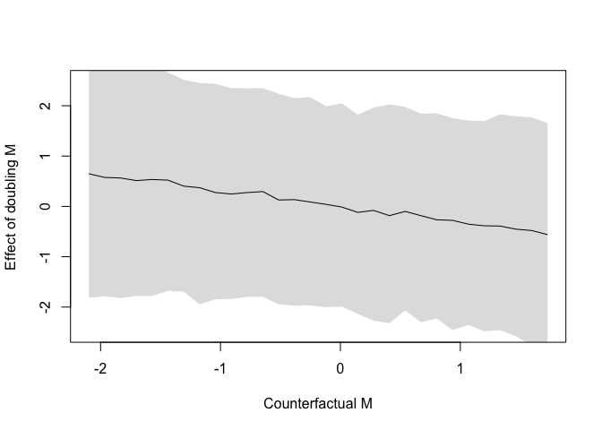

Week 3 Homework
================
Yurun (Ellen) Ying
5/31/2022

## Course homework

### Problem 1

Use the `foxes` data and assume this dag

``` r
# read data
data("foxes")
d1 <- foxes

# causal dag
dag1 <- dagitty("dag{
                A -> F
                F -> G
                F -> W <- G}")
coordinates(dag1) <- list(x = c(A=0.5, F=0, G=1, W=0.5),
                          y = c(A=0, F=0.5, G=0.5, W=1))
drawdag(dag1)
```

<!-- -->

Estimate the total causal influence of A on F.

``` r
# standardize variables
d1$A <- standardize(d1$area)
d1$F <- standardize(d1$avgfood)
d1$W <- standardize(d1$weight)
d1$G <- standardize(d1$groupsize)

# plot the data
plot(F ~ A, data = d1)
```

<!-- -->

``` r
# Since A -> F is the only pathway connecting the exposure and the outcome
# we don't control for anything

# choose the priors
n <- 100
a <- rnorm(n, 0, 0.4)
bA <- rnorm(n, 0, 0.4)
plot(NULL, xlab = "area size", ylab = "average food",
     xlim = range(d1$A), ylim = c(-2, 2))
for (i in 1:n)
  curve(a[i] + bA[i] * x,
        from = min(d1$A), to = max(d1$A),
        col = col.alpha("black", 0.5), add = TRUE)
```

<!-- -->

``` r
# fit the model
m1 <- quap(
  alist(
    F ~ dnorm(mu, sigma),
    mu <- a + bA * A,
    a ~ dnorm(0, 0.4),
    bA ~ dnorm(0, 0.4),
    sigma ~ dexp(1)
  ),
  data = d1
)

precis(m1)
```

    ##               mean         sd        5.5%      94.5%
    ## a     5.469702e-07 0.04304613 -0.06879549 0.06879658
    ## bA    8.727885e-01 0.04325133  0.80366451 0.94191246
    ## sigma 4.663292e-01 0.03053821  0.41752325 0.51513517

Increasing the area by one sd (0.93) will result in 0.87 sd (0.17) of
increase on average in the amount of food inside it.

### Problem 3

Infer both the total and direct effects of adding food F to the weight
of foxes W.

``` r
# when estimating the total effect, we don't need to control for anything
# plot the raw data
plot(W ~ F, data = d1)
```

<!-- -->

``` r
# fit the model
m2 <- quap(
  alist(
    W ~ dnorm(mu, sigma),
    mu <- a + bF * F,
    a ~ dnorm(0, 0.4),
    bF ~ dnorm(0, 0.4),
    sigma ~ dexp(1)
  ),
  data = d1
)

precis(m2)
```

    ##                mean         sd       5.5%     94.5%
    ## a     -1.626175e-08 0.08968227 -0.1433296 0.1433296
    ## bF    -2.376968e-02 0.09005181 -0.1676899 0.1201505
    ## sigma  9.911402e-01 0.06465798  0.8878043 1.0944762

``` r
# plot the posterior predictions
W_seq <- seq(-2, 2, length.out = 30)
mu <- link(m2, data = list(W = W_seq))
mu_mean <- apply(mu, 2, mean)
mu_PI <- apply(mu, 2, PI, prob = 0.89)
sim <- sim(m2, data = list(W = W_seq))
sim_PI <- apply(sim, 2, PI, prob = 0.89)

plot(W ~ F, data = d1, xlim = c(-2, 2), ylim = c(-2.5, 2.5),
     xlab = "average food", ylab = "fox weight")
lines(W_seq, mu_mean)
shade(mu_PI, W_seq)
shade(sim_PI, W_seq)
```

<!-- --> The total
effect of adding food on foxes’ weight is every small since the
coefficient is very close to zero.

``` r
# when estimating the direct effect, we need to control for the group size G
# fit the model
m3 <- quap(
  alist(
    W ~ dnorm(mu, sigma),
    mu <- a + bF * F + bG * G,
    a ~ dnorm(0, 0.4),
    bF ~ dnorm(0, 0.4),
    bG ~ dnorm(0, 0.4),
    sigma ~ dexp(1)
  ),
  data = d1
)

precis(m3)
```

    ##                mean         sd       5.5%      94.5%
    ## a     -1.796935e-06 0.08566639 -0.1369132  0.1369096
    ## bF     4.147105e-01 0.16962684  0.1436140  0.6858069
    ## bG    -5.101133e-01 0.16966373 -0.7812687 -0.2389579
    ## sigma  9.445719e-01 0.06210708  0.8453128  1.0438310

``` r
# counter factual effect
F_seq <- seq(-2, 2, length.out = 30)
sim <- sim(m3, data = list(F = F_seq, G = 0), var = "W")
plot(F_seq, colMeans(sim), type = "l", xlim = c(-2, 2), ylim = c(-2.5, 2.5),
     xlab = "Manipulated food amount", ylab = "Counterfactual weight")
shade(apply(sim, 2, PI), F_seq)
mtext("Firect counter factual effect of F on W")
```

<!-- --> The direct
effect of food on weight is 0.41 on average. Increasing food amount by 1
sd result in increase on foxes’ weight by 0.41 sd.

It is possible that increasing F increases W, but it also increases G
which decreases W. When G is not controlled in the model, it masks the
relation between F and W. (The benefits of more food are cancelled by
more foxes being attracted to food, so each fox still gets the same
amount and doesn’t have more weight even when more food is available.)

### Problem 3

The Table 2 fallacy with an unobserved variable U.

``` r
# draw a dag
dag2 <- dagitty("dag{
                U [unobserved]
                A -> Y
                A -> X ->Y
                A -> S -> X
                S -> Y
                S <- U -> Y}")
coordinates(dag2) <- list(x = c(A=0, S=0, X=0.4, Y=1, U=0.6),
                         y = c(A=1, S=0, X=0.5, Y=0.5, U=0.1))
drawdag(dag2)
```

<!-- -->

1.  adjustment sets: A, S
2.  interpretation of each coefficient

-   X: the total effect of X on Y (causal)
-   A: the direct effect of A on Y (causal)
-   S: the direct effect of S on Y, biased by the unobserved variable U
    (non-causal)

**Correction** The coefficient of A is not even a partial causal effect
since the collider path A -\> S \<- U is opened by controlling for S.

### Problem 4

Simulate data using the causal structure in Problem 3

#### My attempt

``` r
f <- function(n) {
  bUS <- bUY <- bAX <- bAY <- bAS <- 1
  A <- rnorm(n)
  U <- rnorm(n)
  S <- rnorm(n, bUS*U + bAS*A)
  X <- rnorm(n, S + bAX*A)
  Y <- rnorm(n, bAY*A + X + S + bUY*U)
  bXY <- coef(lm(Y ~ X + A + S))["X"]
  return(bXY)
}

sim2 <- mcreplicate(1e4, f(n = 100), mc.cores = 2)
```

``` r
sim3 <- mcreplicate(1e4, f(n = 1e3), mc.cores = 2)
```

``` r
sim4 <- mcreplicate(1e4, f(n = 1e4), mc.cores = 2)
```

``` r
dens(sim2, lwd = 3, xlab = "posterior mean", ylim = c(0, 40))
dens(sim3, lwd = 3, col = 2, add = TRUE)
dens(sim4, lwd = 3, col = 3, add = TRUE)
```

<!-- --> If we define
“reliably” have a precise estimation with the sd of the parameter
distribution less than 0.1, then it seems like a sample of 1000 will be
enough.

#### A more elaborate solution

``` r
# define function to generate data
f <- function(n=100, bX=0) {
  A <- rnorm(n)
  U <- rnorm(n)
  S <- rnorm(n, U + A)
  X <- rnorm(n, S + A)
  Y <- rnorm(n, A + bX*X + S + U)
  return(list(
    A = standardize(A),
    S = standardize(S),
    X = standardize(X),
    Y = standardize(Y)
  ))
}

# define the formula
flist <- alist(
  Y ~ dnorm(mu, sigma),
  mu <- a + bX*X + bS*S + bA*A,
  a ~ dnorm(0, 0.2),
  c(bX, bS, bA) ~ dnorm(0, 0.5),
  sigma ~ dlnorm(0, 1)
)

# function to repeat analysis at a specific N
g <- function(N_reps=1e3, n=100, bX=0){
  r <- mcreplicate(N_reps, mc.cores = 2, {
    sim_dat <- f(n = n, bX = bX)
    m <- quap(flist, data = sim_dat)
    # two measures of reliability
    # width of 89% PI and mean distance from the true value
    iw <- as.numeric(precis(m)[2,4] - precis(m)[2,3])
    md <- as.numeric(abs(precis(m)[2,1] - bX))
    return(c(md, iw))
  })
  return(r)
}

# test for N = 10
x <- g(n = 100)
```

``` r
plot(x[2,], lwd = 2, col = 4, ylim = c(0, max(x)),
     xlab = "simulation", ylab = "values")
points(1:ncol(x), x[1,], lwd = 2, col = 2)

abline(h = mean(x[1,]), lwd = 6, col = "white")
abline(h = mean(x[1,]), lwd = 3, col = 2)
abline(h = mean(x[2,]), lwd = 6, col = "white")
abline(h = mean(x[2,]), lwd = 3, col = 4)
```

<!-- -->

``` r
# to find out how big sample we need, repeat the analysis for different sample size
# since this process is computationally expensive
# I keep the code here but comment them out

# N_seq <- c(10, 20, 50, 100, 500, 1000)
# y <- sapply(N_seq, function(n) {
#   x <- g(n = n)
#   return(c(apply(x, 1, mean), apply(x, 1, sd)))
# })
# plot(N_seq, y[2,], lwd = 3, col = 4, type = "b",
#      ylim = c(0, 1),  xlab = "N", ylab = "values")
# points(N_seq, y[1,], lwd = 2, col = 2, type = "b")
# for (i in 1:length(N_seq)) {
#   lines(c(N_seq[i], N_seq[i]), c(y[1, i]+y[3, i], y[1, i]-y[3, i]),
#         lwd = 3, col = 2)
#   lines(c(N_seq[i], N_seq[i]), c(y[2, i]+y[4, i], y[2, i]-y[4, i]),
#         lwd = 3, col = 4)
# }
```

## Problems from the book

### 5H3

Use the milk energy model to estimate the counterfactual effect of
doubling M on K.

``` r
data("milk")
d <- milk
# standardize
d$K <- standardize(d$kcal.per.g)
d$N <- standardize(d$neocortex.perc)
d$M <- standardize(log(d$mass))
# since th data contains missing values, we only select complete cases for analysis
dcc <- d[complete.cases(d$K, d$N, d$M), ]

m5h3 <- quap(
  alist(
    K ~ dnorm(mu, sigma),
    mu <- a + bM*M + bN*N,
    a ~ dnorm(0, 0.2),
    c(bM, bN) ~ dnorm(0, 0.5),
    sigma ~ dexp(1),
    
    N ~ dnorm(mu_N, sigma_N),
    mu_N <- a + bMN * M,
    a ~ dnorm(0, 0.2),
    bMN ~ dnorm(0, 0.5),
    sigma_N ~ dexp(1)
  ),
  data = dcc
)

precis(m5h3)
```

    ##                mean         sd       5.5%      94.5%
    ## a        0.02344815 0.09080523 -0.1216761  0.1685725
    ## bM      -0.69782372 0.22183832 -1.0523642 -0.3432832
    ## bN       0.67008158 0.24946973  0.2713808  1.0687824
    ## sigma    0.74345872 0.13352708  0.5300566  0.9568608
    ## bMN      0.61068676 0.13478547  0.3952735  0.8261000
    ## sigma_N  0.63335254 0.10653118  0.4630951  0.8036099

``` r
M_seq <- seq(min(dcc$M), max(dcc$M), length.out = 30)
M2_seq <- 2*M_seq
mu <- sim(m5h3, data = list(M = M_seq), vars = c("N", "K"))
```

    ## Warning in if (left == var) {: the condition has length > 1 and only the first
    ## element will be used

``` r
mu2 <- sim(m5h3, data = list(M = M2_seq), vars = c("N", "K"))
```

    ## Warning in if (left == var) {: the condition has length > 1 and only the first
    ## element will be used

``` r
contrast <- mu2[[2]] - mu[[2]]
contrast_mean <- apply(contrast, 2, mean)
contrast_PI <- apply(contrast, 2, PI, prob = 0.89)
plot(M_seq, contrast_mean, type = "l",
     xlim = range(M_seq), ylim = c(-2.5, 2.5),
     xlab = "Counterfactual M", ylab = "Effect of doubling M")
shade(contrast_PI, M_seq)
```

<!-- -->

### 6M3

Why using correlation to determine multicollinearity is a bad idea. We
take the DAG X -\> Z -\> Y and make X and Y have strong correlation.

``` r
# simulate X
n <- 1000
X <- rnorm(n)
Z <- rnorm(n, 2*X+3, 1)
Y <- rnorm(n, 3*Z-4, 1)
dat <- data.frame(X = X, Y = Y, Z = Z)

m6m3 <- quap(
  alist(
    Y ~ dnorm(mu, sigma),
    mu <- a + bZ*Z + bX*X,
    c(bZ, bX) ~ dnorm(0, 1),
    sigma ~ dexp(1)
  ),
  data = dat
)

precis(m6m3)
```

    ##           mean         sd     5.5%    94.5%
    ## bZ    1.812039 0.01674965 1.785270 1.838808
    ## bX    2.392566 0.06511629 2.288498 2.496635
    ## sigma 1.674353 0.03739347 1.614591 1.734115

The model behaves alright and there is no multicollinearity here even
though X and Z are highly correlated. This is because X causes Z and
they don’t contain identical information because of this causal
relationship. In the leg problem, the two legs are caused by something
else at the same time and they contain identical information, thus
creating the problem of multicollinearity.

### 6H1

Wafflehouse and divorce rate.

``` r
data("WaffleDivorce")
d <- WaffleDivorce

# draw a DAG
dag_3 <- dagitty("dag{
                 W -> D
                 W <- S -> M -> D
                 M <- A -> D}")
coordinates(dag_3) <- list(x = c(S = 0, W = 0, M = 0.5, A = 1, D = 1),
                           y = c(S = 0, W = 1, M = 0, A = 0, D = 1))
drawdag(dag_3)
```

<!-- -->

``` r
# based on the DAG, to estimate the causal effect of W on D 
# we need to control for S (or A and M)
S <- d$South + 1 # 1 = north, 2 = south
W <- standardize(d$WaffleHouses)
D <- standardize(d$Divorce)
d2 <- data.frame(S = S, W = W, D = D)

m6h1 <- quap(
  alist(
    D ~ dnorm(mu, sigma),
    mu <- a + bW[S] * W,
    a ~ dnorm(0, 0.2),
    bW[S] ~ dnorm(0, 0.5),
    sigma ~ dexp(1)
  ),
  data = d2
)

precis(m6h1, depth = 2)
```

    ##             mean         sd        5.5%     94.5%
    ## a     0.07171733 0.13943369 -0.15112464 0.2945593
    ## bW[1] 0.49404145 0.34465198 -0.05677898 1.0448619
    ## bW[2] 0.15609951 0.14717286 -0.07911115 0.3913102
    ## sigma 0.93501177 0.09344866  0.78566277 1.0843608

The model including Southness shows that the number of Wafflehouse has a
very small effect on divorce rate.

### 6H2

Run regression models to test the conditional independencies of the DAG
used in last problem.

``` r
# get conditional independencies
impliedConditionalIndependencies(dag_3)
```

    ## A _||_ S
    ## A _||_ W
    ## D _||_ S | A, M, W
    ## M _||_ W | S

``` r
# more data
d2$M <- standardize(d$Marriage)
d2$A <- standardize(d$MedianAgeMarriage)

# S_||_A
m2.1 <- quap(
  alist(
    A ~ dnorm(mu, sigma),
    mu <- a[S],
    a[S] ~ dnorm(0, 0.2),
    sigma ~ dexp(1)
  ),
  data = d2
)

# S has little effect on A
precis(m2.1, depth = 2)
```

    ##              mean         sd       5.5%     94.5%
    ## a[1]   0.09338709 0.12513998 -0.1066108 0.2933850
    ## a[2]  -0.14880568 0.15880207 -0.4026021 0.1049907
    ## sigma  0.95988740 0.09543606  0.8073621 1.1124127

``` r
# A_||_W
m2.2 <- quap(
  alist(
    W ~ dnorm(mu, sigma),
    mu <- a + bA*A,
    a ~ dnorm(0, 0.2),
    bA ~ dnorm(0, 0.5),
    sigma ~ dexp(1)
  ),
  data = d2
)

# A has little effect on W
precis(m2.2)
```

    ##                mean         sd       5.5%     94.5%
    ## a     -5.895025e-08 0.11341127 -0.1812532 0.1812531
    ## bA    -1.097673e-01 0.13400774 -0.3239375 0.1044030
    ## sigma  9.736060e-01 0.09597527  0.8202190 1.1269930

``` r
# S_||_D | M,A,W
m2.3 <- quap(
  alist(
    D ~ dnorm(mu, sigma),
    mu <- a[S] + bA*A + bM*M + bW*W,
    a[S] ~ dnorm(0, 0.2),
    c(bA,bM,bW) ~ dnorm(0, 0.5),
    sigma ~ dexp(1)
  ),
  data = d2
)

# S had little effect on D conditioned on M, A, W
precis(m2.3, depth = 2)
```

    ##              mean         sd       5.5%      94.5%
    ## a[1]  -0.04923398 0.11397527 -0.2313885  0.1329205
    ## a[2]   0.08727891 0.15863733 -0.1662542  0.3408120
    ## bA    -0.57045311 0.14965425 -0.8096295 -0.3312767
    ## bM    -0.04436076 0.14730902 -0.2797890  0.1910675
    ## bW     0.13915710 0.12270964 -0.0569566  0.3352708
    ## sigma  0.76088203 0.07555944  0.6401234  0.8816406

``` r
# M_||_W | S
m2.4 <- quap(
  alist(
    W ~ dnorm(mu, sigma),
    mu <- a + bM[S]*M,
    a ~ dnorm(0, 0.2),
    bM[S] ~ dnorm(0, 0.5),
    sigma ~ dexp(1)
  ),
  data = d2
)

# M had little effect on W conditioned on S
precis(m2.4, depth = 2)
```

    ##               mean        sd       5.5%     94.5%
    ## a     -0.002954410 0.1141345 -0.1853634 0.1794546
    ## bM[1]  0.004754008 0.1415044 -0.2213974 0.2309054
    ## bM[2]  0.125100591 0.3307444 -0.4034928 0.6536940
    ## sigma  0.978411128 0.0964868  0.8242066 1.1326157

No need to make any adjustment to the DAG since all conditional
independencies are met.
