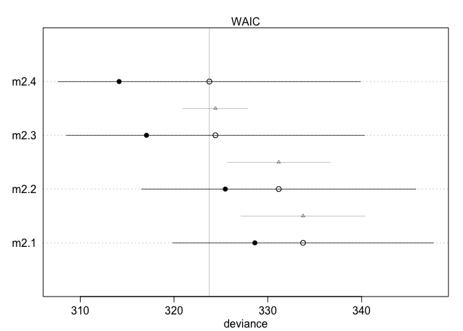
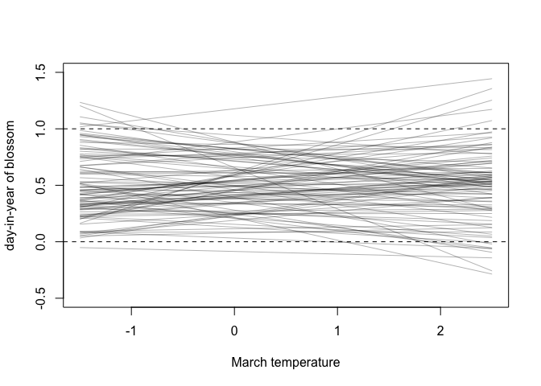
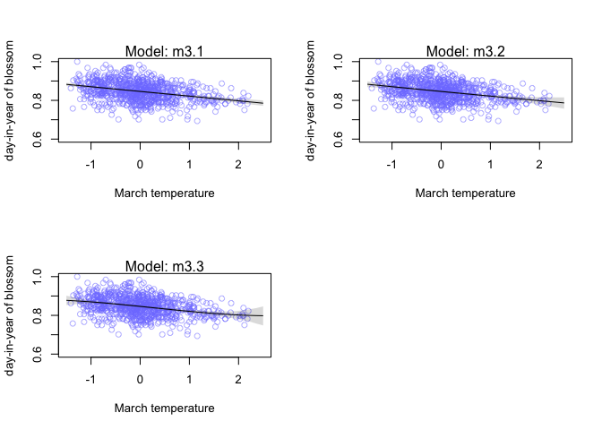
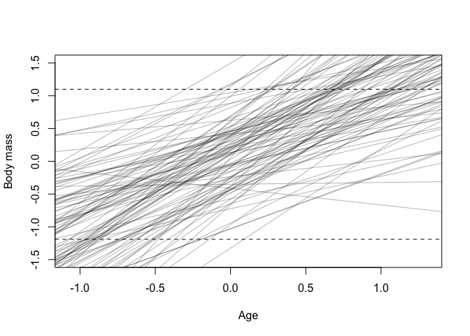
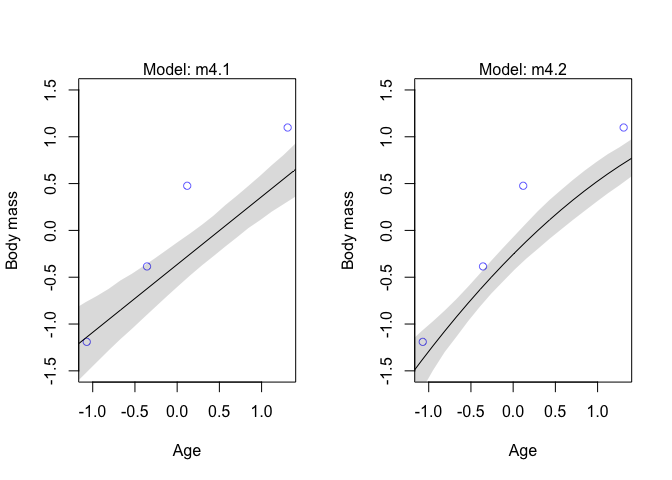
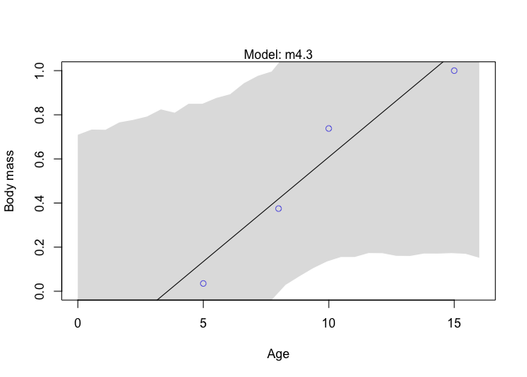
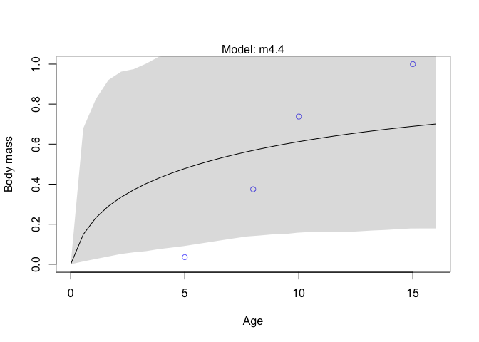
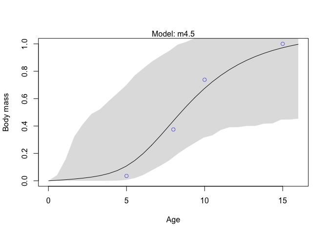
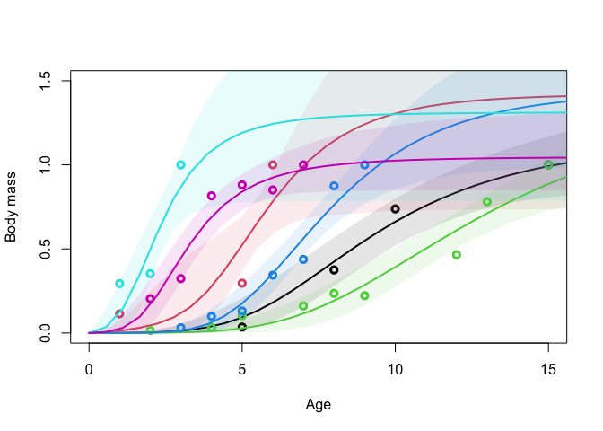

Week 4 Homework
================
Yurun (Ellen) Ying
2022-06-08

## Course homework

### Problem 1

Marriage, age, happiness collider.

The causal model we assume is H -\> M \<- A.

``` r
# fit a model including marriage status
m6.9 <- quap(
  alist(
    happiness ~ dnorm(mu, sigma),
    mu <- a[mid] + bA*A,
    # happiness ranges from -2 to 2
    # this prior allows 95% to lie in this range
    a[mid] ~ dnorm(0, 1),
    # the maximum value of the slope is 4
    # this prior allows 95% of the slope to lie within a plausible range
    bA ~ dnorm(0, 2), 
    sigma ~ dexp(1)
  ),
  data = d2
)
precis(m6.9, 2)
```

    ##             mean         sd       5.5%      94.5%
    ## a[1]  -0.2350877 0.06348986 -0.3365568 -0.1336186
    ## a[2]   1.2585517 0.08495989  1.1227694  1.3943340
    ## bA    -0.7490274 0.11320112 -0.9299447 -0.5681102
    ## sigma  0.9897080 0.02255800  0.9536559  1.0257600

``` r
# a better model
m6.10 <- quap(
  alist(
    happiness ~ dnorm(mu, sigma),
    mu <- a + bA*A,
    a ~ dnorm(0, 1), 
    bA ~ dnorm(0, 2), 
    sigma ~ dexp(1)
  ),
  data = d2
)

precis(m6.10)
```

    ##                mean         sd       5.5%     94.5%
    ## a      1.649248e-07 0.07675015 -0.1226614 0.1226617
    ## bA    -2.728620e-07 0.13225976 -0.2113769 0.2113764
    ## sigma  1.213188e+00 0.02766080  1.1689803 1.2573949

Compare the two models

``` r
# compare using PSIS
compare(m6.9, m6.10, func = PSIS)
```

    ##           PSIS       SE   dPSIS      dSE    pPSIS       weight
    ## m6.9  2713.996 37.56527   0.000       NA 3.751076 1.000000e+00
    ## m6.10 3101.925 27.75875 387.929 35.40121 2.350136 5.784794e-85

``` r
# compare using WAIC
compare(m6.9, m6.10, func = WAIC)
```

    ##           WAIC       SE    dWAIC      dSE    pWAIC       weight
    ## m6.9  2714.256 37.51051   0.0000       NA 3.861508 1.000000e+00
    ## m6.10 3101.883 27.68399 387.6271 35.34372 2.328445 6.727359e-85

According to both criteria, m6.9 makes better predictions, and the
difference between the two models is reliably different from zero.
According to the causal model, however, m6.9 gives biased estimation of
the association between age and happiness. It gives a negative and a
positive association for the data of unmarried and married people,
respectively, but in fact there is no association between age and
happiness in the entire sample.

**Correction on the interpretation of coefficients of the model:** bA is
biased by the collider effect, so it’s not any kind of causal effect.
a\[1\] and a\[2\] measure the association between marriage and
happiness, but also biased (the mean happiness value among married and
unmarried people when age is 18).

### Problem 2

Let’s fit 4 models for the outcome W.

``` r
# regressed on F
m2.1 <- quap(
  alist(
    W ~ dnorm(mu, sigma),
    mu <- a + bF * F,
    a ~ dnorm(0, 0.4),
    bF ~ dnorm(0, 0.4),
    sigma ~ dexp(1)
  ),
  data = d1
)

# regressed on F
m2.2 <- quap(
  alist(
    W ~ dnorm(mu, sigma),
    mu <- a + bG * G,
    a ~ dnorm(0, 0.4),
    bG ~ dnorm(0, 0.4),
    sigma ~ dexp(1)
  ),
  data = d1
)

# regressed on both F and G
m2.3 <- quap(
  alist(
    W ~ dnorm(mu, sigma),
    mu <- a + bF * F + bG * G,
    a ~ dnorm(0, 0.4),
    bF ~ dnorm(0, 0.4),
    bG ~ dnorm(0, 0.4),
    sigma ~ dexp(1)
  ),
  data = d1
)

# regressed on A, F G
m2.4 <- quap(
  alist(
    W ~ dnorm(mu, sigma),
    mu <- a + bF * F + bG * G + bA*A,
    a ~ dnorm(0, 0.4),
    c(bF,bG,bA) ~ dnorm(0, 0.4),
    sigma ~ dexp(1)
  ),
  data = d1
)

precis(m2.1)
```

    ##                mean         sd       5.5%     94.5%
    ## a      9.835533e-07 0.08968257 -0.1433291 0.1433311
    ## bF    -2.376978e-02 0.09005211 -0.1676904 0.1201509
    ## sigma  9.911437e-01 0.06465855  0.8878068 1.0944806

``` r
precis(m2.2)
```

    ##                mean         sd       5.5%       94.5%
    ## a     -3.375250e-07 0.08860401 -0.1416067  0.14160599
    ## bG    -1.530291e-01 0.08897492 -0.2952282 -0.01082997
    ## sigma  9.786048e-01 0.06384949  0.8765610  1.08064865

``` r
precis(m2.3)
```

    ##                mean         sd       5.5%      94.5%
    ## a     -2.345568e-07 0.08566639 -0.1369117  0.1369112
    ## bF     4.147076e-01 0.16962687  0.1436111  0.6858041
    ## bG    -5.101104e-01 0.16966376 -0.7812659 -0.2389550
    ## sigma  9.445719e-01 0.06210708  0.8453128  1.0438310

``` r
precis(m2.4)
```

    ##                mean         sd         5.5%      94.5%
    ## a      2.437561e-07 0.08469354 -0.135356390  0.1353569
    ## bF     2.527179e-01 0.19643828 -0.061228431  0.5666642
    ## bG    -5.792065e-01 0.17300771 -0.855706209 -0.3027067
    ## bA     2.631889e-01 0.16284930  0.002924223  0.5234535
    ## sigma  9.333386e-01 0.06131535  0.835344805  1.0313324

Compare the four models using PSIS and WAIC scores

``` r
com_PSIS <- compare(m2.1, m2.2, m2.3, m2.4, func = PSIS)
com_WAIC <- compare(m2.1, m2.2, m2.3, m2.4, func = WAIC)
plot(com_PSIS); plot(com_WAIC)
```

<!-- --><!-- -->

Both criteria show that m2.4 including all three predictors make better
predictions. But the difference between this model and the model only
including F and G is small. Based on the causal model, the estimation of
the coefficient of F may be lower than the actual value because of
controlling A.

**Addition:**

-   bF measures the direct causal effect of F on W, but is not complete
    because A is also in the model.
-   bA is weird here since we are controlling for the mediator F, so
    there should really be no association between A and W. This can
    indicate that there’s some problem with the causal model, or it’s a
    fluke of the sample.

### Problem 3

Cherry blossom data and use `temp` to predict `doy`.

``` r
data("cherry_blossoms")
d <- cherry_blossoms[complete.cases(cherry_blossoms),]
d$doy_std <- d$doy / max(d$doy) # scale day-in-year into the range of 0-1
d$temp_std <- d$temp - mean(d$temp) # 0 represents the sample mean

m3.1 <- quap(
  alist(
    doy_std ~ dnorm(mu, sigma),
    mu <- a + b*temp_std,
    a ~ dnorm(0.5, 0.25), # when temp is at the mean, doy is at 0.5
    b ~ dnorm(0, 0.1), # the possible range of the slope is roughly -0.3 to 0.3
    sigma ~ dexp(1)
  ),
  data = d
)

# check the priors
# they are a bit wide so let's try to use more regularizing priors
prior <- extract.prior(m3.1)
temp_seq <- seq(-1.5, 2.5, length.out = 30)
mu <- link(m3.1, post = prior, data = list(temp_std = temp_seq))
plot(NULL, xlim = range(temp_seq), ylim = c(-0.5,1.5),
     xlab = "March temperature", ylab = "day-in-year of blossom")
abline(h = 0, lty = 2)
abline(h = 1, lty = 2)
for(i in 1:100) {
  lines(temp_seq, mu[i,], col = col.alpha("black", 0.3))
}
```

<!-- -->

``` r
# official fit
m3.1 <- quap(
  alist(
    doy_std ~ dnorm(mu, sigma),
    mu <- a + b*temp_std,
    a ~ dnorm(0.5, 0.25), # when temp is at the mean, doy is at 0.5
    b ~ dnorm(0, 0.1), # the possible range of the slope is roughly -0.3 to 0.3
    sigma ~ dexp(1)
  ),
  data = d
)

# including a quadratic term
m3.2 <- quap(
  alist(
    doy_std ~ dnorm(mu, sigma),
    mu <- a + b1*temp_std + b2*temp_std^2,
    a ~ dnorm(0.5, 0.25), 
    c(b1,b2) ~ dnorm(0, 0.1), 
    sigma ~ dexp(1)
  ),
  data = d
)

# including a third-order polynomial
m3.3 <- quap(
  alist(
    doy_std ~ dnorm(mu, sigma),
    mu <- a + b1*temp_std + b2*temp_std^2 + b3*temp_std^3,
    a ~ dnorm(0.5, 0.25), 
    c(b1,b2,b3) ~ dnorm(0, 0.1), 
    sigma ~ dexp(1)
  ),
  data = d
)
```

Plot to see the results

``` r
par(mfrow = c(2,2))
cherry_plot(m3.1)
cherry_plot(m3.2)
cherry_plot(m3.3)
```

<!-- -->

Compare the models

``` r
compare(m3.1, m3.2, m3.3, func = PSIS)
```

    ##           PSIS       SE    dPSIS       dSE    pPSIS    weight
    ## m3.1 -2551.625 40.78788 0.000000        NA 2.755380 0.6614779
    ## m3.2 -2549.549 41.03108 2.076494 0.3227851 3.673734 0.2342127
    ## m3.3 -2547.931 40.93502 3.694231 1.0967730 4.569800 0.1043094

The model that makes best prediction is the linear model of day in the
year. The differences among these models are small.

When the March temp is 9 degree, let `m3.1` make the prediction of
day-in-year of cherry blossom.

``` r
temp <- 9 - mean(d$temp)
mu <- link(m3.1, data = list(temp_std = temp))
mu <- mu * max(d$doy)
mean(mu); sd(mu)
```

    ## [1] 96.30574

    ## [1] 0.9369935

The model predicts that when the March temperature is 9 degree, it will
be around day 96 for the cherry to blossom.

### Problem 4

``` r
data("Dinosaurs")
d <- Dinosaurs
# choose Apatosaurus excelsus
d <- d[d$species == "Apatosaurus excelsus",]
# standardize
d$age_std <- standardize(d$age)
d$mass_std <- standardize(d$mass)

# fit a linear model
m4.1 <- quap(
  alist(
    mass_std ~ dnorm(mu, sigma),
    mu <- a + b*age_std,
    a ~ dnorm(0, 0.5), # need 0 for the mass at mean age
    b ~ dnorm(1, 0.5), # also need a positive number - dinosaurs don't shrink
    sigma ~ dexp(1)
  ), data = d
)

# check the priors
age_seq <- seq(-1.5, 1.5, length.out = 30)
prior <- extract.prior(m4.1)
mu <- link(m4.1, post = prior, data = list(age_std = age_seq))
plot(NULL, xlim = range(d$age_std), ylim = c(-1.5,1.5),
     xlab = "Age", ylab = "Body mass")
abline(h = min(d$mass_std), lty = 2)
abline(h = max(d$mass_std), lty = 2)
for(i in 1:100) {
  lines(age_seq, mu[i,], col = col.alpha("black", 0.3))
}
```

<!-- -->

Official fit

``` r
# a linear model
m4.1 <- quap(
  alist(
    mass_std ~ dnorm(mu, sigma),
    mu <- a + b*age_std,
    a ~ dnorm(0, 0.5), # need 0 for the mass at mean age
    b ~ dnorm(1, 0.5), # also need a positive number - dinosaurs don't shrink
    sigma ~ dexp(1)
  ), data = d
)

# add a quadratic term
m4.2 <- quap(
  alist(
    mass_std ~ dnorm(mu, sigma),
    mu <- a + b1*age_std + b2*age_std^2,
    a ~ dnorm(0, 0.5),
    c(b1, b2) ~ dnorm(1, 0.5), 
    sigma ~ dexp(1)
  ), data = d
)

precis(m4.1)
```

    ##                mean         sd        5.5%     94.5%
    ## a     -4.615740e-07 0.10236994 -0.16360740 0.1636065
    ## b      9.705409e-01 0.11739455  0.78292174 1.1581601
    ## sigma  2.091709e-01 0.07120918  0.09536484 0.3229769

``` r
precis(m4.2)
```

    ##             mean         sd        5.5%       94.5%
    ## a      0.1672064 0.09382793  0.01725128  0.31716158
    ## b1     1.0411302 0.07595562  0.91973841  1.16252191
    ## b2    -0.2262298 0.09642375 -0.38033353 -0.07212597
    ## sigma  0.1214588 0.04469550  0.05002678  0.19289088

``` r
# visually check the results
par(mfrow = c(1, 2))
d_plot(m4.1); d_plot(m4.2)
```

<!-- -->

Compare models…?

``` r
#compare(m4.1, m4.2, func = PSIS)
```

Why warnings…?

``` r
set.seed(1999)
n_sample <- 1000
post <- extract.samples(m4.1)
# seems like this the samples give negative values for sigma
# let's try to get rid of these rows
post <- post[-which(post$sigma < 0), ]
n_sample <- nrow(post)

# the log likelihood of each point
log_prob <- sapply(1:n_sample, 
                   function(i){
                     mu <- post$a[i] + post$b[i] * d$age_std
                     dnorm(d$mass_std, mean = mu, sd = post$sigma[i], log = TRUE)
                   })
lppd_point <- sapply(1:nrow(d), function(i) log_sum_exp(log_prob[i,]) - log(n_sample))
pWAIC <- sapply(1:nrow(d), function(i) var(log_prob[i,]))

lppd <- -2*(sum(lppd_point) - sum(pWAIC))

waic_vec <-  -2*(lppd_point - pWAIC)
std <- sqrt(nrow(d)*var(waic_vec))
data.frame(WAIC = lppd, std = std)
```

    ##         WAIC        std
    ## 1 7429222841 5901906585

This looks like something utterly and completely wrong

There are some small sigma values in the posterior sample, and they
returns negative log-likelihood of very big absolute values. This is
where the monstrous WAIC comes from.

A guess: maybe using quadratic approximation to fit a model to a too
small dataset can cause problem…

### Try MCMC

``` r
# standardize to a new value
d$mass_std <- d$mass / max(d$mass)
dd <- list(A = d$age, M = d$mass_std)

m4.3 <- ulam(
   alist(
     M ~ dnorm(mu, sigma),
     mu <- a + b*A,
     a ~ dnorm(0, 1), 
     b ~ dnorm(0, 1), 
     sigma ~ dexp(1)
   ), data = dd, log_lik = TRUE,
   chains = 4, cores = 4
 )
```

    ## Running MCMC with 4 parallel chains, with 1 thread(s) per chain...
    ## 
    ## Chain 1 Iteration:   1 / 1000 [  0%]  (Warmup) 
    ## Chain 1 Iteration: 100 / 1000 [ 10%]  (Warmup) 
    ## Chain 1 Iteration: 200 / 1000 [ 20%]  (Warmup) 
    ## Chain 1 Iteration: 300 / 1000 [ 30%]  (Warmup) 
    ## Chain 1 Iteration: 400 / 1000 [ 40%]  (Warmup) 
    ## Chain 1 Iteration: 500 / 1000 [ 50%]  (Warmup) 
    ## Chain 1 Iteration: 501 / 1000 [ 50%]  (Sampling) 
    ## Chain 1 Iteration: 600 / 1000 [ 60%]  (Sampling) 
    ## Chain 1 Iteration: 700 / 1000 [ 70%]  (Sampling) 
    ## Chain 1 Iteration: 800 / 1000 [ 80%]  (Sampling) 
    ## Chain 1 Iteration: 900 / 1000 [ 90%]  (Sampling) 
    ## Chain 1 Iteration: 1000 / 1000 [100%]  (Sampling) 
    ## Chain 2 Iteration:   1 / 1000 [  0%]  (Warmup) 
    ## Chain 2 Iteration: 100 / 1000 [ 10%]  (Warmup) 
    ## Chain 2 Iteration: 200 / 1000 [ 20%]  (Warmup) 
    ## Chain 2 Iteration: 300 / 1000 [ 30%]  (Warmup) 
    ## Chain 2 Iteration: 400 / 1000 [ 40%]  (Warmup) 
    ## Chain 2 Iteration: 500 / 1000 [ 50%]  (Warmup) 
    ## Chain 2 Iteration: 501 / 1000 [ 50%]  (Sampling) 
    ## Chain 2 Iteration: 600 / 1000 [ 60%]  (Sampling) 
    ## Chain 2 Iteration: 700 / 1000 [ 70%]  (Sampling) 
    ## Chain 2 Iteration: 800 / 1000 [ 80%]  (Sampling) 
    ## Chain 2 Iteration: 900 / 1000 [ 90%]  (Sampling) 
    ## Chain 2 Iteration: 1000 / 1000 [100%]  (Sampling) 
    ## Chain 3 Iteration:   1 / 1000 [  0%]  (Warmup) 
    ## Chain 3 Iteration: 100 / 1000 [ 10%]  (Warmup) 
    ## Chain 3 Iteration: 200 / 1000 [ 20%]  (Warmup) 
    ## Chain 3 Iteration: 300 / 1000 [ 30%]  (Warmup) 
    ## Chain 3 Iteration: 400 / 1000 [ 40%]  (Warmup) 
    ## Chain 3 Iteration: 500 / 1000 [ 50%]  (Warmup) 
    ## Chain 3 Iteration: 501 / 1000 [ 50%]  (Sampling) 
    ## Chain 3 Iteration: 600 / 1000 [ 60%]  (Sampling) 
    ## Chain 3 Iteration: 700 / 1000 [ 70%]  (Sampling) 
    ## Chain 3 Iteration: 800 / 1000 [ 80%]  (Sampling) 
    ## Chain 3 Iteration: 900 / 1000 [ 90%]  (Sampling) 
    ## Chain 3 Iteration: 1000 / 1000 [100%]  (Sampling) 
    ## Chain 4 Iteration:   1 / 1000 [  0%]  (Warmup) 
    ## Chain 4 Iteration: 100 / 1000 [ 10%]  (Warmup) 
    ## Chain 4 Iteration: 200 / 1000 [ 20%]  (Warmup) 
    ## Chain 4 Iteration: 300 / 1000 [ 30%]  (Warmup) 
    ## Chain 4 Iteration: 400 / 1000 [ 40%]  (Warmup) 
    ## Chain 4 Iteration: 500 / 1000 [ 50%]  (Warmup) 
    ## Chain 4 Iteration: 501 / 1000 [ 50%]  (Sampling) 
    ## Chain 4 Iteration: 600 / 1000 [ 60%]  (Sampling) 
    ## Chain 4 Iteration: 700 / 1000 [ 70%]  (Sampling) 
    ## Chain 4 Iteration: 800 / 1000 [ 80%]  (Sampling) 
    ## Chain 4 Iteration: 900 / 1000 [ 90%]  (Sampling) 
    ## Chain 4 Iteration: 1000 / 1000 [100%]  (Sampling) 
    ## Chain 1 finished in 0.1 seconds.
    ## Chain 2 finished in 0.1 seconds.
    ## Chain 3 finished in 0.1 seconds.
    ## Chain 4 finished in 0.1 seconds.
    ## 
    ## All 4 chains finished successfully.
    ## Mean chain execution time: 0.1 seconds.
    ## Total execution time: 0.4 seconds.

``` r
# plot the posterior prediction
d_plot2(m4.3)
```

<!-- -->

Not too bad but somehow can be done better? Since this model doesn’t
make biological sense.

### Big-brain solution

A classical growth model of body mass in biology is the von Bertalanffy
model. It says the organism grows at a rate:

")

where

is a constant indicating rate and

is the maximum adult size. Solving this differential equation yields:

 = k ( 1 - e^{-bA})")

Use this eqution to fit the data

``` r
m4.4 <- ulam(
   alist(
     M ~ dnorm(mu, sigma),
     mu <- k*(1 - exp(-b*A)),
     k ~ dnorm(1, 0.5), 
     b ~ dexp(1), 
     sigma ~ dexp(1)
   ), data = dd, log_lik = TRUE,
   chains = 4, cores = 4
 )
```

    ## Running MCMC with 4 parallel chains, with 1 thread(s) per chain...
    ## 
    ## Chain 1 Iteration:   1 / 1000 [  0%]  (Warmup) 
    ## Chain 1 Iteration: 100 / 1000 [ 10%]  (Warmup) 
    ## Chain 1 Iteration: 200 / 1000 [ 20%]  (Warmup) 
    ## Chain 1 Iteration: 300 / 1000 [ 30%]  (Warmup) 
    ## Chain 1 Iteration: 400 / 1000 [ 40%]  (Warmup) 
    ## Chain 1 Iteration: 500 / 1000 [ 50%]  (Warmup) 
    ## Chain 1 Iteration: 501 / 1000 [ 50%]  (Sampling) 
    ## Chain 1 Iteration: 600 / 1000 [ 60%]  (Sampling) 
    ## Chain 1 Iteration: 700 / 1000 [ 70%]  (Sampling) 
    ## Chain 1 Iteration: 800 / 1000 [ 80%]  (Sampling) 
    ## Chain 1 Iteration: 900 / 1000 [ 90%]  (Sampling) 
    ## Chain 1 Iteration: 1000 / 1000 [100%]  (Sampling) 
    ## Chain 2 Iteration:   1 / 1000 [  0%]  (Warmup) 
    ## Chain 2 Iteration: 100 / 1000 [ 10%]  (Warmup) 
    ## Chain 2 Iteration: 200 / 1000 [ 20%]  (Warmup) 
    ## Chain 2 Iteration: 300 / 1000 [ 30%]  (Warmup) 
    ## Chain 2 Iteration: 400 / 1000 [ 40%]  (Warmup) 
    ## Chain 2 Iteration: 500 / 1000 [ 50%]  (Warmup) 
    ## Chain 2 Iteration: 501 / 1000 [ 50%]  (Sampling) 
    ## Chain 2 Iteration: 600 / 1000 [ 60%]  (Sampling) 
    ## Chain 2 Iteration: 700 / 1000 [ 70%]  (Sampling) 
    ## Chain 2 Iteration: 800 / 1000 [ 80%]  (Sampling) 
    ## Chain 2 Iteration: 900 / 1000 [ 90%]  (Sampling) 
    ## Chain 2 Iteration: 1000 / 1000 [100%]  (Sampling) 
    ## Chain 3 Iteration:   1 / 1000 [  0%]  (Warmup) 
    ## Chain 3 Iteration: 100 / 1000 [ 10%]  (Warmup) 
    ## Chain 3 Iteration: 200 / 1000 [ 20%]  (Warmup) 
    ## Chain 3 Iteration: 300 / 1000 [ 30%]  (Warmup) 
    ## Chain 3 Iteration: 400 / 1000 [ 40%]  (Warmup) 
    ## Chain 3 Iteration: 500 / 1000 [ 50%]  (Warmup) 
    ## Chain 3 Iteration: 501 / 1000 [ 50%]  (Sampling) 
    ## Chain 3 Iteration: 600 / 1000 [ 60%]  (Sampling) 
    ## Chain 3 Iteration: 700 / 1000 [ 70%]  (Sampling) 
    ## Chain 3 Iteration: 800 / 1000 [ 80%]  (Sampling) 
    ## Chain 3 Iteration: 900 / 1000 [ 90%]  (Sampling) 
    ## Chain 3 Iteration: 1000 / 1000 [100%]  (Sampling) 
    ## Chain 4 Iteration:   1 / 1000 [  0%]  (Warmup) 
    ## Chain 4 Iteration: 100 / 1000 [ 10%]  (Warmup) 
    ## Chain 4 Iteration: 200 / 1000 [ 20%]  (Warmup) 
    ## Chain 4 Iteration: 300 / 1000 [ 30%]  (Warmup) 
    ## Chain 4 Iteration: 400 / 1000 [ 40%]  (Warmup) 
    ## Chain 4 Iteration: 500 / 1000 [ 50%]  (Warmup) 
    ## Chain 4 Iteration: 501 / 1000 [ 50%]  (Sampling) 
    ## Chain 4 Iteration: 600 / 1000 [ 60%]  (Sampling) 
    ## Chain 4 Iteration: 700 / 1000 [ 70%]  (Sampling) 
    ## Chain 4 Iteration: 800 / 1000 [ 80%]  (Sampling) 
    ## Chain 4 Iteration: 900 / 1000 [ 90%]  (Sampling) 
    ## Chain 4 Iteration: 1000 / 1000 [100%]  (Sampling) 
    ## Chain 1 finished in 0.1 seconds.
    ## Chain 2 finished in 0.1 seconds.
    ## Chain 3 finished in 0.1 seconds.
    ## Chain 4 finished in 0.1 seconds.
    ## 
    ## All 4 chains finished successfully.
    ## Mean chain execution time: 0.1 seconds.
    ## Total execution time: 0.2 seconds.

``` r
d_plot2(m4.4)
```

<!-- -->

This one looks worse than the linear model…The problem is that the
growth before age 5 is slow and then accelerate. We will use this
function to give the body mass:

 = k ( 1 - e^{-bA})^a")

where a is a value above 1 that determines how proportional growth
accelerates with age. (In the differential equation,

is no longer a constant but a function of A)

``` r
m4.5 <- ulam(
   alist(
     M ~ dnorm(mu, sigma),
     mu <- k*(1 - exp(-b*A))^a,
     k ~ dnorm(1, 0.5), 
     b ~ dexp(1), 
     a ~ dexp(0.1),
     sigma ~ dexp(1)
   ), data = dd, log_lik = TRUE,
   chains = 4, cores = 4
 )
```

    ## Running MCMC with 4 parallel chains, with 1 thread(s) per chain...
    ## 
    ## Chain 1 Iteration:   1 / 1000 [  0%]  (Warmup) 
    ## Chain 1 Iteration: 100 / 1000 [ 10%]  (Warmup) 
    ## Chain 1 Iteration: 200 / 1000 [ 20%]  (Warmup) 
    ## Chain 1 Iteration: 300 / 1000 [ 30%]  (Warmup) 
    ## Chain 1 Iteration: 400 / 1000 [ 40%]  (Warmup) 
    ## Chain 2 Iteration:   1 / 1000 [  0%]  (Warmup) 
    ## Chain 2 Iteration: 100 / 1000 [ 10%]  (Warmup) 
    ## Chain 2 Iteration: 200 / 1000 [ 20%]  (Warmup) 
    ## Chain 2 Iteration: 300 / 1000 [ 30%]  (Warmup) 
    ## Chain 2 Iteration: 400 / 1000 [ 40%]  (Warmup) 
    ## Chain 3 Iteration:   1 / 1000 [  0%]  (Warmup) 
    ## Chain 3 Iteration: 100 / 1000 [ 10%]  (Warmup) 
    ## Chain 3 Iteration: 200 / 1000 [ 20%]  (Warmup) 
    ## Chain 3 Iteration: 300 / 1000 [ 30%]  (Warmup) 
    ## Chain 4 Iteration:   1 / 1000 [  0%]  (Warmup) 
    ## Chain 4 Iteration: 100 / 1000 [ 10%]  (Warmup) 
    ## Chain 4 Iteration: 200 / 1000 [ 20%]  (Warmup) 
    ## Chain 4 Iteration: 300 / 1000 [ 30%]  (Warmup) 
    ## Chain 1 Iteration: 500 / 1000 [ 50%]  (Warmup) 
    ## Chain 1 Iteration: 501 / 1000 [ 50%]  (Sampling) 
    ## Chain 1 Iteration: 600 / 1000 [ 60%]  (Sampling) 
    ## Chain 1 Iteration: 700 / 1000 [ 70%]  (Sampling) 
    ## Chain 1 Iteration: 800 / 1000 [ 80%]  (Sampling) 
    ## Chain 1 Iteration: 900 / 1000 [ 90%]  (Sampling) 
    ## Chain 2 Iteration: 500 / 1000 [ 50%]  (Warmup) 
    ## Chain 2 Iteration: 501 / 1000 [ 50%]  (Sampling) 
    ## Chain 2 Iteration: 600 / 1000 [ 60%]  (Sampling) 
    ## Chain 2 Iteration: 700 / 1000 [ 70%]  (Sampling) 
    ## Chain 2 Iteration: 800 / 1000 [ 80%]  (Sampling) 
    ## Chain 3 Iteration: 400 / 1000 [ 40%]  (Warmup) 
    ## Chain 3 Iteration: 500 / 1000 [ 50%]  (Warmup) 
    ## Chain 3 Iteration: 501 / 1000 [ 50%]  (Sampling) 
    ## Chain 3 Iteration: 600 / 1000 [ 60%]  (Sampling) 
    ## Chain 4 Iteration: 400 / 1000 [ 40%]  (Warmup) 
    ## Chain 4 Iteration: 500 / 1000 [ 50%]  (Warmup) 
    ## Chain 4 Iteration: 501 / 1000 [ 50%]  (Sampling) 
    ## Chain 4 Iteration: 600 / 1000 [ 60%]  (Sampling) 
    ## Chain 1 Iteration: 1000 / 1000 [100%]  (Sampling) 
    ## Chain 2 Iteration: 900 / 1000 [ 90%]  (Sampling) 
    ## Chain 2 Iteration: 1000 / 1000 [100%]  (Sampling) 
    ## Chain 3 Iteration: 700 / 1000 [ 70%]  (Sampling) 
    ## Chain 3 Iteration: 800 / 1000 [ 80%]  (Sampling) 
    ## Chain 3 Iteration: 900 / 1000 [ 90%]  (Sampling) 
    ## Chain 3 Iteration: 1000 / 1000 [100%]  (Sampling) 
    ## Chain 4 Iteration: 700 / 1000 [ 70%]  (Sampling) 
    ## Chain 4 Iteration: 800 / 1000 [ 80%]  (Sampling) 
    ## Chain 4 Iteration: 900 / 1000 [ 90%]  (Sampling) 
    ## Chain 4 Iteration: 1000 / 1000 [100%]  (Sampling) 
    ## Chain 1 finished in 0.3 seconds.
    ## Chain 2 finished in 0.3 seconds.
    ## Chain 3 finished in 0.3 seconds.
    ## Chain 4 finished in 0.3 seconds.
    ## 
    ## All 4 chains finished successfully.
    ## Mean chain execution time: 0.3 seconds.
    ## Total execution time: 0.4 seconds.

``` r
d_plot2(m4.5)
```

<!-- -->

Looks like very legit!

Now compare the three models

``` r
compare(m4.3, m4.4, m4.5, func = PSIS)
```

    ##           PSIS        SE    dPSIS       dSE    pPSIS     weight
    ## m4.5 -3.095599 0.5975364 0.000000        NA 3.767445 0.92274657
    ## m4.3  2.294378 1.3416650 5.389978 0.9744352 2.791641 0.06232520
    ## m4.4  5.152601 1.4216322 8.248200 1.6881230 1.212247 0.01492824

The last model is the best. But there are some influential cases in the
data.

Now let’s fit the model for all dinosaurs at the same time

``` r
# scale body mass for each species
d <- Dinosaurs
d$Ms <- sapply(1:nrow(d), 
               function(i) d$mass[i]/max(d$mass[d$sp_id == d$sp_id[i]]))
dd <- list(A = d$age, M = d$Ms, S = d$sp_id)

m4.6 <- ulam(
   alist(
     M ~ dnorm(mu, sigma),
     mu <- k[S]*(1 - exp(-b[S]*A))^a[S],
     k[S] ~ dnorm(1, 0.5), 
     b[S] ~ dexp(1), 
     a[S] ~ dexp(0.1),
     sigma ~ dexp(1)
   ), data = dd, log_lik = TRUE,
   chains = 4, cores = 4
 )
```

    ## Running MCMC with 4 parallel chains, with 1 thread(s) per chain...
    ## 
    ## Chain 1 Iteration:   1 / 1000 [  0%]  (Warmup) 
    ## Chain 2 Iteration:   1 / 1000 [  0%]  (Warmup) 
    ## Chain 3 Iteration:   1 / 1000 [  0%]  (Warmup) 
    ## Chain 4 Iteration:   1 / 1000 [  0%]  (Warmup) 
    ## Chain 1 Iteration: 100 / 1000 [ 10%]  (Warmup) 
    ## Chain 2 Iteration: 100 / 1000 [ 10%]  (Warmup) 
    ## Chain 3 Iteration: 100 / 1000 [ 10%]  (Warmup) 
    ## Chain 4 Iteration: 100 / 1000 [ 10%]  (Warmup) 
    ## Chain 1 Iteration: 200 / 1000 [ 20%]  (Warmup) 
    ## Chain 2 Iteration: 200 / 1000 [ 20%]  (Warmup) 
    ## Chain 3 Iteration: 200 / 1000 [ 20%]  (Warmup) 
    ## Chain 4 Iteration: 200 / 1000 [ 20%]  (Warmup) 
    ## Chain 1 Iteration: 300 / 1000 [ 30%]  (Warmup) 
    ## Chain 2 Iteration: 300 / 1000 [ 30%]  (Warmup) 
    ## Chain 3 Iteration: 300 / 1000 [ 30%]  (Warmup) 
    ## Chain 4 Iteration: 300 / 1000 [ 30%]  (Warmup) 
    ## Chain 1 Iteration: 400 / 1000 [ 40%]  (Warmup) 
    ## Chain 2 Iteration: 400 / 1000 [ 40%]  (Warmup) 
    ## Chain 3 Iteration: 400 / 1000 [ 40%]  (Warmup) 
    ## Chain 4 Iteration: 400 / 1000 [ 40%]  (Warmup) 
    ## Chain 3 Iteration: 500 / 1000 [ 50%]  (Warmup) 
    ## Chain 3 Iteration: 501 / 1000 [ 50%]  (Sampling) 
    ## Chain 4 Iteration: 500 / 1000 [ 50%]  (Warmup) 
    ## Chain 4 Iteration: 501 / 1000 [ 50%]  (Sampling) 
    ## Chain 1 Iteration: 500 / 1000 [ 50%]  (Warmup) 
    ## Chain 1 Iteration: 501 / 1000 [ 50%]  (Sampling) 
    ## Chain 2 Iteration: 500 / 1000 [ 50%]  (Warmup) 
    ## Chain 2 Iteration: 501 / 1000 [ 50%]  (Sampling) 
    ## Chain 3 Iteration: 600 / 1000 [ 60%]  (Sampling) 
    ## Chain 4 Iteration: 600 / 1000 [ 60%]  (Sampling) 
    ## Chain 1 Iteration: 600 / 1000 [ 60%]  (Sampling) 
    ## Chain 1 Iteration: 700 / 1000 [ 70%]  (Sampling) 
    ## Chain 2 Iteration: 600 / 1000 [ 60%]  (Sampling) 
    ## Chain 3 Iteration: 700 / 1000 [ 70%]  (Sampling) 
    ## Chain 4 Iteration: 700 / 1000 [ 70%]  (Sampling) 
    ## Chain 1 Iteration: 800 / 1000 [ 80%]  (Sampling) 
    ## Chain 2 Iteration: 700 / 1000 [ 70%]  (Sampling) 
    ## Chain 3 Iteration: 800 / 1000 [ 80%]  (Sampling) 
    ## Chain 4 Iteration: 800 / 1000 [ 80%]  (Sampling) 
    ## Chain 1 Iteration: 900 / 1000 [ 90%]  (Sampling) 
    ## Chain 3 Iteration: 900 / 1000 [ 90%]  (Sampling) 
    ## Chain 4 Iteration: 900 / 1000 [ 90%]  (Sampling) 
    ## Chain 4 Iteration: 1000 / 1000 [100%]  (Sampling) 
    ## Chain 4 finished in 1.3 seconds.
    ## Chain 1 Iteration: 1000 / 1000 [100%]  (Sampling) 
    ## Chain 2 Iteration: 800 / 1000 [ 80%]  (Sampling) 
    ## Chain 3 Iteration: 1000 / 1000 [100%]  (Sampling) 
    ## Chain 1 finished in 1.4 seconds.
    ## Chain 3 finished in 1.3 seconds.
    ## Chain 2 Iteration: 900 / 1000 [ 90%]  (Sampling) 
    ## Chain 2 Iteration: 1000 / 1000 [100%]  (Sampling) 
    ## Chain 2 finished in 1.6 seconds.
    ## 
    ## All 4 chains finished successfully.
    ## Mean chain execution time: 1.4 seconds.
    ## Total execution time: 1.7 seconds.

``` r
age_seq <- seq(0, 16, length.out = 30)
plot(NULL, xlim = c(0, max(d$age)), ylim = c(0,1.5),
       xlab = "Age", ylab = "Body mass")
# plot them all together
for (i in 1:max(d$sp_id)){
  
  # plot the raw data
  points(d$Ms[d$sp_id == i] ~ d$age[d$sp_id == i], lwd = 3, col = i, add = TRUE)
  
  # plot the curve and confidence interval
  mu <- link(m4.6, data = data.frame(A = age_seq, S = i))
  lines(age_seq, apply(mu, 2, mean), lwd = 2, col = i, add = TRUE)
  shade(apply(mu, 2, PI, 0.89), age_seq, col = col.alpha(i, 0.1))
}
```

<!-- -->

This looks like a fox having many tails…
