Week 4 Homework (book)
================
Yurun (Ellen) Ying
2022-06-09

## Problems from the book - Chapter 7

### 7M4

What happen to effective number of parameters when a prior is more
concentrated in PSIS and WAIC?

``` r
# simulate data
X <- rnorm(100, 0, 1)
Y <- rnorm(100, 0.5*X -1, 1)
# fit a model with flat prior
m7m4a <- quap(
  alist(
    Y ~ dnorm(mu, sigma),
    mu <- a + b*X,
    a ~ dnorm(0, 10),
    b ~ dnorm(0, 10),
    sigma ~ dexp(1)
  ), data = data.frame(X = X, Y = Y)
)
# narrower prior
m7m4b <- quap(
  alist(
    Y ~ dnorm(mu, sigma),
   mu <- a + b*X,
    a ~ dnorm(0, 0.1),
    b ~ dnorm(0, 0.1),
    sigma ~ dexp(1)
  ), data = data.frame(X = X, Y = Y)
)

# compare models
compare(m7m4a, m7m4b, func = PSIS)
```

    ## Some Pareto k values are high (>0.5). Set pointwise=TRUE to inspect individual points.

    ##          PSIS       SE    dPSIS      dSE    pPSIS       weight
    ## m7m4a 304.997 15.56427  0.00000       NA 3.474675 1.000000e+00
    ## m7m4b 339.831 14.65803 34.83401 12.43932 1.898683 2.728296e-08

``` r
compare(m7m4a, m7m4b, func = WAIC)
```

    ##           WAIC       SE    dWAIC      dSE    pWAIC       weight
    ## m7m4a 305.4028 15.82849  0.00000       NA 3.697709 1.000000e+00
    ## m7m4b 340.0180 14.66195 34.61524 12.84977 1.928182 3.043658e-08

When priors get more concentrated, the effective number of parameters
decreases.

### 7H1

``` r
data(Laffer)
d <- Laffer

# fit a linear model
m7h1a <- quap(
  alist(
    tax_revenue ~ dnorm(mu, sigma),
    mu <- a + b*tax_rate,
    a ~ dnorm(0,1),
    b ~ dnorm(0,1),
    sigma ~ dexp(1)
  ), data = d
)

# add a quadratic term
m7h1b <- quap(
  alist(
    tax_revenue ~ dnorm(mu, sigma),
    mu <- a + b1*tax_rate + b2*tax_rate^2,
    a ~ dnorm(0,1),
    c(b1,b2) ~ dnorm(0,1),
    sigma ~ dexp(1)
  ), data = d
)


# inspect the coefficients
precis(m7h1a); precis(m7h1b)
```

    ##             mean         sd        5.5%     94.5%
    ## a     0.78376346 0.71206309 -0.35425089 1.9217778
    ## b     0.09279037 0.02680722  0.04994725 0.1356335
    ## sigma 1.66123351 0.21138037  1.32340686 1.9990602

    ##               mean          sd         5.5%        94.5%
    ## a     -0.089107941 0.811966678 -1.386787516  1.208571634
    ## b1     0.280412986 0.093647494  0.130746204  0.430079768
    ## b2    -0.005188363 0.002470087 -0.009136038 -0.001240687
    ## sigma  1.567173782 0.197969054  1.250780998  1.883566566

``` r
# plot to see the results
plot_tax(m7h1a); plot_tax(m7h1b)
```

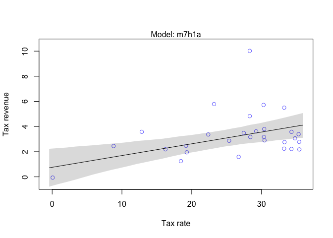<!-- -->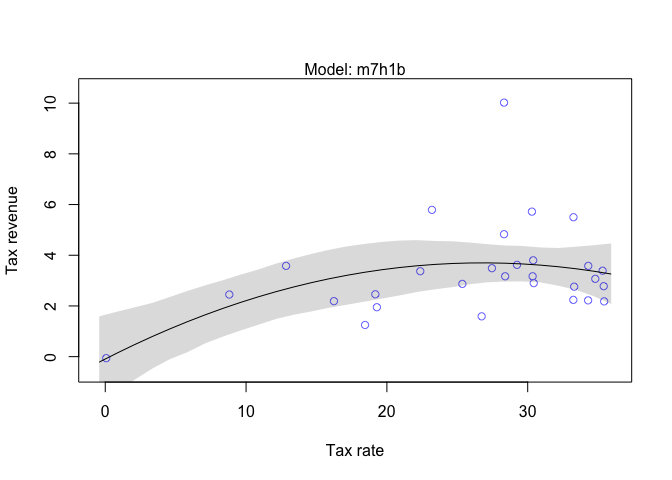<!-- -->

``` r
# compare the models
compare(m7h1a, m7h1b, func = WAIC)
```

    ##           WAIC       SE    dWAIC      dSE    pWAIC  weight
    ## m7h1a 124.4521 23.04947 0.000000       NA 6.266654 0.62296
    ## m7h1b 125.4563 26.13319 1.004262 4.248105 8.316072 0.37704

The model with a polynomial term makes better predictions, but it is
only slightly better than the straight-line model. In general, higher
tax rate produces higher tax revenue, but very high tax rate seems to
reduce the revenue a little.

### 7H2

``` r
# the PSIS score gives warning
compare(m7h1a, m7h1b, func = PSIS)
```

    ## Some Pareto k values are very high (>1). Set pointwise=TRUE to inspect individual points.
    ## Some Pareto k values are very high (>1). Set pointwise=TRUE to inspect individual points.

    ##           PSIS       SE    dPSIS      dSE     pPSIS     weight
    ## m7h1a 128.6343 27.30702 0.000000       NA  8.339334 0.94460083
    ## m7h1b 134.3067 35.34413 5.672396 8.585923 12.785818 0.05539917

``` r
# check the pointwise score
set.seed(1999)
laffer_psis <- PSIS(m7h1b, pointwise = TRUE)
```

    ## Some Pareto k values are very high (>1). Set pointwise=TRUE to inspect individual points.

``` r
laffer_waic <- WAIC(m7h1b, pointwise = TRUE)
plot(laffer_psis$k, laffer_waic$penalty, 
     xlab = "Pareto k", ylab = "WAIC penalty")
points(laffer_psis$k[which(laffer_psis$k > 1)], laffer_waic$penalty[which(laffer_psis$k > 1)],
       col = "red", lwd = 3)
```

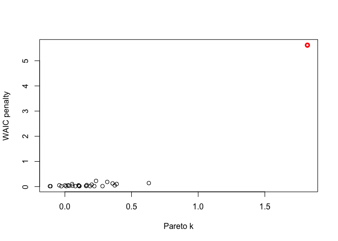<!-- -->

There is one influential case. Let’s try fitting a model using Student’s
*t* distribution.

``` r
m7h2 <- quap(
  alist(
    tax_revenue ~ dstudent(2, mu, sigma),
    mu <- a + b1*tax_rate + b2*tax_rate^2,
    a ~ dnorm(0,1),
    c(b1,b2) ~ dnorm(0,1),
    sigma ~ dexp(1)
  ), data = d
)

# plotting
plot_tax(m7h2)
```

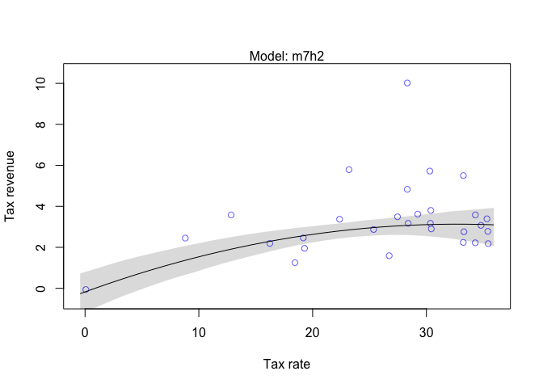<!-- -->

``` r
# see the WAIC and PSIS
laffert_psis <- PSIS(m7h2, pointwise = TRUE)
laffert_waic <- WAIC(m7h2, pointwise = TRUE)
plot(laffert_psis$k, laffert_waic$penalty, xlim = c(-0.15, 1), ylim = c(0, 0.5),
     xlab = "Pareto k", ylab = "WAIC penalty")
```

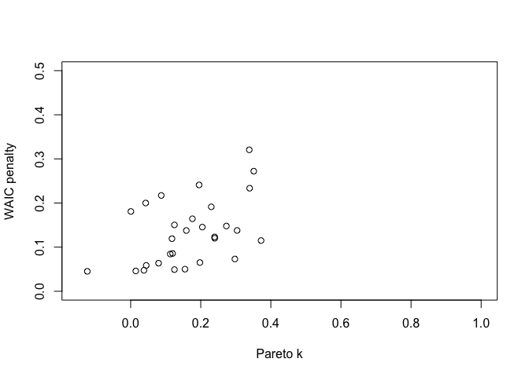<!-- -->

There is no points with big values of k or pWAIC anymore.

### 7H3

Three islands and five species. Calculate the information entropy for
each and use each on to predict the other 2, calculate the KL
divergence.

``` r
bird <- 
  data.frame(
    i1 = rep(0.2, 5),
    i2 = c(0.8, 0.1, 0.05, 0.025, 0.025),
    i3 = c(0.05, 0.15, 0.7, 0.05, 0.05)
  )

# calculate the information entropy for each island
ie <- apply(bird, 2, function (x) -sum(x*log(x)))
ie
```

    ##        i1        i2        i3 
    ## 1.6094379 0.7430039 0.9836003

``` r
# use each island to prediction the other two
kld <- data.frame(
  i1 = rep(NA, 3),
  i2 = rep(NA, 3),
  i3 = rep(NA, 3)
)

for(i in 1:3) {
  kld_i <- apply(bird, 2, 
        function(x) (-sum(x*log(bird[,i]))) - (-sum(x*log(x)))
        )
  kld[i,] <- kld_i
}

kld
```

    ##          i1       i2        i3
    ## 1 0.0000000 0.866434 0.6258376
    ## 2 0.9704061 0.000000 1.8388452
    ## 3 0.6387604 2.010914 0.0000000

Island 1 seems to predict the others the best. This may be because the
probability for each species is the most “neutral”, i.e., each species
has an equal probability to occur. When using this model to predict the
others, one will surely get a fairly good prediction because it doesn’t
distinguish between species. And we can see when using island 2 and
island 3 to predict island 1, the KL divergence is not very large as
well. However, when island 2 and island 3 predict each other, they are
fairly far apart.

## Chapter 8

### 8H1 & 8H2

Add a `bed` as a predictor in the tuplis model.

``` r
# a model including bed as a predictor
m8.6 <- quap(
  alist(
    blooms_std ~ dnorm(mu, sigma),
    mu <- a[b] + bw[b]*water_cent + bs[b]*shade_cent + bws[b]*water_cent*shade_cent,
    a[b] ~ dnorm(0.5, 0.25),
    bw[b] ~ dnorm(0, 0.25),
    bs[b] ~ dnorm(0, 0.25),
    bws[b] ~ dnorm(0, 0.25),
    sigma ~ dexp(1)
  ),
  data = d
)

precis(m8.6)
```

    ## 12 vector or matrix parameters hidden. Use depth=2 to show them.

    ##             mean        sd       5.5%     94.5%
    ## sigma 0.08605885 0.0117212 0.06732611 0.1047916

``` r
# plotting
par(mfrow = c(3, 3))
for (b in 1:3) {
  
  for (s in -1:1) {
  idx <- which(d$shade_cent == s & d$b == b)
  plot(d$water_cent[idx], d$blooms_std[idx], xlim = c(-1, 1), ylim = c(0, 1),
       xlab = "water", ylab = "blooms", pch = 16, col = rangi2)
  mu <- link(m8.6, data = data.frame(b = b, shade_cent = s, water_cent = -1:1))
  lines(-1:1, apply(mu, 2, mean))
  shade(apply(mu, 2, PI), -1:1)
  }
  
}
```

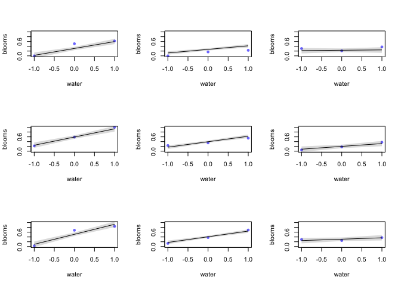<!-- -->

Compare the WAIC scores of the models

``` r
compare(m8.5, m8.6, func = WAIC)
```

    ##           WAIC        SE    dWAIC      dSE     pWAIC     weight
    ## m8.5 -22.46180  9.955169 0.000000       NA  6.328359 0.90978585
    ## m8.6 -17.83976 12.228006 4.622046 11.84537 17.540475 0.09021415

The comparison shows that the model omitting `bed` makes better
predictions than the model including it. The standard error of the
difference in WAIC is bigger than the difference itself, indicating that
there is uncertainty in whether the difference is reliable. The
coefficients of the model of data in different beds are not very
different, meaning that there may not be big difference in how water and
shade influence blooms in different bed conditions. Therefore, it makes
sens that the model without `bed` have better predictive accuracy.

### 8H3

Check the influential cases in the rugged data and use Student-t
distribution to fit a new one

``` r
set.seed(7)
m8.3_waic <- WAIC(m8.3, pointwise = TRUE)
m8.3_psis <- PSIS(m8.3, pointwise = TRUE)
```

    ## Some Pareto k values are high (>0.5). Set pointwise=TRUE to inspect individual points.

``` r
# plot
plot(m8.3_psis$k, m8.3_waic$penalty,
     xlab = "Pareto k", ylab = "WAIC penalty")
abline(v = 0.5, col = "red")
```

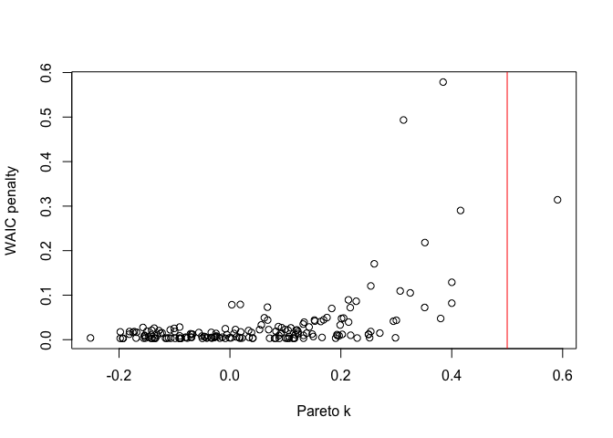<!-- -->

``` r
# check which are the influential cases
idx <- which(m8.3_psis$k > 0.5 | m8.3_waic$penalty > 0.5)
inf <- d2[idx,]
inf$country
```

    ## [1] Seychelles Tajikistan
    ## 234 Levels: Afghanistan Albania Algeria American Samoa Andorra ... Zimbabwe

The influential countries do include Seychelles. Let’s plot the model
against data and see what are happening with these countries.

``` r
par(mfrow = c(1, 2))
plot(NULL, xlim = c(0, 1), ylim = c(0.5, 1.5),
     xlab = "ruggedness", ylab = "logged GDP")
points(d2$rugged_std[d2$cid == 1], d2$log_gdp_std[d2$cid == 1],
       col = rangi2, pch = 16)
points(inf$rugged_std[inf$cid == 1], inf$log_gdp_std[inf$cid == 1], 
       col = "red", lwd = 2)
lines(r_seq, mu_Africa_mu, col = rangi2, lwd = 3)
shade(mu_Africa_PI, r_seq, col = col.alpha(rangi2, 0.2))
mtext("African countries")

plot(NULL, xlim = c(0, 1), ylim = c(0.5, 1.5),
     xlab = "ruggedness", ylab = "logged GDP")
points(d2$rugged_std[d2$cid == 2], d2$log_gdp_std[d2$cid == 2],
       col = "gray", pch = 16)
points(inf$rugged_std[inf$cid == 2], inf$log_gdp_std[inf$cid == 2], 
       col = "red", lwd = 2)
lines(r_seq, mu_nonAfrica_mu, lwd = 3)
shade(mu_nonAfrica_PI, r_seq)
mtext("Non-African countries")
```

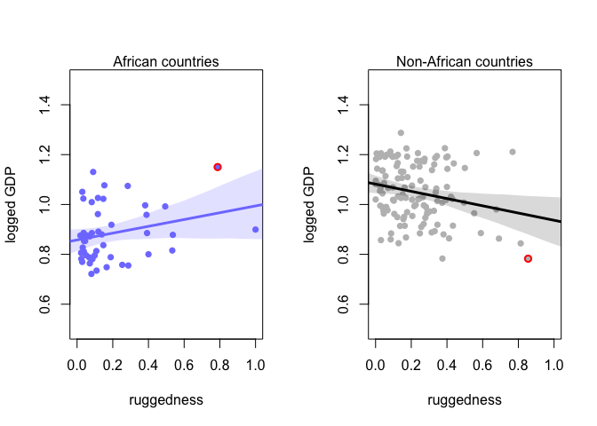<!-- -->

Seems that Seychelles has both high ruggedness and high GDP, while
Tajikistan has high ruggedness and exceptionally low GDP.

Let’s now fit a Student-t distribution to this data.

``` r
m8.3t <- quap(
  alist(
    log_gdp_std ~ dstudent(2, mu, sigma),
    mu <- a[cid] + b[cid] * (rugged_std - m_rugged),
    a[cid] ~ dnorm(1, 0.1),
    b[cid] ~ dnorm(0, 0.3),
    sigma ~ dexp(1)
  ),
  data = d2
)

set.seed(7)
m8.3t_waic <- WAIC(m8.3t, pointwise = TRUE)
m8.3t_psis <- PSIS(m8.3t, pointwise = TRUE)

# plot
plot(m8.3t_psis$k, m8.3t_waic$penalty,
     xlab = "Pareto k", ylab = "WAIC penalty")
abline(v = 0.5, col = "red")
```

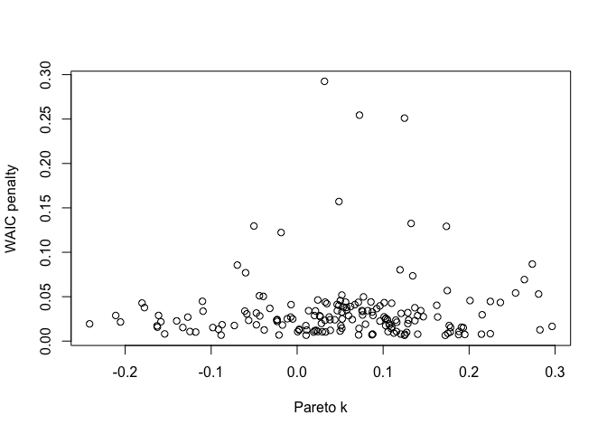<!-- -->

There are no extreme outliers in thie model.

### 8H4

Use data `nettle` to evaluate the hypothesis that language diversity is
partly a product of food security. In particular, evaluate the main
effects of `mean.growing.season` and `sd.growing.season` and their
two-way interaction. In all the models, consider log(area) as a
covariate.

``` r
data(nettle)
d <- nettle
# language per capita
d$lang.per.cap <- d$num.lang / d$k.pop
# lang.per.cap and area on a log scale
d$log.lpc <- log(d$lang.per.cap)
d$log.area <- log(d$area)
# standardize mean and sd of growing season on a scale of 0 to 1
d$mu.gs.std <- 
  d$mean.growing.season / (max(d$mean.growing.season) - min(d$mean.growing.season))
d$sd.gs.std <- 
  d$sd.growing.season / (max(d$sd.growing.season) - min(d$sd.growing.season))
```

1)  Evaluate the hypothesis that language diversity, as measured by
    `log(lang.per.cap)`, is positively associated with the average
    length of the growing season, `mean.growing.season`. Consider
    `log(area)` in your regression(s) as a covariate (not an
    interaction). Interpret your results.

Prior choices:

-   `a` is the log language per capita (lpc) when mean growing season
    is 0. I choose to use a very weakly informed prior for this - a
    normal distribution using the mean log lpc as the mean and 1/4 of
    its range as sd. This allows most possible value of a to lie with
    the range of the data.
-   `bmu` is the increase in log lpc with each unit of increase in mean
    growing season. The range of log lpc tells us this value is a small
    positive value (roughly 1/9 to 1/8). I will use dnorm(0, 0.5) as the
    prior, which allows most values to lie between -1 to 1.

``` r
m8h4a<- quap(
  alist(
    log.lpc ~ dnorm(mu, sigma),
    mu <- a + bmu*mu.gs.std + ba*log.area,
    a ~ dnorm(-5, 2),
    c(bmu,ba) ~ dnorm(0, 0.5),
    sigma ~ dexp(1)
  ),
  data = d
)

precis(m8h4a)
```

    ##             mean         sd       5.5%       94.5%
    ## a     -3.4800388 1.31036775 -5.5742596 -1.38581809
    ## bmu    0.7162541 0.39524052  0.0845834  1.34792476
    ## ba    -0.1860726 0.09800874 -0.3427095 -0.02943569
    ## sigma  1.4015918 0.11543906  1.2170979  1.58608573

``` r
# posterior prediction when log area is at its mean
mu.gs_seq <- seq(0, 1, length.out = 30)
mu <- link(m8h4a, data = data.frame(mu.gs.std = mu.gs_seq, log.area = mean(d$log.area)))
plot(log.lpc ~ mu.gs.std, data = d, col = rangi2,  
     xlab = "Mean growing season (std)", ylab = "Log language per capita",
     xlim = range(mu.gs_seq), ylim = range(d$log.lpc) + c(-1,1))
lines(mu.gs_seq, apply(mu, 2, mean))
shade(apply(mu, 2, PI), mu.gs_seq)
```

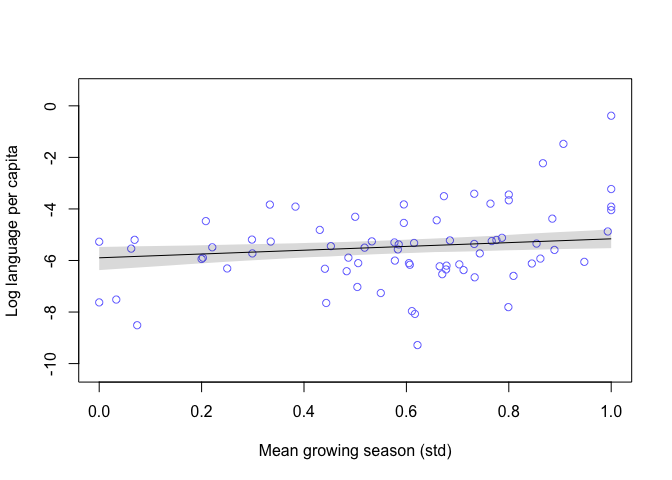<!-- -->

We can see when the area size is controlled, language diversity as
measures by log language number per capita is positively associated with
mean length of growing season.

2)  Now evaluate the hypothesis that language diversity is negatively
    associated with the standard deviation of length of growing season,
    `sd.growing.season`. This hypothesis follows from uncertainty in
    harvest favoring social insurance through larger social networks and
    therefore fewer languages. Again, consider `log(area)` as a
    covariate (not an interaction). Interpret your results.

``` r
m8h4b<- quap(
  alist(
    log.lpc ~ dnorm(mu, sigma),
    mu <- a + bsd*sd.gs.std + ba*log.area,
    a ~ dnorm(-5, 2),
    c(bsd,ba) ~ dnorm(0, 0.5),
    sigma ~ dexp(1)
  ),
  data = d
)

precis(m8h4b)
```

    ##             mean        sd       5.5%       94.5%
    ## a     -3.0020204 1.2977230 -5.0760325 -0.92800839
    ## bsd   -0.2946758 0.4523281 -1.0175835  0.42823190
    ## ba    -0.1842527 0.1019088 -0.3471227 -0.02138271
    ## sigma  1.4404186 0.1177860  1.2521738  1.62866346

``` r
# posterior prediction when log area is at its mean
sd.gs_seq <- seq(0, 1, length.out = 30)
mu <- link(m8h4b, data = data.frame(sd.gs.std = sd.gs_seq, log.area = mean(d$log.area)))
plot(log.lpc ~ sd.gs.std, data = d, col = rangi2,  
     xlab = "SD of growing season (std)", ylab = "Log language per capita",
     xlim = range(sd.gs_seq), ylim = range(d$log.lpc) + c(-1,1))
lines(sd.gs_seq, apply(mu, 2, mean))
shade(apply(mu, 2, PI), sd.gs_seq)
```

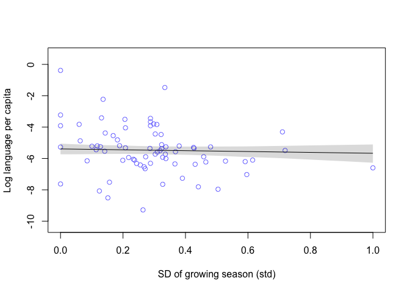<!-- -->

When the area size is controlled, language diversity is negatively
associated with standard deviation in the length of growing season.
However, this effect is very small and is not reliably different from 0.

3)  Finally, evaluate the hypothesis that `mean.growing.season` and
    `sd.growing.season` interact to synergistically reduce language
    diversity. The idea is that, in nations with longer average growing
    seasons, high variance makes storage and redistribution even more
    important than it would be otherwise. That way, people can cooperate
    to preserve and protect windfalls to be used during the droughts.

``` r
m8h4c<- quap(
  alist(
    log.lpc ~ dnorm(mu, sigma),
    mu <- a + bmu*mu.gs.std + bsd*sd.gs.std + 
      bint*mu.gs.std*sd.gs.std + ba*log.area,
    a ~ dnorm(-5, 2),
    c(bmu,bsd,bint,ba) ~ dnorm(0, 0.5),
    sigma ~ dexp(1)
  ),
  data = d
)

precis(m8h4c)
```

    ##             mean        sd       5.5%        94.5%
    ## a     -3.6631893 1.3192588 -5.7716196 -1.554759016
    ## bmu    0.7538668 0.3980714  0.1176718  1.390061755
    ## bsd   -0.3161919 0.4539922 -1.0417591  0.409375288
    ## bint  -0.2063622 0.4746098 -0.9648804  0.552155928
    ## ba    -0.1637206 0.1006311 -0.3245485 -0.002892713
    ## sigma  1.3894964 0.1153782  1.2050998  1.573893003

``` r
# draw the triptych graph
# chop the data equally into three parts
# using the mid point of each part to make posterior prediction
mu_seq <- quantile(d$mu.gs.std, prob = seq(0, 1, length.out = 7))
sd_seq <- seq(0, 1, length.out = 30)
par(mfrow = c(1,3))
for (i in 1:3) {
  idx <- which(d$mu.gs.std >= mu_seq[2*i-1] & d$mu.gs.std <= mu_seq[2*i+1])
  mu <- link(m8h4c, data = data.frame(mu.gs.std = unname(mu_seq[2*i]), 
                                      sd.gs.std = sd_seq,
                                      log.area = mean(d$log.area)))
  plot(d$sd.gs.std[idx], d$log.lpc[idx], col = rangi2, pch = 16,
       xlim = c(0,1), ylim = c(-10, 0),
        xlab = "SD of growing season (std)", ylab = "Log language per capita",
       )
  lines(sd_seq, apply(mu, 2, mean))
  shade(apply(mu, 2, PI), sd_seq)
}
```

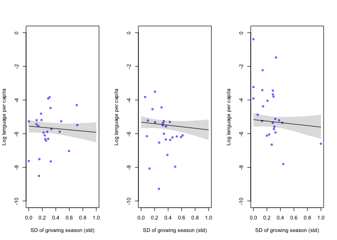<!-- -->

There doesn’t seem to be an interaction effect between average length of
growing season and its standard deviation on language diversity as
measured by log language per capita.

## Chapter 9

### 9H1

``` r
mp <- ulam( alist(
  a ~ dnorm(0,1),
  b ~ dcauchy(0,1)
), data=list(y=1) , chains=1 )
```

    ## Running MCMC with 1 chain, with 1 thread(s) per chain...
    ## 
    ## Chain 1 Iteration:   1 / 1000 [  0%]  (Warmup) 
    ## Chain 1 Iteration: 100 / 1000 [ 10%]  (Warmup) 
    ## Chain 1 Iteration: 200 / 1000 [ 20%]  (Warmup) 
    ## Chain 1 Iteration: 300 / 1000 [ 30%]  (Warmup) 
    ## Chain 1 Iteration: 400 / 1000 [ 40%]  (Warmup) 
    ## Chain 1 Iteration: 500 / 1000 [ 50%]  (Warmup) 
    ## Chain 1 Iteration: 501 / 1000 [ 50%]  (Sampling) 
    ## Chain 1 Iteration: 600 / 1000 [ 60%]  (Sampling) 
    ## Chain 1 Iteration: 700 / 1000 [ 70%]  (Sampling) 
    ## Chain 1 Iteration: 800 / 1000 [ 80%]  (Sampling) 
    ## Chain 1 Iteration: 900 / 1000 [ 90%]  (Sampling) 
    ## Chain 1 Iteration: 1000 / 1000 [100%]  (Sampling) 
    ## Chain 1 finished in 0.0 seconds.

``` r
precis(mp)
```

    ##         mean        sd      5.5%    94.5%     n_eff    Rhat4
    ## a -0.2661598 0.9622542 -1.835753 1.202989 133.61244 1.024048
    ## b  0.4036406 3.3099149 -2.836825 4.633406  77.23724 1.000443

``` r
traceplot(mp, n_cols = 2)
```

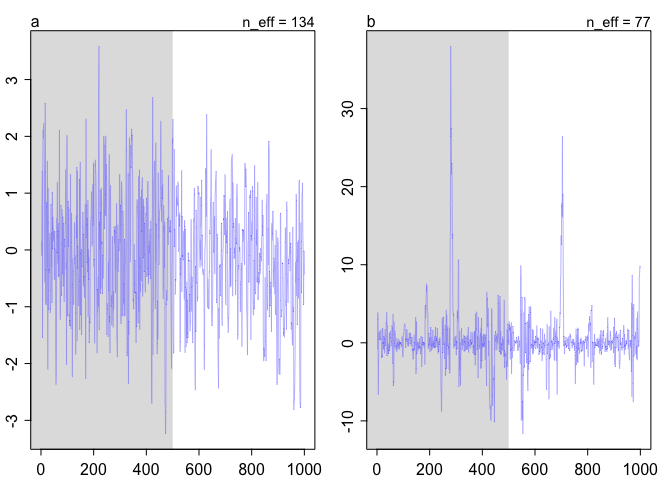<!-- -->

``` r
post <- extract.samples(mp)

par(mfrow = c(1,2))
dens(post$a)
dens(post$b)
```

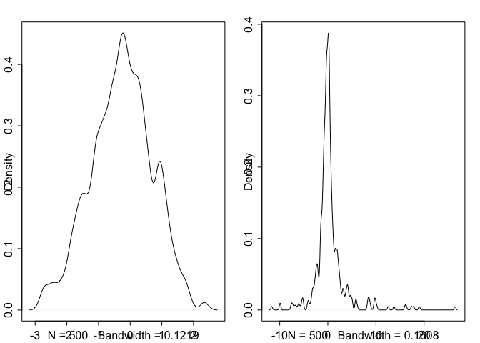<!-- -->

This model is directly extracting samples from the two distribution
without fitting into any data.

The traceplot for b is a bit wild, it doesn’t seem to stay in one
distribution, while the one for a looks well-behaved. The distribution
of a is approximately normal, while b is not a normal distribution. It
peaks at 0 and has some extreme values.

### 9H3 & 9H4

Use the leg data to see how changing the priors of one parameter can
unexpectedly influence another, especially when they are highly
correlated.

``` r
# fit a model using MCMC
m5.8s <- ulam( 
  alist(
  height ~ dnorm(mu , sigma) ,
  mu <- a + bl*leg_left + br*leg_right , 
  a ~ dnorm(10, 100) ,
  bl ~ dnorm(2, 10) ,
  br ~ dnorm(2, 10) ,
  sigma ~ dexp( 1 )
  ), 
  data = d, chains = 4, log_lik = TRUE,
  start = list(a = 10, bl = 0, br = 0.1, sigma = 1)
)
```

    ## Running MCMC with 4 sequential chains...
    ## 
    ## Chain 1 Iteration:   1 / 1000 [  0%]  (Warmup) 
    ## Chain 1 Iteration: 100 / 1000 [ 10%]  (Warmup) 
    ## Chain 1 Iteration: 200 / 1000 [ 20%]  (Warmup) 
    ## Chain 1 Iteration: 300 / 1000 [ 30%]  (Warmup) 
    ## Chain 1 Iteration: 400 / 1000 [ 40%]  (Warmup) 
    ## Chain 1 Iteration: 500 / 1000 [ 50%]  (Warmup) 
    ## Chain 1 Iteration: 501 / 1000 [ 50%]  (Sampling) 
    ## Chain 1 Iteration: 600 / 1000 [ 60%]  (Sampling) 
    ## Chain 1 Iteration: 700 / 1000 [ 70%]  (Sampling) 
    ## Chain 1 Iteration: 800 / 1000 [ 80%]  (Sampling) 
    ## Chain 1 Iteration: 900 / 1000 [ 90%]  (Sampling) 
    ## Chain 1 Iteration: 1000 / 1000 [100%]  (Sampling) 
    ## Chain 1 finished in 6.1 seconds.
    ## Chain 2 Iteration:   1 / 1000 [  0%]  (Warmup) 
    ## Chain 2 Iteration: 100 / 1000 [ 10%]  (Warmup) 
    ## Chain 2 Iteration: 200 / 1000 [ 20%]  (Warmup) 
    ## Chain 2 Iteration: 300 / 1000 [ 30%]  (Warmup) 
    ## Chain 2 Iteration: 400 / 1000 [ 40%]  (Warmup) 
    ## Chain 2 Iteration: 500 / 1000 [ 50%]  (Warmup) 
    ## Chain 2 Iteration: 501 / 1000 [ 50%]  (Sampling) 
    ## Chain 2 Iteration: 600 / 1000 [ 60%]  (Sampling) 
    ## Chain 2 Iteration: 700 / 1000 [ 70%]  (Sampling) 
    ## Chain 2 Iteration: 800 / 1000 [ 80%]  (Sampling) 
    ## Chain 2 Iteration: 900 / 1000 [ 90%]  (Sampling) 
    ## Chain 2 Iteration: 1000 / 1000 [100%]  (Sampling) 
    ## Chain 2 finished in 5.5 seconds.
    ## Chain 3 Iteration:   1 / 1000 [  0%]  (Warmup) 
    ## Chain 3 Iteration: 100 / 1000 [ 10%]  (Warmup) 
    ## Chain 3 Iteration: 200 / 1000 [ 20%]  (Warmup) 
    ## Chain 3 Iteration: 300 / 1000 [ 30%]  (Warmup) 
    ## Chain 3 Iteration: 400 / 1000 [ 40%]  (Warmup) 
    ## Chain 3 Iteration: 500 / 1000 [ 50%]  (Warmup) 
    ## Chain 3 Iteration: 501 / 1000 [ 50%]  (Sampling) 
    ## Chain 3 Iteration: 600 / 1000 [ 60%]  (Sampling) 
    ## Chain 3 Iteration: 700 / 1000 [ 70%]  (Sampling) 
    ## Chain 3 Iteration: 800 / 1000 [ 80%]  (Sampling) 
    ## Chain 3 Iteration: 900 / 1000 [ 90%]  (Sampling) 
    ## Chain 3 Iteration: 1000 / 1000 [100%]  (Sampling) 
    ## Chain 3 finished in 5.0 seconds.
    ## Chain 4 Iteration:   1 / 1000 [  0%]  (Warmup) 
    ## Chain 4 Iteration: 100 / 1000 [ 10%]  (Warmup) 
    ## Chain 4 Iteration: 200 / 1000 [ 20%]  (Warmup) 
    ## Chain 4 Iteration: 300 / 1000 [ 30%]  (Warmup) 
    ## Chain 4 Iteration: 400 / 1000 [ 40%]  (Warmup) 
    ## Chain 4 Iteration: 500 / 1000 [ 50%]  (Warmup) 
    ## Chain 4 Iteration: 501 / 1000 [ 50%]  (Sampling) 
    ## Chain 4 Iteration: 600 / 1000 [ 60%]  (Sampling) 
    ## Chain 4 Iteration: 700 / 1000 [ 70%]  (Sampling) 
    ## Chain 4 Iteration: 800 / 1000 [ 80%]  (Sampling) 
    ## Chain 4 Iteration: 900 / 1000 [ 90%]  (Sampling) 
    ## Chain 4 Iteration: 1000 / 1000 [100%]  (Sampling) 
    ## Chain 4 finished in 5.5 seconds.
    ## 
    ## All 4 chains finished successfully.
    ## Mean chain execution time: 5.5 seconds.
    ## Total execution time: 22.5 seconds.

    ## Warning: 28 of 2000 (1.0%) transitions hit the maximum treedepth limit of 11.
    ## See https://mc-stan.org/misc/warnings for details.

``` r
# change the prior for br so it's strictly positive
m5.8s2 <- ulam( 
  alist(
  height ~ dnorm(mu , sigma) ,
  mu <- a + bl*leg_left + br*leg_right , 
  a ~ dnorm(10, 100) ,
  bl ~ dnorm(2, 10) ,
  br ~ dnorm(2, 10) ,
  sigma ~ dexp( 1 )
  ), 
  data = d, chains = 4, 
  constraints = list(br = "lower=0"), log_lik = TRUE,
  start = list(a = 10, bl = 0, br = 0.1, sigma = 1)
)
```

    ## Running MCMC with 4 sequential chains...
    ## 
    ## Chain 1 Iteration:   1 / 1000 [  0%]  (Warmup) 
    ## Chain 1 Iteration: 100 / 1000 [ 10%]  (Warmup) 
    ## Chain 1 Iteration: 200 / 1000 [ 20%]  (Warmup) 
    ## Chain 1 Iteration: 300 / 1000 [ 30%]  (Warmup) 
    ## Chain 1 Iteration: 400 / 1000 [ 40%]  (Warmup) 
    ## Chain 1 Iteration: 500 / 1000 [ 50%]  (Warmup) 
    ## Chain 1 Iteration: 501 / 1000 [ 50%]  (Sampling) 
    ## Chain 1 Iteration: 600 / 1000 [ 60%]  (Sampling) 
    ## Chain 1 Iteration: 700 / 1000 [ 70%]  (Sampling) 
    ## Chain 1 Iteration: 800 / 1000 [ 80%]  (Sampling) 
    ## Chain 1 Iteration: 900 / 1000 [ 90%]  (Sampling) 
    ## Chain 1 Iteration: 1000 / 1000 [100%]  (Sampling) 
    ## Chain 1 finished in 7.2 seconds.
    ## Chain 2 Iteration:   1 / 1000 [  0%]  (Warmup) 
    ## Chain 2 Iteration: 100 / 1000 [ 10%]  (Warmup) 
    ## Chain 2 Iteration: 200 / 1000 [ 20%]  (Warmup) 
    ## Chain 2 Iteration: 300 / 1000 [ 30%]  (Warmup) 
    ## Chain 2 Iteration: 400 / 1000 [ 40%]  (Warmup) 
    ## Chain 2 Iteration: 500 / 1000 [ 50%]  (Warmup) 
    ## Chain 2 Iteration: 501 / 1000 [ 50%]  (Sampling) 
    ## Chain 2 Iteration: 600 / 1000 [ 60%]  (Sampling) 
    ## Chain 2 Iteration: 700 / 1000 [ 70%]  (Sampling) 
    ## Chain 2 Iteration: 800 / 1000 [ 80%]  (Sampling) 
    ## Chain 2 Iteration: 900 / 1000 [ 90%]  (Sampling) 
    ## Chain 2 Iteration: 1000 / 1000 [100%]  (Sampling) 
    ## Chain 2 finished in 5.0 seconds.
    ## Chain 3 Iteration:   1 / 1000 [  0%]  (Warmup)

    ## Chain 3 Informational Message: The current Metropolis proposal is about to be rejected because of the following issue:

    ## Chain 3 Exception: normal_lpdf: Scale parameter is 0, but must be positive! (in '/var/folders/9n/6sxgpgz9295dh1nfk3mnksl00000gn/T/RtmpUhGj9c/model-4851eaad926.stan', line 21, column 4 to column 34)

    ## Chain 3 If this warning occurs sporadically, such as for highly constrained variable types like covariance matrices, then the sampler is fine,

    ## Chain 3 but if this warning occurs often then your model may be either severely ill-conditioned or misspecified.

    ## Chain 3

    ## Chain 3 Iteration: 100 / 1000 [ 10%]  (Warmup) 
    ## Chain 3 Iteration: 200 / 1000 [ 20%]  (Warmup) 
    ## Chain 3 Iteration: 300 / 1000 [ 30%]  (Warmup) 
    ## Chain 3 Iteration: 400 / 1000 [ 40%]  (Warmup) 
    ## Chain 3 Iteration: 500 / 1000 [ 50%]  (Warmup) 
    ## Chain 3 Iteration: 501 / 1000 [ 50%]  (Sampling) 
    ## Chain 3 Iteration: 600 / 1000 [ 60%]  (Sampling) 
    ## Chain 3 Iteration: 700 / 1000 [ 70%]  (Sampling) 
    ## Chain 3 Iteration: 800 / 1000 [ 80%]  (Sampling) 
    ## Chain 3 Iteration: 900 / 1000 [ 90%]  (Sampling) 
    ## Chain 3 Iteration: 1000 / 1000 [100%]  (Sampling) 
    ## Chain 3 finished in 7.0 seconds.
    ## Chain 4 Iteration:   1 / 1000 [  0%]  (Warmup) 
    ## Chain 4 Iteration: 100 / 1000 [ 10%]  (Warmup) 
    ## Chain 4 Iteration: 200 / 1000 [ 20%]  (Warmup) 
    ## Chain 4 Iteration: 300 / 1000 [ 30%]  (Warmup) 
    ## Chain 4 Iteration: 400 / 1000 [ 40%]  (Warmup) 
    ## Chain 4 Iteration: 500 / 1000 [ 50%]  (Warmup) 
    ## Chain 4 Iteration: 501 / 1000 [ 50%]  (Sampling) 
    ## Chain 4 Iteration: 600 / 1000 [ 60%]  (Sampling) 
    ## Chain 4 Iteration: 700 / 1000 [ 70%]  (Sampling) 
    ## Chain 4 Iteration: 800 / 1000 [ 80%]  (Sampling) 
    ## Chain 4 Iteration: 900 / 1000 [ 90%]  (Sampling) 
    ## Chain 4 Iteration: 1000 / 1000 [100%]  (Sampling) 
    ## Chain 4 finished in 6.3 seconds.
    ## 
    ## All 4 chains finished successfully.
    ## Mean chain execution time: 6.4 seconds.
    ## Total execution time: 25.8 seconds.

    ## Warning: 20 of 2000 (1.0%) transitions ended with a divergence.
    ## See https://mc-stan.org/misc/warnings for details.

    ## Warning: 355 of 2000 (18.0%) transitions hit the maximum treedepth limit of 11.
    ## See https://mc-stan.org/misc/warnings for details.

``` r
plot(coeftab(m5.8s, m5.8s2), par = c("bl", "br"))
```

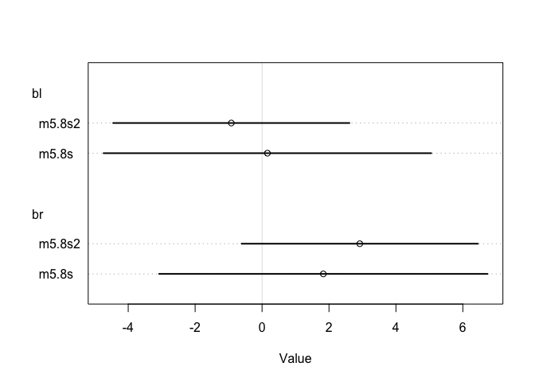<!-- -->

When br is constrained to be strictly positive, the posterior
distribution of `br` has a higher mean value, while `bl` has a lower
mean value. Their variance both reduced. This is because the length of
both legs is approximately the same variable, therefore in the model,
`bl + br` is approximately a constant. When `br` increases, `bl` is sure
to decrease.

``` r
compare(m5.8s, m5.8s2, func = WAIC)
```

    ##            WAIC       SE    dWAIC       dSE    pWAIC    weight
    ## m5.8s2 194.1965 11.31437 0.000000        NA 2.729243 0.5738926
    ## m5.8s  194.7920 11.14093 0.595502 0.7517033 2.993046 0.4261074

The first model has a higer number of effective parameters. This is
probably because when the prior of `br` is not constrained, its
posterior distribution has higher variance, and so as the sample drawn
from it. It increases the variance in each parameter over the posterior
distribution, thus increasing the penalty term.

### 9H6

Modify the Metropolis algorithm to write your simple MCMC estimator for
globe tossing data and model.

Prior -\> knowing how many water tosses we get -\> posterior MCMC is
used to get the posterior distribution

(The code sample is only about using an algorithm of sampling to
approximate the true distribution, knowing the probability of the
current point and the proposed point.)

``` r
# we observe 6 water from 9 tossings
n_sample <- 1e5
position <- rep(0, n_sample)
p_grid <- seq(0, 1, length.out = 50)
current <- 1
for (i in 1:n_sample){
  
  position[i] <- current
  
  # move left or right
  coin_toss <- ifelse(runif(1) < 0.5, 1, -1)
  
  # the proposal
  proposal <- which(p_grid == current) + coin_toss
  
  # make sure the position move in a ring
  if (proposal > length(p_grid)) proposal <- 1
  if (proposal < 1) proposal <- 50
  
  # the probability on the two end is zero
  # so we always move when we are there
  if (current == 1 | current == 0){
    prob_move <- 1
  } else {
    prob_move <- dbinom(6, 9, prob = p_grid[proposal]) / dbinom(6, size = 9, current)
  }
  
  # move according to the probability
  current <- ifelse(runif(1) < prob_move, p_grid[proposal], current)
}

hist(position, breaks = p_grid,
     xlab = "Probability of water", 
     main = "Posterior distribution of globe tossing")
```

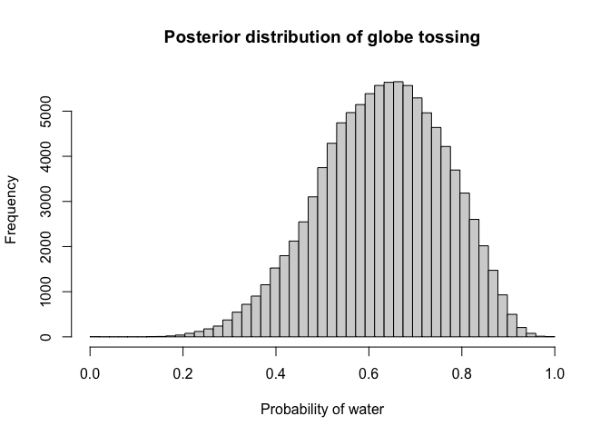<!-- -->

``` r
# the traceplot
plot(1:n_sample, position, type = "l", col = "turquoise", ylim = c(0,1),
     xlab = "", ylab = "")
```

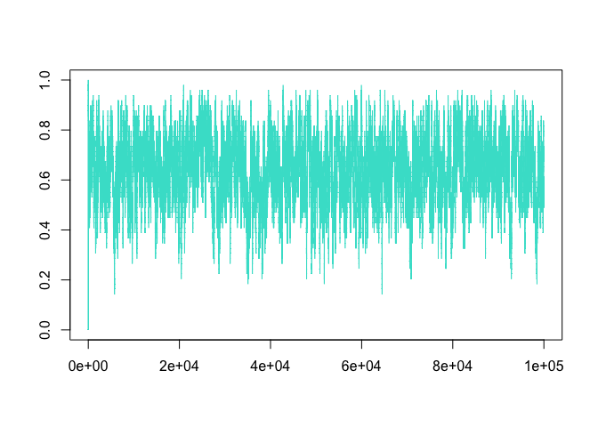<!-- -->

### 9H7

Hamilton Monte Carlo for globe tossing data.

The function of log likelihood:

 + \log P(p|0,1)")

, where
")
and
")

``` r
x <- 6
n <- 9

# likelihood function
U <- function(q, min = 0, max = 1) {
  p <- q
  if(q >= 0 & q <= 1)(
    U <- sum(dbinom(x, n, prob = p, log = TRUE)) + dunif(p, min, max, log = TRUE)
  ) else U <- 0
  return(-U)
}
```

The gradient function is:

}{dp} \\
&= \frac{d(\sum_i \log \binom{9}{x_i} + \log p^{x_i} + \log (1-p)^{9-x_i})}{dp} \\
&= \sum_i \frac{x_i}{p} + \frac{9-x_i}{1-p}
\end{aligned}")

``` r
# gradient function
U_grad <- function(q, min = 0, max = 1) {
  p <- q
  if(q > 0 & q < 1)(
    G <- sum(x/p + (n-x)/(1-p))
  ) else G <- 0
  return(-G)
}
```

Draw samples. Here epsilon and L need to be tuned.

``` r
# draw samples
set.seed(1999)
Q <- list()
initial <- 0.2
Q$q <- initial # current position
step <- 0.002 # epsilon
L <- 6 # steps
n_sample <- 1e4
position <- rep(0, n_sample)
accept <- rep(0, n_sample)
  
for (i in 1:n_sample) {
  Q <- HMC2(U, U_grad, step, L, Q$q)
  position[i] <- Q$q
  accept[i] <- Q$accept
}

plot(NULL, xlim = c(0,100), ylim = c(0,1),
       xlab = "", ylab = "")
points(0, initial, pch = 4)

# plot the trace
for (i in 1:100){
  points(i, position[i], 
         pch = ifelse(accept[i] == 1, 1, 16),
         col = ifelse(accept[i] == 1, "black", "red"))
}
```

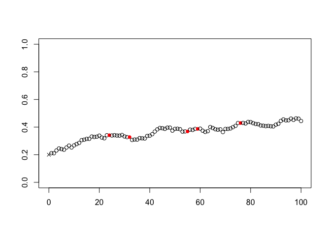<!-- -->

``` r
# histogram
hist(position[which(accept == 1)], breaks = seq(0, 1, length.out = 30),
     xlab = "Probability of water", 
     main = "Posterior distribution of globe tossing")
```

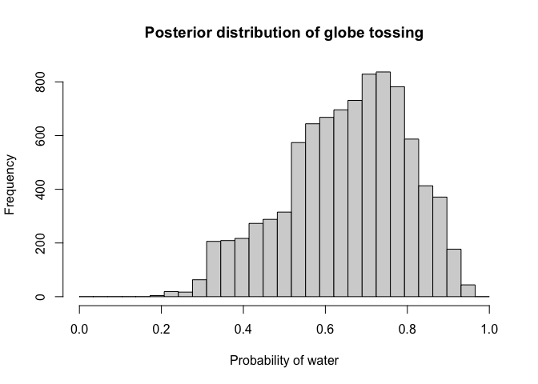<!-- -->

``` r
# traceplot
plot(1:n_sample, position, ylim = c(0,1), type = "l")
mtext(paste("Number of effective samples:", sum(accept)))
```

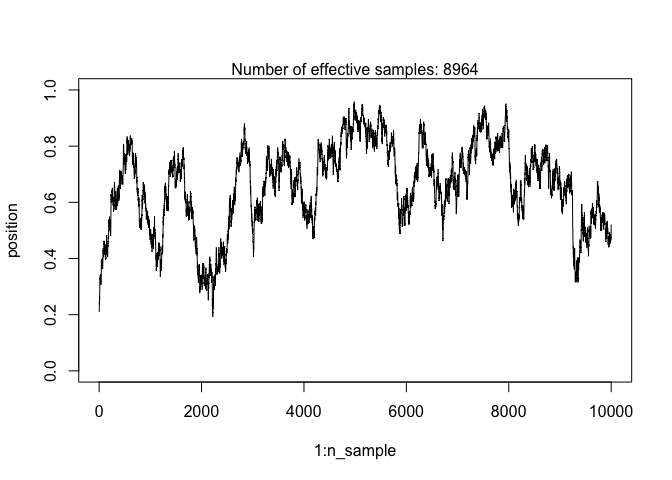<!-- -->
