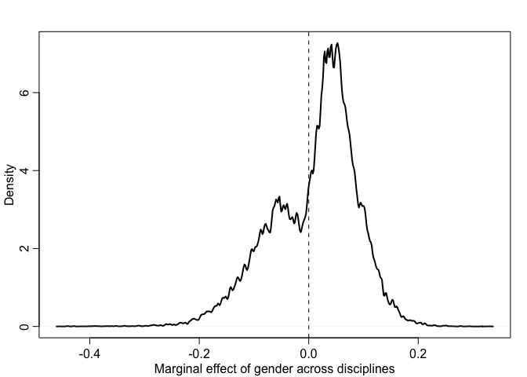

Week 5 Homework
================
Yurun (Ellen) Ying
2022-06-18

## Course homework

### Problem 1

The total causal effect of gender on grant awards in the `NWOGrants`
data.

``` r
data("NWOGrants")
d <- NWOGrants

# a DAG
dag1 <- dagitty("dag{ G -> D -> A; G -> A}")
coordinates(dag1) <- list(x = c(G = 0, D = 0.5, A = 1),
                          y = c(G = 1, D = 0.3, A = 1))
drawdag(dag1)
```

<!-- -->

We will use this model to estimate the total effect of gender on grant
awards:

")

![\mathrm{logit}(p_i) = a\_{GID\[i\]}](https://latex.codecogs.com/png.image?%5Cdpi%7B110%7D&space;%5Cbg_white&space;%5Cmathrm%7Blogit%7D%28p_i%29%20%3D%20a_%7BGID%5Bi%5D%7D "\mathrm{logit}(p_i) = a_{GID[i]}")

![a\_{GID\[i\]} \sim \mathrm{TBD}](https://latex.codecogs.com/png.image?%5Cdpi%7B110%7D&space;%5Cbg_white&space;a_%7BGID%5Bi%5D%7D%20%5Csim%20%5Cmathrm%7BTBD%7D "a_{GID[i]} \sim \mathrm{TBD}")

``` r
# choose priors
# n <- 1e5
# a <- rnorm(n, 0, 1)
# dens(inv_logit(a))

# clean data
dat <- data.frame(
  D = rep(1:9, each = 2),
  G = rep(1:2, 9), # 1 is male, 2 is female
  N = d$applications,
  A = d$awards
)

# fit a model
m1 <- quap(
  alist(
    A ~ dbinom(N, p),
    logit(p) <- a[G],
    a[G] ~ dnorm(0, 1)
  ), data = dat
)

precis(m1, depth = 2)
```

    ##           mean         sd      5.5%     94.5%
    ## a[1] -1.527909 0.06447692 -1.630955 -1.424862
    ## a[2] -1.731170 0.08088911 -1.860447 -1.601894

``` r
# posterior prediction
post <- extract.samples(m1)
diff <- inv_logit(post$a[,1]) - inv_logit(post$a[,2])
dens(diff, lwd = 3, xlab = "M-F posterior contrast")
abline(v=0, lty = 2, col = "tomato")
```

<!-- -->

Across disciplines, women have a slight disadvantage than men in winning
the grant awards.

### Problem 2

Estimate the direct causal effect of gender on grant awards.

``` r
m2 <- ulam(
  alist(
    A ~ dbinom(N, p),
    logit(p) <- a[G,D],
    matrix[G,D]:a ~ dnorm(0, 1)
  ), data = dat, chains = 4, cores = 4
)
```

    ## Running MCMC with 4 parallel chains, with 1 thread(s) per chain...
    ## 
    ## Chain 1 Iteration:   1 / 1000 [  0%]  (Warmup) 
    ## Chain 1 Iteration: 100 / 1000 [ 10%]  (Warmup) 
    ## Chain 1 Iteration: 200 / 1000 [ 20%]  (Warmup) 
    ## Chain 1 Iteration: 300 / 1000 [ 30%]  (Warmup) 
    ## Chain 1 Iteration: 400 / 1000 [ 40%]  (Warmup) 
    ## Chain 1 Iteration: 500 / 1000 [ 50%]  (Warmup) 
    ## Chain 1 Iteration: 501 / 1000 [ 50%]  (Sampling) 
    ## Chain 1 Iteration: 600 / 1000 [ 60%]  (Sampling) 
    ## Chain 1 Iteration: 700 / 1000 [ 70%]  (Sampling) 
    ## Chain 1 Iteration: 800 / 1000 [ 80%]  (Sampling) 
    ## Chain 1 Iteration: 900 / 1000 [ 90%]  (Sampling) 
    ## Chain 1 Iteration: 1000 / 1000 [100%]  (Sampling) 
    ## Chain 2 Iteration:   1 / 1000 [  0%]  (Warmup) 
    ## Chain 2 Iteration: 100 / 1000 [ 10%]  (Warmup) 
    ## Chain 2 Iteration: 200 / 1000 [ 20%]  (Warmup) 
    ## Chain 2 Iteration: 300 / 1000 [ 30%]  (Warmup) 
    ## Chain 2 Iteration: 400 / 1000 [ 40%]  (Warmup) 
    ## Chain 2 Iteration: 500 / 1000 [ 50%]  (Warmup) 
    ## Chain 2 Iteration: 501 / 1000 [ 50%]  (Sampling) 
    ## Chain 2 Iteration: 600 / 1000 [ 60%]  (Sampling) 
    ## Chain 2 Iteration: 700 / 1000 [ 70%]  (Sampling) 
    ## Chain 2 Iteration: 800 / 1000 [ 80%]  (Sampling) 
    ## Chain 2 Iteration: 900 / 1000 [ 90%]  (Sampling) 
    ## Chain 2 Iteration: 1000 / 1000 [100%]  (Sampling) 
    ## Chain 3 Iteration:   1 / 1000 [  0%]  (Warmup) 
    ## Chain 3 Iteration: 100 / 1000 [ 10%]  (Warmup) 
    ## Chain 3 Iteration: 200 / 1000 [ 20%]  (Warmup) 
    ## Chain 3 Iteration: 300 / 1000 [ 30%]  (Warmup) 
    ## Chain 3 Iteration: 400 / 1000 [ 40%]  (Warmup) 
    ## Chain 3 Iteration: 500 / 1000 [ 50%]  (Warmup) 
    ## Chain 3 Iteration: 501 / 1000 [ 50%]  (Sampling) 
    ## Chain 3 Iteration: 600 / 1000 [ 60%]  (Sampling) 
    ## Chain 3 Iteration: 700 / 1000 [ 70%]  (Sampling) 
    ## Chain 3 Iteration: 800 / 1000 [ 80%]  (Sampling) 
    ## Chain 3 Iteration: 900 / 1000 [ 90%]  (Sampling) 
    ## Chain 3 Iteration: 1000 / 1000 [100%]  (Sampling) 
    ## Chain 4 Iteration:   1 / 1000 [  0%]  (Warmup) 
    ## Chain 4 Iteration: 100 / 1000 [ 10%]  (Warmup) 
    ## Chain 4 Iteration: 200 / 1000 [ 20%]  (Warmup) 
    ## Chain 4 Iteration: 300 / 1000 [ 30%]  (Warmup) 
    ## Chain 4 Iteration: 400 / 1000 [ 40%]  (Warmup) 
    ## Chain 4 Iteration: 500 / 1000 [ 50%]  (Warmup) 
    ## Chain 4 Iteration: 501 / 1000 [ 50%]  (Sampling) 
    ## Chain 4 Iteration: 600 / 1000 [ 60%]  (Sampling) 
    ## Chain 4 Iteration: 700 / 1000 [ 70%]  (Sampling) 
    ## Chain 4 Iteration: 800 / 1000 [ 80%]  (Sampling) 
    ## Chain 4 Iteration: 900 / 1000 [ 90%]  (Sampling) 
    ## Chain 4 Iteration: 1000 / 1000 [100%]  (Sampling) 
    ## Chain 1 finished in 0.1 seconds.
    ## Chain 2 finished in 0.1 seconds.
    ## Chain 3 finished in 0.1 seconds.
    ## Chain 4 finished in 0.1 seconds.
    ## 
    ## All 4 chains finished successfully.
    ## Mean chain execution time: 0.1 seconds.
    ## Total execution time: 0.4 seconds.

``` r
precis(m2, depth = 3)
```

    ##              mean        sd      5.5%      94.5%    n_eff     Rhat4
    ## a[1,1] -0.9763069 0.2435181 -1.371642 -0.5929408 2769.826 0.9990749
    ## a[1,2] -1.3732019 0.2121964 -1.715225 -1.0457713 2581.514 1.0005587
    ## a[1,3] -0.9495966 0.2718021 -1.387632 -0.5088672 3053.935 0.9990455
    ## a[1,4] -1.7412876 0.1857924 -2.039022 -1.4478541 2581.747 0.9988394
    ## a[1,5] -1.6182042 0.1921248 -1.936780 -1.3198101 2255.811 1.0014054
    ## a[1,6] -1.9086792 0.2736549 -2.356781 -1.4855524 2996.901 0.9986782
    ## a[1,7] -1.1002015 0.1761800 -1.390300 -0.8264732 2770.716 1.0001894
    ## a[1,8] -1.6931092 0.1333775 -1.905635 -1.4826524 2555.250 1.0003561
    ## a[1,9] -1.4357803 0.1579135 -1.686908 -1.1892403 2832.219 0.9987907
    ## a[2,1] -0.9600834 0.3470498 -1.534394 -0.4263765 3153.380 0.9986318
    ## a[2,2] -1.0747695 0.3547538 -1.655250 -0.5363132 3024.244 0.9993122
    ## a[2,3] -0.8216523 0.6204022 -1.823701  0.1238281 2563.037 0.9989425
    ## a[2,4] -1.3926874 0.1913740 -1.713172 -1.0931884 2411.843 0.9987798
    ## a[2,5] -1.2244735 0.2902792 -1.693291 -0.7757207 3023.950 0.9988479
    ## a[2,6] -1.2102823 0.2605005 -1.636049 -0.8061324 2612.957 0.9994415
    ## a[2,7] -1.7005548 0.2381723 -2.104442 -1.3402935 2376.811 0.9991566
    ## a[2,8] -2.0001573 0.1495473 -2.243739 -1.7638594 2795.842 0.9995103
    ## a[2,9] -2.0140833 0.1897218 -2.324975 -1.7198342 2672.656 1.0004246

Plot for each discipline

``` r
post2 <- extract.samples(m2)
PrA <- post2$a
diff_each_D <- sapply(1:9, function (i) inv_logit(PrA[,1,i]) - inv_logit(PrA[,2,i]))

plot(NULL, xlim = c(-0.5, 0.4), ylim = c(0, 18),
     xlab = "M-F posterior contrast", ylab = "Density")
disc <- as.character(d$discipline)
for (i in 1:9) {
  dens(diff_each_D[,i], col = 1 + i, lwd = 4, add = TRUE)
  xloc <- ifelse(mean(diff_each_D[,i]) < 0, -0.35, 0.35)
  xpos <- ifelse(mean(diff_each_D[,i]) < 0, 4, 2)
  text(xloc + 0.5*mean(diff_each_D[,i]), 18 - 1.3*i, disc[2*i], col = 1+i, pos = xpos, font = 2)
}
abline(v = 0, lty = 2, lwd = 2)
```

<!-- -->

There are two disciplines where men and women have a roughly same
probability of winning awards. In three departments, men are slightly
more likely than women to win. In four departments, women are slightly
more likely to win.

Let’s now calculate the marginal effect of manipulating (the perception
of) applicants’ gender.

``` r
# number of applications in the dataset
total_app <- sum(dat$N)

# number of applications in each discplines
disc_num <- sapply(1:9, function(i) sum(dat$N[dat$D == i]))

# extract samples as if all applicants were men
PrM <- link(m2, 
            data = list(N = rep(1, total_app),
                        D = rep(1:9, times = disc_num),
                        G = rep(1, total_app)))

# extract samples as if all applicants were men
PrF <- link(m2, 
            data = list(N = rep(1, total_app),
                        D = rep(1:9, times = disc_num),
                        G = rep(2, total_app)))

# contrast
diff_marg <- PrM - PrF
mean(diff_marg); PI(diff_marg)
```

    ## [1] 0.009416856

    ##         5%        94% 
    ## -0.1270027  0.1158194

``` r
dens(diff_marg, lwd = 2, 
     xlab = "Marginal effect of gender across disciplines", ylab = "Density")
abline(v = 0, lty = 2)
```

<!-- -->

The average effect of gender across discipline is slim, but there seems
to be heterogeneity of gender difference in different departments.

## Problem 3

There may be more total applicants from those “discriminatory”
disciplines which have more weights in contributing to the total effect.
Therefore, the total effect turns out to show a slightly higher
probability for men to win the grant awards.

### Some nuances

-   The disciplines that influence the overall effect the most are those
    popular disciplines with many applicants
-   Those discipline happen to have low award rates
-   A large proportion of women applicants is from these disciplines
-   In the most popular discipline, more men than women win the award

So both the question of who and where they apply influences the overall
effect. This is the G -\> D causal path in the DAG.

## Problem 4

The over-representation of left-handers among UFC fighters. Estimate the
average advantage, that a left-handed fighter has against right-handed
fighter.

``` r
data("UFClefties")
d <- UFClefties
```

The probability of fight1 winning depends upon the left-handedness of
both F1 and F2. There are four possibilities;

1.  F1 - R, F2 - R (1)
2.  F1 - L, F2 - R (2)
3.  F1 - R, F2 - L (3)
4.  F1 - L, F2 - L (4)

We will use this model:

")

![\mathrm{logit}(p_i) = \alpha\_{condition\[i\]}](https://latex.codecogs.com/png.image?%5Cdpi%7B110%7D&space;%5Cbg_white&space;%5Cmathrm%7Blogit%7D%28p_i%29%20%3D%20%5Calpha_%7Bcondition%5Bi%5D%7D "\mathrm{logit}(p_i) = \alpha_{condition[i]}")

![\alpha\_{fighter\[i\]} \sim \mathrm{Normal}(0,1)](https://latex.codecogs.com/png.image?%5Cdpi%7B110%7D&space;%5Cbg_white&space;%5Calpha_%7Bfighter%5Bi%5D%7D%20%5Csim%20%5Cmathrm%7BNormal%7D%280%2C1%29 "\alpha_{fighter[i]} \sim \mathrm{Normal}(0,1)")

``` r
# clean dat
d$cid <- d$fighter1.lefty + 2*d$fighter2.lefty + 1
dat <- list(
  W = d$fighter1.win,
  cid = as.integer(d$cid)
)

# fit a model
m3 <- ulam(
  alist(
    W ~ dbinom(1, p),
    logit(p) <- a[cid],
    a[cid] ~ dnorm(0, 1)
  ), data = dat, chains = 4, cores = 4
)
```

    ## Running MCMC with 4 parallel chains, with 1 thread(s) per chain...
    ## 
    ## Chain 1 Iteration:   1 / 1000 [  0%]  (Warmup) 
    ## Chain 1 Iteration: 100 / 1000 [ 10%]  (Warmup) 
    ## Chain 1 Iteration: 200 / 1000 [ 20%]  (Warmup) 
    ## Chain 1 Iteration: 300 / 1000 [ 30%]  (Warmup) 
    ## Chain 1 Iteration: 400 / 1000 [ 40%]  (Warmup) 
    ## Chain 2 Iteration:   1 / 1000 [  0%]  (Warmup) 
    ## Chain 2 Iteration: 100 / 1000 [ 10%]  (Warmup) 
    ## Chain 2 Iteration: 200 / 1000 [ 20%]  (Warmup) 
    ## Chain 2 Iteration: 300 / 1000 [ 30%]  (Warmup) 
    ## Chain 2 Iteration: 400 / 1000 [ 40%]  (Warmup) 
    ## Chain 2 Iteration: 500 / 1000 [ 50%]  (Warmup) 
    ## Chain 2 Iteration: 501 / 1000 [ 50%]  (Sampling) 
    ## Chain 3 Iteration:   1 / 1000 [  0%]  (Warmup) 
    ## Chain 3 Iteration: 100 / 1000 [ 10%]  (Warmup) 
    ## Chain 3 Iteration: 200 / 1000 [ 20%]  (Warmup) 
    ## Chain 3 Iteration: 300 / 1000 [ 30%]  (Warmup) 
    ## Chain 3 Iteration: 400 / 1000 [ 40%]  (Warmup) 
    ## Chain 4 Iteration:   1 / 1000 [  0%]  (Warmup) 
    ## Chain 4 Iteration: 100 / 1000 [ 10%]  (Warmup) 
    ## Chain 4 Iteration: 200 / 1000 [ 20%]  (Warmup) 
    ## Chain 4 Iteration: 300 / 1000 [ 30%]  (Warmup) 
    ## Chain 4 Iteration: 400 / 1000 [ 40%]  (Warmup) 
    ## Chain 1 Iteration: 500 / 1000 [ 50%]  (Warmup) 
    ## Chain 1 Iteration: 501 / 1000 [ 50%]  (Sampling) 
    ## Chain 1 Iteration: 600 / 1000 [ 60%]  (Sampling) 
    ## Chain 1 Iteration: 700 / 1000 [ 70%]  (Sampling) 
    ## Chain 1 Iteration: 800 / 1000 [ 80%]  (Sampling) 
    ## Chain 1 Iteration: 900 / 1000 [ 90%]  (Sampling) 
    ## Chain 1 Iteration: 1000 / 1000 [100%]  (Sampling) 
    ## Chain 2 Iteration: 600 / 1000 [ 60%]  (Sampling) 
    ## Chain 2 Iteration: 700 / 1000 [ 70%]  (Sampling) 
    ## Chain 2 Iteration: 800 / 1000 [ 80%]  (Sampling) 
    ## Chain 2 Iteration: 900 / 1000 [ 90%]  (Sampling) 
    ## Chain 3 Iteration: 500 / 1000 [ 50%]  (Warmup) 
    ## Chain 3 Iteration: 501 / 1000 [ 50%]  (Sampling) 
    ## Chain 3 Iteration: 600 / 1000 [ 60%]  (Sampling) 
    ## Chain 3 Iteration: 700 / 1000 [ 70%]  (Sampling) 
    ## Chain 3 Iteration: 800 / 1000 [ 80%]  (Sampling) 
    ## Chain 3 Iteration: 900 / 1000 [ 90%]  (Sampling) 
    ## Chain 4 Iteration: 500 / 1000 [ 50%]  (Warmup) 
    ## Chain 4 Iteration: 501 / 1000 [ 50%]  (Sampling) 
    ## Chain 4 Iteration: 600 / 1000 [ 60%]  (Sampling) 
    ## Chain 4 Iteration: 700 / 1000 [ 70%]  (Sampling) 
    ## Chain 4 Iteration: 800 / 1000 [ 80%]  (Sampling) 
    ## Chain 1 finished in 0.3 seconds.
    ## Chain 2 Iteration: 1000 / 1000 [100%]  (Sampling) 
    ## Chain 3 Iteration: 1000 / 1000 [100%]  (Sampling) 
    ## Chain 4 Iteration: 900 / 1000 [ 90%]  (Sampling) 
    ## Chain 4 Iteration: 1000 / 1000 [100%]  (Sampling) 
    ## Chain 2 finished in 0.3 seconds.
    ## Chain 3 finished in 0.3 seconds.
    ## Chain 4 finished in 0.3 seconds.
    ## 
    ## All 4 chains finished successfully.
    ## Mean chain execution time: 0.3 seconds.
    ## Total execution time: 0.4 seconds.

``` r
precis(m3, 2)
```

    ##             mean        sd        5.5%     94.5%    n_eff     Rhat4
    ## a[1]  0.21935356 0.1780058 -0.06796392 0.5032312 2625.585 1.0011510
    ## a[2] -0.05046757 0.2943146 -0.53607562 0.4277260 2637.544 1.0012163
    ## a[3] -0.06839537 0.3446359 -0.60505263 0.4653059 2943.805 0.9984655
    ## a[4] -0.42360974 0.5341995 -1.31215295 0.4546954 2778.941 0.9993998

We will do some posterior contrast between condition 1 and 2 as well as
between condition 3 and 4.

``` r
post <- extract.samples(m3)
# advantage of L when opponent is R
diff_12 <- inv_logit(post$a[,2]) - inv_logit(post$a[,1])
# advantage of L when opponent is L
diff_34 <- inv_logit(post$a[,4]) - inv_logit(post$a[,3])
plot(precis(data.frame(diff_12, diff_34)))
```

<!-- -->

Left-handers do not seem to have an advantage over right-handers. They
even seem to have a slight disadvantage than right-handers.

Estimate the average advantage

``` r
f2 <- d$fighter2.lefty
# posterior distribution of p as if all fighters are right-handed
f1r_cid <- rep(0, nrow(d)) + 2*f2 + 1
f1r <- link(m3, data = data.frame(cid = f1r_cid))
# posterior distribution of p as if all fighters are left-handed
f1l_cid <- rep(1, nrow(d)) + 2*f2 + 1
f1l <- link(m3, data = data.frame(cid = f1l_cid))

rl_contrast <- f1l - f1r
dens(rl_contrast, xlab = "L-R posterior contrast of winning probability", ylab = "Density")
abline(v = 0, lty = 2)
```

<!-- -->

We can see the counterfactual prediction also shows there is no
difference between left-handers and right-handers in the probability to
win. Left-handers are even slightly disadvantaged.

Left-handers are more represented among fighters probably because they
are more visible in such occupations where one handedness is critical
and attracts more attention?

### A more legit answer

**The first task - modelling the lefty advantage:** The critical point
here is to have a model that applies no matter which fighter is the
fighter one. This means that when we hypothetically switch the players,
the winning probability needs to be reversed in the model to reflect
with switch. Therefore, we formulate the model as following:

![\mathrm{logit}(p_i) = \alpha\_{F1\[i\]} - \alpha\_{F2\[i\]}](https://latex.codecogs.com/png.image?%5Cdpi%7B110%7D&space;%5Cbg_white&space;%5Cmathrm%7Blogit%7D%28p_i%29%20%3D%20%5Calpha_%7BF1%5Bi%5D%7D%20-%20%5Calpha_%7BF2%5Bi%5D%7D "\mathrm{logit}(p_i) = \alpha_{F1[i]} - \alpha_{F2[i]}")

Expand this to include left-handedness:

![\mathrm{logit}(p_i) = (\alpha\_{F1\[i\]} + \beta L\_{F1\[i\]}) - (\alpha\_{F2\[i\]} + \beta L\_{F2\[i\]})](https://latex.codecogs.com/png.image?%5Cdpi%7B110%7D&space;%5Cbg_white&space;%5Cmathrm%7Blogit%7D%28p_i%29%20%3D%20%28%5Calpha_%7BF1%5Bi%5D%7D%20%2B%20%5Cbeta%20L_%7BF1%5Bi%5D%7D%29%20-%20%28%5Calpha_%7BF2%5Bi%5D%7D%20%2B%20%5Cbeta%20L_%7BF2%5Bi%5D%7D%29 "\mathrm{logit}(p_i) = (\alpha_{F1[i]} + \beta L_{F1[i]}) - (\alpha_{F2[i]} + \beta L_{F2[i]})")

where

is the advantage a lefty will have over a righty. When both fighters are
lefties, the second terms in the tw parentheses will cancel out.

Since there is no observation for ability, we fit a model that only
includes left-handedness.

``` r
dat <- list(
  W = d$fighter1.win,
  F1 = d$fighter1.lefty,
  F2 = d$fighter2.lefty
)

m4n <- ulam(
  alist(
    W ~ bernoulli(p),
    logit(p) <- b*(F1 - F2),
    b ~ dnorm(0, 1)
  ), data = dat, chains = 4, cores = 4
)
```

    ## Running MCMC with 4 parallel chains, with 1 thread(s) per chain...
    ## 
    ## Chain 1 Iteration:   1 / 1000 [  0%]  (Warmup) 
    ## Chain 1 Iteration: 100 / 1000 [ 10%]  (Warmup) 
    ## Chain 1 Iteration: 200 / 1000 [ 20%]  (Warmup) 
    ## Chain 1 Iteration: 300 / 1000 [ 30%]  (Warmup) 
    ## Chain 1 Iteration: 400 / 1000 [ 40%]  (Warmup) 
    ## Chain 1 Iteration: 500 / 1000 [ 50%]  (Warmup) 
    ## Chain 1 Iteration: 501 / 1000 [ 50%]  (Sampling) 
    ## Chain 1 Iteration: 600 / 1000 [ 60%]  (Sampling) 
    ## Chain 1 Iteration: 700 / 1000 [ 70%]  (Sampling) 
    ## Chain 1 Iteration: 800 / 1000 [ 80%]  (Sampling) 
    ## Chain 1 Iteration: 900 / 1000 [ 90%]  (Sampling) 
    ## Chain 2 Iteration:   1 / 1000 [  0%]  (Warmup) 
    ## Chain 2 Iteration: 100 / 1000 [ 10%]  (Warmup) 
    ## Chain 2 Iteration: 200 / 1000 [ 20%]  (Warmup) 
    ## Chain 2 Iteration: 300 / 1000 [ 30%]  (Warmup) 
    ## Chain 2 Iteration: 400 / 1000 [ 40%]  (Warmup) 
    ## Chain 2 Iteration: 500 / 1000 [ 50%]  (Warmup) 
    ## Chain 2 Iteration: 501 / 1000 [ 50%]  (Sampling) 
    ## Chain 2 Iteration: 600 / 1000 [ 60%]  (Sampling) 
    ## Chain 2 Iteration: 700 / 1000 [ 70%]  (Sampling) 
    ## Chain 2 Iteration: 800 / 1000 [ 80%]  (Sampling) 
    ## Chain 2 Iteration: 900 / 1000 [ 90%]  (Sampling) 
    ## Chain 3 Iteration:   1 / 1000 [  0%]  (Warmup) 
    ## Chain 3 Iteration: 100 / 1000 [ 10%]  (Warmup) 
    ## Chain 3 Iteration: 200 / 1000 [ 20%]  (Warmup) 
    ## Chain 3 Iteration: 300 / 1000 [ 30%]  (Warmup) 
    ## Chain 3 Iteration: 400 / 1000 [ 40%]  (Warmup) 
    ## Chain 3 Iteration: 500 / 1000 [ 50%]  (Warmup) 
    ## Chain 3 Iteration: 501 / 1000 [ 50%]  (Sampling) 
    ## Chain 3 Iteration: 600 / 1000 [ 60%]  (Sampling) 
    ## Chain 3 Iteration: 700 / 1000 [ 70%]  (Sampling) 
    ## Chain 3 Iteration: 800 / 1000 [ 80%]  (Sampling) 
    ## Chain 4 Iteration:   1 / 1000 [  0%]  (Warmup) 
    ## Chain 4 Iteration: 100 / 1000 [ 10%]  (Warmup) 
    ## Chain 4 Iteration: 200 / 1000 [ 20%]  (Warmup) 
    ## Chain 4 Iteration: 300 / 1000 [ 30%]  (Warmup) 
    ## Chain 4 Iteration: 400 / 1000 [ 40%]  (Warmup) 
    ## Chain 4 Iteration: 500 / 1000 [ 50%]  (Warmup) 
    ## Chain 4 Iteration: 501 / 1000 [ 50%]  (Sampling) 
    ## Chain 4 Iteration: 600 / 1000 [ 60%]  (Sampling) 
    ## Chain 4 Iteration: 700 / 1000 [ 70%]  (Sampling) 
    ## Chain 4 Iteration: 800 / 1000 [ 80%]  (Sampling) 
    ## Chain 4 Iteration: 900 / 1000 [ 90%]  (Sampling) 
    ## Chain 1 Iteration: 1000 / 1000 [100%]  (Sampling) 
    ## Chain 1 finished in 0.1 seconds.
    ## Chain 2 Iteration: 1000 / 1000 [100%]  (Sampling) 
    ## Chain 2 finished in 0.1 seconds.
    ## Chain 3 Iteration: 900 / 1000 [ 90%]  (Sampling) 
    ## Chain 3 Iteration: 1000 / 1000 [100%]  (Sampling) 
    ## Chain 4 Iteration: 1000 / 1000 [100%]  (Sampling) 
    ## Chain 3 finished in 0.2 seconds.
    ## Chain 4 finished in 0.1 seconds.
    ## 
    ## All 4 chains finished successfully.
    ## Mean chain execution time: 0.1 seconds.
    ## Total execution time: 0.3 seconds.

``` r
post <- extract.samples(m4n)
dens(inv_logit(post$b), xlab = "Lefty winning probability when fighting a righty", ylab = "Density")
abline(v = 0.5, lty = 2)
```

<!-- -->

This is the distribution of a lefty’s winning probability when the
opponent is a righty (lefty advantage). The mean is 0.5, so there
doesn’t seem to be evidence for lefty advantage.

**The second task - explaining the results:** The critical thing here is
that we are observing among UFC qualified fighters. This means there is
a potential collider bias in our observation.

``` r
dag2 <- dagitty("dag{ Q <- A -> W; Q <- L -> W}")
coordinates(dag2) <- list(x = c(Q = 0, A = 0.5, W = 1, L = 0.5),
                          y = c(Q = 1, A = 0, W = 1, L = 1))
drawdag(dag2)
```

<!-- -->

Only observing qualified fighters is equal to stratifying by Q, which
can create a nonexistent association between A and L. It is likely that
among the qualified fighters, lefties are on average less able than
righties. In the observed matches, the lefty advantage is canceled out
by the higher average ability of righties.

We will use some simulations to illustrate this idea.

``` r
# simulate 5000 fighters
set.seed(89345)
N <- 5000
L <- rbern(N, 0.1)
A <- rnorm(N)
Q <- rep(1, N)

# qualify if A large enough or lefty
Q <- ifelse(A > 2 | (A > 1.25 & L == 1), 1, 0)

# summarize
table(Q, L)
```

    ##    L
    ## Q      0    1
    ##   0 4344  494
    ##   1   99   63

Check the proportion of lefty among the qualified fighters

``` r
sum(Q == 1 & L == 1)/sum(Q == 1)
```

    ## [1] 0.3888889

Nearly 39% of qualified fighters are lefty, which is way higher than the
baseline 10%.

The mean ability of lefties and righties among the qualified fighter

``` r
# righty
mean(A[Q == 1 & L == 0])
```

    ## [1] 2.435458

``` r
# lefty
mean(A[Q == 1 & L == 1])
```

    ## [1] 1.769145

Lefties’ mean ability is lower than righties’.

Now simulate the fight result

``` r
b <- 0.5 # lefty advantage
k <- 2 # importance of ability difference
# get the ability and left-handedness of qualified fighters
l <- L[Q == 1]
a <- A[Q == 1]
M <- sum(Q==1)/2 # number of matches
f1win <- rep(0, M)
# record the left-handedness of the two fighters
L1 <- rep(0, M); L2 <- rep(0, M)

# simulate the fight
for (i in 1:M) {
  # a1 is from the first half of all fighters, a2 is from the second half
  a1 <- a[i] + b*l[i]
  a2 <- a[i + M] + b*l[i + M]
  p_f1win <- inv_logit(k*(a1 - a2))
  f1win[i] <- rbern(1, prob = p_f1win)
  L1[i] <- l[i]
  L2[i] <- l[i+M]
}
```

Fit a model to the simulated dataset

``` r
datx <- list(W = f1win, F1 = L1, F2 = L2)

m4x <- ulam(
  alist(
    W ~ bernoulli(p),
    logit(p) <- b*(F1 - F2),
    b ~ dnorm(0, 1)
  ), data = datx, chains = 4, cores = 4
)
```

    ## Running MCMC with 4 parallel chains, with 1 thread(s) per chain...
    ## 
    ## Chain 1 Iteration:   1 / 1000 [  0%]  (Warmup) 
    ## Chain 1 Iteration: 100 / 1000 [ 10%]  (Warmup) 
    ## Chain 1 Iteration: 200 / 1000 [ 20%]  (Warmup) 
    ## Chain 1 Iteration: 300 / 1000 [ 30%]  (Warmup) 
    ## Chain 1 Iteration: 400 / 1000 [ 40%]  (Warmup) 
    ## Chain 1 Iteration: 500 / 1000 [ 50%]  (Warmup) 
    ## Chain 1 Iteration: 501 / 1000 [ 50%]  (Sampling) 
    ## Chain 1 Iteration: 600 / 1000 [ 60%]  (Sampling) 
    ## Chain 1 Iteration: 700 / 1000 [ 70%]  (Sampling) 
    ## Chain 1 Iteration: 800 / 1000 [ 80%]  (Sampling) 
    ## Chain 1 Iteration: 900 / 1000 [ 90%]  (Sampling) 
    ## Chain 1 Iteration: 1000 / 1000 [100%]  (Sampling) 
    ## Chain 2 Iteration:   1 / 1000 [  0%]  (Warmup) 
    ## Chain 2 Iteration: 100 / 1000 [ 10%]  (Warmup) 
    ## Chain 2 Iteration: 200 / 1000 [ 20%]  (Warmup) 
    ## Chain 2 Iteration: 300 / 1000 [ 30%]  (Warmup) 
    ## Chain 2 Iteration: 400 / 1000 [ 40%]  (Warmup) 
    ## Chain 2 Iteration: 500 / 1000 [ 50%]  (Warmup) 
    ## Chain 2 Iteration: 501 / 1000 [ 50%]  (Sampling) 
    ## Chain 2 Iteration: 600 / 1000 [ 60%]  (Sampling) 
    ## Chain 2 Iteration: 700 / 1000 [ 70%]  (Sampling) 
    ## Chain 2 Iteration: 800 / 1000 [ 80%]  (Sampling) 
    ## Chain 2 Iteration: 900 / 1000 [ 90%]  (Sampling) 
    ## Chain 2 Iteration: 1000 / 1000 [100%]  (Sampling) 
    ## Chain 3 Iteration:   1 / 1000 [  0%]  (Warmup) 
    ## Chain 3 Iteration: 100 / 1000 [ 10%]  (Warmup) 
    ## Chain 3 Iteration: 200 / 1000 [ 20%]  (Warmup) 
    ## Chain 3 Iteration: 300 / 1000 [ 30%]  (Warmup) 
    ## Chain 3 Iteration: 400 / 1000 [ 40%]  (Warmup) 
    ## Chain 3 Iteration: 500 / 1000 [ 50%]  (Warmup) 
    ## Chain 3 Iteration: 501 / 1000 [ 50%]  (Sampling) 
    ## Chain 3 Iteration: 600 / 1000 [ 60%]  (Sampling) 
    ## Chain 3 Iteration: 700 / 1000 [ 70%]  (Sampling) 
    ## Chain 3 Iteration: 800 / 1000 [ 80%]  (Sampling) 
    ## Chain 3 Iteration: 900 / 1000 [ 90%]  (Sampling) 
    ## Chain 3 Iteration: 1000 / 1000 [100%]  (Sampling) 
    ## Chain 4 Iteration:   1 / 1000 [  0%]  (Warmup) 
    ## Chain 4 Iteration: 100 / 1000 [ 10%]  (Warmup) 
    ## Chain 4 Iteration: 200 / 1000 [ 20%]  (Warmup) 
    ## Chain 4 Iteration: 300 / 1000 [ 30%]  (Warmup) 
    ## Chain 4 Iteration: 400 / 1000 [ 40%]  (Warmup) 
    ## Chain 4 Iteration: 500 / 1000 [ 50%]  (Warmup) 
    ## Chain 4 Iteration: 501 / 1000 [ 50%]  (Sampling) 
    ## Chain 4 Iteration: 600 / 1000 [ 60%]  (Sampling) 
    ## Chain 4 Iteration: 700 / 1000 [ 70%]  (Sampling) 
    ## Chain 4 Iteration: 800 / 1000 [ 80%]  (Sampling) 
    ## Chain 4 Iteration: 900 / 1000 [ 90%]  (Sampling) 
    ## Chain 4 Iteration: 1000 / 1000 [100%]  (Sampling) 
    ## Chain 1 finished in 0.1 seconds.
    ## Chain 2 finished in 0.1 seconds.
    ## Chain 3 finished in 0.1 seconds.
    ## Chain 4 finished in 0.1 seconds.
    ## 
    ## All 4 chains finished successfully.
    ## Mean chain execution time: 0.1 seconds.
    ## Total execution time: 0.2 seconds.

``` r
post <- extract.samples(m4x)
dens(inv_logit(post$b), xlab = "Lefty winning probability when fighting a righty", ylab = "Density")
abline(v = 0.5, lty = 2)
```

<!-- -->

Now a lefty in fact has a lower probability winning a righty. This
probability will increase when lefty advantage is stronger, or/and when
the qualification for lefty is higher.
