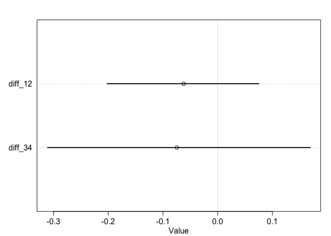
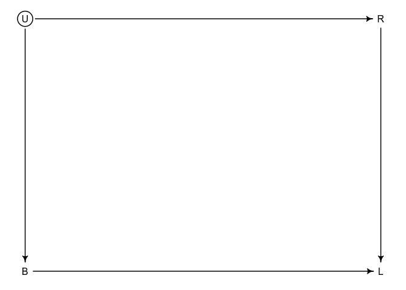

Week 5 Homework
================
Yurun (Ellen) Ying
2022-06-18

## Course homework

### Problem 1

The total causal effect of gender on grant awards in the `NWOGrants`
data.

``` r
data("NWOGrants")
d <- NWOGrants

# a DAG
dag1 <- dagitty("dag{ G -> D -> A; G -> A}")
coordinates(dag1) <- list(x = c(G = 0, D = 0.5, A = 1),
                          y = c(G = 1, D = 0.3, A = 1))
drawdag(dag1)
```

<!-- -->

We will use this model to estimate the total effect of gender on grant
awards:

")

![\mathrm{logit}(p_i) = a\_{GID\[i\]}](https://latex.codecogs.com/png.image?%5Cdpi%7B110%7D&space;%5Cbg_white&space;%5Cmathrm%7Blogit%7D%28p_i%29%20%3D%20a_%7BGID%5Bi%5D%7D "\mathrm{logit}(p_i) = a_{GID[i]}")

![a\_{GID\[i\]} \sim \mathrm{TBD}](https://latex.codecogs.com/png.image?%5Cdpi%7B110%7D&space;%5Cbg_white&space;a_%7BGID%5Bi%5D%7D%20%5Csim%20%5Cmathrm%7BTBD%7D "a_{GID[i]} \sim \mathrm{TBD}")

``` r
# choose priors
# n <- 1e5
# a <- rnorm(n, 0, 1)
# dens(inv_logit(a))

# clean data
dat <- data.frame(
  D = rep(1:9, each = 2),
  G = rep(1:2, 9), # 1 is male, 2 is female
  N = d$applications,
  A = d$awards
)

# fit a model
m1 <- quap(
  alist(
    A ~ dbinom(N, p),
    logit(p) <- a[G],
    a[G] ~ dnorm(0, 1)
  ), data = dat
)

precis(m1, depth = 2)
```

    ##           mean         sd      5.5%     94.5%
    ## a[1] -1.527904 0.06447682 -1.630950 -1.424857
    ## a[2] -1.731096 0.08088702 -1.860369 -1.601823

``` r
# posterior prediction
post <- extract.samples(m1)
diff <- inv_logit(post$a[,1]) - inv_logit(post$a[,2])
dens(diff, lwd = 3, xlab = "M-F posterior contrast")
abline(v=0, lty = 2, col = "tomato")
```

<!-- -->

Across disciplines, women have a slight disadvantage than men in winning
the grant awards.

### Problem 2

Estimate the direct causal effect of gender on grant awards.

``` r
m2 <- ulam(
  alist(
    A ~ dbinom(N, p),
    logit(p) <- a[G,D],
    matrix[G,D]:a ~ dnorm(0, 1)
  ), data = dat, chains = 4, cores = 4
)
```

    ## Running MCMC with 4 parallel chains, with 1 thread(s) per chain...
    ## 
    ## Chain 1 Iteration:   1 / 1000 [  0%]  (Warmup) 
    ## Chain 1 Iteration: 100 / 1000 [ 10%]  (Warmup) 
    ## Chain 1 Iteration: 200 / 1000 [ 20%]  (Warmup) 
    ## Chain 1 Iteration: 300 / 1000 [ 30%]  (Warmup) 
    ## Chain 1 Iteration: 400 / 1000 [ 40%]  (Warmup) 
    ## Chain 1 Iteration: 500 / 1000 [ 50%]  (Warmup) 
    ## Chain 1 Iteration: 501 / 1000 [ 50%]  (Sampling) 
    ## Chain 1 Iteration: 600 / 1000 [ 60%]  (Sampling) 
    ## Chain 1 Iteration: 700 / 1000 [ 70%]  (Sampling) 
    ## Chain 1 Iteration: 800 / 1000 [ 80%]  (Sampling) 
    ## Chain 2 Iteration:   1 / 1000 [  0%]  (Warmup) 
    ## Chain 2 Iteration: 100 / 1000 [ 10%]  (Warmup) 
    ## Chain 2 Iteration: 200 / 1000 [ 20%]  (Warmup) 
    ## Chain 2 Iteration: 300 / 1000 [ 30%]  (Warmup) 
    ## Chain 2 Iteration: 400 / 1000 [ 40%]  (Warmup) 
    ## Chain 2 Iteration: 500 / 1000 [ 50%]  (Warmup) 
    ## Chain 2 Iteration: 501 / 1000 [ 50%]  (Sampling) 
    ## Chain 2 Iteration: 600 / 1000 [ 60%]  (Sampling) 
    ## Chain 2 Iteration: 700 / 1000 [ 70%]  (Sampling) 
    ## Chain 2 Iteration: 800 / 1000 [ 80%]  (Sampling) 
    ## Chain 2 Iteration: 900 / 1000 [ 90%]  (Sampling) 
    ## Chain 2 Iteration: 1000 / 1000 [100%]  (Sampling) 
    ## Chain 3 Iteration:   1 / 1000 [  0%]  (Warmup) 
    ## Chain 3 Iteration: 100 / 1000 [ 10%]  (Warmup) 
    ## Chain 3 Iteration: 200 / 1000 [ 20%]  (Warmup) 
    ## Chain 3 Iteration: 300 / 1000 [ 30%]  (Warmup) 
    ## Chain 3 Iteration: 400 / 1000 [ 40%]  (Warmup) 
    ## Chain 3 Iteration: 500 / 1000 [ 50%]  (Warmup) 
    ## Chain 3 Iteration: 501 / 1000 [ 50%]  (Sampling) 
    ## Chain 3 Iteration: 600 / 1000 [ 60%]  (Sampling) 
    ## Chain 3 Iteration: 700 / 1000 [ 70%]  (Sampling) 
    ## Chain 3 Iteration: 800 / 1000 [ 80%]  (Sampling) 
    ## Chain 3 Iteration: 900 / 1000 [ 90%]  (Sampling) 
    ## Chain 3 Iteration: 1000 / 1000 [100%]  (Sampling) 
    ## Chain 4 Iteration:   1 / 1000 [  0%]  (Warmup) 
    ## Chain 4 Iteration: 100 / 1000 [ 10%]  (Warmup) 
    ## Chain 4 Iteration: 200 / 1000 [ 20%]  (Warmup) 
    ## Chain 4 Iteration: 300 / 1000 [ 30%]  (Warmup) 
    ## Chain 4 Iteration: 400 / 1000 [ 40%]  (Warmup) 
    ## Chain 4 Iteration: 500 / 1000 [ 50%]  (Warmup) 
    ## Chain 4 Iteration: 501 / 1000 [ 50%]  (Sampling) 
    ## Chain 4 Iteration: 600 / 1000 [ 60%]  (Sampling) 
    ## Chain 4 Iteration: 700 / 1000 [ 70%]  (Sampling) 
    ## Chain 4 Iteration: 800 / 1000 [ 80%]  (Sampling) 
    ## Chain 4 Iteration: 900 / 1000 [ 90%]  (Sampling) 
    ## Chain 4 Iteration: 1000 / 1000 [100%]  (Sampling) 
    ## Chain 1 Iteration: 900 / 1000 [ 90%]  (Sampling) 
    ## Chain 1 Iteration: 1000 / 1000 [100%]  (Sampling) 
    ## Chain 1 finished in 0.3 seconds.
    ## Chain 2 finished in 0.3 seconds.
    ## Chain 3 finished in 0.3 seconds.
    ## Chain 4 finished in 0.3 seconds.
    ## 
    ## All 4 chains finished successfully.
    ## Mean chain execution time: 0.3 seconds.
    ## Total execution time: 0.5 seconds.

``` r
precis(m2, depth = 3)
```

    ##              mean        sd      5.5%      94.5%    n_eff     Rhat4
    ## a[1,1] -0.9714061 0.2477226 -1.378246 -0.5754861 2395.353 0.9995603
    ## a[1,2] -1.3874193 0.2121089 -1.736944 -1.0497052 2832.290 1.0001790
    ## a[1,3] -0.9463404 0.2743848 -1.390943 -0.5212504 3961.423 0.9991580
    ## a[1,4] -1.7408824 0.1767509 -2.027876 -1.4603110 2179.465 0.9991770
    ## a[1,5] -1.6223941 0.1899330 -1.919618 -1.3335932 2377.599 0.9991423
    ## a[1,6] -1.9131818 0.2876825 -2.383982 -1.4699652 2456.438 1.0003650
    ## a[1,7] -1.1055838 0.1854212 -1.408288 -0.8163453 2313.625 0.9986888
    ## a[1,8] -1.6867824 0.1322595 -1.897896 -1.4783259 2710.711 0.9990222
    ## a[1,9] -1.4365530 0.1605345 -1.690779 -1.1842318 3113.310 1.0002050
    ## a[2,1] -0.9729970 0.3313355 -1.495572 -0.4563131 2415.399 1.0003088
    ## a[2,2] -1.0989538 0.3535390 -1.665438 -0.5585459 2749.268 0.9987920
    ## a[2,3] -0.8375841 0.6157183 -1.822757  0.1113747 2330.901 0.9999149
    ## a[2,4] -1.3907222 0.1890211 -1.692021 -1.0949775 2640.603 0.9996925
    ## a[2,5] -1.2342792 0.2926467 -1.713970 -0.7743573 2996.873 1.0006165
    ## a[2,6] -1.2087896 0.2531813 -1.619924 -0.8108520 2466.443 0.9997718
    ## a[2,7] -1.7040722 0.2300615 -2.075082 -1.3494809 2034.824 0.9999854
    ## a[2,8] -2.0073885 0.1545895 -2.261025 -1.7683947 2099.229 0.9997580
    ## a[2,9] -2.0170662 0.1888447 -2.323195 -1.7230482 2946.843 0.9991261

Plot for each discipline

``` r
post2 <- extract.samples(m2)
PrA <- post2$a
diff_each_D <- sapply(1:9, function (i) inv_logit(PrA[,1,i]) - inv_logit(PrA[,2,i]))

plot(NULL, xlim = c(-0.5, 0.4), ylim = c(0, 18),
     xlab = "M-F posterior contrast", ylab = "Density")
disc <- as.character(d$discipline)
for (i in 1:9) {
  dens(diff_each_D[,i], col = 1 + i, lwd = 4, add = TRUE)
  xloc <- ifelse(mean(diff_each_D[,i]) < 0, -0.35, 0.35)
  xpos <- ifelse(mean(diff_each_D[,i]) < 0, 4, 2)
  text(xloc + 0.5*mean(diff_each_D[,i]), 18 - 1.3*i, disc[2*i], col = 1+i, pos = xpos, font = 2)
}
abline(v = 0, lty = 2, lwd = 2)
```

<!-- -->

There are two disciplines where men and women have a roughly same
probability of winning awards. In three departments, men are slightly
more likely than women to win. In four departments, women are slightly
more likely to win.

Let’s now calculate the marginal effect of manipulating (the perception
of) applicants’ gender.

``` r
# number of applications in the dataset
total_app <- sum(dat$N)

# number of applications in each discplines
disc_num <- sapply(1:9, function(i) sum(dat$N[dat$D == i]))

# extract samples as if all applicants were men
PrM <- link(m2, 
            data = list(N = rep(1, total_app),
                        D = rep(1:9, times = disc_num),
                        G = rep(1, total_app)))

# extract samples as if all applicants were men
PrF <- link(m2, 
            data = list(N = rep(1, total_app),
                        D = rep(1:9, times = disc_num),
                        G = rep(2, total_app)))

# contrast
diff_marg <- PrM - PrF
mean(diff_marg); PI(diff_marg)
```

    ## [1] 0.01034231

    ##         5%        94% 
    ## -0.1269786  0.1164515

``` r
dens(diff_marg, lwd = 2, 
     xlab = "Marginal effect of gender across disciplines", ylab = "Density")
abline(v = 0, lty = 2)
```

<!-- -->

The average effect of gender across discipline is slim, but there seems
to be heterogeneity of gender difference in different departments.

## Problem 3

There may be more total applicants from those “discriminatory”
disciplines which have more weights in contributing to the total effect.
Therefore, the total effect turns out to show a slightly higher
probability for men to win the grant awards.

### Some nuances

-   The disciplines that influence the overall effect the most are those
    popular disciplines with many applicants
-   Those discipline happen to have low award rates
-   A large proportion of women applicants is from these disciplines
-   In the most popular discipline, more men than women win the award

So both the question of who and where they apply influences the overall
effect. This is the G -\> D causal path in the DAG.

## Problem 4

The over-representation of left-handers among UFC fighters. Estimate the
average advantage, that a left-handed fighter has against right-handed
fighter.

``` r
data("UFClefties")
d <- UFClefties
```

The probability of fight1 winning depends upon the left-handedness of
both F1 and F2. There are four possibilities;

1.  F1 - R, F2 - R (1)
2.  F1 - L, F2 - R (2)
3.  F1 - R, F2 - L (3)
4.  F1 - L, F2 - L (4)

We will use this model:

")

![\mathrm{logit}(p_i) = \alpha\_{condition\[i\]}](https://latex.codecogs.com/png.image?%5Cdpi%7B110%7D&space;%5Cbg_white&space;%5Cmathrm%7Blogit%7D%28p_i%29%20%3D%20%5Calpha_%7Bcondition%5Bi%5D%7D "\mathrm{logit}(p_i) = \alpha_{condition[i]}")

![\alpha\_{fighter\[i\]} \sim \mathrm{Normal}(0,1)](https://latex.codecogs.com/png.image?%5Cdpi%7B110%7D&space;%5Cbg_white&space;%5Calpha_%7Bfighter%5Bi%5D%7D%20%5Csim%20%5Cmathrm%7BNormal%7D%280%2C1%29 "\alpha_{fighter[i]} \sim \mathrm{Normal}(0,1)")

``` r
# clean dat
d$cid <- d$fighter1.lefty + 2*d$fighter2.lefty + 1
dat <- list(
  W = d$fighter1.win,
  cid = as.integer(d$cid)
)

# fit a model
m3 <- ulam(
  alist(
    W ~ dbinom(1, p),
    logit(p) <- a[cid],
    a[cid] ~ dnorm(0, 1)
  ), data = dat, chains = 4, cores = 4
)
```

    ## Running MCMC with 4 parallel chains, with 1 thread(s) per chain...
    ## 
    ## Chain 1 Iteration:   1 / 1000 [  0%]  (Warmup) 
    ## Chain 1 Iteration: 100 / 1000 [ 10%]  (Warmup) 
    ## Chain 1 Iteration: 200 / 1000 [ 20%]  (Warmup) 
    ## Chain 1 Iteration: 300 / 1000 [ 30%]  (Warmup) 
    ## Chain 1 Iteration: 400 / 1000 [ 40%]  (Warmup) 
    ## Chain 2 Iteration:   1 / 1000 [  0%]  (Warmup) 
    ## Chain 2 Iteration: 100 / 1000 [ 10%]  (Warmup) 
    ## Chain 2 Iteration: 200 / 1000 [ 20%]  (Warmup) 
    ## Chain 2 Iteration: 300 / 1000 [ 30%]  (Warmup) 
    ## Chain 2 Iteration: 400 / 1000 [ 40%]  (Warmup) 
    ## Chain 3 Iteration:   1 / 1000 [  0%]  (Warmup) 
    ## Chain 3 Iteration: 100 / 1000 [ 10%]  (Warmup) 
    ## Chain 3 Iteration: 200 / 1000 [ 20%]  (Warmup) 
    ## Chain 3 Iteration: 300 / 1000 [ 30%]  (Warmup) 
    ## Chain 3 Iteration: 400 / 1000 [ 40%]  (Warmup) 
    ## Chain 4 Iteration:   1 / 1000 [  0%]  (Warmup) 
    ## Chain 4 Iteration: 100 / 1000 [ 10%]  (Warmup) 
    ## Chain 4 Iteration: 200 / 1000 [ 20%]  (Warmup) 
    ## Chain 4 Iteration: 300 / 1000 [ 30%]  (Warmup) 
    ## Chain 4 Iteration: 400 / 1000 [ 40%]  (Warmup) 
    ## Chain 1 Iteration: 500 / 1000 [ 50%]  (Warmup) 
    ## Chain 1 Iteration: 501 / 1000 [ 50%]  (Sampling) 
    ## Chain 1 Iteration: 600 / 1000 [ 60%]  (Sampling) 
    ## Chain 1 Iteration: 700 / 1000 [ 70%]  (Sampling) 
    ## Chain 1 Iteration: 800 / 1000 [ 80%]  (Sampling) 
    ## Chain 1 Iteration: 900 / 1000 [ 90%]  (Sampling) 
    ## Chain 2 Iteration: 500 / 1000 [ 50%]  (Warmup) 
    ## Chain 2 Iteration: 501 / 1000 [ 50%]  (Sampling) 
    ## Chain 2 Iteration: 600 / 1000 [ 60%]  (Sampling) 
    ## Chain 2 Iteration: 700 / 1000 [ 70%]  (Sampling) 
    ## Chain 2 Iteration: 800 / 1000 [ 80%]  (Sampling) 
    ## Chain 2 Iteration: 900 / 1000 [ 90%]  (Sampling) 
    ## Chain 3 Iteration: 500 / 1000 [ 50%]  (Warmup) 
    ## Chain 3 Iteration: 501 / 1000 [ 50%]  (Sampling) 
    ## Chain 3 Iteration: 600 / 1000 [ 60%]  (Sampling) 
    ## Chain 3 Iteration: 700 / 1000 [ 70%]  (Sampling) 
    ## Chain 3 Iteration: 800 / 1000 [ 80%]  (Sampling) 
    ## Chain 3 Iteration: 900 / 1000 [ 90%]  (Sampling) 
    ## Chain 3 Iteration: 1000 / 1000 [100%]  (Sampling) 
    ## Chain 4 Iteration: 500 / 1000 [ 50%]  (Warmup) 
    ## Chain 4 Iteration: 501 / 1000 [ 50%]  (Sampling) 
    ## Chain 4 Iteration: 600 / 1000 [ 60%]  (Sampling) 
    ## Chain 4 Iteration: 700 / 1000 [ 70%]  (Sampling) 
    ## Chain 4 Iteration: 800 / 1000 [ 80%]  (Sampling) 
    ## Chain 4 Iteration: 900 / 1000 [ 90%]  (Sampling) 
    ## Chain 3 finished in 0.2 seconds.
    ## Chain 1 Iteration: 1000 / 1000 [100%]  (Sampling) 
    ## Chain 2 Iteration: 1000 / 1000 [100%]  (Sampling) 
    ## Chain 4 Iteration: 1000 / 1000 [100%]  (Sampling) 
    ## Chain 1 finished in 0.3 seconds.
    ## Chain 2 finished in 0.3 seconds.
    ## Chain 4 finished in 0.3 seconds.
    ## 
    ## All 4 chains finished successfully.
    ## Mean chain execution time: 0.3 seconds.
    ## Total execution time: 0.4 seconds.

``` r
precis(m3, 2)
```

    ##             mean        sd        5.5%     94.5%    n_eff     Rhat4
    ## a[1]  0.21516377 0.1706989 -0.05072138 0.4874516 2293.291 0.9998696
    ## a[2] -0.03729384 0.3128057 -0.53312037 0.4391248 2695.976 1.0000049
    ## a[3] -0.07712974 0.3405533 -0.62019974 0.4749612 2657.004 1.0003156
    ## a[4] -0.40325843 0.5292887 -1.26650665 0.4369284 2621.300 0.9995002

We will do some posterior contrast between condition 1 and 2 as well as
between condition 3 and 4.

``` r
post <- extract.samples(m3)
# advantage of L when opponent is R
diff_12 <- inv_logit(post$a[,2]) - inv_logit(post$a[,1])
# advantage of L when opponent is L
diff_34 <- inv_logit(post$a[,4]) - inv_logit(post$a[,3])
plot(precis(data.frame(diff_12, diff_34)))
```

<!-- -->

Left-handers do not seem to have an advantage over right-handers. They
even seem to have a slight disadvantage than right-handers.

Estimate the average advantage

``` r
f2 <- d$fighter2.lefty
# posterior distribution of p as if all fighters are right-handed
f1r_cid <- rep(0, nrow(d)) + 2*f2 + 1
f1r <- link(m3, data = data.frame(cid = f1r_cid))
# posterior distribution of p as if all fighters are left-handed
f1l_cid <- rep(1, nrow(d)) + 2*f2 + 1
f1l <- link(m3, data = data.frame(cid = f1l_cid))

rl_contrast <- f1l - f1r
dens(rl_contrast, xlab = "L-R posterior contrast of winning probability", ylab = "Density")
abline(v = 0, lty = 2)
```

<!-- -->

We can see the counterfactual prediction also shows there is no
difference between left-handers and right-handers in the probability to
win. Left-handers are even slightly disadvantaged.

Left-handers are more represented among fighters probably because they
are more visible in such occupations where one handedness is critical
and attracts more attention?

### A more legit answer

**The first task - modelling the lefty advantage:** The critical point
here is to have a model that applies no matter which fighter is the
fighter one. This means that when we hypothetically switch the players,
the winning probability needs to be reversed in the model to reflect
with switch. Therefore, we formulate the model as following:

![\mathrm{logit}(p_i) = \alpha\_{F1\[i\]} - \alpha\_{F2\[i\]}](https://latex.codecogs.com/png.image?%5Cdpi%7B110%7D&space;%5Cbg_white&space;%5Cmathrm%7Blogit%7D%28p_i%29%20%3D%20%5Calpha_%7BF1%5Bi%5D%7D%20-%20%5Calpha_%7BF2%5Bi%5D%7D "\mathrm{logit}(p_i) = \alpha_{F1[i]} - \alpha_{F2[i]}")

Expand this to include left-handedness:

![\mathrm{logit}(p_i) = (\alpha\_{F1\[i\]} + \beta L\_{F1\[i\]}) - (\alpha\_{F2\[i\]} + \beta L\_{F2\[i\]})](https://latex.codecogs.com/png.image?%5Cdpi%7B110%7D&space;%5Cbg_white&space;%5Cmathrm%7Blogit%7D%28p_i%29%20%3D%20%28%5Calpha_%7BF1%5Bi%5D%7D%20%2B%20%5Cbeta%20L_%7BF1%5Bi%5D%7D%29%20-%20%28%5Calpha_%7BF2%5Bi%5D%7D%20%2B%20%5Cbeta%20L_%7BF2%5Bi%5D%7D%29 "\mathrm{logit}(p_i) = (\alpha_{F1[i]} + \beta L_{F1[i]}) - (\alpha_{F2[i]} + \beta L_{F2[i]})")

where

is the advantage a lefty will have over a righty. When both fighters are
lefties, the second terms in the tw parentheses will cancel out.

Since there is no observation for ability, we fit a model that only
includes left-handedness.

``` r
dat <- list(
  W = d$fighter1.win,
  F1 = d$fighter1.lefty,
  F2 = d$fighter2.lefty
)

m4n <- ulam(
  alist(
    W ~ bernoulli(p),
    logit(p) <- b*(F1 - F2),
    b ~ dnorm(0, 1)
  ), data = dat, chains = 4, cores = 4
)
```

    ## Running MCMC with 4 parallel chains, with 1 thread(s) per chain...
    ## 
    ## Chain 1 Iteration:   1 / 1000 [  0%]  (Warmup) 
    ## Chain 1 Iteration: 100 / 1000 [ 10%]  (Warmup) 
    ## Chain 1 Iteration: 200 / 1000 [ 20%]  (Warmup) 
    ## Chain 1 Iteration: 300 / 1000 [ 30%]  (Warmup) 
    ## Chain 1 Iteration: 400 / 1000 [ 40%]  (Warmup) 
    ## Chain 1 Iteration: 500 / 1000 [ 50%]  (Warmup) 
    ## Chain 1 Iteration: 501 / 1000 [ 50%]  (Sampling) 
    ## Chain 1 Iteration: 600 / 1000 [ 60%]  (Sampling) 
    ## Chain 1 Iteration: 700 / 1000 [ 70%]  (Sampling) 
    ## Chain 1 Iteration: 800 / 1000 [ 80%]  (Sampling) 
    ## Chain 1 Iteration: 900 / 1000 [ 90%]  (Sampling) 
    ## Chain 1 Iteration: 1000 / 1000 [100%]  (Sampling) 
    ## Chain 2 Iteration:   1 / 1000 [  0%]  (Warmup) 
    ## Chain 2 Iteration: 100 / 1000 [ 10%]  (Warmup) 
    ## Chain 2 Iteration: 200 / 1000 [ 20%]  (Warmup) 
    ## Chain 2 Iteration: 300 / 1000 [ 30%]  (Warmup) 
    ## Chain 2 Iteration: 400 / 1000 [ 40%]  (Warmup) 
    ## Chain 2 Iteration: 500 / 1000 [ 50%]  (Warmup) 
    ## Chain 2 Iteration: 501 / 1000 [ 50%]  (Sampling) 
    ## Chain 2 Iteration: 600 / 1000 [ 60%]  (Sampling) 
    ## Chain 2 Iteration: 700 / 1000 [ 70%]  (Sampling) 
    ## Chain 2 Iteration: 800 / 1000 [ 80%]  (Sampling) 
    ## Chain 2 Iteration: 900 / 1000 [ 90%]  (Sampling) 
    ## Chain 2 Iteration: 1000 / 1000 [100%]  (Sampling) 
    ## Chain 3 Iteration:   1 / 1000 [  0%]  (Warmup) 
    ## Chain 3 Iteration: 100 / 1000 [ 10%]  (Warmup) 
    ## Chain 3 Iteration: 200 / 1000 [ 20%]  (Warmup) 
    ## Chain 3 Iteration: 300 / 1000 [ 30%]  (Warmup) 
    ## Chain 3 Iteration: 400 / 1000 [ 40%]  (Warmup) 
    ## Chain 3 Iteration: 500 / 1000 [ 50%]  (Warmup) 
    ## Chain 3 Iteration: 501 / 1000 [ 50%]  (Sampling) 
    ## Chain 3 Iteration: 600 / 1000 [ 60%]  (Sampling) 
    ## Chain 3 Iteration: 700 / 1000 [ 70%]  (Sampling) 
    ## Chain 3 Iteration: 800 / 1000 [ 80%]  (Sampling) 
    ## Chain 3 Iteration: 900 / 1000 [ 90%]  (Sampling) 
    ## Chain 4 Iteration:   1 / 1000 [  0%]  (Warmup) 
    ## Chain 4 Iteration: 100 / 1000 [ 10%]  (Warmup) 
    ## Chain 4 Iteration: 200 / 1000 [ 20%]  (Warmup) 
    ## Chain 4 Iteration: 300 / 1000 [ 30%]  (Warmup) 
    ## Chain 4 Iteration: 400 / 1000 [ 40%]  (Warmup) 
    ## Chain 4 Iteration: 500 / 1000 [ 50%]  (Warmup) 
    ## Chain 4 Iteration: 501 / 1000 [ 50%]  (Sampling) 
    ## Chain 4 Iteration: 600 / 1000 [ 60%]  (Sampling) 
    ## Chain 4 Iteration: 700 / 1000 [ 70%]  (Sampling) 
    ## Chain 4 Iteration: 800 / 1000 [ 80%]  (Sampling) 
    ## Chain 4 Iteration: 900 / 1000 [ 90%]  (Sampling) 
    ## Chain 4 Iteration: 1000 / 1000 [100%]  (Sampling) 
    ## Chain 1 finished in 0.1 seconds.
    ## Chain 2 finished in 0.1 seconds.
    ## Chain 3 Iteration: 1000 / 1000 [100%]  (Sampling) 
    ## Chain 3 finished in 0.1 seconds.
    ## Chain 4 finished in 0.1 seconds.
    ## 
    ## All 4 chains finished successfully.
    ## Mean chain execution time: 0.1 seconds.
    ## Total execution time: 0.2 seconds.

``` r
post <- extract.samples(m4n)
dens(inv_logit(post$b), xlab = "Lefty winning probability when fighting a righty", ylab = "Density")
abline(v = 0.5, lty = 2)
```

<!-- -->

This is the distribution of a lefty’s winning probability when the
opponent is a righty (lefty advantage). The mean is 0.5, so there
doesn’t seem to be evidence for lefty advantage.

**The second task - explaining the results:** The critical thing here is
that we are observing among UFC qualified fighters. This means there is
a potential collider bias in our observation.

``` r
dag2 <- dagitty("dag{ Q <- A -> W; Q <- L -> W}")
coordinates(dag2) <- list(x = c(Q = 0, A = 0.5, W = 1, L = 0.5),
                          y = c(Q = 1, A = 0, W = 1, L = 1))
drawdag(dag2)
```

<!-- -->

Only observing qualified fighters is equal to stratifying by Q, which
can create a nonexistent association between A and L. It is likely that
among the qualified fighters, lefties are on average less able than
righties. In the observed matches, the lefty advantage is canceled out
by the higher average ability of righties.

We will use some simulations to illustrate this idea.

``` r
# simulate 5000 fighters
set.seed(89345)
N <- 5000
L <- rbern(N, 0.1)
A <- rnorm(N)
Q <- rep(1, N)

# qualify if A large enough or lefty
Q <- ifelse(A > 2 | (A > 1.25 & L == 1), 1, 0)

# summarize
table(Q, L)
```

    ##    L
    ## Q      0    1
    ##   0 4344  494
    ##   1   99   63

Check the proportion of lefty among the qualified fighters

``` r
sum(Q == 1 & L == 1)/sum(Q == 1)
```

    ## [1] 0.3888889

Nearly 39% of qualified fighters are lefty, which is way higher than the
baseline 10%.

The mean ability of lefties and righties among the qualified fighter

``` r
# righty
mean(A[Q == 1 & L == 0])
```

    ## [1] 2.435458

``` r
# lefty
mean(A[Q == 1 & L == 1])
```

    ## [1] 1.769145

Lefties’ mean ability is lower than righties’.

Now simulate the fight result

``` r
b <- 0.5 # lefty advantage
k <- 2 # importance of ability difference
# get the ability and left-handedness of qualified fighters
l <- L[Q == 1]
a <- A[Q == 1]
M <- sum(Q==1)/2 # number of matches
f1win <- rep(0, M)
# record the left-handedness of the two fighters
L1 <- rep(0, M); L2 <- rep(0, M)

# simulate the fight
for (i in 1:M) {
  # a1 is from the first half of all fighters, a2 is from the second half
  a1 <- a[i] + b*l[i]
  a2 <- a[i + M] + b*l[i + M]
  p_f1win <- inv_logit(k*(a1 - a2))
  f1win[i] <- rbern(1, prob = p_f1win)
  L1[i] <- l[i]
  L2[i] <- l[i+M]
}
```

Fit a model to the simulated dataset

``` r
datx <- list(W = f1win, F1 = L1, F2 = L2)

m4x <- ulam(
  alist(
    W ~ bernoulli(p),
    logit(p) <- b*(F1 - F2),
    b ~ dnorm(0, 1)
  ), data = datx, chains = 4, cores = 4
)
```

    ## Running MCMC with 4 parallel chains, with 1 thread(s) per chain...
    ## 
    ## Chain 1 Iteration:   1 / 1000 [  0%]  (Warmup) 
    ## Chain 1 Iteration: 100 / 1000 [ 10%]  (Warmup) 
    ## Chain 1 Iteration: 200 / 1000 [ 20%]  (Warmup) 
    ## Chain 1 Iteration: 300 / 1000 [ 30%]  (Warmup) 
    ## Chain 1 Iteration: 400 / 1000 [ 40%]  (Warmup) 
    ## Chain 1 Iteration: 500 / 1000 [ 50%]  (Warmup) 
    ## Chain 1 Iteration: 501 / 1000 [ 50%]  (Sampling) 
    ## Chain 1 Iteration: 600 / 1000 [ 60%]  (Sampling) 
    ## Chain 1 Iteration: 700 / 1000 [ 70%]  (Sampling) 
    ## Chain 1 Iteration: 800 / 1000 [ 80%]  (Sampling) 
    ## Chain 1 Iteration: 900 / 1000 [ 90%]  (Sampling) 
    ## Chain 1 Iteration: 1000 / 1000 [100%]  (Sampling) 
    ## Chain 2 Iteration:   1 / 1000 [  0%]  (Warmup) 
    ## Chain 2 Iteration: 100 / 1000 [ 10%]  (Warmup) 
    ## Chain 2 Iteration: 200 / 1000 [ 20%]  (Warmup) 
    ## Chain 2 Iteration: 300 / 1000 [ 30%]  (Warmup) 
    ## Chain 2 Iteration: 400 / 1000 [ 40%]  (Warmup) 
    ## Chain 2 Iteration: 500 / 1000 [ 50%]  (Warmup) 
    ## Chain 2 Iteration: 501 / 1000 [ 50%]  (Sampling) 
    ## Chain 2 Iteration: 600 / 1000 [ 60%]  (Sampling) 
    ## Chain 2 Iteration: 700 / 1000 [ 70%]  (Sampling) 
    ## Chain 2 Iteration: 800 / 1000 [ 80%]  (Sampling) 
    ## Chain 2 Iteration: 900 / 1000 [ 90%]  (Sampling) 
    ## Chain 2 Iteration: 1000 / 1000 [100%]  (Sampling) 
    ## Chain 3 Iteration:   1 / 1000 [  0%]  (Warmup) 
    ## Chain 3 Iteration: 100 / 1000 [ 10%]  (Warmup) 
    ## Chain 3 Iteration: 200 / 1000 [ 20%]  (Warmup) 
    ## Chain 3 Iteration: 300 / 1000 [ 30%]  (Warmup) 
    ## Chain 3 Iteration: 400 / 1000 [ 40%]  (Warmup) 
    ## Chain 3 Iteration: 500 / 1000 [ 50%]  (Warmup) 
    ## Chain 3 Iteration: 501 / 1000 [ 50%]  (Sampling) 
    ## Chain 3 Iteration: 600 / 1000 [ 60%]  (Sampling) 
    ## Chain 3 Iteration: 700 / 1000 [ 70%]  (Sampling) 
    ## Chain 3 Iteration: 800 / 1000 [ 80%]  (Sampling) 
    ## Chain 3 Iteration: 900 / 1000 [ 90%]  (Sampling) 
    ## Chain 3 Iteration: 1000 / 1000 [100%]  (Sampling) 
    ## Chain 4 Iteration:   1 / 1000 [  0%]  (Warmup) 
    ## Chain 4 Iteration: 100 / 1000 [ 10%]  (Warmup) 
    ## Chain 4 Iteration: 200 / 1000 [ 20%]  (Warmup) 
    ## Chain 4 Iteration: 300 / 1000 [ 30%]  (Warmup) 
    ## Chain 4 Iteration: 400 / 1000 [ 40%]  (Warmup) 
    ## Chain 4 Iteration: 500 / 1000 [ 50%]  (Warmup) 
    ## Chain 4 Iteration: 501 / 1000 [ 50%]  (Sampling) 
    ## Chain 4 Iteration: 600 / 1000 [ 60%]  (Sampling) 
    ## Chain 4 Iteration: 700 / 1000 [ 70%]  (Sampling) 
    ## Chain 4 Iteration: 800 / 1000 [ 80%]  (Sampling) 
    ## Chain 4 Iteration: 900 / 1000 [ 90%]  (Sampling) 
    ## Chain 4 Iteration: 1000 / 1000 [100%]  (Sampling) 
    ## Chain 1 finished in 0.1 seconds.
    ## Chain 2 finished in 0.1 seconds.
    ## Chain 3 finished in 0.1 seconds.
    ## Chain 4 finished in 0.1 seconds.
    ## 
    ## All 4 chains finished successfully.
    ## Mean chain execution time: 0.1 seconds.
    ## Total execution time: 0.2 seconds.

``` r
post <- extract.samples(m4x)
dens(inv_logit(post$b), xlab = "Lefty winning probability when fighting a righty", ylab = "Density")
abline(v = 0.5, lty = 2)
```

<!-- -->

Now a lefty in fact has a lower probability winning a righty. This
probability will increase when lefty advantage is stronger, or/and when
the qualification for lefty is higher.

## Problems from the book

### 11H1

Compare the predictive accuracy of different models of prosocial chimps.

``` r
# model with a unique intercept for each actor
m11.4 <- ulam(
  alist(
    pulled_left ~ dbinom(1, p),
    logit(p) <- a[actor] + b[treatment],
    a[actor] ~ dnorm(0, 10),
    b[treatment] ~ dnorm(0, 0.5)
  ),
  data = dat_list, chains = 4, log_lik = TRUE
)
```

    ## Running MCMC with 4 sequential chains, with 1 thread(s) per chain...
    ## 
    ## Chain 1 Iteration:   1 / 1000 [  0%]  (Warmup) 
    ## Chain 1 Iteration: 100 / 1000 [ 10%]  (Warmup) 
    ## Chain 1 Iteration: 200 / 1000 [ 20%]  (Warmup) 
    ## Chain 1 Iteration: 300 / 1000 [ 30%]  (Warmup) 
    ## Chain 1 Iteration: 400 / 1000 [ 40%]  (Warmup) 
    ## Chain 1 Iteration: 500 / 1000 [ 50%]  (Warmup) 
    ## Chain 1 Iteration: 501 / 1000 [ 50%]  (Sampling) 
    ## Chain 1 Iteration: 600 / 1000 [ 60%]  (Sampling) 
    ## Chain 1 Iteration: 700 / 1000 [ 70%]  (Sampling) 
    ## Chain 1 Iteration: 800 / 1000 [ 80%]  (Sampling) 
    ## Chain 1 Iteration: 900 / 1000 [ 90%]  (Sampling) 
    ## Chain 1 Iteration: 1000 / 1000 [100%]  (Sampling) 
    ## Chain 1 finished in 1.5 seconds.
    ## Chain 2 Iteration:   1 / 1000 [  0%]  (Warmup) 
    ## Chain 2 Iteration: 100 / 1000 [ 10%]  (Warmup) 
    ## Chain 2 Iteration: 200 / 1000 [ 20%]  (Warmup) 
    ## Chain 2 Iteration: 300 / 1000 [ 30%]  (Warmup) 
    ## Chain 2 Iteration: 400 / 1000 [ 40%]  (Warmup) 
    ## Chain 2 Iteration: 500 / 1000 [ 50%]  (Warmup) 
    ## Chain 2 Iteration: 501 / 1000 [ 50%]  (Sampling) 
    ## Chain 2 Iteration: 600 / 1000 [ 60%]  (Sampling) 
    ## Chain 2 Iteration: 700 / 1000 [ 70%]  (Sampling) 
    ## Chain 2 Iteration: 800 / 1000 [ 80%]  (Sampling) 
    ## Chain 2 Iteration: 900 / 1000 [ 90%]  (Sampling) 
    ## Chain 2 Iteration: 1000 / 1000 [100%]  (Sampling) 
    ## Chain 2 finished in 1.6 seconds.
    ## Chain 3 Iteration:   1 / 1000 [  0%]  (Warmup) 
    ## Chain 3 Iteration: 100 / 1000 [ 10%]  (Warmup) 
    ## Chain 3 Iteration: 200 / 1000 [ 20%]  (Warmup) 
    ## Chain 3 Iteration: 300 / 1000 [ 30%]  (Warmup) 
    ## Chain 3 Iteration: 400 / 1000 [ 40%]  (Warmup) 
    ## Chain 3 Iteration: 500 / 1000 [ 50%]  (Warmup) 
    ## Chain 3 Iteration: 501 / 1000 [ 50%]  (Sampling) 
    ## Chain 3 Iteration: 600 / 1000 [ 60%]  (Sampling) 
    ## Chain 3 Iteration: 700 / 1000 [ 70%]  (Sampling) 
    ## Chain 3 Iteration: 800 / 1000 [ 80%]  (Sampling) 
    ## Chain 3 Iteration: 900 / 1000 [ 90%]  (Sampling) 
    ## Chain 3 Iteration: 1000 / 1000 [100%]  (Sampling) 
    ## Chain 3 finished in 1.4 seconds.
    ## Chain 4 Iteration:   1 / 1000 [  0%]  (Warmup) 
    ## Chain 4 Iteration: 100 / 1000 [ 10%]  (Warmup) 
    ## Chain 4 Iteration: 200 / 1000 [ 20%]  (Warmup) 
    ## Chain 4 Iteration: 300 / 1000 [ 30%]  (Warmup) 
    ## Chain 4 Iteration: 400 / 1000 [ 40%]  (Warmup) 
    ## Chain 4 Iteration: 500 / 1000 [ 50%]  (Warmup) 
    ## Chain 4 Iteration: 501 / 1000 [ 50%]  (Sampling) 
    ## Chain 4 Iteration: 600 / 1000 [ 60%]  (Sampling) 
    ## Chain 4 Iteration: 700 / 1000 [ 70%]  (Sampling) 
    ## Chain 4 Iteration: 800 / 1000 [ 80%]  (Sampling) 
    ## Chain 4 Iteration: 900 / 1000 [ 90%]  (Sampling) 
    ## Chain 4 Iteration: 1000 / 1000 [100%]  (Sampling) 
    ## Chain 4 finished in 1.2 seconds.
    ## 
    ## All 4 chains finished successfully.
    ## Mean chain execution time: 1.4 seconds.
    ## Total execution time: 6.0 seconds.

``` r
# simpler model
m11.1 <- ulam(
    alist(
      pulled_left ~ dbinom(1, p),
      logit(p) <- a,
      a ~ dnorm(0, 1.5)
    ),
    data = dat_list, chains = 4, log_lik = TRUE
  )
```

    ## Running MCMC with 4 sequential chains, with 1 thread(s) per chain...
    ## 
    ## Chain 1 Iteration:   1 / 1000 [  0%]  (Warmup) 
    ## Chain 1 Iteration: 100 / 1000 [ 10%]  (Warmup) 
    ## Chain 1 Iteration: 200 / 1000 [ 20%]  (Warmup) 
    ## Chain 1 Iteration: 300 / 1000 [ 30%]  (Warmup) 
    ## Chain 1 Iteration: 400 / 1000 [ 40%]  (Warmup) 
    ## Chain 1 Iteration: 500 / 1000 [ 50%]  (Warmup) 
    ## Chain 1 Iteration: 501 / 1000 [ 50%]  (Sampling) 
    ## Chain 1 Iteration: 600 / 1000 [ 60%]  (Sampling) 
    ## Chain 1 Iteration: 700 / 1000 [ 70%]  (Sampling) 
    ## Chain 1 Iteration: 800 / 1000 [ 80%]  (Sampling) 
    ## Chain 1 Iteration: 900 / 1000 [ 90%]  (Sampling) 
    ## Chain 1 Iteration: 1000 / 1000 [100%]  (Sampling) 
    ## Chain 1 finished in 0.2 seconds.
    ## Chain 2 Iteration:   1 / 1000 [  0%]  (Warmup) 
    ## Chain 2 Iteration: 100 / 1000 [ 10%]  (Warmup) 
    ## Chain 2 Iteration: 200 / 1000 [ 20%]  (Warmup) 
    ## Chain 2 Iteration: 300 / 1000 [ 30%]  (Warmup) 
    ## Chain 2 Iteration: 400 / 1000 [ 40%]  (Warmup) 
    ## Chain 2 Iteration: 500 / 1000 [ 50%]  (Warmup) 
    ## Chain 2 Iteration: 501 / 1000 [ 50%]  (Sampling) 
    ## Chain 2 Iteration: 600 / 1000 [ 60%]  (Sampling) 
    ## Chain 2 Iteration: 700 / 1000 [ 70%]  (Sampling) 
    ## Chain 2 Iteration: 800 / 1000 [ 80%]  (Sampling) 
    ## Chain 2 Iteration: 900 / 1000 [ 90%]  (Sampling) 
    ## Chain 2 Iteration: 1000 / 1000 [100%]  (Sampling) 
    ## Chain 2 finished in 0.3 seconds.
    ## Chain 3 Iteration:   1 / 1000 [  0%]  (Warmup) 
    ## Chain 3 Iteration: 100 / 1000 [ 10%]  (Warmup) 
    ## Chain 3 Iteration: 200 / 1000 [ 20%]  (Warmup) 
    ## Chain 3 Iteration: 300 / 1000 [ 30%]  (Warmup) 
    ## Chain 3 Iteration: 400 / 1000 [ 40%]  (Warmup) 
    ## Chain 3 Iteration: 500 / 1000 [ 50%]  (Warmup) 
    ## Chain 3 Iteration: 501 / 1000 [ 50%]  (Sampling) 
    ## Chain 3 Iteration: 600 / 1000 [ 60%]  (Sampling) 
    ## Chain 3 Iteration: 700 / 1000 [ 70%]  (Sampling) 
    ## Chain 3 Iteration: 800 / 1000 [ 80%]  (Sampling) 
    ## Chain 3 Iteration: 900 / 1000 [ 90%]  (Sampling) 
    ## Chain 3 Iteration: 1000 / 1000 [100%]  (Sampling) 
    ## Chain 3 finished in 0.2 seconds.
    ## Chain 4 Iteration:   1 / 1000 [  0%]  (Warmup) 
    ## Chain 4 Iteration: 100 / 1000 [ 10%]  (Warmup) 
    ## Chain 4 Iteration: 200 / 1000 [ 20%]  (Warmup) 
    ## Chain 4 Iteration: 300 / 1000 [ 30%]  (Warmup) 
    ## Chain 4 Iteration: 400 / 1000 [ 40%]  (Warmup) 
    ## Chain 4 Iteration: 500 / 1000 [ 50%]  (Warmup) 
    ## Chain 4 Iteration: 501 / 1000 [ 50%]  (Sampling) 
    ## Chain 4 Iteration: 600 / 1000 [ 60%]  (Sampling) 
    ## Chain 4 Iteration: 700 / 1000 [ 70%]  (Sampling) 
    ## Chain 4 Iteration: 800 / 1000 [ 80%]  (Sampling) 
    ## Chain 4 Iteration: 900 / 1000 [ 90%]  (Sampling) 
    ## Chain 4 Iteration: 1000 / 1000 [100%]  (Sampling) 
    ## Chain 4 finished in 0.2 seconds.
    ## 
    ## All 4 chains finished successfully.
    ## Mean chain execution time: 0.2 seconds.
    ## Total execution time: 1.3 seconds.

``` r
m11.2 <- ulam(
    alist(
      pulled_left ~ dbinom(1, p),
      logit(p) <- a + b[treatment],
      a ~ dnorm(0, 1.5),
      b[treatment] ~ dnorm(0, 0.5)
    ),
    data = dat_list, chains = 4, log_lik = TRUE
  )
```

    ## Running MCMC with 4 sequential chains, with 1 thread(s) per chain...
    ## 
    ## Chain 1 Iteration:   1 / 1000 [  0%]  (Warmup) 
    ## Chain 1 Iteration: 100 / 1000 [ 10%]  (Warmup) 
    ## Chain 1 Iteration: 200 / 1000 [ 20%]  (Warmup) 
    ## Chain 1 Iteration: 300 / 1000 [ 30%]  (Warmup) 
    ## Chain 1 Iteration: 400 / 1000 [ 40%]  (Warmup) 
    ## Chain 1 Iteration: 500 / 1000 [ 50%]  (Warmup) 
    ## Chain 1 Iteration: 501 / 1000 [ 50%]  (Sampling) 
    ## Chain 1 Iteration: 600 / 1000 [ 60%]  (Sampling) 
    ## Chain 1 Iteration: 700 / 1000 [ 70%]  (Sampling) 
    ## Chain 1 Iteration: 800 / 1000 [ 80%]  (Sampling) 
    ## Chain 1 Iteration: 900 / 1000 [ 90%]  (Sampling) 
    ## Chain 1 Iteration: 1000 / 1000 [100%]  (Sampling) 
    ## Chain 1 finished in 1.3 seconds.
    ## Chain 2 Iteration:   1 / 1000 [  0%]  (Warmup) 
    ## Chain 2 Iteration: 100 / 1000 [ 10%]  (Warmup) 
    ## Chain 2 Iteration: 200 / 1000 [ 20%]  (Warmup) 
    ## Chain 2 Iteration: 300 / 1000 [ 30%]  (Warmup) 
    ## Chain 2 Iteration: 400 / 1000 [ 40%]  (Warmup) 
    ## Chain 2 Iteration: 500 / 1000 [ 50%]  (Warmup) 
    ## Chain 2 Iteration: 501 / 1000 [ 50%]  (Sampling) 
    ## Chain 2 Iteration: 600 / 1000 [ 60%]  (Sampling) 
    ## Chain 2 Iteration: 700 / 1000 [ 70%]  (Sampling) 
    ## Chain 2 Iteration: 800 / 1000 [ 80%]  (Sampling) 
    ## Chain 2 Iteration: 900 / 1000 [ 90%]  (Sampling) 
    ## Chain 2 Iteration: 1000 / 1000 [100%]  (Sampling) 
    ## Chain 2 finished in 1.3 seconds.
    ## Chain 3 Iteration:   1 / 1000 [  0%]  (Warmup) 
    ## Chain 3 Iteration: 100 / 1000 [ 10%]  (Warmup) 
    ## Chain 3 Iteration: 200 / 1000 [ 20%]  (Warmup) 
    ## Chain 3 Iteration: 300 / 1000 [ 30%]  (Warmup) 
    ## Chain 3 Iteration: 400 / 1000 [ 40%]  (Warmup) 
    ## Chain 3 Iteration: 500 / 1000 [ 50%]  (Warmup) 
    ## Chain 3 Iteration: 501 / 1000 [ 50%]  (Sampling) 
    ## Chain 3 Iteration: 600 / 1000 [ 60%]  (Sampling) 
    ## Chain 3 Iteration: 700 / 1000 [ 70%]  (Sampling) 
    ## Chain 3 Iteration: 800 / 1000 [ 80%]  (Sampling) 
    ## Chain 3 Iteration: 900 / 1000 [ 90%]  (Sampling) 
    ## Chain 3 Iteration: 1000 / 1000 [100%]  (Sampling) 
    ## Chain 3 finished in 1.0 seconds.
    ## Chain 4 Iteration:   1 / 1000 [  0%]  (Warmup) 
    ## Chain 4 Iteration: 100 / 1000 [ 10%]  (Warmup) 
    ## Chain 4 Iteration: 200 / 1000 [ 20%]  (Warmup) 
    ## Chain 4 Iteration: 300 / 1000 [ 30%]  (Warmup) 
    ## Chain 4 Iteration: 400 / 1000 [ 40%]  (Warmup) 
    ## Chain 4 Iteration: 500 / 1000 [ 50%]  (Warmup) 
    ## Chain 4 Iteration: 501 / 1000 [ 50%]  (Sampling) 
    ## Chain 4 Iteration: 600 / 1000 [ 60%]  (Sampling) 
    ## Chain 4 Iteration: 700 / 1000 [ 70%]  (Sampling) 
    ## Chain 4 Iteration: 800 / 1000 [ 80%]  (Sampling) 
    ## Chain 4 Iteration: 900 / 1000 [ 90%]  (Sampling) 
    ## Chain 4 Iteration: 1000 / 1000 [100%]  (Sampling) 
    ## Chain 4 finished in 1.1 seconds.
    ## 
    ## All 4 chains finished successfully.
    ## Mean chain execution time: 1.2 seconds.
    ## Total execution time: 5.1 seconds.

``` r
compare(m11.1, m11.2, m11.4, func = PSIS)
```

    ##           PSIS        SE    dPSIS      dSE     pPSIS       weight
    ## m11.4 528.8726 19.710849   0.0000       NA 8.5644279 1.000000e+00
    ## m11.2 682.5010  9.091337 153.6284 19.09541 3.6370187 4.365237e-34
    ## m11.1 687.9148  7.059226 159.0422 19.64085 0.9867091 2.913528e-35

The model including a unique intercept for each actor does better than
both the models with only an intercept or the model with an intercept
and treatment as a predictor. This means that both each actor’s baseline
probability and the treatment are important in predicting the
probability of pulling the lever.

### 11H2

Salmon pirating attempts by Bal Eagles in Washington State data.

``` r
library(MASS);data(eagles)
d <- eagles
d$P <- as.integer(ifelse(d$P == "L", 1, 0))
d$V <- as.integer(ifelse(d$V == "L", 1, 0))
d$A <- as.integer(ifelse(d$A == "A", 1, 0))
```

1)  Fit the following model:

")

 = \alpha + \beta_P P_i + \beta_V V_i + \beta_A A_i")

")

")

where y is the number of successful attempts, n is the total number of
attempts, P is a dummy variable indicating whether or not the pirate had
large body size, V is a dummy variable indicating whether or not the
victim had large body size, and finally A is a dummy variable indicating
whether or not the pirate was an adult.

``` r
# a quap model
m11h2_quap <- quap(
  alist(
    y ~ dbinom(n, p),
    logit(p) <- a + bP*P + bV*V + bA*A,
    a ~ dnorm(0, 1.5),
    c(bP,bV,bA) ~ dnorm(0, 0.5)
  ), data = d
)

precis(m11h2_quap)
```

    ##          mean        sd       5.5%      94.5%
    ## a   0.2936593 0.3681375 -0.2946956  0.8820142
    ## bP  1.6210700 0.3063643  1.1314407  2.1106993
    ## bV -1.6730927 0.3191359 -2.1831335 -1.1630519
    ## bA  0.6517450 0.3054237  0.1636190  1.1398711

``` r
# a ulam model
m11h2_ulam <- ulam(
  alist(
    y ~ dbinom(n, p),
    logit(p) <- a + bP*P + bV*V + bA*A,
    a ~ dnorm(0, 1.5),
    c(bP,bV,bA) ~ dnorm(0, 0.5)
  ), data = d, chains = 4, cores = 4, log_lik = TRUE
)
```

    ## Running MCMC with 4 parallel chains, with 1 thread(s) per chain...
    ## 
    ## Chain 1 Iteration:   1 / 1000 [  0%]  (Warmup) 
    ## Chain 1 Iteration: 100 / 1000 [ 10%]  (Warmup) 
    ## Chain 1 Iteration: 200 / 1000 [ 20%]  (Warmup) 
    ## Chain 1 Iteration: 300 / 1000 [ 30%]  (Warmup) 
    ## Chain 1 Iteration: 400 / 1000 [ 40%]  (Warmup) 
    ## Chain 1 Iteration: 500 / 1000 [ 50%]  (Warmup) 
    ## Chain 1 Iteration: 501 / 1000 [ 50%]  (Sampling) 
    ## Chain 1 Iteration: 600 / 1000 [ 60%]  (Sampling) 
    ## Chain 1 Iteration: 700 / 1000 [ 70%]  (Sampling) 
    ## Chain 1 Iteration: 800 / 1000 [ 80%]  (Sampling) 
    ## Chain 1 Iteration: 900 / 1000 [ 90%]  (Sampling) 
    ## Chain 1 Iteration: 1000 / 1000 [100%]  (Sampling) 
    ## Chain 2 Iteration:   1 / 1000 [  0%]  (Warmup) 
    ## Chain 2 Iteration: 100 / 1000 [ 10%]  (Warmup) 
    ## Chain 2 Iteration: 200 / 1000 [ 20%]  (Warmup) 
    ## Chain 2 Iteration: 300 / 1000 [ 30%]  (Warmup) 
    ## Chain 2 Iteration: 400 / 1000 [ 40%]  (Warmup) 
    ## Chain 2 Iteration: 500 / 1000 [ 50%]  (Warmup) 
    ## Chain 2 Iteration: 501 / 1000 [ 50%]  (Sampling) 
    ## Chain 2 Iteration: 600 / 1000 [ 60%]  (Sampling) 
    ## Chain 2 Iteration: 700 / 1000 [ 70%]  (Sampling) 
    ## Chain 2 Iteration: 800 / 1000 [ 80%]  (Sampling) 
    ## Chain 2 Iteration: 900 / 1000 [ 90%]  (Sampling) 
    ## Chain 2 Iteration: 1000 / 1000 [100%]  (Sampling) 
    ## Chain 3 Iteration:   1 / 1000 [  0%]  (Warmup) 
    ## Chain 3 Iteration: 100 / 1000 [ 10%]  (Warmup) 
    ## Chain 3 Iteration: 200 / 1000 [ 20%]  (Warmup) 
    ## Chain 3 Iteration: 300 / 1000 [ 30%]  (Warmup) 
    ## Chain 3 Iteration: 400 / 1000 [ 40%]  (Warmup) 
    ## Chain 3 Iteration: 500 / 1000 [ 50%]  (Warmup) 
    ## Chain 3 Iteration: 501 / 1000 [ 50%]  (Sampling) 
    ## Chain 3 Iteration: 600 / 1000 [ 60%]  (Sampling) 
    ## Chain 3 Iteration: 700 / 1000 [ 70%]  (Sampling) 
    ## Chain 3 Iteration: 800 / 1000 [ 80%]  (Sampling) 
    ## Chain 3 Iteration: 900 / 1000 [ 90%]  (Sampling) 
    ## Chain 3 Iteration: 1000 / 1000 [100%]  (Sampling) 
    ## Chain 4 Iteration:   1 / 1000 [  0%]  (Warmup) 
    ## Chain 4 Iteration: 100 / 1000 [ 10%]  (Warmup) 
    ## Chain 4 Iteration: 200 / 1000 [ 20%]  (Warmup) 
    ## Chain 4 Iteration: 300 / 1000 [ 30%]  (Warmup) 
    ## Chain 4 Iteration: 400 / 1000 [ 40%]  (Warmup) 
    ## Chain 4 Iteration: 500 / 1000 [ 50%]  (Warmup) 
    ## Chain 4 Iteration: 501 / 1000 [ 50%]  (Sampling) 
    ## Chain 4 Iteration: 600 / 1000 [ 60%]  (Sampling) 
    ## Chain 4 Iteration: 700 / 1000 [ 70%]  (Sampling) 
    ## Chain 4 Iteration: 800 / 1000 [ 80%]  (Sampling) 
    ## Chain 4 Iteration: 900 / 1000 [ 90%]  (Sampling) 
    ## Chain 4 Iteration: 1000 / 1000 [100%]  (Sampling) 
    ## Chain 1 finished in 0.1 seconds.
    ## Chain 2 finished in 0.1 seconds.
    ## Chain 3 finished in 0.1 seconds.
    ## Chain 4 finished in 0.1 seconds.
    ## 
    ## All 4 chains finished successfully.
    ## Mean chain execution time: 0.1 seconds.
    ## Total execution time: 0.2 seconds.

``` r
precis(m11h2_ulam)
```

    ##          mean        sd       5.5%      94.5%    n_eff     Rhat4
    ## a   0.2898691 0.3568237 -0.2569445  0.8683336 1151.876 1.0007680
    ## bA  0.6746947 0.3039251  0.1940260  1.1620273 1227.726 0.9995139
    ## bV -1.6878351 0.3155107 -2.2192839 -1.2058517 1245.994 0.9995023
    ## bP  1.6474896 0.3141754  1.1478739  2.1592284 1350.989 1.0009672

Both models seem to give good estimations.

2)  Plot the posterior predictions. Compute and display both (1) the
    predicted **probability** of success and its 89% interval for each
    row (i) in the data, as well as (2) the predicted success **count**
    and its 89% interval. What different information does each type of
    posterior prediction provide?

Posterior prediction of success probability

``` r
set.seed(2798)
post_p <- link(m11h2_ulam, 
               data = data.frame(n = d$n,
                                 P = d$P,
                                 A = d$A,
                                 V = d$V))

par(mfrow = c(1, 2))
# pirate adult
post_p_A1 <- post_p[, which(d$A == 1)] 
mean_p_A1 <- apply(post_p_A1, 2, mean)
PI_p_A1 <- apply(post_p_A1, 2, PI)
plot(NULL,
     xlab = "Conditions", ylab = "Predicted expectation of probability",
     xlim = c(1,4), ylim = c(0,1), xaxt = 'n')
for (i in 1:4) lines(c(i,i), PI_p_A1[,i], lwd = 2)
points(1:4, mean_p_A1, pch = 16, cex = 1.5, col = "white")
points(1:4, mean_p_A1, pch = 16, cex = 1, col = "black")
axis(side = 1, at = 1:4, 
     labels = c("PL/VL", "PL/VS", "PS/VL", "PS/VS"))
mtext("Pirate is an adult")

# pirate immature
post_p_A0 <- post_p[, which(d$A == 0)] 
mean_p_A0 <- apply(post_p_A0, 2, mean)
PI_p_A0 <- apply(post_p_A0, 2, PI)
plot(NULL,
     xlab = "Conditions", ylab = "Predicted expectation of probability",
     xlim = c(1,4), ylim = c(0,1), xaxt = 'n')
for (i in 1:4) lines(c(i,i), PI_p_A0[,i], lwd = 2)
points(1:4, mean_p_A0, pch = 16, cex = 1.5, col = "white")
points(1:4, mean_p_A0, pch = 16, cex = 1, col = "black")
axis(side = 1, at = 1:4, 
     labels = c("PL/VL", "PL/VS", "PS/VL", "PS/VS"))
mtext("Pirate is immature")
```

<!-- -->

Posterior prediction of success count

``` r
set.seed(2798)
post_c <- sim(m11h2_ulam, 
               data = data.frame(n = rep(30, nrow(d)),
                                 P = d$P,
                                 A = d$A,
                                 V = d$V))

par(mfrow = c(1, 2))
# pirate adult
post_c_A1 <- post_c[, which(d$A == 1)] 
mean_c_A1 <- apply(post_c_A1, 2, mean)
PI_c_A1 <- apply(post_c_A1, 2, PI)
plot(NULL,
     xlab = "Conditions", ylab = "Predicted expectation of count (max=30)",
     xlim = c(1,4), ylim = c(0,30), xaxt = 'n')
for (i in 1:4) lines(c(i,i), PI_c_A1[,i], lwd = 2)
points(1:4, mean_c_A1, pch = 16, cex = 1.5, col = "white")
points(1:4, mean_c_A1, pch = 16, cex = 1, col = "black")
axis(side = 1, at = 1:4, 
     labels = c("PL/VL", "PL/VS", "PS/VL", "PS/VS"))
mtext("Pirate is an adult")

# pirate immature
post_c_A0 <- post_c[, which(d$A == 0)] 
mean_c_A0 <- apply(post_c_A0, 2, mean)
PI_c_A0 <- apply(post_c_A0, 2, PI)
plot(NULL,
     xlab = "Conditions", ylab = "Predicted expectation of count (max=30)",
     xlim = c(1,4), ylim = c(0,30), xaxt = 'n')
for (i in 1:4) lines(c(i,i), PI_c_A0[,i], lwd = 2)
points(1:4, mean_c_A0, pch = 16, cex = 1.5, col = "white")
points(1:4, mean_c_A0, pch = 16, cex = 1, col = "black")
axis(side = 1, at = 1:4, 
     labels = c("PL/VL", "PL/VS", "PS/VL", "PS/VS"))
mtext("Pirate is immature")
```

<!-- -->

The prediction of probability contains uncertainty from the intercepts
and the coefficients in the model. The prediction of count also contains
the uncertainty in generating the count data from the probability via a
biomial distribution. The count predication contains more uncertainty.

3)  Now try to improve the model. Consider an interaction between the
    pirate’s size and age (immature or adult). Compare this model to the
    previous one, using WAIC. Interpret.

``` r
m11h2_ulam_n <- ulam(
  alist(
    y ~ binomial(n, p),
   logit(p) <- a + bP*P + bV*V + bA*A + bPA*P*A,
    a ~ dnorm(0, 1.5),
    c(bP,bV,bA,bPA) ~ dnorm(0, 0.5)
  ), data = d, chains = 4, cores = 4, log_lik = TRUE
)
```

    ## Running MCMC with 4 parallel chains, with 1 thread(s) per chain...
    ## 
    ## Chain 1 Iteration:   1 / 1000 [  0%]  (Warmup) 
    ## Chain 1 Iteration: 100 / 1000 [ 10%]  (Warmup) 
    ## Chain 1 Iteration: 200 / 1000 [ 20%]  (Warmup) 
    ## Chain 1 Iteration: 300 / 1000 [ 30%]  (Warmup) 
    ## Chain 1 Iteration: 400 / 1000 [ 40%]  (Warmup) 
    ## Chain 1 Iteration: 500 / 1000 [ 50%]  (Warmup) 
    ## Chain 1 Iteration: 501 / 1000 [ 50%]  (Sampling) 
    ## Chain 1 Iteration: 600 / 1000 [ 60%]  (Sampling) 
    ## Chain 1 Iteration: 700 / 1000 [ 70%]  (Sampling) 
    ## Chain 1 Iteration: 800 / 1000 [ 80%]  (Sampling) 
    ## Chain 1 Iteration: 900 / 1000 [ 90%]  (Sampling) 
    ## Chain 2 Iteration:   1 / 1000 [  0%]  (Warmup) 
    ## Chain 2 Iteration: 100 / 1000 [ 10%]  (Warmup) 
    ## Chain 2 Iteration: 200 / 1000 [ 20%]  (Warmup) 
    ## Chain 2 Iteration: 300 / 1000 [ 30%]  (Warmup) 
    ## Chain 2 Iteration: 400 / 1000 [ 40%]  (Warmup) 
    ## Chain 2 Iteration: 500 / 1000 [ 50%]  (Warmup) 
    ## Chain 2 Iteration: 501 / 1000 [ 50%]  (Sampling) 
    ## Chain 2 Iteration: 600 / 1000 [ 60%]  (Sampling) 
    ## Chain 2 Iteration: 700 / 1000 [ 70%]  (Sampling) 
    ## Chain 2 Iteration: 800 / 1000 [ 80%]  (Sampling) 
    ## Chain 3 Iteration:   1 / 1000 [  0%]  (Warmup) 
    ## Chain 3 Iteration: 100 / 1000 [ 10%]  (Warmup) 
    ## Chain 3 Iteration: 200 / 1000 [ 20%]  (Warmup) 
    ## Chain 3 Iteration: 300 / 1000 [ 30%]  (Warmup) 
    ## Chain 3 Iteration: 400 / 1000 [ 40%]  (Warmup) 
    ## Chain 3 Iteration: 500 / 1000 [ 50%]  (Warmup) 
    ## Chain 3 Iteration: 501 / 1000 [ 50%]  (Sampling) 
    ## Chain 3 Iteration: 600 / 1000 [ 60%]  (Sampling) 
    ## Chain 3 Iteration: 700 / 1000 [ 70%]  (Sampling) 
    ## Chain 3 Iteration: 800 / 1000 [ 80%]  (Sampling) 
    ## Chain 3 Iteration: 900 / 1000 [ 90%]  (Sampling) 
    ## Chain 3 Iteration: 1000 / 1000 [100%]  (Sampling) 
    ## Chain 4 Iteration:   1 / 1000 [  0%]  (Warmup) 
    ## Chain 4 Iteration: 100 / 1000 [ 10%]  (Warmup) 
    ## Chain 4 Iteration: 200 / 1000 [ 20%]  (Warmup) 
    ## Chain 4 Iteration: 300 / 1000 [ 30%]  (Warmup) 
    ## Chain 4 Iteration: 400 / 1000 [ 40%]  (Warmup) 
    ## Chain 4 Iteration: 500 / 1000 [ 50%]  (Warmup) 
    ## Chain 4 Iteration: 501 / 1000 [ 50%]  (Sampling) 
    ## Chain 4 Iteration: 600 / 1000 [ 60%]  (Sampling) 
    ## Chain 4 Iteration: 700 / 1000 [ 70%]  (Sampling) 
    ## Chain 4 Iteration: 800 / 1000 [ 80%]  (Sampling) 
    ## Chain 4 Iteration: 900 / 1000 [ 90%]  (Sampling) 
    ## Chain 1 Iteration: 1000 / 1000 [100%]  (Sampling) 
    ## Chain 1 finished in 0.2 seconds.
    ## Chain 2 Iteration: 900 / 1000 [ 90%]  (Sampling) 
    ## Chain 2 Iteration: 1000 / 1000 [100%]  (Sampling) 
    ## Chain 2 finished in 0.2 seconds.
    ## Chain 3 finished in 0.1 seconds.
    ## Chain 4 Iteration: 1000 / 1000 [100%]  (Sampling) 
    ## Chain 4 finished in 0.1 seconds.
    ## 
    ## All 4 chains finished successfully.
    ## Mean chain execution time: 0.2 seconds.
    ## Total execution time: 0.2 seconds.

``` r
compare(m11h2_ulam, m11h2_ulam_n, func = WAIC)
```

    ##                  WAIC       SE    dWAIC      dSE    pWAIC    weight
    ## m11h2_ulam   58.18325 11.00653 0.000000       NA 7.903507 0.7638059
    ## m11h2_ulam_n 60.53057 11.94783 2.347319 1.745355 8.945214 0.2361941

The new model containing an interaction term works worse than the
original model.

## 11H6

Modeling the association between social learning and brain size.

``` r
data("Primates301")
d <- Primates301
# a clean data
dat <- data.frame(
  L = d$social_learning,
  log_b = log(d$brain)
)
# complete cases
dat <- dat[complete.cases(dat$L, dat$log_b),]
dat$B <- dat$log_b/max(dat$log_b) # standardize brain size
```

1)  Model the number of observations of `social_learning` for each
    species as a function of the log `brain size`. Use a Poisson
    distribution for the `social_learning` outcome variable. Interpret
    the resulting posterior.

The model we will be using

")

 = \alpha + \beta B_i")

``` r
# choose priors
N <- 100
a <- rnorm(N, 0, 1)
b <- rnorm(N, 0, 1)
plot(NULL, xlim = c(0, 1), ylim = c(0, 10), 
     xlab = "Log brain size (std)", ylab = "Social learning")
for (i in 1:N) curve(exp(a[i]+b[i]*x), from = 0, to = 1, 
                     col = col.alpha("black", 0.3), add = TRUE)
```

<!-- -->

``` r
# fit a model
m11h6a <- ulam(
  alist(
    L ~ dpois(lambda),
    log(lambda) <- a + b*B,
    a ~ dnorm(0, 1),
    b ~ dnorm(0, 1)
  ), data = dat, chains = 4, cores = 4
)
```

    ## Running MCMC with 4 parallel chains, with 1 thread(s) per chain...
    ## 
    ## Chain 1 Iteration:   1 / 1000 [  0%]  (Warmup) 
    ## Chain 1 Iteration: 100 / 1000 [ 10%]  (Warmup) 
    ## Chain 1 Iteration: 200 / 1000 [ 20%]  (Warmup) 
    ## Chain 2 Iteration:   1 / 1000 [  0%]  (Warmup) 
    ## Chain 2 Iteration: 100 / 1000 [ 10%]  (Warmup) 
    ## Chain 2 Iteration: 200 / 1000 [ 20%]  (Warmup) 
    ## Chain 3 Iteration:   1 / 1000 [  0%]  (Warmup) 
    ## Chain 3 Iteration: 100 / 1000 [ 10%]  (Warmup) 
    ## Chain 3 Iteration: 200 / 1000 [ 20%]  (Warmup) 
    ## Chain 4 Iteration:   1 / 1000 [  0%]  (Warmup) 
    ## Chain 4 Iteration: 100 / 1000 [ 10%]  (Warmup) 
    ## Chain 4 Iteration: 200 / 1000 [ 20%]  (Warmup) 
    ## Chain 1 Iteration: 300 / 1000 [ 30%]  (Warmup) 
    ## Chain 1 Iteration: 400 / 1000 [ 40%]  (Warmup) 
    ## Chain 1 Iteration: 500 / 1000 [ 50%]  (Warmup) 
    ## Chain 1 Iteration: 501 / 1000 [ 50%]  (Sampling) 
    ## Chain 2 Iteration: 300 / 1000 [ 30%]  (Warmup) 
    ## Chain 2 Iteration: 400 / 1000 [ 40%]  (Warmup) 
    ## Chain 2 Iteration: 500 / 1000 [ 50%]  (Warmup) 
    ## Chain 2 Iteration: 501 / 1000 [ 50%]  (Sampling) 
    ## Chain 3 Iteration: 300 / 1000 [ 30%]  (Warmup) 
    ## Chain 3 Iteration: 400 / 1000 [ 40%]  (Warmup) 
    ## Chain 4 Iteration: 300 / 1000 [ 30%]  (Warmup) 
    ## Chain 4 Iteration: 400 / 1000 [ 40%]  (Warmup) 
    ## Chain 1 Iteration: 600 / 1000 [ 60%]  (Sampling) 
    ## Chain 1 Iteration: 700 / 1000 [ 70%]  (Sampling) 
    ## Chain 1 Iteration: 800 / 1000 [ 80%]  (Sampling) 
    ## Chain 2 Iteration: 600 / 1000 [ 60%]  (Sampling) 
    ## Chain 2 Iteration: 700 / 1000 [ 70%]  (Sampling) 
    ## Chain 3 Iteration: 500 / 1000 [ 50%]  (Warmup) 
    ## Chain 3 Iteration: 501 / 1000 [ 50%]  (Sampling) 
    ## Chain 3 Iteration: 600 / 1000 [ 60%]  (Sampling) 
    ## Chain 3 Iteration: 700 / 1000 [ 70%]  (Sampling) 
    ## Chain 4 Iteration: 500 / 1000 [ 50%]  (Warmup) 
    ## Chain 4 Iteration: 501 / 1000 [ 50%]  (Sampling) 
    ## Chain 4 Iteration: 600 / 1000 [ 60%]  (Sampling) 
    ## Chain 1 Iteration: 900 / 1000 [ 90%]  (Sampling) 
    ## Chain 1 Iteration: 1000 / 1000 [100%]  (Sampling) 
    ## Chain 2 Iteration: 800 / 1000 [ 80%]  (Sampling) 
    ## Chain 2 Iteration: 900 / 1000 [ 90%]  (Sampling) 
    ## Chain 3 Iteration: 800 / 1000 [ 80%]  (Sampling) 
    ## Chain 3 Iteration: 900 / 1000 [ 90%]  (Sampling) 
    ## Chain 4 Iteration: 700 / 1000 [ 70%]  (Sampling) 
    ## Chain 4 Iteration: 800 / 1000 [ 80%]  (Sampling) 
    ## Chain 4 Iteration: 900 / 1000 [ 90%]  (Sampling) 
    ## Chain 1 finished in 0.5 seconds.
    ## Chain 2 Iteration: 1000 / 1000 [100%]  (Sampling) 
    ## Chain 3 Iteration: 1000 / 1000 [100%]  (Sampling) 
    ## Chain 4 Iteration: 1000 / 1000 [100%]  (Sampling) 
    ## Chain 2 finished in 0.5 seconds.
    ## Chain 3 finished in 0.5 seconds.
    ## Chain 4 finished in 0.5 seconds.
    ## 
    ## All 4 chains finished successfully.
    ## Mean chain execution time: 0.5 seconds.
    ## Total execution time: 0.6 seconds.

``` r
precis(m11h6a)
```

    ##        mean        sd      5.5%     94.5%    n_eff    Rhat4
    ## a -7.506315 0.2852832 -7.960854 -7.066373 365.0468 1.008097
    ## b 11.833023 0.3386822 11.301562 12.371816 364.8754 1.008378

``` r
# posterior prediction
B_seq <- seq(0, 1, length.out = 50)
post_l <- link(m11h6a, data = data.frame(B = B_seq))
l_mu <- apply(post_l, 2, mean)
l_PI <- apply(post_l, 2, PI)
plot(NULL, xlim = c(0, 1), ylim = c(0, 220),
     xlab = "Log brain size (std)", ylab = "Social learning")
points(dat$B, dat$L, col = "turquoise")
lines(B_seq, l_mu)
shade(l_PI, B_seq)
```

<!-- -->

``` r
# on a natural scale
B_natural <- exp(B_seq*max(dat$log_b))
plot(exp(dat$log_b), dat$L, col = "turquoise", 
     xlim =range(B_natural), ylim = c(0, 220),
     xlab = "Brain size", ylab = "Social learning")
lines(B_natural, l_mu)
shade(l_PI, B_natural)
```

<!-- --> This model
indicates that social learning grows exponentially with brain size.

2)  Some species are studied much more than others. So the number of
    reported instances of `social_learning` could be a product of
    research effort. Use the `research_effort` variable, specifically
    its logarithm, as an additional predictor variable. Interpret the
    coefficient for log `research_effort`. How does this model differ
    from the previous one?

``` r
# add variables
dat2 <- data.frame(
  L = d$social_learning,
  log_b = log(d$brain),
  log_r = log(d$research_effort)
)
dat2 <- dat2[complete.cases(dat2$L, dat2$log_b, dat2$log_r),]
dat2$B <- dat2$log_b/max(dat2$log_b) # standardize brain size
dat2$R <- dat2$log_r/max(dat2$log_r)
```

``` r
# fit a model
m11h6b <- ulam(
  alist(
    L ~ dpois(lambda),
    log(lambda) <- a + bB*B + bR*R,
    a ~ dnorm(0, 1),
    c(bB,bR) ~ dnorm(0, 1)
  ), data = dat2, chains = 4, cores = 4
)
```

    ## Running MCMC with 4 parallel chains, with 1 thread(s) per chain...
    ## 
    ## Chain 1 Iteration:   1 / 1000 [  0%]  (Warmup) 
    ## Chain 1 Iteration: 100 / 1000 [ 10%]  (Warmup) 
    ## Chain 2 Iteration:   1 / 1000 [  0%]  (Warmup) 
    ## Chain 2 Iteration: 100 / 1000 [ 10%]  (Warmup) 
    ## Chain 3 Iteration:   1 / 1000 [  0%]  (Warmup) 
    ## Chain 3 Iteration: 100 / 1000 [ 10%]  (Warmup) 
    ## Chain 4 Iteration:   1 / 1000 [  0%]  (Warmup) 
    ## Chain 4 Iteration: 100 / 1000 [ 10%]  (Warmup) 
    ## Chain 2 Iteration: 200 / 1000 [ 20%]  (Warmup) 
    ## Chain 1 Iteration: 200 / 1000 [ 20%]  (Warmup) 
    ## Chain 2 Iteration: 300 / 1000 [ 30%]  (Warmup) 
    ## Chain 3 Iteration: 200 / 1000 [ 20%]  (Warmup) 
    ## Chain 4 Iteration: 200 / 1000 [ 20%]  (Warmup) 
    ## Chain 1 Iteration: 300 / 1000 [ 30%]  (Warmup) 
    ## Chain 3 Iteration: 300 / 1000 [ 30%]  (Warmup) 
    ## Chain 2 Iteration: 400 / 1000 [ 40%]  (Warmup) 
    ## Chain 3 Iteration: 400 / 1000 [ 40%]  (Warmup) 
    ## Chain 4 Iteration: 300 / 1000 [ 30%]  (Warmup) 
    ## Chain 1 Iteration: 400 / 1000 [ 40%]  (Warmup) 
    ## Chain 2 Iteration: 500 / 1000 [ 50%]  (Warmup) 
    ## Chain 2 Iteration: 501 / 1000 [ 50%]  (Sampling) 
    ## Chain 3 Iteration: 500 / 1000 [ 50%]  (Warmup) 
    ## Chain 3 Iteration: 501 / 1000 [ 50%]  (Sampling) 
    ## Chain 4 Iteration: 400 / 1000 [ 40%]  (Warmup) 
    ## Chain 1 Iteration: 500 / 1000 [ 50%]  (Warmup) 
    ## Chain 1 Iteration: 501 / 1000 [ 50%]  (Sampling) 
    ## Chain 2 Iteration: 600 / 1000 [ 60%]  (Sampling) 
    ## Chain 4 Iteration: 500 / 1000 [ 50%]  (Warmup) 
    ## Chain 4 Iteration: 501 / 1000 [ 50%]  (Sampling) 
    ## Chain 1 Iteration: 600 / 1000 [ 60%]  (Sampling) 
    ## Chain 2 Iteration: 700 / 1000 [ 70%]  (Sampling) 
    ## Chain 3 Iteration: 600 / 1000 [ 60%]  (Sampling) 
    ## Chain 4 Iteration: 600 / 1000 [ 60%]  (Sampling) 
    ## Chain 1 Iteration: 700 / 1000 [ 70%]  (Sampling) 
    ## Chain 2 Iteration: 800 / 1000 [ 80%]  (Sampling) 
    ## Chain 3 Iteration: 700 / 1000 [ 70%]  (Sampling) 
    ## Chain 4 Iteration: 700 / 1000 [ 70%]  (Sampling) 
    ## Chain 3 Iteration: 800 / 1000 [ 80%]  (Sampling) 
    ## Chain 4 Iteration: 800 / 1000 [ 80%]  (Sampling) 
    ## Chain 1 Iteration: 800 / 1000 [ 80%]  (Sampling) 
    ## Chain 2 Iteration: 900 / 1000 [ 90%]  (Sampling) 
    ## Chain 3 Iteration: 900 / 1000 [ 90%]  (Sampling) 
    ## Chain 1 Iteration: 900 / 1000 [ 90%]  (Sampling) 
    ## Chain 2 Iteration: 1000 / 1000 [100%]  (Sampling) 
    ## Chain 3 Iteration: 1000 / 1000 [100%]  (Sampling) 
    ## Chain 4 Iteration: 900 / 1000 [ 90%]  (Sampling) 
    ## Chain 2 finished in 1.3 seconds.
    ## Chain 3 finished in 1.3 seconds.
    ## Chain 1 Iteration: 1000 / 1000 [100%]  (Sampling) 
    ## Chain 4 Iteration: 1000 / 1000 [100%]  (Sampling) 
    ## Chain 1 finished in 1.4 seconds.
    ## Chain 4 finished in 1.3 seconds.
    ## 
    ## All 4 chains finished successfully.
    ## Mean chain execution time: 1.3 seconds.
    ## Total execution time: 1.5 seconds.

``` r
precis(m11h6b)
```

    ##         mean        sd      5.5%     94.5%    n_eff    Rhat4
    ## a  -6.653321 0.2513529 -7.073565 -6.254018 786.3307 1.001587
    ## bR  9.259078 0.3667415  8.699040  9.852442 761.1335 1.005383
    ## bB  2.442258 0.3582032  1.877649  3.022365 668.9295 1.005802

``` r
exp(coef(m11h6b))
```

    ##            a           bR           bB 
    ## 1.289732e-03 1.049944e+04 1.149897e+01

One unit increase in log brain size would result in an increase of 11
social learning counts. This is a more conservative estimate of the
effect of brain size on social learning than the model only containing
brain size as a predictor.

3)  Draw a DAG to represent how you think the variables
    `social_learning`, `brain`, and `research_effort` interact. Justify
    the DAG with the measured associations in the two models above (and
    any other models you used).

``` r
dag3 <- dagitty("dag{ 
                U[unobserved]
                B <- U -> R; R -> L; B -> L}")
coordinates(dag3) <- list(x = c(U = 0, B = 0, R = 1, L = 1),
                          y = c(U = 0, B = 1, R = 0, L = 1))
drawdag(dag3)
```

<!-- -->

Stratifying by research effort reduces the causal effect of log brain
size indicates that there might be a fork structure in the causal model.
It is impossible for research effort to cause bigger brain, so there
might be other variables causing both brain size and research effort.
This might be the closeness to human being. The closeness can make
species have similar big brain to homo sapiens, and it can also cause
more curiosity to study them, resulting in more research effort in
studying these species.
