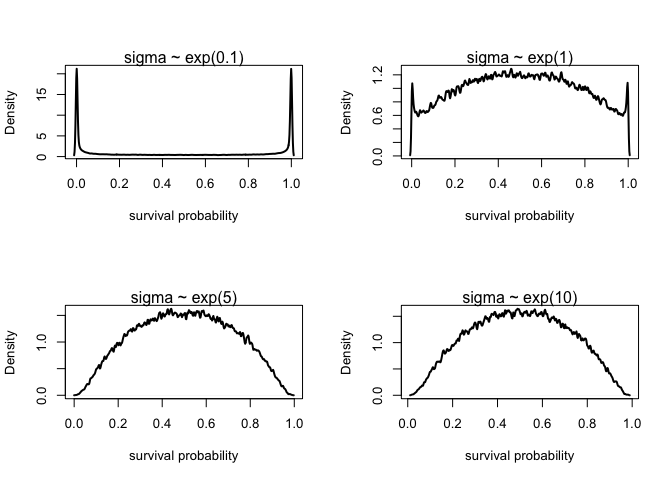

Week 6 Homework
================
Yurun (Ellen) Ying
2022-06-24

## Course homework

### Problem 1

Prior predictive simulation for the tank survival probabilities:

![\mathrm{logit}(p_i) = \alpha\_{TANK\[i\]}](https://latex.codecogs.com/png.image?%5Cdpi%7B110%7D&space;%5Cbg_white&space;%5Cmathrm%7Blogit%7D%28p_i%29%20%3D%20%5Calpha_%7BTANK%5Bi%5D%7D "\mathrm{logit}(p_i) = \alpha_{TANK[i]}")

")

")

")

``` r
set.seed(7)
n <- 1e5
a_bar <- rnorm(n, 0, 1)
sigma <- rexp(n, 1)
a <- rnorm(n, a_bar, sigma)
dens(inv_logit(a), adj = 0.1, lwd = 2, xlab = "survival probability")
```

<!-- -->

Write the above code as a function and plot for other prior values of
sigma.

``` r
par(mfrow = c(2, 2))
for (lambda in c(0.1, 1, 5, 10)) multi_prior(lambda)
```

<!-- -->

Too tight a prior makes the model believe that the survival probability
is either 0 or 1. Relaxing the prior makes the model assign most
probability mass around the center before it is fed with the data.

### Problem 2

Start with the varying intercept model and add `pred` and `size` as
predictors. Consider their interaction.

``` r
# a DAG
dag1 <- dagitty("dag{Pred <- Size -> Prob; Pred -> Prob}")
coordinates(dag1) <- list(x = c(Pred = 0.2, Size = 0.5, Prob = 0.8),
                          y = c(Pred = 1, Size = 0.5, Prob = 1))
drawdag(dag1)
```

<!-- -->

Size and predators are likely to impact survival probability
independently. Size can also impact how much effect predators are
present can influence the probability.

#### Correction

This is an experiment. Manipulations don’t obviously confound each
other. So instead we need to use this DAG.

``` r
dag1.1 <- dagitty("dag{Size -> Prob; Pred -> Prob; Tank -> Prob; Dens -> Prob}")
coordinates(dag1.1) <- list(x = c(Pred = 0.2, Size = 0.3, Prob = 0.5, Dens = 0.8, Tank = 0.7),
                          y = c(Pred = 1, Size = 0.8, Prob = 1, Dens = 1, Tank = 0.8))
drawdag(dag1.1)
```

<!-- -->

``` r
data("reedfrogs")
d <- reedfrogs

# a clean data
d$tank <- 1:nrow(d)
dat <- list(
  tank = d$tank,
  N = d$density,
  surv = d$surv,
  S = ifelse(d$size == "small", 1, 2), # 1 = small, 2 = big
  P = ifelse(d$pred == "no", 1, 2) # 1 = no, 2 = pred
)
```

Fit a model:

")

![\mathrm{logit}(p_i) = \alpha\_{TANK\[i\]} + \beta\_{\[P,S\]}](https://latex.codecogs.com/png.image?%5Cdpi%7B110%7D&space;%5Cbg_white&space;%5Cmathrm%7Blogit%7D%28p_i%29%20%3D%20%5Calpha_%7BTANK%5Bi%5D%7D%20%2B%20%5Cbeta_%7B%5BP%2CS%5D%7D "\mathrm{logit}(p_i) = \alpha_{TANK[i]} + \beta_{[P,S]}")

")

")

")

![\beta\_{\[P,S\]} \sim \mathrm{Normal}(0, 1)](https://latex.codecogs.com/png.image?%5Cdpi%7B110%7D&space;%5Cbg_white&space;%5Cbeta_%7B%5BP%2CS%5D%7D%20%5Csim%20%5Cmathrm%7BNormal%7D%280%2C%201%29 "\beta_{[P,S]} \sim \mathrm{Normal}(0, 1)")

``` r
# priors
# set.seed(7)
# n <- 1e5
# a_bar <- rnorm(n, 0, 1)
# sigma <- rexp(n, 1)
# a <- rnorm(n, a_bar, sigma)
# b <- rnorm(n, 0, 1)
# p <- a + b
# dens(inv_logit(p), adj = 0.1, lwd = 2, xlab = "survival probability")

m2 <- ulam(
  alist(
    surv ~ dbinom(N, p),
    logit(p) <- a[tank] + b[P,S],
    a[tank] ~ dnorm(a_bar, sigma),
    a_bar ~ dnorm(0, 1),
    sigma ~ dexp(1),
    matrix[P,S]:b ~ dnorm(0, 1)
  ), data = dat, chains = 4, cores = 4
)
```

    ## Running MCMC with 4 parallel chains, with 1 thread(s) per chain...
    ## 
    ## Chain 1 Iteration:   1 / 1000 [  0%]  (Warmup) 
    ## Chain 1 Iteration: 100 / 1000 [ 10%]  (Warmup) 
    ## Chain 2 Iteration:   1 / 1000 [  0%]  (Warmup) 
    ## Chain 2 Iteration: 100 / 1000 [ 10%]  (Warmup) 
    ## Chain 3 Iteration:   1 / 1000 [  0%]  (Warmup) 
    ## Chain 3 Iteration: 100 / 1000 [ 10%]  (Warmup) 
    ## Chain 3 Iteration: 200 / 1000 [ 20%]  (Warmup) 
    ## Chain 4 Iteration:   1 / 1000 [  0%]  (Warmup) 
    ## Chain 4 Iteration: 100 / 1000 [ 10%]  (Warmup) 
    ## Chain 4 Iteration: 200 / 1000 [ 20%]  (Warmup) 
    ## Chain 1 Iteration: 200 / 1000 [ 20%]  (Warmup) 
    ## Chain 1 Iteration: 300 / 1000 [ 30%]  (Warmup) 
    ## Chain 1 Iteration: 400 / 1000 [ 40%]  (Warmup) 
    ## Chain 1 Iteration: 500 / 1000 [ 50%]  (Warmup) 
    ## Chain 1 Iteration: 501 / 1000 [ 50%]  (Sampling) 
    ## Chain 2 Iteration: 200 / 1000 [ 20%]  (Warmup) 
    ## Chain 2 Iteration: 300 / 1000 [ 30%]  (Warmup) 
    ## Chain 2 Iteration: 400 / 1000 [ 40%]  (Warmup) 
    ## Chain 3 Iteration: 300 / 1000 [ 30%]  (Warmup) 
    ## Chain 3 Iteration: 400 / 1000 [ 40%]  (Warmup) 
    ## Chain 4 Iteration: 300 / 1000 [ 30%]  (Warmup) 
    ## Chain 4 Iteration: 400 / 1000 [ 40%]  (Warmup) 
    ## Chain 1 Iteration: 600 / 1000 [ 60%]  (Sampling) 
    ## Chain 1 Iteration: 700 / 1000 [ 70%]  (Sampling) 
    ## Chain 2 Iteration: 500 / 1000 [ 50%]  (Warmup) 
    ## Chain 2 Iteration: 501 / 1000 [ 50%]  (Sampling) 
    ## Chain 2 Iteration: 600 / 1000 [ 60%]  (Sampling) 
    ## Chain 3 Iteration: 500 / 1000 [ 50%]  (Warmup) 
    ## Chain 3 Iteration: 501 / 1000 [ 50%]  (Sampling) 
    ## Chain 3 Iteration: 600 / 1000 [ 60%]  (Sampling) 
    ## Chain 4 Iteration: 500 / 1000 [ 50%]  (Warmup) 
    ## Chain 4 Iteration: 501 / 1000 [ 50%]  (Sampling) 
    ## Chain 4 Iteration: 600 / 1000 [ 60%]  (Sampling) 
    ## Chain 1 Iteration: 800 / 1000 [ 80%]  (Sampling) 
    ## Chain 1 Iteration: 900 / 1000 [ 90%]  (Sampling) 
    ## Chain 2 Iteration: 700 / 1000 [ 70%]  (Sampling) 
    ## Chain 2 Iteration: 800 / 1000 [ 80%]  (Sampling) 
    ## Chain 3 Iteration: 700 / 1000 [ 70%]  (Sampling) 
    ## Chain 3 Iteration: 800 / 1000 [ 80%]  (Sampling) 
    ## Chain 3 Iteration: 900 / 1000 [ 90%]  (Sampling) 
    ## Chain 4 Iteration: 700 / 1000 [ 70%]  (Sampling) 
    ## Chain 4 Iteration: 800 / 1000 [ 80%]  (Sampling) 
    ## Chain 1 Iteration: 1000 / 1000 [100%]  (Sampling) 
    ## Chain 2 Iteration: 900 / 1000 [ 90%]  (Sampling) 
    ## Chain 2 Iteration: 1000 / 1000 [100%]  (Sampling) 
    ## Chain 3 Iteration: 1000 / 1000 [100%]  (Sampling) 
    ## Chain 4 Iteration: 900 / 1000 [ 90%]  (Sampling) 
    ## Chain 4 Iteration: 1000 / 1000 [100%]  (Sampling) 
    ## Chain 1 finished in 0.7 seconds.
    ## Chain 2 finished in 0.6 seconds.
    ## Chain 3 finished in 0.6 seconds.
    ## Chain 4 finished in 0.6 seconds.
    ## 
    ## All 4 chains finished successfully.
    ## Mean chain execution time: 0.6 seconds.
    ## Total execution time: 0.8 seconds.

``` r
precis(m2, 3, pars = c("a_bar", "sigma", "b"))
```

    ##              mean        sd       5.5%      94.5%    n_eff    Rhat4
    ## a_bar   0.9939778 0.4675344  0.2575624  1.7719205 116.1284 1.043598
    ## sigma   0.7483634 0.1421312  0.5360290  0.9786501 581.1044 1.001119
    ## b[1,1]  1.4694432 0.5206579  0.6556198  2.3085785 169.0002 1.027446
    ## b[1,2]  1.6055055 0.5291720  0.7569748  2.4429071 154.5479 1.035521
    ## b[2,1] -0.4766667 0.5015212 -1.2703266  0.3198627 139.3796 1.039073
    ## b[2,2] -1.3497306 0.5025671 -2.1751300 -0.5527433 142.4010 1.025964

From the table, we can roughly see that predators being present
decreases survival rate, and being large in size has different effects
depending on whether predators is present or not.

``` r
set.seed(509)
m2_post <- extract.samples(m2)
diff_pred_small <- inv_logit(m2_post$b[,2,1]) - inv_logit(m2_post$b[,1,1])
diff_pred_big <- inv_logit(m2_post$b[,2,2]) - inv_logit(m2_post$b[,1,2])
dens(diff_pred_small, col = 2, lwd = 3,
     xlab = "Predator P-A contrast", xlim = c(-0.8,-0.1), ylim = c(0,7))
dens(diff_pred_big, col = 4, lwd = 3, add = TRUE)
text(-0.3, 3, "Small size", col = 2)
text(-0.75, 3, "Big size", col = 4)
```

<!-- -->

When the size is small, predators being present decreases the survival
probability by around 0.4; when the size is big, predators being present
decreases the survival probability by around 0.6.

``` r
diff_size_np <- inv_logit(m2_post$b[,1,2]) - inv_logit(m2_post$b[,1,1])
diff_size_p <- inv_logit(m2_post$b[,2,2]) - inv_logit(m2_post$b[,2,1])
dens(diff_size_np, col = 2, lwd = 3,
     xlab = "Size B-S contrast", xlim = c(-0.5,0.4), ylim = c(0,7))
dens(diff_size_p, col = 4, lwd = 3, add = TRUE)
text(0.18, 3, "Predators\nabsent", col = 2)
text(-0.3, 3, "Predators\npresent", col = 4)
abline(v = 0, lty = 2)
```

<!-- -->

Whether predators are absent, having big size has little effect on the
survival probability; when predators are present, having big size
decreases the survival probabilities by around 0.2.

### Problem 3

Estimate the causal effect of `density` on survival. Consider whether
`pred` modifies the effect of density.

We will be using the following model:

")

![\mathrm{logit}(p_i) = \alpha\_{TANK\[i\]} + \beta\_{\[P,S\]} + \beta\_{D\[P\]}D](https://latex.codecogs.com/png.image?%5Cdpi%7B110%7D&space;%5Cbg_white&space;%5Cmathrm%7Blogit%7D%28p_i%29%20%3D%20%5Calpha_%7BTANK%5Bi%5D%7D%20%2B%20%5Cbeta_%7B%5BP%2CS%5D%7D%20%2B%20%5Cbeta_%7BD%5BP%5D%7DD "\mathrm{logit}(p_i) = \alpha_{TANK[i]} + \beta_{[P,S]} + \beta_{D[P]}D")

")

")

")

![\beta\_{\[P,S\]} \sim \mathrm{Normal}(0, 1)](https://latex.codecogs.com/png.image?%5Cdpi%7B110%7D&space;%5Cbg_white&space;%5Cbeta_%7B%5BP%2CS%5D%7D%20%5Csim%20%5Cmathrm%7BNormal%7D%280%2C%201%29 "\beta_{[P,S]} \sim \mathrm{Normal}(0, 1)")

![\beta\_{D\[P\]} \sim \mathrm{Normal}(0, 1)](https://latex.codecogs.com/png.image?%5Cdpi%7B110%7D&space;%5Cbg_white&space;%5Cbeta_%7BD%5BP%5D%7D%20%5Csim%20%5Cmathrm%7BNormal%7D%280%2C%201%29 "\beta_{D[P]} \sim \mathrm{Normal}(0, 1)")

``` r
# a new dataset
dat2 <- list(
  tank = d$tank,
  N = d$density,
  surv = d$surv,
  S = ifelse(d$size == "small", 1, 2), # 1 = small, 2 = big
  P = ifelse(d$pred == "no", 1, 2), # 1 = no, 2 = pred
  D = standardize(d$density)
)

# fit a model
m3 <- ulam(
  alist(
    surv ~ dbinom(N, p),
    logit(p) <- a[tank] + bPS[P,S] + bD[P]*D,
    a[tank] ~ dnorm(a_bar, sigma),
    a_bar ~ dnorm(0, 1),
    sigma ~ dexp(1),
    bD[P]~ dnorm(0, 1),
    matrix[P,S]:bPS ~ dnorm(0, 1)
  ), data = dat2, chains = 4, cores = 4
)
```

    ## Running MCMC with 4 parallel chains, with 1 thread(s) per chain...
    ## 
    ## Chain 1 Iteration:   1 / 1000 [  0%]  (Warmup) 
    ## Chain 1 Iteration: 100 / 1000 [ 10%]  (Warmup) 
    ## Chain 2 Iteration:   1 / 1000 [  0%]  (Warmup) 
    ## Chain 2 Iteration: 100 / 1000 [ 10%]  (Warmup) 
    ## Chain 3 Iteration:   1 / 1000 [  0%]  (Warmup) 
    ## Chain 3 Iteration: 100 / 1000 [ 10%]  (Warmup) 
    ## Chain 4 Iteration:   1 / 1000 [  0%]  (Warmup) 
    ## Chain 4 Iteration: 100 / 1000 [ 10%]  (Warmup) 
    ## Chain 1 Iteration: 200 / 1000 [ 20%]  (Warmup) 
    ## Chain 1 Iteration: 300 / 1000 [ 30%]  (Warmup) 
    ## Chain 2 Iteration: 200 / 1000 [ 20%]  (Warmup) 
    ## Chain 3 Iteration: 200 / 1000 [ 20%]  (Warmup) 
    ## Chain 4 Iteration: 200 / 1000 [ 20%]  (Warmup) 
    ## Chain 1 Iteration: 400 / 1000 [ 40%]  (Warmup) 
    ## Chain 2 Iteration: 300 / 1000 [ 30%]  (Warmup) 
    ## Chain 2 Iteration: 400 / 1000 [ 40%]  (Warmup) 
    ## Chain 3 Iteration: 300 / 1000 [ 30%]  (Warmup) 
    ## Chain 3 Iteration: 400 / 1000 [ 40%]  (Warmup) 
    ## Chain 4 Iteration: 300 / 1000 [ 30%]  (Warmup) 
    ## Chain 4 Iteration: 400 / 1000 [ 40%]  (Warmup) 
    ## Chain 1 Iteration: 500 / 1000 [ 50%]  (Warmup) 
    ## Chain 1 Iteration: 501 / 1000 [ 50%]  (Sampling) 
    ## Chain 1 Iteration: 600 / 1000 [ 60%]  (Sampling) 
    ## Chain 2 Iteration: 500 / 1000 [ 50%]  (Warmup) 
    ## Chain 2 Iteration: 501 / 1000 [ 50%]  (Sampling) 
    ## Chain 3 Iteration: 500 / 1000 [ 50%]  (Warmup) 
    ## Chain 3 Iteration: 501 / 1000 [ 50%]  (Sampling) 
    ## Chain 3 Iteration: 600 / 1000 [ 60%]  (Sampling) 
    ## Chain 4 Iteration: 500 / 1000 [ 50%]  (Warmup) 
    ## Chain 4 Iteration: 501 / 1000 [ 50%]  (Sampling) 
    ## Chain 4 Iteration: 600 / 1000 [ 60%]  (Sampling) 
    ## Chain 1 Iteration: 700 / 1000 [ 70%]  (Sampling) 
    ## Chain 1 Iteration: 800 / 1000 [ 80%]  (Sampling) 
    ## Chain 2 Iteration: 600 / 1000 [ 60%]  (Sampling) 
    ## Chain 2 Iteration: 700 / 1000 [ 70%]  (Sampling) 
    ## Chain 3 Iteration: 700 / 1000 [ 70%]  (Sampling) 
    ## Chain 4 Iteration: 700 / 1000 [ 70%]  (Sampling) 
    ## Chain 4 Iteration: 800 / 1000 [ 80%]  (Sampling) 
    ## Chain 4 Iteration: 900 / 1000 [ 90%]  (Sampling) 
    ## Chain 1 Iteration: 900 / 1000 [ 90%]  (Sampling) 
    ## Chain 2 Iteration: 800 / 1000 [ 80%]  (Sampling) 
    ## Chain 2 Iteration: 900 / 1000 [ 90%]  (Sampling) 
    ## Chain 3 Iteration: 800 / 1000 [ 80%]  (Sampling) 
    ## Chain 3 Iteration: 900 / 1000 [ 90%]  (Sampling) 
    ## Chain 4 Iteration: 1000 / 1000 [100%]  (Sampling) 
    ## Chain 4 finished in 0.6 seconds.
    ## Chain 1 Iteration: 1000 / 1000 [100%]  (Sampling) 
    ## Chain 2 Iteration: 1000 / 1000 [100%]  (Sampling) 
    ## Chain 3 Iteration: 1000 / 1000 [100%]  (Sampling) 
    ## Chain 1 finished in 0.7 seconds.
    ## Chain 2 finished in 0.7 seconds.
    ## Chain 3 finished in 0.7 seconds.
    ## 
    ## All 4 chains finished successfully.
    ## Mean chain execution time: 0.7 seconds.
    ## Total execution time: 0.8 seconds.

``` r
precis(m3, 2, pars = c("a_bar", "sigma", "bPS", "bD"))
```

    ##             mean        sd       5.5%      94.5%      n_eff     Rhat4
    ## a_bar  1.0557589 0.4853225  0.2953502  1.8006789   71.71184 1.0746516
    ## sigma  0.6789227 0.1459759  0.4634213  0.9286393  341.95864 1.0143064
    ## bD[1]  0.1471659 0.2330888 -0.2161273  0.5174083 1009.53604 0.9993058
    ## bD[2] -0.4816935 0.1913330 -0.8013842 -0.1850526  777.70270 1.0020919

The sigma value in this model has a lower mean value than the sigma in
the model for last problem. This is probably because this model has one
more predictor and explains more variance in the outcome through the
predictors other than the intercepts. Therefore, the variance left
unexplained for the intercepts is lower, resulting in a lower estimate
of
.

``` r
set.seed(509)
m3_post <- extract.samples(m3)
dens(inv_logit(m3_post$bD[,1]), col = 2, lwd = 3,
     xlab = "BetaD", xlim = c(0.2, 0.8), ylim = c(0,10))
dens(inv_logit(m3_post$bD[,2]), col = 4, lwd = 3, add = TRUE)
text(0.68, 3, "Predators\nabsent", col = 2)
text(0.25, 3, "Predators\npresent", col = 4)
```

<!-- -->

When predators are absent, increasing the population density by 10 can
increase the survival probability by around 0.55; when predators are
present, increasing the population density by 10 can only increase the
survival probability by around 0.4.

### Problem 4

Compute the expected causal effect of removing predators.

We need to average over all the predictors. We will assign equal number
of cases to the four conditions. Each condition will contain tank number
1-48.

``` r
# repeat all the tank number four times
tank <-  rep(1:nrow(d), 4)
# half have 10 and the other have 35 individuals
N <- c(rep(10, nrow(d)*2), rep(35, nrow(d)*2))
# standardize N using the mean and sd of the empirical data
D <- (N - attr(dat2$D,"scaled:center"))/attr(dat2$D,"scaled:scale")
# half small and half large
S <- rep(c(rep(1, nrow(d)), rep(2, nrow(d))), 2)

# simulate as if predators are missing for all tanks
sim_preda <- 
  link(m3, data = data.frame(tank = tank, N = N, D = D, S = S, P = rep(1, nrow(d)*4)))
# simulate as if predators are present for all tanks
sim_predp <- 
  link(m3, data = data.frame(tank = tank, N = N, D = D, S = S, P = rep(2, nrow(d)*4)))
diff_ap <- inv_logit(sim_preda) - inv_logit(sim_predp)
dens(diff_ap, lwd = 2, xlab = "Counterfactual predators A-P contrast")
```

<!-- -->

Removing predators will increase the average survival rate across all
conditions by about 0.08\`.

#### Correction

What we would like to do for the varying intercepts is instead to
randomly sample from the posterior distribution and include them in the
linear model.

``` r
n <- nrow(d)
N <- rep(c(10, 10, 35, 35), times = n)
D <- (N - attr(dat2$D,"scaled:center"))/attr(dat2$D,"scaled:scale")
S <- rep(c(1, 2, 1, 2), times = n)

# extract sample of the varying intercept
post <- extract.samples(m3)
aT <- replicate(length(D), rnorm(2e3, post$a_bar, post$sigma))

# simulate as if predators are missing for all tanks
P <-  rep(rep(1, 4), times = n)
sim_preda <- sapply(
  1:length(D),
  function (i) inv_logit(aT[,i] + post$bPS[,P[i],S[i]] + post$bD[,P[i]] * D[i]))
# simulate as if predators are present for all tanks
P <-  rep(rep(2, 4), times = n)
sim_predp <- sapply(
  1:length(D),
  function (i) inv_logit(aT[,i] + post$bPS[,P[i],S[i]] + post$bD[,P[i]] * D[i]))
diff_ap <- sim_preda - sim_predp # no need to use inverse logit...
dens(diff_ap, lwd = 2, xlab = "Counterfactual predators A-P contrast")
```

<!-- -->

Now this actually doesn’t look so different from my approach. My only
mistake was to use the inverse logit function repeatedly, but the logic
of assigning all the tanks to each condition seems to produce the same
results as the sampling approach.
