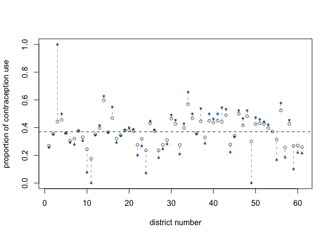
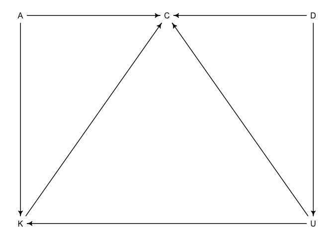
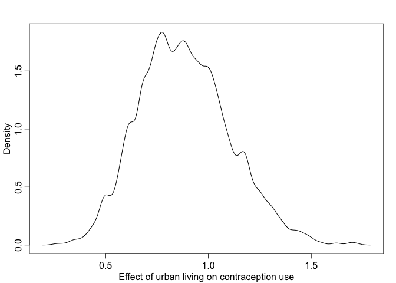
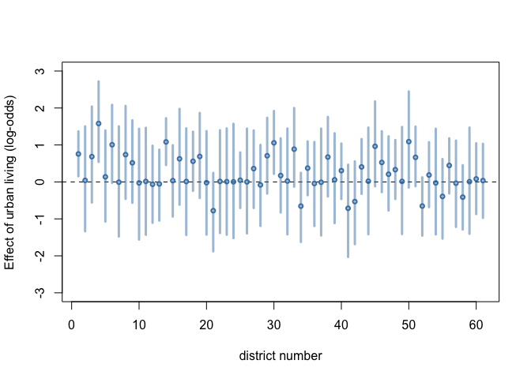
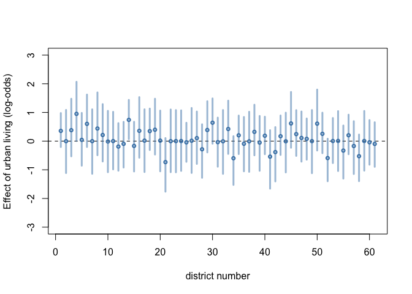
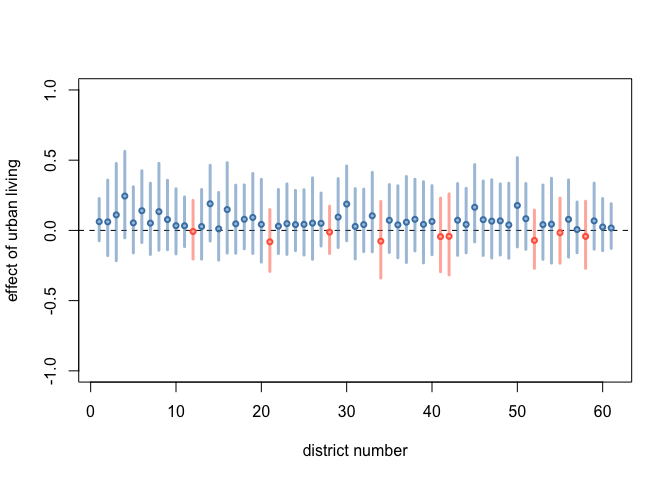
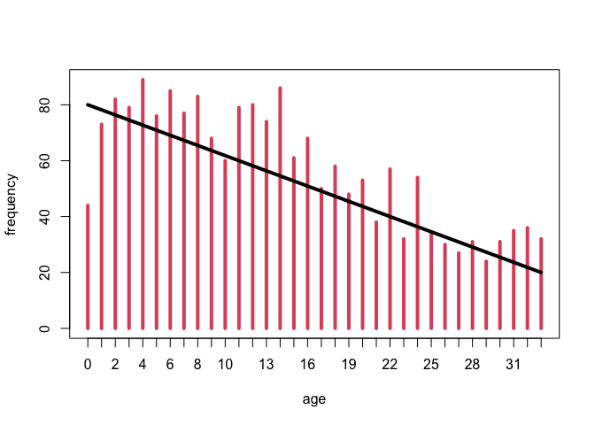
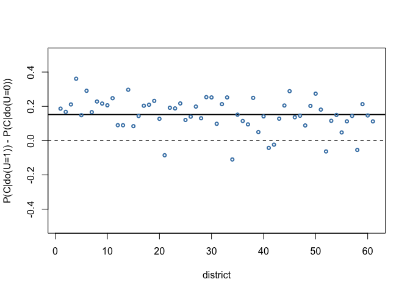

Week 7 Homework
================
Yurun (Ellen) Ying
2022-06-27

## Course homework

### Problem 1

Use partial pooling to estimate the proportion of women using
contraception in each district.

``` r
data("bangladesh")
d <- bangladesh

# construct data
d_id <- 1:61
N <- rep(0, length(d_id))
C <- rep(0, length(d_id))
for (i in d_id) {
  N[i] <- nrow(d[d$district == i,])
  C[i] <- sum(d$use.contraception[d$district == i])
}
# remove district 54
d_id <- d_id[-54]; N <- N[-54]; C <- C[-54]
# combine into data.frame
dat_1 <- data.frame(d_id = d_id, N = N, C = C)
```

Fit a varying intercept model:

![\begin{aligned}
C_i &\sim \mathrm{Binomial}(N_i, p_i) \\\\
\mathrm{logit}(p_i) &= \alpha\_{D\[i\]} \\\\
\alpha_j &\sim \mathrm{Normal}(\bar{\alpha}, \sigma) \\\\
\bar{\alpha} &\sim \mathrm{Normal}(0,1.5) \\\\
\sigma &\sim \mathrm{Exponential}(1)
\end{aligned}](https://latex.codecogs.com/png.image?%5Cdpi%7B110%7D&space;%5Cbg_white&space;%5Cbegin%7Baligned%7D%0AC_i%20%26%5Csim%20%5Cmathrm%7BBinomial%7D%28N_i%2C%20p_i%29%20%5C%5C%0A%5Cmathrm%7Blogit%7D%28p_i%29%20%26%3D%20%5Calpha_%7BD%5Bi%5D%7D%20%5C%5C%0A%5Calpha_j%20%26%5Csim%20%5Cmathrm%7BNormal%7D%28%5Cbar%7B%5Calpha%7D%2C%20%5Csigma%29%20%5C%5C%0A%5Cbar%7B%5Calpha%7D%20%26%5Csim%20%5Cmathrm%7BNormal%7D%280%2C1.5%29%20%5C%5C%0A%5Csigma%20%26%5Csim%20%5Cmathrm%7BExponential%7D%281%29%0A%5Cend%7Baligned%7D "\begin{aligned}
C_i &\sim \mathrm{Binomial}(N_i, p_i) \\
\mathrm{logit}(p_i) &= \alpha_{D[i]} \\
\alpha_j &\sim \mathrm{Normal}(\bar{\alpha}, \sigma) \\
\bar{\alpha} &\sim \mathrm{Normal}(0,1.5) \\
\sigma &\sim \mathrm{Exponential}(1)
\end{aligned}")

``` r
m1 <- ulam(
  alist(
    C ~ binomial(N, p),
    logit(p) <- a[d_id],
    vector[61]:a ~ normal(abar, sigma),
    abar ~ normal(0, 1.5),
    sigma ~ exponential(1)
  ), data = dat_1, chains = 4, cores = 4
)
```

    ## Running MCMC with 4 parallel chains, with 1 thread(s) per chain...
    ## 
    ## Chain 1 Iteration:   1 / 1000 [  0%]  (Warmup) 
    ## Chain 1 Iteration: 100 / 1000 [ 10%]  (Warmup) 
    ## Chain 1 Iteration: 200 / 1000 [ 20%]  (Warmup) 
    ## Chain 1 Iteration: 300 / 1000 [ 30%]  (Warmup) 
    ## Chain 2 Iteration:   1 / 1000 [  0%]  (Warmup) 
    ## Chain 2 Iteration: 100 / 1000 [ 10%]  (Warmup) 
    ## Chain 2 Iteration: 200 / 1000 [ 20%]  (Warmup) 
    ## Chain 3 Iteration:   1 / 1000 [  0%]  (Warmup) 
    ## Chain 3 Iteration: 100 / 1000 [ 10%]  (Warmup) 
    ## Chain 3 Iteration: 200 / 1000 [ 20%]  (Warmup) 
    ## Chain 3 Iteration: 300 / 1000 [ 30%]  (Warmup) 
    ## Chain 3 Iteration: 400 / 1000 [ 40%]  (Warmup) 
    ## Chain 4 Iteration:   1 / 1000 [  0%]  (Warmup) 
    ## Chain 4 Iteration: 100 / 1000 [ 10%]  (Warmup) 
    ## Chain 4 Iteration: 200 / 1000 [ 20%]  (Warmup) 
    ## Chain 4 Iteration: 300 / 1000 [ 30%]  (Warmup) 
    ## Chain 4 Iteration: 400 / 1000 [ 40%]  (Warmup) 
    ## Chain 1 Iteration: 400 / 1000 [ 40%]  (Warmup) 
    ## Chain 1 Iteration: 500 / 1000 [ 50%]  (Warmup) 
    ## Chain 1 Iteration: 501 / 1000 [ 50%]  (Sampling) 
    ## Chain 1 Iteration: 600 / 1000 [ 60%]  (Sampling) 
    ## Chain 1 Iteration: 700 / 1000 [ 70%]  (Sampling) 
    ## Chain 2 Iteration: 300 / 1000 [ 30%]  (Warmup) 
    ## Chain 2 Iteration: 400 / 1000 [ 40%]  (Warmup) 
    ## Chain 2 Iteration: 500 / 1000 [ 50%]  (Warmup) 
    ## Chain 2 Iteration: 501 / 1000 [ 50%]  (Sampling) 
    ## Chain 2 Iteration: 600 / 1000 [ 60%]  (Sampling) 
    ## Chain 3 Iteration: 500 / 1000 [ 50%]  (Warmup) 
    ## Chain 3 Iteration: 501 / 1000 [ 50%]  (Sampling) 
    ## Chain 3 Iteration: 600 / 1000 [ 60%]  (Sampling) 
    ## Chain 3 Iteration: 700 / 1000 [ 70%]  (Sampling) 
    ## Chain 4 Iteration: 500 / 1000 [ 50%]  (Warmup) 
    ## Chain 4 Iteration: 501 / 1000 [ 50%]  (Sampling) 
    ## Chain 4 Iteration: 600 / 1000 [ 60%]  (Sampling) 
    ## Chain 4 Iteration: 700 / 1000 [ 70%]  (Sampling) 
    ## Chain 1 Iteration: 800 / 1000 [ 80%]  (Sampling) 
    ## Chain 1 Iteration: 900 / 1000 [ 90%]  (Sampling) 
    ## Chain 1 Iteration: 1000 / 1000 [100%]  (Sampling) 
    ## Chain 2 Iteration: 700 / 1000 [ 70%]  (Sampling) 
    ## Chain 2 Iteration: 800 / 1000 [ 80%]  (Sampling) 
    ## Chain 2 Iteration: 900 / 1000 [ 90%]  (Sampling) 
    ## Chain 3 Iteration: 800 / 1000 [ 80%]  (Sampling) 
    ## Chain 3 Iteration: 900 / 1000 [ 90%]  (Sampling) 
    ## Chain 3 Iteration: 1000 / 1000 [100%]  (Sampling) 
    ## Chain 4 Iteration: 800 / 1000 [ 80%]  (Sampling) 
    ## Chain 4 Iteration: 900 / 1000 [ 90%]  (Sampling) 
    ## Chain 4 Iteration: 1000 / 1000 [100%]  (Sampling) 
    ## Chain 1 finished in 0.5 seconds.
    ## Chain 3 finished in 0.5 seconds.
    ## Chain 4 finished in 0.5 seconds.
    ## Chain 2 Iteration: 1000 / 1000 [100%]  (Sampling) 
    ## Chain 2 finished in 0.6 seconds.
    ## 
    ## All 4 chains finished successfully.
    ## Mean chain execution time: 0.5 seconds.
    ## Total execution time: 0.8 seconds.

``` r
#precis(m1, 2)
```

The model still gives an estimate for the missing district 54. It seems
to assume that the mean and the sd of the missing district roughly equal
to the mean and the sd of the population distribution.

Plot the posterior estimates against the empirical proportion.

``` r
set.seed(43)
post1 <- extract.samples(m1)
post_a <- inv_logit(apply(post1$a, 2, mean))
dat_1$prop <- dat_1$C/dat_1$N

plot(NULL, xlim = c(1, 61), ylim = c(0, 1),
     xlab = "district number", ylab = "proportion of contraception use")
abline(h = inv_logit(mean(post1$abar)), lty = 2)
for (i in d_id) {
  points(i, dat_1$prop[dat_1$d_id==i],
         cex = 0.7, pch = 16, col = "steelblue")
  lines(rep(i, 2), c(dat_1$prop[dat_1$d_id==i], post_a[i]), 
        lty = 2, col = col.alpha("black", 0.5))
}
points(1:length(post_a), post_a, cex = 0.8, col = col.alpha("black", 0.7))
```

<!-- -->

The blue dots are empirical raw proportion of women using contraception,
and the hollow dots are estimated proportions. The estimates shrink
towards the population mean compared to the empirical proportion. The
shrinkage is more pronounced in districts where the empirical data is
far away from the estimated population mean.

### Problem 2

Draw a DAG of all variables and design an estimation strategy to
identify both the total and direct causal effects of living in an urban
center on contraceptive use.

``` r
dag1 <- dagitty("dag{
                A -> C <- D; K -> C <- U;
                A -> K; D -> U; U -> K }")
coordinates(dag1) <- list(x = c(A = 0, C = 0.5, D = 1, K = 0, U = 1),
                          y = c(A = 0, C = 0, D = 0, K = 1, U = 1))
drawdag(dag1)
```

<!-- -->

To estimate the total effect, we need to control for D. To estimate the
direct effect, we need to control for D, K, and A.

### Problem 3

Build models to estimate the total and direct causal effect of urban
living on contraceptive use.

#### Total effect

A model estimating the total effect:

![\begin{aligned}
C_i &\sim \mathrm{Bernoulli}(p_i) \\\\
\mathrm{logit}(p_i) &= \alpha\_{D\[i\]} + \beta_U U_i \\\\
\alpha_j &\sim \mathrm{Normal}(\bar{\alpha}, \sigma_A) \\\\
\beta_U &\sim \mathrm{Normal}(0, \sigma_U)\\\\
\bar{\alpha} &\sim \mathrm{Normal}(0,1.5) \\\\
\sigma_A, \sigma_U &\sim \mathrm{Exponential}(1)
\end{aligned}](https://latex.codecogs.com/png.image?%5Cdpi%7B110%7D&space;%5Cbg_white&space;%5Cbegin%7Baligned%7D%0AC_i%20%26%5Csim%20%5Cmathrm%7BBernoulli%7D%28p_i%29%20%5C%5C%0A%5Cmathrm%7Blogit%7D%28p_i%29%20%26%3D%20%5Calpha_%7BD%5Bi%5D%7D%20%2B%20%5Cbeta_U%20U_i%20%5C%5C%0A%5Calpha_j%20%26%5Csim%20%5Cmathrm%7BNormal%7D%28%5Cbar%7B%5Calpha%7D%2C%20%5Csigma_A%29%20%5C%5C%0A%5Cbeta_U%20%26%5Csim%20%5Cmathrm%7BNormal%7D%280%2C%20%5Csigma_U%29%5C%5C%0A%5Cbar%7B%5Calpha%7D%20%26%5Csim%20%5Cmathrm%7BNormal%7D%280%2C1.5%29%20%5C%5C%0A%5Csigma_A%2C%20%5Csigma_U%20%26%5Csim%20%5Cmathrm%7BExponential%7D%281%29%0A%5Cend%7Baligned%7D "\begin{aligned}
C_i &\sim \mathrm{Bernoulli}(p_i) \\
\mathrm{logit}(p_i) &= \alpha_{D[i]} + \beta_U U_i \\
\alpha_j &\sim \mathrm{Normal}(\bar{\alpha}, \sigma_A) \\
\beta_U &\sim \mathrm{Normal}(0, \sigma_U)\\
\bar{\alpha} &\sim \mathrm{Normal}(0,1.5) \\
\sigma_A, \sigma_U &\sim \mathrm{Exponential}(1)
\end{aligned}")

``` r
dat3.1 <- data.frame(D = d$district, C = d$use.contraception, U = d$urban)

# total effect - no stratification of U by D
m3.1 <- ulam(
  alist(
    C ~ bernoulli(p),
    logit(p) <- a[D] + bU * U,
    vector[61]:a ~ normal(abar, sigma_a),
    bU ~ normal(0, sigma_u),
    abar ~ normal(0, 1.5),
    c(sigma_a,sigma_u) ~ exponential(1)
  ), data = dat3.1, chains = 4, cores = 4
)
```

    ## Running MCMC with 4 parallel chains, with 1 thread(s) per chain...
    ## 
    ## Chain 1 Iteration:   1 / 1000 [  0%]  (Warmup) 
    ## Chain 2 Iteration:   1 / 1000 [  0%]  (Warmup) 
    ## Chain 3 Iteration:   1 / 1000 [  0%]  (Warmup) 
    ## Chain 4 Iteration:   1 / 1000 [  0%]  (Warmup) 
    ## Chain 2 Iteration: 100 / 1000 [ 10%]  (Warmup) 
    ## Chain 4 Iteration: 100 / 1000 [ 10%]  (Warmup) 
    ## Chain 1 Iteration: 100 / 1000 [ 10%]  (Warmup) 
    ## Chain 3 Iteration: 100 / 1000 [ 10%]  (Warmup) 
    ## Chain 2 Iteration: 200 / 1000 [ 20%]  (Warmup) 
    ## Chain 4 Iteration: 200 / 1000 [ 20%]  (Warmup) 
    ## Chain 3 Iteration: 200 / 1000 [ 20%]  (Warmup) 
    ## Chain 1 Iteration: 200 / 1000 [ 20%]  (Warmup) 
    ## Chain 4 Iteration: 300 / 1000 [ 30%]  (Warmup) 
    ## Chain 3 Iteration: 300 / 1000 [ 30%]  (Warmup) 
    ## Chain 2 Iteration: 300 / 1000 [ 30%]  (Warmup) 
    ## Chain 1 Iteration: 300 / 1000 [ 30%]  (Warmup) 
    ## Chain 4 Iteration: 400 / 1000 [ 40%]  (Warmup) 
    ## Chain 3 Iteration: 400 / 1000 [ 40%]  (Warmup) 
    ## Chain 2 Iteration: 400 / 1000 [ 40%]  (Warmup) 
    ## Chain 1 Iteration: 400 / 1000 [ 40%]  (Warmup) 
    ## Chain 4 Iteration: 500 / 1000 [ 50%]  (Warmup) 
    ## Chain 4 Iteration: 501 / 1000 [ 50%]  (Sampling) 
    ## Chain 3 Iteration: 500 / 1000 [ 50%]  (Warmup) 
    ## Chain 3 Iteration: 501 / 1000 [ 50%]  (Sampling) 
    ## Chain 1 Iteration: 500 / 1000 [ 50%]  (Warmup) 
    ## Chain 1 Iteration: 501 / 1000 [ 50%]  (Sampling) 
    ## Chain 2 Iteration: 500 / 1000 [ 50%]  (Warmup) 
    ## Chain 2 Iteration: 501 / 1000 [ 50%]  (Sampling) 
    ## Chain 4 Iteration: 600 / 1000 [ 60%]  (Sampling) 
    ## Chain 1 Iteration: 600 / 1000 [ 60%]  (Sampling) 
    ## Chain 3 Iteration: 600 / 1000 [ 60%]  (Sampling) 
    ## Chain 2 Iteration: 600 / 1000 [ 60%]  (Sampling) 
    ## Chain 4 Iteration: 700 / 1000 [ 70%]  (Sampling) 
    ## Chain 3 Iteration: 700 / 1000 [ 70%]  (Sampling) 
    ## Chain 1 Iteration: 700 / 1000 [ 70%]  (Sampling) 
    ## Chain 4 Iteration: 800 / 1000 [ 80%]  (Sampling) 
    ## Chain 2 Iteration: 700 / 1000 [ 70%]  (Sampling) 
    ## Chain 3 Iteration: 800 / 1000 [ 80%]  (Sampling) 
    ## Chain 1 Iteration: 800 / 1000 [ 80%]  (Sampling) 
    ## Chain 4 Iteration: 900 / 1000 [ 90%]  (Sampling) 
    ## Chain 3 Iteration: 900 / 1000 [ 90%]  (Sampling) 
    ## Chain 1 Iteration: 900 / 1000 [ 90%]  (Sampling) 
    ## Chain 2 Iteration: 800 / 1000 [ 80%]  (Sampling) 
    ## Chain 4 Iteration: 1000 / 1000 [100%]  (Sampling) 
    ## Chain 4 finished in 7.1 seconds.
    ## Chain 1 Iteration: 1000 / 1000 [100%]  (Sampling) 
    ## Chain 3 Iteration: 1000 / 1000 [100%]  (Sampling) 
    ## Chain 1 finished in 7.4 seconds.
    ## Chain 3 finished in 7.3 seconds.
    ## Chain 2 Iteration: 900 / 1000 [ 90%]  (Sampling) 
    ## Chain 2 Iteration: 1000 / 1000 [100%]  (Sampling) 
    ## Chain 2 finished in 7.8 seconds.
    ## 
    ## All 4 chains finished successfully.
    ## Mean chain execution time: 7.4 seconds.
    ## Total execution time: 8.0 seconds.

``` r
post3.1 <- extract.samples(m3.1)
# relative increase on a odds scale
dens(exp(post3.1$bU)-1, xlab = "Effect of urban living on contraception use")
```

<!-- -->

On average, living in urban places has positive effect on contraceptive
use, which increases the log-odds by about 80%.

Stratify the effect of U by D. This is a model of varying intercepts and
varying slopes:

![\begin{aligned}
C_i &\sim \mathrm{Bernoulli}(p_i) \\\\
\mathrm{logit}(p_i) &= \alpha\_{D\[i\]} + \beta\_{U,D\[i\]} U_i \\\\
\alpha_j &\sim \mathrm{Normal}(\bar{\alpha}, \sigma_A) \\\\
\beta\_{U,j} &\sim \mathrm{Normal}(0, \sigma_U)\\\\
\bar{\alpha} &\sim \mathrm{Normal}(0,1.5) \\\\
\sigma_A, \sigma_U &\sim \mathrm{Exponential}(1)
\end{aligned}](https://latex.codecogs.com/png.image?%5Cdpi%7B110%7D&space;%5Cbg_white&space;%5Cbegin%7Baligned%7D%0AC_i%20%26%5Csim%20%5Cmathrm%7BBernoulli%7D%28p_i%29%20%5C%5C%0A%5Cmathrm%7Blogit%7D%28p_i%29%20%26%3D%20%5Calpha_%7BD%5Bi%5D%7D%20%2B%20%5Cbeta_%7BU%2CD%5Bi%5D%7D%20U_i%20%5C%5C%0A%5Calpha_j%20%26%5Csim%20%5Cmathrm%7BNormal%7D%28%5Cbar%7B%5Calpha%7D%2C%20%5Csigma_A%29%20%5C%5C%0A%5Cbeta_%7BU%2Cj%7D%20%26%5Csim%20%5Cmathrm%7BNormal%7D%280%2C%20%5Csigma_U%29%5C%5C%0A%5Cbar%7B%5Calpha%7D%20%26%5Csim%20%5Cmathrm%7BNormal%7D%280%2C1.5%29%20%5C%5C%0A%5Csigma_A%2C%20%5Csigma_U%20%26%5Csim%20%5Cmathrm%7BExponential%7D%281%29%0A%5Cend%7Baligned%7D "\begin{aligned}
C_i &\sim \mathrm{Bernoulli}(p_i) \\
\mathrm{logit}(p_i) &= \alpha_{D[i]} + \beta_{U,D[i]} U_i \\
\alpha_j &\sim \mathrm{Normal}(\bar{\alpha}, \sigma_A) \\
\beta_{U,j} &\sim \mathrm{Normal}(0, \sigma_U)\\
\bar{\alpha} &\sim \mathrm{Normal}(0,1.5) \\
\sigma_A, \sigma_U &\sim \mathrm{Exponential}(1)
\end{aligned}")

``` r
# total effect - stratification of U by D
# m3.2 <- ulam(
#   alist(
#     C ~ bernoulli(p),
#     logit(p) <- a[D] + bU[D] * U,
#     # varying effect
#     vector[61]:a ~ normal(abar, sigma_a),
#     vector[61]:bU ~ normal(0, sigma_u),
#     # hyper-priors
#     abar ~ normal(0, 1.5),
#     c(sigma_a,sigma_u) ~ exponential(1)
#   ), data = dat3.1, chains = 4, cores = 4
# )

# non-centered parameters
m3.2 <- ulam(
  alist(
    C ~ bernoulli(p),
    logit(p) <- abar + z_a[D]*sigma_a + z_bU[D]*sigma_u*U,
    # varying effect
    vector[61]:z_a ~ normal(0,1),
    vector[61]:z_bU ~ normal(0,1),
    # hyper-priors
    abar ~ normal(0, 1.5),
    c(sigma_a,sigma_u) ~ exponential(1),
    # generated quantities
    gq> vector[61]:a <<- abar + z_a * sigma_a,
    gq> vector[61]:bU <<- z_bU * sigma_u
  ), data = dat3.1, chains = 4, cores = 4
)
```

    ## Running MCMC with 4 parallel chains, with 1 thread(s) per chain...
    ## 
    ## Chain 1 Iteration:   1 / 1000 [  0%]  (Warmup) 
    ## Chain 2 Iteration:   1 / 1000 [  0%]  (Warmup) 
    ## Chain 3 Iteration:   1 / 1000 [  0%]  (Warmup) 
    ## Chain 4 Iteration:   1 / 1000 [  0%]  (Warmup) 
    ## Chain 2 Iteration: 100 / 1000 [ 10%]  (Warmup) 
    ## Chain 4 Iteration: 100 / 1000 [ 10%]  (Warmup) 
    ## Chain 3 Iteration: 100 / 1000 [ 10%]  (Warmup) 
    ## Chain 1 Iteration: 100 / 1000 [ 10%]  (Warmup) 
    ## Chain 3 Iteration: 200 / 1000 [ 20%]  (Warmup) 
    ## Chain 2 Iteration: 200 / 1000 [ 20%]  (Warmup) 
    ## Chain 4 Iteration: 200 / 1000 [ 20%]  (Warmup) 
    ## Chain 1 Iteration: 200 / 1000 [ 20%]  (Warmup) 
    ## Chain 3 Iteration: 300 / 1000 [ 30%]  (Warmup) 
    ## Chain 2 Iteration: 300 / 1000 [ 30%]  (Warmup) 
    ## Chain 4 Iteration: 300 / 1000 [ 30%]  (Warmup) 
    ## Chain 1 Iteration: 300 / 1000 [ 30%]  (Warmup) 
    ## Chain 3 Iteration: 400 / 1000 [ 40%]  (Warmup) 
    ## Chain 2 Iteration: 400 / 1000 [ 40%]  (Warmup) 
    ## Chain 4 Iteration: 400 / 1000 [ 40%]  (Warmup) 
    ## Chain 1 Iteration: 400 / 1000 [ 40%]  (Warmup) 
    ## Chain 3 Iteration: 500 / 1000 [ 50%]  (Warmup) 
    ## Chain 3 Iteration: 501 / 1000 [ 50%]  (Sampling) 
    ## Chain 2 Iteration: 500 / 1000 [ 50%]  (Warmup) 
    ## Chain 2 Iteration: 501 / 1000 [ 50%]  (Sampling) 
    ## Chain 4 Iteration: 500 / 1000 [ 50%]  (Warmup) 
    ## Chain 4 Iteration: 501 / 1000 [ 50%]  (Sampling) 
    ## Chain 1 Iteration: 500 / 1000 [ 50%]  (Warmup) 
    ## Chain 1 Iteration: 501 / 1000 [ 50%]  (Sampling) 
    ## Chain 3 Iteration: 600 / 1000 [ 60%]  (Sampling) 
    ## Chain 2 Iteration: 600 / 1000 [ 60%]  (Sampling) 
    ## Chain 4 Iteration: 600 / 1000 [ 60%]  (Sampling) 
    ## Chain 1 Iteration: 600 / 1000 [ 60%]  (Sampling) 
    ## Chain 3 Iteration: 700 / 1000 [ 70%]  (Sampling) 
    ## Chain 2 Iteration: 700 / 1000 [ 70%]  (Sampling) 
    ## Chain 4 Iteration: 700 / 1000 [ 70%]  (Sampling) 
    ## Chain 1 Iteration: 700 / 1000 [ 70%]  (Sampling) 
    ## Chain 3 Iteration: 800 / 1000 [ 80%]  (Sampling) 
    ## Chain 2 Iteration: 800 / 1000 [ 80%]  (Sampling) 
    ## Chain 4 Iteration: 800 / 1000 [ 80%]  (Sampling) 
    ## Chain 1 Iteration: 800 / 1000 [ 80%]  (Sampling) 
    ## Chain 3 Iteration: 900 / 1000 [ 90%]  (Sampling) 
    ## Chain 2 Iteration: 900 / 1000 [ 90%]  (Sampling) 
    ## Chain 1 Iteration: 900 / 1000 [ 90%]  (Sampling) 
    ## Chain 4 Iteration: 900 / 1000 [ 90%]  (Sampling) 
    ## Chain 3 Iteration: 1000 / 1000 [100%]  (Sampling) 
    ## Chain 3 finished in 16.4 seconds.
    ## Chain 1 Iteration: 1000 / 1000 [100%]  (Sampling) 
    ## Chain 2 Iteration: 1000 / 1000 [100%]  (Sampling) 
    ## Chain 1 finished in 17.5 seconds.
    ## Chain 2 finished in 17.4 seconds.
    ## Chain 4 Iteration: 1000 / 1000 [100%]  (Sampling) 
    ## Chain 4 finished in 17.5 seconds.
    ## 
    ## All 4 chains finished successfully.
    ## Mean chain execution time: 17.2 seconds.
    ## Total execution time: 17.7 seconds.

``` r
post3.2 <- extract.samples(m3.2)
bU_mean2 <- apply(post3.2$bU, 2, mean)
bU_PI2 <- apply(post3.2$bU, 2, PI)
plot(NULL, xlim = c(1, 61), ylim = c(-3, 3),
     xlab = "district number", ylab = "Effect of urban living (log-odds)")
abline(h = 0, lty = 2)
for(i in 1:61) lines(rep(i,2), c(bU_PI2[1,i],bU_PI2[2,i]), 
                     lwd = 3, col = col.alpha("steelblue", 0.5))
points(1:61, bU_mean2, cex = 0.7, lwd = 2, col = "steelblue")
```

<!-- -->

In most districts, living in urban areas has no or positive effects on
contraceptive use. In some districts, this has negative effects.

#### Direct effect

The model to estimate direct effect of urban living on contraception
use:

![\begin{aligned}
C_i &\sim \mathrm{Bernoulli}(p_i) \\\\
\mathrm{logit}(p_i) &= \bar{\alpha} + (z\_{\alpha,D\[i\]}) \sigma_A + (z\_{U,D\[i\]} \sigma_U) U_i + \beta\_{K,U\[i\]}K_i + \beta_A A_i\\\\
z\_{\alpha,j} &\sim \mathrm{Normal}(0, 1) \\\\
z\_{U,j} &\sim \mathrm{Normal}(0, 1) \\\\
\bar{\alpha} &\sim \mathrm{Normal}(0,1.5) \\\\
\beta\_{K} &\sim \mathrm{Normal}(0,1)\\\\
\beta\_{A} &\sim \mathrm{Normal}(0,1)\\\\
\sigma_A, \sigma_U &\sim \mathrm{Exponential}(1)
\end{aligned}](https://latex.codecogs.com/png.image?%5Cdpi%7B110%7D&space;%5Cbg_white&space;%5Cbegin%7Baligned%7D%0AC_i%20%26%5Csim%20%5Cmathrm%7BBernoulli%7D%28p_i%29%20%5C%5C%0A%5Cmathrm%7Blogit%7D%28p_i%29%20%26%3D%20%5Cbar%7B%5Calpha%7D%20%2B%20%28z_%7B%5Calpha%2CD%5Bi%5D%7D%29%20%5Csigma_A%20%2B%20%28z_%7BU%2CD%5Bi%5D%7D%20%5Csigma_U%29%20U_i%20%2B%20%5Cbeta_%7BK%2CU%5Bi%5D%7DK_i%20%2B%20%5Cbeta_A%20A_i%5C%5C%0Az_%7B%5Calpha%2Cj%7D%20%26%5Csim%20%5Cmathrm%7BNormal%7D%280%2C%201%29%20%5C%5C%0Az_%7BU%2Cj%7D%20%26%5Csim%20%5Cmathrm%7BNormal%7D%280%2C%201%29%20%5C%5C%0A%5Cbar%7B%5Calpha%7D%20%26%5Csim%20%5Cmathrm%7BNormal%7D%280%2C1.5%29%20%5C%5C%0A%5Cbeta_%7BK%7D%20%26%5Csim%20%5Cmathrm%7BNormal%7D%280%2C1%29%5C%5C%0A%5Cbeta_%7BA%7D%20%26%5Csim%20%5Cmathrm%7BNormal%7D%280%2C1%29%5C%5C%0A%5Csigma_A%2C%20%5Csigma_U%20%26%5Csim%20%5Cmathrm%7BExponential%7D%281%29%0A%5Cend%7Baligned%7D "\begin{aligned}
C_i &\sim \mathrm{Bernoulli}(p_i) \\
\mathrm{logit}(p_i) &= \bar{\alpha} + (z_{\alpha,D[i]}) \sigma_A + (z_{U,D[i]} \sigma_U) U_i + \beta_{K,U[i]}K_i + \beta_A A_i\\
z_{\alpha,j} &\sim \mathrm{Normal}(0, 1) \\
z_{U,j} &\sim \mathrm{Normal}(0, 1) \\
\bar{\alpha} &\sim \mathrm{Normal}(0,1.5) \\
\beta_{K} &\sim \mathrm{Normal}(0,1)\\
\beta_{A} &\sim \mathrm{Normal}(0,1)\\
\sigma_A, \sigma_U &\sim \mathrm{Exponential}(1)
\end{aligned}")

``` r
dat3.2 <- list(D = d$district, C = d$use.contraception, U = d$urban,
                     K = d$living.children, A = d$age.centered,
                     uid = d$urban + 1)

m3.3 <- ulam(
  alist(
    C ~ bernoulli(p),
    logit(p) <- abar + z_a[D]*sigma_a + z_bU[D]*sigma_u*U + bK[uid]*K + bA*A,
    # varying effect
    vector[61]:z_a ~ normal(0,1),
    vector[61]:z_bU ~ normal(0,1),
    # fixed effects
    bK[uid] ~ normal(0,1),
    bA ~ normal(0,1),
    # hyper-priors
    abar ~ normal(0, 1.5),
    c(sigma_a,sigma_u) ~ exponential(1),
    # generated quantities
    gq> vector[61]:a <<- abar + z_a * sigma_a,
    gq> vector[61]:bU <<- z_bU * sigma_u
  ), data = dat3.2, chains = 4, cores = 4
)
```

    ## Running MCMC with 4 parallel chains, with 1 thread(s) per chain...
    ## 
    ## Chain 1 Iteration:   1 / 1000 [  0%]  (Warmup) 
    ## Chain 2 Iteration:   1 / 1000 [  0%]  (Warmup) 
    ## Chain 3 Iteration:   1 / 1000 [  0%]  (Warmup) 
    ## Chain 4 Iteration:   1 / 1000 [  0%]  (Warmup) 
    ## Chain 4 Iteration: 100 / 1000 [ 10%]  (Warmup) 
    ## Chain 4 Iteration: 200 / 1000 [ 20%]  (Warmup) 
    ## Chain 2 Iteration: 100 / 1000 [ 10%]  (Warmup) 
    ## Chain 3 Iteration: 100 / 1000 [ 10%]  (Warmup) 
    ## Chain 4 Iteration: 300 / 1000 [ 30%]  (Warmup) 
    ## Chain 1 Iteration: 100 / 1000 [ 10%]  (Warmup) 
    ## Chain 4 Iteration: 400 / 1000 [ 40%]  (Warmup) 
    ## Chain 2 Iteration: 200 / 1000 [ 20%]  (Warmup) 
    ## Chain 3 Iteration: 200 / 1000 [ 20%]  (Warmup) 
    ## Chain 4 Iteration: 500 / 1000 [ 50%]  (Warmup) 
    ## Chain 4 Iteration: 501 / 1000 [ 50%]  (Sampling) 
    ## Chain 2 Iteration: 300 / 1000 [ 30%]  (Warmup) 
    ## Chain 3 Iteration: 300 / 1000 [ 30%]  (Warmup) 
    ## Chain 1 Iteration: 200 / 1000 [ 20%]  (Warmup) 
    ## Chain 4 Iteration: 600 / 1000 [ 60%]  (Sampling) 
    ## Chain 2 Iteration: 400 / 1000 [ 40%]  (Warmup) 
    ## Chain 3 Iteration: 400 / 1000 [ 40%]  (Warmup) 
    ## Chain 1 Iteration: 300 / 1000 [ 30%]  (Warmup) 
    ## Chain 4 Iteration: 700 / 1000 [ 70%]  (Sampling) 
    ## Chain 2 Iteration: 500 / 1000 [ 50%]  (Warmup) 
    ## Chain 2 Iteration: 501 / 1000 [ 50%]  (Sampling) 
    ## Chain 3 Iteration: 500 / 1000 [ 50%]  (Warmup) 
    ## Chain 3 Iteration: 501 / 1000 [ 50%]  (Sampling) 
    ## Chain 4 Iteration: 800 / 1000 [ 80%]  (Sampling) 
    ## Chain 1 Iteration: 400 / 1000 [ 40%]  (Warmup) 
    ## Chain 2 Iteration: 600 / 1000 [ 60%]  (Sampling) 
    ## Chain 3 Iteration: 600 / 1000 [ 60%]  (Sampling) 
    ## Chain 4 Iteration: 900 / 1000 [ 90%]  (Sampling) 
    ## Chain 1 Iteration: 500 / 1000 [ 50%]  (Warmup) 
    ## Chain 2 Iteration: 700 / 1000 [ 70%]  (Sampling) 
    ## Chain 1 Iteration: 501 / 1000 [ 50%]  (Sampling) 
    ## Chain 3 Iteration: 700 / 1000 [ 70%]  (Sampling) 
    ## Chain 4 Iteration: 1000 / 1000 [100%]  (Sampling) 
    ## Chain 4 finished in 65.6 seconds.
    ## Chain 2 Iteration: 800 / 1000 [ 80%]  (Sampling) 
    ## Chain 1 Iteration: 600 / 1000 [ 60%]  (Sampling) 
    ## Chain 3 Iteration: 800 / 1000 [ 80%]  (Sampling) 
    ## Chain 2 Iteration: 900 / 1000 [ 90%]  (Sampling) 
    ## Chain 1 Iteration: 700 / 1000 [ 70%]  (Sampling) 
    ## Chain 3 Iteration: 900 / 1000 [ 90%]  (Sampling) 
    ## Chain 1 Iteration: 800 / 1000 [ 80%]  (Sampling) 
    ## Chain 2 Iteration: 1000 / 1000 [100%]  (Sampling) 
    ## Chain 2 finished in 69.9 seconds.
    ## Chain 3 Iteration: 1000 / 1000 [100%]  (Sampling) 
    ## Chain 3 finished in 70.6 seconds.
    ## Chain 1 Iteration: 900 / 1000 [ 90%]  (Sampling) 
    ## Chain 1 Iteration: 1000 / 1000 [100%]  (Sampling) 
    ## Chain 1 finished in 72.7 seconds.
    ## 
    ## All 4 chains finished successfully.
    ## Mean chain execution time: 69.7 seconds.
    ## Total execution time: 72.7 seconds.

``` r
post3.3 <- extract.samples(m3.3)
bU_mean3 <- apply(post3.3$bU, 2, mean)
bU_PI3 <- apply(post3.3$bU, 2, PI)
plot(NULL, xlim = c(1, 61), ylim = c(-3, 3),
     xlab = "district number", ylab = "Effect of urban living (log-odds)")
abline(h = 0, lty = 2)
for(i in 1:61) lines(rep(i,2), c(bU_PI3[1,i],bU_PI3[2,i]), 
                     lwd = 3, col = col.alpha("steelblue", 0.5))
points(1:61, bU_mean3, cex = 0.7, lwd = 2, col = "steelblue")
```

<!-- -->

### Problem 4

Compute a marginal causal effect of urban living for each district,
using standard age distribution.

``` r
set.seed(3874)
n_obs <- 35 # number of observations for each district
n_sim <- 2e3 # number of sims
D <- rep(1:61, times = n_obs)

# simulate as if all live in urban areas
U <- 1; uid <- U + 1
p_U1 <- matrix(0, nrow = n_sim, ncol = length(D))
for (i in 1:length(D)) {
  did <- D[i]
  # sim the district baseline
  a <- sample(post3.3$a[,did], size = n_sim, replace = TRUE)
  bU <- sample(post3.3$bU[,did], size = n_sim, replace = TRUE)
  # sim age and kids
  A <- sample(d$age.centered, size = 1)
  K <- sample(d$living.children, size = 1)
  # get the prob
  p <- inv_logit(a + bU*U + post3.3$bK[,uid] + post3.3$bA*A)
  p_U1[,i] <- p
}

# simulate as if all live in non-urban areas
U <- 0; uid <- U + 1
p_U0 <- matrix(0, nrow = n_sim, ncol = length(D))
for (i in 1:length(D)) {
  did <- D[i]
  # sim the district baseline
  a <- sample(post3.3$a[,did], size = n_sim, replace = TRUE)
  bU <- sample(post3.3$bU[,did], size = n_sim, replace = TRUE)
  # sim age and kids
  A <- sample(d$age.centered, size = 1)
  K <- sample(d$living.children, size = 1)
  # get the prob
  p <- inv_logit(a + bU*U + post3.3$bK[,uid] + post3.3$bA*A)
  p_U0[,i] <- p
}

# calculate the diff for all simed individuals
p_diff <- p_U1 - p_U0
# get the diff mean and PI for each district
mean_p_diff <- rep(0, 61)
PI_p_diff <- matrix(0, nrow = 2, ncol = 61)
for (i in 1:61){
  dis_diff <- p_diff[,which(D == i)]
  mean_p_diff[i] <- mean(dis_diff)
  PI_p_diff[,i] <- PI(dis_diff)
}

# plot
plot(NULL, xlim = c(1, 61), ylim = c(-1, 1),
     xlab = "district number", ylab = "effect of urban living")
abline(h = 0, lty = 2)
for(i in 1:61) {
  lines(rep(i,2), c(PI_p_diff[1,i], PI_p_diff[2,i]), 
                     lwd = 3, col = ifelse(mean_p_diff[i] >= 0, 
                                           col.alpha("steelblue", 0.5),
                                           col.alpha("tomato", 0.5))
                    )
  points(i, mean_p_diff[i], cex = 0.7, lwd = 2, 
         col = ifelse(mean_p_diff[i] >= 0, "steelblue", "tomato"))
}
```

<!-- -->

Urban living has very small positive effects on contraceptive use and
this effect is in most cases unreliable.

## Correction

### Problem 3

In stratifying the effect of urban living by districts, we need to model
not only the variance among intercepts and slopes, but also the
covariance between the two. The covariance part is what `m3.2` above did
not do. (Was actually planning to do that but there was some problems
with specifying the length of D vector while constructing a matrix of
intercepts and slopes…very sloppy)

Here is how to do this:

``` r
# m3.2c <- ulam(
#   alist(
#     C ~ bernoulli(p),
#     logit(p) <- a[D,1] + a[D,2]*U,
#     matrix[61,2]:a ~ multi_normal(abar, Rho, sigma),
#     vector[2]:abar ~ normal(0,1),
#     corr_matrix[2]:Rho ~ lkj_corr(4),
#     vector[2]:sigma ~ exponential(1)
#   ), data = dat3.2, chains = 4, cores = 4
# )
```

For the direct effect, the model `m3.3` above missed two things:

-   Number of kids is an ordered category, so better model it as such
    (kids number cannot be continuous)
-   If stratify the slopes by district, do it correctly

``` r
dat3.2$Kprior <- rep(2,3)
m3.3c <- ulam(
  alist(
    C ~ bernoulli(p),
    logit(p) <- abar[1] + a[D,1] +
      (abar[2] + a[D,2])*U +
      (abar[3] + a[D,3])*A +
      (abar[4] + a[D,4])*sum(delta_j[1:K]),
    # varying effects
    transpars> matrix[61,4]:a <- compose_noncentered(sigma, L_Rho, Z),
    matrix[4,61]:Z ~ normal(0,1),
    vector[4]:delta_j <<- append_row(0, delta),
    simplex[3]:delta ~ dirichlet(Kprior),
    # hyper-priors
    vector[4]:abar ~ normal(0,1),
    cholesky_factor_corr[4]:L_Rho ~ lkj_corr_cholesky(4),
    vector[4]:sigma ~ exponential(1),
    gq> matrix[4,4]:Rho <<- Chol_to_Corr(L_Rho)
  ), data = dat3.2, chains = 4, cores = 4
)
```

    ## Running MCMC with 4 parallel chains, with 1 thread(s) per chain...
    ## 
    ## Chain 1 Iteration:   1 / 1000 [  0%]  (Warmup) 
    ## Chain 2 Iteration:   1 / 1000 [  0%]  (Warmup) 
    ## Chain 3 Iteration:   1 / 1000 [  0%]  (Warmup) 
    ## Chain 4 Iteration:   1 / 1000 [  0%]  (Warmup) 
    ## Chain 3 Iteration: 100 / 1000 [ 10%]  (Warmup) 
    ## Chain 2 Iteration: 100 / 1000 [ 10%]  (Warmup) 
    ## Chain 1 Iteration: 100 / 1000 [ 10%]  (Warmup) 
    ## Chain 4 Iteration: 100 / 1000 [ 10%]  (Warmup) 
    ## Chain 3 Iteration: 200 / 1000 [ 20%]  (Warmup) 
    ## Chain 1 Iteration: 200 / 1000 [ 20%]  (Warmup) 
    ## Chain 3 Iteration: 300 / 1000 [ 30%]  (Warmup) 
    ## Chain 2 Iteration: 200 / 1000 [ 20%]  (Warmup) 
    ## Chain 1 Iteration: 300 / 1000 [ 30%]  (Warmup) 
    ## Chain 3 Iteration: 400 / 1000 [ 40%]  (Warmup) 
    ## Chain 4 Iteration: 200 / 1000 [ 20%]  (Warmup) 
    ## Chain 2 Iteration: 300 / 1000 [ 30%]  (Warmup) 
    ## Chain 3 Iteration: 500 / 1000 [ 50%]  (Warmup) 
    ## Chain 3 Iteration: 501 / 1000 [ 50%]  (Sampling) 
    ## Chain 1 Iteration: 400 / 1000 [ 40%]  (Warmup) 
    ## Chain 2 Iteration: 400 / 1000 [ 40%]  (Warmup) 
    ## Chain 4 Iteration: 300 / 1000 [ 30%]  (Warmup) 
    ## Chain 3 Iteration: 600 / 1000 [ 60%]  (Sampling) 
    ## Chain 2 Iteration: 500 / 1000 [ 50%]  (Warmup) 
    ## Chain 2 Iteration: 501 / 1000 [ 50%]  (Sampling) 
    ## Chain 1 Iteration: 500 / 1000 [ 50%]  (Warmup) 
    ## Chain 1 Iteration: 501 / 1000 [ 50%]  (Sampling) 
    ## Chain 2 Iteration: 600 / 1000 [ 60%]  (Sampling) 
    ## Chain 3 Iteration: 700 / 1000 [ 70%]  (Sampling) 
    ## Chain 4 Iteration: 400 / 1000 [ 40%]  (Warmup) 
    ## Chain 2 Iteration: 700 / 1000 [ 70%]  (Sampling) 
    ## Chain 1 Iteration: 600 / 1000 [ 60%]  (Sampling) 
    ## Chain 3 Iteration: 800 / 1000 [ 80%]  (Sampling) 
    ## Chain 2 Iteration: 800 / 1000 [ 80%]  (Sampling) 
    ## Chain 4 Iteration: 500 / 1000 [ 50%]  (Warmup) 
    ## Chain 4 Iteration: 501 / 1000 [ 50%]  (Sampling) 
    ## Chain 3 Iteration: 900 / 1000 [ 90%]  (Sampling) 
    ## Chain 2 Iteration: 900 / 1000 [ 90%]  (Sampling) 
    ## Chain 1 Iteration: 700 / 1000 [ 70%]  (Sampling) 
    ## Chain 4 Iteration: 600 / 1000 [ 60%]  (Sampling) 
    ## Chain 2 Iteration: 1000 / 1000 [100%]  (Sampling) 
    ## Chain 2 finished in 122.5 seconds.
    ## Chain 3 Iteration: 1000 / 1000 [100%]  (Sampling) 
    ## Chain 3 finished in 123.6 seconds.
    ## Chain 4 Iteration: 700 / 1000 [ 70%]  (Sampling) 
    ## Chain 1 Iteration: 800 / 1000 [ 80%]  (Sampling) 
    ## Chain 4 Iteration: 800 / 1000 [ 80%]  (Sampling) 
    ## Chain 4 Iteration: 900 / 1000 [ 90%]  (Sampling) 
    ## Chain 1 Iteration: 900 / 1000 [ 90%]  (Sampling) 
    ## Chain 4 Iteration: 1000 / 1000 [100%]  (Sampling) 
    ## Chain 4 finished in 131.4 seconds.
    ## Chain 1 Iteration: 1000 / 1000 [100%]  (Sampling) 
    ## Chain 1 finished in 133.7 seconds.
    ## 
    ## All 4 chains finished successfully.
    ## Mean chain execution time: 127.8 seconds.
    ## Total execution time: 133.8 seconds.

``` r
precis(m3.3c, depth = 3, pars = c("abar", "sigma"))
```

    ##                 mean          sd         5.5%       94.5%     n_eff    Rhat4
    ## abar[1]  -1.66206184 0.159067149 -1.917310000 -1.41072380  928.6281 1.007090
    ## abar[2]   0.74194117 0.172784489  0.466074265  1.01314375 1171.5995 1.002249
    ## abar[3]  -0.02874562 0.007869376 -0.040918975 -0.01637690 1698.9414 1.002803
    ## abar[4]   1.37570029 0.176892509  1.095985600  1.65628475 1103.0259 1.005863
    ## sigma[1]  0.60377512 0.132966411  0.406727285  0.81433355  634.4027 1.006430
    ## sigma[2]  0.71787640 0.212271444  0.392401590  1.04934235  575.4299 1.003145
    ## sigma[3]  0.01257626 0.008599565  0.001157939  0.02806267  653.0010 1.005823
    ## sigma[4]  0.33595787 0.207021902  0.034435040  0.68988915  155.9506 1.048083

There are not much variation in the effect of K and A, as shown in the
\[3\] and \[4\] elements of sigma.

### Problem 4

What the answer to P4 above missed was the impact of A and U on K, which
is indicated by the DAG. To simulate the causal effect of changing U, we
need to model this part in the statistical model as well.

``` r
# standardize so that it can be modeled as and ordinary linear variable
dat3.2$Ks <- standardize(dat3.2$K)

m4 <- ulam(
  alist(
    # C model
    C ~ bernoulli(p),
    logit(p) <- abar[1] + a[D,1] +
      (abar[2] + a[D,2])*U + 
      (abar[3] + a[D,3])*A +
      (abar[4] + a[D,4])*Ks,
    
    # K model
    Ks ~ normal(mu, tau),
    mu <- aK + bAK*A + bUK*U,
    c(aK,bAK,bUK) ~ normal(0,1),
    tau ~ exponential(1),
    
    # varying effects
    transpars> matrix[61,4]:a <- compose_noncentered(sigma, L_Rho, Z),
    matrix[4,61]:Z ~ normal(0,1),
    vector[4]:abar ~ normal(0,1),
    cholesky_factor_corr[4]:L_Rho ~ lkj_corr_cholesky(4),
    vector[4]:sigma ~ exponential(1)
  ), data = dat3.2, chains = 4, cores = 4
)
```

    ## Running MCMC with 4 parallel chains, with 1 thread(s) per chain...
    ## 
    ## Chain 1 Iteration:   1 / 1000 [  0%]  (Warmup) 
    ## Chain 2 Iteration:   1 / 1000 [  0%]  (Warmup) 
    ## Chain 3 Iteration:   1 / 1000 [  0%]  (Warmup) 
    ## Chain 4 Iteration:   1 / 1000 [  0%]  (Warmup) 
    ## Chain 2 Iteration: 100 / 1000 [ 10%]  (Warmup) 
    ## Chain 2 Iteration: 200 / 1000 [ 20%]  (Warmup) 
    ## Chain 3 Iteration: 100 / 1000 [ 10%]  (Warmup) 
    ## Chain 1 Iteration: 100 / 1000 [ 10%]  (Warmup) 
    ## Chain 2 Iteration: 300 / 1000 [ 30%]  (Warmup) 
    ## Chain 2 Iteration: 400 / 1000 [ 40%]  (Warmup) 
    ## Chain 4 Iteration: 100 / 1000 [ 10%]  (Warmup) 
    ## Chain 1 Iteration: 200 / 1000 [ 20%]  (Warmup) 
    ## Chain 3 Iteration: 200 / 1000 [ 20%]  (Warmup) 
    ## Chain 2 Iteration: 500 / 1000 [ 50%]  (Warmup) 
    ## Chain 2 Iteration: 501 / 1000 [ 50%]  (Sampling) 
    ## Chain 3 Iteration: 300 / 1000 [ 30%]  (Warmup) 
    ## Chain 1 Iteration: 300 / 1000 [ 30%]  (Warmup) 
    ## Chain 2 Iteration: 600 / 1000 [ 60%]  (Sampling) 
    ## Chain 4 Iteration: 200 / 1000 [ 20%]  (Warmup) 
    ## Chain 3 Iteration: 400 / 1000 [ 40%]  (Warmup) 
    ## Chain 1 Iteration: 400 / 1000 [ 40%]  (Warmup) 
    ## Chain 2 Iteration: 700 / 1000 [ 70%]  (Sampling) 
    ## Chain 4 Iteration: 300 / 1000 [ 30%]  (Warmup) 
    ## Chain 2 Iteration: 800 / 1000 [ 80%]  (Sampling) 
    ## Chain 1 Iteration: 500 / 1000 [ 50%]  (Warmup) 
    ## Chain 1 Iteration: 501 / 1000 [ 50%]  (Sampling) 
    ## Chain 3 Iteration: 500 / 1000 [ 50%]  (Warmup) 
    ## Chain 3 Iteration: 501 / 1000 [ 50%]  (Sampling) 
    ## Chain 4 Iteration: 400 / 1000 [ 40%]  (Warmup) 
    ## Chain 2 Iteration: 900 / 1000 [ 90%]  (Sampling) 
    ## Chain 1 Iteration: 600 / 1000 [ 60%]  (Sampling) 
    ## Chain 3 Iteration: 600 / 1000 [ 60%]  (Sampling) 
    ## Chain 4 Iteration: 500 / 1000 [ 50%]  (Warmup) 
    ## Chain 4 Iteration: 501 / 1000 [ 50%]  (Sampling) 
    ## Chain 2 Iteration: 1000 / 1000 [100%]  (Sampling) 
    ## Chain 2 finished in 131.1 seconds.
    ## Chain 1 Iteration: 700 / 1000 [ 70%]  (Sampling) 
    ## Chain 3 Iteration: 700 / 1000 [ 70%]  (Sampling) 
    ## Chain 4 Iteration: 600 / 1000 [ 60%]  (Sampling) 
    ## Chain 1 Iteration: 800 / 1000 [ 80%]  (Sampling) 
    ## Chain 3 Iteration: 800 / 1000 [ 80%]  (Sampling) 
    ## Chain 4 Iteration: 700 / 1000 [ 70%]  (Sampling) 
    ## Chain 1 Iteration: 900 / 1000 [ 90%]  (Sampling) 
    ## Chain 3 Iteration: 900 / 1000 [ 90%]  (Sampling) 
    ## Chain 4 Iteration: 800 / 1000 [ 80%]  (Sampling) 
    ## Chain 1 Iteration: 1000 / 1000 [100%]  (Sampling) 
    ## Chain 1 finished in 140.6 seconds.
    ## Chain 3 Iteration: 1000 / 1000 [100%]  (Sampling) 
    ## Chain 3 finished in 140.8 seconds.
    ## Chain 4 Iteration: 900 / 1000 [ 90%]  (Sampling) 
    ## Chain 4 Iteration: 1000 / 1000 [100%]  (Sampling) 
    ## Chain 4 finished in 144.4 seconds.
    ## 
    ## All 4 chains finished successfully.
    ## Mean chain execution time: 139.2 seconds.
    ## Total execution time: 144.5 seconds.

The second thing the original answer missed was the age distribution. It
is indeed from the original sample, but with some nuances:

``` r
# age distribution - total sample
# non-centered age variable
Ax <- round(d$age.centered - min(d$age.centered))
plot(table(Ax), xlab = "age", lwd = 4, col = 2, ylab = "frequency")

# eye ball a distribution - a monotonically decreaning linear trend
f <- seq(from = 80, to = 20, len = 34)
lines(0:33, f, lwd = 4, col = 1)
```

<!-- -->

Simulate the hypothetical causal effect:

``` r
n <- 1000
Asim <- sample(0:33, size = n, replace = TRUE, prob = f)
Asim <- standardize(Asim + min(d$age.centered))

# sim P(C|do(U=0))
p_u0 <- sapply(1:61, 
               function(i) sim(m4, vars = c("Ks", "C"),
                               data = list(A=Asim, U=rep(0,n), D=rep(i,n)))$C
               )

# sim P(C|do(U=1))
p_u1 <- sapply(1:61, 
               function(i) sim(m4, vars = c("Ks", "C"),
                               data = list(A=Asim, U=rep(1,n), D=rep(i,n)))$C
               )

# plot the contrast for each district
p_diff <- p_u1 - p_u0
plot(NULL, xlim = c(1,61), ylim = c(-0.5, 0.5),
     ylab = "P(C|do(U=1)) - P(C|do(U=0))", xlab = "district")
abline(h = 0, lty = 2)
abline(h = mean(p_diff), lwd = 2) # the mean diff across districts
for (i in 1:61) points(i, mean(p_diff[,i]), lwd = 2, cex = 0.7, col = "steelblue") 
```

<!-- -->
