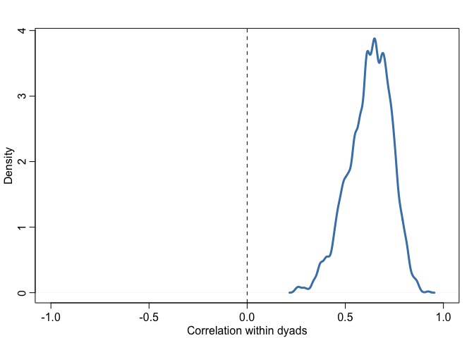
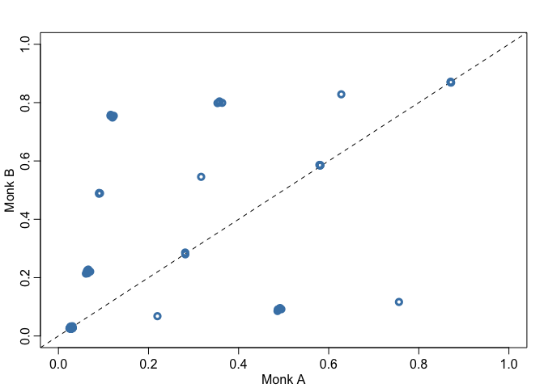
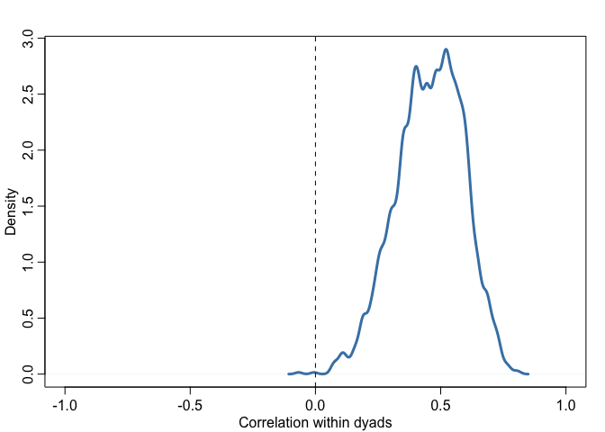
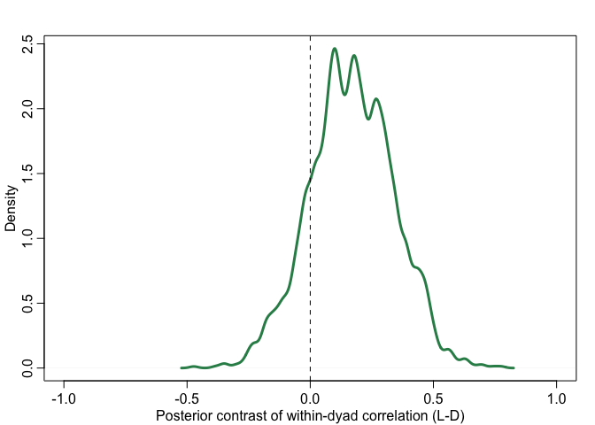
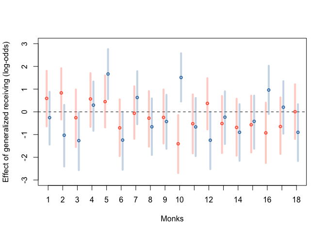
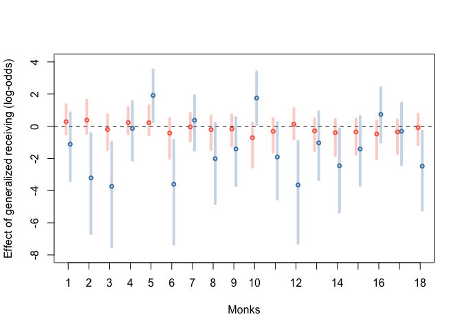
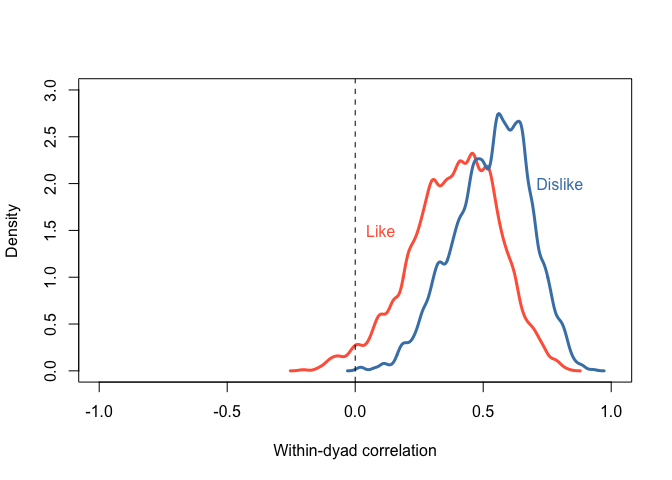
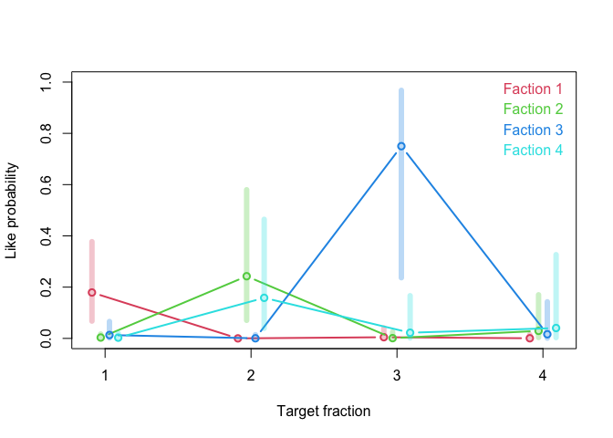
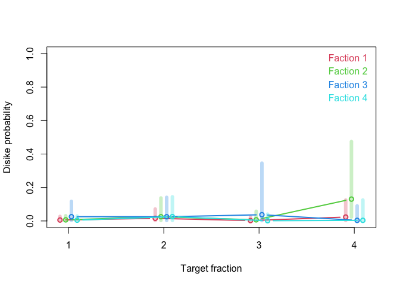

Week 8 Homework
================
Yurun (Ellen) Ying
2022-07-04

## Course homework

### Problem 1

Estimate the amount of reciprocity of likes nominations within dyads.

![\begin{aligned}
L\_{AB} &\sim \mathrm{Binomial}(3, p\_{AB}) \\\\
\mathrm{logit}(p\_{AB}) &= \alpha + T\_{AB}\\\\
L\_{BA} &\sim \mathrm{Binomial}(3, p\_{BA}) \\\\
\mathrm{logit}(p\_{BA}) &= \alpha + T\_{BA} \\\\
\begin{pmatrix}
T\_{AB} \\\\
T\_{BA}
\end{pmatrix} &\sim \mathrm{MVNormal}(
\begin{bmatrix}
0 \\\\
0
\end{bmatrix}, 
\begin{bmatrix}
\sigma^2 & \rho \sigma^2 \\\\
\rho \sigma^2 & \sigma^2
\end{bmatrix}
) \\\\
\alpha &\sim \mathrm{Normal}(0,1) \\\\
\sigma &\sim \mathrm{Exponential}(1) \\\\
\rho &\sim \mathrm{LKJCorr}(2)
\end{aligned}](https://latex.codecogs.com/png.image?%5Cdpi%7B110%7D&space;%5Cbg_white&space;%5Cbegin%7Baligned%7D%0AL_%7BAB%7D%20%26%5Csim%20%5Cmathrm%7BBinomial%7D%283%2C%20p_%7BAB%7D%29%20%5C%5C%0A%5Cmathrm%7Blogit%7D%28p_%7BAB%7D%29%20%26%3D%20%5Calpha%20%2B%20T_%7BAB%7D%5C%5C%0AL_%7BBA%7D%20%26%5Csim%20%5Cmathrm%7BBinomial%7D%283%2C%20p_%7BBA%7D%29%20%5C%5C%0A%5Cmathrm%7Blogit%7D%28p_%7BBA%7D%29%20%26%3D%20%5Calpha%20%2B%20T_%7BBA%7D%20%5C%5C%0A%5Cbegin%7Bpmatrix%7D%0AT_%7BAB%7D%20%5C%5C%0AT_%7BBA%7D%0A%5Cend%7Bpmatrix%7D%20%26%5Csim%20%5Cmathrm%7BMVNormal%7D%28%0A%5Cbegin%7Bbmatrix%7D%0A0%20%5C%5C%0A0%0A%5Cend%7Bbmatrix%7D%2C%20%0A%5Cbegin%7Bbmatrix%7D%0A%5Csigma%5E2%20%26%20%5Crho%20%5Csigma%5E2%20%5C%5C%0A%5Crho%20%5Csigma%5E2%20%26%20%5Csigma%5E2%0A%5Cend%7Bbmatrix%7D%0A%29%20%5C%5C%0A%5Calpha%20%26%5Csim%20%5Cmathrm%7BNormal%7D%280%2C1%29%20%5C%5C%0A%5Csigma%20%26%5Csim%20%5Cmathrm%7BExponential%7D%281%29%20%5C%5C%0A%5Crho%20%26%5Csim%20%5Cmathrm%7BLKJCorr%7D%282%29%0A%5Cend%7Baligned%7D "\begin{aligned}
L_{AB} &\sim \mathrm{Binomial}(3, p_{AB}) \\
\mathrm{logit}(p_{AB}) &= \alpha + T_{AB}\\
L_{BA} &\sim \mathrm{Binomial}(3, p_{BA}) \\
\mathrm{logit}(p_{BA}) &= \alpha + T_{BA} \\
\begin{pmatrix}
T_{AB} \\
T_{BA}
\end{pmatrix} &\sim \mathrm{MVNormal}(
\begin{bmatrix}
0 \\
0
\end{bmatrix}, 
\begin{bmatrix}
\sigma^2 & \rho \sigma^2 \\
\rho \sigma^2 & \sigma^2
\end{bmatrix}
) \\
\alpha &\sim \mathrm{Normal}(0,1) \\
\sigma &\sim \mathrm{Exponential}(1) \\
\rho &\sim \mathrm{LKJCorr}(2)
\end{aligned}")

``` r
dat_like <- list(
  n_dyads = nrow(d),
  D = 1:nrow(d),
  n_time = 3,
  L_AB = d$like_AB,
  L_BA = d$like_BA
)

m1 <- ulam(
  alist(
    L_AB ~ binomial(n_time, pAB),
    logit(pAB) <- a + T[D, 1],
    L_BA ~ binomial(n_time, pBA),
    logit(pBA) <- a + T[D, 2],
    a ~ normal(0,1),
    
    # social ties
    transpars>matrix[n_dyads,2]:T <- compose_noncentered(rep_vector(sigma_T,2), L_Rho_T, Z),
    sigma_T ~ exponential(1),
    cholesky_factor_corr[2]:L_Rho_T ~ lkj_corr_cholesky(2),
    matrix[2,n_dyads]:Z ~ normal(0,1),
    # compose correlation matrix
    gq> matrix[2,2]:Rho_T <<- Chol_to_Corr(L_Rho_T)
  ), data = dat_like, chains = 4, cores = 4
)
```

``` r
precis(m1, 3, pars = c("a", "sigma_T", "Rho_T"))
```

    ##                  mean        sd      5.5%      94.5%    n_eff    Rhat4
    ## a          -4.1963744 0.4082929 -4.845080 -3.5789401 999.1081 1.001243
    ## sigma_T     3.4114251 0.4399469  2.787153  4.1488214 673.0538 1.004676
    ## Rho_T[1,1]  1.0000000 0.0000000  1.000000  1.0000000      NaN      NaN
    ## Rho_T[1,2]  0.6242202 0.1079443  0.439936  0.7811311 675.2742 1.002959
    ## Rho_T[2,1]  0.6242202 0.1079443  0.439936  0.7811311 675.2742 1.002959
    ## Rho_T[2,2]  1.0000000 0.0000000  1.000000  1.0000000      NaN      NaN

``` r
post1 <- extract.samples(m1)

# correlation within dyads
dens(post1$Rho_T[,1,2], xlim = c(-1,1), lwd = 3, col = "steelblue", 
     xlab = "Correlation within dyads")
abline(v = 0, lty = 2)
```

<!-- -->

``` r
# posterior dyads
pA <- inv_logit(sapply(1:nrow(d), function(i) with(post1, a + T[,i,1])))
pA_mu <- apply(pA, 2, mean)
pB <- inv_logit(sapply(1:nrow(d), function(i) with(post1, a + T[,i,2])))
pB_mu <- apply(pB, 2, mean)
plot(NULL, xlim = c(0,1), ylim = c(0,1),
     xlab = "Monk A", ylab = "Monk B")
abline(a = 0, b = 1, lty = 2)
points(pA_mu, pB_mu, lwd = 3, col = "steelblue")
```

<!-- -->

The correlation within dyads has a psoterior mean of 0.63 and ranges
from 0.45 to 0.79.

### Problem 2

Estimate the amount of reciprocity in dislike nominations

``` r
dat_dis <- list(
  n_dyads = nrow(d),
  D = 1:nrow(d),
  n_time = 3,
  D_AB = d$dislike_AB,
  D_BA = d$dislike_BA
)

m2 <- ulam(
  alist(
    D_AB ~ binomial(n_time, pAB),
    logit(pAB) <- a + T[D, 1],
    D_BA ~ binomial(n_time, pBA),
    logit(pBA) <- a + T[D, 2],
    a ~ normal(0,1),
    
    # social ties
    transpars>matrix[n_dyads,2]:T <- compose_noncentered(rep_vector(sigma_T,2), L_Rho_T, Z),
    sigma_T ~ exponential(1),
    cholesky_factor_corr[2]:L_Rho_T ~ lkj_corr_cholesky(2),
    matrix[2,n_dyads]:Z ~ normal(0,1),
    # compose correlation matrix
    gq> matrix[2,2]:Rho_T <<- Chol_to_Corr(L_Rho_T)
  ), data = dat_dis, chains = 4, cores = 4
)
```

``` r
precis(m2, 3, pars = c("a", "sigma_T", "Rho_T"))
```

    ##                  mean        sd       5.5%      94.5%     n_eff    Rhat4
    ## a          -4.4740812 0.4277026 -5.1889889 -3.8299329 1227.8580 1.002325
    ## sigma_T     3.3314910 0.4148979  2.6904185  4.0259614  845.2539 1.004068
    ## Rho_T[1,1]  1.0000000 0.0000000  1.0000000  1.0000000       NaN      NaN
    ## Rho_T[1,2]  0.4557656 0.1330551  0.2341973  0.6533784  568.7875 1.001442
    ## Rho_T[2,1]  0.4557656 0.1330551  0.2341973  0.6533784  568.7875 1.001442
    ## Rho_T[2,2]  1.0000000 0.0000000  1.0000000  1.0000000       NaN      NaN

``` r
post2 <- extract.samples(m2)

# correlation within dyads
dens(post2$Rho_T[,1,2], xlim = c(-1,1), lwd = 3, col = "steelblue",
     xlab = "Correlation within dyads")
abline(v = 0, lty = 2)
```

<!-- -->

``` r
rho_l <- post1$Rho_T[,1,2]; rho_d <- post2$Rho_T[,1,2]
rho_diff <- rho_l - rho_d
dens(rho_diff, xlim = c(-1,1), lwd = 3, col = "seagreen",
     xlab = "Posterior contrast of within-dyad correlation (L-D)")
abline(v = 0, lty = 2)
```

<!-- -->

The amount of reciprocity is higher for like nominations than for
dislike nominations.

### Problem 3

Add generalized receiving to the model and identify any individuals who
are particularly liked/disliked.

Our model in mathematical form:

![\begin{aligned}
L\_{AB} &\sim \mathrm{Binomial}(3, p\_{AB}) \\\\
\mathrm{logit}(p\_{AB}) &= \alpha + T\_{AB} + R_B\\\\
L\_{BA} &\sim \mathrm{Binomial}(3, p\_{BA}) \\\\
\mathrm{logit}(p\_{BA}) &= \alpha + T\_{BA} + R_A\\\\
\begin{pmatrix}
T\_{AB} \\\\
T\_{BA}
\end{pmatrix} &\sim \mathrm{MVNormal}(
\begin{bmatrix}
0 \\\\
0
\end{bmatrix}, 
\begin{bmatrix}
\sigma^2 & \rho \sigma^2 \\\\
\rho \sigma^2 & \sigma^2
\end{bmatrix}
) \\\\
\alpha &\sim \mathrm{Normal}(0,1) \\\\
\sigma &\sim \mathrm{Exponential}(1) \\\\
\rho &\sim \mathrm{LKJCorr}(2) \\\\
R_A,R_B &\sim \mathrm{Normal}(0,1)
\end{aligned}](https://latex.codecogs.com/png.image?%5Cdpi%7B110%7D&space;%5Cbg_white&space;%5Cbegin%7Baligned%7D%0AL_%7BAB%7D%20%26%5Csim%20%5Cmathrm%7BBinomial%7D%283%2C%20p_%7BAB%7D%29%20%5C%5C%0A%5Cmathrm%7Blogit%7D%28p_%7BAB%7D%29%20%26%3D%20%5Calpha%20%2B%20T_%7BAB%7D%20%2B%20R_B%5C%5C%0AL_%7BBA%7D%20%26%5Csim%20%5Cmathrm%7BBinomial%7D%283%2C%20p_%7BBA%7D%29%20%5C%5C%0A%5Cmathrm%7Blogit%7D%28p_%7BBA%7D%29%20%26%3D%20%5Calpha%20%2B%20T_%7BBA%7D%20%2B%20R_A%5C%5C%0A%5Cbegin%7Bpmatrix%7D%0AT_%7BAB%7D%20%5C%5C%0AT_%7BBA%7D%0A%5Cend%7Bpmatrix%7D%20%26%5Csim%20%5Cmathrm%7BMVNormal%7D%28%0A%5Cbegin%7Bbmatrix%7D%0A0%20%5C%5C%0A0%0A%5Cend%7Bbmatrix%7D%2C%20%0A%5Cbegin%7Bbmatrix%7D%0A%5Csigma%5E2%20%26%20%5Crho%20%5Csigma%5E2%20%5C%5C%0A%5Crho%20%5Csigma%5E2%20%26%20%5Csigma%5E2%0A%5Cend%7Bbmatrix%7D%0A%29%20%5C%5C%0A%5Calpha%20%26%5Csim%20%5Cmathrm%7BNormal%7D%280%2C1%29%20%5C%5C%0A%5Csigma%20%26%5Csim%20%5Cmathrm%7BExponential%7D%281%29%20%5C%5C%0A%5Crho%20%26%5Csim%20%5Cmathrm%7BLKJCorr%7D%282%29%20%5C%5C%0AR_A%2CR_B%20%26%5Csim%20%5Cmathrm%7BNormal%7D%280%2C1%29%0A%5Cend%7Baligned%7D "\begin{aligned}
L_{AB} &\sim \mathrm{Binomial}(3, p_{AB}) \\
\mathrm{logit}(p_{AB}) &= \alpha + T_{AB} + R_B\\
L_{BA} &\sim \mathrm{Binomial}(3, p_{BA}) \\
\mathrm{logit}(p_{BA}) &= \alpha + T_{BA} + R_A\\
\begin{pmatrix}
T_{AB} \\
T_{BA}
\end{pmatrix} &\sim \mathrm{MVNormal}(
\begin{bmatrix}
0 \\
0
\end{bmatrix}, 
\begin{bmatrix}
\sigma^2 & \rho \sigma^2 \\
\rho \sigma^2 & \sigma^2
\end{bmatrix}
) \\
\alpha &\sim \mathrm{Normal}(0,1) \\
\sigma &\sim \mathrm{Exponential}(1) \\
\rho &\sim \mathrm{LKJCorr}(2) \\
R_A,R_B &\sim \mathrm{Normal}(0,1)
\end{aligned}")

``` r
dat_LDG <- list(
  n_dyads = nrow(d),
  D = 1:nrow(d),
  n_time = rep(3, nrow(d)),
  n_monks = 18,
  MA = d$A,
  MB = d$B,
  L_AB = d$like_AB,
  L_BA = d$like_BA,
  D_AB = d$dislike_AB,
  D_BA = d$dislike_BA
)

m3L <- ulam(
  alist(
    L_AB ~ binomial(n_time, pAB),
    logit(pAB) <- a + T[D, 1] + R[MB],
    L_BA ~ binomial(n_time, pBA),
    logit(pBA) <- a + T[D, 2] + R[MA],
    a ~ normal(0,1),
    
    # social ties
    transpars>matrix[n_dyads,2]:T <- compose_noncentered(rep_vector(sigma_T,2), L_Rho_T, Z),
    sigma_T ~ exponential(1),
    cholesky_factor_corr[2]:L_Rho_T ~ lkj_corr_cholesky(2),
    matrix[2,n_dyads]:Z ~ normal(0,1),
    # generalized receiving
    vector[n_monks]:R ~ normal(0,1),
    # compose correlation matrix
    gq> matrix[2,2]:Rho_T <<- Chol_to_Corr(L_Rho_T)
  ), data = dat_LDG, chains = 4, cores = 4
)

m3D <- ulam(
  alist(
    D_AB ~ binomial(n_time, pAB),
    logit(pAB) <- a + T[D, 1] + R[MB],
    D_BA ~ binomial(n_time, pBA),
    logit(pBA) <- a + T[D, 2] + R[MA],
    a ~ normal(0,1),
    
    # social ties
    transpars>matrix[n_dyads,2]:T <- compose_noncentered(rep_vector(sigma_T,2), L_Rho_T, Z),
    sigma_T ~ exponential(1),
    cholesky_factor_corr[2]:L_Rho_T ~ lkj_corr_cholesky(2),
    matrix[2,n_dyads]:Z ~ normal(0,1),
    # generalized receiving
    vector[n_monks]:R ~ normal(0,1),
    # compose correlation matrix
    gq> matrix[2,2]:Rho_T <<- Chol_to_Corr(L_Rho_T)
  ), data = dat_LDG, chains = 4, cores = 4
)
```

``` r
post3L <- extract.samples(m3L)
RL_mu <- apply(post3L$R, 2, mean)
RL_PI <- apply(post3L$R, 2, PI)
post3D <- extract.samples(m3D)
RD_mu <- apply(post3D$R, 2, mean)
RD_PI <- apply(post3D$R, 2, PI)

plot(NULL, xlim = c(1, 18), ylim = c(-3,3), xaxt = "n",
     xlab = "Monks", ylab = "Effect of generalized receiving (log-odds)")
axis(1, at = 1:18, labels = 1:18)
abline(h = 0, lty = 2)
for (i in 1:18){
  points(i-0.1, RL_mu[i], lwd = 2, cex = 0.7, col = "tomato")
  lines(rep(i-0.1,2), c(RL_PI[1,i], RL_PI[2,i]), lwd = 4, col = col.alpha("tomato", 0.3))
  points(i+0.1, RD_mu[i], lwd = 2, cex = 0.7, col = "steelblue")
  lines(rep(i+0.1,2), c(RD_PI[1,i], RD_PI[2,i]), lwd = 4, col = col.alpha("steelblue", 0.3))
}
```

<!-- -->

Monk 2 seems to be particularly liked. Monk 10 and Monk 16 seem to be
particularly disliked.

Model D and L as correlated varying effects in one model

``` r
# first model L and D independently
m3LD <- ulam(
  alist(
    # A to B
    L_AB ~ binomial(n_time, pLAB),
    D_AB ~ binomial(n_time, pDAB),
    logit(pLAB) <- aL + TL[D, 1] + RL[MB],
    logit(pDAB) <- aD + TD[D, 1] + RD[MB],
    
    # B to A
    L_BA ~ binomial(n_time, pLBA),
    D_BA ~ binomial(n_time, pDBA),
    logit(pLBA) <- aL + TL[D, 2] + RL[MA],
    logit(pDBA) <- aD + TD[D, 2] + RD[MA],
    
    
    ## linear model
    c(aL,aD) ~ normal(0,1),
    
    # social ties - like
    transpars>matrix[n_dyads,2]:TL <- 
      compose_noncentered(rep_vector(sigma_TL,2), L_Rho_TL, ZTL),
    sigma_TL ~ exponential(1),
    cholesky_factor_corr[2]:L_Rho_TL ~ lkj_corr_cholesky(2),
    matrix[2,n_dyads]:ZTL ~ normal(0,1),
    # social ties - dislike
    transpars>matrix[n_dyads,2]:TD <- 
      compose_noncentered(rep_vector(sigma_TD,2), L_Rho_TD, ZTD),
    sigma_TD ~ exponential(1),
    cholesky_factor_corr[2]:L_Rho_TD ~ lkj_corr_cholesky(2),
    matrix[2,n_dyads]:ZTD ~ normal(0,1),
    
    # generalized receiving
    vector[n_monks]:RL ~ normal(0,1),
    vector[n_monks]:RD ~ normal(0,1),
    
    # compose correlation matrix
    gq> matrix[2,2]:Rho_TL <<- Chol_to_Corr(L_Rho_TL),
    gq> matrix[2,2]:Rho_TD <<- Chol_to_Corr(L_Rho_TD)
  ), data = dat_LDG, chains = 4, cores = 4, log_lik = TRUE
)
```

``` r
# include covarying effects
m3LD_co <- ulam(
  alist(
    # A to B
    L_AB ~ binomial(n_time, pLAB),
    D_AB ~ binomial(n_time, pDAB),
    logit(pLAB) <- aL + TL[D, 1] + R[MB,1],
    logit(pDAB) <- aD + TD[D, 1] + R[MB,2],
    # B to A
    L_BA ~ binomial(n_time, pLBA),
    D_BA ~ binomial(n_time, pDBA),
    logit(pLBA) <- aL + TL[D, 2] + R[MA,1],
    logit(pDBA) <- aD + TD[D, 2] + R[MA,2],
    
    ## linear model
    c(aL,aD) ~ normal(0,1),
    
    # social ties - like
    transpars>matrix[n_dyads,2]:TL <- 
      compose_noncentered(rep_vector(sigma_TL,2), L_Rho_TL, ZTL),
    sigma_TL ~ exponential(1),
    cholesky_factor_corr[2]:L_Rho_TL ~ lkj_corr_cholesky(2),
    matrix[2,n_dyads]:ZTL ~ normal(0,1),
    # social ties - dislike
    transpars>matrix[n_dyads,2]:TD <- 
      compose_noncentered(rep_vector(sigma_TD,2), L_Rho_TD, ZTD),
    sigma_TD ~ exponential(1),
    cholesky_factor_corr[2]:L_Rho_TD ~ lkj_corr_cholesky(2),
    matrix[2,n_dyads]:ZTD ~ normal(0,1),
    
    # generalized receiving
    transpars> matrix[n_monks,2]:R <- 
      compose_noncentered(sigma_R, L_Rho_R, ZR),
    vector[2]:sigma_R ~ exponential(1),
    cholesky_factor_corr[2]:L_Rho_R ~ lkj_corr_cholesky(2),
    matrix[2,n_monks]:ZR ~ normal(0,1),
    
    # compose correlation matrix
    gq> matrix[2,2]:Rho_TL <<- Chol_to_Corr(L_Rho_TL),
    gq> matrix[2,2]:Rho_TD <<- Chol_to_Corr(L_Rho_TD),
    gq> matrix[2,2]:Rho_R <<- Chol_to_Corr(L_Rho_R)
  ), data = dat_LDG, chains = 4, cores = 4, log_lik = TRUE
)
```

``` r
precis(m3LD_co, 3, pars = c("Rho_TL", "Rho_TD", "Rho_R"))
```

    ##                   mean        sd       5.5%     94.5%    n_eff    Rhat4
    ## Rho_TL[1,1] 1.00000000 0.0000000  1.0000000 1.0000000      NaN      NaN
    ## Rho_TL[1,2] 0.65006717 0.1098089  0.4577984 0.8042941 561.1205 1.005829
    ## Rho_TL[2,1] 0.65006717 0.1098089  0.4577984 0.8042941 561.1205 1.005829
    ## Rho_TL[2,2] 1.00000000 0.0000000  1.0000000 1.0000000      NaN      NaN
    ## Rho_TD[1,1] 1.00000000 0.0000000  1.0000000 1.0000000      NaN      NaN
    ## Rho_TD[1,2] 0.52715332 0.1641131  0.2478198 0.7701463 604.2501 1.003412
    ## Rho_TD[2,1] 0.52715332 0.1641131  0.2478198 0.7701463 604.2501 1.003412
    ## Rho_TD[2,2] 1.00000000 0.0000000  1.0000000 1.0000000      NaN      NaN
    ## Rho_R[1,1]  1.00000000 0.0000000  1.0000000 1.0000000      NaN      NaN
    ## Rho_R[1,2]  0.03325143 0.3913412 -0.6226274 0.6600496 240.8675 1.016086
    ## Rho_R[2,1]  0.03325143 0.3913412 -0.6226274 0.6600496 240.8675 1.016086
    ## Rho_R[2,2]  1.00000000 0.0000000  1.0000000 1.0000000      NaN      NaN

The like and dislike of an individual doesn’t seem to be correlated with
each other.

``` r
post3co <- extract.samples(m3LD_co)
RL_mu <- apply(post3co$R[,,1], 2, mean)
RL_PI <- apply(post3co$R[,,1], 2, PI)
RD_mu <- apply(post3co$R[,,2], 2, mean)
RD_PI <- apply(post3co$R[,,2], 2, PI)

plot(NULL, xlim = c(1, 18), ylim = c(-8,4), xaxt = "n",
     xlab = "Monks", ylab = "Effect of generalized receiving (log-odds)")
axis(1, at = 1:18, labels = 1:18)
abline(h = 0, lty = 2)
for (i in 1:18){
  points(i-0.1, RL_mu[i], lwd = 2, cex = 0.7, col = "tomato")
  lines(rep(i-0.1,2), c(RL_PI[1,i], RL_PI[2,i]), lwd = 4, col = col.alpha("tomato", 0.3))
  points(i+0.1, RD_mu[i], lwd = 2, cex = 0.7, col = "steelblue")
  lines(rep(i+0.1,2), c(RD_PI[1,i], RD_PI[2,i]), lwd = 4, col = col.alpha("steelblue", 0.3))
}
```

<!-- -->

The posterior mean of generalized receiving of like and dislike changed.
Monk 5, 10, 12 are particularly disliked, while the liking nominations
are all pretty close to 0.

``` r
waic1 <- WAIC(m3LD, pointwise = TRUE)$WAIC
waic2 <- WAIC(m3LD_co, pointwise = TRUE)$WAIC
sum(waic1 - waic2); PI(waic1 - waic2)
```

    ## [1] -0.7144448

    ##         5%        94% 
    ## -0.1113468  0.1138295

The two models don’t differ in terms of prediction accuracy.

### Problem 4

Consider the influence of faction on liking and disliking

``` r
for (i in 1:nrow(d)){
  
  # A faction
  if (d$A[i] %in% c(1, 2, 7, 12, 14, 15, 16)) {
    d$A_faction[i] <- 1
  } else if (d$A[i] %in% c(4, 5, 6, 9, 11)) {
    d$A_faction[i] <- 2
  } else if (d$A[i] %in% c(3, 17, 18)) {
    d$A_faction[i] <- 3
  } else if (d$A[i] %in% c(8, 10, 13)) {
    d$A_faction[i] <- 4
  }
  
  # B faction
  if (d$B[i] %in% c(1, 2, 7, 12, 14, 15, 16)) {
    d$B_faction[i] <- 1
  } else if (d$B[i] %in% c(4, 5, 6, 9, 11)) {
    d$B_faction[i] <- 2
  } else if (d$B[i] %in% c(3, 17, 18)) {
    d$B_faction[i] <- 3
  } else if (d$B[i] %in% c(8, 10, 13)) {
    d$B_faction[i] <- 4
  }
  
}
```

``` r
# clean dataset
dat_LDGF <- list(
  n_dyads = nrow(d),
  D = 1:nrow(d),
  n_time = rep(3, nrow(d)),
  n_monks = 18,
  MA = d$A,
  MB = d$B,
  FA = d$A_faction,
  FB = d$B_faction,
  L_AB = d$like_AB,
  L_BA = d$like_BA,
  D_AB = d$dislike_AB,
  D_BA = d$dislike_BA
)

# model - assuming any pair of factions has a baseline value of L and D
m4LDGF <- ulam(
  alist(
    # A to B
    L_AB ~ binomial(n_time, pLAB),
    D_AB ~ binomial(n_time, pDAB),
    logit(pLAB) <- aL[FA,FB] + TL[D, 1] + RL[MB],
    logit(pDAB) <- aD[FA,FB] + TD[D, 1] + RD[MB],
    
    # B to A
    L_BA ~ binomial(n_time, pLBA),
    D_BA ~ binomial(n_time, pDBA),
    logit(pLBA) <- aL[FB,FA] + TL[D, 2] + RL[MA],
    logit(pDBA) <- aD[FB,FA] + TD[D, 2] + RD[MA],
    
    # faction effect - L
    transpars> matrix[4,4]:aL <- 
      compose_noncentered(sigma_aL, L_Rho_aL, ZaL),
    vector[4]:sigma_aL ~ exponential(1),
    cholesky_factor_corr[4]:L_Rho_aL ~ lkj_corr_cholesky(2),
    matrix[4,4]:ZaL ~ normal(0,1),
    
    # faction effect - D
    transpars> matrix[4,4]:aD <- 
      compose_noncentered(sigma_aD, L_Rho_aD, ZaD),
    vector[4]:sigma_aD ~ exponential(1),
    cholesky_factor_corr[4]:L_Rho_aD ~ lkj_corr_cholesky(2),
    matrix[4,4]:ZaD ~ normal(0,1),
    
    # corr matrix
    gq> matrix[4,4]:Rho_aL <<- Chol_to_Corr(L_Rho_aL),
    gq> matrix[4,4]:Rho_aD <<- Chol_to_Corr(L_Rho_aD),
    
    # social ties - like
    transpars> matrix[n_dyads,2]:TL <- 
      compose_noncentered(rep_vector(sigma_TL,2), L_Rho_TL, ZTL),
    sigma_TL ~ exponential(1),
    cholesky_factor_corr[2]:L_Rho_TL ~ lkj_corr_cholesky(2),
    matrix[2,n_dyads]:ZTL ~ normal(0,1),
    # social ties - dislike
    transpars> matrix[n_dyads,2]:TD <- 
      compose_noncentered(rep_vector(sigma_TD,2), L_Rho_TD, ZTD),
    sigma_TD ~ exponential(1),
    cholesky_factor_corr[2]:L_Rho_TD ~ lkj_corr_cholesky(2),
    matrix[2,n_dyads]:ZTD ~ normal(0,1),
    
    # generalized receiving
    vector[n_monks]:RL ~ normal(0,1),
    vector[n_monks]:RD ~ normal(0,1),
    
    # compose correlation matrix
    gq> matrix[2,2]:Rho_TL <<- Chol_to_Corr(L_Rho_TL),
    gq> matrix[2,2]:Rho_TD <<- Chol_to_Corr(L_Rho_TD)
  ), data = dat_LDGF, chains = 4, cores = 4
)
```

``` r
precis(m4LDGF, 3, pars = c("Rho_TL", "Rho_TD"))
```

    ##                  mean        sd       5.5%     94.5%    n_eff    Rhat4
    ## Rho_TL[1,1] 1.0000000 0.0000000 1.00000000 1.0000000      NaN      NaN
    ## Rho_TL[1,2] 0.3879792 0.1715965 0.09333318 0.6418403 515.6938 1.004892
    ## Rho_TL[2,1] 0.3879792 0.1715965 0.09333318 0.6418403 515.6938 1.004892
    ## Rho_TL[2,2] 1.0000000 0.0000000 1.00000000 1.0000000      NaN      NaN
    ## Rho_TD[1,1] 1.0000000 0.0000000 1.00000000 1.0000000      NaN      NaN
    ## Rho_TD[1,2] 0.5324884 0.1486023 0.27717560 0.7536246 581.0288 1.010394
    ## Rho_TD[2,1] 0.5324884 0.1486023 0.27717560 0.7536246 581.0288 1.010394
    ## Rho_TD[2,2] 1.0000000 0.0000000 1.00000000 1.0000000      NaN      NaN

``` r
post4 <- extract.samples(m4LDGF)
plot(NULL, xlim = c(-1,1), ylim = c(0,3),
  xlab = "Within-dyad correlation", ylab = "Density")
dens(post4$Rho_TL[,1,2], lwd = 3, col = "tomato", add = TRUE)
dens(post4$Rho_TD[,1,2], lwd = 3, col = "steelblue", add = TRUE)
abline(v = 0, lty = 2)
text(0.1, 1.5, "Like", col = "tomato")
text(0.8, 2, "Dislike", col = "steelblue")
```

<!-- -->

The reciprocity of both liking and dislike is still reliably over 0
after counting for faction membership.

``` r
aL_mu <- inv_logit(apply(post4$aL, 2:3, mean))
aL_PI <- inv_logit(apply(post4$aL, 2:3, PI))

# posterior like probability
plot(NULL, xlim = c(0.9,4.1), ylim = c(0,1), xaxt = 'n',
     xlab = "Target fraction", ylab = "Like probability")
axis(1, at = 1:4, labels = 1:4)
for (i in 1:4) {
  
  points(1:4 + 0.06*(i-2.5), aL_mu[i,], type = "b", col = i+1, lwd = 2)
  for (j in 1:4) lines(rep(j+0.06*(i-2.5),2), c(aL_PI[1,i,j], aL_PI[2,i,j]), 
                       col = col.alpha(i+1, 0.3), lwd = 6)
  
  text(4.2,1.05-0.08*i, paste("Faction", i), col = i+1, pos = 2)
}
```

<!-- -->

``` r
aD_mu <- inv_logit(apply(post4$aD, 2:3, mean))
aD_PI <- inv_logit(apply(post4$aD, 2:3, PI))

# posterior dislike probability
plot(NULL, xlim = c(0.9,4.1), ylim = c(0,1), xaxt = 'n',
     xlab = "Target fraction", ylab = "Disike probability")
axis(1, at = 1:4, labels = 1:4)
for (i in 1:4) {
  
  points(1:4 + 0.06*(i-2.5), aD_mu[i,], type = "b", col = i+1, lwd = 2)
  for (j in 1:4) lines(rep(j+0.06*(i-2.5),2), c(aD_PI[1,i,j], aD_PI[2,i,j]), 
                       col = col.alpha(i+1, 0.3), lwd = 6)
  
  text(4.2,1.05-0.08*i, paste("Faction", i), col = i+1, pos = 2)
}
```

<!-- -->

Each faction has a higher probability to like individuals from the same
faction. Factions don’t seem to dislike other factions more, except that
faction 2 members hate faction 4 members more than they do to others.
