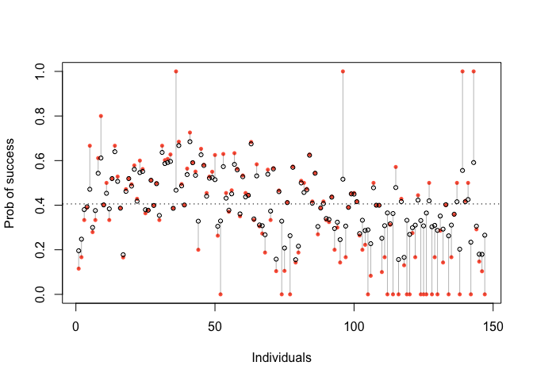
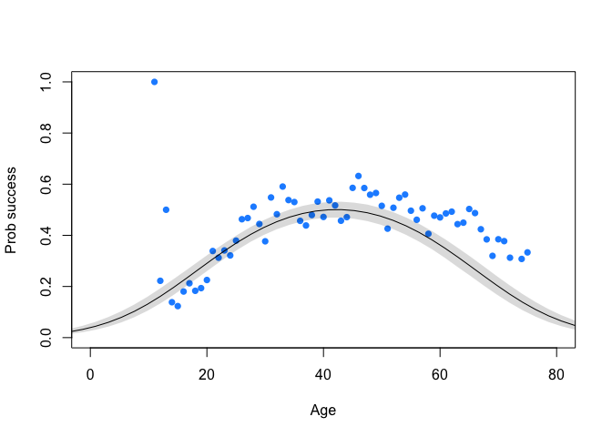
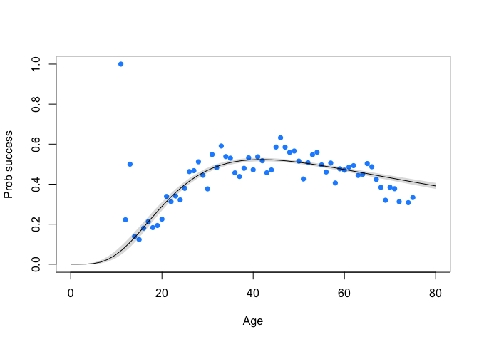
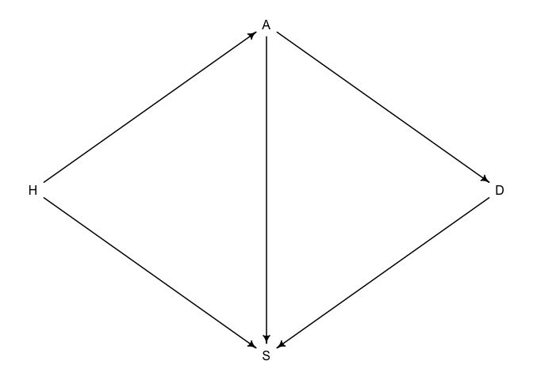
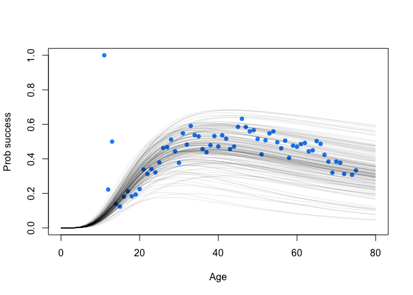
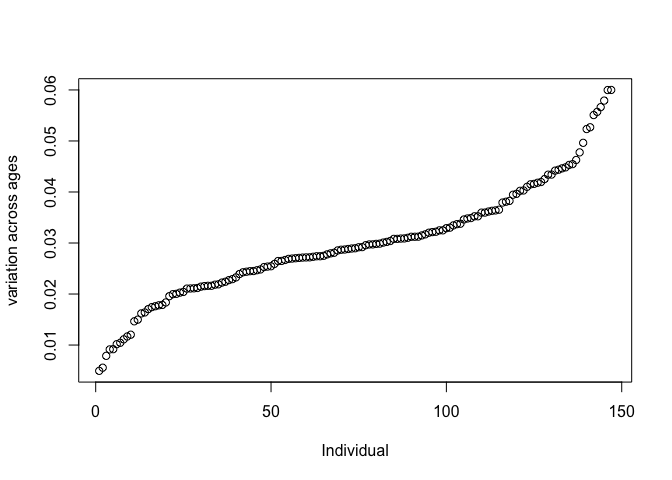
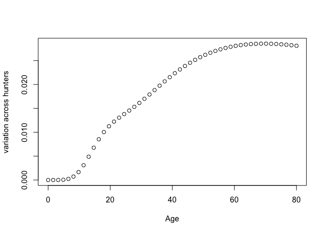
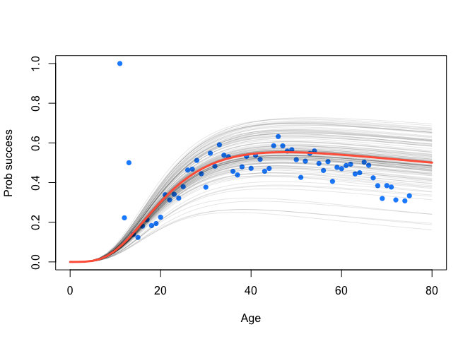
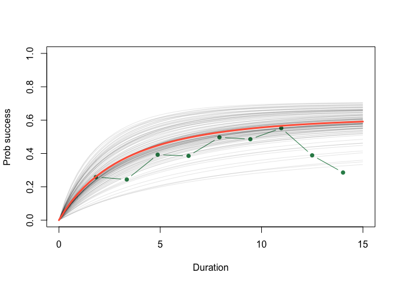
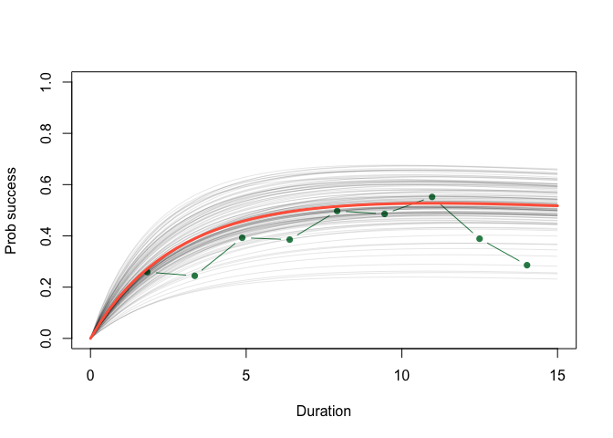

Week 9 Homework
================
Yurun (Ellen) Ying
2022-07-10

## Course Homework

``` r
data("Achehunting")
d <- Achehunting
d$A <- standardize(d$age)
d$S <- as.integer(ifelse(d$kg.meat != 0, 1, 0))

id <- unique(d$id)
I <- c()
for (i in 1:length(id)) I[which(d$id == id[i])] <- i
```

### Problem 1

Estimating the effect of age on success.

``` r
# a clean dataset
dat1 <- list(
  id = as.integer(I),
  A = d$A,
  S = d$S
)
```

``` r
# priors
# N <- 1e3
# mu <- rnorm(N,0,1)
# sigma <- rexp(N,1)
# a <- rnorm(N, mu, sigma)
# bA <- rnorm(N, 0, 0.5)
# M <- rnorm(N, 0, 0.5)
# # a
# dens(inv_logit(a),  xlab = "prob of success", ylab = "Density")
# # bA
# plot(NULL, xlim = c(-2,2), ylim = c(0,1), xlab = "Age", ylab = "Prob of success")
# for (i in 1:30) curve(inv_logit(a[i] + bA[i]*(x - M[i])^2), from = -2, to = 2,
#                      col = col.alpha("black", 0.3), add = TRUE)

# aD <- rbeta(N, 4, 4)
# # bAD_mu <- rnorm(N, 0, 0.5)
# # vAD <- rexp(N, 1)
# # bAD <- exp(bAD_mu + vAD)
# bAD <- abs(rnorm(N, 0, 1))
# plot(NULL, xlim = c(0,1), ylim = c(0,1), xlab = "Age", ylab = "Duration")
# for (i in 1:30) curve(aD[i]*(1 - exp(-bAD[i]*x)), from = 0, to = 1,
#                       col = col.alpha("black", 0.3), add = TRUE)
```

``` r
# first an empty model partial pooling on individual
m1.1_list <- alist(
  S ~ binomial(1, p),
  logit(p) <- a[id],
  a[id] ~ normal(abar, sigma),
  abar ~ normal(0,1),
  sigma ~ exponential(1)
)

#m1.1 <- ulam(flist = m1.1_list, data = dat1, chains = 4, cores = 4)
load("week9_m1.1.RData")
```

``` r
post1.1 <- extract.samples(m1.1)
posta_mu <- apply(inv_logit(post1.1$a), 2, mean)
posta_PI <- apply(inv_logit(post1.1$a), 2, PI)

# empirical data
p <- c()
for (i in 1:length(id)) p[i]  <- sum(dat1$S[dat1$id == i])/sum(dat1$id == i)

plot(NULL, xlim = c(1,147), ylim = c(0,1), xlab = "Individuals", ylab = "Prob of success")
abline(h = mean(posta_mu), lty = 3)
points(1:147, p, pch = 16, cex = 0.7, col = "tomato")
points(1:147, posta_mu, cex = 0.7)
for (i in 1:length(posta_mu)) lines(rep(i,2), c(p[i], posta_mu[i]), 
                                     col = col.alpha("black", 0.3))
```

<!-- -->

We now add the model for age. We will assume a quadratic relationship
between age and success. An age where success peaks can be captured by
parameter M.

``` r
# model age
m1.2_list <- alist(
  S ~ binomial(1, p),
  logit(p) <- a[id] + bA*(A - M)^2,
  bA ~ normal(0, 0.5),
  M ~ normal(0, 0.5),
  a[id] ~ normal(abar, sigma),
  abar ~ normal(0,1),
  sigma ~ exponential(1)
)

#m1.2 <- ulam(flist = m1.2_list, data = dat1, chains = 4, cores = 4)
load("week9_m1.2.RData")
```

``` r
post1.2 <- extract.samples(m1.2)
A_seq <- seq(-4, 4, len = 50)
post_p <- sapply(1:50, function(i) with(post1.2,
                                        inv_logit(abar + bA*(A_seq[i] - M)^2)))
p_mu <- apply(post_p, 2, mean)
p_PI <- apply(post_p, 2, PI)

# plotting raw data
unique_A <- unique(d$age)
p_A <- c()
for (i in 1:length(unique_A)) p_A[i]  <- sum(d$S[d$age == unique_A[i]])/sum(d$age == unique_A[i])
plot(unique_A, p_A, xlim = c(0,80), ylim = c(0,1), pch = 16, col = "dodgerblue",
     xlab = "Age", ylab = "Prob success")
# posterior mean
lines(A_seq*13.6 + 46.4, p_mu)
shade(p_PI, A_seq*13.6 + 46.4)
```

<!-- -->

#### Improvement

Polynomials make sense but we can do better. We will use growth model to
model the non-monotonic relations. (Also really no need to model
individuals in this question…)

We will use a functional relation that can represent a trend that
increases first and then decreases. It will also impose an increasing
return on the increasing portion of the curve:

 = \alpha(1 - \mathrm{exp}(-\beta_1 A))^\gamma \mathrm{exp}(-\beta_2 A)")

``` r
dat1.1 <- list(
  A = d$age / 80,
  S = d$S
)

m1.3_list <- alist(
  S ~ binomial(1, p),
  p <- a*exp(-b2 * A)*(1 - exp(-b1*A))^g,
  a ~ beta(4, 4),
  c(b1,b2) ~ exponential(2),
  g ~ exponential(0.5)
)

#m1.3 <- ulam(flist = m1.3_list, data = dat1.1, chains = 4, cores = 4)
load("week9_m1.3.RData")
```

Plot the posterior mean

``` r
post1.3 <- extract.samples(m1.2)
A_seq <- seq(0, 1, len = 50)
post_p <- link(m1.3, data = list(A = A_seq))
postp_mu <- apply(post_p, 2, mean)
postp_PI <- apply(post_p, 2, PI)

# raw data
plot(unique_A, p_A, xlim = c(0,80), ylim = c(0,1), pch = 16, col = "dodgerblue",
     xlab = "Age", ylab = "Prob success")
lines(A_seq*80, postp_mu)
shade(postp_PI, A_seq*80)
```

<!-- -->

This model fits the data better.

### Problem 2

Incorporate individual varying effects in the previous model.

Let’s draw a DAG first to represent the causal relations of all variable

``` r
dag1 <- dagitty("dag{H -> A -> S <- H; A -> D -> S}")
coordinates(dag1) <- list(x = c(A = 0.5, S = 0.5, H = 0.4, D = 0.6),
                          y = c(A = 0.4, S = 0.6, H = 0.5, D = 0.5))
drawdag(dag1)
```

<!-- -->

``` r
# a new data
dat2 <- list(
  id = as.integer(I),
  A = d$age / 80,
  S = d$S,
  nh = max(I)
)
```

``` r
m2_list <- alist(
  S ~ binomial(1, p),
  p <- a*exp(-b2[id] * A)*(1 - exp(-b1[id] * A))^g,
  # transform b1 and b2
  transpars> vector[nh]:b1 <<- exp(b1_mu + V[1:nh, 1]),
  transpars> vector[nh]:b2 <<- exp(b2_mu + V[1:nh, 2]),
  # non-centered prior
  transpars> matrix[nh,2]:V <- compose_noncentered(sigma_V, L_Rho_V, Z),
  vector[2]:sigma_V ~ exponential(1),
  cholesky_factor_corr[2]:L_Rho_V ~ lkj_corr_cholesky(2),
  matrix[2,nh]:Z ~ normal(0,1),
  a ~ beta(4, 4),
  c(b1_mu,b2_mu) ~ normal(0, 0.5),
  g ~ exponential(0.5),
  gq> matrix[2,2]:Rho_V <<- Chol_to_Corr(L_Rho_V)
)

#m2 <- ulam(flist = m2_list, data = dat2, chains = 4, cores = 4, log_lik = TRUE)
#save(m2, file = "week9_m2.RData")
load("week9_m2.RData")
precis(m2, 3, pars = c("a","g", "b1_mu","b2_mu", "sigma_V"))
```

There is more variation in

than in
.
Hunters differ more in their decline rates than their increasing rates.

``` r
post2 <- extract.samples(m2)
A_seq <- seq(0, 1, len = 50)
post_p2 <- array(dim = c(2e3, length(A_seq), max(I)))
# compute the mean of posterior prediction for each hunter
for (i in 1:max(I)) {
  p <- with(post2,
       sapply(1:length(A_seq), 
              function(j) a*exp(-b2[,i]*A_seq[j])*(1 - exp(-b1[,i]*A_seq[j]))^g)
  )
  post_p2[,,i] <- p
}

# plot the posterior prediction against raw data
plot(unique_A, p_A, xlim = c(0,80), ylim = c(0,1), pch = 16, col = "dodgerblue",
     xlab = "Age", ylab = "Prob success")
for(i in 1:max(I)) lines(A_seq*80, apply(post_p2[,,i], 2, mean), col = col.alpha("black", 0.1))
```

<!-- -->

There is much variation among hunters.

#### Additional question

How much variation in success is explained by age and how much by
individual?

This question is essentially asking you to compute the variation across
age averaged over hunters, and variation across hunters average the
whole span of age

``` r
# variation across ages 
varA <- rep(0, max(I))
for (i in 1:max(I)) varA[i] <- mean(apply(post_p2[,,i], 1, var))

# variation across hunters 
varH <- rep(0, length(A_seq))
for (i in 1:length(A_seq)) varH[i] <- mean(apply(post_p2[,i,], 1, var))
# averaged over hunters and ages repsectively
mean(varA); mean(varH)
```

    ## [1] 0.02993254

    ## [1] 0.0184863

The variation across ages is higher than the variation across hunters

``` r
plot(1:max(I), sort(varA), xlab = "Individual", ylab = "variation across ages")
```

<!-- -->

``` r
plot(A_seq*80, varH, xlab = "Age", ylab = "variation across hunters")
```

<!-- -->

Hunters differ in variation across ages (better hunters change more
during their life time). Older hunters differ more across individuals. A
problem with this approach is that in the empirical sample, not all
individuals live to 80 years old. Individuals of older ages won’t
contribute to the variation in the sample as much as individuals of
younger age.

### Problem 3

Include trip duration to the model. Compare the model results of a
complete case analysis and an analysis imputing missing values.

#### Complete case analysis

``` r
dd <- d[complete.cases(d$hours),]
id_cc <- unique(dd$id)
I_cc <- c()
for (i in 1:length(id_cc)) I_cc[which(dd$id == id_cc[i])] <- i

# clean data
dat3.1 <- list(
  id = as.integer(I_cc),
  A = dd$age / 80,
  S = dd$S,
  D = dd$hours / 15,
  nh = max(I_cc)
)
```

We will assume a trend where the success rate increases with duration of
hunting.

``` r
# S is a model of A and D
m3.1_list <- alist(
  S ~ bernoulli(p),
  p <- a * (1 - exp(-bD[id]*D)) * exp(-bA2[id]*A) * (1 - exp(-bA1[id]*A))^g,
  # transform bA1, bA2 and bD
  transpars> vector[nh]:bA1 <<- exp(bA1_mu + V[1:nh, 1]),
  transpars> vector[nh]:bA2 <<- exp(bA2_mu + V[1:nh, 2]),
  transpars> vector[nh]:bD <<- exp(bD_mu + V[1:nh, 3]),
  # non-centered prior
  transpars> matrix[nh,3]:V <- compose_noncentered(sigma_V, L_Rho_V, Z),
  vector[3]:sigma_V ~ exponential(1),
  cholesky_factor_corr[3]:L_Rho_V ~ lkj_corr_cholesky(2),
  matrix[3,nh]:Z ~ normal(0,1),
  a ~ beta(4, 4),
  c(bA1_mu,bA2_mu,bD_mu) ~ normal(0, 0.5),
  g ~ exponential(0.5),
  gq> matrix[3,3]:Rho_V <<- Chol_to_Corr(L_Rho_V)
)

#m3.1 <- ulam(flist = m3.1_list, data = dat3.1, chains = 4, cores = 4, log_lik = TRUE)
#save(m3.1, file = "week9_m3.1.RData")
load("week9_m3.1.RData")
precis(m3.1, 3, pars = c("a","g", "bA1_mu","bA2_mu", "bD_mu", "sigma_V"))
```

Posterior prediction of the relation between A and S.

``` r
post3.1 <- extract.samples(m3.1)
A_seq <- seq(0, 1, len = 50)
D <- 0.5
post_p3.1A <- array(dim = c(2e3, length(A_seq), max(I_cc)))
# compute the mean of posterior prediction for each hunter
for (i in 1:max(I_cc)) {
  p <- with(post3.1,
       sapply(1:length(A_seq), 
              function(j) a*(1 - exp(-bD[,i] * D))*
                exp(-bA2[,i]*A_seq[j])*(1 - exp(-bA1[,i]*A_seq[j]))^g)
  )
  post_p3.1A[,,i] <- p
}

# A-S
plot(unique_A, p_A, xlim = c(0,80), ylim = c(0,1), pch = 16, col = "dodgerblue",
     xlab = "Age", ylab = "Prob success")
for(i in 1:max(I_cc)) lines(A_seq*80, apply(post_p3.1A[,,i], 2, mean), col = col.alpha("black", 0.1))
lines(A_seq*80, apply(post_p3.1A, 2, mean), lwd = 3, col = "tomato")
```

<!-- -->

Posterior prediction of the relation between D and S.

``` r
D_seq <- seq(0, 1, len = 50)
A <- mean(dat3.1$A)
post_p3.1D <- array(dim = c(2e3, length(D_seq), max(I_cc)))
# compute the mean of posterior prediction for each hunter
for (i in 1:max(I_cc)) {
  p <- with(post3.1,
       sapply(1:length(D_seq), 
              function(j) a*(1-exp(-bD[,i]*D_seq[j]))*exp(-bA2[,i]*A)*(1 - exp(-bA1[,i]*A))^g)
  )
  post_p3.1D[,,i] <- p
}

# plot the raw data
cut_D <- seq(min(dd$hours), max(dd$hours), len = 10)
p_D <- c()
for (i in 1:length(cut_D)-1) {
  idx <- which(dd$hours > cut_D[i] & dd$hours < cut_D[i+1])
  p_D[i]  <- sum(dd$S[idx])/length(idx)
}
  
plot(cut_D[-1], p_D, xlim = c(0,15), ylim = c(0,1), 
     type = "b", pch = 16, col = "seagreen",
     xlab = "Duration", ylab = "Prob success")
# posterior prediction of S by D
for(i in 1:max(I_cc)) lines(D_seq*15, apply(post_p3.1D[,,i], 2, mean), col = col.alpha("black", 0.1))
lines(D_seq*15, apply(post_p3.1D, 2, mean), lwd = 3, col = "tomato")
```

<!-- -->

The model doesn’t seem to capture the trend of decreasing in success
rate when duration is long. So let’s modify.

``` r
# S is a model of A and D
m3.1b_list <- alist(
  S ~ bernoulli(p),
  p <- a * exp(-bD2[id]*D) * (1 - exp(-bD1[id]*D)) * exp(-bA2[id]*A) * (1 - exp(-bA1[id]*A))^g,
  # transform bA1, bA2 and bD
  transpars> vector[nh]:bA1 <<- exp(bA1_mu + V[1:nh, 1]),
  transpars> vector[nh]:bA2 <<- exp(bA2_mu + V[1:nh, 2]),
  transpars> vector[nh]:bD1 <<- exp(bD1_mu + V[1:nh, 3]),
  transpars> vector[nh]:bD2 <<- exp(bD2_mu + V[1:nh, 4]),
  # non-centered prior
  transpars> matrix[nh,4]:V <- compose_noncentered(sigma_V, L_Rho_V, Z),
  vector[4]:sigma_V ~ exponential(1),
  cholesky_factor_corr[4]:L_Rho_V ~ lkj_corr_cholesky(2),
  matrix[4,nh]:Z ~ normal(0,1),
  a ~ beta(4, 4),
  c(bA1_mu,bA2_mu,bD1_mu,bD2_mu) ~ normal(0, 0.5),
  g ~ exponential(0.5),
  gq> matrix[4,4]:Rho_V <<- Chol_to_Corr(L_Rho_V)
)

#m3.1b <- ulam(flist = m3.1b_list, data = dat3.1, chains = 4, cores = 4, log_lik = TRUE)
#save(m3.1b, file = "week9_m3.1b.RData")
load("week9_m3.1b.RData")
```

``` r
post3.1b <- extract.samples(m3.1b)
D_seq <- seq(0, 1, len = 50)
A <- mean(dat3.1$A)
post_p3.1bD <- array(dim = c(2e3, length(D_seq), max(I_cc)))
# compute the mean of posterior prediction for each hunter
for (i in 1:max(I_cc)) {
  p <- with(post3.1b,
       sapply(1:length(D_seq), 
              function(j) a * exp(-bD2[,i]*D_seq[j]) * (1-exp(-bD1[,i]*D_seq[j]))*
                exp(-bA2[,i]*A) * (1 - exp(-bA1[,i]*A))^g)
  )
  post_p3.1bD[,,i] <- p
}

# posterior prediction of S by D
plot(cut_D[-1], p_D, xlim = c(0,15), ylim = c(0,1), 
     type = "b", pch = 16, col = "seagreen",
     xlab = "Duration", ylab = "Prob success")
for(i in 1:max(I_cc)) lines(D_seq*15, apply(post_p3.1bD[,,i], 2, mean), col = col.alpha("black", 0.1))
lines(D_seq*15, apply(post_p3.1bD, 2, mean), lwd = 3, col = "tomato")
```

<!-- -->

The new model does not complete capture the trend and it in fact makes
worse predictions than the first one. So we will proceed with the first
functional relation.

``` r
compare(m3.1,m3.1b)
```

    ##           WAIC       SE    dWAIC      dSE    pWAIC    weight
    ## m3.1  2869.765 33.64968 0.000000       NA 56.13615 0.8407886
    ## m3.1b 2873.093 32.64596 3.328214 2.774983 55.00791 0.1592114

#### Bayesian imputation

``` r
# a clean data 
dat3.2 <- list(
  id = as.integer(I),
  A = d$age / 80,
  S = d$S,
  D = d$hours / 15,
  nh = max(I)
)
```

``` r
# This model doesn't run well since some p values turn out to be negative
# m3.2_list <- alist(
#   # model of S
#   S ~ bernoulli(p),
#   p <- a * (1 - exp(-bD[id]*D)) * exp(-bA2[id]*A) * (1 - exp(-bA1[id]*A))^g,
#   # model of D
#   D ~ half_normal(nu, sigma_D),
#   nu <- aD * (1 - exp(-bAD * A)),
#   
#   # transform bA1, bA2, bD, and bAD
#   transpars> vector[nh]:bA1 <<- exp(bA1_mu + V[1:nh, 1]),
#   transpars> vector[nh]:bA2 <<- exp(bA2_mu + V[1:nh, 2]),
#   transpars> vector[nh]:bD <<- exp(bD_mu + V[1:nh, 3]),
#   # non-centered prior
#   transpars> matrix[nh,3]:V <- compose_noncentered(sigma_V, L_Rho_V, Z),
#   vector[3]:sigma_V ~ exponential(1),
#   cholesky_factor_corr[3]:L_Rho_V ~ lkj_corr_cholesky(2),
#   matrix[3,nh]:Z ~ normal(0,1),
#   c(a,aD) ~ beta(4, 4),
#   c(bA1_mu,bA2_mu,bD_mu) ~ normal(0, 0.5),
#   g ~ exponential(0.5),
#   bAD ~ normal(0,1),
#   sigma_D ~ exponential(1),
#   gq> matrix[3,3]:Rho_V <<- Chol_to_Corr(L_Rho_V)
# )
# 
# m3.2 <- ulam(flist = m3.2_list, data = dat3.2, chains = 4, cores = 4, log_lik = TRUE,
#              constraints = list(D = "lower=0", bAD = "lower=0"))
```

#### Improvements

How to incorporate duration into the model needs some thinking. This is
all about what function links the model of S we already have and a
probability adjusted by D.

This is the function we’ve been using so far:

 = \alpha(1 - \mathrm{exp}(-\beta_1 A))^\gamma \mathrm{exp}(-\beta_2 A)")

This can be the probability of S when the duration
.
Let’s model the number of animals one gets after

hours of hunting as a Poisson distribution with rate:

")

The probability density function:

 = \frac{\theta^y \mathrm{exp}(-\theta)}{y!}")

The probability of getting 0 animal will be:

 = \frac{\theta^0 \mathrm{exp}(-\theta)}{0!} = \mathrm{exp}(-\theta)")

The probability of getting at least one animal will be:

 = 1 - \mathrm{exp}(-\theta)")

This will be the function of

parameter of the bernoulli distribution generating S.

 &= 1 - \mathrm{exp}(-D^\lambda p(A)) \\
p(A) &= (1 - \mathrm{exp}(-\beta_1 A))^\gamma \mathrm{exp}(-\beta_2 A)
\end{aligned}")


was dropped because the height of the curve is already adjusted by


``` r
m3_list <- alist(
  S ~ bernoulli(p),
  # functional relation
  p <- 1 - exp(- exp(lambda * log_D) * f),
  f <- exp(-b2[id] * A)*(1 - exp(-b1[id] * A))^g,
  
  # transform b1 and b2
  transpars> vector[nh]:b1 <<- exp(b1_mu + V[1:nh, 1]),
  transpars> vector[nh]:b2 <<- exp(b2_mu + V[1:nh, 2]),
  # non-centered prior
  transpars> matrix[nh,2]:V <- compose_noncentered(sigma_V, L_Rho_V, Z),
  vector[2]:sigma_V ~ exponential(1),
  cholesky_factor_corr[2]:L_Rho_V ~ lkj_corr_cholesky(2),
  matrix[2,nh]:Z ~ normal(0,1),
  
  # duration prior
  log_D ~ normal(muD, sigmaD),
  muD ~ normal(-1, 0.25),
  sigmaD ~ exponential(2),
  # fixed priors
  lambda ~ exponential(1),
  c(b1_mu,b2_mu) ~ normal(0, 0.5),
  g ~ exponential(0.5),
  gq> matrix[2,2]:Rho_V <<- Chol_to_Corr(L_Rho_V)
)
```

``` r
# complete cases analysis
# clean data
dat3_cc <- list(
  id = as.integer(I_cc),
  A = dd$age / 80,
  S = dd$S,
  log_D = log(dd$hours / 15),
  nh = max(I_cc)
)

#m3_cc <- ulam(flist = m3_list, data = dat3_cc, chains = 4, cores = 4, log_lik = TRUE)
#save(m3_cc, file = "week9_m3_cc.RData")
load("week9_m3_cc.RData")
precis(m3_cc, 2, pars = c("g", "b1_mu","b2_mu", "lambda", "muD", "sigmaD", "sigma_V"))
```

    ##                  mean          sd        5.5%      94.5%     n_eff     Rhat4
    ## g           7.3989194 2.404525910  4.05266775 11.5373200  918.7025 1.0020044
    ## b1_mu       2.1776767 0.149562607  1.92496405  2.3960793  699.3168 1.0046781
    ## b2_mu      -1.3808754 0.291877627 -1.85122165 -0.9338699 1507.9325 0.9997358
    ## lambda      0.1332586 0.047587275  0.05777230  0.2100589 1367.5156 1.0032787
    ## muD        -0.8659478 0.010095207 -0.88221220 -0.8497694 3321.0660 0.9999806
    ## sigmaD      0.4720294 0.007279556  0.46065858  0.4837349 3046.8681 0.9983322
    ## sigma_V[1]  0.1938488 0.087924427  0.06952014  0.3450166  451.1066 1.0109967
    ## sigma_V[2]  1.2968297 0.271596541  0.90109623  1.7466127  754.3954 1.0009611

``` r
# the full sample
dat3_all <- list(
  id = as.integer(I),
  A = d$age / 80,
  S = d$S,
  log_D = log(d$hours / 15),
  nh = max(I)
)

#m3_all <- ulam(flist = m3_list, data = dat3_all, chains = 4, cores = 4, log_lik = TRUE)
# load("week9_m3_all.RData")
# precis(m3_all, 2, pars = c("g", "b1_mu","b2_mu", "lambda", "muD", "sigmaD", "sigma_V"))
```

There are some differences between complete case analysis and the
analysis on the full sample. But the variance component is similar -
there is more variation among individuals in the declining rate that in
the increasing rate.

Let’s see how the predictors are associated with each other.

``` r
# post3_all <- extract.samples(m3_all)
# f <- function(x, a, b1, b2, g) a*exp(-b2*x)*(1 - exp(-b1*x))^g
# plot(NULL, xlim = c(-4,0), ylim = c(0,1),
#      xlab = "log trip duration", ylab = "probability sucess")
# for (i in 1:20){
#   with(post3_all,
#       curve(1 - exp(-exp(x * lambda[i]) * 
#               f(0.5, a = 1, b1 = exp(b1_mu[i]), b2 = exp(b2_mu[i]), g = g[i])),
#             from = -4, to = 0,
#             lwd = 3, col = "tomato", add = TRUE)
#       )
# }
```

Trip duration doesn’t affect success much.
